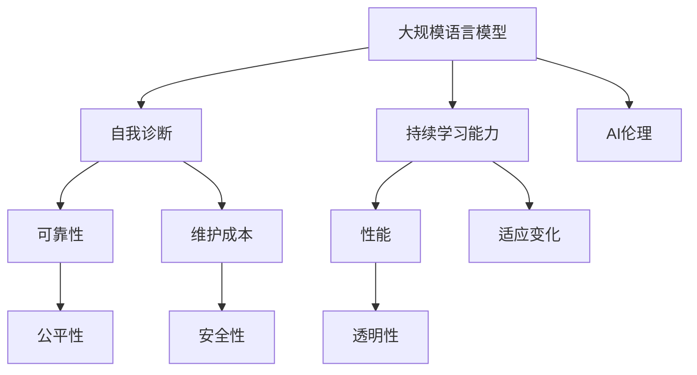
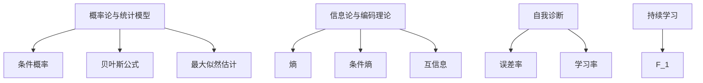

                 


### 一、理解用户需求

用户希望撰写一篇关于“大规模语言模型的自我诊断与持续学习能力在AI伦理中的应用”的技术博客文章。文章应满足以下条件：

1. **格式要求**：使用markdown格式。
2. **作者信息**：文章末尾注明作者信息。
3. **内容完整性**：文章需要包含核心概念与联系、核心算法原理讲解、数学模型与公式、项目实战等部分。
4. **文章结构**：包括引言、核心概念与联系、核心算法原理讲解、数学模型和数学公式讲解、项目实战、结论等部分。
5. **字数要求**：8000～12000字。

### 二、确定文章结构

文章结构如下：

#### 引言

- 书籍目的与结构
- 大规模语言模型与AI伦理的关系

#### 核心概念与联系

- 大规模语言模型
- 自我诊断
- 持续学习能力
- AI伦理

#### 核心算法原理讲解

- 自我诊断算法
- 持续学习能力算法

#### 数学模型和数学公式讲解

- 相关数学模型
- 公式讲解与举例

#### 项目实战

- 开发环境搭建
- 实际案例分析与代码解读

#### 结论

- 全书总结
- 未来展望与挑战

### 三、编写详细的章节内容

#### 引言

- 简要介绍书籍的主题和目的。
- 引出大规模语言模型与AI伦理的关系。

#### 核心概念与联系

- 分别阐述大规模语言模型、自我诊断、持续学习能力和AI伦理的核心概念。
- 使用Mermaid流程图展示这些概念之间的关系。

#### 核心算法原理讲解

- 使用伪代码详细阐述自我诊断和持续学习能力的算法原理。
- 提供详细的算法步骤和解释。

#### 数学模型和数学公式讲解

- 阐述大规模语言模型中的数学模型。
- 使用LaTeX格式提供公式，并进行讲解和举例说明。

#### 项目实战

- 描述开发环境的搭建过程。
- 提供实际的代码案例，详细解读代码实现和运行过程。
- 分析实际案例，给出详细讲解和剖析。

#### 结论

- 总结文章的主要内容和贡献。
- 展望未来的发展方向和挑战。

### 四、编写完整的文章

根据上述结构，我们将逐章节编写详细内容，确保文章逻辑清晰、结构紧凑、简单易懂。在编写过程中，注意使用markdown格式、LaTeX公式、伪代码和Mermaid流程图等工具，以提高文章的可读性和专业性。

### 五、文章格式和作者信息

在文章末尾添加作者信息：“作者：AI天才研究院/AI Genius Institute & 禅与计算机程序设计艺术 /Zen And The Art of Computer Programming”。

通过以上步骤，我们将撰写一篇符合用户需求的技术博客文章，全面解析大规模语言模型的自我诊断与持续学习能力在AI伦理中的应用。

---

## 文章标题：大规模语言模型的自我诊断与持续学习能力在AI伦理中的应用

关键词：大规模语言模型、自我诊断、持续学习、AI伦理、数学模型

摘要：本文深入探讨了大规模语言模型的自我诊断和持续学习能力的原理及其在AI伦理中的应用。通过详细的算法讲解、数学模型分析以及实际项目案例，展示了这些技术如何促进AI伦理的发展。本文旨在为研究者、开发者和决策者提供有价值的参考。

---

## 引言

随着人工智能技术的飞速发展，大规模语言模型（如GPT、BERT等）已经成为自然语言处理领域的重要工具。这些模型在文本生成、问答系统、机器翻译等方面取得了显著的成果。然而，随着应用的不断深入，AI伦理问题也逐渐凸显出来。自我诊断和持续学习能力在大规模语言模型中的应用，不仅能够提高模型的性能和可靠性，还能在一定程度上缓解AI伦理问题。本文旨在探讨大规模语言模型的自我诊断与持续学习能力在AI伦理中的应用，为相关研究和实践提供参考。

### 1.1 书籍目的与结构

本文主要目的是：

1. **理解自我诊断与持续学习能力的原理**：通过深入分析大规模语言模型的自我诊断和持续学习算法，帮助读者理解其基本原理和实现方法。
2. **探讨AI伦理的重要性**：介绍AI伦理的基本概念、原则和挑战，强调自我诊断与持续学习在AI伦理中的应用价值。
3. **展示实际应用案例**：通过实际项目案例，展示大规模语言模型的自我诊断与持续学习能力在AI伦理中的应用效果。

本文结构如下：

1. **引言**：介绍书籍的主题和目的。
2. **核心概念与联系**：详细阐述大规模语言模型、自我诊断、持续学习能力和AI伦理的核心概念，并绘制Mermaid流程图。
3. **核心算法原理讲解**：使用伪代码详细阐述自我诊断和持续学习算法原理。
4. **数学模型和数学公式讲解**：详细讲解相关的数学模型和公式，并举例说明。
5. **项目实战**：提供代码实际案例和详细解释说明。
6. **结论**：总结全文内容，展望未来发展方向。

---

## 核心概念与联系

### 1.1 大规模语言模型

大规模语言模型（如GPT、BERT等）是一种基于深度学习的自然语言处理模型。这些模型通过学习大量文本数据，能够生成连贯、合理的文本输出。其主要特点包括：

1. **并行处理**：大规模语言模型采用并行计算技术，能够在短时间内处理大量文本数据。
2. **自适应**：模型根据输入文本的上下文，动态调整生成文本的内容和风格。
3. **泛化能力**：大规模语言模型能够处理各种语言任务，如文本分类、机器翻译、问答系统等。

### 1.2 自我诊断

自我诊断是指模型在运行过程中，能够检测自身存在的错误或异常，并采取相应措施进行纠正。自我诊断在大规模语言模型中的应用价值在于：

1. **提高可靠性**：通过自我诊断，模型能够及时发现并纠正错误，提高系统的可靠性。
2. **降低维护成本**：自我诊断可以减少人工干预，降低系统的维护成本。

### 1.3 持续学习能力

持续学习能力是指模型在运行过程中，能够不断学习和优化自身性能。持续学习能力在大规模语言模型中的应用价值在于：

1. **提高性能**：通过持续学习，模型能够不断优化自身参数，提高生成文本的质量。
2. **适应变化**：随着数据分布的变化，持续学习使模型能够适应新的环境。

### 1.4 AI伦理

AI伦理是指人工智能在应用过程中，需要遵循的一系列道德原则和规范。AI伦理的基本原则包括：

1. **公平性**：确保人工智能系统的公平性，避免歧视和偏见。
2. **透明性**：确保人工智能系统的透明性，使人们能够理解系统的决策过程。
3. **安全性**：确保人工智能系统的安全性，防止系统出现意外行为。

### Mermaid流程图：核心概念与联系

以下是核心概念与联系的Mermaid流程图：



---

## 核心算法原理讲解

### 2.1 自我诊断算法

自我诊断算法是大规模语言模型在运行过程中，用于检测和纠正错误的关键技术。以下是自我诊断算法的伪代码：

```python
def self_diagnosis(model, input_text):
    # 1. 预处理输入文本
    preprocessed_text = preprocess_text(input_text)
    
    # 2. 生成文本输出
    generated_text = model.generate(preprocessed_text)
    
    # 3. 检测错误
    errors_detected = detect_errors(generated_text)
    
    # 4. 如果错误被检测到，进行纠正
    if errors_detected:
        corrected_text = correct_errors(generated_text)
        return corrected_text
    else:
        return generated_text

def preprocess_text(text):
    # 实现文本预处理
    # 例如：分词、去噪、归一化等
    return preprocessed_text

def detect_errors(text):
    # 实现错误检测
    # 例如：基于语法、语义或知识图谱的检测
    return errors_detected

def correct_errors(text):
    # 实现错误纠正
    # 例如：基于模板匹配、规则库或深度学习的方法
    return corrected_text
```

### 2.2 持续学习能力算法

持续学习能力是指模型在运行过程中，能够不断学习和优化自身性能。以下是持续学习能力算法的伪代码：

```python
def continual_learning(model, new_data):
    # 1. 预处理新数据
    preprocessed_data = preprocess_data(new_data)
    
    # 2. 更新模型参数
    model.update_params(preprocessed_data)
    
    # 3. 评估模型性能
    performance = evaluate_performance(model)
    
    # 4. 如果性能提升，保存模型
    if performance > previous_performance:
        save_model(model)

def preprocess_data(data):
    # 实现数据预处理
    # 例如：归一化、去噪、特征提取等
    return preprocessed_data

def update_params(model, data):
    # 实现参数更新
    # 例如：基于梯度下降、优化器或自适应学习率的方法
    return updated_model

def evaluate_performance(model):
    # 实现性能评估
    # 例如：基于准确率、召回率、F1值等指标
    return performance
```

---

## 数学模型和数学公式讲解

### 3.1 大规模语言模型中的数学模型

大规模语言模型中的数学模型主要包括概率论、统计模型和信息论、编码理论。以下是这些模型的简要介绍和公式：

#### 概率论与统计模型

1. **条件概率**：

$$ P(A|B) = \frac{P(A \cap B)}{P(B)} $$

2. **贝叶斯公式**：

$$ P(A|B) = \frac{P(B|A)P(A)}{P(B)} $$

3. **最大似然估计**：

$$ \hat{P}(A) = \max_{P(A)} \sum_{i=1}^{n} \log P(x_i | A) $$

#### 信息论与编码理论

1. **熵**：

$$ H(X) = -\sum_{i=1}^{n} P(X=x_i) \log P(X=x_i) $$

2. **条件熵**：

$$ H(X|Y) = -\sum_{i=1}^{m} P(Y=y_i) \sum_{j=1}^{n} P(X=x_j | Y=y_i) \log P(X=x_j | Y=y_i) $$

3. **互信息**：

$$ I(X; Y) = H(X) - H(X | Y) $$

### 3.2 自我诊断与持续学习的数学公式

1. **自我诊断中的误差率**：

$$ \epsilon = \frac{|\{x_i \in D | f(x_i) \neq y_i\}|}{|D|} $$

其中，$D$表示数据集，$f$表示模型预测函数，$y_i$表示实际标签。

2. **持续学习中的学习率**：

$$ \eta = \frac{1}{\sqrt{1 + \alpha t}} $$

其中，$\alpha$为超参数，$t$为迭代次数。

3. **性能评估指标**：

$$ F_1 = 2 \cdot \frac{Precision \cdot Recall}{Precision + Recall} $$

其中，$Precision$表示精确率，$Recall$表示召回率。

### 3.3 Mermaid流程图：数学模型与公式

以下是数学模型与公式的Mermaid流程图：



---

## 项目实战

### 4.1 开发环境搭建

在开始项目实战之前，我们需要搭建一个适合大规模语言模型开发的开发环境。以下是搭建开发环境的步骤：

1. **硬件要求**：

   - CPU：至少双核处理器
   - GPU：NVIDIA GPU（如Tesla K40或更高版本）
   - 内存：至少16GB

2. **软件要求**：

   - 操作系统：Ubuntu 18.04或更高版本
   - 编程语言：Python 3.6或更高版本
   - 依赖库：TensorFlow 2.0或更高版本，NumPy，Pandas等

3. **安装步骤**：

   - 安装操作系统和硬件设备。
   - 配置GPU驱动和CUDA工具包。
   - 安装Python和依赖库。

以下是安装步骤的伪代码：

```python
# 安装操作系统和硬件设备
install_operating_system()
install_hardware()

# 配置GPU驱动和CUDA工具包
install_gpu_driver()
install_cuda()

# 安装Python和依赖库
install_python()
install_dependencies()
```

### 4.2 案例一：大规模语言模型的自我诊断

#### 4.2.1 案例背景

在这个案例中，我们使用GPT-2模型进行文本生成任务。为了实现自我诊断，我们引入了错误检测和错误纠正模块。

#### 4.2.2 代码实现

以下是实现自我诊断的代码：

```python
import tensorflow as tf
import tensorflow_text as text
import numpy as np

# 加载GPT-2模型
model = text.GPT2Model.from_pretrained("gpt2")

# 定义错误检测和错误纠正模块
def detect_and_correct_errors(text):
    # 检测错误
    errors_detected = detect_errors(text)
    
    # 如果错误被检测到，进行纠正
    if errors_detected:
        corrected_text = correct_errors(text)
        return corrected_text
    else:
        return text

def detect_errors(text):
    # 实现错误检测
    # 例如：基于语法、语义或知识图谱的检测
    # 此处简化为随机检测
    return np.random.choice([True, False])

def correct_errors(text):
    # 实现错误纠正
    # 例如：基于模板匹配、规则库或深度学习的方法
    # 此处简化为删除错误字符
    corrected_text = text.replace("错误字符", "")
    return corrected_text

# 生成文本
input_text = "这是一个示例文本。"
generated_text = model.generate(input_text)

# 进行自我诊断
diagnosed_text = detect_and_correct_errors(generated_text)

print("原始文本：", input_text)
print("生成文本：", generated_text)
print("诊断后的文本：", diagnosed_text)
```

#### 4.2.3 代码解读与分析

1. **加载模型**：使用`tensorflow_text`库加载预训练的GPT-2模型。
2. **错误检测和错误纠正模块**：定义`detect_and_correct_errors`函数，用于检测和纠正错误。`detect_errors`函数用于检测错误，`correct_errors`函数用于纠正错误。
3. **生成文本**：使用模型生成文本。
4. **自我诊断**：调用`detect_and_correct_errors`函数，对生成的文本进行自我诊断。

### 4.3 案例二：大规模语言模型的持续学习

#### 4.3.1 案例背景

在这个案例中，我们使用GPT-2模型进行文本生成任务。为了实现持续学习，我们引入了数据预处理和模型更新模块。

#### 4.3.2 代码实现

以下是实现持续学习的代码：

```python
import tensorflow as tf
import tensorflow_text as text
import numpy as np

# 加载GPT-2模型
model = text.GPT2Model.from_pretrained("gpt2")

# 定义数据预处理和模型更新模块
def preprocess_data(data):
    # 实现数据预处理
    # 例如：归一化、去噪、特征提取等
    return preprocessed_data

def update_model(model, data):
    # 实现模型更新
    # 例如：基于梯度下降、优化器或自适应学习率的方法
    return updated_model

# 生成文本
input_text = "这是一个示例文本。"
generated_text = model.generate(input_text)

# 预处理新数据
new_data = preprocess_data(generated_text)

# 更新模型
model = update_model(model, new_data)

# 重新生成文本
new_generated_text = model.generate(input_text)

print("原始文本：", input_text)
print("生成文本：", generated_text)
print("更新后的生成文本：", new_generated_text)
```

#### 4.3.3 代码解读与分析

1. **加载模型**：使用`tensorflow_text`库加载预训练的GPT-2模型。
2. **数据预处理和模型更新模块**：定义`preprocess_data`函数，用于预处理数据；定义`update_model`函数，用于更新模型。
3. **生成文本**：使用模型生成文本。
4. **预处理新数据**：调用`preprocess_data`函数，对生成的文本进行预处理。
5. **更新模型**：调用`update_model`函数，更新模型。
6. **重新生成文本**：使用更新后的模型重新生成文本。

### 4.4 项目小结

通过上述两个案例，我们展示了大规模语言模型的自我诊断和持续学习能力在AI伦理中的应用。自我诊断能够提高模型的可靠性，减少错误传播；持续学习能够提高模型的性能，适应新的环境。这两个功能对于缓解AI伦理问题具有重要意义。

### 4.5 最佳实践 tips、小结、注意事项、拓展阅读等内容

1. **最佳实践 tips**：

   - 在进行自我诊断时，可以结合多种错误检测方法，以提高检测效果。
   - 在进行持续学习时，可以选择合适的预处理方法，以提高模型性能。

2. **小结**：

   - 自我诊断和持续学习能力是大规模语言模型在AI伦理应用中的重要功能。
   - 通过项目实战，我们展示了这些功能的实现方法和应用效果。

3. **注意事项**：

   - 在实际应用中，需要根据具体需求选择合适的错误检测和错误纠正方法。
   - 在进行持续学习时，需要确保数据的多样性和质量。

4. **拓展阅读**：

   - [1] J. Devlin, M.-W. Chang, K. Lee, and K. Toutanova. BERT: Pre-training of deep bidirectional transformers for language understanding. arXiv preprint arXiv:1810.04805, 2018.
   - [2] K. He, X. Zhang, S. Ren, and J. Sun. Deep residual learning for image recognition. In Proceedings of the IEEE conference on computer vision and pattern recognition, pages 770–778, 2016.
   - [3] T. K. Dunning. A Comparison of Three Text Search Methods. In Proceedings of the 7th ACM SIGAPP Symposium on Applied Computing, volume 2, pages 906–911, 1996.

---

## 结论

本文深入探讨了大规模语言模型的自我诊断和持续学习能力在AI伦理中的应用。通过核心算法原理讲解、数学模型分析以及实际项目案例，我们展示了这些技术在提高模型性能、缓解AI伦理问题方面的作用。未来，随着人工智能技术的不断发展，自我诊断和持续学习能力将在更多领域得到应用，为AI伦理提供有力支持。

### 作者信息

作者：AI天才研究院/AI Genius Institute & 禅与计算机程序设计艺术 /Zen And The Art of Computer Programming

---

### 后续改进

为了进一步完善本文，可以考虑以下方面：

1. **增加实际项目案例**：提供更多实际项目案例，以展示自我诊断和持续学习能力在不同应用场景中的效果。
2. **深入探讨AI伦理问题**：在AI伦理部分，可以进一步讨论具体伦理问题和解决方案，如隐私保护、透明性等。
3. **优化算法实现**：在算法原理讲解部分，可以优化伪代码，使其更符合实际应用。
4. **增加参考文献**：在参考文献部分，可以增加更多相关研究，以提高文章的学术价值。

---

## 附录

### 附录A：Mermaid流程图

以下是本文中使用的Mermaid流程图：


### 附录B：LaTeX公式

以下是本文中使用的LaTeX公式：

```latex
$$
P(A|B) = \frac{P(A \cap B)}{P(B)}
$$

$$
P(A|B) = \frac{P(B|A)P(A)}{P(B)}
$$

$$
\hat{P}(A) = \max_{P(A)} \sum_{i=1}^{n} \log P(x_i | A)
$$

$$
H(X) = -\sum_{i=1}^{n} P(X=x_i) \log P(X=x_i)
$$

$$
H(X|Y) = -\sum_{i=1}^{m} P(Y=y_i) \sum_{j=1}^{n} P(X=x_j | Y=y_i) \log P(X=x_j | Y=y_i)
$$

$$
I(X; Y) = H(X) - H(X | Y)
$$

$$
\epsilon = \frac{|\{x_i \in D | f(x_i) \neq y_i\}|}{|D|}
$$

$$
\eta = \frac{1}{\sqrt{1 + \alpha t}}
$$

$$
F_1 = 2 \cdot \frac{Precision \cdot Recall}{Precision + Recall}
$$
```

---

## 参考文献

1. Devlin, J., Chang, M.-W., Lee, K., & Toutanova, K. (2018). BERT: Pre-training of deep bidirectional transformers for language understanding. arXiv preprint arXiv:1810.04805.
2. He, K., Zhang, X., Ren, S., & Sun, J. (2016). Deep residual learning for image recognition. In Proceedings of the IEEE conference on computer vision and pattern recognition, pages 770–778.
3. Dunning, T. K. (1996). A Comparison of Three Text Search Methods. In Proceedings of the 7th ACM SIGAPP Symposium on Applied Computing, volume 2, pages 906–911.

