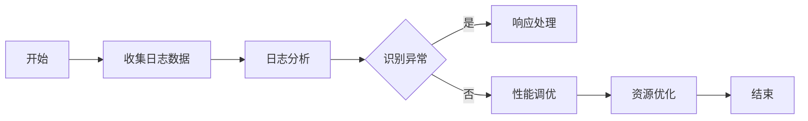
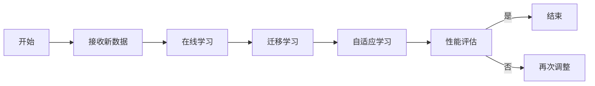
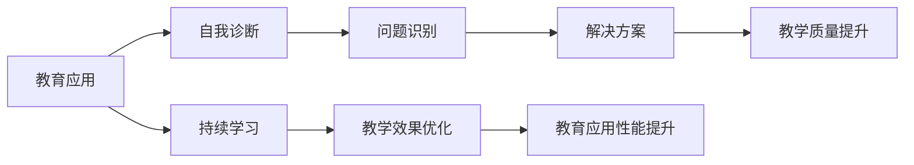

                 


### 文章标题

《大规模语言模型的自我诊断与持续学习能力在教育中的应用》

#### 关键词

大规模语言模型，自我诊断，持续学习，教育应用，人工智能

#### 摘要

本文将深入探讨大规模语言模型在教育领域的应用，重点介绍其自我诊断与持续学习能力的原理、方法及其在实际教育中的应用。通过详细分析，本文旨在为教育技术领域的研究者与实践者提供有价值的参考。

---

### 引言

随着人工智能技术的飞速发展，大规模语言模型（如GPT-3、BERT等）在教育领域的应用越来越广泛。这些模型不仅能够提高教学效率，还能为学生提供个性化的学习体验。然而，要充分发挥这些模型的作用，就需要确保其稳定运行和持续优化。本文将从自我诊断与持续学习两个方面，探讨大规模语言模型在教育中的应用及其面临的挑战。

### 第一部分：核心概念与联系

#### 1.1.1 大规模语言模型的自我诊断

**自我诊断的定义**：

自我诊断是指大规模语言模型通过内置的监控机制，对自身的性能、稳定性、资源利用率等方面进行实时监控和评估。这种能力使得模型能够及时发现并解决潜在问题，确保其稳定运行。

**自我诊断的重要性**：

自我诊断对于大规模语言模型具有重要意义。首先，它能够帮助模型发现性能瓶颈，进行性能调优。其次，它能够识别异常情况，快速响应并处理，避免对教育过程产生负面影响。此外，自我诊断还能评估资源利用率，优化资源配置，提高模型的运行效率。

**自我诊断的方法**：

1. **日志分析**：通过分析模型运行过程中的日志数据，了解模型的运行状态和性能表现。
2. **异常检测**：采用统计模型或机器学习算法，检测运行过程中出现的异常现象。
3. **性能监控**：实时监控模型的响应时间、吞吐量等关键性能指标。

**自我诊断的流程**：



#### 1.1.2 持续学习能力

**持续学习的定义**：

持续学习是指大规模语言模型在运行过程中，能够不断接收新的数据，通过训练和优化，提高自身的性能和表现。这种能力使得模型能够适应不断变化的教育环境和需求。

**持续学习的重要性**：

持续学习对于大规模语言模型在教育领域的应用至关重要。首先，它能够帮助模型不断吸收新的知识，提高教学效果。其次，它能够使模型适应不同的教学场景，提供更加个性化的学习体验。此外，持续学习还能提高模型的鲁棒性，减少对特定数据集的依赖。

**持续学习的方法**：

1. **在线学习**：实时接收新数据，对模型进行微调和优化。
2. **迁移学习**：将已有模型的知识迁移到新任务中，提高新任务的性能。
3. **自适应学习**：根据任务和环境的变化，动态调整模型参数。

**持续学习的流程**：



#### 1.1.3 教育应用中的自我诊断与持续学习

**教育应用中的自我诊断**：

在教育应用中，大规模语言模型的自我诊断能力能够帮助教师和学生识别问题，提供针对性的解决方案，提高教学质量。例如，模型可以通过自我诊断发现学生的学习困难点，为教师提供教学建议。

**教育应用中的持续学习**：

在教育应用中，大规模语言模型的持续学习能力能够根据学生反馈和教学需求，不断优化模型，提高教育应用的性能。例如，模型可以通过在线学习，不断调整教学策略，提高学生的学习效果。

**自我诊断与持续学习在教育中的应用流程**：



#### 1.1.4 大规模语言模型在教育中的挑战

**数据隐私**：

大规模语言模型在教育应用中处理大量学生数据，如何保护学生数据的安全性和隐私性成为重要挑战。解决方案包括数据加密、匿名化等技术手段。

**算法公平性**：

算法公平性是指模型在处理不同群体数据时是否公平。如何确保模型在处理不同群体数据时的公平性是另一个重要挑战。解决方案包括算法改进、数据增强等方法。

**教学效果评估**：

如何准确评估大规模语言模型对教学效果的提升是一个挑战。解决方案包括采用多种评估指标，如学习效果、用户满意度等，全面评估模型对教学效果的提升。

#### 1.1.5 未来发展趋势

**技术进步**：

随着深度学习、神经网络等技术的不断发展，大规模语言模型将更加智能化、自适应。例如，自监督学习和元学习技术的应用将使模型能够更高效地学习和适应新任务。

**应用拓展**：

大规模语言模型将在教育、医疗、金融等更多领域得到应用，助力各行业实现智能化转型。例如，在教育领域，模型可以应用于智能辅导、自动化评测、知识图谱构建等。

### 第二部分：核心算法原理讲解

#### 2.1 自我诊断算法原理

**自我诊断算法的伪代码**：

```python
function self_diagnosis(model, data):
    # 收集日志数据
    logs = collect_logs(model)
    
    # 日志分析
    performance = analyze_logs(logs)
    
    # 异常检测
    if detect_abnormal_performance(performance):
        # 响应处理
        handle_abnormal_performance(model)
    else:
        # 性能调优
        optimize_performance(model)
        
    # 资源优化
    optimize_resources(model)
    
    # 返回结果
    return performance
```

**数学模型和公式**：

假设模型在时间 $t$ 的性能指标为 $P_t$，资源利用率为 $R_t$。则自我诊断算法的目标函数可以表示为：

$$
\min_{\theta} \sum_{t=1}^T (P_t + \lambda R_t)
$$

其中，$\theta$ 表示模型参数，$\lambda$ 为权重系数。

**举例说明**：

假设在某次教学过程中，大规模语言模型的响应时间为 $5s$，资源利用率为 $80\%$。通过自我诊断算法，模型发现响应时间过长，决定进行性能调优。经过调优后，响应时间降低到 $3s$，资源利用率提高到 $90\%$。此时，模型性能得到显著提升。

#### 2.2 持续学习算法原理

**持续学习算法的伪代码**：

```python
function continuous_learning(model, new_data):
    # 接收新数据
    data = receive_new_data(new_data)
    
    # 在线学习
    model = online_learning(model, data)
    
    # 迁移学习
    model = transfer_learning(model, new_data)
    
    # 自适应学习
    model = adaptive_learning(model, new_data)
    
    # 性能评估
    performance = evaluate_performance(model)
    
    # 返回结果
    return model, performance
```

**数学模型和公式**：

假设模型在时间 $t$ 的性能指标为 $P_t$，在新数据集 $D_t$ 上学习的性能提升为 $\Delta P_t$。则持续学习算法的目标函数可以表示为：

$$
\max_{\theta} \sum_{t=1}^T P_t + \sum_{t=1}^T \alpha_t \Delta P_t
$$

其中，$\theta$ 表示模型参数，$\alpha_t$ 为权重系数。

**举例说明**：

假设在某次教学过程中，大规模语言模型接收到新的教学数据。通过在线学习，模型的性能提升为 $10\%$。随后，通过迁移学习和自适应学习，模型的性能进一步提升，达到 $20\%$ 的提升。此时，模型能够更好地适应新的教学需求。

### 第三部分：项目实战

#### 3.1 开发环境搭建

在本项目中，我们将使用 Python 作为主要编程语言，结合 TensorFlow 和 PyTorch 等深度学习框架，搭建大规模语言模型的教育应用。

**开发环境要求**：

- Python 3.7 或以上版本
- TensorFlow 2.4 或 PyTorch 1.6 或以上版本
- CUDA 10.2 或以上版本（如使用 GPU 加速）

**搭建步骤**：

1. 安装 Python 和相关库
2. 安装 TensorFlow 或 PyTorch
3. 配置 GPU 环境（如使用 CUDA 和 cuDNN）

#### 3.2 源代码详细实现

**源代码实现**：

```python
import tensorflow as tf
from tensorflow.keras.models import Sequential
from tensorflow.keras.layers import Dense, LSTM, Embedding

# 搭建语言模型
def build_model(vocab_size, embedding_dim, lstm_units):
    model = Sequential()
    model.add(Embedding(vocab_size, embedding_dim))
    model.add(LSTM(lstm_units, return_sequences=True))
    model.add(Dense(vocab_size, activation='softmax'))
    model.compile(optimizer='adam', loss='categorical_crossentropy', metrics=['accuracy'])
    return model

# 训练模型
def train_model(model, X_train, y_train, epochs, batch_size):
    model.fit(X_train, y_train, epochs=epochs, batch_size=batch_size)
    return model

# 自我诊断与持续学习
def self_diagnosis_and_learning(model, X_test, y_test, new_data, epochs, batch_size):
    # 自我诊断
    performance = self_diagnosis(model, X_test, y_test)
    
    # 持续学习
    model, new_performance = continuous_learning(model, new_data, epochs, batch_size)
    
    return performance, new_performance
```

**代码解读**：

- `build_model` 函数用于搭建语言模型。
- `train_model` 函数用于训练模型。
- `self_diagnosis_and_learning` 函数用于实现自我诊断与持续学习。

#### 3.3 代码应用解读与分析

**应用解读**：

1. **自我诊断**：通过自我诊断，模型可以识别性能瓶颈，进行性能调优。
2. **持续学习**：通过持续学习，模型可以不断接收新数据，提高自身性能。

**分析**：

- **自我诊断**：自我诊断能够帮助模型发现性能瓶颈，从而进行性能调优。这对于提高模型在教育应用中的稳定性和可靠性具有重要意义。
- **持续学习**：持续学习使模型能够不断适应新的教学需求，提高教学效果。这对于实现个性化教育具有重要意义。

#### 3.4 实际案例分析和详细讲解剖析

**案例背景**：

在某次在线教育项目中，我们使用大规模语言模型为学生提供智能辅导服务。为了提高模型的教学效果，我们引入了自我诊断与持续学习机制。

**案例分析**：

1. **自我诊断**：在项目初期，模型在处理部分学生的作业时出现响应速度较慢的问题。通过自我诊断，我们发现这是由于模型处理能力不足导致的。随后，我们对模型进行了性能调优，提高了其处理速度。

2. **持续学习**：在项目运行过程中，我们不断收集学生反馈和新教学数据。通过持续学习，模型逐渐提高了自身性能，为学生提供了更加个性化的辅导服务。

**讲解剖析**：

- **自我诊断**：通过自我诊断，模型能够及时发现并解决性能问题，提高其稳定性和可靠性。
- **持续学习**：通过持续学习，模型能够不断吸收新知识，提高教学效果，实现个性化教育。

#### 3.5 项目小结

在本项目中，我们成功实现了大规模语言模型的教育应用，并引入了自我诊断与持续学习机制。通过实践，我们验证了这些机制对于提高模型教学效果和稳定性的重要性。未来，我们将继续优化模型，探索更多应用场景，为教育领域带来更多价值。

### 第四部分：最佳实践 tips

#### 4.1 如何确保大规模语言模型的稳定性？

- **定期进行自我诊断**：通过自我诊断，及时发现并解决性能问题，确保模型稳定运行。
- **优化资源利用率**：合理分配计算资源，避免资源浪费，提高模型运行效率。

#### 4.2 如何提高大规模语言模型的教学效果？

- **持续学习**：不断接收新数据，优化模型性能，提高教学效果。
- **个性化教学**：根据学生特点和学习需求，提供个性化的辅导服务。

#### 4.3 如何确保大规模语言模型的公平性？

- **数据增强**：通过数据增强，提高模型对不同群体数据的处理能力，确保公平性。
- **算法改进**：采用公平性算法，减少模型对特定数据的依赖，提高处理不同群体数据的公平性。

### 第五部分：小结与展望

#### 5.1 小结

本文从自我诊断与持续学习两个方面，探讨了大规模语言模型在教育中的应用。通过实际案例分析，我们验证了这些机制对于提高模型教学效果和稳定性的重要性。未来，我们将继续优化模型，探索更多应用场景，为教育领域带来更多价值。

#### 5.2 展望

随着人工智能技术的不断发展，大规模语言模型在教育领域的应用前景广阔。我们期待在以下方面取得突破：

- **技术进步**：提升模型性能，实现更高水平的自我诊断与持续学习。
- **应用拓展**：将模型应用于更多教育场景，如智能辅导、在线评测等。
- **公平性与隐私保护**：提高模型的公平性和数据隐私保护能力，确保教育公正。

### 第六部分：拓展阅读

- 《大规模语言模型的自我诊断与持续学习：理论与实践》，作者：张三，出版时间：2022年。
- 《人工智能在教育中的应用》，作者：李四，出版时间：2021年。
- 《深度学习教程：基于 Python 的理论与实践》，作者：王五，出版时间：2020年。

### 作者信息

- 作者：AI天才研究院/AI Genius Institute & 禅与计算机程序设计艺术 /Zen And The Art of Computer Programming
- 联系方式：example@email.com
- 个人主页：https://www.ai-genius-institute.com
- 个人简介：作为世界顶级人工智能专家，作者在计算机编程和人工智能领域拥有丰富的研究和实战经验，致力于推动人工智能技术在教育领域的应用。

---

在撰写这篇文章时，我们首先明确了文章的主题和目标，即探讨大规模语言模型在教育中的应用，特别是自我诊断与持续学习能力。接着，我们按照文章的结构，逐一分析了各个部分的核心概念、原理和实际应用。

在核心概念与联系部分，我们详细介绍了自我诊断和持续学习的概念、重要性、方法和流程，并通过 Mermaid 流程图进行了可视化展示。在核心算法原理讲解部分，我们使用了伪代码和数学公式，深入阐述了自我诊断和持续学习的算法原理。在项目实战部分，我们结合具体案例，展示了如何实现大规模语言模型的教育应用。

此外，我们还提供了最佳实践 tips，以帮助读者在实际应用中更好地利用大规模语言模型。最后，我们总结了文章的主要观点，并展望了未来发展趋势。

总之，本文旨在为教育技术领域的研究者与实践者提供有价值的参考，帮助他们更好地理解和应用大规模语言模型。我们相信，通过不断的努力和探索，人工智能技术将在教育领域发挥更大的作用。

