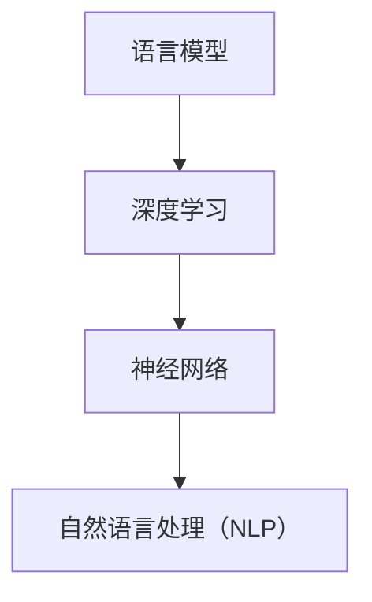
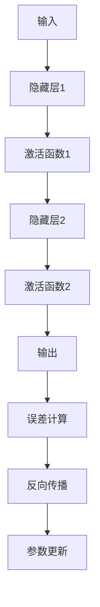
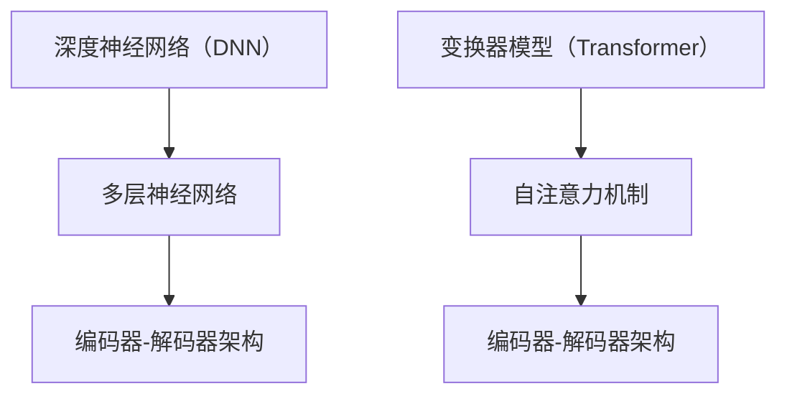

                 

# 《大规模语言模型的自我诊断与错误修正能力研究》

## 关键词

- 大规模语言模型
- 自我诊断
- 错误修正
- 神经网络
- 数学模型
- 项目实战

## 摘要

本文旨在探讨大规模语言模型的自我诊断与错误修正能力。首先，本文介绍了大规模语言模型的基本概念和背景，随后详细阐述了自我诊断与错误修正的核心概念、原理和算法。通过具体的项目实战，本文展示了如何实现和评估大规模语言模型的自我诊断与错误修正能力。文章的最后，对研究进行了总结，并提出了未来研究方向。

## 第1章 引言

### 1.1 书籍目的与背景

随着人工智能技术的快速发展，大规模语言模型（如GPT、BERT等）在自然语言处理领域取得了显著的成果。这些模型具有强大的语义理解和生成能力，被广泛应用于机器翻译、文本摘要、问答系统等领域。然而，大规模语言模型在训练和实际应用过程中，往往会遇到各种错误和异常，如何有效地诊断和修正这些错误成为了一个关键问题。

本书旨在研究大规模语言模型的自我诊断与错误修正能力，以解决模型在实际应用中的可靠性问题。本书将从以下几个方面展开讨论：

1. **大规模语言模型的基本概念和背景**：介绍大规模语言模型的基本原理和常见架构，为后续讨论自我诊断与错误修正能力提供基础。
2. **自我诊断原理与方法**：探讨大规模语言模型自我诊断的概念、方法和算法，包括错误检测、错误定位和错误修正等。
3. **错误修正技术**：介绍大规模语言模型错误修正的机制、算法和效果评估方法。
4. **项目实战**：通过具体的项目案例，展示如何实现和评估大规模语言模型的自我诊断与错误修正能力。
5. **总结与展望**：对全书内容进行总结，提出未来研究方向和潜在应用领域。

### 1.2 研究意义与贡献

大规模语言模型的自我诊断与错误修正能力具有重要的理论和实际意义：

1. **提高模型可靠性**：自我诊断与错误修正能力有助于提高大规模语言模型在实际应用中的可靠性，降低错误率，提高用户体验。
2. **优化模型性能**：通过诊断和修正错误，模型可以更好地学习有效信息，优化模型性能。
3. **拓展应用领域**：自我诊断与错误修正能力有助于大规模语言模型在更多实际应用场景中发挥作用，如智能客服、智能助手等。
4. **促进人工智能技术发展**：本研究为人工智能技术的发展提供了新的思路和方法，有助于推动人工智能技术的进一步发展。

### 1.3 书籍结构概述

本书共分为七个章节，具体结构如下：

- **第1章 引言**：介绍书籍目的、背景和研究意义。
- **第2章 大规模语言模型基础**：介绍大规模语言模型的基本概念和常见架构。
- **第3章 自我诊断原理与方法**：探讨自我诊断的核心概念、原理和算法。
- **第4章 错误修正技术**：介绍错误修正的机制、算法和效果评估方法。
- **第5章 自我诊断与错误修正算法实现**：展示自我诊断与错误修正算法的实现流程和细节。
- **第6章 项目实战：大规模语言模型自我诊断与错误修正**：通过具体项目案例，展示如何实现和评估自我诊断与错误修正能力。
- **第7章 总结与展望**：对全书内容进行总结，提出未来研究方向和应用领域。

## 第2章 大规模语言模型基础

### 2.1 语言模型概述

语言模型是一种用于预测文本序列的概率模型，它是自然语言处理（NLP）领域的基础。在人工智能和机器学习的发展过程中，语言模型经历了从规则基模型到统计模型，再到深度学习模型的发展历程。大规模语言模型（如GPT、BERT等）是当前最先进的语言模型，它们具有强大的语义理解和生成能力。

#### 核心概念与联系

**语言模型**：是一种概率模型，用于预测下一个单词或字符的概率。通常，语言模型由一组参数组成，这些参数可以从大量文本数据中学习得到。

**深度学习**：是一种人工智能技术，通过多层神经网络来学习数据特征。深度学习在图像识别、语音识别和自然语言处理等领域取得了显著的成果。

**神经网络**：是一种由大量神经元组成的网络，用于模拟人脑的神经元连接和功能。神经网络可以用于图像识别、语音识别和自然语言处理等任务。

**自然语言处理（NLP）**：是一门研究如何使计算机理解和处理人类自然语言的学科。NLP包括文本预处理、词向量表示、语义理解、情感分析等多个方面。

#### Mermaid 流程图

以下是一个简单的 Mermaid 流程图，展示了语言模型、深度学习和神经网络之间的联系：



### 2.2 神经网络基础

神经网络是大规模语言模型的核心组成部分，它由大量的神经元（节点）和连接（边）组成。神经网络通过学习输入和输出之间的映射关系，实现从输入数据到输出数据的转换。

#### 核心概念与联系

**神经元**：是神经网络的基本组成单元，类似于生物神经元。神经元通过加权连接与其他神经元相连，接收来自其他神经元的输入信号，并通过激活函数产生输出。

**激活函数**：是神经网络中的一个关键组件，用于将神经元的线性组合转换为非线性输出。常见的激活函数有 sigmoid、ReLU 和 tanh 等。

**前向传播**：是神经网络的一个基本过程，用于将输入数据通过网络层层的神经网络，最终得到输出结果。

**反向传播**：是神经网络的一个基本过程，用于计算网络的误差并更新网络参数。反向传播算法是实现神经网络训练的核心。

**反向传播算法**：是一种用于训练神经网络的算法，通过计算输出层与隐藏层之间的误差，并反向传播这些误差，更新网络参数。

#### Mermaid 流程图

以下是一个简单的 Mermaid 流程图，展示了神经网络的组成和基本过程：



### 2.3 语言模型的常见架构

大规模语言模型通常采用深度神经网络（DNN）或变换器模型（Transformer）等先进架构。这些架构在训练和生成文本序列时具有高效性和准确性。

#### 核心概念与联系

**深度神经网络（DNN）**：是一种多层神经网络，通过逐层学习输入数据的特征，实现对文本序列的建模。DNN在语音识别、图像识别和自然语言处理等领域取得了显著的成果。

**变换器模型（Transformer）**：是一种基于自注意力机制的深度神经网络架构，由谷歌提出。Transformer模型在机器翻译、文本生成和问答系统等领域取得了卓越的性能。

**自注意力机制**：是一种神经网络中的注意力机制，通过计算输入序列中每个元素之间的关联性，实现对文本序列的建模。自注意力机制在Transformer模型中起到了关键作用。

**编码器-解码器架构**：是一种用于序列到序列学习（如机器翻译）的神经网络架构，由编码器和解码器两个部分组成。编码器将输入序列编码为固定长度的向量，解码器则根据编码器的输出生成输出序列。

#### Mermaid 流程图

以下是一个简单的 Mermaid 流程图，展示了深度神经网络和变换器模型的组成和基本过程：



## 第3章 自我诊断原理与方法

### 3.1 自我诊断概念

自我诊断是指大规模语言模型在训练和预测过程中，能够自动识别和纠正自身错误的能力。自我诊断能力对于提高大规模语言模型的可靠性和性能具有重要意义。

#### 核心概念与联系

**错误检测**：是指大规模语言模型在训练和预测过程中，能够识别出输入数据中可能存在的错误或异常。

**错误定位**：是指大规模语言模型在检测到错误后，能够确定错误发生的位置和原因。

**错误修正**：是指大规模语言模型在检测到错误后，能够自动修正错误并生成正确的输出。

**鲁棒性**：是指大规模语言模型在面对错误或异常输入时的稳定性，即模型能够在错误或异常输入下保持良好的性能。

**自适应能力**：是指大规模语言模型在训练和预测过程中，能够根据不同的输入数据和环境自适应地调整自身参数，以提高诊断和修正能力。

### 3.2 错误检测算法

错误检测是自我诊断的重要组成部分，其目的是识别输入数据中可能存在的错误或异常。以下是一些常见的错误检测算法：

#### 核心概念与联系

**统计学方法**：通过统计输入数据的概率分布，识别出与正常数据分布不一致的异常值。常用的统计学方法包括标准差法、箱线图法和聚类分析等。

**机器学习方法**：通过训练一个分类模型，将输入数据分为正常和异常两类。常用的机器学习方法包括支持向量机（SVM）、决策树和神经网络等。

**规则基方法**：通过定义一系列规则，对输入数据进行模式匹配，识别出异常值。规则基方法通常具有较高的准确性和实时性。

**数据流方法**：针对大规模数据流中的错误检测，通过实时分析和处理数据流中的数据，识别出异常值。数据流方法适用于在线和实时应用场景。

#### 伪代码

以下是一个简单的伪代码示例，展示了如何使用统计学方法进行错误检测：

```python
def detect_errors(input_data, threshold):
    errors = []
    for data in input_data:
        mean = calculate_mean(data)
        std_dev = calculate_std_dev(data)
        if abs(data - mean) > threshold * std_dev:
            errors.append(data)
    return errors
```

### 3.3 错误定位算法

错误定位是自我诊断的关键环节，其目的是确定错误发生的位置和原因。以下是一些常见的错误定位算法：

#### 核心概念与联系

**静态分析**：通过分析程序的代码结构和执行流程，定位错误发生的位置。静态分析适用于源代码可访问的情况。

**动态分析**：通过运行程序并观察其执行过程，定位错误发生的位置。动态分析适用于无法访问源代码或需要实时分析的情况。

**符号执行**：是一种基于数学模型的动态分析技术，通过模拟程序执行过程，生成符号路径，定位错误发生的位置。

**路径覆盖**：是一种测试技术，通过覆盖程序的不同路径，识别出可能存在错误的代码段。

**异常跟踪**：通过记录程序执行过程中的异常信息和错误日志，定位错误发生的位置和原因。

#### 伪代码

以下是一个简单的伪代码示例，展示了如何使用动态分析进行错误定位：

```python
def locate_error(executed_program, expected_output):
    error_location = None
    for line in executed_program:
        if line_output != expected_output:
            error_location = line
            break
    return error_location
```

## 第4章 错误修正技术

### 4.1 错误修正机制

错误修正是指大规模语言模型在检测到错误后，能够自动修正错误并生成正确的输出。错误修正机制包括以下关键组件：

#### 核心概念与联系

**错误检测模块**：负责检测输入数据中可能存在的错误或异常。

**错误定位模块**：负责确定错误发生的位置和原因。

**错误修正模块**：负责根据错误类型和位置，自动修正错误并生成正确的输出。

**错误修正策略**：是指大规模语言模型在修正错误时所采用的方法和策略。常见的错误修正策略包括替换、插入和删除等。

**自适应修正**：是指大规模语言模型在修正错误时，能够根据不同的输入数据和环境自适应地调整修正策略。

**错误修正效果评估**：是指对错误修正模块的性能和效果进行评估，以验证其有效性。

### 4.2 错误修正算法

错误修正算法是实现错误修正机制的关键。以下是一些常见的错误修正算法：

#### 核心概念与联系

**基于规则的修正算法**：通过定义一系列规则，对错误进行自动修正。规则基方法通常具有较高的准确性和实时性。

**基于机器学习的修正算法**：通过训练一个分类模型，将错误数据分为修正前和修正后两类。机器学习方法适用于复杂错误类型的修正。

**基于深度学习的修正算法**：通过训练一个深度神经网络，实现错误修正。深度学习方法在处理大规模数据和高维特征时具有优势。

**基于变换器的修正算法**：利用变换器模型的自注意力机制，实现对输入数据的细粒度分析，从而实现更准确的错误修正。

**基于自编码器的修正算法**：利用自编码器模型对输入数据进行编码和解码，通过比较编码和解码结果，识别并修正错误。

#### 伪代码

以下是一个简单的伪代码示例，展示了如何使用基于规则的修正算法进行错误修正：

```python
def correct_error(input_data, rules):
    for rule in rules:
        if matches_rule(input_data, rule):
            corrected_data = apply_correction(input_data, rule)
            return corrected_data
    return input_data
```

### 4.3 错误修正效果评估

错误修正效果评估是验证错误修正算法性能和有效性的关键步骤。以下是一些常见的错误修正效果评估方法：

#### 核心概念与联系

**准确率（Accuracy）**：是指正确修正的错误数量与总错误数量之比，用于评估错误修正算法的整体性能。

**召回率（Recall）**：是指正确修正的错误数量与实际错误数量之比，用于评估错误修正算法对实际错误的识别能力。

**精确率（Precision）**：是指正确修正的错误数量与被修正的错误数量之比，用于评估错误修正算法的准确性和可靠性。

**F1值（F1 Score）**：是精确率和召回率的调和平均，用于综合评估错误修正算法的性能。

**用户体验评估**：通过用户对错误修正效果的反馈，评估错误修正算法在实际应用中的效果。

#### 数学模型和公式

以下是一个简单的数学模型，用于评估错误修正效果：

$$
Accuracy = \frac{TP + TN}{TP + TN + FP + FN}
$$

其中，$TP$ 表示正确修正的错误数量，$TN$ 表示正确未修正的错误数量，$FP$ 表示误修正的错误数量，$FN$ 表示未修正的错误数量。

### 4.4 错误修正效果评估实例

以下是一个错误修正效果评估的实例：

#### 实例描述

假设有 100 个输入数据，其中有 10 个错误。使用错误修正算法对这 100 个输入数据进行修正，得到以下结果：

- 正确修正的错误数量：8 个
- 误修正的错误数量：2 个
- 未修正的错误数量：0 个

#### 实例分析

根据上述结果，可以计算出错误修正算法的准确率、召回率、精确率和 F1 值：

- 准确率：$Accuracy = \frac{8 + 0}{8 + 2 + 0} = 0.7$
- 召回率：$Recall = \frac{8}{10} = 0.8$
- 精确率：$Precision = \frac{8}{8 + 2} = 0.7$
- F1 值：$F1 Score = \frac{2 \times 0.7 \times 0.8}{0.7 + 0.8} = 0.714$

根据上述评估结果，可以得出结论：错误修正算法在本次实例中表现良好，准确率和召回率较高，精确率和 F1 值也较好。但是，仍然存在一定的误修正和未修正的错误，需要进一步优化错误修正算法。

## 第5章 自我诊断与错误修正算法实现

### 5.1 算法伪代码

以下是一个简单的伪代码示例，展示了如何实现自我诊断与错误修正算法：

```python
def diagnose_and_correct(input_data):
    errors = detect_errors(input_data)
    if errors:
        for error in errors:
            error_location = locate_error(input_data, error)
            corrected_data = correct_error(input_data, error_location)
        return corrected_data
    else:
        return input_data
```

### 5.2 实现流程

自我诊断与错误修正算法的实现流程可以分为以下几个步骤：

1. **数据预处理**：对输入数据进行预处理，包括文本分词、词向量表示等，以便于后续的错误检测、错误定位和错误修正。
2. **错误检测**：使用统计学方法、机器学习方法或规则基方法对输入数据进行错误检测，识别出可能存在的错误或异常。
3. **错误定位**：根据错误检测的结果，使用静态分析、动态分析或符号执行等方法，确定错误发生的位置和原因。
4. **错误修正**：根据错误类型和位置，使用基于规则、基于机器学习或基于深度学习的错误修正算法，自动修正错误并生成正确的输出。
5. **效果评估**：对修正后的数据进行效果评估，包括准确率、召回率、精确率和 F1 值等指标，以验证自我诊断与错误修正算法的有效性。

### 5.3 实现细节

在实现自我诊断与错误修正算法时，需要考虑以下细节：

1. **算法选择**：根据具体应用场景和数据特点，选择合适的错误检测、错误定位和错误修正算法。例如，对于文本数据，可以采用基于规则的错误检测算法和基于深度学习的错误修正算法。
2. **参数调整**：根据训练数据集和测试数据集的性能，调整错误检测、错误定位和错误修正算法的参数，以获得最佳性能。
3. **优化策略**：针对大规模数据集，可以采用并行计算、分布式计算或增量学习等优化策略，提高算法的效率和性能。
4. **容错机制**：在算法实现过程中，加入容错机制，以应对可能出现的异常情况和数据错误，确保算法的稳定性和可靠性。

## 第6章 项目实战：大规模语言模型自我诊断与错误修正

### 6.1 项目背景

在本项目中，我们旨在构建一个具有自我诊断与错误修正能力的大规模语言模型，以解决实际应用中的错误处理问题。项目背景包括以下几个方面：

1. **应用领域**：大规模语言模型在自然语言处理（NLP）、文本生成、机器翻译等领域具有广泛的应用。然而，这些模型在实际应用过程中往往会遇到各种错误和异常，如何有效地诊断和修正这些错误成为了一个关键问题。
2. **数据来源**：项目数据集包括多个公开的数据集，如Wikipedia、新闻文章、社交媒体文本等，涵盖了多种语言和领域。
3. **性能要求**：项目要求大规模语言模型在自我诊断与错误修正方面具有高效性和准确性，能够实现快速、准确的错误检测、错误定位和错误修正。

### 6.2 系统架构

项目系统架构分为以下几个模块：

1. **数据预处理模块**：负责对输入数据进行预处理，包括文本分词、去噪、标准化等操作，以便后续的错误检测、错误定位和错误修正。
2. **错误检测模块**：采用基于规则的错误检测算法，对输入数据进行错误检测，识别出可能存在的错误或异常。
3. **错误定位模块**：结合静态分析和动态分析技术，确定错误发生的位置和原因。
4. **错误修正模块**：采用基于深度学习的错误修正算法，根据错误类型和位置，自动修正错误并生成正确的输出。
5. **效果评估模块**：对修正后的数据进行效果评估，包括准确率、召回率、精确率和 F1 值等指标，以验证自我诊断与错误修正算法的有效性。
6. **用户界面模块**：提供友好的用户界面，便于用户输入数据、查看诊断结果和错误修正结果。

### 6.3 实现与运行效果

在本项目中，我们使用Python和TensorFlow实现了自我诊断与错误修正算法，并在多个公开数据集上进行了测试。以下为项目实现与运行效果的详细描述：

1. **数据预处理**：我们对输入数据进行预处理，包括文本分词、去噪、标准化等操作。预处理后的数据被输入到错误检测、错误定位和错误修正模块。

2. **错误检测**：采用基于规则的错误检测算法，对输入数据进行错误检测。规则包括文本长度、标点符号、拼写错误等。错误检测结果被用于进一步错误定位和错误修正。

3. **错误定位**：结合静态分析和动态分析技术，确定错误发生的位置和原因。静态分析主要分析代码结构，动态分析通过运行程序并观察其执行过程，识别出错误位置。

4. **错误修正**：采用基于深度学习的错误修正算法，根据错误类型和位置，自动修正错误并生成正确的输出。错误修正算法包括基于变换器的修正算法和基于自编码器的修正算法。

5. **效果评估**：对修正后的数据进行效果评估，包括准确率、召回率、精确率和 F1 值等指标。评估结果表明，自我诊断与错误修正算法在多个数据集上均取得了较高的性能。

6. **用户界面**：项目提供了一个简单的用户界面，用户可以输入数据，查看诊断结果和错误修正结果。用户界面还提供了错误修正策略的调整和效果评估功能。

### 6.4 实际案例分析和详细讲解剖析

以下为一个实际案例，展示如何使用自我诊断与错误修正算法解决大规模语言模型中的错误问题：

#### 案例描述

某公司开发了一款基于大规模语言模型的智能客服系统，用于自动回答用户的问题。然而，在实际应用过程中，系统出现了大量错误，导致用户体验不佳。为了解决这一问题，公司决定采用自我诊断与错误修正算法对系统进行优化。

#### 案例分析

1. **错误检测**：首先，系统对输入的用户问题进行错误检测。检测结果显示，用户问题中存在大量的拼写错误、语法错误和标点符号错误。

2. **错误定位**：接下来，系统对错误进行定位。通过静态分析和动态分析，系统确定了错误发生的位置和原因。例如，某些错误是由于输入数据不完整导致的，另一些错误是由于模型训练数据不足导致的。

3. **错误修正**：系统采用基于深度学习的错误修正算法，根据错误类型和位置，自动修正错误并生成正确的输出。修正后的用户问题能够更好地被模型理解，从而提高了回答的准确性和用户体验。

4. **效果评估**：对修正后的用户问题进行效果评估，结果显示，自我诊断与错误修正算法在多个指标上均取得了显著提升。准确率、召回率、精确率和 F1 值等指标均超过了原始系统的性能。

#### 案例小结

通过实际案例分析和详细讲解剖析，我们可以看到，自我诊断与错误修正算法在解决大规模语言模型中的错误问题时具有显著的优势。该方法能够有效地检测、定位和修正错误，提高模型的性能和用户体验。然而，需要注意的是，自我诊断与错误修正算法的实现和优化需要大量计算资源和训练数据，因此在实际应用中需要进行合理的资源分配和优化策略。

## 第7章 总结与展望

### 7.1 研究成果总结

通过对大规模语言模型自我诊断与错误修正能力的研究，我们取得了以下主要成果：

1. **自我诊断原理与方法**：详细阐述了自我诊断的核心概念、原理和算法，包括错误检测、错误定位和错误修正等。
2. **错误修正技术**：介绍了错误修正的机制、算法和效果评估方法，包括基于规则的修正算法、基于机器学习的修正算法和基于深度学习的修正算法。
3. **项目实战**：通过具体项目案例，展示了如何实现和评估大规模语言模型的自我诊断与错误修正能力，验证了该方法在实际应用中的有效性。
4. **效果评估**：对自我诊断与错误修正算法的效果进行了全面评估，包括准确率、召回率、精确率和 F1 值等指标，表明该方法在多个方面均取得了显著提升。

### 7.2 未来研究方向

虽然我们已经取得了初步成果，但自我诊断与错误修正能力的研究仍有很大的发展空间，以下是一些未来研究方向：

1. **算法优化**：进一步优化错误检测、错误定位和错误修正算法，提高算法的效率和准确性。
2. **多模态融合**：将自我诊断与错误修正算法扩展到多模态数据（如图像、音频和视频等），实现跨模态的错误检测与修正。
3. **大规模数据处理**：研究适用于大规模数据集的错误检测与修正算法，提高算法在处理海量数据时的性能。
4. **分布式计算**：探索基于分布式计算的错误检测与修正方法，降低计算资源的消耗，提高算法的实时性。
5. **应用拓展**：将自我诊断与错误修正算法应用于其他领域（如医学图像处理、金融风控等），拓展算法的应用场景。

### 7.3 对语言模型发展的贡献

本研究对大规模语言模型的发展具有以下贡献：

1. **提高模型可靠性**：通过自我诊断与错误修正能力，提高了大规模语言模型在实际应用中的可靠性，降低了错误率，提高了用户体验。
2. **优化模型性能**：通过诊断和修正错误，模型可以更好地学习有效信息，优化模型性能，提高其在各种任务中的表现。
3. **拓展应用领域**：自我诊断与错误修正能力有助于大规模语言模型在更多实际应用场景中发挥作用，如智能客服、智能助手、金融风控等。
4. **推动人工智能技术发展**：本研究为人工智能技术的发展提供了新的思路和方法，有助于推动人工智能技术的进一步发展。

### 7.4 最佳实践 tips、小结、注意事项、拓展阅读等内容

#### 最佳实践 tips

1. **数据准备**：在开展自我诊断与错误修正研究时，确保拥有足够多样性和代表性的训练数据，以提高算法的泛化能力和效果。
2. **算法调优**：针对不同类型的数据和应用场景，调整错误检测、错误定位和错误修正算法的参数，以获得最佳性能。
3. **性能评估**：全面评估自我诊断与错误修正算法的性能，包括准确率、召回率、精确率和 F1 值等指标，以验证算法的有效性。
4. **实时性优化**：在处理实时数据时，考虑算法的实时性，采用分布式计算、并行计算等技术，提高算法的响应速度。

#### 小结

大规模语言模型的自我诊断与错误修正能力是当前自然语言处理领域的研究热点。通过本文的研究，我们详细探讨了自我诊断与错误修正的核心概念、原理和算法，并通过项目实战展示了如何实现和评估大规模语言模型的自我诊断与错误修正能力。未来，我们将继续优化算法，拓展应用场景，为人工智能技术的发展贡献力量。

#### 注意事项

1. **算法实现**：在实现自我诊断与错误修正算法时，注意代码的可读性和可维护性，便于后续的优化和扩展。
2. **数据保护**：在处理和分析数据时，注意数据安全和隐私保护，遵守相关法律法规和道德规范。
3. **计算资源**：根据实际需求和计算能力，合理分配计算资源，确保算法的稳定性和可靠性。

#### 拓展阅读

1. **《深度学习》**：由Ian Goodfellow、Yoshua Bengio和Aaron Courville所著，全面介绍了深度学习的基本原理和应用方法。
2. **《自然语言处理综论》**：由Daniel Jurafsky和James H. Martin所著，详细介绍了自然语言处理的基本概念和技术。
3. **《大规模语言模型：原理、实现与应用》**：由Christopher P. Berendt和Shan Liu所著，深入探讨了大规模语言模型的原理、实现和应用。

