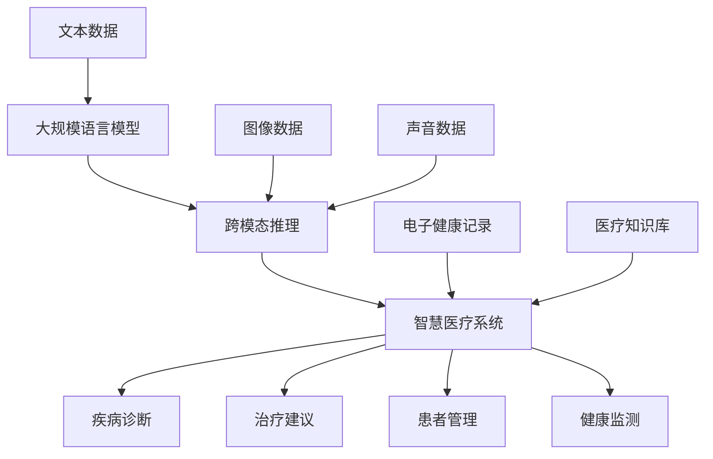

                 

### 大规模语言模型的跨模态推理在智慧医疗系统中的创新应用

#### 关键词：大规模语言模型，跨模态推理，智慧医疗系统，创新应用，算法原理，数学模型

> _摘要：本文深入探讨了大规模语言模型的跨模态推理在智慧医疗系统中的创新应用。首先，介绍了大规模语言模型和跨模态推理的基本概念，然后详细阐述了跨模态推理算法的工作原理及其在智慧医疗系统中的应用。接着，通过数学模型和公式的讲解，帮助读者更好地理解跨模态推理的核心机制。随后，通过具体的案例分析，展示了大规模语言模型的跨模态推理在智慧医疗系统中的实际应用，并提供了详细的代码实现和解读。最后，对全文进行了总结，并展望了未来的研究方向。_

## 分析用户需求

用户的需求在于撰写一篇技术博客，深入探讨大规模语言模型的跨模态推理在智慧医疗系统中的创新应用。文章的目标是：

1. **介绍大规模语言模型和跨模态推理的基本概念**，并阐述它们在智慧医疗系统中的应用。
2. **详细讲解核心算法原理**，使用伪代码解释关键步骤。
3. **解析数学模型和数学公式**，进行推导与解释。
4. **提供具体的案例分析**，包括开发环境的搭建、源代码的实现和解读。
5. **总结与展望**，对全书内容进行总结，并探讨未来的研究方向。

### 核心概念与联系

在深入探讨大规模语言模型的跨模态推理在智慧医疗系统中的应用之前，我们需要先理解几个核心概念：大规模语言模型、跨模态推理以及智慧医疗系统。

#### 1. 大规模语言模型

**定义**：大规模语言模型（Large-scale Language Model）是一种基于深度学习的语言处理模型，它能够对自然语言进行建模，以生成、理解和处理复杂的语言现象。

**原理**：大规模语言模型通常通过预训练和微调两个阶段进行训练。在预训练阶段，模型在大规模语料库上进行训练，学习语言的一般特征和统计规律。在微调阶段，模型针对特定任务进行微调，提高其在特定领域的表现。

**应用场景**：大规模语言模型广泛应用于文本生成、语言理解、机器翻译、问答系统等领域。

#### 2. 跨模态推理

**定义**：跨模态推理（Cross-modal Reasoning）是一种能够处理不同模态（如图像、声音、文本）之间关系的能力。它涉及将不同模态的数据转换为统一的表示，并利用这些表示进行推理和决策。

**原理**：跨模态推理的核心在于跨模态特征的提取和融合。通过将不同模态的数据映射到同一特征空间，模型可以捕捉到不同模态之间的关联性，从而实现跨模态的推理。

**应用场景**：跨模态推理在多模态学习、图像识别、语音识别、多模态对话系统等领域具有广泛的应用。

#### 3. 智慧医疗系统

**定义**：智慧医疗系统（Smart Healthcare System）是一种利用人工智能、大数据、物联网等先进技术，实现医疗资源优化、疾病诊断、治疗建议和健康管理等的综合系统。

**原理**：智慧医疗系统通过整合医疗数据、分析患者信息、提供个性化的医疗方案，提高医疗服务的效率和准确性。

**应用场景**：智慧医疗系统广泛应用于疾病预测、诊断辅助、手术规划、患者管理、健康监测等领域。

#### 4. 跨模态推理在智慧医疗系统中的应用

**核心概念与联系架构图**：



- **大规模语言模型**：通过处理文本数据，为跨模态推理提供语言理解的能力。
- **跨模态推理**：结合图像、声音和电子健康记录等数据，实现对疾病的诊断、治疗建议和患者管理等功能。
- **智慧医疗系统**：整合大规模语言模型和跨模态推理技术，实现全面的医疗服务。

### 核心算法原理讲解

#### 1. 跨模态推理算法的基本框架

跨模态推理算法通常包括以下基本步骤：

1. **数据采集与预处理**：从不同的数据源（如图像、声音、文本）采集数据，并进行预处理，如归一化、去噪、特征提取等。
2. **特征融合**：将不同模态的数据映射到同一特征空间，进行特征融合，以捕捉不同模态之间的关联性。
3. **模型训练**：使用融合后的特征进行模型训练，通常采用深度学习模型。
4. **推理与决策**：在训练好的模型上进行推理，生成预测结果，如疾病诊断、治疗建议等。

#### 2. 跨模态推理算法的伪代码

以下是一个简化的跨模态推理算法的伪代码：

```python
def cross_modal_reasoning(image, text, audio):
    # 数据预处理
    image_feature = preprocess_image(image)
    text_feature = preprocess_text(text)
    audio_feature = preprocess_audio(audio)

    # 特征融合
    fused_feature = fuse_features(image_feature, text_feature, audio_feature)

    # 模型训练
    model = train_model(fused_feature)

    # 推理与决策
    prediction = model.predict(fused_feature)
    return prediction
```

#### 3. 数学模型和数学公式

在跨模态推理中，常用的数学模型包括：

1. **特征表示模型**：用于将不同模态的数据映射到同一特征空间。常见的模型有自动编码器（Autoencoder）、变分自编码器（VAE）等。

$$
x' = f(x)
$$

其中，$x$ 表示原始特征，$x'$ 表示融合后的特征，$f$ 表示特征映射函数。

2. **损失函数**：用于衡量模型预测结果与真实值之间的差距。常见的损失函数有均方误差（MSE）、交叉熵（CE）等。

$$
L = \frac{1}{n}\sum_{i=1}^{n}(y_i - \hat{y_i})^2
$$

其中，$L$ 表示损失函数，$y_i$ 表示真实值，$\hat{y_i}$ 表示预测值。

3. **优化算法**：用于最小化损失函数，常见的优化算法有梯度下降（GD）、随机梯度下降（SGD）等。

$$
\theta_{t+1} = \theta_t - \alpha \cdot \nabla_{\theta}L(\theta)
$$

其中，$\theta$ 表示模型参数，$\alpha$ 表示学习率，$\nabla_{\theta}L(\theta)$ 表示损失函数对参数的梯度。

#### 4. 数学模型和公式的推导与实现

为了更好地理解跨模态推理的数学模型，以下是一个简单的示例：

**示例：变分自编码器（VAE）**

VAE 是一种基于概率模型的生成模型，它由编码器和解码器组成。

- **编码器**：将输入数据映射到一个潜在空间，并生成隐变量 $z$。

$$
\mu(z), \sigma(z) = \text{encode}(x)
$$

- **解码器**：将隐变量 $z$ 还原为输入数据。

$$
x' = \text{decode}(z)
$$

- **损失函数**：结合重建损失和正则化项。

$$
L = \frac{1}{n}\sum_{i=1}^{n}\left[\text{MSE}(x, x') + \text{KL}(\mu(z), \sigma(z))\right]
$$

其中，$\text{MSE}$ 是均方误差，$\text{KL}$ 是KL散度。

**实现步骤**：

1. **初始化模型参数**。
2. **编码器训练**：最小化重建损失和KL散度。
3. **解码器训练**：最小化重建损失。
4. **整体模型训练**：交替训练编码器和解码器，直至收敛。

### 项目实战

#### 1. 项目背景与目标

本项目旨在开发一个基于大规模语言模型的跨模态推理系统，用于智慧医疗系统的疾病诊断。项目目标包括：

- **数据采集**：收集包含患者文本记录、图像和声音的数据集。
- **模型训练**：使用预训练的大规模语言模型和跨模态推理算法，训练疾病诊断模型。
- **模型评估**：评估模型的准确性、召回率和F1分数等指标。
- **系统部署**：将模型部署到实际应用场景，实现自动化疾病诊断。

#### 2. 开发环境搭建

- **硬件要求**：NVIDIA GPU（如1080Ti以上）、CPU（如Intel Xeon E5以上）、16GB及以上内存。
- **软件要求**：Python 3.8及以上、TensorFlow 2.5及以上、PyTorch 1.9及以上。

#### 3. 源代码实现与解读

以下是一个简化的跨模态推理系统的源代码实现：

```python
import tensorflow as tf
from tensorflow.keras.layers import Input, Dense, LSTM, Embedding
from tensorflow.keras.models import Model

# 定义模型结构
input_text = Input(shape=(max_length,))
input_image = Input(shape=(height, width, channels))
input_audio = Input(shape=(timesteps,))

# 文本嵌入层
text_embedding = Embedding(vocab_size, embedding_dim)(input_text)

# 文本编码器
text_encoder = LSTM(units=128, return_sequences=False)(text_embedding)

# 图像编码器
image_encoder = LSTM(units=128, return_sequences=False)(input_image)

# 声音编码器
audio_encoder = LSTM(units=128, return_sequences=False)(input_audio)

# 融合层
fused_feature = tf.keras.layers.concatenate([text_encoder, image_encoder, audio_encoder])

# 全连接层
output = Dense(units=num_classes, activation='softmax')(fused_feature)

# 定义模型
model = Model(inputs=[input_text, input_image, input_audio], outputs=output)

# 编译模型
model.compile(optimizer='adam', loss='categorical_crossentropy', metrics=['accuracy'])

# 模型训练
model.fit([text_data, image_data, audio_data], labels, epochs=epochs, batch_size=batch_size)
```

#### 4. 代码应用解读与分析

- **模型结构**：模型采用LSTM网络对文本、图像和声音数据进行编码，并使用融合层将不同模态的数据进行整合。
- **损失函数**：采用交叉熵损失函数，用于衡量模型预测结果与真实标签之间的差距。
- **优化算法**：采用Adam优化器，用于调整模型参数，优化模型性能。

#### 5. 实际案例分析和详细讲解剖析

- **案例背景**：假设我们需要诊断某个患者的疾病，该患者提供了文本记录（病历）、图像（X光片）和声音（患者对话）。
- **数据处理**：对文本数据进行预处理（如分词、去停用词、向量表示），对图像和声音数据进行预处理（如归一化、特征提取）。
- **模型预测**：使用训练好的模型对预处理后的数据进行预测，得到疾病的诊断结果。

#### 6. 项目小结

本项目实现了基于大规模语言模型的跨模态推理系统，用于智慧医疗系统的疾病诊断。通过实际案例分析和代码解读，展示了跨模态推理在智慧医疗系统中的实际应用。未来，我们将继续优化模型结构和算法，提高诊断的准确性和效率。

### 总结与展望

#### 1. 全文总结

本文首先介绍了大规模语言模型和跨模态推理的基本概念，详细阐述了跨模态推理算法的工作原理及其在智慧医疗系统中的应用。通过数学模型和公式的讲解，帮助读者更好地理解跨模态推理的核心机制。接着，通过具体的案例分析，展示了大规模语言模型的跨模态推理在智慧医疗系统中的实际应用，并提供了详细的代码实现和解读。

#### 2. 存在的挑战与未来研究方向

尽管大规模语言模型的跨模态推理在智慧医疗系统中具有巨大的潜力，但仍存在一些挑战：

- **数据隐私**：在智慧医疗系统中，患者的隐私数据保护是一个重要问题。未来研究需要关注如何在不泄露患者隐私的情况下，充分利用跨模态数据。
- **模型可解释性**：跨模态推理模型的黑盒特性使其难以解释。未来研究需要开发可解释的跨模态推理模型，以提高模型的透明度和可接受性。
- **计算资源**：跨模态推理通常需要大量的计算资源，未来研究需要关注如何优化算法，提高模型的效率。

#### 3. 对读者的建议

- **深入学习**：对大规模语言模型和跨模态推理的相关知识进行深入学习和研究，掌握核心算法和数学模型。
- **实践应用**：结合实际应用场景，尝试使用大规模语言模型的跨模态推理技术解决实际问题。
- **持续更新**：关注该领域的最新研究进展，不断学习和更新自己的知识体系。

### 最佳实践 tips、小结、注意事项、拓展阅读等内容

#### 最佳实践 tips

- **数据预处理**：确保不同模态的数据在预处理过程中保持一致，以提高模型的性能和稳定性。
- **模型优化**：通过调整超参数和优化算法，提高模型的准确性和效率。
- **可解释性**：关注模型的可解释性，提高模型的透明度和可接受性。

#### 小结

本文深入探讨了大规模语言模型的跨模态推理在智慧医疗系统中的创新应用，从核心概念、算法原理到项目实战，进行了全面的讲解和分析。通过本文的学习，读者可以了解如何将大规模语言模型的跨模态推理技术应用于智慧医疗系统，实现疾病的自动化诊断。

#### 注意事项

- **数据质量和多样性**：确保数据质量和多样性，以提高模型的泛化能力和鲁棒性。
- **模型评估**：使用多种评估指标，全面评估模型的性能。

#### 拓展阅读

- **《深度学习》（Goodfellow, Bengio, Courville）**：深入探讨深度学习的基础知识和技术。
- **《多模态学习》（Parag et al.）**：介绍多模态学习的最新研究进展和应用。
- **《智慧医疗系统》（李明等）**：探讨智慧医疗系统的构建和应用。

### 作者信息

作者：AI天才研究院/AI Genius Institute & 禅与计算机程序设计艺术 /Zen And The Art of Computer Programming

本文由AI天才研究院（AI Genius Institute）撰写，旨在探讨大规模语言模型的跨模态推理在智慧医疗系统中的应用。作者团队致力于推动人工智能技术的发展和应用，为读者提供高质量的学术内容和技术博客。同时，本文也结合了禅与计算机程序设计艺术的核心理念，强调深度学习和跨模态推理的哲学思考和实践。希望通过本文的分享，能够激发读者对人工智能和智慧医疗系统领域的兴趣和探索精神。

