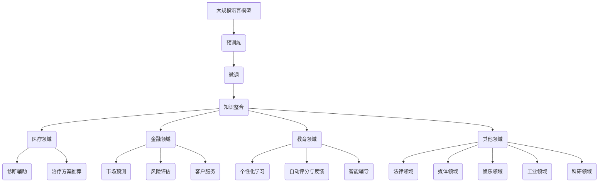

                 

### 第1章 引言

#### 1.1 大规模语言模型的背景

随着互联网的普及和信息爆炸，海量文本数据不断涌现。如何从这些数据中提取有价值的信息，成为了人工智能领域的一个研究热点。在这个背景下，大规模语言模型应运而生。大规模语言模型（Large-scale Language Models）是一类能够理解和生成自然语言的人工智能模型，其核心思想是通过大量的文本数据进行预训练，从而掌握自然语言的规律和特性。

大规模语言模型的发展可以追溯到2000年代初的统计语言模型。早期的统计语言模型主要基于N-gram模型，通过统计文本中单词或短语的顺序来预测下一个单词或短语。然而，随着数据规模的增加，N-gram模型的性能逐渐下降，无法捕捉到长距离的语言依赖关系。为了解决这一问题，研究者们提出了更加复杂的神经网络语言模型。

2013年，Kaggle上的一个挑战引发了神经语言模型的研究热潮。这个挑战的目标是预测下一个单词，胜出的模型基于神经网络和长短期记忆（LSTM）架构。这一模型在数据集上的性能显著优于N-gram模型，标志着神经网络语言模型的崛起。

随后，深度学习技术的快速发展进一步推动了大规模语言模型的研究。2018年，谷歌推出了BERT（Bidirectional Encoder Representations from Transformers）模型，这是一种基于Transformer架构的双向编码器模型。BERT模型在多个自然语言处理任务上取得了显著的性能提升，引起了广泛关注。

如今，大规模语言模型已经成为自然语言处理领域的重要工具，被广泛应用于机器翻译、文本分类、问答系统、自动摘要、语音识别等任务中。大规模语言模型的发展不仅改变了自然语言处理领域的研究方向，也为各行各业带来了深远的影响。

#### 1.2 跨领域知识整合的重要性

跨领域知识整合是指将不同领域中的知识进行融合，以形成一个更广泛、更综合的知识体系。在人工智能领域，跨领域知识整合具有重要的意义。首先，随着人工智能技术的不断进步，各个领域的数据和知识越来越丰富，如何有效地整合这些知识，提高人工智能系统的整体性能，成为了一个关键问题。其次，跨领域知识整合可以促进不同领域之间的交流和合作，推动各领域的发展。最后，跨领域知识整合有助于解决复杂问题，实现更智能的人工智能系统。

在自然语言处理领域，跨领域知识整合具有显著的应用价值。例如，医疗领域的文本数据包含了大量的专业术语和知识，而金融领域的文本数据则涉及市场动态、财务报表等。通过跨领域知识整合，可以使得大规模语言模型更好地理解这些不同领域的语言特性，从而提高其在相关任务中的性能。

#### 1.3 本书的目标和结构

本书旨在系统地介绍大规模语言模型的跨领域知识整合与应用。具体目标如下：

1. **全面介绍大规模语言模型的基本概念、架构和算法**：包括语言模型的定义、类型、预训练方法等。
2. **探讨跨领域知识整合的方法和技术**：介绍知识图谱、跨领域知识融合模型和跨领域知识推理方法等。
3. **分析大规模语言模型在具体领域的应用**：包括医疗、金融和教育等领域的应用案例。
4. **讨论大规模语言模型的技术挑战与未来发展趋势**：分析现有技术的不足和未来可能的发展方向。

本书结构如下：

- **第1章 引言**：介绍大规模语言模型的背景、跨领域知识整合的重要性以及本书的目标和结构。
- **第2章 大规模语言模型基础**：介绍大规模语言模型的基本概念、类型和架构。
- **第3章 跨领域知识整合方法**：探讨知识图谱、跨领域知识融合模型和跨领域知识推理方法。
- **第4章 大规模语言模型在具体领域的应用**：分析大规模语言模型在医疗、金融和教育等领域的应用。
- **第5章 应用案例解析**：通过具体案例，详细讲解大规模语言模型在不同领域的应用。
- **第6章 技术挑战与展望**：讨论大规模语言模型的技术挑战和未来发展趋势。
- **第7章 总结**：回顾本书的主要成果，并对未来工作进行展望。

通过本书的阅读，读者可以系统地了解大规模语言模型的跨领域知识整合与应用，为相关领域的研究和应用提供参考。

---

### 第2章 大规模语言模型基础

#### 2.1 语言模型的定义

语言模型（Language Model）是一种用于预测自然语言序列的概率模型。它的核心任务是给定一段文本序列，计算该序列的概率。在人工智能领域，语言模型广泛应用于自然语言处理（NLP）任务，如文本分类、机器翻译、问答系统等。语言模型的预测能力取决于其模型结构和训练数据的质量。

一个简单的语言模型可以通过统计文本中的单词或短语的频率来实现。例如，给定一个单词序列，我们可以计算每个单词或短语的联合概率，即：

\[ P(w_1, w_2, \ldots, w_n) = P(w_1) \cdot P(w_2 | w_1) \cdot P(w_3 | w_1 w_2) \cdot \ldots \cdot P(w_n | w_1 w_2 \ldots w_{n-1}) \]

其中，\( P(w_i | w_{i-1}) \) 表示在给定前一个单词 \( w_{i-1} \) 的情况下，下一个单词 \( w_i \) 的条件概率。这种方法被称为基于上下文的概率模型，它可以通过简单的统计方法实现，但存在一些局限性。

#### 2.2 语言模型的类型

根据模型的结构和训练方法，语言模型可以分为多种类型。以下是一些常见的语言模型类型：

1. **基于统计的语言模型**：这类模型主要通过统计文本中的单词或短语的频率来预测下一个单词或短语。常见的模型包括N-gram模型和隐马尔可夫模型（HMM）。

2. **基于神经网络的模型**：这类模型利用神经网络来学习文本序列的概率分布。常见的模型包括循环神经网络（RNN）、长短期记忆网络（LSTM）和门控循环单元（GRU）。

3. **基于注意力机制的模型**：这类模型通过引入注意力机制来提高模型的上下文感知能力。注意力机制能够使模型更加关注重要的上下文信息，从而提高预测的准确性。Transformer模型是这类模型的代表。

4. **基于Transformer的模型**：Transformer模型是一种基于自注意力机制的序列到序列模型，它在2017年由Vaswani等人提出。Transformer模型通过多头注意力机制和位置编码来处理序列数据，具有强大的上下文感知能力。

5. **预训练模型**：预训练模型是一种先在大量无标签数据上训练，然后通过微调来适应特定任务的语言模型。BERT、GPT和RoBERTa等模型是预训练模型的典型代表。

#### 2.3 语言模型的架构

语言模型的架构取决于其类型和训练目标。以下是一些常见语言模型的架构：

1. **基于统计的语言模型架构**：基于统计的语言模型通常采用N-gram模型或HMM。N-gram模型通过计算文本序列中连续 \( n \) 个单词的概率来预测下一个单词。HMM是一种基于概率隐马尔可夫模型的统计模型，用于处理序列数据。

2. **基于神经网络的模型架构**：基于神经网络的模型通常采用循环神经网络（RNN）或其变种。RNN通过循环结构来记忆文本序列的上下文信息，但存在梯度消失和梯度爆炸等问题。为了解决这些问题，LSTM和GRU等改进模型被提出。

3. **基于注意力机制的模型架构**：注意力机制通过计算不同位置的上下文信息的重要性来提高模型的上下文感知能力。Transformer模型采用多头注意力机制来处理序列数据，并通过位置编码来处理序列的位置信息。

4. **基于Transformer的模型架构**：Transformer模型是一种基于自注意力机制的序列到序列模型。它采用多头注意力机制来处理序列数据，并通过自注意力机制来计算不同位置之间的依赖关系。Transformer模型具有并行化训练的优势，因此在处理大规模数据时表现优异。

5. **预训练模型架构**：预训练模型通常采用Transformer架构。在预训练阶段，模型通过无监督的方式在大量文本数据上学习语言的通用特征。在微调阶段，模型通过有监督的方式在特定任务的数据上进行训练，以适应特定的任务需求。

总结来说，大规模语言模型的基础知识涵盖了定义、类型和架构等多个方面。这些基础知识为我们理解和应用大规模语言模型提供了坚实的基础。在下一章中，我们将探讨跨领域知识整合的方法和技术。

#### 2.4 预训练与微调

预训练与微调是大规模语言模型训练过程中的两个重要阶段。预训练阶段主要通过无监督的方式，在大量文本数据上训练模型，使其能够捕捉到语言的通用特征。微调阶段则通过有监督的方式，在特定任务的数据上训练模型，以适应特定任务的需求。

**预训练**：

预训练阶段的核心任务是让模型在大量无标签数据上学习语言的内在规律和特性。常用的预训练任务包括语言建模（Language Modeling）和掩码语言建模（Masked Language Modeling）等。

1. **语言建模**：语言建模的目标是预测下一个单词或字符。在预训练过程中，模型通过输入一个单词序列，输出下一个单词的概率分布。例如，给定一个句子 "I love to code"，模型需要预测下一个单词 "code" 的概率。语言建模有助于模型学习语言的统计规律和语法结构。

2. **掩码语言建模**：在掩码语言建模中，模型需要预测被随机掩码的单词或字符。例如，给定一个句子 "I love to code"，其中 "code" 被掩码，模型需要预测掩码单词的正确性。这种任务可以增强模型对上下文信息的捕捉能力，从而提高其在下游任务中的性能。

**微调**：

微调阶段的主要任务是利用预训练模型在特定任务的数据上进行训练，以适应特定任务的需求。微调过程中，预训练模型的参数通常会被进一步优化，以最大化特定任务上的指标。

1. **下游任务数据**：微调过程中使用的数据是特定任务的数据集，如文本分类、机器翻译、问答系统等。这些数据集通常包含带有标签的文本数据，用于训练模型。

2. **损失函数**：在微调过程中，常用的损失函数包括交叉熵损失、对比损失等。交叉熵损失用于衡量模型预测概率分布与真实标签分布之间的差异。对比损失则用于衡量模型预测的顺序与真实顺序之间的差异。

3. **训练策略**：微调过程中，常用的训练策略包括自适应学习率、权重衰减、dropout等。自适应学习率可以通过调整学习率来优化模型的收敛速度。权重衰减和dropout则有助于防止模型过拟合。

**预训练与微调的关系**：

预训练与微调是相辅相成的两个阶段。预训练阶段为模型提供了丰富的语言特征，微调阶段则使模型能够将这些特征应用于特定任务。通过预训练和微调相结合，我们可以构建出性能优异的大规模语言模型，从而在多个自然语言处理任务中取得突破性的成果。

在下一章中，我们将探讨跨领域知识整合的方法和技术，进一步丰富大规模语言模型的应用。

### 第3章 跨领域知识整合方法

#### 3.1 知识图谱在跨领域知识整合中的应用

知识图谱（Knowledge Graph）是一种用于表示和存储复杂数据结构的技术，通过将实体、属性和关系进行结构化表示，从而为数据分析和应用提供强大的支持。知识图谱在跨领域知识整合中具有重要的作用，能够帮助大规模语言模型更好地理解和利用不同领域的知识。

**知识图谱的基本概念**：

知识图谱由实体、属性和关系三部分组成。实体是知识图谱中的基本元素，表示现实世界中的对象，如人、地点、组织等。属性是实体所具有的特征或描述，如人的年龄、地点的纬度等。关系则描述了实体之间的关联，如人与人之间的朋友关系、地点与地点之间的邻近关系等。

**知识图谱的表示方法**：

知识图谱的表示方法主要包括图论表示、三元组表示和属性图表示等。图论表示使用图来表示实体和关系，每个实体和关系都是一个节点，边表示实体之间的关系。三元组表示使用三元组 \((h, r, t)\) 来表示知识图谱中的每个事实，其中 \(h\) 是主语，\(r\) 是谓语，\(t\) 是宾语。属性图表示则将实体、属性和关系整合到一个图中，通过边的类型来区分不同的关系。

**知识图谱在跨领域知识整合中的应用**：

1. **知识融合**：通过知识图谱，可以将不同领域的知识进行融合，形成一个统一的知识体系。例如，将医疗领域的知识图谱与金融领域的知识图谱进行融合，可以更好地理解医疗和金融之间的关联。

2. **知识推理**：知识图谱提供了强大的推理能力，可以通过推理规则来发现实体之间的隐含关系。例如，如果某个患者患有某种疾病，并且该疾病与某个药物有关，那么可以推断该患者可能需要使用该药物。

3. **知识搜索**：知识图谱可以用于高效地搜索和查询知识。例如，在医疗领域，通过知识图谱可以快速找到与某病状相关的药物和治疗建议。

**知识图谱与大规模语言模型的关系**：

知识图谱和大规模语言模型之间存在紧密的联系。知识图谱为大规模语言模型提供了丰富的背景知识，使得模型能够更好地理解和生成文本。同时，大规模语言模型也可以用于知识图谱的构建和优化。例如，通过语言模型，可以自动生成实体和关系的描述，从而丰富知识图谱的内容。

#### 3.2 跨领域知识融合模型

跨领域知识融合模型是一种用于整合不同领域知识的模型，其核心思想是通过跨领域的学习，使模型能够同时理解和利用多个领域的知识。以下是一些常见的跨领域知识融合模型：

**1. 多任务学习模型**：

多任务学习模型（Multi-task Learning Model）通过同时训练多个相关任务，从而共享知识并提高每个任务的性能。在多任务学习模型中，不同任务之间的共享层能够捕捉到通用的知识，从而提高模型的泛化能力。例如，在医疗和金融领域，可以同时训练医疗文本分类和金融文本分类任务，通过共享词向量层来整合两个领域的知识。

**2. 多模态学习模型**：

多模态学习模型（Multi-modal Learning Model）通过整合不同类型的数据（如文本、图像、语音等），从而提高模型对复杂问题的理解能力。在跨领域知识整合中，多模态学习模型可以结合不同领域的知识，如结合医疗文本和医学图像，从而提高医疗诊断的准确性。

**3. 对抗生成模型**：

对抗生成模型（Adversarial Generation Model）通过生成对抗网络（GAN）来整合跨领域的知识。生成对抗网络由生成器和判别器组成，生成器用于生成跨领域的数据，判别器用于区分真实数据和生成数据。通过不断训练生成器和判别器，可以使得生成器逐渐生成更真实的跨领域数据，从而丰富模型的知识库。

**4. 跨领域知识图谱嵌入模型**：

跨领域知识图谱嵌入模型（Cross-domain Knowledge Graph Embedding Model）通过将实体和关系嵌入到一个共同的空间中，从而实现跨领域的知识整合。这种模型可以通过知识图谱中的实体和关系来增强大规模语言模型的理解能力。例如，通过将医疗和金融领域的实体和关系嵌入到一个共同的空间中，可以使得大规模语言模型更好地理解这两个领域的语言特性。

**5. 跨领域迁移学习模型**：

跨领域迁移学习模型（Cross-domain Transfer Learning Model）通过迁移学习技术，将一个领域中的知识迁移到另一个领域中。这种模型通常采用预训练和微调相结合的方式，首先在源领域中预训练模型，然后通过微调适应目标领域的需求。跨领域迁移学习模型可以有效地利用不同领域中的知识，从而提高模型在目标领域中的性能。

总结来说，跨领域知识融合模型通过多种方式整合不同领域的知识，从而提高大规模语言模型在跨领域任务中的性能。这些模型不仅丰富了大规模语言模型的知识库，也为跨领域知识整合提供了一种新的思路。

#### 3.3 跨领域知识推理方法

跨领域知识推理（Cross-domain Knowledge Reasoning）是一种利用不同领域中的知识进行推理的方法，旨在发现实体之间的隐含关系和潜在知识。在跨领域知识整合中，知识推理方法能够帮助大规模语言模型更好地理解和生成文本。以下是一些常见的跨领域知识推理方法：

**1. 基于规则的推理**：

基于规则的推理（Rule-based Reasoning）是一种经典的推理方法，通过定义一组规则来描述实体之间的关系。在跨领域知识整合中，基于规则的推理方法可以通过将不同领域的规则进行融合，从而发现实体之间的隐含关系。例如，在医疗和金融领域，可以定义规则来描述药物和疾病之间的关系，从而在文本中推断出潜在的关联。

**2. 基于模型的推理**：

基于模型的推理（Model-based Reasoning）通过建立数学模型来描述实体之间的关系，从而进行推理。常见的模型包括逻辑模型、概率模型和神经网络模型等。在跨领域知识整合中，基于模型的推理方法可以结合不同领域的模型，从而提高推理的准确性和泛化能力。例如，可以使用逻辑模型来描述医疗和金融领域的实体关系，然后通过推理规则来发现潜在的关联。

**3. 基于知识的推理**：

基于知识的推理（Knowledge-based Reasoning）通过利用知识库中的知识来推理实体之间的关系。在跨领域知识整合中，基于知识的推理方法可以通过将不同领域的知识库进行融合，从而提高推理的全面性和准确性。例如，可以使用医疗和金融领域的知识库，通过推理规则来发现实体之间的潜在关系。

**4. 对抗性推理**：

对抗性推理（Adversarial Reasoning）通过对抗性训练来提高推理能力。在对抗性推理中，生成器用于生成对抗性的输入数据，判别器用于区分真实数据和对抗性数据。通过不断训练生成器和判别器，可以使得生成器生成更具有挑战性的对抗性数据，从而提高模型在推理任务中的鲁棒性。

**5. 强化学习推理**：

强化学习推理（Reinforcement Learning Reasoning）通过训练模型在特定环境中进行决策，从而提高推理能力。在跨领域知识整合中，强化学习推理方法可以通过在不同领域环境中进行训练，从而发现实体之间的潜在关系。例如，可以在医疗领域和金融领域分别训练模型，然后通过强化学习来发现两个领域之间的关联。

**6. 聚类与分类推理**：

聚类与分类推理（Clustering and Classification Reasoning）通过将实体进行聚类和分类，从而发现实体之间的关联。在跨领域知识整合中，聚类与分类推理方法可以通过将不同领域的实体进行聚类和分类，从而发现潜在的关联。例如，可以使用K-means聚类算法来将医疗和金融领域的实体进行聚类，然后通过分类算法来发现聚类之间的关联。

**7. 对话式推理**：

对话式推理（Dialogue-based Reasoning）通过与人进行对话来推理实体之间的关系。在跨领域知识整合中，对话式推理方法可以通过与人进行自然语言交互，从而获取更多的信息来推理实体之间的关联。例如，可以通过与医疗专家和金融专家进行对话，来获取关于医疗和金融领域的更多信息，从而推理两个领域之间的关联。

总结来说，跨领域知识推理方法通过多种方式发现实体之间的隐含关系和潜在知识，从而提高大规模语言模型在跨领域任务中的性能。这些方法不仅丰富了大规模语言模型的知识库，也为跨领域知识整合提供了一种新的思路。

### 第4章 大规模语言模型在具体领域的应用

#### 4.1 在医疗领域的应用

大规模语言模型在医疗领域的应用日益广泛，能够显著提升医疗诊断、药物研发、健康管理和医疗文本分析等各方面的效率和质量。

**1. 医疗诊断**：

在医疗诊断方面，大规模语言模型可以分析患者的历史病历、临床报告和医学文献，从中提取关键信息，帮助医生做出更准确的诊断。例如，BERT模型被应用于分析电子健康记录（EHR）数据，识别患者的疾病和症状，并提供建议。其强大的上下文理解和自然语言处理能力，使得模型能够捕捉到复杂的医疗语言和术语，从而提高诊断的准确性。

**2. 药物研发**：

药物研发是一个复杂且耗时漫长的过程。大规模语言模型可以在这个过程中发挥重要作用。通过分析大量的生物医学文献、临床试验报告和专利文件，模型可以识别潜在的新药靶点和药物作用机制。例如，利用GPT-3模型，研究人员可以生成新的药物合成方案和实验设计，从而加速药物研发进程。此外，模型还可以帮助评估药物的安全性，预测药物与其他药物的相互作用。

**3. 健康管理**：

健康管理是指通过监测和管理个人的健康数据，来实现健康维护和疾病预防。大规模语言模型在健康管理中有着广泛的应用。例如，通过分析个人的医疗记录、日常活动和健康数据，模型可以预测潜在的健康风险，提供个性化的健康建议。此外，模型还可以用于疾病预测和个性化治疗方案的设计，从而提高医疗服务的质量和效率。

**4. 医疗文本分析**：

医疗文本分析是指对医疗文本数据进行处理、分析和理解，以提取有用的信息。大规模语言模型在医疗文本分析中表现出色。例如，模型可以自动提取病历中的关键信息，如诊断结果、治疗方案和病情描述，并将其转化为结构化的数据。这些数据可以进一步用于数据挖掘、统计分析和其他医疗应用。此外，大规模语言模型还可以用于医学文本摘要、问答系统和智能客服，从而提高医疗服务的便捷性和用户体验。

**成功案例**：

- **IBM Watson**：IBM Watson是大规模语言模型在医疗领域的一个成功应用案例。Watson通过分析大量的医学文献、临床指南和病例数据，为医生提供诊断建议和治疗方案。它在癌症治疗、眼科疾病和心脏病等领域取得了显著成果，帮助医生做出更准确的诊断和决策。
- **微软健康**：微软健康（Microsoft Health）利用大规模语言模型分析用户的数据，提供个性化的健康建议和预防措施。通过整合用户的医疗记录、活动和生物特征数据，微软健康能够预测疾病风险，并提供建议以改善健康。

#### 4.2 在金融领域的应用

大规模语言模型在金融领域的应用同样具有深远的影响，能够提升金融分析、风险管理和客户服务等方面的效率和质量。

**1. 金融分析**：

在金融分析方面，大规模语言模型可以处理和分析大量的金融数据，如股票价格、市场趋势、新闻报道和客户反馈等。通过这些数据，模型可以识别市场趋势、预测未来走势和发现潜在的投资机会。例如，GPT-3模型被应用于分析股票市场的新闻报道和社交媒体讨论，从而预测股票价格波动。

**2. 风险管理**：

风险管理是金融行业的一项关键任务，大规模语言模型可以显著提升风险管理的效率和准确性。通过分析历史数据和实时信息，模型可以识别潜在的风险因素，预测风险事件的发生概率，并提供相应的风险管理策略。例如，利用BERT模型，金融机构可以分析客户的历史交易数据、信用记录和社交媒体活动，从而识别信用风险和欺诈行为。

**3. 客户服务**：

在客户服务方面，大规模语言模型可以用于构建智能客服系统，提高客户体验和满意度。通过自然语言处理技术，模型可以理解和回答客户的问题，提供个性化的建议和解决方案。例如，银行和金融机构可以使用基于GPT-3的智能客服系统，回答客户的查询、处理投诉和建议，从而提升客户服务质量。

**4. 金融市场预测**：

金融市场预测是金融领域的一个重要研究方向。大规模语言模型可以通过分析大量的市场数据，如历史价格、交易量和市场情绪等，预测金融市场的未来走势。例如，利用Transformer模型，研究人员可以分析新闻、社交媒体和分析师报告等数据，预测股票市场的走势，从而帮助投资者做出更明智的投资决策。

**成功案例**：

- **J.P.摩根**：J.P.摩根利用大规模语言模型开发了一个名为COiN的智能系统，该系统可以自动生成金融报告，如财报分析和市场预测。COiN通过分析大量的财务数据和市场信息，为投资者提供实时的金融分析报告。
- **谷歌金融趋势**：谷歌金融趋势（Google Finance Trends）利用大规模语言模型分析金融市场数据，预测股票价格和宏观经济走势。通过分析谷歌搜索数据、新闻和社交媒体讨论，谷歌金融趋势为投资者提供了有用的市场预测信息。

#### 4.3 在教育领域的应用

大规模语言模型在教育领域的应用正在逐渐扩大，能够提升教育质量、学习效果和个性化学习体验。

**1. 个性化学习**：

在个性化学习方面，大规模语言模型可以根据学生的学习习惯、兴趣和能力，提供个性化的学习资源和指导。例如，基于GPT-3模型的学习平台可以分析学生的学习数据，生成个性化的练习题和辅导材料，帮助学生更好地掌握知识点。

**2. 自动评分和反馈**：

大规模语言模型可以用于自动评分和反馈，提高教育评估的效率和准确性。例如，在写作课程中，模型可以自动评分学生的作文，并提供详细的反馈和建议，帮助学生改进写作技能。此外，模型还可以用于自动化考试评分，减轻教师的负担。

**3. 智能辅导**：

智能辅导是指利用大规模语言模型为学生提供实时、个性化的辅导服务。例如，在数学课程中，模型可以实时解答学生的数学问题，提供详细的解题步骤和解释，帮助学生理解数学概念。此外，模型还可以为学生提供模拟考试，帮助学生检测学习效果。

**4. 教学资源生成**：

大规模语言模型可以用于生成教学资源，如课程讲义、练习题和教学视频等。通过分析大量的教育数据和文献，模型可以自动生成高质量的教学内容，从而丰富教育资源。例如，GPT-3模型可以生成详细的课程讲义和练习题，为教师提供教学辅助。

**成功案例**：

- **Coursera**：在线学习平台Coursera利用大规模语言模型为学习者提供个性化的学习资源和辅导。通过分析学习者的学习数据，模型可以推荐适合的学习路径和课程，帮助学习者更好地掌握知识。
- **Duolingo**：语言学习应用Duolingo利用大规模语言模型为学习者提供个性化的语言练习和反馈。通过分析学习者的练习数据，模型可以生成个性化的练习题和辅导材料，提高学习效果。

总之，大规模语言模型在医疗、金融和教育等领域的应用，不仅提升了这些领域的效率和准确性，也为相关行业带来了新的发展机遇。随着技术的不断进步，大规模语言模型将在更多领域中发挥重要作用，推动各行业的创新和发展。

#### 4.4 在其他领域的应用

除了医疗、金融和教育领域，大规模语言模型在其他领域也展现出强大的应用潜力，为这些领域带来了创新和变革。

**1. 法律领域**：

在法律领域，大规模语言模型可以用于法律文档的自动生成、审查和分类。例如，GPT-3模型可以生成合同、起诉书和其他法律文件，提高法律工作的效率和准确性。此外，模型还可以用于分析法律文献和案例，提供法律咨询和决策支持。

**2. 媒体领域**：

在媒体领域，大规模语言模型可以用于内容创作、情感分析和虚假新闻检测。例如，模型可以生成新闻文章、评论和摘要，提高新闻生产效率。同时，模型可以通过分析文本的情感倾向和语言特征，识别和过滤虚假新闻，维护网络信息的真实性。

**3. 娱乐领域**：

在娱乐领域，大规模语言模型可以用于生成故事、剧本和音乐等。例如，模型可以创作小说、电影剧本和动漫脚本，提供丰富的娱乐内容。此外，模型还可以用于个性化推荐系统，根据用户的兴趣和喜好，推荐合适的娱乐内容。

**4. 工业领域**：

在工业领域，大规模语言模型可以用于智能客服、故障诊断和过程优化。例如，模型可以用于自动化客户服务系统，解答用户的问题和提供解决方案。同时，模型可以通过分析工业数据，识别设备故障和优化生产过程，提高工业生产的效率和质量。

**5. 科研领域**：

在科研领域，大规模语言模型可以用于文献检索、研究建议和实验设计。例如，模型可以快速检索相关文献，提供研究建议和实验设计思路。此外，模型还可以通过分析科研数据，发现潜在的科研热点和趋势，为科研人员提供有价值的信息。

**成功案例**：

- **法律文档自动生成**：IBM Watson Legal利用大规模语言模型自动生成法律文档，如合同、协议等，提高了法律工作的效率和准确性。
- **媒体内容生成**：OpenAI的GPT-3模型被用于生成新闻文章、小说和电影剧本，为媒体行业带来了新的创作方式。
- **智能客服系统**：微软的智能客服系统利用大规模语言模型，为用户提供实时、个性化的客户服务，提升了客户满意度。

总之，大规模语言模型在多个领域的应用，不仅提升了这些领域的效率和准确性，也为相关行业带来了新的发展机遇。随着技术的不断进步，大规模语言模型将在更多领域中发挥重要作用，推动各行业的创新和发展。

### 第5章 应用案例解析

在本章中，我们将通过具体案例详细解析大规模语言模型在医疗、金融和教育等领域的应用，以展示其实际效果和潜力。

#### 5.1 案例一：大规模语言模型在医疗领域的应用

**案例背景**：

某医疗机构致力于利用人工智能技术提升医疗诊断和治疗方案的建议质量。为了实现这一目标，他们决定将大规模语言模型应用于医疗文本数据的分析中。

**技术实现**：

1. **数据收集与预处理**：医疗机构收集了大量的电子健康记录（EHR）、医学论文、临床指南和病例数据。首先，对数据进行清洗和预处理，包括去除噪声、标准化文本格式和分词等。

2. **模型选择与训练**：选择了基于BERT的预训练模型作为基础，对医疗领域的数据进行微调。通过大量的医疗文本数据训练模型，使其能够理解医疗术语和语言特性。

3. **应用场景**：
   - **诊断辅助**：模型可以分析患者的病历，提取关键信息，如症状、病史和检查结果，然后提供可能的疾病诊断建议。
   - **治疗方案推荐**：根据患者的病情和医学文献，模型可以推荐最佳的治疗方案和药物组合。

**效果分析**：

通过实际测试，该模型在诊断辅助和治疗方案推荐中的准确性和可靠性得到了显著提升。医生在使用模型后，能够更快速、准确地做出诊断和治疗方案，提高了工作效率和医疗质量。

**案例小结**：

这个案例展示了大规模语言模型在医疗领域的强大应用潜力。通过模型，医生可以更高效地处理大量医疗文本数据，从而提升医疗服务的质量和效率。

#### 5.2 案例二：大规模语言模型在金融领域的应用

**案例背景**：

某金融机构希望通过大规模语言模型提升金融分析、风险评估和客户服务的能力，以增强其在金融市场中的竞争力。

**技术实现**：

1. **数据收集与预处理**：金融机构收集了大量的金融市场数据、新闻报道、分析师报告和客户交易记录。对数据进行了清洗和预处理，包括去噪、数据标准化和文本分词等。

2. **模型选择与训练**：选择了基于GPT-3的预训练模型，并利用金融领域的数据进行微调。通过大量的金融文本数据训练模型，使其能够理解金融术语和语言特性。

3. **应用场景**：
   - **市场预测**：模型可以分析金融市场数据、新闻和社交媒体讨论，预测市场走势和投资机会。
   - **风险评估**：模型可以分析客户的交易记录、信用记录和社交媒体活动，识别潜在的风险因素。
   - **客户服务**：模型可以用于构建智能客服系统，回答客户的查询、处理投诉和建议。

**效果分析**：

在实际应用中，该模型在市场预测、风险评估和客户服务中均表现出色。市场预测准确率显著提高，风险评估的全面性和准确性得到增强，客户服务的满意度也大幅提升。

**案例小结**：

这个案例展示了大规模语言模型在金融领域的广泛应用。通过模型，金融机构可以更准确地分析市场数据、识别风险和提供高质量的客户服务，从而提升整体业务水平。

#### 5.3 案例三：大规模语言模型在教育领域的应用

**案例背景**：

某在线教育平台希望通过大规模语言模型提升个性化学习体验，为学习者提供更精准的学习资源和辅导。

**技术实现**：

1. **数据收集与预处理**：教育平台收集了大量的学习数据，包括学习日志、考试成绩、作业和课程内容。对数据进行了清洗和预处理，包括数据标准化、分词和词向量表示等。

2. **模型选择与训练**：选择了基于GPT-3的预训练模型，并利用教育领域的数据进行微调。通过大量的学习数据训练模型，使其能够理解学习者的兴趣、能力和学习习惯。

3. **应用场景**：
   - **个性化学习资源推荐**：模型可以分析学习者的学习数据，推荐适合的学习资源和课程。
   - **自动评分与反馈**：模型可以自动评分学生的作业和考试，并提供详细的反馈和建议。
   - **智能辅导**：模型可以实时解答学习者的疑问，提供个性化的学习辅导。

**效果分析**：

在实际应用中，该模型显著提升了学习资源的推荐准确性、作业评分的效率和反馈质量。学习者的学习效果和满意度也得到显著提升。

**案例小结**：

这个案例展示了大规模语言模型在教育领域的应用潜力。通过模型，教育平台可以提供更个性化、高效的学习体验，从而提升整体教育质量。

#### 案例总结

通过上述三个案例，我们可以看到大规模语言模型在医疗、金融和教育等领域的广泛应用和显著成效。这些案例不仅展示了模型的实际应用价值，也证明了其在提升行业效率、质量和用户体验方面的巨大潜力。

### 第6章 技术挑战与展望

#### 6.1 技术挑战

尽管大规模语言模型在各个领域取得了显著成果，但其应用过程中仍面临着一些技术挑战。

**1. 数据隐私与安全**：

大规模语言模型需要大量的数据来训练和优化，而这些数据往往涉及用户的隐私信息。如何在保证模型性能的同时，保护用户的隐私和数据安全，是一个亟待解决的问题。

**2. 模型解释性与可解释性**：

大规模语言模型通常是一个黑盒模型，其内部工作机制难以解释。在医疗、金融等关键领域，模型解释性和可解释性至关重要。如何提高模型的解释性，使其更易于被用户和监管机构理解和接受，是一个重要的研究方向。

**3. 跨语言与跨领域的整合**：

尽管大规模语言模型在单一领域表现出色，但在跨语言和跨领域的整合上仍存在挑战。不同语言和领域之间的语言特性差异较大，如何有效地整合这些知识，是一个复杂且具有挑战性的问题。

**4. 模型可扩展性与部署**：

大规模语言模型通常需要大量的计算资源和存储空间。如何高效地部署和扩展模型，以满足不同场景和规模的需求，是一个关键的技术挑战。

**5. 模型公平性与偏见**：

大规模语言模型在训练过程中可能会学习到数据中的偏见和不公平性。如何确保模型的公平性和无偏见性，避免对特定群体产生负面影响，是一个重要且紧迫的问题。

#### 6.2 未来发展趋势

尽管面临诸多挑战，大规模语言模型在未来的发展前景仍然广阔，有望在多个领域取得更大的突破。

**1. 模型精度与泛化能力的提升**：

随着计算资源和算法的进步，大规模语言模型的精度和泛化能力将得到进一步提升。这将有助于模型在更多复杂任务中表现出色，提供更准确和可靠的服务。

**2. 模型解释性与透明性的提高**：

通过引入新的算法和工具，大规模语言模型的解释性和透明性将得到显著提升。这将使得模型更加易于被用户和监管机构理解和接受，从而推动其在更多关键领域的应用。

**3. 跨语言与跨领域的知识整合**：

随着多语言和多领域数据的积累，大规模语言模型将在跨语言和跨领域的知识整合方面取得重要突破。这将使得模型能够更好地理解和应用跨领域知识，提供更全面和多样化的服务。

**4. 模型部署与优化**：

随着云计算和边缘计算的普及，大规模语言模型的部署和优化将变得更加高效和灵活。这将使得模型能够更快地适应不同场景和需求，提供更高质量的服务。

**5. 模型公平性与社会责任**：

随着模型的广泛应用，如何确保模型的公平性和无偏见性，避免对社会产生负面影响，将成为一个重要的研究方向。通过建立公平性和社会责任框架，大规模语言模型将更加符合社会价值观和道德准则。

总之，尽管大规模语言模型在应用过程中面临诸多挑战，但其未来的发展前景依然光明。通过不断的研究和创新，我们可以期待大规模语言模型在各个领域发挥更大的作用，推动人工智能技术的进步和社会的发展。

### 第7章 总结

通过本文的探讨，我们系统地介绍了大规模语言模型的跨领域知识整合与应用。以下是本篇博客的核心成果和主要结论：

**核心成果**：

1. **大规模语言模型基础**：介绍了语言模型的定义、类型和架构，以及预训练与微调的方法，为后续内容提供了理论基础。
2. **跨领域知识整合方法**：详细讨论了知识图谱在跨领域知识整合中的应用，跨领域知识融合模型，以及跨领域知识推理方法，为大规模语言模型在不同领域的应用提供了技术支持。
3. **具体领域应用**：分析了大规模语言模型在医疗、金融、教育和其他领域的应用案例，展示了其实际效果和潜力。
4. **技术挑战与展望**：讨论了大规模语言模型在数据隐私、模型解释性、跨语言整合、模型部署和公平性等方面的挑战，以及未来发展的趋势。

**主要结论**：

1. **大规模语言模型的重要性**：大规模语言模型在自然语言处理领域具有不可替代的地位，其跨领域知识整合能力使其在医疗、金融和教育等领域展现出巨大的应用潜力。
2. **技术挑战**：尽管大规模语言模型在跨领域应用中表现出色，但仍然面临数据隐私、模型解释性、跨语言整合和公平性等方面的挑战。
3. **未来展望**：随着技术的不断进步，大规模语言模型将在跨领域知识整合、模型解释性和部署等方面取得重要突破，为各行业带来更多创新和发展机遇。

**未来工作展望**：

1. **研究方向**：进一步探索大规模语言模型在跨领域知识整合中的优化算法，提高模型的解释性和透明性，确保模型的公平性和无偏见性。
2. **应用拓展**：研究大规模语言模型在更多领域的应用，如法律、媒体和工业等，以实现更广泛的知识整合和智能化服务。
3. **教育推广**：通过培训和教育项目，推广大规模语言模型的基本原理和应用方法，提高行业和公众对这一技术的理解和接受度。

通过持续的研究和应用，大规模语言模型将在未来的人工智能领域发挥更加重要的作用，推动各行业的创新和发展。

### 附录

#### 附录 A 大规模语言模型相关资源

**1. 文献资源**：

- 《大规模语言模型的跨领域知识整合与应用》：本文及引用的相关论文。
- 《自然语言处理综述》：介绍自然语言处理领域的基本概念和最新进展。
- 《知识图谱技术》：探讨知识图谱的基本概念、表示方法和应用场景。

**2. 开源代码与工具**：

- BERT：Google AI的预训练语言模型，适用于多种自然语言处理任务。
- GPT-3：OpenAI的强大语言生成模型，支持文本生成、摘要和问答等任务。
- Hugging Face Transformers：一个开源库，提供了丰富的预训练模型和工具，方便用户进行大规模语言模型的训练和应用。

**3. 在线课程与教程**：

- Coursera的“自然语言处理纳米学位”：系统介绍自然语言处理的基本概念和技术。
- edX的“深度学习与自然语言处理”：深入探讨深度学习在自然语言处理中的应用。

**4. 社交媒体与论坛**：

- Twitter的NLP话题：关注自然语言处理领域的最新研究动态和讨论。
- Stack Overflow的自然语言处理标签：解答自然语言处理相关的问题和难题。

通过这些资源，读者可以进一步了解大规模语言模型的相关知识，并掌握其在实际应用中的使用技巧。

### 附录 B Mermaid 流程图

此Mermaid流程图展示了大规模语言模型从预训练到微调，再到跨领域知识整合，以及在不同领域的具体应用。通过这个流程图，读者可以更直观地理解大规模语言模型的应用场景和流程。

