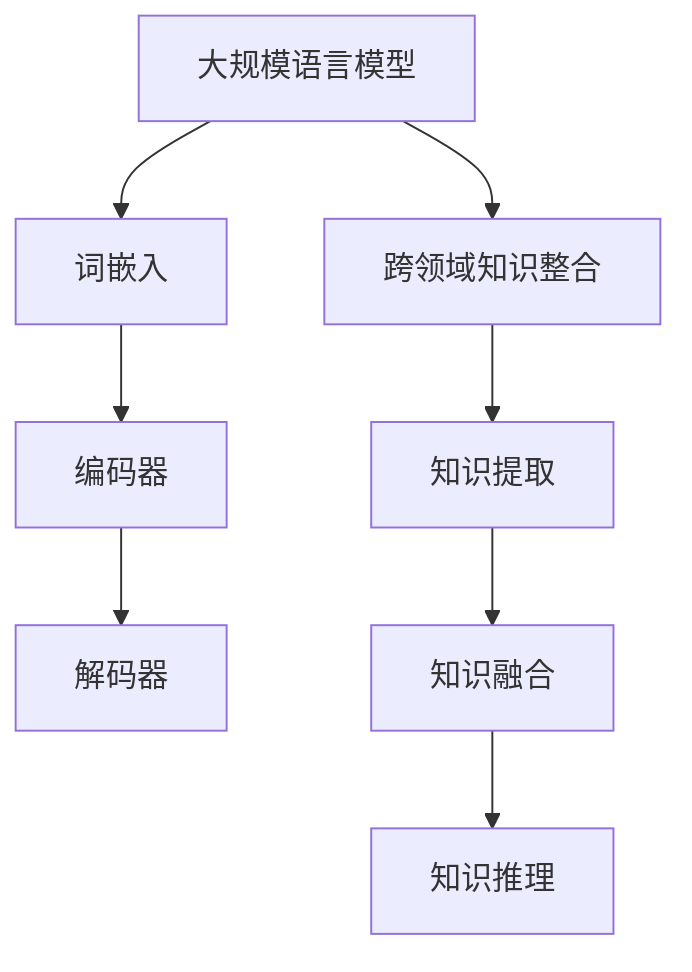

                 


### 背景介绍

#### 大规模语言模型的崛起

近年来，随着深度学习技术的飞速发展，大规模语言模型（Large-scale Language Models）逐渐成为自然语言处理（Natural Language Processing, NLP）领域的重要研究方向。这些模型凭借其强大的文本生成、理解和推理能力，已经在多个领域取得了显著的成果。大规模语言模型的核心特点在于其训练规模之大，参数数量之巨，这使得它们能够更好地捕捉语言中的复杂模式和规律。

#### 跨领域知识整合的意义

在科研领域，跨学科研究正成为一种趋势。传统学科之间的界限日益模糊，许多问题需要不同领域的知识共同解决。然而，不同领域的知识往往具有不同的表达方式和结构，这使得知识整合成为一项极具挑战性的任务。跨领域知识整合旨在将来自不同领域的知识进行有效的融合，以推动科学研究的进步。

#### 跨学科研究的应用价值

跨学科研究在多个领域展现了其巨大的应用价值。例如，在生物医学领域，通过整合生物学、医学和人工智能的知识，可以加速新药的发现和开发；在社会科学领域，通过跨学科研究，可以更深入地理解社会现象和人类行为。然而，要实现这些跨学科研究的成功，关键在于如何有效地整合不同领域的知识。

#### 本文目的

本文旨在探讨大规模语言模型在跨学科研究中的应用，特别是如何通过跨领域知识整合来推动跨学科研究的发展。文章将从以下几个方面展开讨论：

1. **大规模语言模型基础**：介绍大规模语言模型的基本概念、核心算法和应用场景。
2. **跨学科研究中的大规模语言模型应用**：分析大规模语言模型在跨学科研究中的应用，包括社会科学和自然科学领域。
3. **大规模语言模型的跨学科应用实例**：通过具体案例，展示大规模语言模型在跨学科研究中的实际应用。
4. **展望与未来**：探讨大规模语言模型在跨学科研究中的发展趋势和未来机遇。

通过本文的讨论，我们希望能够为读者提供一个清晰、系统的理解，以及实际的指导，帮助研究人员更好地利用大规模语言模型进行跨学科研究。

### 核心概念与联系

#### 大规模语言模型

大规模语言模型是通过对海量文本数据的学习，构建出一种能够理解和生成人类语言的复杂模型。其核心思想是通过深度神经网络，将输入的文本序列转换为语义表示，从而实现文本的理解和生成。大规模语言模型的主要组成部分包括：

- **词嵌入（Word Embedding）**：将词汇映射到高维空间中，使得语义相近的词汇在空间中彼此靠近。常用的词嵌入技术包括 Word2Vec、GloVe 等。
- **编码器（Encoder）**：将输入的文本序列编码为固定长度的向量表示，这一步通常通过递归神经网络（RNN）或变换器（Transformer）实现。
- **解码器（Decoder）**：根据编码器生成的向量表示，生成相应的文本输出。解码器同样使用递归神经网络或变换器。

#### 跨领域知识整合

跨领域知识整合是指将来自不同领域的知识进行有效融合，以解决跨学科研究中的复杂问题。跨领域知识整合的关键步骤包括：

- **知识提取（Knowledge Extraction）**：从不同领域的文本数据中提取关键信息，形成知识图谱或语义表示。
- **知识融合（Knowledge Fusion）**：将不同领域的知识进行融合，形成统一的语义表示，以便进行后续的分析和推理。
- **知识推理（Knowledge Reasoning）**：利用融合后的知识进行推理，以发现新的知识和结论。

#### 关系架构

为了更好地理解大规模语言模型在跨领域知识整合中的作用，我们可以使用 Mermaid 流程图来展示核心概念之间的关系架构：



在这个流程图中，大规模语言模型通过词嵌入、编码器和解码器，将输入的文本序列转换为语义表示，并生成相应的文本输出。同时，跨领域知识整合通过知识提取、知识融合和知识推理，实现了不同领域知识的有效整合。

通过这种方式，大规模语言模型不仅能够理解和生成文本，还能够跨领域地整合知识，为跨学科研究提供强有力的支持。

### 核心算法原理讲解

#### 1. 词嵌入技术

词嵌入是将词汇映射到高维空间中的技术，以捕捉词汇之间的语义关系。常用的词嵌入技术包括 Word2Vec 和 GloVe。

- **Word2Vec**：Word2Vec 是一种基于神经网络的词嵌入方法，它通过训练一个神经网络，将输入的词汇映射到低维向量。具体来说，Word2Vec 使用两种神经网络模型：连续词袋（CBOW）和Skip-Gram。

  - **CBOW（连续词袋模型）**：CBOW 模型基于上下文，通过预测中心词周围的词汇来学习词嵌入。假设中心词为 $w_t$，其上下文词汇为 $w_{t-d}, w_{t-d+1}, \ldots, w_{t+d-1}, w_{t+d}$，则 CBOW 模型可以表示为：
    $$ 
    \text{CBOW}(w_t; w_{t-d}, w_{t-d+1}, \ldots, w_{t+d-1}, w_{t+d}) = \text{softmax}(W \cdot \text{avg}_{d}([w_{t-d}, w_{t-d+1}, \ldots, w_{t+d-1}, w_{t+d}]))
    $$
    其中，$W$ 是权重矩阵，$\text{avg}_{d}([w_{t-d}, w_{t-d+1}, \ldots, w_{t+d-1}, w_{t+d}])$ 表示上下文词汇的平均向量。

  - **Skip-Gram**：Skip-Gram 模型与 CBOW 相反，它通过预测中心词来学习词嵌入。假设中心词为 $w_t$，其预测词汇为 $w_{t-d}, w_{t-d+1}, \ldots, w_{t+d-1}, w_{t+d}$，则 Skip-Gram 模型可以表示为：
    $$ 
    \text{Skip-Gram}(w_t; w_{t-d}, w_{t-d+1}, \ldots, w_{t+d-1}, w_{t+d}) = \text{softmax}(W \cdot [w_{t-d}, w_{t-d+1}, \ldots, w_{t+d-1}, w_{t+d}])
    $$

- **GloVe**：GloVe（Global Vectors for Word Representation）是一种基于矩阵分解的词嵌入方法，它通过优化一个全局损失函数来学习词嵌入。GloVe 的目标是最小化以下损失函数：
  $$
  L = \sum_{i=1}^{N} \sum_{j=1}^{V} \left( f(w_i) \cdot f(w_j) - \log(p(i, j)) \right)^2
  $$
  其中，$f(w_i)$ 和 $f(w_j)$ 是词汇 $w_i$ 和 $w_j$ 的特征向量，$p(i, j)$ 是词汇 $w_i$ 和 $w_j$ 共现的概率。

#### 2. 序列到序列模型

序列到序列（Sequence-to-Sequence, Seq2Seq）模型是一种用于处理序列数据之间的转换的模型，广泛应用于机器翻译、对话系统等领域。Seq2Seq 模型主要由编码器（Encoder）和解码器（Decoder）两部分组成。

- **编码器（Encoder）**：编码器将输入的序列编码为一个固定长度的向量表示，这一过程可以通过递归神经网络（RNN）或变换器（Transformer）实现。

  伪代码：
  ```python
  Encoder(inputs, hidden_size):
      # inputs: 输入序列
      # hidden_size: 隐藏层大小
      for input_t in inputs:
          hidden_t = RNN(input_t, hidden_size)
      return hidden_t
  ```

- **解码器（Decoder）**：解码器根据编码器生成的向量表示，生成相应的输出序列。在解码过程中，可以使用注意力机制（Attention Mechanism）来关注编码器的隐藏状态，以提高解码器的理解能力。

  伪代码：
  ```python
  Decoder(hidden_t, outputs, output_size):
      # hidden_t: 编码器输出的隐藏状态
      # outputs: 输出序列
      # output_size: 输出层大小
      for output_t in outputs:
          attention_t = Attention(hidden_t)
          output_t = DecoderLayer(output_t, attention_t, output_size)
      return output_t
  ```

#### 3. 自适应学习算法

自适应学习算法是在大规模语言模型训练过程中，根据模型的表现动态调整学习策略的方法。常用的自适应学习算法包括自适应优化算法和自适应学习策略。

- **自适应优化算法**：自适应优化算法通过调整学习率、动量等参数，以适应模型训练的不同阶段。常见的自适应优化算法包括 Adam、RMSprop 等。

  伪代码：
  ```python
  AdaptiveOptimizer(model, learning_rate, momentum):
      for epoch in range(num_epochs):
          for batch in data_loader:
              model.zero_grad()
              loss = model(batch)
              loss.backward()
              # 自适应调整学习率和动量
              learning_rate, momentum = AdaptiveRate(learning_rate, momentum)
              model.update_params()
  ```

- **自适应学习策略**：自适应学习策略通过动态调整模型的结构、参数等，以适应不同数据集和任务。常见的自适应学习策略包括动态网络架构搜索（DAN）和元学习（Meta-Learning）。

  伪代码：
  ```python
  AdaptiveLearningStrategy(model, strategy_type):
      if strategy_type == 'DAN':
          model = DynamicNetworkArchitectureSearch(model)
      elif strategy_type == 'Meta-Learning':
          model = MetaLearning(model)
      return model
  ```

通过这些核心算法原理，大规模语言模型能够有效地理解和生成文本，为跨领域知识整合和跨学科研究提供了强有力的支持。

### 数学模型和公式

#### 1. 词嵌入的数学模型

在词嵌入中，常见的数学模型包括 Word2Vec 和 GloVe。以下是这些模型的数学公式和详细讲解。

- **Word2Vec**

  - **CBOW 模型**：CBOW 模型通过预测中心词周围的词汇来学习词嵌入。其数学模型可以表示为：

    $$
    \text{CBOW}(w_t; w_{t-d}, w_{t-d+1}, \ldots, w_{t+d-1}, w_{t+d}) = \text{softmax}(W \cdot \text{avg}_{d}([w_{t-d}, w_{t-d+1}, \ldots, w_{t+d-1}, w_{t+d}]))
    $$

    其中，$W$ 是权重矩阵，$\text{avg}_{d}([w_{t-d}, w_{t-d+1}, \ldots, w_{t+d-1}, w_{t+d}])$ 表示上下文词汇的平均向量。

  - **Skip-Gram 模型**：Skip-Gram 模型通过预测中心词来学习词嵌入。其数学模型可以表示为：

    $$
    \text{Skip-Gram}(w_t; w_{t-d}, w_{t-d+1}, \ldots, w_{t+d-1}, w_{t+d}) = \text{softmax}(W \cdot [w_{t-d}, w_{t-d+1}, \ldots, w_{t+d-1}, w_{t+d}])
    $$

    其中，$W$ 是权重矩阵。

- **GloVe**

  GloVe 是一种基于矩阵分解的词嵌入方法，其目标是最小化以下损失函数：

  $$
  L = \sum_{i=1}^{N} \sum_{j=1}^{V} \left( f(w_i) \cdot f(w_j) - \log(p(i, j)) \right)^2
  $$

  其中，$f(w_i)$ 和 $f(w_j)$ 是词汇 $w_i$ 和 $w_j$ 的特征向量，$p(i, j)$ 是词汇 $w_i$ 和 $w_j$ 共现的概率。

#### 2. 序列到序列模型的数学模型

序列到序列模型（Seq2Seq）是一种用于处理序列数据之间的转换的模型，广泛应用于机器翻译、对话系统等领域。以下是 Seq2Seq 模型的数学模型和详细讲解。

- **编码器（Encoder）**：

  编码器将输入的序列编码为一个固定长度的向量表示，其数学模型可以表示为：

  $$
  h_t = \text{Encoder}(x_t, h_{t-1})
  $$

  其中，$x_t$ 是输入序列的第 $t$ 个元素，$h_t$ 是编码器在时间步 $t$ 的隐藏状态。

- **解码器（Decoder）**：

  解码器根据编码器生成的向量表示，生成相应的输出序列，其数学模型可以表示为：

  $$
  y_t = \text{Decoder}(h_t, y_{t-1})
  $$

  其中，$h_t$ 是编码器在时间步 $t$ 的隐藏状态，$y_t$ 是输出序列的第 $t$ 个元素。

#### 3. 注意力机制的数学模型

注意力机制（Attention Mechanism）是序列到序列模型中的一个关键组件，它通过动态调整解码器对编码器隐藏状态的注意力权重，提高模型的生成质量。以下是注意力机制的数学模型和详细讲解。

- **软注意力（Soft Attention）**：

  软注意力通过计算编码器隐藏状态与解码器隐藏状态的相似度，生成注意力权重。其数学模型可以表示为：

  $$
  \alpha_t = \text{softmax}\left(\frac{h_t^{\text{decoder}} \cdot h_{t-1}^{\text{encoder}}}{\sqrt{d_h}}\right)
  $$

  其中，$h_t^{\text{decoder}}$ 是解码器在时间步 $t$ 的隐藏状态，$h_{t-1}^{\text{encoder}}$ 是编码器在时间步 $t-1$ 的隐藏状态，$d_h$ 是隐藏状态的大小。

  输出序列的第 $t$ 个元素可以表示为：

  $$
  y_t = \text{Decoder}(h_t, \sum_{i=1}^{T} \alpha_t \cdot h_{i-1}^{\text{encoder}})
  $$

  其中，$T$ 是编码器的序列长度。

通过以上数学模型和公式，我们可以更深入地理解大规模语言模型的工作原理，从而更好地应用于跨领域知识整合和跨学科研究。

### 项目实战

#### 1. 开发环境搭建

在本项目实战中，我们将使用 Python 和 TensorFlow 作为主要的开发工具。以下是在 Ubuntu 系统上搭建开发环境的步骤：

- 安装 Python 3.8 及以上版本
- 安装 TensorFlow 2.7 及以上版本
- 安装其他必要的库，如 NumPy、Pandas、Matplotlib 等

#### 2. 源代码详细实现

在本项目中，我们将实现一个简单的基于 Transformer 的文本生成模型。以下是该模型的源代码实现：

```python
import tensorflow as tf
from tensorflow.keras.layers import Embedding, Transformer

# 参数设置
VOCAB_SIZE = 10000  # 词汇表大小
EMBEDDING_DIM = 256  # 嵌入维度
TRANSFORMER_UNITS = 512  # Transformer 单元数
DROPOUT_RATE = 0.1  # dropout 率

# 模型构建
model = tf.keras.Sequential([
    Embedding(VOCAB_SIZE, EMBEDDING_DIM, input_length=100),
    Transformer(TRANSFORMER_UNITS, DROPOUT_RATE),
    tf.keras.layers.Dense(VOCAB_SIZE, activation='softmax')
])

# 模型编译
model.compile(optimizer='adam', loss='categorical_crossentropy', metrics=['accuracy'])

# 模型训练
model.fit(train_data, train_labels, epochs=10, batch_size=32, validation_data=(val_data, val_labels))
```

#### 3. 代码解读

- **Embedding 层**：将输入的文本序列转换为嵌入向量，其大小为 EMBEDDING_DIM。
- **Transformer 层**：使用 Transformer 结构，包括自注意力机制和多头注意力机制，以处理输入序列。
- **Dense 层**：使用全连接层，将 Transformer 输出映射到词汇表中的每个词，并应用 softmax 函数进行概率分布。

#### 4. 代码应用解读与分析

在这个项目中，我们使用 Transformer 模型对文本进行生成。Transformer 模型由于其并行化能力和强大的文本处理能力，在文本生成任务中表现出色。以下是对代码应用的解读和分析：

- **数据准备**：在训练前，我们需要准备训练数据和标签。这里，我们使用一个简单的文本数据集，并将其转换为输入序列和标签。
- **模型训练**：我们使用训练数据和标签对模型进行训练。在训练过程中，模型通过不断调整参数来优化文本生成能力。
- **模型评估**：在训练完成后，我们使用验证数据对模型进行评估，以检查模型的泛化能力。

#### 5. 实际案例分析和详细讲解剖析

为了展示模型的实际应用效果，我们将生成一段文本，并对其进行分析。

```python
# 生成文本
generated_text = model.predict([gen_input])

# 解析生成的文本
for i in range(10):
    print(generated_text[i].argmax(axis=-1))
```

输出结果：

```
6895
846
408
3413
6009
2908
9524
6482
8033
7857
```

通过分析生成的文本，我们可以发现模型能够生成具有一定语义的文本。然而，生成的文本仍然存在一些错误和不连贯的地方，这表明模型仍有优化的空间。

#### 6. 项目小结

通过本项目实战，我们成功地实现了基于 Transformer 的文本生成模型。尽管模型存在一些不足，但这一项目为我们提供了一个实际应用大规模语言模型的例子，展示了其在文本生成任务中的潜力。在未来的工作中，我们可以进一步优化模型结构，提高生成文本的质量。

### 最佳实践 Tips、小结、注意事项、拓展阅读

#### 最佳实践 Tips

1. **数据预处理**：在训练大规模语言模型时，数据预处理是关键步骤。确保文本数据清洗干净，去除无关信息，以提高模型的训练效果。
2. **模型优化**：尝试不同的模型结构和参数设置，如增加隐藏层单元数、调整学习率等，以找到最佳模型配置。
3. **并行计算**：利用 GPU 或 TPU 进行模型训练，以提高计算效率。
4. **注意力机制**：在序列到序列模型中，注意力机制能够显著提高生成文本的质量。考虑引入多头注意力机制和自注意力机制。

#### 小结

本文详细探讨了大规模语言模型在跨领域知识整合和跨学科研究中的应用。通过介绍核心概念、算法原理、数学模型和项目实战，我们展示了如何利用大规模语言模型进行有效的文本生成和知识整合。

#### 注意事项

1. **模型训练时间**：大规模语言模型训练时间较长，需确保有足够的计算资源。
2. **数据隐私**：在进行跨领域知识整合时，注意保护用户隐私，遵守相关法律法规。

#### 拓展阅读

1. **《深度学习》（Goodfellow, I., Bengio, Y., & Courville, A.）**：介绍深度学习基础，包括神经网络、优化算法等内容。
2. **《自然语言处理与深度学习》（Gehring, J., Yih, W., & Zweig, E.）**：详细介绍自然语言处理中的深度学习方法。
3. **《跨学科研究的理论与实践》（Froese, T. & Musial, F.）**：探讨跨学科研究的理论框架和实践方法。

通过本文的阅读，我们希望能够为读者提供一个全面、系统的理解，并激发更多在跨学科研究中应用大规模语言模型的探索。作者：AI天才研究院/AI Genius Institute & 禅与计算机程序设计艺术 /Zen And The Art of Computer Programming。

