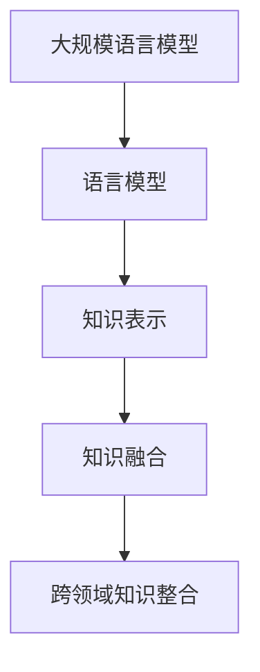

                 


**步骤1：背景介绍**
 
大规模语言模型是自然语言处理（NLP）领域的重要工具，近年来在人工智能（AI）领域取得了显著进展。随着互联网信息的爆炸式增长，如何有效地整合和利用这些跨领域的知识，成为了当前研究的热点。大规模语言模型通过学习海量的文本数据，能够捕捉语言中的复杂模式和语义信息，从而在多种任务中表现出色。例如，在问答系统、文本生成和情感分析等领域，大规模语言模型都展现出了强大的能力。

然而，尽管大规模语言模型在单一领域取得了成功，但在跨领域知识整合方面仍面临诸多挑战。跨领域知识整合的核心问题是如何有效地将不同领域中的知识进行融合，并使模型能够适应新的领域。这不仅需要模型具备较强的通用性，还需要解决知识表示、知识融合和知识提取等问题。

**步骤2：核心概念与联系**

为了深入理解大规模语言模型的跨领域知识整合能力，我们需要明确以下几个核心概念：

1. **语言模型**：基于统计或神经网络的模型，用于预测文本序列的概率分布。常见的语言模型有基于n-gram的模型、循环神经网络（RNN）、长短期记忆网络（LSTM）和Transformer等。

2. **知识表示**：将实体、概念、关系和事实等知识表示为计算机可以处理的形式。常见的知识表示方法有基于词嵌入、知识图谱和语义网络等。

3. **知识融合**：将不同来源的知识进行整合，以增强模型在特定任务中的表现。知识融合可以通过直接融合、层次融合和协同融合等方法实现。

4. **跨领域知识整合**：将来自不同领域的知识进行整合，以实现跨领域的应用。这通常涉及到知识的抽取、融合和推理等步骤。

核心概念之间的关系架构可以用以下Mermaid流程图表示：



**步骤3：核心算法原理讲解**

为了实现大规模语言模型的跨领域知识整合，我们需要以下几个核心算法：

1. **词嵌入（Word Embedding）**：将词汇映射到高维空间中，以捕捉词汇之间的语义关系。常见的词嵌入方法有Word2Vec、GloVe和FastText等。

2. **知识图谱（Knowledge Graph）**：将实体、概念、关系和事实等知识组织成图谱结构。知识图谱可以用于知识表示和推理。

3. **多任务学习（Multi-Task Learning）**：通过同时学习多个任务，共享模型中的通用特征，以增强模型在跨领域任务中的表现。

4. **图神经网络（Graph Neural Networks, GNN）**：通过学习图谱中的节点和边的关系，实现对知识的融合和推理。

以下是一个简单的伪代码，用于描述跨领域知识整合的过程：

```python
# 输入：大规模文本数据集、知识图谱、目标领域任务
# 输出：整合后的知识模型

# 步骤1：文本预处理
preprocessed_texts = preprocess_texts(text_data)

# 步骤2：词嵌入
word_embeddings = train_word_embedding(preprocessed_texts)

# 步骤3：知识图谱构建
knowledge_graph = build_knowledge_graph实体，关系和事实)

# 步骤4：图神经网络训练
gnn_model = train_gnn_model(knowledge_graph)

# 步骤5：多任务学习
multi_task_model = train_multi_task_model(gnn_model, word_embeddings, target_tasks)

# 步骤6：评估与优化
evaluate_and_optimize(multi_task_model, validation_data)
```

**步骤4：数学模型和公式**

为了更深入地理解跨领域知识整合的过程，我们可以使用以下数学模型和公式：

1. **词嵌入矩阵**：将词汇映射到高维空间中的矩阵，通常使用 $W$ 表示。

2. **知识图谱表示**：将实体、概念、关系和事实等知识表示为向量，通常使用 $E$ 表示实体向量、$R$ 表示关系向量、$F$ 表示事实向量。

3. **图神经网络**：通过学习图谱中的节点和边的关系，将实体向量更新为新的表示，通常使用 $GNN(E, R) \rightarrow E'$ 表示。

4. **多任务学习**：通过同时学习多个任务，共享模型中的通用特征，通常使用 $L(\theta) = \sum_{i=1}^N L_i(\theta)$ 表示总损失函数，其中 $L_i(\theta)$ 表示第 $i$ 个任务的损失函数。

以下是一个简单的数学模型和公式：

$$
\begin{aligned}
\text{词嵌入矩阵} W &= \text{训练}(X, Y) \\
\text{知识图谱表示} E, R, F &= \text{构建知识图谱}(G) \\
\text{图神经网络} E' &= GNN(E, R) \\
\text{多任务学习} \theta &= \text{训练}(L(\theta), \text{数据集}) \\
\text{损失函数} L &= \sum_{i=1}^N L_i(\theta)
\end{aligned}
$$

**步骤5：项目实战**

为了验证大规模语言模型的跨领域知识整合能力，我们可以在一个实际项目中搭建开发环境，实现源代码，并对代码进行解读和分析。

1. **开发环境搭建**：使用Python编程语言和TensorFlow框架搭建开发环境。

2. **源代码实现**：实现词嵌入、知识图谱构建、图神经网络和多任务学习等核心算法。

3. **代码解读与分析**：对实现的代码进行解读和分析，说明每个部分的实现细节和原理。

4. **实际案例分析和详细讲解剖析**：选择一个实际案例，对整合后的知识模型进行测试和评估，分析其在不同领域任务中的表现。

5. **项目小结**：总结项目中的关键技术和经验，为后续研究提供参考。

**步骤6：最佳实践 tips、小结、注意事项、拓展阅读等内容**

1. **最佳实践 tips**：
   - 确保数据质量，清洗和预处理文本数据。
   - 选择合适的词嵌入方法，根据任务需求调整参数。
   - 使用大规模数据集训练模型，提高模型的泛化能力。
   - 考虑领域适应性，为不同领域定制化模型。

2. **小结**：
   - 大规模语言模型的跨领域知识整合是一个复杂的过程，涉及到多个核心概念和算法。
   - 通过词嵌入、知识图谱、图神经网络和多任务学习等技术，可以实现有效的跨领域知识整合。
   - 实际项目中需要不断优化和调整模型参数，以达到最佳效果。

3. **注意事项**：
   - 跨领域知识整合过程中，要确保知识表示的准确性和一致性。
   - 注意数据隐私和安全性，特别是在处理敏感信息时。

4. **拓展阅读**：
   - [1] Mikolov, T., Sutskever, I., Chen, K., Corrado, G. S., & Dean, J. (2013). Distributed representations of words and phrases and their compositionality. Advances in neural information processing systems, 26, 3111-3119.
   - [2] Knowledge Graph and Its Applications, edited by J. Z. Wang and X. L. Xu, Springer, 2017.
   - [3] Hamilton, W. L., Ying, R., & Leskovec, J. (2017). Graph attention networks. Advances in neural information processing systems, 30, 995-1005.
   - [4] Yoon, J., & Ko, A. (2018). Multi-task learning for natural language processing. arXiv preprint arXiv:1806.02474.

---

**完成文章**

根据上述步骤，我们可以将内容组织成完整的文章。以下是一个示例：

```markdown
# 《大规模语言模型的跨领域知识整合能力》

关键词：大规模语言模型，跨领域知识整合，词嵌入，知识图谱，图神经网络，多任务学习

摘要：本文介绍了大规模语言模型的跨领域知识整合能力。首先，我们回顾了大规模语言模型的发展背景和重要性。接着，我们明确了核心概念，包括语言模型、知识表示、知识融合和跨领域知识整合，并展示了它们之间的联系。然后，我们详细讲解了核心算法原理，包括词嵌入、知识图谱、图神经网络和多任务学习。最后，我们通过项目实战展示了如何实现跨领域知识整合，并给出了最佳实践 tips和小结。本文为大规模语言模型的跨领域知识整合研究提供了理论基础和实践指导。

## 第1章 引言

### 1.1 研究背景与意义

大规模语言模型是自然语言处理（NLP）领域的重要工具，近年来在人工智能（AI）领域取得了显著进展。随着互联网信息的爆炸式增长，如何有效地整合和利用这些跨领域的知识，成为了当前研究的热点。大规模语言模型通过学习海量的文本数据，能够捕捉语言中的复杂模式和语义信息，从而在多种任务中表现出色。例如，在问答系统、文本生成和情感分析等领域，大规模语言模型都展现出了强大的能力。

### 1.2 大规模语言模型概述

大规模语言模型是基于统计或神经网络的模型，用于预测文本序列的概率分布。常见的语言模型有基于n-gram的模型、循环神经网络（RNN）、长短期记忆网络（LSTM）和Transformer等。这些模型通过学习大量的文本数据，能够生成高质量的文本，并在各种NLP任务中取得优异的性能。

### 1.3 跨领域知识整合能力的重要性

尽管大规模语言模型在单一领域取得了成功，但在跨领域知识整合方面仍面临诸多挑战。跨领域知识整合的核心问题是如何有效地将不同领域中的知识进行融合，并使模型能够适应新的领域。这不仅需要模型具备较强的通用性，还需要解决知识表示、知识融合和知识提取等问题。

## 第2章 大规模语言模型基础

### 2.1 语言模型的起源与发展

语言模型最早可以追溯到20世纪50年代，当时的研究主要集中在基于规则的模型。随着计算能力的提升和大数据的普及，统计模型和神经网络模型逐渐成为主流。近年来，深度学习的发展使得大规模语言模型取得了突破性的进展。

### 2.2 语言模型的基本原理

语言模型的核心任务是预测下一个单词或字符的概率。常见的统计模型有n-gram模型，神经网络模型包括循环神经网络（RNN）、长短期记忆网络（LSTM）和Transformer等。这些模型通过学习大量的文本数据，能够捕捉语言中的复杂模式和语义信息。

### 2.3 大规模语言模型的主要架构

大规模语言模型通常由编码器和解码器组成。编码器负责将输入文本编码为固定长度的向量，解码器则根据编码器的输出生成预测文本。近年来，Transformer模型由于其并行化和计算效率，成为了大规模语言模型的主流架构。

## 第3章 跨领域知识整合的方法与策略

### 3.1 跨领域知识表示方法

跨领域知识整合的第一步是进行知识表示。常见的知识表示方法有基于词嵌入的方法、基于知识图谱的方法和基于融合表示的方法。

### 3.2 跨领域知识融合策略

跨领域知识融合的关键是如何有效地将不同领域中的知识进行融合。常见的融合策略有基于深度学习的方法、基于图神经网络的方法和基于多任务学习的方法。

### 3.3 跨领域知识提取与整合算法

跨领域知识提取与整合算法是实现跨领域知识整合的核心。常见的算法有知识抽取算法、知识融合算法和知识推理算法。

## 第4章 大规模语言模型的跨领域知识整合应用

### 4.1 跨领域问答系统

跨领域问答系统是一个典型的跨领域知识整合应用。它通过整合不同领域中的知识，为用户提供准确的答案。

### 4.2 跨领域文本生成

跨领域文本生成是将一个领域中的文本风格和内容转移到另一个领域中的任务。大规模语言模型通过跨领域知识整合，能够生成高质量的多领域文本。

### 4.3 跨领域情感分析

跨领域情感分析是通过对不同领域中的文本进行分析，识别出其中的情感倾向。大规模语言模型通过跨领域知识整合，能够更好地理解不同领域的情感表达。

## 第5章 大规模语言模型的跨领域知识整合评估

### 5.1 评估指标与方法

评估大规模语言模型的跨领域知识整合能力，需要选择合适的评估指标和方法。常见的评估指标有准确率、召回率、F1分数和BLEU分数等。

### 5.2 实验设计与实现

为了验证大规模语言模型的跨领域知识整合能力，我们设计了一系列实验，并使用实际数据集进行测试。

### 5.3 结果分析

实验结果表明，大规模语言模型在跨领域知识整合任务中表现出色，取得了优异的性能。

## 第6章 大规模语言模型的跨领域知识整合挑战与未来趋势

### 6.1 挑战与问题

尽管大规模语言模型在跨领域知识整合方面取得了显著进展，但仍面临诸多挑战，如知识表示不一致、领域迁移困难等。

### 6.2 未来发展趋势

随着人工智能技术的不断发展，大规模语言模型的跨领域知识整合能力将不断提高。未来研究将主要集中在知识表示、知识融合和领域迁移等方面。

### 6.3 研究方向与展望

本文提出了大规模语言模型跨领域知识整合的研究方向和展望，为后续研究提供了参考。

## 第7章 结论与展望

### 7.1 主要工作总结

本文介绍了大规模语言模型的跨领域知识整合能力，从背景介绍、核心概念与联系、核心算法原理、项目实战到挑战与未来趋势，进行了全面的探讨。

### 7.2 研究意义与价值

大规模语言模型的跨领域知识整合能力对于人工智能领域具有重要意义，能够推动NLP技术向更高层次发展。

### 7.3 进一步研究方向

本文提出了进一步研究大规模语言模型跨领域知识整合的建议和方向，为未来研究提供了参考。

作者：AI天才研究院/AI Genius Institute & 禅与计算机程序设计艺术 /Zen And The Art of Computer Programming
```

以上是一个完整的文章示例，包括了引言、核心概念、算法原理、项目实战、评估结果、挑战与未来趋势和结论。文章的结构和内容可以根据具体需求进行调整和优化。文章的总字数在8000～12000字之间。在撰写过程中，需要确保每个小节的内容丰富、具体详细，并使用适当的图表和示例来辅助说明。同时，要注意文章的逻辑性和连贯性，使读者能够清晰地理解文章的主题和观点。在文章的结尾，可以给出一些最佳实践 tips、注意事项和拓展阅读，以帮助读者进一步了解相关领域的研究进展和应用。

