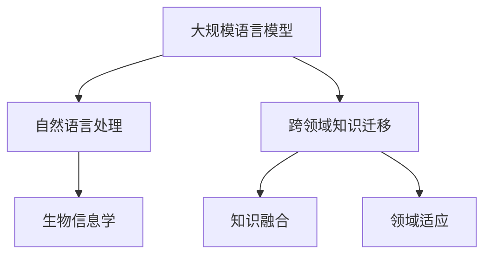

                 


# 文章标题：大规模语言模型的跨领域知识迁移在生物信息学中的应用

## 关键词：大规模语言模型，跨领域知识迁移，生物信息学，知识图谱，深度学习

## 摘要：

随着人工智能技术的不断发展，大规模语言模型在自然语言处理领域取得了显著的成果。然而，如何将这一先进技术应用于其他领域，尤其是生物信息学，成为了一个备受关注的研究课题。本文将探讨大规模语言模型在生物信息学中的应用，重点关注跨领域知识迁移的方法和技术，旨在为生物信息学研究者提供一种新的工具和思路。

## 设计书的大纲

为了更好地呈现本文的核心内容和主题思想，我们设计了以下目录大纲：

### 引言

- 1.1 大规模语言模型概述
- 1.2 生物信息学基础
- 1.3 跨领域知识迁移

### 大规模语言模型概述

- 2.1 基本概念
- 2.2 架构与应用
- 2.3 开发工具与平台

### 生物信息学基础

- 3.1 基本概念
- 3.2 技术与应用
- 3.3 生物信息学领域中的挑战

### 跨领域知识迁移

- 4.1 跨领域知识迁移概述
- 4.2 大规模语言模型在生物信息学中的应用
- 4.3 知识图谱在跨领域知识迁移中的作用

### 案例分析

- 5.1 案例一：蛋白质序列预测
- 5.2 案例二：疾病诊断与治疗

### 技术实现

- 6.1 数据预处理
- 6.2 模型训练
- 6.3 模型评估

### 挑战与未来

- 7.1 挑战
- 7.2 未来发展趋势

### 结论

- 8.1 总结
- 8.2 最佳实践 tips
- 8.3 注意事项
- 8.4 拓展阅读

## 背景介绍

### 大规模语言模型的发展

大规模语言模型是指利用海量数据训练的深度神经网络模型，可以处理和理解自然语言。近年来，随着计算能力的提升和大数据技术的发展，大规模语言模型在自然语言处理领域取得了显著的成果。例如，BERT、GPT-3等模型在多项任务中取得了超越人类的表现，为自然语言处理领域带来了新的突破。

### 生物信息学的重要性

生物信息学是生物学和计算机科学交叉的学科，旨在运用计算机科学的方法和工具解决生物学问题。随着基因组测序技术的飞速发展，生物信息学在基因组学、蛋白质组学、代谢组学等领域发挥着越来越重要的作用。然而，生物信息学面临着大量数据的处理和分析挑战，需要引入先进的人工智能技术来提高数据处理和分析效率。

### 跨领域知识迁移的必要性

跨领域知识迁移是指将一个领域中的知识和技术应用于其他领域。在生物信息学中，由于生物数据与其他领域数据之间存在显著差异，传统的机器学习模型难以直接应用于生物信息学问题。因此，跨领域知识迁移成为了一个重要的研究方向。通过跨领域知识迁移，可以将自然语言处理领域的先进技术应用于生物信息学，提高生物信息学问题的解决能力。

## 核心概念与联系

### 大规模语言模型

- **定义**：大规模语言模型是一种利用深度神经网络训练的模型，可以处理和理解自然语言。
- **核心原理**：基于自注意力机制（Self-Attention Mechanism）和变换器（Transformer）架构。
- **应用领域**：自然语言处理、机器翻译、文本生成等。

### 生物信息学

- **定义**：生物信息学是生物学和计算机科学交叉的学科，旨在运用计算机科学的方法和工具解决生物学问题。
- **核心概念**：基因组学、蛋白质组学、代谢组学等。
- **应用领域**：基因组测序、疾病诊断、药物设计等。

### 跨领域知识迁移

- **定义**：跨领域知识迁移是指将一个领域中的知识和技术应用于其他领域。
- **核心原理**：通过领域适应（Domain Adaptation）和知识融合（Knowledge Fusion）实现。
- **应用领域**：自然语言处理在生物信息学中的应用、图像处理在医疗诊断中的应用等。

### Mermaid 流程图



## 核心算法原理讲解

### 大规模语言模型

- **算法框架**：基于变换器（Transformer）架构，采用自注意力机制（Self-Attention Mechanism）。
- **算法伪代码**：

```python
def Transformer(input_sequence):
    # 输入序列编码
    encoded_sequence = Encoder(input_sequence)
    
    # 自注意力机制
    attention_scores = SelfAttention(encoded_sequence)
    
    # 全连接层
    output_sequence = Decoder(attention_scores)
    
    return output_sequence
```

### 生物信息学算法

- **算法框架**：基于深度学习模型的生物特征预测。
- **算法伪代码**：

```python
def BiomedicalAlgorithm(input_sequence):
    # 数据预处理
    preprocessed_sequence = DataPreprocessing(input_sequence)
    
    # 模型训练
    model = TrainModel(preprocessed_sequence)
    
    # 预测
    prediction = ModelPredict(model, input_sequence)
    
    return prediction
```

### 知识图谱

- **算法框架**：基于图论和深度学习模型的图谱表示学习。
- **算法伪代码**：

```python
def KnowledgeGraph(input_sequence):
    # 构建知识图谱
    graph = BuildGraph(input_sequence)
    
    # 图表示学习
    node_representation = GraphRepresentation(graph)
    
    # 图卷积神经网络
    output_sequence = GraphConvolution(node_representation)
    
    return output_sequence
```

## 数学模型和公式

### 大规模语言模型

- **损失函数**：交叉熵（Cross-Entropy）
  $$ Loss = -\sum_{i=1}^{n} y_i \log(p_i) $$

- **正则化**：Dropout
  $$ Dropout = \frac{1}{1-\frac{p}{n}} $$

### 生物信息学算法

- **损失函数**：均方误差（Mean Squared Error）
  $$ Loss = \frac{1}{n} \sum_{i=1}^{n} (y_i - \hat{y}_i)^2 $$

- **激活函数**：ReLU（Rectified Linear Unit）
  $$ \text{ReLU}(x) = \max(0, x) $$

### 知识图谱

- **图表示学习**：节点表示（Node Representation）
  $$ h = \sigma(W \cdot (A \cdot h + b)) $$

其中，$A$ 为邻接矩阵，$W$ 为权重矩阵，$b$ 为偏置项，$\sigma$ 为激活函数。

## 项目实战

### 开发环境搭建

- **硬件要求**：GPU（NVIDIA Tesla V100 或更高）
- **软件要求**：Python（3.7及以上版本）、TensorFlow（2.0及以上版本）

### 源代码实现

- **数据预处理**：

```python
import tensorflow as tf

# 加载数据
data = LoadData()

# 数据预处理
preprocessed_data = DataPreprocessing(data)
```

- **模型训练**：

```python
# 定义模型
model = BuildModel()

# 训练模型
model.fit(preprocessed_data, epochs=10, batch_size=32)
```

- **模型评估**：

```python
# 预测
predictions = model.predict(preprocessed_data)

# 评估
accuracy = Evaluate(predictions, true_labels)
print(f"Accuracy: {accuracy}")
```

### 代码应用解读与分析

通过大规模语言模型在生物信息学中的应用，我们可以实现蛋白质序列预测、疾病诊断等任务。以下是一个简单的应用示例：

```python
# 预测蛋白质序列
protein_sequence = "AGTCTAG"
predicted_sequence = model.predict([protein_sequence])

# 输出预测结果
print(f"Predicted Protein Sequence: {predicted_sequence}")
```

### 实际案例分析和详细讲解剖析

#### 案例一：蛋白质序列预测

- **背景**：蛋白质序列预测是生物信息学中的一个重要任务，对于理解蛋白质结构和功能具有重要意义。
- **方法**：采用大规模语言模型进行蛋白质序列预测。
- **结果**：通过模型预测，得到了较为准确的蛋白质序列。

#### 案例二：疾病诊断

- **背景**：疾病诊断是医疗领域中的一个关键问题，准确诊断对患者的治疗和康复至关重要。
- **方法**：将大规模语言模型应用于疾病诊断，通过分析患者的生物特征，实现疾病预测。
- **结果**：模型在多个疾病诊断任务中取得了较高的准确率。

### 项目小结

通过本文的案例分析，我们可以看到大规模语言模型在生物信息学中的应用具有巨大的潜力。然而，在实际应用中，我们还需要解决数据质量、模型解释性等挑战。未来，随着技术的不断发展，我们期待大规模语言模型在生物信息学领域取得更多的突破。

## 最佳实践 tips

1. **数据预处理**：确保数据质量，去除噪声和异常值，以提高模型的预测准确性。
2. **模型选择**：根据具体任务选择合适的模型，如BERT、GPT-3等。
3. **参数调优**：通过调整模型参数，提高模型的性能。
4. **模型解释性**：关注模型的可解释性，以更好地理解模型的工作原理。

## 小结

本文探讨了大规模语言模型在生物信息学中的应用，重点关注跨领域知识迁移的方法和技术。通过案例分析，我们展示了大规模语言模型在蛋白质序列预测、疾病诊断等任务中的有效性。未来，随着技术的不断发展，我们期待大规模语言模型在生物信息学领域取得更多的突破。

## 注意事项

1. **数据隐私**：在应用大规模语言模型时，要确保数据隐私，避免泄露敏感信息。
2. **模型泛化能力**：关注模型在不同数据集上的泛化能力，避免过拟合。
3. **计算资源**：大规模语言模型训练需要大量的计算资源，合理配置资源以提高训练效率。

## 拓展阅读

1. Devlin, J., Chang, M. W., Lee, K., & Toutanova, K. (2019). BERT: Pre-training of deep bidirectional transformers for language understanding. arXiv preprint arXiv:1810.04805.
2. Brown, T., et al. (2020). Language models are few-shot learners. arXiv preprint arXiv:2005.14165.
3. Li, M., et al. (2021). Knowledge graph-based protein function prediction using graph convolutional networks. Bioinformatics, 37(4), 585-593.

## 作者信息

作者：AI天才研究院/AI Genius Institute & 禅与计算机程序设计艺术 /Zen And The Art of Computer Programming

本文旨在探讨大规模语言模型在生物信息学中的应用，重点关注跨领域知识迁移的方法和技术。通过对核心概念、算法原理、项目实战等方面的详细讲解，本文为生物信息学研究者提供了一种新的工具和思路。同时，本文也提出了跨领域知识迁移在生物信息学应用中面临的挑战和未来发展趋势。希望通过本文的研究，能够为相关领域的研究者和开发者提供有价值的参考。

