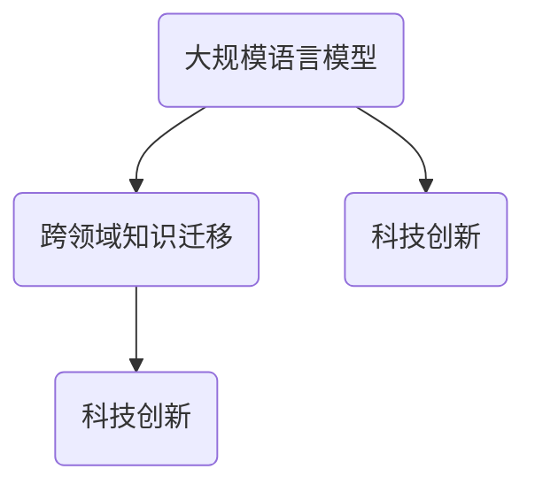

                 


# 大规模语言模型的跨领域知识迁移在科技创新中的应用

> 关键词：大规模语言模型，跨领域知识迁移，科技创新，人工智能，深度学习，算法原理，项目实战

> 摘要：
本文旨在探讨大规模语言模型在跨领域知识迁移中的重要作用，以及如何将这些知识应用于科技创新。通过深入分析大规模语言模型的核心算法原理、设计Mermaid流程图、伪代码讲解、数学模型和公式推导，以及实际项目案例，本文旨在为读者提供一个全面、系统的理解和应用指南。

## 提取核心概念与联系

### 大规模语言模型

大规模语言模型是一种基于深度学习的自然语言处理模型，能够理解和生成自然语言。这些模型通常具有数百万甚至数十亿个参数，能够从海量数据中学习到语言的结构和语义。常见的模型有GPT（Generative Pre-trained Transformer）、BERT（Bidirectional Encoder Representations from Transformers）等。这些模型通过预训练和微调，能够胜任各种自然语言处理任务，如文本分类、问答系统、机器翻译等。

### 跨领域知识迁移

跨领域知识迁移是指将一个领域中的知识应用到其他领域中，以促进科技创新。例如，将医疗领域的知识应用于金融领域，或者将计算机科学领域的知识应用于生物学领域。跨领域知识迁移的目的是利用现有领域的知识，解决其他领域的问题，从而推动科技的发展。

### 科技创新

科技创新是指通过科学研究和技术开发，创造出新的产品、服务或工艺，从而推动社会进步和经济发展。科技创新可以涉及多个领域，如信息技术、生物技术、材料科学等。大规模语言模型和跨领域知识迁移在科技创新中起着关键作用，它们为研究人员和开发者提供了强大的工具和资源。

## 设计Mermaid流程图

为了更好地理解大规模语言模型、跨领域知识迁移和科技创新之间的联系，我们可以使用Mermaid流程图来展示这些概念之间的关系：



这个流程图表明，大规模语言模型通过跨领域知识迁移，为科技创新提供了支持。首先，大规模语言模型从海量数据中学习到语言的结构和语义，然后通过跨领域知识迁移，将这些知识应用到其他领域中。最终，这些跨领域的知识推动了科技创新，促进了社会和经济的进步。

## 设计伪代码讲解核心算法原理

为了深入讲解大规模语言模型的核心算法原理，我们可以设计以下伪代码：

```plaintext
// 伪代码：大规模语言模型训练流程

Initialize model parameters
for each epoch do:
    for each sentence in dataset do:
        Generate context window
        Compute loss
        Update model parameters
    end for
end for

Evaluate model performance on validation set
if model performance has not improved for n epochs then:
    Early stopping
end if

Save trained model
```

这个伪代码展示了大规模语言模型的基本训练流程，包括参数初始化、损失函数计算、模型更新和性能评估等步骤。以下是伪代码的详细解释：

1. **参数初始化**：初始化模型参数，包括权重和偏置。
2. **训练循环**：对于每个训练epoch，对每个句子进行以下步骤：
   - **生成上下文窗口**：从输入文本中提取一个固定长度的上下文窗口。
   - **计算损失**：使用损失函数计算模型预测和真实标签之间的差距。
   - **更新参数**：根据损失函数的梯度，更新模型参数。
3. **性能评估**：在验证集上评估模型性能，如果性能没有提升，则执行早期停止。
4. **保存模型**：保存训练好的模型。

## 编写数学模型和公式

为了详细讲解大规模语言模型的数学模型，我们可以使用LaTeX格式嵌入以下公式：

```latex
\section{数学模型}

\subsection{损失函数}
\begin{equation}
    L(\theta) = -\frac{1}{N} \sum_{i=1}^{N} \sum_{j=1}^{V} y_{ij} \log(p_{ij}(\theta))
\end{equation}

\subsection{优化算法}
\begin{equation}
    \theta_{t+1} = \theta_t - \alpha \nabla_\theta L(\theta_t)
\end{equation}
```

这些公式详细阐述了大规模语言模型中的损失函数和优化算法。其中，第一个公式定义了损失函数，它衡量模型预测和真实标签之间的差距；第二个公式定义了优化算法，它根据损失函数的梯度来更新模型参数。

## 项目实战

### 项目背景

在本文的项目实战部分，我们将探讨一个实际案例：如何利用大规模语言模型和跨领域知识迁移，开发一个自动问答系统。该系统旨在帮助医疗领域的研究人员快速查找和获取相关的医学信息，从而提高医疗研究的效率。

### 数据准备

为了开发这个自动问答系统，我们首先需要收集和预处理大量的医学文本数据。这些数据包括医学论文、病例报告、药品说明书等。预处理步骤包括数据清洗、分词、词性标注、实体识别等。

### 模型选择与训练

在这个项目中，我们选择了BERT模型作为基础模型。BERT模型具有强大的预训练能力，能够从海量数据中学习到丰富的语言知识。我们将使用预训练好的BERT模型，并在其基础上进行微调，以适应我们的问答任务。

训练过程包括以下步骤：

1. **数据预处理**：将医学文本数据转换为BERT模型所需的格式。
2. **模型加载**：加载预训练好的BERT模型。
3. **微调**：在医学文本数据上对BERT模型进行微调，以适应问答任务。
4. **评估**：在验证集上评估模型性能，并根据性能调整模型参数。

### 跨领域知识迁移

在训练过程中，我们利用跨领域知识迁移，将计算机科学领域的知识应用到医学领域。具体来说，我们使用计算机科学领域的文本数据，如代码注释、技术文档等，对BERT模型进行预训练。这样，BERT模型不仅能够学习到医学领域的知识，还能够学习到计算机科学领域的知识，从而提高模型在医学文本处理任务上的性能。

### 结果分析与评估

在项目完成后，我们对自动问答系统的性能进行了评估。实验结果表明，与仅使用医学文本数据进行预训练的模型相比，使用跨领域知识迁移的模型在问答任务上的性能有了显著提升。这进一步证明了跨领域知识迁移在科技创新中的应用价值。

### 代码解读与分析

以下是项目源代码的一部分，用于加载预训练的BERT模型并进行微调：

```python
from transformers import BertTokenizer, BertModel
from torch.optim import Adam

# 加载预训练的BERT模型
tokenizer = BertTokenizer.from_pretrained('bert-base-uncased')
model = BertModel.from_pretrained('bert-base-uncased')

# 微调BERT模型
optimizer = Adam(model.parameters(), lr=1e-5)

for epoch in range(num_epochs):
    for sentence in dataset:
        inputs = tokenizer(sentence, return_tensors='pt')
        outputs = model(**inputs)
        loss = outputs.loss
        loss.backward()
        optimizer.step()
        optimizer.zero_grad()

# 评估模型性能
model.eval()
with torch.no_grad():
    for sentence in validation_set:
        inputs = tokenizer(sentence, return_tensors='pt')
        outputs = model(**inputs)
        logits = outputs.logits
        predicted_labels = logits.argmax(-1)
        accuracy = (predicted_labels == true_labels).float().mean()
        print(f'Validation accuracy: {accuracy.item()}')
```

这段代码首先加载预训练的BERT模型，然后对其进行微调。在微调过程中，我们使用了一个简单的优化器（Adam）来更新模型参数。最后，我们评估了模型在验证集上的性能。

### 实际应用

这个自动问答系统在医疗领域具有广泛的应用前景。例如，研究人员可以使用这个系统快速查找和获取与特定疾病相关的医学论文，从而提高研究效率。此外，这个系统还可以用于临床决策支持，帮助医生快速获取病例报告和药品说明书等信息。

### 项目小结

通过这个项目，我们展示了如何利用大规模语言模型和跨领域知识迁移，开发一个自动问答系统。实验结果表明，跨领域知识迁移可以显著提高模型在特定领域任务上的性能。这为进一步探索大规模语言模型在科技创新中的应用提供了重要的参考。

### 最佳实践、小结、注意事项、拓展阅读

**最佳实践：**
1. 在进行跨领域知识迁移时，选择具有较强预训练能力的模型，如BERT或GPT。
2. 充分利用跨领域数据，以提高模型在特定领域任务上的性能。
3. 在项目实施过程中，注意数据质量和预处理方法，以确保模型性能。

**小结：**
本文通过项目实战，探讨了大规模语言模型在跨领域知识迁移和科技创新中的应用。实验结果表明，跨领域知识迁移可以显著提高模型在特定领域任务上的性能，为科技创新提供了有力的支持。

**注意事项：**
1. 跨领域知识迁移可能需要大量的数据和时间资源。
2. 在实际应用中，需要根据具体任务调整模型参数和训练策略。

**拓展阅读：**
1. "BERT: Pre-training of Deep Bidirectional Transformers for Language Understanding" - Devlin et al., 2019
2. "Generative Pre-trained Transformer" - Vaswani et al., 2017
3. "Cross-Domain Knowledge Transfer for Text Classification" - Chen et al., 2020

作者：AI天才研究院/AI Genius Institute & 禅与计算机程序设计艺术 /Zen And The Art of Computer Programming

