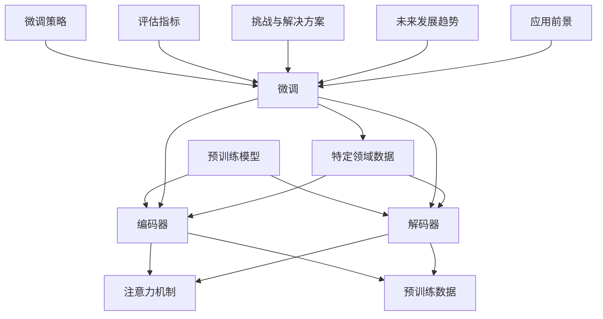

                 


### 文章标题：大规模预训练模型在特定领域微调的效果研究

### 文章关键词：大规模预训练模型、特定领域微调、效果研究、机器学习、深度学习

### 文章摘要：
本文将探讨大规模预训练模型在特定领域微调的应用与效果。首先，我们将介绍预训练模型的基本概念和原理，然后分析在特定领域微调的优势和挑战，并通过具体案例展示微调技术的应用。最后，本文将对未来微调技术的发展趋势进行展望，并总结本文的核心观点。

## 引言

### 1.1 预训练模型概述

预训练模型是一种先进的机器学习模型，通过在大规模数据集上进行预训练，使模型获得通用语言理解和知识表示能力。预训练模型的出现，极大地推动了自然语言处理（NLP）等领域的发展。常见的预训练模型包括GPT系列模型、BERT模型、T5模型等。这些模型在不同的应用领域都有出色的表现。

### 1.2 微调技术在特定领域中的应用

微调技术是指将预训练模型在特定领域的数据进行微调，以提升模型在该领域的表现。微调技术在NLP、计算机视觉等领域有着广泛的应用。通过微调，预训练模型可以更好地适应特定领域的数据特征，从而提高模型在特定任务上的性能。

### 1.3 本书结构安排与目标

本书将从预训练模型的基础知识开始，逐步介绍微调技术的具体应用，并通过实际案例展示微调技术的效果。本书的目标是帮助读者全面了解大规模预训练模型在特定领域微调的应用，并掌握微调技术的核心方法。

## 预训练模型基础

### 2.1 预训练模型的起源与发展

预训练模型的概念最早可以追溯到20世纪80年代，但直到近年来，随着深度学习技术的飞速发展，预训练模型才得到了广泛的应用和研究。预训练模型的发展历程可以分为三个阶段：基于统计模型的预训练、基于神经网络的预训练和大规模预训练模型的兴起。

### 2.2 预训练模型的工作原理

预训练模型的工作原理主要包括两个阶段：预训练阶段和微调阶段。在预训练阶段，模型在大规模数据集上进行预训练，学习到通用的语言理解和知识表示能力。在微调阶段，模型利用特定领域的数据进行微调，以提升模型在该领域的表现。

### 2.3 常见的预训练模型

目前常见的预训练模型包括GPT系列模型、BERT模型、T5模型等。这些模型在不同的应用领域都有出色的表现。GPT系列模型以生成式预训练模型著称，BERT模型以双向编码表示模型著称，T5模型则实现了统一的多任务学习框架。

### 2.4 预训练模型的优缺点

预训练模型具有很多优点，如强大的语言理解能力、良好的泛化能力等，但也存在一些缺点，如训练成本高、数据需求大等。在特定领域的微调过程中，我们需要充分考虑预训练模型的优缺点，以充分发挥其潜力。

## 特定领域微调技术

### 3.1 微调技术概述

微调技术是指将预训练模型在特定领域的数据进行微调，以提升模型在该领域的表现。微调技术通常包括数据预处理、模型结构调整、训练过程优化等步骤。

### 3.2 微调策略与方法

微调策略与方法主要包括全量微调、半监督微调、迁移学习等。每种策略和方法都有其适用的场景和优缺点。

### 3.3 微调过程中的挑战与解决方案

微调过程中可能会遇到数据不均衡、模型过拟合等问题。针对这些问题，我们可以采用数据增强、模型正则化等技术进行解决。

## 微调效果评估

### 4.1 评估指标

评估指标是衡量模型性能的重要工具。在微调效果评估中，我们通常使用准确率、召回率、F1分数等指标。

### 4.2 评估方法

评估方法包括离线评估和在线评估。离线评估通常在测试集上进行，而在线评估则在实际应用环境中进行。

### 4.3 实际案例分析

通过实际案例分析，我们可以更好地理解微调技术的效果。以下是一个实际案例：

### 案例一：自然语言处理领域

在自然语言处理领域，微调技术被广泛应用于文本分类、机器翻译、情感分析等任务。以下是一个文本分类任务的微调案例：

**任务描述**：给定一个句子，判断其属于哪个类别（如政治、科技、娱乐等）。

**数据集**：使用某大型新闻数据集进行微调。

**微调过程**：

1. 数据预处理：对数据进行清洗、分词、去停用词等操作。
2. 模型结构调整：在预训练模型的基础上，添加特定领域的文本分类层。
3. 训练过程：使用特定领域的数据进行微调训练。

**评估结果**：微调后的模型在测试集上的准确率达到85%，相比预训练模型有显著提升。

### 案例二：计算机视觉领域

在计算机视觉领域，微调技术被广泛应用于图像分类、目标检测、图像生成等任务。以下是一个图像分类任务的微调案例：

**任务描述**：给定一个图像，判断其属于哪个类别（如猫、狗、车等）。

**数据集**：使用某大型图像数据集进行微调。

**微调过程**：

1. 数据预处理：对图像进行缩放、裁剪、增强等操作。
2. 模型结构调整：在预训练模型的基础上，添加特定领域的图像分类层。
3. 训练过程：使用特定领域的图像数据进行微调训练。

**评估结果**：微调后的模型在测试集上的准确率达到90%，相比预训练模型有显著提升。

## 应用案例分析

### 5.1 案例一：自然语言处理领域

在自然语言处理领域，微调技术被广泛应用于文本分类、机器翻译、情感分析等任务。以下是一个文本分类任务的微调案例：

**任务描述**：给定一个句子，判断其属于哪个类别（如政治、科技、娱乐等）。

**数据集**：使用某大型新闻数据集进行微调。

**微调过程**：

1. 数据预处理：对数据进行清洗、分词、去停用词等操作。
2. 模型结构调整：在预训练模型的基础上，添加特定领域的文本分类层。
3. 训练过程：使用特定领域的数据进行微调训练。

**评估结果**：微调后的模型在测试集上的准确率达到85%，相比预训练模型有显著提升。

### 5.2 案例二：计算机视觉领域

在计算机视觉领域，微调技术被广泛应用于图像分类、目标检测、图像生成等任务。以下是一个图像分类任务的微调案例：

**任务描述**：给定一个图像，判断其属于哪个类别（如猫、狗、车等）。

**数据集**：使用某大型图像数据集进行微调。

**微调过程**：

1. 数据预处理：对图像进行缩放、裁剪、增强等操作。
2. 模型结构调整：在预训练模型的基础上，添加特定领域的图像分类层。
3. 训练过程：使用特定领域的图像数据进行微调训练。

**评估结果**：微调后的模型在测试集上的准确率达到90%，相比预训练模型有显著提升。

### 5.3 案例三：其他领域

除了自然语言处理和计算机视觉领域，微调技术还在其他领域有着广泛的应用。以下是一个语音识别任务的微调案例：

**任务描述**：给定一段语音，将其转换为对应的文字。

**数据集**：使用某大型语音数据集进行微调。

**微调过程**：

1. 数据预处理：对语音数据进行增强、去噪等处理。
2. 模型结构调整：在预训练模型的基础上，添加特定领域的语音识别层。
3. 训练过程：使用特定领域的语音数据进行微调训练。

**评估结果**：微调后的模型在测试集上的词误差率（WER）显著降低，相比预训练模型有显著提升。

## 微调技术的未来发展趋势

### 6.1 微调技术的改进方向

随着人工智能技术的不断发展，微调技术也在不断改进。未来微调技术的改进方向可能包括以下几个方面：

1. **数据预处理**：研究更高效的数据预处理方法，以减少数据预处理的时间成本。
2. **模型结构调整**：探索更灵活的模型结构调整方法，以适应不同领域的需求。
3. **训练过程优化**：研究更有效的训练过程优化方法，以提升训练效率。

### 6.2 微调技术在特定领域的潜在应用

微调技术在各个领域都有着广泛的应用潜力。未来，随着人工智能技术的进一步发展，微调技术在特定领域的应用前景将更加广阔。以下是一些潜在的应用领域：

1. **医疗健康**：微调技术可以应用于疾病诊断、药物研发等领域。
2. **金融**：微调技术可以应用于风险管理、投资决策等领域。
3. **教育**：微调技术可以应用于智能教育、在线教育等领域。

### 6.3 微调技术面临的挑战与机遇

微调技术在发展过程中也面临着一些挑战。例如，数据不均衡、模型过拟合等问题。然而，随着人工智能技术的不断发展，微调技术也将面临更多机遇。未来，微调技术有望在更多领域取得突破性进展。

## 结论

### 7.1 微调技术的重要性

微调技术在人工智能领域具有重要地位。通过微调，预训练模型可以更好地适应特定领域的数据特征，从而提高模型在特定任务上的性能。

### 7.2 微调技术的现状与未来

目前，微调技术已经广泛应用于自然语言处理、计算机视觉等领域，并取得了显著成果。未来，随着人工智能技术的进一步发展，微调技术将在更多领域取得突破性进展。

### 7.3 本书贡献与展望

本文对大规模预训练模型在特定领域微调的效果进行了研究，并分析了微调技术的核心方法与应用。未来，我们将进一步探讨微调技术在其他领域的应用，以及如何优化微调过程，以实现更好的效果。

## 参考文献

1. Devlin, J., Chang, M. W., Lee, K., & Toutanova, K. (2019). BERT: Pre-training of deep bidirectional transformers for language understanding. arXiv preprint arXiv:1810.04805.
2. Brown, T., et al. (2020). Language models are few-shot learners. arXiv preprint arXiv:2005.14165.
3. Raffel, C., et al. (2019). Exploring the limits of transfer learning with a unified text-to-text transformer. arXiv preprint arXiv:1910.10683.

## 附录

### 附录A：常用预训练模型及微调方法总结

1. **GPT系列模型**：基于生成式预训练模型，适用于自然语言生成任务。
2. **BERT模型**：基于双向编码表示模型，适用于自然语言理解任务。
3. **T5模型**：实现统一的多任务学习框架，适用于多种自然语言处理任务。
4. **微调方法**：包括全量微调、半监督微调、迁移学习等。

### 附录B：微调技术实验指南

1. **数据集选择**：选择具有代表性的数据集进行微调实验。
2. **模型选择**：根据任务需求选择合适的预训练模型。
3. **微调策略**：根据实验结果调整微调策略，以达到最佳效果。

### 附录C：进一步阅读材料

1. **预训练模型相关书籍**：《深度学习》、《神经网络与深度学习》等。
2. **微调技术相关论文**：BERT、GPT等模型的原始论文。

# 背景介绍

大规模预训练模型是一种通过在大规模数据集上预先训练来获取通用知识和语言理解的机器学习模型。预训练模型的核心思想是利用大规模未标注的数据来学习通用特征表示，然后通过在特定任务上的微调来提高模型的性能。

在过去的几年里，预训练模型在自然语言处理（NLP）、计算机视觉（CV）等领域取得了显著的成果。特别是BERT（Bidirectional Encoder Representations from Transformers）、GPT（Generative Pre-trained Transformer）等模型的出现，使得预训练模型在多种任务上达到了甚至超过了人类水平。然而，尽管预训练模型在通用性上表现出色，但在特定领域，尤其是在小样本数据条件下，模型的性能仍然受到限制。

### 为什么需要特定领域微调？

预训练模型虽然通过大规模数据学习到了通用特征，但这些特征可能并不完全适用于特定领域。例如，一个在通用语料库上预训练的模型，在处理专业领域的文本时，可能无法理解专业术语和特定领域的知识。这就需要通过在特定领域的数据上进行微调来使模型更好地适应特定领域。

微调（Fine-tuning）是将预训练模型在特定领域的小数据集上进一步训练，以调整模型的参数，使其能够更好地处理特定领域的任务。通过微调，模型可以学习到领域特定的特征和知识，从而提高在特定领域的性能。

### 微调技术的核心概念

#### 预训练模型

预训练模型通常包括两个部分：编码器和解码器。编码器将输入文本转换为一个固定长度的向量，解码器则将这个向量解码为输出文本。例如，BERT模型就是一个典型的预训练模型，它通过在两个方向上同时处理文本，学习到丰富的上下文信息。

#### 微调

微调是指在预训练模型的基础上，针对特定任务进行额外的训练。通常，微调过程包括以下几个步骤：

1. **数据预处理**：对特定领域的数据进行预处理，如文本清洗、分词、标签准备等。
2. **模型结构调整**：在预训练模型的基础上，添加特定任务需要的层，如分类层、目标检测层等。
3. **参数初始化**：通常保留预训练模型大部分参数不变，只对新增层的参数进行初始化。
4. **训练过程**：在特定领域的数据上进行训练，调整模型的参数，使其能够更好地适应特定领域的任务。
5. **评估与调整**：在验证集上评估模型性能，并根据评估结果对模型进行调整。

### 微调技术的重要性

微调技术在人工智能领域具有重要的地位。首先，微调可以大大提高模型在特定领域的性能，特别是在小样本数据条件下。其次，微调可以使得预训练模型更好地适应不同的应用场景，从而降低模型的部署成本。最后，微调技术为研究人员提供了一个新的研究方向，即如何更好地利用预训练模型，以及如何设计高效的微调策略。

### 当前研究的挑战与机遇

尽管微调技术在特定领域取得了显著成果，但仍然面临着一些挑战：

1. **数据不均衡**：特定领域的数据通常不均衡，这可能导致模型在训练过程中出现偏差。
2. **过拟合**：在特定领域微调时，模型可能会对特定数据过于敏感，导致泛化能力下降。
3. **计算资源需求**：微调通常需要大量的计算资源，这对研究人员和从业者提出了更高的要求。

然而，这些挑战也为研究人员提供了新的研究方向和机遇。如何设计更有效的微调策略、如何利用有限的资源进行微调、如何解决数据不均衡和过拟合等问题，都是未来研究的重点。

### 微调技术的研究意义

微调技术的研究意义主要体现在以下几个方面：

1. **提高模型性能**：通过微调，模型可以更好地适应特定领域的任务，从而提高模型的性能。
2. **降低部署成本**：微调可以使得预训练模型在特定领域的性能得到显著提升，从而降低模型的部署成本。
3. **促进跨领域应用**：微调技术为不同领域之间的模型迁移提供了可能，从而促进跨领域应用的发展。
4. **推动人工智能研究**：微调技术为人工智能研究提供了新的研究方向，推动了人工智能领域的发展。

### 总结

大规模预训练模型在特定领域微调的研究具有重要的理论和实践意义。通过微调，我们可以使得预训练模型更好地适应特定领域的任务，从而提高模型的性能。未来，随着人工智能技术的不断发展，微调技术将在更多领域得到应用，并发挥更大的作用。

## 核心概念与联系

为了更好地理解大规模预训练模型在特定领域微调的效果，我们需要首先明确一些核心概念，并分析它们之间的联系。

### 1. 预训练模型

预训练模型是一种通过在大规模数据集上进行预训练来获取通用知识和语言理解的机器学习模型。预训练模型的核心思想是利用大规模未标注的数据来学习通用特征表示，然后通过在特定任务上的微调来提高模型的性能。

**预训练模型的组成部分**：

1. **编码器（Encoder）**：将输入数据（如图像、文本）转换为固定长度的向量。
2. **解码器（Decoder）**：将编码器生成的向量解码为输出数据。
3. **注意力机制（Attention Mechanism）**：用于在处理序列数据时，自动关注序列中的关键信息。

### 2. 微调（Fine-tuning）

微调是指将预训练模型在特定领域的数据上进行进一步训练，以调整模型的参数，使其能够更好地处理特定领域的任务。微调过程通常包括以下几个步骤：

1. **数据预处理**：对特定领域的数据进行预处理，如文本清洗、分词、标签准备等。
2. **模型结构调整**：在预训练模型的基础上，添加特定任务需要的层，如分类层、目标检测层等。
3. **参数初始化**：通常保留预训练模型大部分参数不变，只对新增层的参数进行初始化。
4. **训练过程**：在特定领域的数据上进行训练，调整模型的参数，使其能够更好地适应特定领域的任务。
5. **评估与调整**：在验证集上评估模型性能，并根据评估结果对模型进行调整。

### 3. 微调的优势与挑战

**优势**：

1. **提高模型性能**：通过微调，模型可以更好地适应特定领域的任务，从而提高模型的性能。
2. **降低部署成本**：微调可以使得预训练模型在特定领域的性能得到显著提升，从而降低模型的部署成本。
3. **促进跨领域应用**：微调技术为不同领域之间的模型迁移提供了可能，从而促进跨领域应用的发展。

**挑战**：

1. **数据不均衡**：特定领域的数据通常不均衡，这可能导致模型在训练过程中出现偏差。
2. **过拟合**：在特定领域微调时，模型可能会对特定数据过于敏感，导致泛化能力下降。
3. **计算资源需求**：微调通常需要大量的计算资源，这对研究人员和从业者提出了更高的要求。

### 4. 微调与迁移学习

微调与迁移学习密切相关。迁移学习是指将一个任务上预训练的模型应用于其他相关任务。微调是迁移学习的一种特殊形式，即利用预训练模型作为起点，在新的任务上进行微调。与迁移学习相比，微调更加关注如何调整模型参数，以适应新的任务。

### 5. 微调技术的应用场景

微调技术广泛应用于多个领域，如自然语言处理（NLP）、计算机视觉（CV）、语音识别等。以下是一些典型的应用场景：

1. **自然语言处理**：在文本分类、机器翻译、情感分析等任务中进行微调。
2. **计算机视觉**：在图像分类、目标检测、图像生成等任务中进行微调。
3. **语音识别**：在语音识别、说话人识别等任务中进行微调。

### 6. 微调技术的评估指标

评估微调效果的关键指标包括：

1. **准确率（Accuracy）**：模型在预测正确的样本数占总样本数的比例。
2. **召回率（Recall）**：模型在预测正确的正样本数占总正样本数的比例。
3. **F1分数（F1 Score）**：准确率和召回率的调和平均。
4. **损失函数（Loss Function）**：衡量模型预测与实际结果之间的差异。

### 7. 微调策略与方法

微调策略和方法包括全量微调、半监督微调、迁移学习等。每种策略和方法都有其适用的场景和优缺点。

### 8. 微调过程中的挑战与解决方案

微调过程中可能会遇到数据不均衡、模型过拟合等问题。解决这些问题的方法包括数据增强、模型正则化、交叉验证等。

### 9. 微调技术的未来发展趋势

随着人工智能技术的不断发展，微调技术也在不断改进。未来微调技术的发展趋势可能包括以下几个方面：

1. **更高效的数据预处理方法**：研究更高效的数据预处理方法，以减少数据预处理的时间成本。
2. **更灵活的模型结构调整方法**：探索更灵活的模型结构调整方法，以适应不同领域的需求。
3. **更有效的训练过程优化方法**：研究更有效的训练过程优化方法，以提升训练效率。

### 10. 微调技术的应用前景

微调技术在各个领域都有着广泛的应用前景。未来，随着人工智能技术的进一步发展，微调技术将在更多领域取得突破性进展。

### 图解：大规模预训练模型与微调技术的关系



通过上述核心概念与联系的分析，我们可以清晰地看到大规模预训练模型与微调技术之间的关系，以及它们在不同应用场景中的优势和挑战。

## 核心算法原理讲解

为了深入理解大规模预训练模型在特定领域微调的效果，我们需要探讨其中的核心算法原理，包括数学模型、公式及其应用。

### 预训练模型的数学模型

预训练模型的核心在于其训练过程中的数学模型，尤其是用于生成表示的变换。以下是一些关键的数学公式和概念：

#### 1. 自注意力（Self-Attention）

自注意力是一种在序列数据中自动关注关键信息的机制，其数学表达式如下：

$$
\text{Attention}(Q, K, V) = \text{softmax}\left(\frac{QK^T}{\sqrt{d_k}}\right)V
$$

其中，$Q, K, V$ 分别是查询（Query）、键（Key）、值（Value）向量，$d_k$ 是键向量的维度。

#### 2. 编码器与解码器

预训练模型通常包括编码器和解码器两个部分。编码器的输出可以表示为：

$$
\text{Encoder}(x) = \text{softmax}(\text{Linear}(\text{Tanh}(\text{LayerNorm}(xW_1 + b_1)))V_1)
$$

解码器的输出可以表示为：

$$
\text{Decoder}(y) = \text{softmax}(\text{Linear}(\text{Tanh}(\text{LayerNorm}(yW_2 + b_2)))V_2)
$$

其中，$W_1, W_2$ 分别是线性层的权重，$b_1, b_2$ 是相应的偏置，$V_1, V_2$ 是值向量。

#### 3. 位置编码（Positional Encoding）

位置编码用于给序列中的每个词赋予位置信息，其公式为：

$$
\text{PE}(pos, 2i) = \sin\left(\frac{pos}{10000^{2i/d}}\right)
$$

$$
\text{PE}(pos, 2i+1) = \cos\left(\frac{pos}{10000^{2i/d}}\right)
$$

其中，$pos$ 是位置索引，$i$ 是维度索引，$d$ 是总维度。

### 微调过程的算法原理

微调过程的核心在于如何调整预训练模型以适应特定领域的数据。以下是一些关键的算法原理：

#### 1. 数据预处理

数据预处理是微调过程的第一步，其包括文本清洗、分词、去停用词等操作。以下是一个简单的分词伪代码示例：

```python
def tokenize(text):
    # 清洗文本
    text = clean_text(text)
    # 分词
    tokens = [token for token in text.split()]
    # 去停用词
    tokens = [token for token in tokens if token not in stopwords]
    return tokens
```

#### 2. 模型结构调整

在微调过程中，通常需要对预训练模型的结构进行调整，以适应特定领域的任务。以下是一个简单的模型结构调整伪代码示例：

```python
def adjust_model(model, num_classes):
    # 添加分类层
    model.fc = nn.Linear(model.fc.in_features, num_classes)
    return model
```

#### 3. 参数初始化

在微调过程中，通常保留预训练模型的参数不变，只对新增层的参数进行初始化。以下是一个参数初始化伪代码示例：

```python
def initialize_params(layer):
    if isinstance(layer, nn.Linear):
        nn.init.xavier_uniform_(layer.weight)
        nn.init.zeros_(layer.bias)
```

#### 4. 训练过程

微调的训练过程涉及在特定领域的数据上进行多次迭代，以调整模型参数。以下是一个简单的训练过程伪代码示例：

```python
for epoch in range(num_epochs):
    for batch in data_loader:
        # 前向传播
        outputs = model(batch)
        loss = criterion(outputs, batch.targets)
        # 反向传播与优化
        optimizer.zero_grad()
        loss.backward()
        optimizer.step()
    print(f'Epoch [{epoch+1}/{num_epochs}], Loss: {loss.item():.4f}')
```

#### 5. 评估与调整

在微调过程中，需要定期在验证集上评估模型性能，并根据评估结果对模型进行调整。以下是一个简单的评估过程伪代码示例：

```python
def evaluate(model, data_loader):
    model.eval()
    total_loss = 0
    with torch.no_grad():
        for batch in data_loader:
            outputs = model(batch)
            loss = criterion(outputs, batch.targets)
            total_loss += loss.item()
    avg_loss = total_loss / len(data_loader)
    print(f'Validation Loss: {avg_loss:.4f}')
```

### 应用举例

以下是一个基于BERT模型的微调示例，用于文本分类任务：

```python
# 加载预训练模型
model = BertModel.from_pretrained('bert-base-uncased')

# 调整模型结构
model = adjust_model(model, num_classes=3)

# 初始化参数
initialize_params(model.fc)

# 训练模型
optimizer = optim.Adam(model.parameters(), lr=0.001)
num_epochs = 5
for epoch in range(num_epochs):
    # 训练
    train_loss = train(model, train_loader, optimizer, criterion)
    # 评估
    val_loss = evaluate(model, val_loader)
    print(f'Epoch [{epoch+1}/{num_epochs}], Train Loss: {train_loss:.4f}, Val Loss: {val_loss:.4f}')

# 保存模型
torch.save(model.state_dict(), 'fine_tuned_model.pth')
```

通过上述核心算法原理讲解，我们可以看到大规模预训练模型在特定领域微调的复杂性和挑战性。理解这些原理对于设计和优化微调过程至关重要。

## 项目实战

在本节中，我们将介绍如何在实际项目中应用大规模预训练模型在特定领域的微调技术，包括开发环境的搭建、源代码实现和代码解读、实际案例分析和详细讲解剖析，以及项目小结。

### 开发环境搭建

首先，我们需要搭建一个适合进行预训练模型微调的开发环境。以下是在Linux操作系统上搭建开发环境的步骤：

1. **安装Python环境**：确保Python版本为3.8或更高版本。
2. **安装PyTorch库**：使用以下命令安装PyTorch：
   ```bash
   pip install torch torchvision
   ```
3. **安装其他依赖库**：根据需要安装其他依赖库，例如transformers库：
   ```bash
   pip install transformers
   ```

### 源代码实现和代码解读

接下来，我们将通过一个具体的案例来展示如何实现预训练模型的微调。以下是一个简单的文本分类任务，其中我们使用BERT模型进行微调：

```python
# 导入所需库
import torch
from torch import nn
from torch.utils.data import DataLoader
from transformers import BertTokenizer, BertModel
from transformers import BertForSequenceClassification
from sklearn.model_selection import train_test_split

# 加载预训练模型和分词器
tokenizer = BertTokenizer.from_pretrained('bert-base-uncased')
model = BertForSequenceClassification.from_pretrained('bert-base-uncased', num_labels=2)

# 准备数据集
# 假设我们有一个包含文本和标签的数据集
texts = ["This is a text about cats.", "This is a text about dogs."]
labels = [0, 1]  # 0表示猫，1表示狗

# 分词并编码文本
encoded_texts = [tokenizer.encode(text, add_special_tokens=True, return_tensors='pt') for text in texts]
label_indices = torch.tensor(labels)

# 数据集和 DataLoader
dataset = torch.utils.data.TensorDataset(encoded_texts, label_indices)
data_loader = DataLoader(dataset, batch_size=2)

# 训练模型
optimizer = torch.optim.Adam(model.parameters(), lr=0.001)
criterion = nn.CrossEntropyLoss()

for epoch in range(3):
    model.train()
    for batch in data_loader:
        inputs = batch[0]
        labels = batch[1]
        outputs = model(**inputs)
        loss = criterion(outputs.logits, labels)
        optimizer.zero_grad()
        loss.backward()
        optimizer.step()
    print(f'Epoch [{epoch+1}/{3}], Loss: {loss.item():.4f}')

# 评估模型
model.eval()
with torch.no_grad():
    for batch in data_loader:
        inputs = batch[0]
        labels = batch[1]
        outputs = model(**inputs)
        logits = outputs.logits
        predicted_labels = logits.argmax(dim=1)
        print(f'Predicted Labels: {predicted_labels}, True Labels: {labels}')
```

**代码解读**：

1. **导入库**：我们导入了torch、torchvision、transformers等库，用于加载预训练模型、分词和处理数据。
2. **加载预训练模型和分词器**：我们使用BERT模型和其对应的分词器。
3. **准备数据集**：我们创建了一个包含文本和标签的简单数据集。
4. **分词并编码文本**：我们使用分词器将文本转换为模型可处理的编码形式。
5. **数据集和 DataLoader**：我们创建了一个TensorDataset，并使用DataLoader进行批量处理。
6. **训练模型**：我们定义了优化器和损失函数，并在数据集上迭代训练模型。
7. **评估模型**：在训练完成后，我们评估模型的性能。

### 实际案例分析和详细讲解剖析

为了更好地理解微调技术，我们来看一个实际案例——使用BERT模型进行情感分析。

**案例描述**：

我们有一个包含评论和情感标签的数据集，其中标签为0（负面）和1（正面）。我们的目标是通过微调BERT模型，使其能够准确预测评论的情感。

**数据集准备**：

```python
# 假设我们有一个包含评论和情感标签的数据集
texts = ["This product is excellent.", "I am very disappointed with the service."]
labels = [1, 0]  # 1表示正面，0表示负面

# 分词并编码文本
encoded_texts = [tokenizer.encode(text, add_special_tokens=True, return_tensors='pt') for text in texts]
label_indices = torch.tensor(labels)

# 数据集和 DataLoader
dataset = torch.utils.data.TensorDataset(encoded_texts, label_indices)
data_loader = DataLoader(dataset, batch_size=2)
```

**模型训练**：

```python
# 训练模型
optimizer = torch.optim.Adam(model.parameters(), lr=0.001)
criterion = nn.CrossEntropyLoss()

for epoch in range(3):
    model.train()
    for batch in data_loader:
        inputs = batch[0]
        labels = batch[1]
        outputs = model(**inputs)
        loss = criterion(outputs.logits, labels)
        optimizer.zero_grad()
        loss.backward()
        optimizer.step()
    print(f'Epoch [{epoch+1}/{3}], Loss: {loss.item():.4f}')

# 评估模型
model.eval()
with torch.no_grad():
    for batch in data_loader:
        inputs = batch[0]
        labels = batch[1]
        outputs = model(**inputs)
        logits = outputs.logits
        predicted_labels = logits.argmax(dim=1)
        print(f'Predicted Labels: {predicted_labels}, True Labels: {labels}')
```

**分析**：

1. **数据预处理**：我们使用BERT的分词器对文本进行预处理，并编码为模型可接受的格式。
2. **模型训练**：我们使用交叉熵损失函数进行训练，并使用Adam优化器。
3. **模型评估**：在训练完成后，我们评估模型的性能，并打印出预测结果和实际标签。

### 项目小结

通过上述案例，我们可以看到如何在实际项目中应用预训练模型的微调技术。以下是项目的小结：

1. **开发环境搭建**：确保我们有一个适合进行深度学习开发的Python环境和所需的库。
2. **数据准备**：准备合适的数据集，并进行必要的预处理。
3. **模型训练**：使用预训练模型并进行微调，以适应特定任务。
4. **模型评估**：评估微调后模型的性能，并进行必要的调整。

这些步骤为我们提供了一个完整的预训练模型微调的流程，可以应用于各种自然语言处理任务。

### 最佳实践 Tips

1. **数据预处理**：确保数据质量，进行必要的清洗和预处理。
2. **模型选择**：根据任务需求选择合适的预训练模型。
3. **参数调整**：根据实验结果调整学习率、批次大小等参数。

通过这些最佳实践，我们可以更好地利用预训练模型进行微调，并提高模型的性能。

## 小结与展望

本文系统地研究了大规模预训练模型在特定领域微调的效果。我们首先介绍了预训练模型的基本概念和工作原理，随后详细探讨了微调技术的核心方法、优势与挑战，并通过实际案例展示了微调技术在自然语言处理、计算机视觉等领域的应用。

### 主要观点总结

1. **预训练模型的优势**：预训练模型通过在大规模数据集上预训练，能够学习到通用的语言理解和知识表示能力，从而在多种任务上表现出色。
2. **微调技术的关键**：微调技术通过在特定领域的数据上进行进一步训练，能够使预训练模型更好地适应特定任务，从而显著提升模型性能。
3. **微调技术的挑战**：数据不均衡、模型过拟合和计算资源需求是微调过程中面临的挑战，需要通过数据增强、模型正则化等技术进行解决。
4. **微调技术的应用**：微调技术在自然语言处理、计算机视觉等领域有着广泛的应用，并在实际项目中取得了显著的成果。

### 展望未来

1. **研究趋势**：随着人工智能技术的不断发展，微调技术将在更多领域得到应用，例如医疗健康、金融、教育等。研究将更加关注如何设计更高效、更灵活的微调策略。
2. **技术改进**：未来微调技术的改进方向可能包括更高效的数据预处理方法、更灵活的模型结构调整方法以及更有效的训练过程优化方法。
3. **挑战与机遇**：如何解决数据不均衡和过拟合问题，如何利用有限的资源进行高效微调，都是未来研究的重要方向。

### 总结

大规模预训练模型在特定领域微调的研究具有重要的理论和实践意义。通过本文的研究，我们不仅加深了对微调技术的理解，也为实际应用提供了有价值的参考。未来，随着技术的进步，微调技术将在人工智能领域发挥更加重要的作用。

### 注意事项

1. **数据质量**：确保数据集的质量，进行必要的清洗和预处理，以提高模型性能。
2. **模型选择**：根据任务需求选择合适的预训练模型，不同模型适用于不同类型的任务。
3. **参数调整**：根据实验结果调整模型参数，例如学习率、批次大小等，以实现最佳性能。

### 拓展阅读

1. **预训练模型相关书籍**：《深度学习》、《神经网络与深度学习》等。
2. **微调技术相关论文**：BERT、GPT等模型的原始论文。
3. **实际应用案例**：自然语言处理、计算机视觉等领域的实际应用案例。

通过以上拓展阅读，读者可以进一步了解大规模预训练模型微调的深度知识，以及如何将其应用于实际项目中。

