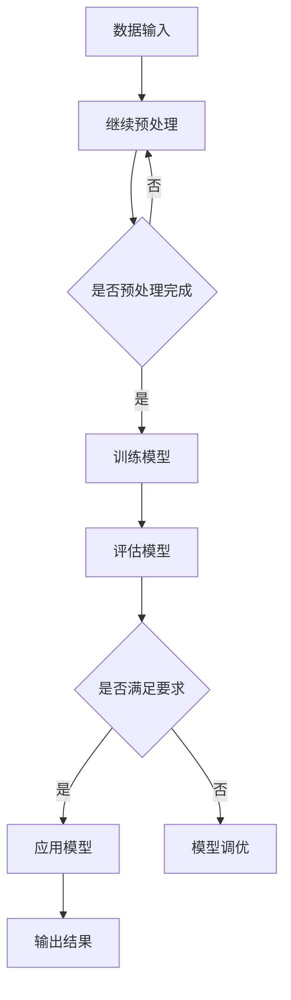
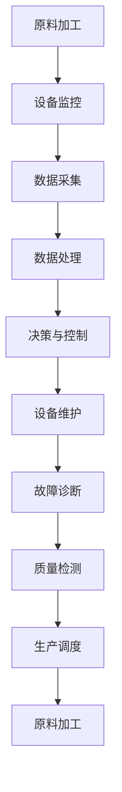
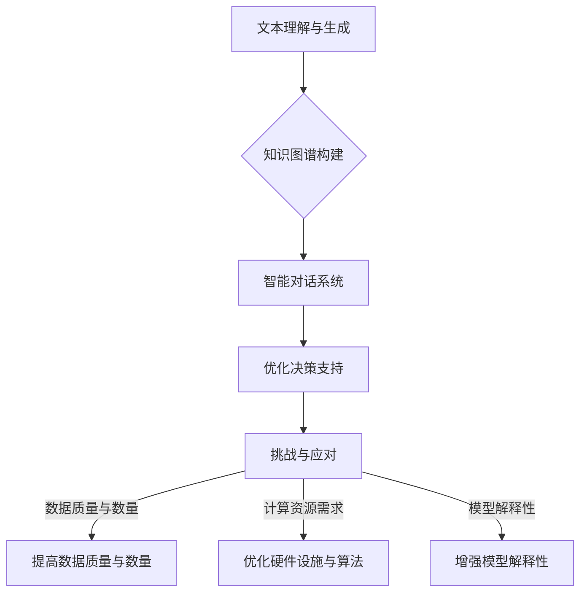

                 

# 大语言模型在智能制造优化中的推理应用

## 关键词
- 大语言模型
- 智能制造
- 推理应用
- 优化策略
- 实际案例

## 摘要
本文旨在探讨大语言模型在智能制造优化中的应用及其推理过程。通过详细介绍大语言模型的基本原理、训练方法、技术细节以及性能评估方法，本文揭示了其在智能制造优化中的潜在应用。进一步地，本文分析了大语言模型在智能制造优化中的推理应用，并通过实际案例展示了其效果和实现方法。文章最后对大语言模型在智能制造优化中的应用前景进行了展望。

## 简介与目标

### 《大语言模型在智能制造优化中的推理应用》

随着人工智能技术的快速发展，大语言模型在各个领域展现出了巨大的应用潜力。智能制造作为现代工业的重要发展方向，对人工智能技术的需求日益增长。本文旨在研究大语言模型在智能制造优化中的应用，通过推理分析，探讨其技术原理、应用策略及实际效果。

### 目标

本文的主要目标是：

1. **介绍大语言模型的基本原理和训练方法**：包括核心算法、技术细节和性能评估方法。
2. **分析大语言模型在智能制造优化中的推理应用**：探讨其在优化问题中的应用场景和推理过程。
3. **通过实际案例，展示大语言模型在智能制造优化中的效果和实现方法**：包括项目背景、实现流程、代码解读和效果评估。
4. **展望大语言模型在智能制造优化中的应用前景**：分析技术发展趋势、面临的挑战及潜在的机会。

### 目录

1. 引言与背景
   1.1 大语言模型概述
   1.2 智能制造背景
   1.3 大语言模型在智能制造中的应用前景

2. 大语言模型基础
   2.1 大语言模型原理
   2.2 大规模语言模型的训练
   2.3 大语言模型的技术细节
   2.4 大语言模型性能评估

3. 智能制造优化中的推理应用
   3.1 智能制造优化需求分析
   3.2 大语言模型在优化中的应用
   3.3 实际案例解析
   3.4 推理在智能制造优化中的应用

4. 大语言模型优化策略与算法
   4.1 参数调整与超参数优化
   4.2 模型压缩与加速
   4.3 模型解释性与可解释性

5. 大语言模型在实际智能制造项目中的应用
   5.1 项目背景与目标
   5.2 项目实现过程
   5.3 项目效果评估

6. 大语言模型应用的未来展望
   6.1 技术发展趋势
   6.2 挑战与机遇
   6.3 未来应用场景

7. 附录
   7.1 大语言模型开发工具与资源
   7.2 代码示例

### 大语言模型概述

#### 核心概念与联系

大语言模型（Large Language Model，LLM）是一种基于深度学习技术的自然语言处理模型，能够对自然语言进行理解和生成。它通过对海量文本数据的学习，掌握了丰富的语言规律和知识，能够进行复杂的文本推理和生成。

- **大语言模型的基本概念**：大语言模型是一种能够处理和理解人类语言的模型，通过对大量文本数据的学习，能够生成高质量的自然语言文本。
- **大语言模型与智能制造的关系**：智能制造依赖于大量的数据处理和分析，而大语言模型在文本理解和生成方面的优势，为智能制造提供了强大的智能支持。例如，它可以用于生产过程中的质量检测、设备维护、故障诊断等。

#### Mermaid流程图

通过上述流程图，可以看到大语言模型在智能制造中的应用流程，包括数据输入、预处理、模型训练、评估、应用和输出结果等环节。

### 智能制造背景

#### 核心概念与联系

智能制造（Intelligent Manufacturing）是指通过信息物理系统（Cyber-Physical Systems，CPS）和物联网（Internet of Things，IoT）技术，实现制造过程的高度智能化。它强调将传感器、执行器、计算机技术和网络通信技术集成到生产系统中，实现自动化、灵活化和智能化的制造。

- **智能制造的定义**：智能制造是指通过信息物理系统（Cyber-Physical Systems，CPS）和物联网（Internet of Things，IoT）技术，实现制造过程的高度智能化。
- **智能制造的发展历程**：智能制造起源于20世纪80年代的自动化技术，经历了计算机集成制造系统（CIMS）、敏捷制造、精益生产等阶段，逐渐发展成为一个综合性的制造模式。
- **智能制造中的关键技术**：智能制造依赖于传感器、执行器、计算机技术和网络通信技术等关键技术的支持。传感器和执行器用于实时监测和操控生产设备，计算机技术用于数据处理和分析，网络通信技术用于系统间的信息交换。

#### Mermaid流程图

通过上述流程图，可以看到智能制造的基本架构和流程，包括原料加工、设备监控、数据采集、数据处理、决策与控制、设备维护、故障诊断、质量检测和生产调度等环节。

### 大语言模型在智能制造中的应用前景

#### 核心概念与联系

大语言模型在智能制造中的应用前景广阔，主要体现在以下几个方面：

- **文本理解与生成**：大语言模型能够对自然语言文本进行理解和生成，可以为智能制造提供智能化的文本处理能力。例如，用于生产日志的自动生成、设备维护说明的生成、故障报告的生成等。
- **知识图谱构建**：大语言模型通过对海量文本数据的学习，能够构建出丰富的知识图谱，为智能制造提供知识支持。例如，用于设备故障诊断的知识图谱、生产流程的知识图谱等。
- **智能对话系统**：大语言模型可以用于构建智能对话系统，为智能制造提供智能化的交互界面。例如，用于生产现场的智能客服、设备维护的智能助手等。
- **优化决策支持**：大语言模型可以对生产过程中的各种数据进行分析，提供优化决策支持。例如，用于生产计划的优化、设备维护的优化、质量检测的优化等。

#### 大语言模型的优势与挑战

- **优势**：
  - **强大的文本理解与生成能力**：大语言模型通过对海量文本数据的学习，能够生成高质量的自然语言文本，为智能制造提供智能化的文本处理能力。
  - **丰富的知识图谱构建能力**：大语言模型能够构建出丰富的知识图谱，为智能制造提供知识支持。
  - **智能对话系统的实现**：大语言模型可以用于构建智能对话系统，为智能制造提供智能化的交互界面。
  - **优化决策支持**：大语言模型可以对生产过程中的各种数据进行分析，提供优化决策支持。

- **挑战**：
  - **数据质量和数量**：大语言模型的训练依赖于大量高质量的数据，智能制造领域的数据质量和数量可能难以满足要求。
  - **计算资源需求**：大语言模型的训练和推理需要大量的计算资源，对硬件设施有较高要求。
  - **模型解释性**：大语言模型通常具有高解释性，如何确保模型的可解释性，使其能够被制造领域专家理解和接受，是一个挑战。

#### Mermaid流程图

通过上述流程图，可以看到大语言模型在智能制造中的应用场景及其面临的挑战和应对策略。

