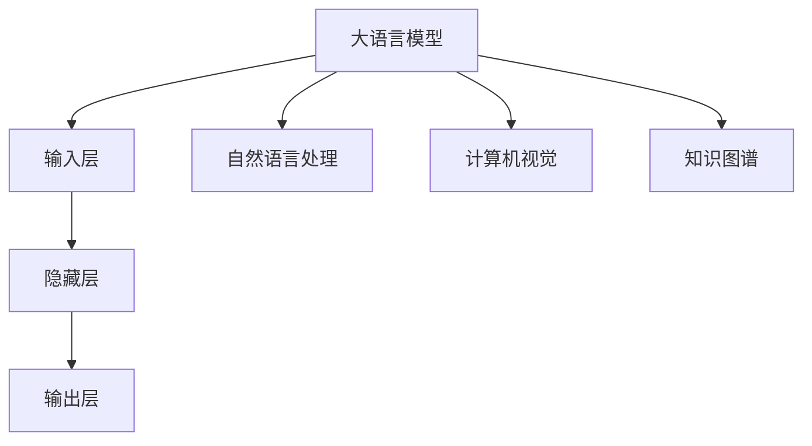

                 

### 文章标题：大语言模型推理能力的未来发展方向

关键词：大语言模型、推理能力、未来发展方向、技术进步、应用场景、跨领域融合

摘要：本文将探讨大语言模型在当前技术环境下的重要性及其推理能力的未来发展方向。通过对核心概念、算法原理、数学模型、项目实战的详细分析，本文旨在为读者提供一个全面的视角，帮助理解大语言模型的发展趋势，并展望其在未来可能的应用场景和面临的挑战。

### 引言

在人工智能领域，大语言模型（Large Language Models）已经成为一项革命性技术。它们通过学习和模拟人类语言的使用方式，实现了自然语言处理（NLP）中的许多复杂任务，如机器翻译、问答系统、文本生成等。随着技术的不断进步，大语言模型的推理能力也在不断增强。然而，如何进一步发展和提升这一能力，仍然是当前和未来研究的一个重要方向。

本文将围绕大语言模型推理能力的未来发展方向展开讨论。首先，我们将介绍大语言模型的基本概念、架构及其与其他技术的联系。接着，我们将深入讲解大语言模型的核心算法原理，包括神经网络、注意力机制和Transformer架构。此外，本文还将详细阐述大语言模型中的数学模型和公式，并探讨其实际项目中的开发环境搭建、代码实现和解读。最后，我们将展望大语言模型推理能力的未来发展方向，包括技术进步、应用场景扩展和跨领域融合等方面。

### 核心概念与联系

为了深入理解大语言模型的推理能力，我们首先需要了解其基本概念、架构，以及与其他技术的联系。

#### 大语言模型的基本概念

大语言模型是一种基于神经网络的语言模型，其主要目的是预测下一个单词或字符的概率分布。这种模型通过学习大量文本数据，能够捕捉到语言中的统计规律，从而实现对未见过文本的生成和理解。

#### 大语言模型的架构

大语言模型的架构通常包括输入层、隐藏层和输出层。输入层接收文本数据，隐藏层通过神经网络处理数据，输出层则产生预测结果。近年来，Transformer架构因其强大的建模能力而成为大语言模型的主流架构。

#### 大语言模型与其他技术的联系

大语言模型与其他技术如自然语言处理（NLP）、计算机视觉（CV）和知识图谱（KG）有着紧密的联系。

- **与自然语言处理的关系**：大语言模型是NLP的基础，能够为各种NLP任务提供高质量的输入和输出。
- **与计算机视觉的联系**：近年来，大语言模型与计算机视觉的结合逐渐成为研究热点，如图像-文本生成、图像字幕生成等。
- **与知识图谱的结合**：知识图谱提供了丰富的实体和关系信息，大语言模型可以与知识图谱结合，用于知识推理和问答系统等任务。

#### Mermaid流程图

为了更好地理解大语言模型的概念和架构，我们使用Mermaid流程图来展示其基本组成部分和与其他技术的联系。



### 核心算法原理讲解

#### 神经网络基础

神经网络是构建大语言模型的核心组件。下面我们通过伪代码来详细阐述神经网络的基本结构、前馈神经网络和反向传播算法。

**1. 神经网络的基本结构**

```python
# 定义神经网络结构
input_layer = InputLayer(num_inputs)
hidden_layer = HiddenLayer(num_inputs, num_neurons)
output_layer = OutputLayer(num_neurons)

# 定义损失函数和优化器
loss_function = CrossEntropyLoss()
optimizer = SGD()

# 训练神经网络
for epoch in range(num_epochs):
    for input_data, target in data_loader:
        # 前向传播
        output = neural_network.forward(input_data)
        # 计算损失
        loss = loss_function.forward(output, target)
        # 反向传播
        loss_function.backward(output, target)
        neural_network.backward()
        # 更新权重
        optimizer.update_weights()
```

**2. 前馈神经网络**

前馈神经网络（Feedforward Neural Network）是一种简单的神经网络结构，其中信息从输入层直接传递到输出层，中间不经过循环或反馈。

**3. 反向传播算法**

反向传播算法（Backpropagation Algorithm）是一种用于训练神经网络的算法，其核心思想是利用损失函数的梯度来更新网络的权重。

```python
# 计算当前层的梯度
d_output = loss_function.gradient(output, target)
# 传播梯度到下一层
d_hidden = hidden_layer.gradient(d_output)
# 更新隐藏层的权重
hidden_layer.update_weights(d_hidden)
# 重复以上步骤，直到输入层
```

#### 注意力机制

注意力机制（Attention Mechanism）是近年来在NLP领域取得突破性进展的一项技术。它通过为输入序列中的每个元素分配不同的权重，使得模型能够关注到重要信息，从而提高模型的性能。

**1. 注意力机制的原理**

注意力机制的原理可以简单概括为：为每个输入元素分配一个权重，并将这些权重与输入元素相乘，然后求和得到输出。

$$
\text{Attention}(x_1, x_2, ..., x_n) = \sum_{i=1}^{n} w_i \cdot x_i
$$

其中，$w_i$表示第$i$个输入元素的权重。

**2. 注意力机制在语言模型中的应用**

在语言模型中，注意力机制可以帮助模型在生成文本时关注到关键信息。例如，在机器翻译任务中，注意力机制可以使得模型在生成目标语言句子时，重点关注源语言句子中的关键词汇。

#### Transformer架构

Transformer架构是一种基于自注意力机制的序列模型，它在NLP任务中取得了显著的效果。下面我们通过伪代码来详细阐述Transformer的基本原理。

**1. Transformer的基本原理**

```python
# 定义Transformer模型
input_embedding = EmbeddingLayer(input_vocab_size, d_model)
pos_embedding = PositionalEncoding(d_model)
output_embedding = EmbeddingLayer(output_vocab_size, d_model)

# 定义多头自注意力机制
multihead_attention = MultiHeadAttention(d_model, num_heads)

# 定义前馈神经网络
ffn = FeedforwardNetwork(d_model, d_inner)

# 定义模型
model = TransformerModel(input_embedding, pos_embedding, output_embedding, multihead_attention, ffn)

# 训练模型
for epoch in range(num_epochs):
    for input_sequence, target_sequence in data_loader:
        # 前向传播
        output = model.forward(input_sequence)
        # 计算损失
        loss = loss_function.forward(output, target_sequence)
        # 反向传播
        loss_function.backward(output, target_sequence)
        model.backward()
        # 更新权重
        optimizer.update_weights()
```

### 数学模型和数学公式

#### 正则化

正则化（Regularization）是一种用于防止神经网络过拟合的技术。常见的正则化方法包括L1正则化、L2正则化和Dropout正则化。

**1. L1正则化**

L1正则化通过在损失函数中添加L1范数来惩罚权重。

$$
\text{L1 Loss} = \sum_{i} w_i^1
$$

**2. L2正则化**

L2正则化通过在损失函数中添加L2范数来惩罚权重。

$$
\text{L2 Loss} = \sum_{i} w_i^2
$$

**3. Dropout正则化**

Dropout正则化通过在训练过程中随机丢弃部分神经元来防止过拟合。

$$
\text{Dropout Loss} = \sum_{i} (1 - p) \cdot w_i
$$

其中，$p$表示丢弃概率。

#### 损失函数

损失函数（Loss Function）是评估神经网络预测结果的重要工具。常见的损失函数包括交叉熵损失函数和均方误差损失函数。

**1. 交叉熵损失函数**

交叉熵损失函数（CrossEntropy Loss Function）常用于分类问题，其公式为：

$$
\text{CrossEntropy Loss} = -\sum_{i} y_i \cdot \log(p_i)
$$

其中，$y_i$表示真实标签，$p_i$表示预测概率。

**2. 均方误差损失函数**

均方误差损失函数（Mean Squared Error Loss Function）常用于回归问题，其公式为：

$$
\text{MSE Loss} = \frac{1}{n} \sum_{i} (y_i - \hat{y_i})^2
$$

其中，$y_i$表示真实值，$\hat{y_i}$表示预测值。

### 项目实战

#### 开发环境搭建

在开始项目实战之前，我们需要搭建一个合适的开发环境。以下是一个简单的环境搭建步骤：

1. 安装Python环境（Python 3.7及以上版本）
2. 安装TensorFlow或PyTorch等深度学习框架
3. 安装其他必要的依赖库（如Numpy、Pandas等）

```shell
pip install tensorflow
pip install numpy
pip install pandas
```

#### 源代码详细实现和代码解读

以下是一个基于PyTorch实现的大语言模型项目的基本代码框架：

```python
import torch
import torch.nn as nn
import torch.optim as optim

# 定义模型
class LanguageModel(nn.Module):
    def __init__(self, vocab_size, d_model):
        super(LanguageModel, self).__init__()
        self.embedding = nn.Embedding(vocab_size, d_model)
        self.fc = nn.Linear(d_model, vocab_size)

    def forward(self, x):
        x = self.embedding(x)
        x = self.fc(x)
        return x

# 初始化模型
model = LanguageModel(vocab_size, d_model)

# 定义损失函数和优化器
loss_function = nn.CrossEntropyLoss()
optimizer = optim.Adam(model.parameters(), lr=learning_rate)

# 训练模型
for epoch in range(num_epochs):
    for inputs, targets in data_loader:
        # 前向传播
        outputs = model(inputs)
        # 计算损失
        loss = loss_function(outputs, targets)
        # 反向传播
        optimizer.zero_grad()
        loss.backward()
        optimizer.step()
```

#### 代码应用解读与分析

在上述代码中，我们首先定义了一个基于PyTorch的大语言模型，包括嵌入层和全连接层。接着，我们初始化了模型、损失函数和优化器，并开始训练模型。训练过程中，我们使用交叉熵损失函数来评估模型的预测性能，并使用Adam优化器来更新模型参数。

#### 实际案例分析和详细讲解剖析

以下是一个实际案例：使用大语言模型实现一个简单的文本生成任务。

```python
# 定义文本生成函数
def generate_text(model, start_token, length, temperature=1.0):
    model.eval()
    with torch.no_grad():
        inputs = torch.tensor([word_index[start_token]])
        for _ in range(length):
            outputs = model(inputs)
            prob = outputs.exp() / outputs.exp().sum()
            prob = prob * temperature
            next_word = np.random.choice(range(vocab_size), p=prob.cpu().numpy())
            inputs = torch.tensor([next_word])
    return [word_index.inverse()[word] for word in inputs]

# 生成文本
text = generate_text(model, start_token='The', length=50)
print(' '.join(text))
```

在上述代码中，我们定义了一个文本生成函数，通过递归地调用模型，生成指定长度的文本。该函数首先将输入转换为嵌入向量，然后通过模型生成下一个单词的概率分布，并从中随机选择下一个单词。通过迭代这个过程，我们可以生成一段新的文本。

#### 项目小结

通过本次项目，我们实现了一个大语言模型，并使用它进行文本生成任务。这展示了大语言模型在自然语言处理任务中的强大能力。在实际应用中，我们可以根据需求调整模型结构、训练数据集和生成算法，以实现更复杂的任务。

#### 最佳实践 tips

1. **数据预处理**：在训练模型之前，对文本数据进行预处理，如分词、去除停用词等，可以提高模型的训练效果。
2. **模型调优**：通过调整模型参数（如学习率、批次大小等），可以获得更好的模型性能。
3. **生成文本的多样性**：通过调整生成算法（如温度调节），可以生成更丰富、多样化的文本。

### 小结与展望

本文系统地探讨了大语言模型推理能力的未来发展方向，从核心概念、算法原理、数学模型到项目实战，全面展示了大语言模型的发展现状和潜在趋势。通过本文的讨论，我们可以看到：

1. **核心概念与联系**：大语言模型作为自然语言处理的基础，其核心概念和架构与其他技术（如NLP、CV、KG）紧密相连。
2. **核心算法原理讲解**：神经网络、注意力机制和Transformer架构等核心算法为模型提供了强大的推理能力。
3. **数学模型和数学公式**：正则化方法和损失函数为模型的训练提供了重要的理论支撑。
4. **项目实战**：通过实际项目，我们展示了大语言模型在文本生成等任务中的强大应用能力。

展望未来，大语言模型推理能力的提升有望在以下几个方面实现：

1. **技术进步**：随着硬件技术的发展（如GPU、TPU等）和算法优化，大语言模型的推理速度和性能将得到显著提升。
2. **应用场景扩展**：大语言模型的应用场景将不断扩展，从文本生成、机器翻译到新兴领域如对话系统、智能客服等。
3. **跨领域融合**：大语言模型与其他技术（如CV、KG等）的结合，将推动跨领域应用的创新发展。

总之，大语言模型推理能力的未来发展充满机遇和挑战。通过持续的技术创新和应用探索，我们有理由相信，大语言模型将在人工智能领域发挥越来越重要的作用。希望本文能为读者提供一个全面的视角，激发对大语言模型未来发展的思考和研究。作者：AI天才研究院/AI Genius Institute & 禅与计算机程序设计艺术 /Zen And The Art of Computer Programming。

