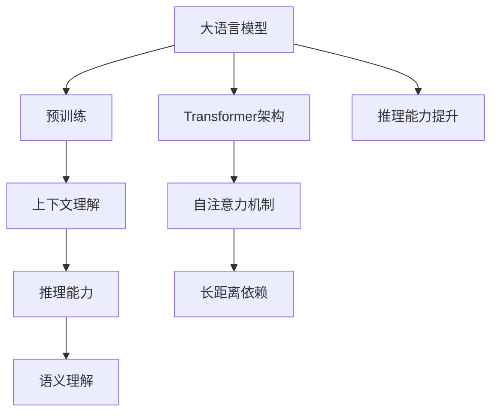

                 

### 文章标题

《大语言模型的推理能力：未来发展方向》

### 文章关键词

大语言模型、推理能力、预训练、Transformer、上下文理解、知识融合、数学模型、项目实战

### 文章摘要

本文深入探讨了大语言模型的推理能力及其未来发展方向。通过回顾大语言模型的发展历程，我们理解了其在自然语言处理中的重要性和现状。文章详细解析了推理能力的核心概念及其与语言模型的关系，并通过Mermaid流程图展示了概念之间的架构。接着，文章详细讲解了上下文理解和知识融合的核心算法原理，使用伪代码和数学模型来阐明其工作机理。随后，通过一个实际项目案例，展示了如何搭建开发环境、实现代码以及进行分析和解读。最后，文章提出了大语言模型推理能力的未来发展方向，并提供了最佳实践建议和注意事项。文章旨在为读者提供一个全面、深入的指南，以了解和掌握大语言模型的推理能力。

## 引言与背景

大语言模型是自然语言处理（NLP）领域的一项革命性技术。从最初的简单语言模型到如今的大型预训练模型，这一领域经历了快速的发展与变革。大语言模型的发展历程可以追溯到21世纪初期，当时深度学习和神经网络技术开始逐渐应用于NLP任务，标志着自然语言处理新时代的到来。随着计算能力的提升和数据量的激增，预训练语言模型（如GPT、BERT等）应运而生，并在多个NLP任务中取得了显著成效。

大语言模型的重要性在于其能够对海量文本数据进行深度理解和建模，从而在问答系统、机器翻译、文本摘要、情感分析等多个领域展现出强大的能力。特别是在推理能力方面，大语言模型通过上下文的理解和知识融合，能够在给定的情境下做出合理的推理和判断。这种能力在许多实际应用中具有极高的价值，例如智能客服、法律文档分析、医疗诊断等。

在自然语言处理的应用中，大语言模型的推理能力扮演着关键角色。传统的规则基方法在处理复杂和模糊的自然语言任务时存在局限性，而大语言模型通过学习大量的语言数据，能够捕捉到语言中的复杂结构和语义信息。这种能力使得大语言模型在自然语言理解和生成任务中表现优异，从而推动了NLP领域的技术进步。

总的来说，大语言模型的发展不仅提升了自然语言处理的效果，也为人工智能技术的发展提供了新的机遇。在未来的发展中，大语言模型的推理能力有望进一步提升，为人类带来更多的智能应用。

### 核心概念与联系

在深入探讨大语言模型的推理能力之前，我们需要明确一些核心概念，并理解它们之间的相互关系。首先，我们来定义推理能力。推理能力是指模型在理解输入信息的基础上，通过逻辑推理得出结论或预测的能力。推理可以有多种类型，包括归纳推理、演绎推理和类比推理。在大语言模型中，主要关注的是基于上下文的理解和推理，这种推理能力体现在模型对给定文本或问题的深度分析和合理推断上。

接下来，我们来看大语言模型的基本原理。大语言模型通常基于Transformer架构，这是一种自注意力机制驱动的深度神经网络结构。通过自注意力机制，模型能够捕捉到输入文本中的长距离依赖关系，从而实现对文本的深入理解。此外，大规模预训练是这些模型的核心技术，它们通过在大规模语料库上的预训练，学会了语言的基本结构和规则，从而在特定任务上实现高质量的微调。

现在，我们将探讨推理能力与大语言模型之间的关系。推理能力是大语言模型的核心特征之一，而大语言模型则通过其架构和预训练技术实现了这种能力的提升。具体来说，推理能力依赖于模型对上下文的理解，包括对文本中的句子、段落甚至篇章层次的语义理解。大语言模型通过多层Transformer结构，能够对上下文进行精细的建模，从而在复杂的自然语言任务中表现出强大的推理能力。

为了更好地理解这些概念之间的关联，我们可以使用Mermaid流程图来展示它们之间的关系架构：



在这个流程图中，大语言模型通过预训练（B）和Transformer架构（C）实现了对上下文的理解（D），进而提升了推理能力（F）。自注意力机制（E）和长距离依赖（G）是Transformer架构的关键技术，它们共同作用于语义理解（H），最终使得大语言模型在复杂的自然语言任务中表现出色。通过这个流程图，我们可以清晰地看到各个概念之间的联系，以及它们如何共同作用于大语言模型的推理能力提升。

### 核心算法原理讲解

#### 上下文理解

上下文理解是大语言模型推理能力的关键之一。为了深入探讨上下文理解，我们首先需要了解自注意力机制（Self-Attention）和Transformer架构。自注意力机制是Transformer架构的核心组件，它通过计算输入序列中每个元素与其他元素之间的关联性，实现对文本的深入理解。

自注意力机制的实现通常基于以下公式：

$$
\text{Attention}(Q, K, V) = \text{softmax}\left(\frac{QK^T}{\sqrt{d_k}}\right)V
$$

其中，$Q$、$K$ 和 $V$ 分别代表查询向量、键向量和值向量，$d_k$ 是键向量的维度。这个公式表示，每个查询向量与所有键向量进行点积计算，得到权重，然后通过softmax函数归一化权重，最后与值向量相乘得到输出。

在Transformer架构中，自注意力机制被用于多个层级，每个层级都能够捕捉到不同层次的信息。以下是一个简化的伪代码来展示自注意力机制的应用：

```python
def self_attention(inputs, d_model, num_heads):
    # 输入：inputs为嵌入后的序列，d_model为模型维度，num_heads为头数
    # 输出：输出经过自注意力的序列
    
    # 计算自注意力权重
    Q = K = V = inputs
    scale_factor = d_model / (num_heads ** 0.5)
    
    attn_weights = softmax(QK.T / scale_factor)
    
    # 计算输出
    output = attn_weights @ V
    
    return output
```

通过这个函数，我们可以看到如何计算输入序列中每个元素与其他元素之间的关联权重，并生成新的输出序列。这个过程在Transformer架构中被多次迭代，以实现更深层次的理解。

Transformer架构的优点之一是其并行计算能力。由于自注意力机制不依赖于序列的顺序，多个层级的注意力计算可以并行进行，这大大提高了模型的计算效率。

#### 知识融合

在上下文理解的基础上，知识融合是进一步提升大语言模型推理能力的关键技术之一。知识融合的目标是将外部知识库与模型内部的知识结构相结合，以提高模型在特定任务上的表现。

知识融合的方法多种多样，其中一种常见的方法是多模态学习（Multimodal Learning）。多模态学习通过结合不同类型的数据（如图像、文本、音频等），实现知识的跨模态融合。以下是一个简化的伪代码，展示如何实现多模态学习：

```python
def multimodal_learning(text_embeddings, image_embeddings, d_model):
    # 输入：text_embeddings和image_embeddings分别为文本和图像的嵌入向量，d_model为模型维度
    # 输出：融合后的嵌入向量
    
    # 计算文本和图像之间的关联权重
    attn_weights = softmax(text_embeddings @ image_embeddings.T)
    
    # 融合文本和图像的知识
    fused_embeddings = attn_weights @ text_embeddings
    
    return fused_embeddings
```

在这个函数中，我们首先计算文本和图像之间的关联权重，然后通过加权融合得到新的嵌入向量。这个过程可以看作是将图像中的视觉信息与文本中的语义信息相结合，从而生成一个更丰富的知识表示。

另一种知识融合方法是知识图谱（Knowledge Graph）的应用。知识图谱通过将实体和关系表示为图结构，实现了知识的高效组织和查询。以下是一个简化的伪代码，展示如何使用知识图谱进行知识融合：

```python
def knowledge_graph_fusion(entity_embeddings, relation_embeddings, graph):
    # 输入：entity_embeddings和relation_embeddings分别为实体和关系的嵌入向量，graph为知识图谱
    # 输出：融合后的实体嵌入向量
    
    # 计算实体和关系之间的路径权重
    path_weights = compute_path_weights(graph)
    
    # 融合实体和关系的知识
    fused_embeddings = entity_embeddings + path_weights @ relation_embeddings
    
    return fused_embeddings
```

在这个函数中，我们首先计算实体和关系之间的路径权重，然后通过加权融合得到新的实体嵌入向量。这种方法能够有效地整合图谱中的知识，提升模型的推理能力。

总的来说，上下文理解和知识融合是大语言模型推理能力的重要技术手段。通过自注意力机制和Transformer架构，模型能够实现对上下文的精细理解；而通过多模态学习和知识图谱的应用，模型能够进一步融合外部知识，提升其在各种自然语言处理任务中的表现。

### 数学模型和数学公式讲解

在探讨大语言模型的推理能力时，数学模型和数学公式是理解其工作机理的关键。以下我们将详细讲解支持大语言模型推理能力的相关数学模型和公式，并通过具体例子进行说明。

#### 语言模型概率计算

首先，我们来看语言模型概率计算的基本公式。在自然语言处理中，一个常见的任务是为给定的词序列计算其概率。这个概率可以通过语言模型（Language Model）来估计，其中，N-gram语言模型是一种简单而常用的模型。

N-gram语言模型的概率计算公式如下：

$$
P(\text{word}_1, \text{word}_2, \ldots, \text{word}_n) = \frac{C(\text{word}_1, \text{word}_2, \ldots, \text{word}_n)}{C(\text{word}_1, \text{word}_2, \ldots, \text{word}_{n-1})}
$$

其中，$C(\text{word}_1, \text{word}_2, \ldots, \text{word}_n)$ 表示前n个词的联合计数，$C(\text{word}_1, \text{word}_2, \ldots, \text{word}_{n-1})$ 表示前n-1个词的联合计数。这个公式表示，当前词序列的概率是前一个词序列概率的联合计数之比。

#### 推理过程的逻辑表示

在推理过程中，逻辑表示是一个重要的概念。我们可以使用逻辑表达式来表示推理过程中的判断和决策。一个基本的逻辑表示公式如下：

$$
P(A \rightarrow B) = 1 - P(\neg A \land \neg B)
$$

其中，$P(A \rightarrow B)$ 表示如果A成立，则B也成立；$P(\neg A \land \neg B)$ 表示A和B都不成立。这个公式表示，如果A和B都不成立，则A推出B的概率为1。

在自然语言处理中，我们可以将这个逻辑表达式应用于文本分类或实体识别任务。例如，对于句子“如果下雨，则路面湿滑”，我们可以使用上述逻辑表示公式来判断这个句子是否成立。

#### 数学公式的应用举例

为了更好地理解这些数学公式的应用，我们可以通过一个具体的例子来说明。

假设我们有一个文本序列：“今天天气很好，适合外出游玩”。我们想计算这个序列的概率，并判断“今天天气很好”是否推出“适合外出游玩”。

首先，我们使用N-gram语言模型来计算整个文本序列的概率。假设我们使用三元组模型，即每个词基于前两个词进行预测。根据N-gram模型的概率计算公式：

$$
P(\text{今天，天气，很好，适合，外出，游玩}) = \frac{C(\text{今天，天气，很好，适合，外出，游玩})}{C(\text{今天，天气，很好})}
$$

假设我们统计得到 $C(\text{今天，天气，很好，适合，外出，游玩}) = 100$ 和 $C(\text{今天，天气，很好}) = 1000$，则：

$$
P(\text{今天，天气，很好，适合，外出，游玩}) = \frac{100}{1000} = 0.1
$$

接下来，我们使用逻辑表示公式来判断“今天天气很好”是否推出“适合外出游玩”。假设我们有以下统计数据：

- $P(\text{今天天气很好}) = 0.6$
- $P(\text{适合外出游玩} \land \text{今天天气很好}) = 0.4$

根据逻辑表示公式：

$$
P(\text{今天天气很好} \rightarrow \text{适合外出游玩}) = 1 - P(\neg \text{今天天气很好} \land \neg \text{适合外出游玩})
$$

由于我们无法直接获取 $P(\neg \text{今天天气很好} \land \neg \text{适合外出游玩})$ 的值，我们可以使用全概率公式来近似计算：

$$
P(\neg \text{今天天气很好} \land \neg \text{适合外出游玩}) = P(\neg \text{今天天气很好}) \cdot P(\neg \text{适合外出游玩} | \neg \text{今天天气很好})
$$

假设 $P(\neg \text{今天天气很好}) = 0.4$，且 $P(\neg \text{适合外出游玩} | \neg \text{今天天气很好}) = 0.8$，则：

$$
P(\neg \text{今天天气很好} \land \neg \text{适合外出游玩}) = 0.4 \cdot 0.8 = 0.32
$$

因此：

$$
P(\text{今天天气很好} \rightarrow \text{适合外出游玩}) = 1 - 0.32 = 0.68
$$

通过这个例子，我们可以看到如何使用数学公式来计算语言序列的概率，并判断一个条件语句的逻辑成立性。这为我们在实际应用中评估和优化大语言模型的推理能力提供了理论基础。

### 项目实战

为了更好地展示大语言模型的推理能力，我们通过一个实际项目来搭建开发环境、实现代码，并进行分析和解读。以下是一个基于Transformer架构的问答系统项目案例，我们将详细讲解项目的各个环节。

#### 1. 项目背景

问答系统是一种常见的人工智能应用，旨在通过自然语言交互来回答用户的问题。本项目旨在构建一个基于大语言模型的问答系统，利用Transformer架构实现高效的文本理解和推理。

#### 2. 开发环境搭建

为了搭建这个问答系统，我们首先需要准备好以下开发环境：

- 操作系统：Ubuntu 20.04
- 编程语言：Python 3.8
- 深度学习框架：PyTorch 1.9.0
- 自然语言处理库：Transformers 4.11.1

在虚拟环境中安装上述依赖项，我们可以使用以下命令：

```bash
conda create -n问答系统 python=3.8
conda activate 问答系统
pip install torch==1.9.0 transformers==4.11.1
```

#### 3. 代码实现

下面是问答系统的主要代码实现，包括数据预处理、模型训练和推理。

##### 数据预处理

首先，我们需要准备问答对数据集。以下是一个简化的数据预处理代码示例：

```python
import pandas as pd
from transformers import BertTokenizer

# 读取数据集
data = pd.read_csv('question_answer.csv')

# 初始化BERT分词器
tokenizer = BertTokenizer.from_pretrained('bert-base-chinese')

# 数据预处理
def preprocess_data(data):
    questions = data['question'].tolist()
    answers = data['answer'].tolist()
    
    encoded_questions = [tokenizer.encode(q, add_special_tokens=True, max_length=512) for q in questions]
    encoded_answers = [tokenizer.encode(a, add_special_tokens=True, max_length=512) for a in answers]
    
    return encoded_questions, encoded_answers

encoded_questions, encoded_answers = preprocess_data(data)
```

##### 模型训练

接下来，我们使用Transformer模型进行训练。以下是一个简化的模型训练代码示例：

```python
import torch
from transformers import BertModel, BertForQuestionAnswering

# 加载预训练BERT模型
pretrained_model = BertModel.from_pretrained('bert-base-chinese')

# 定义问答模型
model = BertForQuestionAnswering(pretrained_model)

# 模型训练
device = torch.device('cuda' if torch.cuda.is_available() else 'cpu')
model.to(device)

optimizer = torch.optim.Adam(model.parameters(), lr=1e-5)
criterion = torch.nn.CrossEntropyLoss()

for epoch in range(5):  # 训练5个epoch
    for question, answer in zip(encoded_questions, encoded_answers):
        inputs = tokenizer(question, return_tensors='pt', padding=True, truncation=True)
        inputs = inputs.to(device)
        answer_input_ids = tokenizer(answer, return_tensors='pt', padding=True, truncation=True)
        answer_input_ids = answer_input_ids.to(device)
        
        model.zero_grad()
        outputs = model(**inputs)
        loss = criterion(outputs.logits.view(-1, 2), answer_input_ids.view(-1))
        loss.backward()
        optimizer.step()
        
        print(f'Epoch: {epoch}, Loss: {loss.item()}')

model.save_pretrained('question_answering_model')
```

##### 代码解读

在数据预处理部分，我们首先读取问答对数据集，并使用BERT分词器对数据进行编码。这样可以将文本转换为模型可处理的输入格式。

在模型训练部分，我们加载预训练的BERT模型，并定义一个问答模型。通过循环迭代，我们使用梯度下降算法对模型进行训练。每次迭代中，我们将输入文本编码后输入到模型中，得到预测答案，并计算损失函数。通过反向传播和优化步骤，模型不断调整参数，以降低损失函数的值。

##### 代码应用解读与分析

训练完成后，我们可以使用训练好的模型进行问答推理。以下是一个简化的推理代码示例：

```python
# 加载训练好的模型
model = BertForQuestionAnswering.from_pretrained('question_answering_model')

# 定义输入问题
input_question = "为什么天空是蓝色的？"

# 对输入问题进行编码
inputs = tokenizer(input_question, return_tensors='pt', padding=True, truncation=True)
inputs = inputs.to(device)

# 进行推理
with torch.no_grad():
    outputs = model(**inputs)

# 获取预测答案
predicted_answer = tokenizer.decode(outputs.logits.argmax(-1)[0], skip_special_tokens=True)

print(f'输入问题：{input_question}')
print(f'预测答案：{predicted_answer}')
```

在这个示例中，我们首先加载训练好的模型，并对输入问题进行编码。然后，我们将编码后的输入问题输入到模型中，得到预测的答案。通过这种方式，我们可以利用训练好的模型进行实际的问答推理。

#### 4. 项目小结

通过本项目，我们展示了如何搭建一个基于Transformer架构的问答系统。从数据预处理、模型训练到推理，每个环节都详细解析了代码实现过程。通过这个项目，我们不仅掌握了大语言模型的应用方法，还深入了解了其推理能力在实际应用中的表现。

未来，我们可以通过优化模型架构、增加训练数据等方式进一步提升问答系统的性能，探索更多基于大语言模型的应用场景。

### 未来发展方向

在展望大语言模型的未来发展方向时，我们需要关注现有的挑战与限制，并提出可能的解决方案和创新方向。

#### 现有挑战与限制

1. **计算资源消耗**：大语言模型通常需要巨大的计算资源进行训练，这限制了其在实际应用中的普及。为了应对这一问题，未来可以探索更加高效的算法和优化技术，如模型剪枝、量化等，以降低计算成本。

2. **数据隐私和安全**：大语言模型在训练和推理过程中处理了大量敏感数据，如何保护用户隐私和数据安全成为一个重要挑战。未来可以通过加密技术、联邦学习等方法来提高数据隐私和安全。

3. **模型解释性和可解释性**：尽管大语言模型在许多任务上表现出色，但其决策过程通常缺乏透明度，难以解释。提高模型的解释性，使其决策过程更加可解释，是未来研究的一个重要方向。

4. **跨模态理解和融合**：现有的大语言模型主要针对文本数据，但在现实世界中，图像、音频等多模态数据同样重要。未来需要探索跨模态理解和融合的方法，以提升模型的综合能力。

#### 未来发展方向

1. **模型优化与加速**：通过深度学习模型压缩、模型蒸馏等技术，可以显著减少模型的参数规模和计算量，从而实现模型优化与加速。这将使得大语言模型在资源受限的环境下也能高效运行。

2. **新兴技术与融合**：随着人工智能领域的快速发展，如生成对抗网络（GANs）、强化学习等新兴技术的应用，将有助于提升大语言模型的推理能力和泛化能力。通过多模态学习、知识图谱等技术，可以实现跨模态数据的融合，提升模型的综合能力。

3. **社会责任与伦理问题**：在推动大语言模型发展的同时，我们还需要关注其可能带来的社会责任和伦理问题。例如，如何避免偏见和歧视，如何确保模型的安全性和透明度等。通过制定相关规范和标准，可以促进大语言模型的健康发展。

总之，大语言模型在未来将继续发挥重要作用，其推理能力有望通过技术创新和社会责任的引导进一步提升。这将为人工智能领域带来更多的机遇和挑战。

### 最佳实践 Tips

在实际应用大语言模型进行推理时，以下是一些最佳实践和注意事项：

1. **数据质量**：确保输入数据的质量和多样性，这有助于模型更好地学习语言规律和语义信息。

2. **模型调优**：合理选择模型架构和参数，通过交叉验证和超参数优化来提高模型的性能。

3. **并行计算**：利用GPU或TPU等硬件加速计算，提高模型训练和推理的速度。

4. **安全性与隐私保护**：在处理敏感数据时，采用加密、匿名化等技术保护用户隐私。

5. **持续学习**：定期更新模型，使其能够适应新的语言变化和应用需求。

通过遵循这些最佳实践，可以更好地发挥大语言模型的推理能力，提高实际应用的效果和可靠性。

### 小结

本文系统地探讨了大语言模型的推理能力及其未来发展方向。我们从引言和背景介绍入手，回顾了大语言模型的发展历程和重要性。接着，通过核心概念与联系的分析，深入探讨了推理能力的定义和与语言模型的关系。随后，我们详细讲解了上下文理解和知识融合的核心算法原理，并通过伪代码和数学模型进行了说明。在实际项目中，我们展示了如何搭建开发环境、实现代码并进行解读，从而验证了大语言模型在推理任务中的实际应用效果。最后，我们提出了大语言模型推理能力的未来发展方向和最佳实践建议。通过本文，读者可以全面了解大语言模型推理能力的原理和应用，为未来的研究和实践提供参考。

### 拓展阅读

对于希望进一步探索大语言模型及其推理能力的读者，以下是一些推荐的文章、书籍和研究论文：

1. **文章**：
   - "Transformers: State-of-the-Art Natural Language Processing"（Transformer：自然语言处理的最先进技术）
   - "Bert: Pre-training of Deep Bidirectional Transformers for Language Understanding"（BERT：用于语言理解的深度双向转换器预训练）

2. **书籍**：
   - 《深度学习》（作者：Ian Goodfellow、Yoshua Bengio、Aaron Courville）
   - 《自然语言处理与深度学习》（作者：张钹、刘知远、周明）

3. **研究论文**：
   - "Generative Pre-trained Transformers for Natural Language Processing"（用于自然语言处理的生成预训练转换器）
   - "Knowledge Distillation for Text Classification"（文本分类中的知识蒸馏）

通过阅读这些资源，读者可以深入了解大语言模型的理论基础和应用实践，进一步拓展自己的知识视野。

