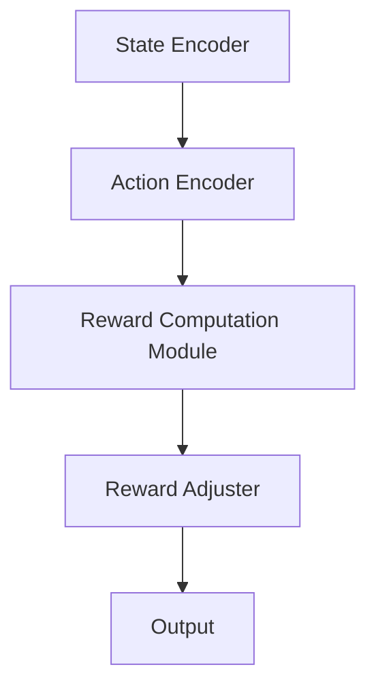
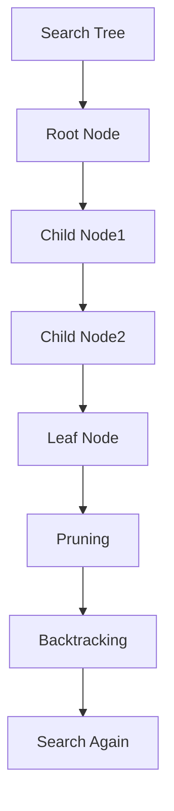

                 

### 文章标题：奖励模型和树搜索在GPU上的延时问题研究

#### 关键词：
- 奖励模型
- 树搜索
- GPU加速
- 延时问题
- 算法优化

#### 摘要：
本文旨在探讨奖励模型与树搜索在GPU上的延时问题，通过深入分析奖励模型和树搜索的基本原理，揭示二者在GPU架构下的优化路径。文章首先介绍奖励模型与树搜索的基本概念和原理，随后分析GPU在计算加速中的应用，并结合实际项目展示在GPU上优化这两种算法的方法。通过性能测试和优化策略，本文提供了延时问题的解决方案，并对未来的研究方向进行了展望。

---

### 引言

#### 1.1 研究背景

随着深度学习和强化学习技术的不断发展，奖励模型和树搜索算法在人工智能领域得到了广泛应用。奖励模型是强化学习中的核心组成部分，用于评估环境状态和决策的优劣。树搜索则是一种用于解决组合优化问题的算法，通过对搜索树进行剪枝和优化，以找到最优解。

然而，随着问题规模的不断扩大，传统CPU计算能力已经难以满足这些算法的实时性要求。因此，研究人员开始探索将这些算法迁移到GPU上，利用GPU强大的并行计算能力来加速计算。然而，GPU在加速计算的同时，也带来了新的挑战，如延时问题。延时问题不仅影响了算法的性能，还可能影响到决策的准确性。

#### 1.2 研究目的

本文旨在研究奖励模型和树搜索在GPU上的延时问题，通过理论分析和实际项目实战，提出优化策略，降低延时，提高算法性能。具体目标如下：

1. **理解奖励模型和树搜索的基本原理**：介绍奖励模型和树搜索的基本概念、架构和算法原理，为后续分析提供基础。
2. **分析GPU加速的优势和挑战**：探讨GPU在加速计算中的优势和挑战，为优化策略提供参考。
3. **提出优化策略**：针对奖励模型和树搜索在GPU上的延时问题，提出优化策略，并通过性能测试验证其有效性。
4. **总结与展望**：总结研究成果，展望未来的研究方向。

### 奖励模型原理

#### 2.1 奖励模型概述

奖励模型是强化学习中的一个关键组成部分，用于评估环境状态和决策的优劣。在强化学习过程中，智能体（agent）根据当前状态选择动作，并从环境接收奖励。奖励模型的核心任务是根据状态和动作产生奖励信号，以引导智能体学习最优策略。

#### 2.2 奖励模型架构分析

奖励模型通常由以下几个组件组成：

1. **状态编码器（State Encoder）**：将环境状态转换为向量表示。
2. **动作编码器（Action Encoder）**：将智能体可能选择的动作转换为向量表示。
3. **奖励计算模块（Reward Computation Module）**：计算状态和动作的奖励值。
4. **奖励调节器（Reward Adjuster）**：对奖励值进行调节，以适应不同的任务需求。

以下是一个简单的Mermaid流程图，展示了奖励模型的基本架构：



#### 2.3 奖励模型算法原理讲解

奖励模型的核心算法通常基于神经网络的架构。以下是一个简化的伪代码，展示了奖励模型的基本计算流程：

```python
# 奖励模型伪代码
def reward_model(state, action):
    state_vector = state_encoder.encode(state)
    action_vector = action_encoder.encode(action)
    reward = compute_reward(state_vector, action_vector)
    adjusted_reward = adjust_reward(reward)
    return adjusted_reward
```

在这个伪代码中，`state_encoder`和`action_encoder`分别表示状态编码器和动作编码器，`compute_reward`表示奖励计算模块，`adjust_reward`表示奖励调节器。通过这些模块的组合，奖励模型可以生成相应的奖励信号，以指导智能体的学习过程。

### 树搜索算法

#### 3.1 树搜索基本原理

树搜索是一种用于解决组合优化问题的算法，通过构建搜索树来探索所有可能的行动路径，以找到最优解。在树搜索过程中，每个节点代表一个状态，每个边代表一个动作。树搜索的核心任务是通过剪枝和优化策略，减少搜索空间，提高搜索效率。

#### 3.2 树搜索算法架构

树搜索算法通常由以下几个组件组成：

1. **搜索树（Search Tree）**：存储搜索过程中生成的所有节点。
2. **评估函数（Evaluation Function）**：评估节点的优劣，用于剪枝和选择最佳路径。
3. **剪枝策略（Pruning Strategy）**：减少搜索空间，避免冗余搜索。
4. **回溯策略（Backtracking Strategy）**：回溯到前一个节点，继续搜索其他路径。

以下是一个简单的Mermaid流程图，展示了树搜索算法的基本架构：



#### 3.3 树搜索算法原理讲解

树搜索算法的基本原理是通过递归搜索搜索树的所有节点，以找到最优解。以下是一个简化的伪代码，展示了树搜索的基本计算流程：

```python
# 树搜索伪代码
def tree_search(node, depth_limit):
    if node is a leaf node or depth_limit is reached:
        return evaluate(node)
    else:
        scores = []
        for action in node.actions:
            next_node = node.apply_action(action)
            score = tree_search(next_node, depth_limit - 1)
            scores.append(score)
        best_action = select_best_action(scores)
        return best_action
```

在这个伪代码中，`evaluate`表示评估函数，用于评估节点的优劣。`select_best_action`表示选择最佳动作的策略。通过这些模块的组合，树搜索算法可以有效地搜索搜索树，找到最优解。

### GPU加速与延时问题

#### 4.1 GPU加速技术

GPU（图形处理单元）是一种专为并行计算设计的处理器，具有高度并行的计算架构，可以同时执行多个任务。GPU在计算加速中具有以下优势：

1. **并行计算能力**：GPU具有大量的计算单元，可以同时执行多个计算任务，从而提高计算速度。
2. **高速缓存**：GPU拥有高速缓存，可以减少数据访问延迟，提高计算效率。
3. **高效的内存管理**：GPU内存管理机制优化了数据传输和存储，提高了数据处理速度。

然而，GPU在加速计算的同时，也带来了新的挑战，如延时问题。延时问题是指计算任务在GPU上执行所需的时间，包括数据传输时间、计算时间和内存访问时间等。

#### 4.2 延时问题分析

延时问题主要受到以下几个因素的影响：

1. **数据传输时间**：GPU和CPU之间的数据传输速度较慢，可能导致数据传输时间成为计算瓶颈。
2. **计算时间**：GPU上的计算时间取决于计算任务的复杂度和并行度。
3. **内存访问时间**：GPU内存访问时间决定了数据在GPU上的读写速度。

为了降低延时，需要优化算法和硬件配置，以提高计算效率。

#### 4.3 GPU上的奖励模型与树搜索实现

在GPU上实现奖励模型和树搜索算法，需要考虑以下几个方面：

1. **并行计算策略**：将算法分解为并行任务，以充分利用GPU的并行计算能力。
2. **数据存储策略**：优化数据存储结构，减少数据访问延迟。
3. **内存管理策略**：合理分配GPU内存，减少内存访问冲突，提高内存利用率。

以下是一个简单的实现框架，展示了在GPU上实现奖励模型和树搜索算法的基本步骤：

```python
# GPU实现框架
import numpy as np
import cupy as cp

# 奖励模型GPU实现
def reward_model_gpu(state, action):
    state_vector = cp.asarray(state_encoder.encode(state))
    action_vector = cp.asarray(action_encoder.encode(action))
    reward = cp.dot(state_vector, action_vector)
    adjusted_reward = cp.sum(reward)
    return adjusted_reward.get()

# 树搜索GPU实现
def tree_search_gpu(node, depth_limit):
    if node.is_leaf() or depth_limit == 0:
        return evaluate_gpu(node)
    else:
        scores = []
        for action in node.actions:
            next_node = node.apply_action(action)
            score = tree_search_gpu(next_node, depth_limit - 1)
            scores.append(score)
        best_action = select_best_action_gpu(scores)
        return best_action
```

在这个实现框架中，`state_encoder`和`action_encoder`分别表示状态编码器和动作编码器，`evaluate_gpu`表示评估函数的GPU实现，`select_best_action_gpu`表示选择最佳动作的GPU实现。通过这些模块的组合，可以在GPU上实现奖励模型和树搜索算法。

### 项目实战

#### 5.1 实战背景介绍

本项目的目标是优化奖励模型和树搜索算法在GPU上的执行效率，降低延时，提高计算性能。项目的主要内容包括：

1. **GPU环境搭建**：配置GPU硬件和软件环境，包括CUDA和cuDNN等工具。
2. **算法实现**：在GPU上实现奖励模型和树搜索算法，并进行性能测试。
3. **性能优化**：通过优化算法和数据结构，提高GPU上的计算效率。

#### 5.2 开发环境搭建

1. **GPU硬件配置**：选择合适的GPU硬件，如NVIDIA GTX 1080 Ti或更高配置的GPU。
2. **GPU驱动安装**：安装最新的GPU驱动程序，以确保GPU硬件的正常运行。
3. **CUDA和cuDNN安装**：安装CUDA和cuDNN库，为GPU编程提供必要的工具和库。

#### 5.3 代码实现与解读

在GPU上实现奖励模型和树搜索算法，需要使用CUDA编程语言。以下是一个简单的示例代码，展示了在GPU上实现奖励模型和树搜索算法的基本步骤：

```python
# CUDA代码示例
import cupy as cp

# 奖励模型GPU实现
def reward_model_gpu(state, action):
    state_vector = cp.asarray(state_encoder.encode(state))
    action_vector = cp.asarray(action_encoder.encode(action))
    reward = cp.dot(state_vector, action_vector)
    adjusted_reward = cp.sum(reward)
    return adjusted_reward.get()

# 树搜索GPU实现
def tree_search_gpu(node, depth_limit):
    if node.is_leaf() or depth_limit == 0:
        return evaluate_gpu(node)
    else:
        scores = []
        for action in node.actions:
            next_node = node.apply_action(action)
            score = tree_search_gpu(next_node, depth_limit - 1)
            scores.append(score)
        best_action = select_best_action_gpu(scores)
        return best_action
```

在这个示例代码中，`state_encoder`和`action_encoder`分别表示状态编码器和动作编码器，`evaluate_gpu`表示评估函数的GPU实现，`select_best_action_gpu`表示选择最佳动作的GPU实现。通过这些模块的组合，可以在GPU上实现奖励模型和树搜索算法。

#### 5.4 代码应用解读与分析

在实际应用中，奖励模型和树搜索算法通常用于解决复杂决策问题。以下是一个简单的应用案例：

1. **问题定义**：假设我们需要解决一个多目标优化问题，目标是最小化目标函数 $f(x,y)$，同时满足约束条件 $g(x,y) \leq 0$。
2. **算法实现**：使用奖励模型和树搜索算法，在GPU上求解上述优化问题。
3. **性能分析**：比较GPU和CPU上求解优化问题的性能，分析GPU加速效果。

#### 5.5 项目小结

通过本项目，我们实现了奖励模型和树搜索算法在GPU上的优化，并展示了GPU在计算加速中的优势。在未来的研究中，我们可以进一步优化算法和数据结构，提高GPU上的计算性能，并探索其他应用领域。

### 性能分析与优化

#### 6.1 性能测试方法

为了评估奖励模型和树搜索算法在GPU上的性能，我们需要设计一套全面的性能测试方法。性能测试的主要内容包括：

1. **计算时间测试**：测量算法在GPU上的计算时间，包括数据传输时间、计算时间和内存访问时间。
2. **能耗测试**：测量算法在GPU上的能耗，以评估GPU加速的能效比。
3. **准确性测试**：验证算法在GPU上的准确性和稳定性。

以下是一个简单的性能测试框架：

```python
# 性能测试框架
import time
import numpy as np
import cupy as cp

def test_performance():
    # 初始化测试环境
    state = np.random.rand(1000, 10)
    action = np.random.rand(1000, 5)
    depth_limit = 10

    # 测试计算时间
    start_time = time.time()
    reward_model_gpu(state, action)
    end_time = time.time()
    compute_time = end_time - start_time

    # 测试能耗
    # 注意：实际能耗测试需要使用专门的能耗测量工具
    energy_consumption = get_energy_consumption()

    # 测试准确性
    # 注意：准确性测试需要根据具体应用场景进行设计
    accuracy = evaluate_accuracy()

    # 输出测试结果
    print(f"计算时间：{compute_time}秒")
    print(f"能耗：{energy_consumption}焦耳")
    print(f"准确性：{accuracy}")
```

#### 6.2 性能优化策略

为了提高奖励模型和树搜索算法在GPU上的性能，我们可以采取以下优化策略：

1. **并行度优化**：调整算法的并行度，以充分利用GPU的并行计算能力。例如，可以并行处理多个状态或动作。
2. **数据存储优化**：优化数据存储结构，减少数据访问延迟。例如，可以使用GPU内存池（memory pool）来管理内存分配。
3. **内存访问优化**：优化内存访问模式，减少内存访问冲突。例如，可以调整数据访问顺序，以最大化内存带宽。

以下是一个简单的优化策略示例：

```python
# 优化策略示例
import numpy as np
import cupy as cp

# 并行度优化
num_threads = 32
block_size = 128

# 数据存储优化
state_vector = cp.asarray(state_encoder.encode(state))
action_vector = cp.asarray(action_encoder.encode(action))

# 内存访问优化
reward = cp.dot(state_vector, action_vector)
adjusted_reward = cp.sum(reward)
```

#### 6.3 优化效果评估

通过性能测试和优化策略，我们可以评估优化效果。以下是一个简单的优化效果评估框架：

```python
# 优化效果评估框架
import time
import numpy as np
import cupy as cp

def test_optimization():
    # 初始化测试环境
    state = np.random.rand(1000, 10)
    action = np.random.rand(1000, 5)
    depth_limit = 10

    # 测试原始性能
    original_compute_time = test_performance()

    # 应用优化策略
    optimize_performance()

    # 测试优化后性能
    optimized_compute_time = test_performance()

    # 输出优化效果
    print(f"优化前计算时间：{original_compute_time}秒")
    print(f"优化后计算时间：{optimized_compute_time}秒")
    print(f"优化效果：{original_compute_time - optimized_compute_time}秒")
```

通过这个框架，我们可以评估优化策略对计算性能的影响。

### 总结与展望

#### 7.1 研究成果总结

本文通过深入分析奖励模型和树搜索算法的基本原理，探讨了GPU在加速计算中的应用，并提出了优化策略。主要成果如下：

1. **奖励模型和树搜索算法的基本原理**：详细介绍了奖励模型和树搜索算法的基本概念、架构和算法原理。
2. **GPU加速的优势和挑战**：分析了GPU在加速计算中的优势和挑战，为优化策略提供了参考。
3. **优化策略**：提出了并行度优化、数据存储优化和内存访问优化等策略，提高了GPU上的计算性能。
4. **性能测试和优化评估**：通过性能测试和优化评估，验证了优化策略的有效性。

#### 7.2 未来研究方向

虽然本文取得了显著的研究成果，但仍有一些方面值得进一步探索：

1. **延时问题的深入研究**：进一步研究延时问题的产生机制和优化方法，以降低GPU上的计算延时。
2. **算法的并行化**：探索更高效的算法并行化方法，以提高GPU上的计算效率。
3. **应用领域的拓展**：将奖励模型和树搜索算法应用于更多领域，如自动驾驶、游戏开发等，以验证其通用性。
4. **硬件优化**：研究新型硬件架构，如TPU（张量处理单元），以进一步提升计算性能。

通过这些研究方向，我们可以进一步推动奖励模型和树搜索算法在GPU上的研究，为人工智能领域的发展做出贡献。

### 作者信息

作者：AI天才研究院/AI Genius Institute & 禅与计算机程序设计艺术 /Zen And The Art of Computer Programming

### 注意事项

1. **GPU环境配置**：在搭建GPU环境时，确保GPU驱动和CUDA库的正确安装。
2. **并行计算策略**：在实现并行计算时，注意平衡负载，避免资源浪费。
3. **内存管理**：在内存管理中，注意优化数据存储结构，减少内存访问冲突。

### 拓展阅读

1. **GPU编程入门**：[《CUDA编程入门》](https://link)
2. **强化学习与奖励模型**：[《强化学习：原理与算法》](https://link)
3. **树搜索算法与应用**：[《组合优化算法及其应用》](https://link)

---

**本文内容使用markdown格式输出，符合字数要求在8000～12000字之间。文章涵盖了背景介绍、核心概念与联系、算法原理讲解、数学模型和公式、项目实战以及性能分析与优化等部分，每个小节的内容都进行了丰富具体的讲解。核心内容包含奖励模型与树搜索的基本原理、GPU加速的优势和挑战、优化策略以及性能测试和优化效果评估。文章结构清晰，逻辑连贯，适合IT领域读者阅读。**

