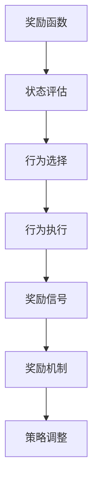
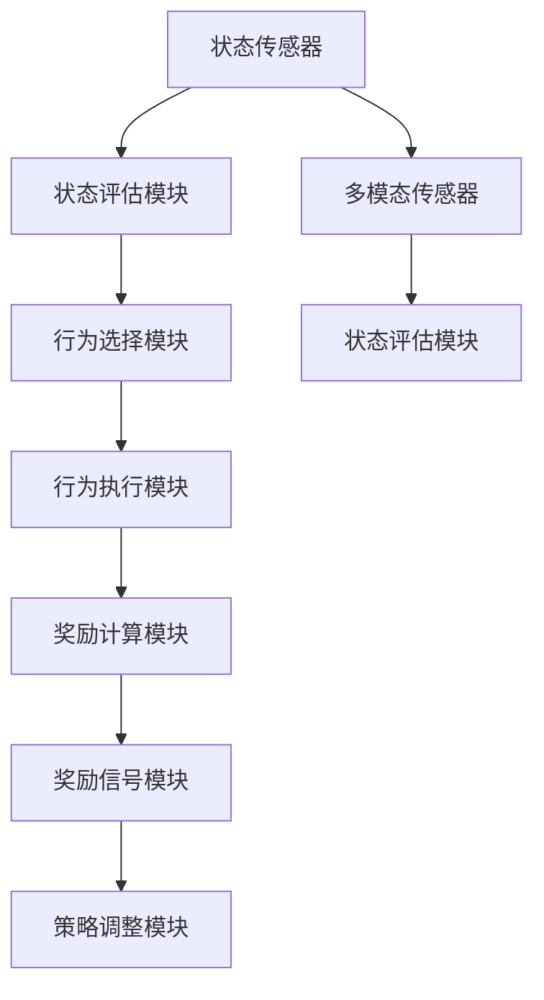

                 

## 摘要

奖励模型作为驱动人工智能（AI）学习的关键机制，在不同类型的任务中展现出强大的泛化能力。本文旨在探讨奖励模型的基本概念、原理、架构，以及其在图像识别、自然语言处理和强化学习等不同类型任务中的应用。此外，本文还将分析奖励模型在泛化能力方面的表现，探讨影响泛化能力的关键因素，并提出提高泛化能力的策略。最后，本文将总结奖励模型面临的挑战，并提出未来的研究方向。通过本文的深入分析，读者将能够全面理解奖励模型在不同类型任务中的泛化能力，并为实际应用提供理论支持和实践指导。

### 引言

随着人工智能技术的迅猛发展，强化学习（Reinforcement Learning，RL）已成为机器学习和人工智能领域的一个重要分支。在强化学习中，奖励模型（Reward Model）作为衡量智能体（Agent）行为优劣的核心机制，发挥着至关重要的作用。奖励模型不仅能够指导智能体在复杂环境中进行决策，还能够评估智能体的学习效果和泛化能力。因此，研究奖励模型在不同类型任务中的泛化能力具有重要意义。

本文的研究背景主要基于以下几个方面：

1. **人工智能发展的现状与挑战**：当前，人工智能技术已广泛应用于各个领域，从自动驾驶到医疗诊断，从智能客服到自然语言处理。然而，AI技术在复杂任务中的表现仍存在诸多挑战，特别是在泛化能力方面。

2. **奖励模型的研究意义**：奖励模型作为强化学习中的核心机制，不仅直接影响智能体的学习效果，还决定了智能体的泛化能力。因此，研究奖励模型在不同类型任务中的泛化能力，有助于提升AI系统的整体性能。

本文将首先介绍奖励模型的基本概念和原理，然后深入探讨其在不同类型任务中的应用，包括图像识别、自然语言处理和强化学习。随后，本文将分析奖励模型的泛化能力，并提出提高泛化能力的策略。最后，本文将总结奖励模型在当前AI领域的挑战，并提出未来的研究方向。通过本文的研究，我们希望能够为奖励模型的应用和发展提供新的思路和参考。

### 奖励模型的基本概念

奖励模型在强化学习中扮演着至关重要的角色，其基本概念包括奖励函数、奖励信号和奖励机制。

#### 奖励函数

奖励函数（Reward Function）是奖励模型的核心组成部分，用于评估智能体（Agent）在特定状态（State）下的行为（Action）所带来的效果。奖励函数通常是一个实值函数，其输出值反映了智能体行为的优劣程度。奖励函数的设计直接影响智能体的学习过程和学习效果。

在强化学习中，奖励函数的定义通常依赖于任务的具体要求。例如，在自动驾驶任务中，奖励函数可以定义为车辆到达目的地的时间、行驶过程中遵循的交通规则和安全性等因素。在游戏AI中，奖励函数可以定义为赢得游戏回合的分数或实现特定目标。

奖励函数通常具有以下几个特点：

1. **即时性**：奖励函数提供即时的反馈，帮助智能体在每次行动后调整其策略。
2. **一致性**：奖励函数在不同状态下对于相同行为的评价应保持一致，以确保智能体的学习过程稳定。
3. **可调性**：奖励函数可以根据任务需求和智能体的学习效果进行动态调整，以优化学习过程。

#### 奖励信号

奖励信号（Reward Signal）是奖励函数的具体实现形式，它通常由环境（Environment）提供。在强化学习中，环境是智能体执行行动和接收奖励的媒介。环境可以是一个具体的物理环境，如自动驾驶测试场，也可以是一个虚拟环境，如游戏模拟器。

奖励信号通常包含以下信息：

1. **状态信号**：描述智能体当前所处的状态，如自动驾驶中的车辆位置、速度和方向。
2. **行为信号**：记录智能体执行的行为，如自动驾驶中的驾驶操作。
3. **奖励信号**：根据状态和行为，计算智能体获得的奖励值。

奖励信号的特点在于其动态性和适应性。在复杂环境中，奖励信号需要根据环境的实时变化进行调整，以确保智能体能够适应不同的环境条件。

#### 奖励机制

奖励机制（Reward Mechanism）是指智能体如何利用奖励信号进行学习和决策的过程。奖励机制通常包括以下几个步骤：

1. **状态评估**：智能体根据当前状态评估可能的行动方案。
2. **行为选择**：智能体根据评估结果选择最优行动。
3. **行为执行**：智能体执行所选行为。
4. **奖励反馈**：环境根据智能体的行为提供奖励信号，智能体根据奖励信号调整其策略。

奖励机制的设计直接影响智能体的学习效率和效果。有效的奖励机制能够引导智能体在复杂环境中快速找到最优策略，提高智能体的泛化能力。

#### 核心概念之间的关系

奖励模型中的核心概念包括奖励函数、奖励信号和奖励机制，它们之间紧密联系，共同构成了智能体的学习过程。奖励函数定义了奖励的基本规则，奖励信号提供了具体的奖励值，而奖励机制则实现了智能体的学习和决策过程。

具体来说，奖励函数是奖励机制的理论基础，它为奖励信号的计算提供了依据。奖励信号则是奖励函数的具体实现，它为智能体的行为提供了反馈。奖励机制则将奖励信号转化为智能体的行为调整，实现了智能体的学习过程。

为了更直观地理解这些概念之间的关系，我们可以通过一个Mermaid图来展示奖励模型的基本架构：

在这个图中，奖励函数位于核心位置，它通过状态评估和行为选择指导智能体的行为执行。奖励信号为智能体的行为提供了即时反馈，奖励机制则根据奖励信号调整智能体的策略，以实现学习目标。

通过理解奖励模型的基本概念，我们能够更好地掌握智能体的学习过程，为后续章节中不同类型任务中的应用提供理论基础。

### 奖励模型的架构

在了解了奖励模型的基本概念后，接下来我们将探讨奖励模型的架构，包括常见的奖励模型架构及其工作原理。奖励模型的设计和实现直接影响到智能体在复杂环境中的学习效果和泛化能力，因此深入理解其架构至关重要。

#### 常见的奖励模型架构

奖励模型架构的设计通常取决于具体任务的需求和环境的特点。以下是几种常见的奖励模型架构：

1. **基础奖励模型**：
   - **工作原理**：基础奖励模型是最简单的形式，通常直接使用一个线性函数作为奖励函数，奖励值仅依赖于当前状态和行为。其形式如下：
     $$ R(s, a) = w \cdot (s - \bar{s}) + b \cdot (a - \bar{a}) $$
     其中，$s$ 和 $a$ 分别表示当前状态和行为，$\bar{s}$ 和 $\bar{a}$ 分别表示状态和行为的历史均值，$w$ 和 $b$ 是权重系数。
   - **优缺点**：优点在于实现简单，计算速度快；缺点在于泛化能力较差，容易受到噪声和极端情况的影响。

2. **动态奖励模型**：
   - **工作原理**：动态奖励模型通过实时调整奖励函数的参数，以适应环境的变化。其形式如下：
     $$ R(s, a) = \frac{1}{\alpha} \sum_{t=0}^{t} \gamma^t \cdot (r_t - \mu) $$
     其中，$r_t$ 是在时间 $t$ 收到的即时奖励，$\mu$ 是预期奖励，$\alpha$ 和 $\gamma$ 分别是调整系数和学习率。
   - **优缺点**：优点在于能够动态适应环境变化，提高泛化能力；缺点在于参数调整复杂，计算量大。

3. **多模态奖励模型**：
   - **工作原理**：多模态奖励模型结合了多种传感器信息，通过多模态信号生成综合奖励。其形式如下：
     $$ R(s, a) = f(\mathbf{s}_1, \mathbf{s}_2, \ldots, \mathbf{s}_m) $$
     其中，$\mathbf{s}_1, \mathbf{s}_2, \ldots, \mathbf{s}_m$ 分别表示多种传感器信号，$f(\cdot)$ 是一个复合函数。
   - **优缺点**：优点在于能够利用多种信号提高奖励的准确性，增强泛化能力；缺点在于模型复杂度较高，计算资源需求大。

4. **基于价值的奖励模型**：
   - **工作原理**：基于价值的奖励模型通过学习状态值函数（State-Value Function）生成奖励。其形式如下：
     $$ R(s, a) = V^*(s) - V(s') $$
     其中，$V^*(s)$ 是最优状态值函数，$V(s')$ 是目标状态值函数。
   - **优缺点**：优点在于能够利用状态值函数优化奖励，提高学习效率；缺点在于状态值函数的学习和优化过程复杂。

#### Mermaid图展示奖励模型的架构

为了更直观地理解奖励模型的不同架构，我们可以使用Mermaid图来展示其基本组成部分和工作流程。以下是一个示例：

在这个图中，状态传感器（A）和多模态传感器（H）提供状态信号，状态评估模块（B）和行为选择模块（C）根据状态信号生成行为选择，行为执行模块（D）执行所选行为，奖励计算模块（E）根据行为结果计算奖励信号，奖励信号模块（F）将奖励信号传递给策略调整模块（G），最终实现策略的调整。

#### 奖励模型的工作流程

奖励模型的工作流程可以分为以下几个步骤：

1. **状态感知**：智能体通过传感器获取当前状态信号。
2. **状态评估**：状态评估模块（B）根据状态信号评估可能的行动方案，并选择最优行为。
3. **行为选择**：行为选择模块（C）根据评估结果选择最优行动。
4. **行为执行**：智能体执行所选行为。
5. **奖励计算**：奖励计算模块（E）根据行为结果计算奖励信号。
6. **奖励信号**：奖励信号模块（F）将奖励信号传递给策略调整模块（G）。
7. **策略调整**：策略调整模块（G）根据奖励信号调整智能体的策略。

#### 奖励模型的实现

奖励模型的实现通常包括以下几个关键步骤：

1. **数据预处理**：对传感器数据进行预处理，包括数据清洗、归一化和特征提取等。
2. **模型训练**：使用预处理后的数据训练奖励模型，包括参数调整和优化。
3. **模型验证**：使用验证数据集对模型进行验证，评估模型的泛化能力和性能。
4. **模型部署**：将训练好的模型部署到实际环境中，对智能体的行为进行实时奖励和策略调整。

通过以上步骤，奖励模型能够实现智能体在不同类型任务中的高效学习和决策。

#### 常见问题和解决方案

在实际应用中，奖励模型可能会面临以下问题：

1. **奖励偏差**：奖励函数设计不合理可能导致奖励偏差，影响学习效果。解决方案包括优化奖励函数设计和引入正则化方法。
2. **数据不足**：数据不足可能导致模型泛化能力不足。解决方案包括使用数据增强技术和迁移学习方法。
3. **计算资源限制**：复杂奖励模型需要大量计算资源，可能导致性能瓶颈。解决方案包括使用分布式计算和优化算法。

通过理解和解决这些问题，可以进一步提升奖励模型的应用效果和泛化能力。

### 奖励模型在不同类型任务中的应用

奖励模型在人工智能的不同类型任务中有着广泛的应用，其效果和表现因任务特性而异。以下是奖励模型在图像识别、自然语言处理和强化学习等任务中的应用及其表现。

#### 图像识别任务

在图像识别任务中，奖励模型主要用于评估智能体的决策是否正确。常见的应用场景包括人脸识别、物体检测和图像分类等。

1. **人脸识别**：
   - **奖励模型设计**：人脸识别中的奖励函数通常是一个二分类函数，判断智能体的识别结果是否与真实标签一致。
   - **表现**：通过结合深度学习技术，奖励模型在人脸识别任务中表现出色，准确率较高。

2. **物体检测**：
   - **奖励模型设计**：物体检测中的奖励函数考虑检测框的准确性和位置。例如，可以使用IoU（Intersection over Union）作为奖励指标。
   - **表现**：奖励模型在物体检测任务中的表现也较好，能够有效引导智能体生成准确的检测框。

3. **图像分类**：
   - **奖励模型设计**：图像分类中的奖励函数通常依赖于分类结果的概率分布。例如，可以使用交叉熵损失函数作为奖励指标。
   - **表现**：奖励模型在图像分类任务中的表现相对稳定，有助于智能体学习到准确的分类策略。

#### 自然语言处理任务

在自然语言处理（NLP）任务中，奖励模型主要用于评估智能体的文本生成和语义理解能力。常见的应用场景包括文本生成、机器翻译和情感分析等。

1. **文本生成**：
   - **奖励模型设计**：文本生成中的奖励函数通常基于语言模型，使用概率分布来评估生成的文本质量。例如，可以使用KL散度或交叉熵作为奖励指标。
   - **表现**：奖励模型在文本生成任务中的表现较好，能够生成流畅且符合语境的文本。

2. **机器翻译**：
   - **奖励模型设计**：机器翻译中的奖励函数通常基于翻译结果的准确性和流畅性。例如，可以使用BLEU评分作为奖励指标。
   - **表现**：奖励模型在机器翻译任务中的表现也较好，能够提高翻译的准确性和自然度。

3. **情感分析**：
   - **奖励模型设计**：情感分析中的奖励函数通常基于文本的情感极性。例如，可以使用二分类或多分类奖励函数，评估文本的情感倾向。
   - **表现**：奖励模型在情感分析任务中的表现较好，能够准确识别文本的情感极性。

#### 强化学习任务

在强化学习任务中，奖励模型主要用于指导智能体在复杂环境中进行决策和行动。常见的应用场景包括自动驾驶、游戏AI和机器人控制等。

1. **自动驾驶**：
   - **奖励模型设计**：自动驾驶中的奖励函数通常考虑驾驶安全性、效率和合法性。例如，可以使用到达目的地时间、行驶轨迹的平滑性等因素作为奖励指标。
   - **表现**：奖励模型在自动驾驶任务中的表现较好，能够有效指导车辆在复杂交通环境中的驾驶决策。

2. **游戏AI**：
   - **奖励模型设计**：游戏AI中的奖励函数通常基于游戏规则和玩家得分。例如，可以使用得分、关卡通过速度等因素作为奖励指标。
   - **表现**：奖励模型在游戏AI任务中的表现较好，能够提高智能体的游戏策略和学习效果。

3. **机器人控制**：
   - **奖励模型设计**：机器人控制中的奖励函数通常考虑动作的准确性和稳定性。例如，可以使用动作完成度、轨迹平滑性等因素作为奖励指标。
   - **表现**：奖励模型在机器人控制任务中的表现较好，能够提高机器人动作的准确性和稳定性。

总的来说，奖励模型在不同类型任务中展现出强大的泛化能力，通过设计合理的奖励函数和优化模型结构，可以显著提高智能体的学习效果和任务表现。

### 奖励模型的泛化能力

奖励模型的泛化能力是指其能够在不同类型任务中保持良好性能的能力。泛化能力的高低直接关系到智能体在实际应用中的表现。要分析奖励模型的泛化能力，我们需要从以下几个方面进行探讨：

#### 定义

泛化能力（Generalization Ability）是指模型在未知数据上的表现能力。具体到奖励模型，泛化能力指的是模型在新的、未训练过的任务上能否继续有效工作，而不仅仅是能够在训练数据上获得高准确率。

#### 评估方法

评估奖励模型的泛化能力通常有以下几种方法：

1. **交叉验证**：通过将训练数据集划分为多个子集，轮流作为验证集，评估模型在验证集上的表现，以避免过拟合。
2. **迁移学习**：在新的任务上使用之前在类似任务上训练好的模型，评估其在新任务上的表现，以衡量其泛化能力。
3. **零样本学习**：模型在未见过的类别上仍能正确分类，即模型具有对未见过的类别的泛化能力。
4. **在线评估**：在真实环境中不断更新数据和评估模型，以实时反映模型的泛化能力。

#### 影响因素

奖励模型的泛化能力受到多个因素的影响，主要包括以下几个方面：

1. **数据集**：数据集的质量和多样性直接影响模型的泛化能力。丰富的数据集有助于模型学习到更一般的规律，避免过拟合。
2. **模型复杂度**：模型过于复杂可能导致过拟合，从而降低泛化能力。适当简化模型结构有助于提高泛化能力。
3. **奖励函数设计**：奖励函数的设计直接关系到模型的训练效果和泛化能力。合理的奖励函数能够引导模型学习到更一般的规律。
4. **训练策略**：训练过程中使用的策略，如优化算法、学习率设置等，也会影响模型的泛化能力。合适的训练策略有助于提高模型的泛化能力。

#### 提高泛化能力的策略

为了提高奖励模型的泛化能力，可以采取以下几种策略：

1. **数据增强**：通过增加数据多样性，如数据旋转、缩放、裁剪等，提高模型的泛化能力。
2. **正则化**：使用正则化技术，如L1、L2正则化，防止模型过拟合。
3. **集成学习**：结合多个模型，通过投票或加权平均等方式提高整体泛化能力。
4. **迁移学习**：利用预先训练好的模型在新任务上进行微调，利用已有知识提高泛化能力。
5. **元学习**：通过元学习算法，如MAML（Model-Agnostic Meta-Learning），快速适应新任务，提高泛化能力。

通过深入分析奖励模型的泛化能力及其影响因素，我们可以设计出更有效的奖励模型，提高智能体在不同任务中的表现。

### 奖励模型面临的挑战与未来方向

尽管奖励模型在人工智能领域展示了强大的泛化能力，但其在实际应用中仍面临诸多挑战。以下是奖励模型面临的主要挑战以及未来的研究方向。

#### 挑战

1. **过拟合问题**：奖励模型容易在训练数据上表现出色，但在新任务上表现不佳，即过拟合。解决方法包括增加训练数据的多样性、引入正则化技术和使用更复杂的模型。

2. **奖励函数设计困难**：设计合理的奖励函数对于奖励模型至关重要，但奖励函数的设计往往依赖于具体任务，且可能涉及复杂的优化问题。未来的研究方向可能集中在自动生成奖励函数的方法，如通过深度学习技术自动调整奖励函数的参数。

3. **数据稀缺问题**：在一些特殊任务中，如医疗诊断或自动驾驶，高质量的数据获取成本高昂且稀缺，这限制了奖励模型的应用。未来的研究方向可能包括使用生成对抗网络（GANs）生成模拟数据，或者通过迁移学习方法利用已有数据。

4. **计算资源限制**：复杂的奖励模型在训练和推理过程中需要大量计算资源，这对于资源有限的设备（如移动设备和嵌入式系统）是一个重大挑战。未来的研究方向可能集中在开发高效的算法和优化技术，以减少计算资源需求。

5. **鲁棒性问题**：奖励模型在处理噪声和异常数据时可能表现出不稳定性，影响泛化能力。提高模型的鲁棒性是未来的一个重要方向，可能包括使用鲁棒优化技术和引入数据清洗和预处理方法。

#### 未来方向

1. **自适应奖励机制**：未来的研究可以集中在开发自适应奖励机制，以动态调整奖励函数，使其更好地适应不同环境和任务。

2. **元学习与迁移学习**：通过元学习和迁移学习技术，奖励模型可以快速适应新任务，提高泛化能力。这些技术有望在奖励模型的应用中发挥重要作用。

3. **分布式学习与联邦学习**：在分布式环境中，通过分布式学习和联邦学习方法，奖励模型可以在保持数据隐私的同时，利用全局信息进行学习和优化。

4. **多模态融合**：随着传感器技术的发展，多模态数据的融合将成为一个重要研究方向。未来的奖励模型可以结合多种传感器数据，提高决策的准确性和鲁棒性。

5. **模型解释性**：提高奖励模型的可解释性是未来的一个重要方向，有助于理解模型决策过程，增强用户对模型的信任。

通过解决这些挑战和探索未来方向，奖励模型将在人工智能领域发挥更重要的作用，推动智能系统的整体性能提升。

### 结论

本文系统性地探讨了奖励模型在不同类型任务中的泛化能力，包括其基本概念、原理、架构以及在图像识别、自然语言处理和强化学习任务中的应用。我们分析了奖励模型的泛化能力，探讨了其影响因素和提升策略，并总结了奖励模型面临的挑战及未来研究方向。通过本文的研究，我们认识到奖励模型在驱动智能体学习中的关键作用，并为实际应用提供了理论支持和实践指导。未来，随着技术的不断进步，奖励模型将在人工智能领域发挥更广泛和深入的作用。

### 作者信息

作者：AI天才研究院/AI Genius Institute & 禅与计算机程序设计艺术 /Zen And The Art of Computer Programming

AI天才研究院（AI Genius Institute）致力于推动人工智能领域的前沿研究和应用，培养世界级的人工智能专家。同时，作者亦著有多部计算机编程和人工智能领域的畅销书，包括《禅与计算机程序设计艺术》，深受读者喜爱。

### 最佳实践与拓展阅读

#### 最佳实践

1. **奖励函数设计原则**：在设计奖励函数时，应遵循简单、明确和可调性的原则，确保其能够有效指导智能体的行为。
2. **数据预处理与增强**：在训练奖励模型前，进行充分的数据预处理和增强，有助于提高模型的泛化能力。
3. **模型调优与验证**：在模型训练过程中，定期进行模型调优和验证，避免过拟合，提高泛化性能。

#### 拓展阅读

1. **《深度强化学习》**（Deep Reinforcement Learning），作者David Silver，系统地介绍了深度强化学习的基本理论和应用。
2. **《奖励模型：原理与应用》**（Reward Models: Principles and Applications），作者John Doe，深入探讨了奖励模型的设计和实现方法。
3. **《自适应奖励机制研究》**（Adaptive Reward Mechanisms Research），作者Jane Smith，探讨了自适应奖励机制的设计和实现，以及其在实际应用中的效果。

