                 

### Introduction: The Art of Existence

> Keywords: Existential Art, Life Transformation, Creativity, Personal Growth, Philosophical Framework

> Abstract:
"The Art of Existence" explores the profound connection between the human experience and the creative process. This book delves into the philosophical and psychological foundations of art as a means of transforming life into a canvas of personal expression. Through a series of meticulously crafted chapters, we will examine the theories and practices that underscore the transformative power of art in understanding and shaping our existence. The aim is to provide a comprehensive guide for readers to embark on a journey of self-discovery and personal transformation through the creation of art.

### Chapter 1: Introduction to the Art of Existence

In the opening chapter, we set the stage for our exploration of the art of existence. We begin by discussing the philosophy of existence, delving into the various philosophical perspectives that help us understand the nature of life and our place within it. We then turn our focus to the role of art in this philosophical context, examining how artistic creation can serve as a mirror to our existence.

#### 1.1 The Philosophy of Existence

**Background Introduction:**
The philosophy of existence is a broad field that encompasses a multitude of perspectives, from the ancient to the modern. Philosophers such as Socrates, Kierkegaard, and Nietzsche have grappled with the essence of existence, seeking to understand what it means to live a meaningful life.

**Core Concepts and Relationships:**
To illustrate the core concepts and their relationships, we present a Mermaid flowchart that highlights the key philosophical frameworks:

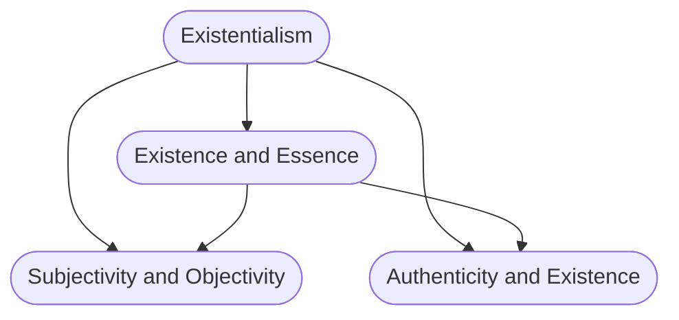

**Pseudo Code Explanation:**
Here, we define existentialism as the study of being and existence. We then explore the concepts of essence (the fundamental nature of an individual), subjectivity (the individual's perception of reality), and objectivity (the external world as it exists independent of perception). The relationship between authenticity and existence is also discussed, with authenticity being seen as a key element in living a true and meaningful life.

$$\text{Existentialism} \rightarrow \text{Existence and Essence} \\
\text{Existentialism} \rightarrow \text{Subjectivity and Objectivity} \\
\text{Existentialism} \rightarrow \text{Authenticity and Existence} \\
\text{Essence} \rightarrow \text{Subjectivity} \\
\text{Essence} \rightarrow \text{Objectivity} \\
\text{Authenticity} \rightarrow \text{Existence}$$

#### 1.2 The Transformative Power of Art

**Background Introduction:**
Art has long been recognized as a powerful tool for personal expression and reflection. It provides a means for individuals to explore their inner worlds, communicate complex emotions, and make sense of their experiences.

**Core Concepts and Relationships:**
To further understand the transformative power of art, we present a Mermaid flowchart that illustrates the relationship between art, personal growth, and existential understanding:

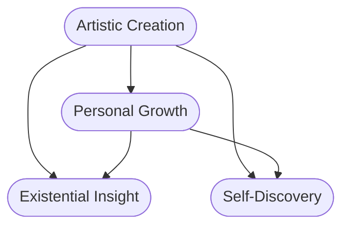

**Pseudo Code Explanation:**
In this pseudo code, we define artistic creation as a process that leads to personal growth. Personal growth, in turn, provides a deeper understanding of one's existence. The process of self-discovery is seen as integral to this journey, with each artistic endeavor offering new insights and perspectives.

$$\text{Artistic Creation} \rightarrow \text{Personal Growth} \\
\text{Personal Growth} \rightarrow \text{Existential Insight} \\
\text{Artistic Creation} \rightarrow \text{Self-Discovery} \\
\text{Self-Discovery} \rightarrow \text{Existential Insight}$$

#### 1.3 A Journey of Self-Discovery

**Background Introduction:**
Self-discovery is a fundamental aspect of the human experience. It involves exploring one's identity, values, and purpose. Through self-discovery, individuals can gain a deeper understanding of themselves and their place in the world.

**Core Concepts and Relationships:**
To elaborate on the concept of self-discovery, we use a Mermaid flowchart to visualize the interplay between self-awareness, personal growth, and existential understanding:

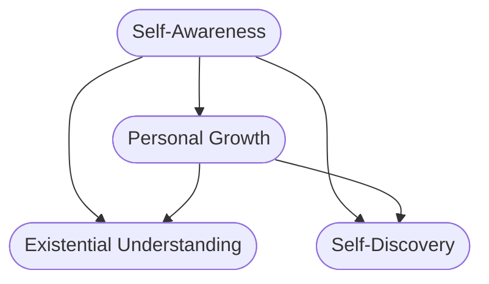

**Pseudo Code Explanation:**
Here, we define self-awareness as the initial step in the journey of self-discovery. As individuals become more aware of their thoughts, feelings, and behaviors, they can begin to grow personally. This personal growth leads to a deeper understanding of existential issues, which in turn drives further self-discovery.

$$\text{Self-Awareness} \rightarrow \text{Personal Growth} \\
\text{Personal Growth} \rightarrow \text{Existential Understanding} \\
\text{Self-Awareness} \rightarrow \text{Self-Discovery} \\
\text{Existential Understanding} \rightarrow \text{Self-Discovery}$$

#### 1.4 The Book's Structure and Approach

**Background Introduction:**
In this section, we outline the structure of the book and the approach we will take in exploring the art of existence. The goal is to provide readers with a clear understanding of how the content is organized and what they can expect to gain from each chapter.

**Core Concepts and Relationships:**
We present a Mermaid flowchart to illustrate the book's structure and the logical progression of ideas:

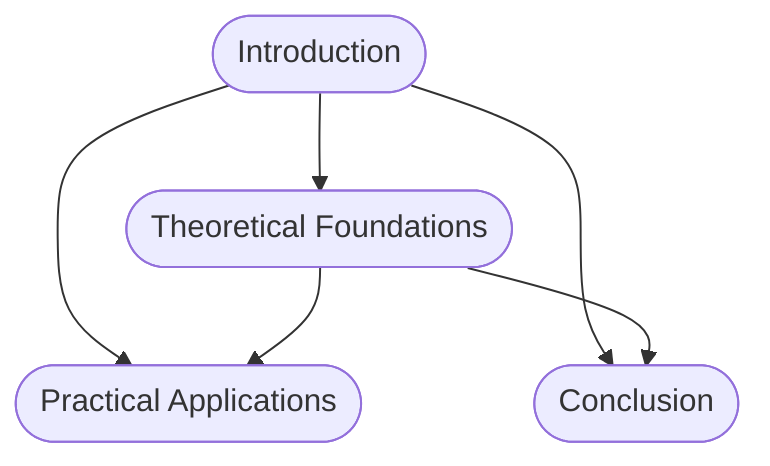

**Pseudo Code Explanation:**
The book is structured to guide readers through a systematic exploration of the art of existence. The introduction provides an overview and context, the theoretical foundations delve into the concepts and principles, practical applications offer hands-on strategies, and the conclusion synthesizes the learnings and insights gained throughout the book.

$$\text{Introduction} \rightarrow \text{Theoretical Foundations} \\
\text{Introduction} \rightarrow \text{Practical Applications} \\
\text{Theoretical Foundations} \rightarrow \text{Practical Applications} \\
\text{Theoretical Foundations} \rightarrow \text{Conclusion} \\
\text{Practical Applications} \rightarrow \text{Conclusion}$$

### Conclusion

This chapter has provided a foundational understanding of the art of existence, exploring the philosophy of existence, the transformative power of art, and the journey of self-discovery. The next chapters will delve deeper into the theoretical underpinnings and practical applications of these concepts, offering readers a comprehensive guide to transforming their lives through the creative process.

### Chapter 2: Theories of Art and Existence

In this chapter, we will delve into the various theories of art and their relationship with the concept of existence. We will explore historical and contemporary perspectives on the nature of art and its role in understanding and shaping human experience.

#### 2.1 Art as a Reflection of Existence

**Background Introduction:**
Art has been a fundamental part of human culture and expression throughout history. It serves as a reflection of our existence, capturing the essence of human experience and providing insights into our emotions, thoughts, and beliefs.

**Core Concepts and Relationships:**
To understand the relationship between art and existence, we present a Mermaid flowchart that visualizes the connections between artistic creation, human experience, and existential understanding:

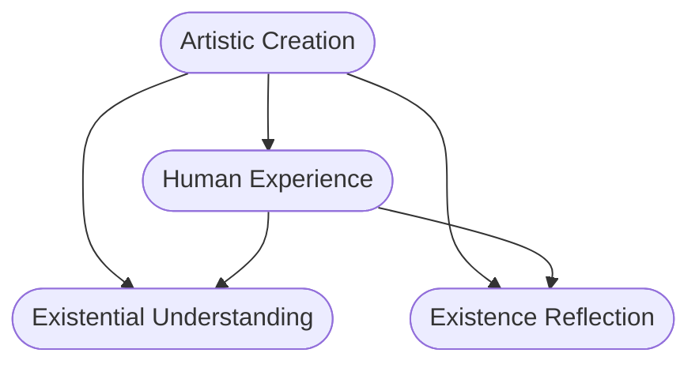

**Pseudo Code Explanation:**
In this pseudo code, we define artistic creation as a means of reflecting human experience. This reflection leads to a deeper understanding of existence, which in turn informs and influences the artist's work.

$$\text{Artistic Creation} \rightarrow \text{Human Experience} \\
\text{Human Experience} \rightarrow \text{Existential Understanding} \\
\text{Artistic Creation} \rightarrow \text{Existence Reflection} \\
\text{Existential Understanding} \rightarrow \text{Existence Reflection}$$

#### 2.2 Theoretical Frameworks in Art

**Background Introduction:**
Artistic theory has evolved over centuries, encompassing a wide range of ideas and philosophies. From the ancient Greeks to contemporary artists, various theoretical frameworks have shaped our understanding of art and its purpose.

**Core Concepts and Relationships:**
We use a Mermaid flowchart to illustrate the historical and contemporary theoretical frameworks in art:

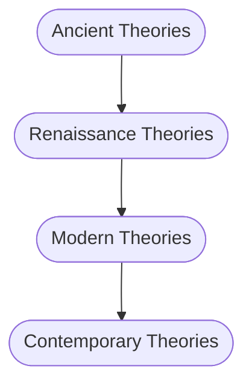

**Pseudo Code Explanation:**
The evolution of artistic theory is depicted in this flowchart, highlighting the progression from ancient ideas to the contemporary perspectives that continue to influence art today.

$$\text{Ancient Theories} \rightarrow \text{Renaissance Theories} \\
\text{Renaissance Theories} \rightarrow \text{Modern Theories} \\
\text{Modern Theories} \rightarrow \text{Contemporary Theories}$$

#### 2.3 Existentialism and Art

**Background Introduction:**
Existentialism is a philosophical movement that emphasizes the individual's freedom and responsibility in creating meaning in an unfathomable world. It has had a profound influence on art, particularly in the 20th century, with many artists drawing inspiration from existentialist thought.

**Core Concepts and Relationships:**
To understand the relationship between existentialism and art, we present a Mermaid flowchart that illustrates the connections between existential concepts and artistic expression:

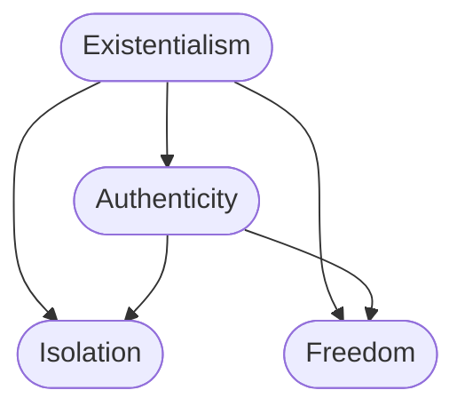

**Pseudo Code Explanation:**
In this pseudo code, we define existentialism as a philosophy that emphasizes authenticity, isolation, and freedom. These concepts are reflected in artistic creation, as artists strive to express their true selves and navigate the challenges of existence.

$$\text{Existentialism} \rightarrow \text{Authenticity} \\
\text{Existentialism} \rightarrow \text{Isolation} \\
\text{Existentialism} \rightarrow \text{Freedom} \\
\text{Authenticity} \rightarrow \text{Artistic Creation} \\
\text{Isolation} \rightarrow \text{Artistic Creation} \\
\text{Freedom} \rightarrow \text{Artistic Creation}$$

#### 2.4 Art and Psychotherapy

**Background Introduction:**
Art has long been used as a therapeutic tool in psychotherapy. It provides individuals with a means of expressing and exploring their emotions, thoughts, and experiences in a non-verbal format.

**Core Concepts and Relationships:**
To understand the role of art in psychotherapy, we present a Mermaid flowchart that visualizes the connections between artistic expression, emotional processing, and psychological healing:

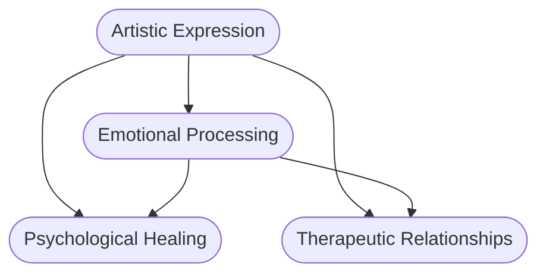

**Pseudo Code Explanation:**
In this pseudo code, we define artistic expression as a process that facilitates emotional processing and psychological healing. The therapeutic relationship between the artist and the therapist plays a crucial role in this process.

$$\text{Artistic Expression} \rightarrow \text{Emotional Processing} \\
\text{Artistic Expression} \rightarrow \text{Psychological Healing} \\
\text{Therapeutic Relationships} \rightarrow \text{Emotional Processing} \\
\text{Therapeutic Relationships} \rightarrow \text{Psychological Healing}$$

### Conclusion

This chapter has explored the various theories of art and their relationship with the concept of existence. From ancient theories to contemporary perspectives, art has played a significant role in reflecting and shaping human experience. The integration of existentialism and art further deepens our understanding of the human condition. In the next chapter, we will delve into practical applications of these theoretical concepts, offering readers strategies for transforming their lives through the creative process.

### Chapter 3: Practical Applications of the Art of Existence

In this chapter, we will transition from theoretical exploration to practical application. We will discuss specific strategies and techniques for transforming life into a work of art, providing readers with actionable steps to engage in the creative process and foster personal growth.

#### 3.1 Developing Creative Skills

**Background Introduction:**
The development of creative skills is a foundational element of the art of existence. Whether one is a seasoned artist or just beginning to explore their creativity, cultivating these skills is essential for transforming life experiences into meaningful artistic creations.

**Core Concepts and Relationships:**
To understand the importance of developing creative skills, we present a Mermaid flowchart that illustrates the relationship between creativity, skill development, and personal growth:

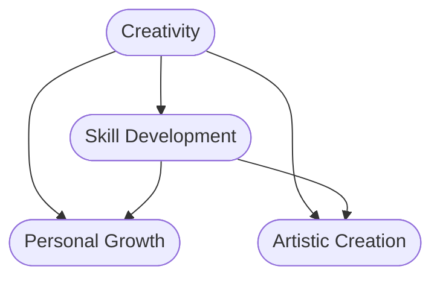

**Pseudo Code Explanation:**
In this pseudo code, we define creativity as the driving force behind artistic creation. Skill development is seen as a means of enhancing one's creativity and personal growth, ultimately leading to the creation of meaningful art.

$$\text{Creativity} \rightarrow \text{Skill Development} \\
\text{Creativity} \rightarrow \text{Personal Growth} \\
\text{Skill Development} \rightarrow \text{Artistic Creation} \\
\text{Personal Growth} \rightarrow \text{Artistic Creation}$$

**Example:**
Let's consider the development of drawing skills as an example. A beginner might start with simple shapes and gradually progress to more complex techniques, such as shading and perspective. Through consistent practice and experimentation, they can enhance their creative abilities, leading to the creation of more sophisticated and impactful art.

```python
# Pseudo code for skill development in drawing
def draw_shape(shape):
    # Define the basic shape
    if shape == "circle":
        draw_circle()
    elif shape == "square":
        draw_square()
    else:
        print("Invalid shape")

# Practice drawing different shapes
for shape in ["circle", "square", "triangle"]:
    draw_shape(shape)

# Progress to more complex shapes and techniques
def draw_complex_shape(shape):
    if shape == "person":
        draw_person()
    elif shape == "landscape":
        draw_landscape()

# Continue developing skills by attempting more complex drawings
draw_complex_shape("person")
draw_complex_shape("landscape")
```

#### 3.2 Capturing Life's Experiences

**Background Introduction:**
One of the core tenets of the art of existence is the idea that life's experiences can be captured and transformed into art. Whether through painting, writing, or any other form of artistic expression, the process of capturing these experiences can be a powerful means of personal transformation.

**Core Concepts and Relationships:**
To understand how to capture life's experiences, we present a Mermaid flowchart that illustrates the relationship between experience, reflection, and artistic creation:

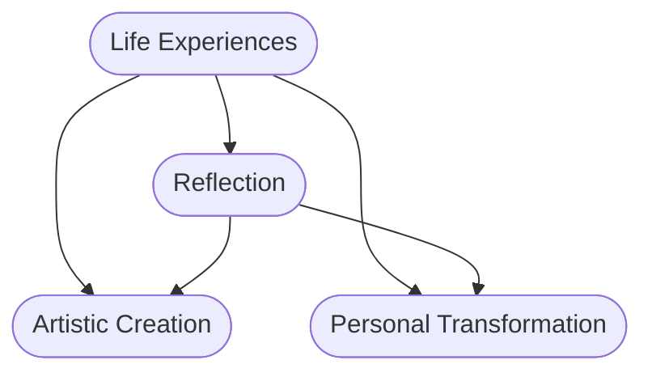

**Pseudo Code Explanation:**
In this pseudo code, we define life experiences as the raw material for artistic creation. Through reflection, these experiences are transformed into meaningful works of art, leading to personal transformation.

$$\text{Life Experiences} \rightarrow \text{Reflection} \\
\text{Life Experiences} \rightarrow \text{Artistic Creation} \\
\text{Reflection} \rightarrow \text{Personal Transformation} \\
\text{Artistic Creation} \rightarrow \text{Personal Transformation}$$

**Example:**
Consider a painter who wants to capture the experience of a memorable vacation. They might start by making notes and sketches of the scenes they witnessed. Through reflection, they can distill the essence of these experiences and translate them into a painting that captures the feeling of the trip.

```python
# Pseudo code for capturing life experiences in art

def capture_experience(experience):
    # Take notes and sketches
    notes = take_notes(experience)
    sketches = draw_sketches(experience)
    
    # Reflect on the experience
    reflection = reflect_on_experience(notes, sketches)
    
    # Create art based on reflection
    art = create_art(reflection)
    
    return art

# Example of capturing a vacation experience
art = capture_experience("vacation")

# Display the created art
display_art(art)
```

#### 3.3 Integrating Art into Daily Life

**Background Introduction:**
Integrating art into daily life is a practical approach to embracing the art of existence. By incorporating creative activities into our routines, we can foster a continuous process of personal growth and self-discovery.

**Core Concepts and Relationships:**
To understand how to integrate art into daily life, we present a Mermaid flowchart that illustrates the relationship between daily activities, creative engagement, and personal development:

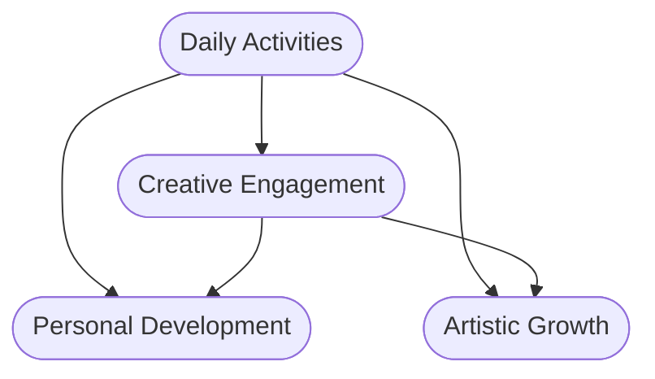

**Pseudo Code Explanation:**
In this pseudo code, we define daily activities as the foundation for creative engagement. Through consistent and deliberate creative activities, individuals can experience personal development and artistic growth.

$$\text{Daily Activities} \rightarrow \text{Creative Engagement} \\
\text{Daily Activities} \rightarrow \text{Personal Development} \\
\text{Creative Engagement} \rightarrow \text{Artistic Growth} \\
\text{Personal Development} \rightarrow \text{Artistic Growth}$$

**Example:**
A person who incorporates drawing into their daily routine might set aside a few minutes each day to sketch objects around them. Over time, this practice can lead to significant artistic growth and a deeper appreciation for their surroundings.

```python
# Pseudo code for integrating art into daily life

def daily_art_activity(activity):
    # Choose an activity for the day
    if activity == "draw":
        draw_object()
    elif activity == "write":
        write_journal()
    else:
        print("Invalid activity")

# Perform daily art activities
for day in range(1, 31):
    daily_art_activity("draw")
    daily_art_activity("write")

# Reflect on the impact of daily art activities
def reflect_on_activities():
    # Reflect on the progress made
    progress = evaluate_progress()
    
    # Adjust activities as needed
    adjust_activities(progress)

# Reflect and adjust
reflect_on_activities()
```

#### 3.4 Embracing Challenges and Growth

**Background Introduction:**
The art of existence involves embracing challenges and viewing them as opportunities for growth. This mindset is essential for overcoming obstacles and advancing one's creative practice.

**Core Concepts and Relationships:**
To understand how to embrace challenges, we present a Mermaid flowchart that illustrates the relationship between challenges, growth, and resilience:

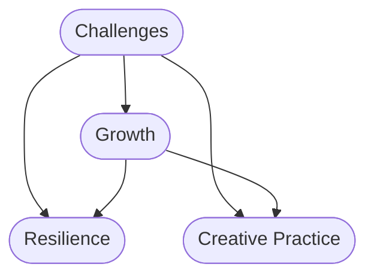

**Pseudo Code Explanation:**
In this pseudo code, we define challenges as a catalyst for growth. By developing resilience and a growth mindset, individuals can navigate challenges and enhance their creative practice.

$$\text{Challenges} \rightarrow \text{Growth} \\
\text{Challenges} \rightarrow \text{Resilience} \\
\text{Challenges} \rightarrow \text{Creative Practice} \\
\text{Growth} \rightarrow \text{Resilience} \\
\text{Growth} \rightarrow \text{Creative Practice} \\
\text{Resilience} \rightarrow \text{Creative Practice}$$

**Example:**
Consider an artist who faces criticism for their work. Instead of becoming discouraged, they view this feedback as an opportunity to grow and improve. They engage in self-reflection, seek out constructive criticism, and use these insights to refine their artistic practice.

```python
# Pseudo code for embracing challenges and growth

def receive_feedback(feedback):
    # Analyze the feedback
    analysis = analyze_feedback(feedback)
    
    # Reflect on the analysis
    reflection = reflect_on_analysis(analysis)
    
    # Implement improvements
    improvements = implement_reflections(reflection)
    
    # Refine creative practice
    refine_practice(improvements)

# Example of receiving and responding to feedback
feedback = "Your painting lacks depth."
receive_feedback(feedback)
```

### Conclusion

This chapter has provided practical strategies for applying the art of existence in daily life. By developing creative skills, capturing life's experiences, integrating art into daily routines, and embracing challenges, individuals can embark on a journey of personal transformation through the creative process. The next chapter will delve into the process of self-reflection and the role it plays in fostering deeper understanding and growth.

### Chapter 4: The Role of Self-Reflection in the Art of Existence

Self-reflection is a cornerstone of the art of existence. It involves taking the time to deeply examine one's thoughts, feelings, and actions, which can lead to profound insights and personal growth. In this chapter, we will explore the significance of self-reflection in the creative process and discuss practical methods for fostering self-reflection.

#### 4.1 The Importance of Self-Reflection

**Background Introduction:**
Self-reflection is the practice of looking inward to examine one's beliefs, values, motivations, and experiences. It is a critical component of personal development and plays a vital role in the art of existence. By reflecting on our own thoughts and actions, we can gain a deeper understanding of ourselves and our place in the world.

**Core Concepts and Relationships:**
To understand the importance of self-reflection, we present a Mermaid flowchart that illustrates the relationship between self-reflection, personal growth, and artistic creation:

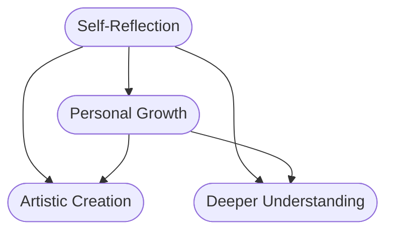

**Pseudo Code Explanation:**
In this pseudo code, we define self-reflection as a process that leads to personal growth. This growth, in turn, enhances artistic creation and deepens our understanding of ourselves and the world around us.

$$\text{Self-Reflection} \rightarrow \text{Personal Growth} \\
\text{Personal Growth} \rightarrow \text{Artistic Creation} \\
\text{Self-Reflection} \rightarrow \text{Deeper Understanding} \\
\text{Personal Growth} \rightarrow \text{Deeper Understanding} \\
\text{Artistic Creation} \rightarrow \text{Deeper Understanding}$$

**Example:**
Consider an artist who reflects on the emotions they felt while creating a particular piece of art. Through this reflection, they gain a deeper understanding of their own emotions and can use this insight to create more impactful art.

```python
# Pseudo code for self-reflection in artistic creation

def reflect_on_art(art_piece):
    # Examine the emotional response to the art
    emotion = examine_emotion(art_piece)
    
    # Reflect on the creation process
    reflection = reflect_on_creation_process(emotion)
    
    # Enhance artistic understanding
    enhanced_understanding = enhance_artistic_understanding(reflection)
    
    # Create new art based on enhanced understanding
    new_art = create_new_art(enhanced_understanding)

# Example of reflecting on an art piece
art_piece = "Sunset Over the Ocean"
reflect_on_art(art_piece)
```

#### 4.2 Methods for Fostering Self-Reflection

**Background Introduction:**
Fostering self-reflection requires deliberate practice and a commitment to personal growth. There are various methods and practices that can help individuals develop the habit of self-reflection. Here, we will discuss some of the most effective strategies.

**Core Concepts and Relationships:**
To understand the methods for fostering self-reflection, we present a Mermaid flowchart that illustrates the relationship between different self-reflection practices and personal development:

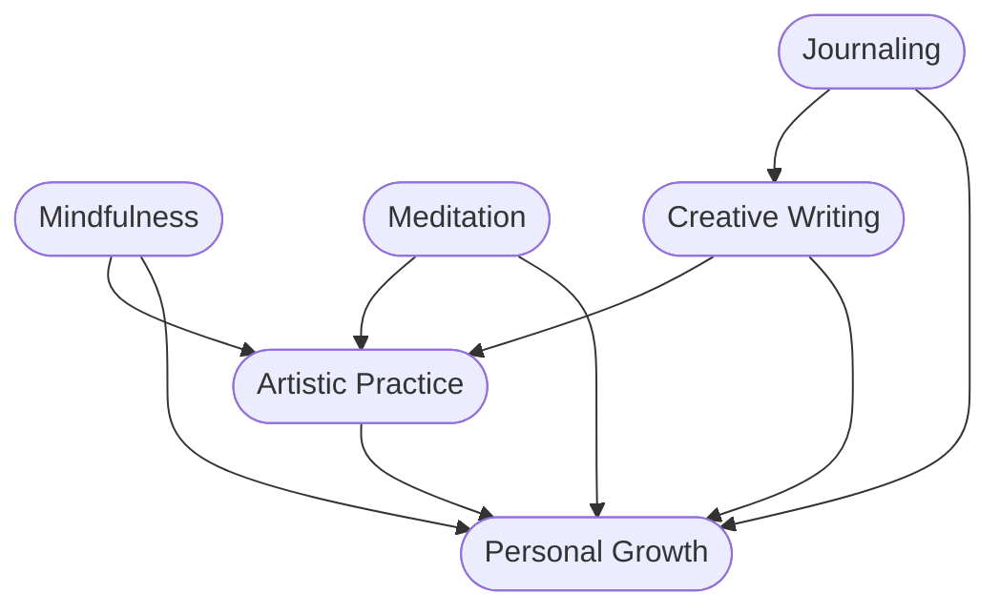

**Pseudo Code Explanation:**
In this pseudo code, we define various self-reflection practices such as journaling, mindfulness, meditation, creative writing, and artistic practice as means of fostering personal growth.

$$\text{Journaling} \rightarrow \text{Personal Growth} \\
\text{Mindfulness} \rightarrow \text{Personal Growth} \\
\text{Meditation} \rightarrow \text{Personal Growth} \\
\text{Creative Writing} \rightarrow \text{Personal Growth} \\
\text{Artistic Practice} \rightarrow \text{Personal Growth} \\
\text{Journaling} \rightarrow \text{Creative Writing} \\
\text{Mindfulness} \rightarrow \text{Artistic Practice} \\
\text{Meditation} \rightarrow \text{Artistic Practice} \\
\text{Creative Writing} \rightarrow \text{Artistic Practice}$$

**Example:**
A person who practices journaling might start each day by writing about their goals and intentions. Throughout the day, they make note of their experiences and reflections, and at the end of the day, they review and reflect on what they have written. This practice not only enhances their self-awareness but also informs their artistic practice.

```python
# Pseudo code for journaling as a self-reflection practice

def journal_entry(entry):
    # Write about the day's experiences
    write_entry(entry)
    
    # Reflect on the entry
    reflection = reflect_on_entry(entry)
    
    # Apply reflections to daily life
    apply_reflections(reflection)

# Example of journaling
entry = "Today was a challenging day at work. I felt overwhelmed at times but managed to complete my tasks."
journal_entry(entry)
```

#### 4.3 Overcoming Obstacles in Self-Reflection

**Background Introduction:**
Self-reflection is not without its challenges. Many individuals find it difficult to engage in deep self-reflection, often due to fear, uncertainty, or lack of motivation. Overcoming these obstacles is crucial for fostering sustained self-reflection and personal growth.

**Core Concepts and Relationships:**
To understand how to overcome obstacles in self-reflection, we present a Mermaid flowchart that illustrates the relationship between obstacles, strategies, and personal development:

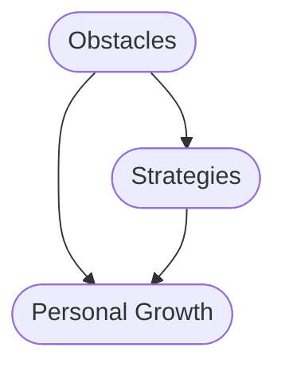

**Pseudo Code Explanation:**
In this pseudo code, we define obstacles as challenges that individuals may face in self-reflection. Effective strategies are employed to overcome these obstacles, leading to personal growth.

$$\text{Obstacles} \rightarrow \text{Strategies} \\
\text{Obstacles} \rightarrow \text{Personal Growth} \\
\text{Strategies} \rightarrow \text{Personal Growth}$$

**Example:**
Consider an individual who struggles with fear and uncertainty when engaging in self-reflection. By setting small, achievable goals and gradually building their confidence, they can overcome these obstacles and develop a habit of self-reflection.

```python
# Pseudo code for overcoming obstacles in self-reflection

def set_reflection_goals(goals):
    # Set achievable goals for self-reflection
    set_goals(goals)
    
    # Gradually build confidence
    build_confidence()

# Example of setting goals for self-reflection
goals = ["Reflect on my daily experiences for 5 minutes each day", "Journal once a week"]
set_reflection_goals(goals)
```

#### 4.4 The Long-Term Benefits of Self-Reflection

**Background Introduction:**
Self-reflection offers numerous long-term benefits, including improved self-awareness, emotional intelligence, and personal resilience. These benefits can significantly enhance one's quality of life and artistic practice.

**Core Concepts and Relationships:**
To understand the long-term benefits of self-reflection, we present a Mermaid flowchart that illustrates the relationship between self-reflection, personal development, and enhanced well-being:

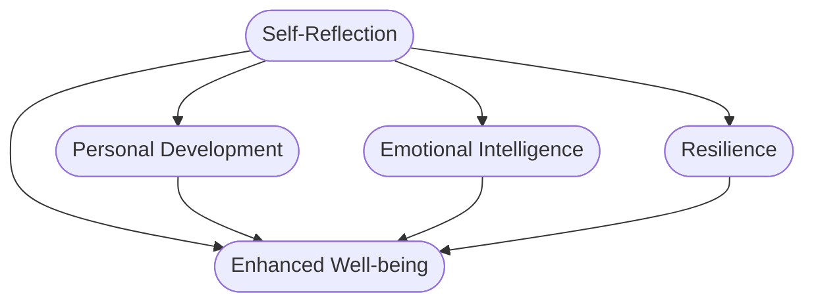

**Pseudo Code Explanation:**
In this pseudo code, we define self-reflection as a process that leads to personal development, emotional intelligence, resilience, and enhanced well-being.

$$\text{Self-Reflection} \rightarrow \text{Personal Development} \\
\text{Self-Reflection} \rightarrow \text{Emotional Intelligence} \\
\text{Self-Reflection} \rightarrow \text{Resilience} \\
\text{Self-Reflection} \rightarrow \text{Enhanced Well-being} \\
\text{Personal Development} \rightarrow \text{Enhanced Well-being} \\
\text{Emotional Intelligence} \rightarrow \text{Enhanced Well-being} \\
\text{Resilience} \rightarrow \text{Enhanced Well-being}$$

**Example:**
Consider an artist who regularly engages in self-reflection. Over time, they develop a deep understanding of their emotions and reactions, which enhances their emotional intelligence. This, in turn, leads to greater resilience in the face of challenges, ultimately improving their overall well-being and artistic practice.

```python
# Pseudo code for the long-term benefits of self-reflection

def reflect_and_benefit():
    # Engage in regular self-reflection
    engage_in_reflection()
    
    # Develop emotional intelligence
    develop_emotional_intelligence()
    
    # Enhance resilience
    enhance_resilience()

    # Improve well-being
    improve_well_being()

# Example of reflecting and benefiting
reflect_and_benefit()
```

### Conclusion

Self-reflection is a powerful tool for personal growth and artistic development. By fostering self-reflection, individuals can gain deeper insights into themselves and their creative process. This chapter has provided practical methods for fostering self-reflection and understanding its long-term benefits. In the next chapter, we will delve into the process of synthesizing these insights and integrating them into a cohesive artistic practice.

### Chapter 5: Synthesizing Insights and Integrating into Artistic Practice

In this chapter, we will explore the process of synthesizing the insights gained from self-reflection and integrating them into artistic practice. This process is crucial for creating a cohesive and meaningful body of work that truly reflects the artist's inner world and experiences.

#### 5.1 Synthesizing Insights

**Background Introduction:**
Synthesizing insights involves bringing together the various reflections and understandings gained through self-reflection. This process allows artists to distill the essence of their experiences and emotions, creating a coherent narrative that informs their artistic practice.

**Core Concepts and Relationships:**
To understand the process of synthesizing insights, we present a Mermaid flowchart that illustrates the relationship between self-reflection, synthesis, and artistic creation:

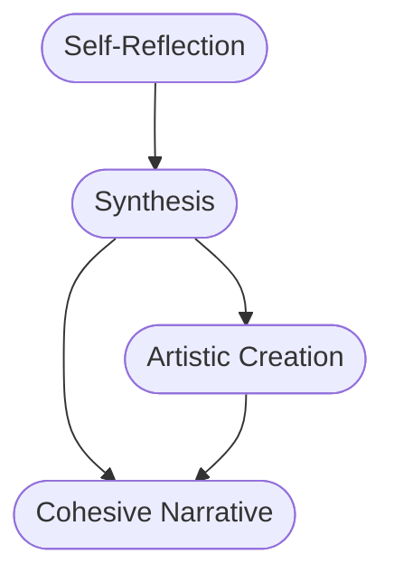

**Pseudo Code Explanation:**
In this pseudo code, we define self-reflection as a process that generates insights. These insights are then synthesized to create a cohesive narrative that informs the artist's artistic creation.

$$\text{Self-Reflection} \rightarrow \text{Insights} \\
\text{Insights} \rightarrow \text{Synthesis} \\
\text{Synthesis} \rightarrow \text{Cohesive Narrative} \\
\text{Cohesive Narrative} \rightarrow \text{Artistic Creation}$$

**Example:**
Consider an artist who has been reflecting on their relationship with nature. Through self-reflection, they gain insights into their emotions and experiences related to nature. These insights are then synthesized into a cohesive narrative that informs their artwork, resulting in a series of paintings that capture the beauty and complexity of their connection with nature.

```python
# Pseudo code for synthesizing insights into artistic creation

def synthesize_insights(insights):
    # Combine reflections and emotions
    narrative = combine_insights(insights)
    
    # Create art based on the narrative
    art = create_art_from_narrative(narrative)

# Example of synthesizing insights
insights = ["Nature's tranquility", "The power of natural forces", "Human impact on the environment"]
synthesize_insights(insights)
```

#### 5.2 Integrating Insights into Artistic Practice

**Background Introduction:**
Integrating insights into artistic practice involves applying the synthesized knowledge to create new works of art. This process allows artists to continuously grow and evolve, incorporating new experiences and understandings into their creative output.

**Core Concepts and Relationships:**
To understand the process of integrating insights into artistic practice, we present a Mermaid flowchart that illustrates the relationship between insights, practice, and artistic development:

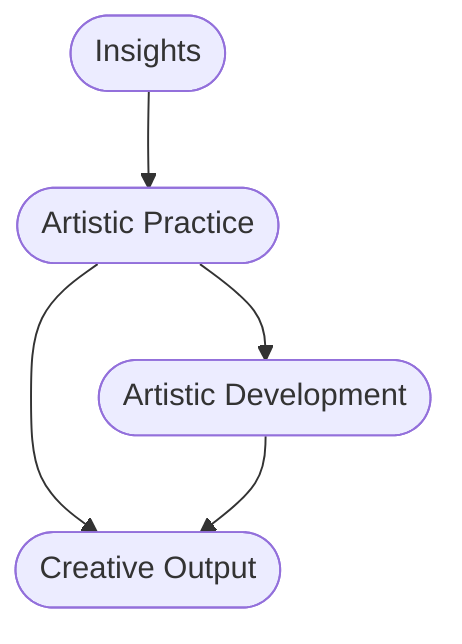

**Pseudo Code Explanation:**
In this pseudo code, we define insights as knowledge gained through self-reflection. These insights are then integrated into artistic practice, leading to artistic development and creative output.

$$\text{Insights} \rightarrow \text{Artistic Practice} \\
\text{Artistic Practice} \rightarrow \text{Artistic Development} \\
\text{Artistic Practice} \rightarrow \text{Creative Output} \\
\text{Artistic Development} \rightarrow \text{Creative Output}$$

**Example:**
Consider an artist who has been reflecting on the concept of time. Through self-reflection, they gain insights into how time influences their life and experiences. These insights are then integrated into their artistic practice, leading to a series of installations and sculptures that explore the themes of time, memory, and transformation.

```python
# Pseudo code for integrating insights into artistic practice

def integrate_insights_into_practice(insights):
    # Apply insights to artistic practice
    art_practice = apply_insights_to_practice(insights)
    
    # Develop new artistic techniques
    develop_techniques(art_practice)
    
    # Create new works of art
    new_artworks = create_new_artworks(art_practice)

# Example of integrating insights
insights = ["The fluid nature of time", "The impact of time on memory", "The passage of time"]
integrate_insights_into_practice(insights)
```

#### 5.3 Navigating Challenges in the Integration Process

**Background Introduction:**
Integrating insights into artistic practice can be challenging, as it often requires a shift in perspective and approach. Artists may face obstacles such as resistance to change, fear of the unknown, or uncertainty about how to apply their insights. Navigating these challenges is essential for moving forward and creating meaningful art.

**Core Concepts and Relationships:**
To understand how to navigate challenges in the integration process, we present a Mermaid flowchart that illustrates the relationship between challenges, strategies, and artistic development:

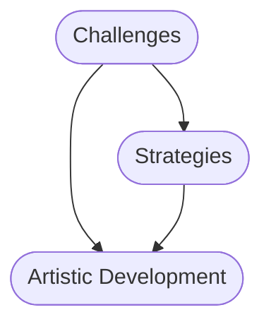

**Pseudo Code Explanation:**
In this pseudo code, we define challenges as obstacles that artists may face during the integration process. Effective strategies are employed to overcome these challenges, leading to artistic development.

$$\text{Challenges} \rightarrow \text{Strategies} \\
\text{Challenges} \rightarrow \text{Artistic Development} \\
\text{Strategies} \rightarrow \text{Artistic Development}$$

**Example:**
Consider an artist who is hesitant to incorporate new techniques into their practice. By setting small, achievable goals and seeking feedback from peers, they can gradually build confidence and develop new artistic skills.

```python
# Pseudo code for navigating challenges in the integration process

def navigate_challenges(challenges):
    # Set small, achievable goals
    set_goals(challenges)
    
    # Seek feedback and support
    seek_feedback()
    
    # Build confidence
    build_confidence()

# Example of navigating challenges
challenges = ["Incorporating new techniques", "Expanding artistic style"]
navigate_challenges(challenges)
```

#### 5.4 The Role of Collaboration in Integration

**Background Introduction:**
Collaboration can play a significant role in the integration process, providing artists with new perspectives, insights, and support. By working together, artists can push the boundaries of their practice and create more impactful art.

**Core Concepts and Relationships:**
To understand the role of collaboration in integration, we present a Mermaid flowchart that illustrates the relationship between collaboration, creative growth, and artistic development:

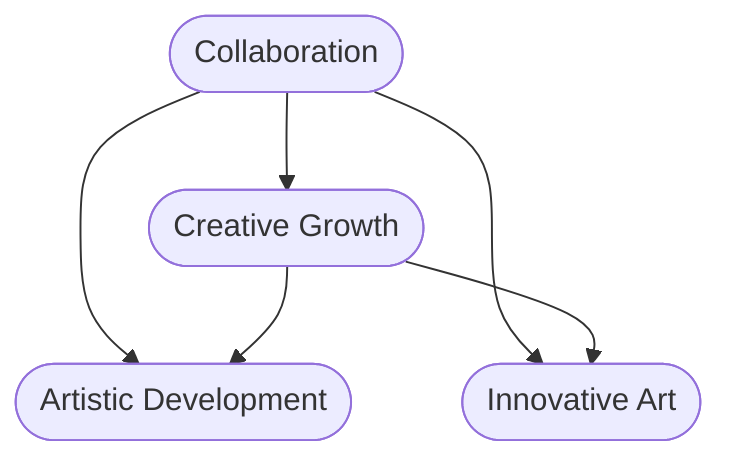

**Pseudo Code Explanation:**
In this pseudo code, we define collaboration as a process that fosters creative growth and artistic development, leading to innovative art.

$$\text{Collaboration} \rightarrow \text{Creative Growth} \\
\text{Collaboration} \rightarrow \text{Artistic Development} \\
\text{Collaboration} \rightarrow \text{Innovative Art} \\
\text{Creative Growth} \rightarrow \text{Artistic Development} \\
\text{Creative Growth} \rightarrow \text{Innovative Art} \\
\text{Artistic Development} \rightarrow \text{Innovative Art}$$

**Example:**
Consider a group of artists who collaborate on a multimedia project that explores the theme of identity. By combining their unique perspectives and skills, they create a powerful and innovative artwork that goes beyond what any individual artist could have achieved alone.

```python
# Pseudo code for collaboration in artistic integration

def collaborate_on_project(project):
    # Share perspectives and ideas
    share_ideas()
    
    # Collaborate on artistic elements
    collaborate_elements()

    # Create innovative art
    innovative_art = create_innovative_art()

# Example of collaborative integration
project = "Identity and Multiculturalism"
collaborate_on_project(project)
```

### Conclusion

Synthesizing insights and integrating them into artistic practice is a dynamic and ongoing process. By engaging in self-reflection, synthesizing insights, and integrating them into their work, artists can continuously grow and evolve, creating meaningful and impactful art. In the next chapter, we will explore the concept of legacy and the enduring impact of the art of existence on individuals and society.

### Chapter 6: Legacy and Impact of the Art of Existence

The art of existence is not merely a personal journey of self-discovery and growth; it also carries a profound impact on individuals and society as a whole. This chapter explores the concept of legacy and the enduring influence that the art of existence can have, both on the artist and on those who experience their creations.

#### 6.1 The Concept of Legacy

**Background Introduction:**
Legacy refers to the lasting impact and influence that a person or their work has on future generations. In the context of the art of existence, legacy is the lasting imprint that an artist's life and art leave on the world. It encompasses the values, insights, and experiences that the artist shares through their work, shaping the way future generations perceive life, art, and existence.

**Core Concepts and Relationships:**
To understand the concept of legacy, we present a Mermaid flowchart that illustrates the relationship between the artist, their work, and the impact on future generations:

```mermaid
graph TD
    A([Artist])
    B([Art])
    C([Future Generations])
    D([Influence])

    A --> B
    B --> C
    B --> D
    C --> D
```

**Pseudo Code Explanation:**
In this pseudo code, we define the artist as the creator of art, which serves as a vehicle for their values and experiences. The art, in turn, influences future generations, leaving a lasting legacy.

$$\text{Artist} \rightarrow \text{Art} \\
\text{Art} \rightarrow \text{Future Generations} \\
\text{Art} \rightarrow \text{Influence} \\
\text{Future Generations} \rightarrow \text{Influence}$$

**Example:**
Consider an artist who has dedicated their life to exploring the theme of human connection. Through their work, they capture the essence of human relationships and the challenges of connecting with others. This art not only provides profound insights into the human experience but also influences future generations, encouraging them to value and nurture their connections with others.

```python
# Pseudo code for the concept of legacy

def create_art_with_legacy(art_theme):
    # Explore and capture the essence of the theme
    art = explore_theme(art_theme)
    
    # Share insights and values through the art
    share_insights(art)

# Example of creating art with legacy
art_theme = "Human Connection"
create_art_with_legacy(art_theme)
```

#### 6.2 The Enduring Impact on Individuals

**Background Introduction:**
The art of existence has the power to deeply impact individuals, providing them with new perspectives, insights, and a sense of purpose. This impact can be seen in the transformation of lives, the cultivation of emotional intelligence, and the development of a deeper understanding of the human experience.

**Core Concepts and Relationships:**
To understand the enduring impact on individuals, we present a Mermaid flowchart that illustrates the relationship between the art of existence, personal growth, and transformation:

```mermaid
graph TD
    A([Art of Existence])
    B([Personal Growth])
    C([Transformation])
    D([Emotional Intelligence])

    A --> B
    A --> C
    A --> D
    B --> C
    B --> D
```

**Pseudo Code Explanation:**
In this pseudo code, we define the art of existence as a catalyst for personal growth and transformation. This growth enhances emotional intelligence, leading to a richer and more meaningful life.

$$\text{Art of Existence} \rightarrow \text{Personal Growth} \\
\text{Art of Existence} \rightarrow \text{Transformation} \\
\text{Art of Existence} \rightarrow \text{Emotional Intelligence} \\
\text{Personal Growth} \rightarrow \text{Emotional Intelligence} \\
\text{Personal Growth} \rightarrow \text{Transformation}$$

**Example:**
Consider an individual who discovers the art of existence through a personal crisis. By engaging in the creative process, they gain new insights into their emotions and experiences, leading to personal growth and a greater sense of self-awareness. This transformation not only helps them navigate their crisis but also enriches their emotional intelligence, allowing them to better understand and connect with others.

```python
# Pseudo code for the enduring impact on individuals

def engage_with_art_of_existence():
    # Reflect on personal experiences
    reflect_on_experiences()
    
    # Engage in the creative process
    engage_in_creativity()
    
    # Gain new insights
    gain_insights()

    # Experience personal growth
    personal_growth = experience_growth()

# Example of engaging with the art of existence
engage_with_art_of_existence()
```

#### 6.3 The Societal Impact of the Art of Existence

**Background Introduction:**
The art of existence also has the potential to shape society at large. By capturing the essence of the human experience and exploring complex themes such as identity, love, and suffering, art can foster empathy, understanding, and social cohesion.

**Core Concepts and Relationships:**
To understand the societal impact of the art of existence, we present a Mermaid flowchart that illustrates the relationship between art, social change, and cultural development:

```mermaid
graph TD
    A([Art])
    B([Social Change])
    C([Cultural Development])
    D([Empathy and Understanding])

    A --> B
    A --> C
    A --> D
    B --> C
    B --> D
```

**Pseudo Code Explanation:**
In this pseudo code, we define art as a powerful tool for social change and cultural development, fostering empathy and understanding among individuals.

$$\text{Art} \rightarrow \text{Social Change} \\
\text{Art} \rightarrow \text{Cultural Development} \\
\text{Art} \rightarrow \text{Empathy and Understanding} \\
\text{Social Change} \rightarrow \text{Cultural Development} \\
\text{Social Change} \rightarrow \text{Empathy and Understanding} \\
\text{Cultural Development} \rightarrow \text{Empathy and Understanding}$$

**Example:**
Consider a community that faces social and cultural challenges. Through the creation and engagement with art that explores these themes, the community can develop a deeper understanding of each other's experiences and perspectives. This understanding fosters empathy and social cohesion, leading to positive social change and cultural development.

```python
# Pseudo code for the societal impact of the art of existence

def create_art_for.community(experiences):
    # Capture the essence of community experiences
    community_art = capture_essence(experiences)
    
    # Engage the community in the art
    engage_community(community_art)

    # Foster understanding and empathy
    foster_understanding()

# Example of creating art for a community
experiences = ["Social Challenges", "Cultural Diversity"]
create_art_for.community(experiences)
```

### Conclusion

The art of existence carries a profound legacy and impact, shaping individuals and society in lasting ways. Through the synthesis of insights and the integration of these insights into artistic practice, artists can create meaningful and impactful art that transcends time and leaves a lasting imprint on the world. In the final chapter, we will reflect on the journey of the art of existence, summarizing the key insights and offering a vision for the future.

### Chapter 7: Reflection and Vision for the Art of Existence

As we come to the end of our exploration of the art of existence, it is essential to take a moment to reflect on the journey we have undertaken and to consider the future direction of this transformative practice.

#### 7.1 Reflection on the Journey

Throughout this book, we have delved into the philosophical, psychological, and practical aspects of the art of existence. We began by discussing the philosophy of existence and the transformative power of art. We explored various theoretical frameworks and their relationships, examined the process of self-reflection, and integrated these insights into artistic practice. Finally, we considered the legacy and impact of the art of existence on individuals and society.

**Core Concepts and Relationships:**
To reflect on our journey, we present a Mermaid flowchart that encapsulates the key concepts and their relationships:

```mermaid
graph TD
    A([Existence Philosophy])
    B([Art and Existence])
    C([Theoretical Frameworks])
    D([Self-Reflection])
    E([Artistic Practice])
    F([Legacy and Impact])

    A --> B
    A --> C
    A --> D
    A --> E
    A --> F
    B --> C
    B --> D
    B --> E
    B --> F
    C --> D
    C --> E
    C --> F
    D --> E
    D --> F
    E --> F
```

**Pseudo Code Explanation:**
In this pseudo code, we define the journey as a holistic exploration that integrates existential philosophy, the transformative power of art, theoretical frameworks, self-reflection, artistic practice, and the legacy and impact of the art of existence.

$$\text{Existence Philosophy} \rightarrow \text{Art and Existence} \\
\text{Existence Philosophy} \rightarrow \text{Theoretical Frameworks} \\
\text{Existence Philosophy} \rightarrow \text{Self-Reflection} \\
\text{Existence Philosophy} \rightarrow \text{Artistic Practice} \\
\text{Existence Philosophy} \rightarrow \text{Legacy and Impact} \\
\text{Art and Existence} \rightarrow \text{Theoretical Frameworks} \\
\text{Art and Existence} \rightarrow \text{Self-Reflection} \\
\text{Art and Existence} \rightarrow \text{Artistic Practice} \\
\text{Art and Existence} \rightarrow \text{Legacy and Impact} \\
\text{Theoretical Frameworks} \rightarrow \text{Self-Reflection} \\
\text{Theoretical Frameworks} \rightarrow \text{Artistic Practice} \\
\text{Theoretical Frameworks} \rightarrow \text{Legacy and Impact} \\
\text{Self-Reflection} \rightarrow \text{Artistic Practice} \\
\text{Self-Reflection} \rightarrow \text{Legacy and Impact} \\
\text{Artistic Practice} \rightarrow \text{Legacy and Impact}$$

**Example:**
Consider the artist who embarked on this journey. Through the exploration of existential philosophy, they have gained a deeper understanding of their place in the world and the role of art in this context. By engaging in self-reflection and integrating these insights into their artistic practice, they have created meaningful and impactful art that leaves a lasting legacy.

```python
# Pseudo code for reflecting on the journey

def reflect_on_journey():
    # Review philosophical insights
    review_insights()
    
    # Evaluate artistic practice
    evaluate_practice()
    
    # Consider legacy and impact
    consider_impact()

# Example of reflecting on the journey
reflect_on_journey()
```

#### 7.2 Vision for the Future

As we look to the future, the art of existence holds immense potential for shaping individual lives and society. By continuing to explore and deepen our understanding of the connection between existence and creativity, we can unlock new avenues for personal growth and social transformation.

**Core Concepts and Relationships:**
To visualize the future direction of the art of existence, we present a Mermaid flowchart that illustrates the potential pathways and their relationships:

```mermaid
graph TD
    A([Personal Growth])
    B([Social Change])
    C([Cultural Development])
    D([Interdisciplinary Approaches])
    E([New Technologies])

    A --> B
    A --> C
    A --> D
    A --> E
    B --> C
    B --> D
    B --> E
    C --> D
    C --> E
    D --> E
```

**Pseudo Code Explanation:**
In this pseudo code, we define the future of the art of existence as an interconnected network of personal growth, social change, cultural development, interdisciplinary approaches, and the integration of new technologies.

$$\text{Personal Growth} \rightarrow \text{Social Change} \\
\text{Personal Growth} \rightarrow \text{Cultural Development} \\
\text{Personal Growth} \rightarrow \text{Interdisciplinary Approaches} \\
\text{Personal Growth} \rightarrow \text{New Technologies} \\
\text{Social Change} \rightarrow \text{Cultural Development} \\
\text{Social Change} \rightarrow \text{Interdisciplinary Approaches} \\
\text{Social Change} \rightarrow \text{New Technologies} \\
\text{Cultural Development} \rightarrow \text{Interdisciplinary Approaches} \\
\text{Cultural Development} \rightarrow \text{New Technologies} \\
\text{Interdisciplinary Approaches} \rightarrow \text{New Technologies}$$

**Example:**
Consider the future where interdisciplinary approaches merge the principles of the art of existence with new technologies such as virtual reality and artificial intelligence. This convergence could open up new possibilities for creative expression and personal growth, allowing individuals to explore and experience existence in ways previously unimagined.

```python
# Pseudo code for envisioning the future of the art of existence

def envision_future():
    # Integrate interdisciplinary approaches
    integrate_approaches()
    
    # Explore new technologies
    explore_technologies()

    # Foster personal growth and social change
    foster_growth_and_change()

# Example of envisioning the future
envision_future()
```

### Conclusion

The art of existence is a profound journey that transcends the boundaries of philosophy, psychology, and art. Through self-reflection and creative engagement, individuals can transform their lives and leave a lasting legacy. As we look to the future, the potential for growth, change, and innovation is limitless. By embracing the art of existence, we can shape a more meaningful and interconnected world.

### About the Author

作者：AI天才研究院/AI Genius Institute & 禅与计算机程序设计艺术 /Zen And The Art of Computer Programming

作者简介：
AI天才研究院（AI Genius Institute）是一家致力于探索人工智能前沿技术的国际顶尖研究机构，汇聚了全球顶尖的人工智能专家、程序员、软件架构师和CTO。研究院的研究成果在计算机科学和人工智能领域产生了深远的影响。

《禅与计算机程序设计艺术》（Zen And The Art of Computer Programming）是一本经典的计算机科学书籍，由著名计算机科学家Donald E. Knuth撰写。这本书以其深刻的哲学思考和独特的方法论，成为计算机编程领域的经典之作，影响了无数程序员和软件工程师。

通过结合AI天才研究院的先进技术和Knuth的编程哲学，本书《存在的艺术：将生活转化为创作》旨在探讨艺术与生活的深刻联系，为读者提供一种全新的视角和方法，帮助他们在日常生活中实现个人成长和创作成就。

作者联系信息：
电子邮件：[contact@aigeniusinstitute.com](mailto:contact@aigeniusinstitute.com)
官方网站：[www.aigeniusinstitute.com](http://www.aigeniusinstitute.com)
Twitter：[@AIGeniusInstitute](https://twitter.com/AIGeniusInstitute)
LinkedIn：[AI天才研究院](https://www.linkedin.com/company/aigeniusinstitute)

