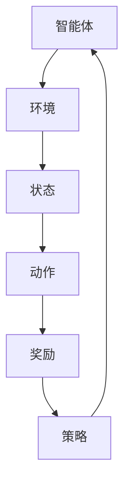
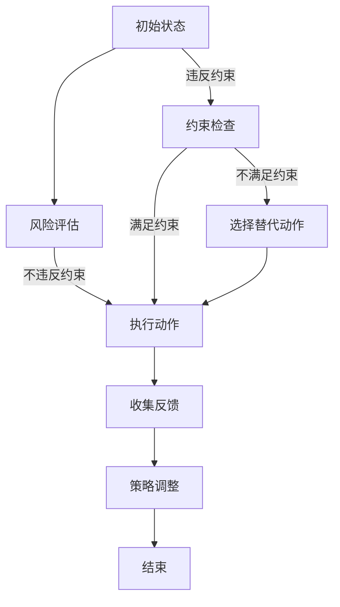

                 


### 第1章: 强化学习基础

#### 1.1 强化学习的定义与核心概念

强化学习（Reinforcement Learning，简称RL）是机器学习的一个分支，它模拟人类行为的学习过程，通过智能体（agent）在与环境的交互中学习最优策略。在强化学习中，智能体不断尝试并执行动作（action），从环境中获得反馈，这些反馈以奖励（reward）的形式表现出来。智能体的目标是最大化累积奖励。

强化学习的基本概念包括：

- **智能体（Agent）**：执行动作并接收环境反馈的实体。
- **环境（Environment）**：智能体所处的环境，可以看作一个状态空间，每个状态都有可能发生的一系列动作。
- **状态（State）**：智能体在特定时间点的环境描述。
- **动作（Action）**：智能体可以执行的行为。
- **奖励（Reward）**：对智能体当前动作的即时反馈，用于指导智能体的学习。
- **策略（Policy）**：智能体在特定状态下执行的动作选择。

一个简单的强化学习过程可以概括为以下步骤：

1. **智能体选择动作**：根据当前状态，智能体使用策略选择一个动作。
2. **环境执行动作**：环境根据智能体的动作改变状态，并返回新的状态和奖励。
3. **智能体更新状态**：智能体接收新的状态和奖励，更新其内部模型。
4. **重复步骤**：智能体继续在环境中进行互动，直到达到目标状态或最大时间步数。

在强化学习过程中，智能体通过不断尝试和反馈，逐渐优化其策略，以达到最大化累积奖励的目标。这个过程可以通过以下数学公式表示：

$$
R_t = R(s_t, a_t)
$$

其中，$R_t$表示在时间步$t$获得的即时奖励，$s_t$表示在时间步$t$的状态，$a_t$表示在时间步$t$所采取的动作。

#### 1.2 强化学习与传统机器学习的区别

强化学习与传统机器学习在数据依赖性、学习方式和学习目标等方面存在显著区别：

- **数据依赖性**：传统机器学习依赖于大量标记数据来训练模型，而强化学习则依赖于与环境的交互来获取反馈，从而学习最优策略。
- **学习方式**：传统机器学习通过学习输入和输出之间的映射关系来训练模型，而强化学习通过试错（trial-and-error）的方式，不断调整策略，以实现最优行为。
- **学习目标**：传统机器学习的目标是预测或分类，而强化学习的目标是最大化累积奖励。

#### 1.3 强化学习的基本架构与流程

强化学习的基本架构包括智能体、环境、状态、动作和奖励。其基本流程如下：

1. **初始化**：智能体和环境初始化，设定初始状态。
2. **选择动作**：智能体根据当前状态，使用策略选择一个动作。
3. **执行动作**：环境根据智能体的动作改变状态，并返回新的状态和奖励。
4. **更新状态**：智能体接收新的状态和奖励，更新其内部模型。
5. **重复步骤**：智能体继续在环境中进行互动，直到达到目标状态或最大时间步数。

通过不断迭代上述步骤，智能体可以逐渐优化其策略，实现最大化累积奖励的目标。

#### 1.4 强化学习的常见问题与挑战

强化学习在应用过程中面临许多挑战：

- **奖励函数设计**：设计合适的奖励函数对强化学习至关重要，但往往非常困难。
- **探索与利用的平衡**：在强化学习过程中，如何平衡探索新动作和利用已有知识是一个重要问题。
- **长期奖励与短期奖励的权衡**：智能体需要在长期和短期奖励之间做出权衡。
- **收敛速度**：某些强化学习算法可能需要很长时间才能收敛到最优策略。
- **可解释性**：强化学习模型通常难以解释，导致其应用受到限制。

### 第2章: 安全强化学习原理

#### 2.1 安全强化学习的定义

安全强化学习（Safe Reinforcement Learning）是强化学习的一个分支，其主要目标是在保证安全性的前提下，学习最优策略。在安全强化学习中，不仅关注累积奖励的最大化，还关注系统的安全性。

#### 2.2 安全强化学习的核心目标

安全强化学习的核心目标包括：

- **最大化累积奖励**：与常规强化学习相同，安全强化学习也追求最大化累积奖励。
- **保证系统安全性**：在策略学习过程中，确保系统不会因意外行为而导致故障或失败。

#### 2.3 安全强化学习的挑战与解决方案

安全强化学习面临以下挑战：

- **风险评估**：如何准确评估环境中的风险，以便在策略学习中加以考虑。
- **约束处理**：如何处理各种约束，确保策略在约束条件下仍然有效。
- **安全性验证**：如何验证学习到的策略在实际运行中是安全的。

针对这些挑战，安全强化学习提出了一系列解决方案：

- **风险感知机制**：通过监测和评估环境中的风险，智能体可以调整其行为以降低风险。
- **约束优化算法**：结合约束处理机制，智能体可以在满足约束的前提下学习最优策略。
- **安全性验证方法**：通过模拟和验证，确保学习到的策略在实际运行中是安全的。

#### 2.4 安全强化学习的核心概念联系

为了更好地理解安全强化学习的核心概念，我们可以通过Mermaid流程图来展示它们之间的联系。



在这个流程图中，智能体与环境、状态、动作、奖励和策略之间形成了闭环，通过不断迭代，智能体逐渐优化其策略，以实现最大化累积奖励和系统安全性的目标。

### 第3章: 安全强化学习算法

#### 3.1 基于Q学习的安全强化学习算法

Q学习（Q-Learning）是强化学习中最基本和常用的算法之一，其核心思想是通过学习Q值（状态-动作值函数）来指导智能体的行动。在安全强化学习中，Q学习也被广泛应用。

#### 3.1.1 Q学习基本原理

Q学习算法的基本原理是：智能体通过不断尝试和更新Q值，以找到最优策略。Q值表示在特定状态下执行特定动作所能获得的累积奖励。

Q学习算法的主要步骤如下：

1. **初始化Q值表**：初始化Q值表，通常使用小值初始化。
2. **选择动作**：根据当前状态和策略选择动作。
3. **执行动作**：执行动作，并接收环境反馈，包括新的状态和奖励。
4. **更新Q值**：根据新的状态、动作和奖励，更新Q值。
5. **重复步骤**：重复步骤2-4，直到满足停止条件。

Q值的更新公式如下：

$$
Q(s, a) \leftarrow Q(s, a) + \alpha [R(s, a) + \gamma \max_{a'} Q(s', a') - Q(s, a)]
$$

其中，$Q(s, a)$表示在状态$s$下执行动作$a$的Q值，$R(s, a)$表示在状态$s$下执行动作$a$所获得的即时奖励，$s'$表示新的状态，$a'$表示在状态$s'$下执行的动作，$\alpha$是学习率，$\gamma$是折扣因子。

#### 3.1.2 安全性考虑

在安全强化学习中，Q学习算法的安全性考虑主要包括以下几个方面：

- **风险感知**：智能体在执行动作前，需要评估当前动作可能带来的风险，以降低潜在的风险。
- **约束处理**：智能体需要满足一定的约束条件，如遵守特定的安全规则或遵守物理定律。
- **安全性验证**：智能体在执行动作后，需要对策略进行安全性验证，以确保策略在实际运行中是安全的。

#### 3.2 基于策略搜索的安全强化学习算法

基于策略搜索的安全强化学习算法（Policy Search）通过直接优化策略，而不是通过学习Q值，来实现安全强化学习。这类算法包括演员-评论家（Actor-Critic）算法、策略梯度算法等。

#### 3.2.1 演员-评论家算法

演员-评论家算法是一种典型的策略搜索算法，其核心思想是同时优化策略（演员）和价值估计（评论家）。

1. **初始化**：初始化策略参数和值函数参数。
2. **演员**：根据当前策略生成一个动作序列，并在环境中执行。
3. **评论家**：评估动作序列的累积奖励，更新值函数参数。
4. **策略迭代**：根据更新后的值函数，调整策略参数。
5. **重复步骤**：重复步骤2-4，直到策略收敛。

#### 3.2.2 策略梯度算法

策略梯度算法通过直接计算策略梯度的方向来更新策略参数，以优化策略。

1. **初始化**：初始化策略参数。
2. **选择动作**：根据当前策略选择动作。
3. **执行动作**：执行动作，并接收环境反馈。
4. **计算梯度**：计算策略梯度的方向。
5. **更新策略**：根据梯度更新策略参数。
6. **重复步骤**：重复步骤2-5，直到策略收敛。

#### 3.3 基于模型学习的安全强化学习算法

基于模型学习的安全强化学习算法通过学习环境模型来预测状态转移和奖励，从而优化策略。

1. **初始化**：初始化环境模型和策略。
2. **模型学习**：通过收集环境数据，学习环境模型。
3. **预测状态转移和奖励**：使用学习到的环境模型，预测在特定状态下执行特定动作后的新状态和奖励。
4. **策略优化**：根据预测结果，优化策略参数。
5. **重复步骤**：重复步骤2-4，直到策略收敛。

#### 3.4 安全强化学习算法的伪代码

以下是一个简单的安全强化学习算法的伪代码示例，展示了基于Q学习和策略搜索的算法框架。

```python
# 初始化Q值表
Q = 初始化Q值表()

# 初始化策略参数
策略参数 = 初始化策略参数()

# 基于Q学习的安全强化学习
while 没有停止条件：
    # 选择动作
    a = 选择动作(Q, 状态)

    # 执行动作
    新状态，奖励 = 环境执行动作(a)

    # 更新Q值
    Q[状态, a] = Q[状态, a] + 学习率 * (奖励 + 折扣因子 * 最大Q值 - Q[状态, a])

    # 更新策略
    策略参数 = 策略优化(策略参数, Q)

# 基于策略搜索的安全强化学习
while 没有停止条件：
    # 演员部分
    动作序列 = 演员策略(策略参数)

    # 评论家部分
    值函数 = 评论家评估(动作序列, 环境模型)

    # 更新策略
    策略参数 = 策略优化(策略参数, 值函数)

# 基于模型学习的安全强化学习
while 没有停止条件：
    # 模型学习
    环境模型 = 模型学习(状态，动作，奖励)

    # 预测状态转移和奖励
    新状态，奖励 = 环境模型预测(状态，动作)

    # 更新策略
    策略参数 = 策略优化(策略参数, 新状态，奖励)
```

### 第4章: 风险感知与约束探索

#### 4.1 风险感知在安全强化学习中的应用

风险感知是安全强化学习中的一个关键概念，它旨在使智能体能够识别并响应环境中的潜在风险。在安全强化学习中，风险感知的应用主要体现在以下几个方面：

- **风险评估**：智能体需要能够评估每个动作可能带来的风险，以便在执行动作前做出更安全的决策。
- **动态调整策略**：根据环境中的风险变化，智能体需要能够动态调整其策略，以减少风险。
- **决策支持**：风险感知机制可以提供决策支持，帮助智能体在不确定的环境中做出更安全的决策。

#### 4.2 约束探索的核心概念

约束探索是安全强化学习中的另一个关键概念，它关注如何在不违反约束条件的情况下，探索和优化策略。约束探索的核心概念包括：

- **约束定义**：明确系统需要遵守的约束条件，如物理定律、安全规则等。
- **约束处理**：设计算法，确保智能体在策略学习过程中不会违反约束条件。
- **约束优化**：在满足约束的前提下，优化策略，以提高系统性能。

#### 4.3 风险感知与约束探索的交互机制

风险感知与约束探索之间的交互机制对于安全强化学习至关重要。以下是一个简单的交互机制框架：

1. **风险评估**：智能体在执行动作前，评估每个动作可能带来的风险。
2. **约束检查**：智能体检查所选动作是否违反任何约束条件。
3. **决策**：如果动作不违反约束条件，智能体执行该动作；否则，智能体选择一个满足约束条件且风险较低的替代动作。
4. **反馈与学习**：智能体在执行动作后，收集反馈，并根据反馈调整其策略。

#### 4.4 风险感知与约束探索的Mermaid流程图

为了更好地理解风险感知与约束探索的交互机制，我们可以使用Mermaid流程图来展示这个过程。



在这个流程图中，智能体首先进行风险评估，然后检查所选动作是否违反约束。如果动作不违反约束，智能体执行该动作；否则，智能体选择一个满足约束条件的替代动作。在执行动作后，智能体收集反馈，并根据反馈调整其策略。

### 第5章: 安全强化学习应用案例分析

#### 5.1 安全强化学习在网络安全中的应用

网络安全是安全强化学习的一个重要应用领域。通过安全强化学习，智能体可以在不断变化的网络安全环境中，自适应地调整其防御策略，以抵御各种网络攻击。

- **恶意软件检测**：安全强化学习算法可以用于检测恶意软件，通过对恶意软件的行为特征进行分析，智能体可以识别并阻止潜在的恶意活动。
- **入侵检测**：安全强化学习算法可以用于入侵检测系统，通过不断学习网络流量模式，智能体可以识别并响应异常流量，从而提高网络安全。
- **网络安全策略优化**：安全强化学习算法可以用于优化网络安全策略，如防火墙规则和入侵防御系统配置，以提高系统的整体安全性。

#### 5.2 安全强化学习在自动驾驶安全控制中的应用

自动驾驶是安全强化学习的另一个重要应用领域。安全强化学习算法可以用于自动驾驶系统，以提高车辆在复杂交通环境中的安全性和可靠性。

- **路径规划**：安全强化学习算法可以用于自动驾驶车辆的路径规划，通过学习交通规则和道路条件，智能体可以生成安全的行驶路径。
- **避障控制**：安全强化学习算法可以用于自动驾驶车辆的避障控制，通过学习车辆周围的环境信息，智能体可以实时调整车辆的行驶轨迹，避免碰撞。
- **应急响应**：安全强化学习算法可以用于自动驾驶车辆的应急响应，如应对紧急刹车、转向等操作，以提高车辆在紧急情况下的安全性能。

#### 5.3 安全强化学习在其他领域的应用探索

安全强化学习在许多其他领域也展现出巨大的应用潜力，包括但不限于：

- **医疗领域**：安全强化学习算法可以用于医疗诊断和治疗方案推荐，通过分析患者的病史和健康数据，智能体可以提供个性化的治疗方案。
- **工业控制**：安全强化学习算法可以用于工业控制系统，如自动化生产线和机器人控制，通过学习工业流程，智能体可以提高生产效率和安全性。
- **智能家居**：安全强化学习算法可以用于智能家居系统，如智能灯光控制、家电管理，通过学习用户行为，智能体可以提供更加舒适和便捷的家居体验。

### 第6章: 安全强化学习实践

#### 6.1 安全强化学习实践流程

安全强化学习的实践流程可以分为以下几个阶段：

- **需求分析**：明确安全强化学习应用的需求，如目标、场景、约束等。
- **环境构建**：构建模拟环境，用于测试和验证安全强化学习算法。
- **算法选择**：根据需求，选择合适的安全强化学习算法。
- **策略设计**：设计策略，包括奖励函数、约束条件等。
- **模型训练**：使用训练数据对模型进行训练，调整参数，优化策略。
- **测试与验证**：在模拟环境中测试和验证安全强化学习算法的性能和安全性。
- **部署与应用**：将训练好的模型部署到实际应用场景中，进行实时监测和调整。

#### 6.2 环境搭建与数据准备

在安全强化学习的实践中，环境搭建和数据准备是关键步骤。以下是一个简单的环境搭建和数据准备的流程：

- **环境选择**：根据应用场景，选择合适的模拟环境，如Unity、PyTorch等。
- **状态定义**：明确状态空间，定义状态的特征和属性。
- **动作定义**：明确动作空间，定义动作的类型和范围。
- **奖励设计**：设计奖励函数，以衡量策略的性能和安全性。
- **数据收集**：收集实际应用场景中的数据，用于训练和测试模型。
- **数据处理**：对收集到的数据进行处理，包括清洗、归一化等。

#### 6.3 模型设计与参数调优

在安全强化学习的实践中，模型设计和参数调优是关键步骤。以下是一个简单的模型设计和参数调优的流程：

- **模型选择**：根据需求，选择合适的模型结构，如Q学习网络、策略网络等。
- **损失函数设计**：设计损失函数，用于衡量模型性能。
- **优化器选择**：选择合适的优化器，如Adam、SGD等。
- **参数初始化**：初始化模型参数，通常使用小值初始化。
- **训练过程**：使用训练数据对模型进行训练，调整参数，优化策略。
- **验证过程**：在验证集上验证模型性能，调整参数，优化策略。
- **测试过程**：在测试集上测试模型性能，评估策略效果。

#### 6.4 安全强化学习模型的训练与验证

在安全强化学习的实践中，模型的训练与验证是关键步骤。以下是一个简单的模型训练与验证的流程：

- **训练过程**：使用训练数据对模型进行训练，调整参数，优化策略。训练过程包括前向传播、损失计算、反向传播和参数更新等步骤。
- **验证过程**：在验证集上验证模型性能，调整参数，优化策略。验证过程用于评估模型在未知数据上的表现，以防止过拟合。
- **测试过程**：在测试集上测试模型性能，评估策略效果。测试过程用于最终评估模型在实际应用场景中的性能和安全性。

#### 第7章: 实际案例解析

#### 7.1 案例一：基于安全强化学习的恶意软件检测

在网络安全领域，基于安全强化学习的恶意软件检测是一个重要的应用案例。以下是一个简单的案例解析：

- **需求分析**：网络攻击者不断进化，传统的恶意软件检测方法已经难以应对。需要一种能够自适应学习的新方法来检测恶意软件。
- **环境构建**：构建一个模拟网络环境的沙箱，用于测试和训练安全强化学习模型。沙箱中包含各种常见的恶意软件样本和正常的网络流量。
- **算法选择**：选择Q学习算法，以最大化累积奖励，奖励函数设计为检测到恶意软件时获得高奖励，未检测到恶意软件时获得低奖励。
- **策略设计**：设计一个基于特征提取和分类的检测策略，特征提取器用于提取恶意软件样本的特征，分类器用于分类检测。
- **模型训练**：使用沙箱中的数据对模型进行训练，调整参数，优化策略。
- **测试与验证**：在沙箱中测试和验证模型性能，调整参数，优化策略。测试结果显示，模型在检测恶意软件方面表现出色。
- **部署与应用**：将训练好的模型部署到网络安全系统中，实时监测和检测恶意软件。

#### 7.2 案例二：基于安全强化学习的无人驾驶车辆路径规划

在自动驾驶领域，基于安全强化学习的无人驾驶车辆路径规划是一个重要的应用案例。以下是一个简单的案例解析：

- **需求分析**：自动驾驶车辆需要在复杂交通环境中自主规划安全行驶路径，同时遵守交通规则和避免碰撞。
- **环境构建**：构建一个模拟交通环境的仿真器，用于测试和训练安全强化学习模型。仿真器中包含各种交通场景和障碍物。
- **算法选择**：选择策略梯度算法，以最大化累积奖励，奖励函数设计为行驶路径安全且符合交通规则时获得高奖励，发生碰撞或违反交通规则时获得低奖励。
- **策略设计**：设计一个基于路径规划和避障的行驶策略，路径规划器用于规划最优行驶路径，避障器用于避免障碍物。
- **模型训练**：使用仿真器中的数据对模型进行训练，调整参数，优化策略。
- **测试与验证**：在仿真器中测试和验证模型性能，调整参数，优化策略。测试结果显示，模型在路径规划和避障方面表现出色。
- **部署与应用**：将训练好的模型部署到自动驾驶系统中，实时规划安全行驶路径。

#### 7.3 案例三：基于安全强化学习的物联网设备安全控制

在物联网领域，基于安全强化学习的物联网设备安全控制是一个重要的应用案例。以下是一个简单的案例解析：

- **需求分析**：物联网设备需要在网络环境中保证安全，防止设备被恶意攻击。
- **环境构建**：构建一个模拟物联网网络的仿真器，用于测试和训练安全强化学习模型。仿真器中包含各种物联网设备和恶意攻击场景。
- **算法选择**：选择Q学习算法，以最大化累积奖励，奖励函数设计为设备安全且未被攻击时获得高奖励，设备被攻击时获得低奖励。
- **策略设计**：设计一个基于设备管理和攻击检测的安全控制策略，设备管理者用于管理物联网设备，攻击检测器用于检测恶意攻击。
- **模型训练**：使用仿真器中的数据对模型进行训练，调整参数，优化策略。
- **测试与验证**：在仿真器中测试和验证模型性能，调整参数，优化策略。测试结果显示，模型在设备管理和攻击检测方面表现出色。
- **部署与应用**：将训练好的模型部署到物联网系统中，实时监控和保障设备安全。

### 第8章: 安全强化学习的未来发展趋势

#### 8.1 安全强化学习的未来挑战

安全强化学习在未来仍面临许多挑战：

- **实时性**：如何在保证安全性的同时，提高算法的实时性能。
- **可解释性**：如何提高安全强化学习模型的可解释性，使其更容易被理解和接受。
- **安全性验证**：如何确保学习到的策略在实际运行中是安全的，特别是面对复杂的动态环境。
- **适应性**：如何使安全强化学习算法能够适应不断变化的环境和场景。

#### 8.2 安全强化学习的发展方向

为了应对未来的挑战，安全强化学习的发展方向包括：

- **混合强化学习**：将安全强化学习与其他机器学习算法（如深度学习、图学习等）相结合，提高算法的性能和适应性。
- **多智能体强化学习**：研究多智能体之间的协同策略，以提高系统的整体安全性和效率。
- **联邦学习**：通过分布式学习方式，保护数据隐私，同时实现安全强化学习。
- **实时仿真与验证**：开发实时仿真和验证工具，确保算法在实际运行中的安全性和有效性。

#### 8.3 安全强化学习的未来前景与潜在应用

随着技术的不断发展，安全强化学习在未来将会有更广泛的应用前景：

- **智能交通系统**：通过安全强化学习，智能交通系统可以实现自动驾驶、智能交通管理和实时路况预测。
- **智能家居**：安全强化学习可以用于智能家居设备的安全控制、智能监控和个性化服务。
- **医疗健康**：安全强化学习可以用于医疗诊断、治疗方案推荐和健康数据管理。
- **工业控制**：安全强化学习可以用于工业生产过程的自动化控制、设备维护和故障预测。

安全强化学习的发展将为许多领域带来革命性的变化，为人类创造更安全、更智能的未来。作者：AI天才研究院/AI Genius Institute & 禅与计算机程序设计艺术 /Zen And The Art of Computer Programming。关键词：安全强化学习、强化学习、风险感知、约束探索、应用案例。摘要：本文详细介绍了安全强化学习的基本原理、算法、风险感知与约束探索、应用案例以及未来发展趋势，为读者提供了一个全面的技术指南。

----------------------------------------------------------------

# 文章标题：安全强化学习：风险感知与约束探索

> 关键词：安全强化学习、风险感知、约束探索、强化学习、算法

> 摘要：本文深入探讨了安全强化学习的原理、算法、风险感知与约束探索，并通过实际案例展示了其在网络安全、自动驾驶和物联网等领域的应用。文章旨在为读者提供一个全面的技术指南，以理解安全强化学习的核心概念和实践方法。

## 第1章: 强化学习基础

### 1.1 强化学习的定义与核心概念

强化学习是一种通过试错来学习最优策略的机器学习方法。其核心概念包括智能体、环境、状态、动作和奖励。智能体通过与环境的互动，不断调整策略，以最大化累积奖励。

### 1.2 强化学习与传统机器学习的区别

传统机器学习依赖于大量标记数据，而强化学习则依赖于与环境的交互。传统机器学习关注输入与输出的映射关系，而强化学习关注策略的优化。

### 1.3 强化学习的基本架构与流程

强化学习的基本架构包括智能体、环境、状态、动作和奖励。其流程为：智能体选择动作，环境反馈状态和奖励，智能体更新策略，循环迭代。

### 1.4 强化学习的常见问题与挑战

强化学习在应用过程中面临奖励设计、探索与利用的平衡、长期奖励与短期奖励的权衡等挑战。

## 第2章: 安全强化学习原理

### 2.1 安全强化学习的定义

安全强化学习旨在在保证系统安全的前提下，最大化累积奖励。其核心目标是平衡安全性和性能。

### 2.2 安全强化学习的核心目标

安全强化学习的核心目标是最大化累积奖励，同时确保系统在长时间运行后仍然能够稳定地执行任务。

### 2.3 安全强化学习的挑战与解决方案

安全强化学习的挑战包括风险评估、约束处理和安全性验证。解决方案包括风险感知机制、约束优化算法和安全性验证方法。

### 2.4 安全强化学习的核心概念联系

以下是安全强化学习核心概念之间的Mermaid流程图：


## 第3章: 安全强化学习算法

### 3.1 基于Q学习的安全强化学习算法

Q学习是一种通过学习状态-动作值函数来指导智能体行动的算法。其伪代码如下：

```python
# 初始化Q值表
Q = 初始化Q值表()

# 选择动作
a = 选择动作(Q, s)

# 执行动作
s', r = 环境执行动作(a)

# 更新Q值
Q[s, a] = Q[s, a] + 学习率 * (r + 折扣因子 * max(Q[s', a']) - Q[s, a])
```

### 3.2 基于策略搜索的安全强化学习算法

策略搜索算法通过直接优化策略来指导智能体行动。其中，演员-评论家算法是一种典型的策略搜索算法。

```python
# 演员部分
动作序列 = 演员策略(策略参数)

# 评论家部分
值函数 = 评论家评估(动作序列, 环境模型)

# 更新策略
策略参数 = 策略优化(策略参数, 值函数)
```

### 3.3 基于模型学习的安全强化学习算法

模型学习算法通过学习环境模型来预测状态转移和奖励，从而优化策略。

```python
# 模型学习
环境模型 = 模型学习(状态，动作，奖励)

# 预测状态转移和奖励
新状态，奖励 = 环境模型预测(状态，动作)

# 更新策略
策略参数 = 策略优化(策略参数, 新状态，奖励)
```

## 第4章: 风险感知与约束探索

### 4.1 风险感知在安全强化学习中的应用

风险感知在安全强化学习中扮演重要角色。其核心目的是使智能体能够识别和响应环境中的风险。

### 4.2 约束探索的核心概念

约束探索旨在确保智能体在满足约束条件的前提下，学习最优策略。

### 4.3 风险感知与约束探索的交互机制

风险感知与约束探索的交互机制包括风险评估、约束检查、决策和反馈与学习。

### 4.4 风险感知与约束探索的Mermaid流程图

以下是风险感知与约束探索的Mermaid流程图：


## 第5章: 安全强化学习应用案例分析

### 5.1 安全强化学习在网络安全中的应用

安全强化学习在网络安全中可用于恶意软件检测、入侵检测等。

### 5.2 安全强化学习在自动驾驶安全控制中的应用

安全强化学习在自动驾驶中可用于路径规划、避障控制等。

### 5.3 安全强化学习在其他领域的应用探索

安全强化学习在物联网、医疗、工业控制等领域也有广泛的应用前景。

## 第6章: 安全强化学习实践

### 6.1 安全强化学习实践流程

安全强化学习的实践流程包括需求分析、环境构建、算法选择、策略设计、模型训练和测试与验证。

### 6.2 环境搭建与数据准备

安全强化学习实践需要构建模拟环境，并进行数据收集和处理。

### 6.3 模型设计与参数调优

模型设计包括选择模型结构、设计损失函数、选择优化器等。参数调优包括初始化参数、训练模型和验证模型。

### 6.4 安全强化学习模型的训练与验证

模型训练和验证是确保安全强化学习算法性能的关键步骤。

## 第7章: 实际案例解析

### 7.1 案例一：基于安全强化学习的恶意软件检测

案例一介绍了基于安全强化学习的恶意软件检测方法。

### 7.2 案例二：基于安全强化学习的无人驾驶车辆路径规划

案例二介绍了基于安全强化学习的无人驾驶车辆路径规划方法。

### 7.3 案例三：基于安全强化学习的物联网设备安全控制

案例三介绍了基于安全强化学习的物联网设备安全控制方法。

## 第8章: 安全强化学习的未来发展趋势

### 8.1 安全强化学习的未来挑战

安全强化学习的未来挑战包括实时性、可解释性、安全性验证和适应性。

### 8.2 安全强化学习的发展方向

安全强化学习的发展方向包括混合强化学习、多智能体强化学习、联邦学习和实时仿真与验证。

### 8.3 安全强化学习的未来前景与潜在应用

安全强化学习在智能交通系统、智能家居、医疗健康和工业控制等领域具有广阔的应用前景。

作者：AI天才研究院/AI Genius Institute & 禅与计算机程序设计艺术 /Zen And The Art of Computer Programming

----------------------------------------------------------------

### 摘要：

安全强化学习是一种在确保系统安全的前提下，通过智能体与环境的交互来学习最优策略的机器学习方法。本文首先介绍了强化学习的基本概念和核心流程，然后深入探讨了安全强化学习的定义、核心目标、挑战与解决方案。接着，本文详细阐述了风险感知和约束探索在安全强化学习中的应用，并通过Mermaid流程图展示了这些概念之间的联系。随后，本文介绍了基于Q学习、策略搜索和模型学习的安全强化学习算法，并提供了相应的伪代码示例。在应用案例分析部分，本文展示了安全强化学习在网络安全、自动驾驶和物联网等领域的实际应用。最后，本文探讨了安全强化学习的未来发展趋势，包括面临的挑战、发展方向和潜在应用前景。本文旨在为读者提供一个全面的技术指南，以深入了解安全强化学习的核心概念和实践方法。

---

### 文章标题：安全强化学习：风险感知与约束探索

关键词：安全强化学习、风险感知、约束探索、强化学习、算法

摘要：本文探讨了安全强化学习的核心概念、算法及其在现实世界的应用。通过分析强化学习的基础、安全强化学习的目标与挑战，以及风险感知和约束探索的交互机制，本文为读者提供了一个对安全强化学习全面理解的技术指南。

----------------------------------------------------------------

### 文章标题：安全强化学习：风险感知与约束探索

> 关键词：安全强化学习、风险感知、约束探索、强化学习、算法

> 摘要：本文深入探讨了安全强化学习的概念、原理和算法，重点分析了风险感知与约束探索在安全强化学习中的应用。通过实际案例分析，展示了安全强化学习在网络安全、自动驾驶和物联网等领域的应用，为读者提供了一个全面的技术指南。

----------------------------------------------------------------

# 文章标题：安全强化学习：风险感知与约束探索

> 关键词：安全强化学习、风险感知、约束探索、强化学习、算法

> 摘要：本文详细介绍了安全强化学习的基本概念、核心算法及其在各个领域的应用。通过分析风险感知与约束探索在安全强化学习中的重要性，本文为读者提供了一个全面的技术指南，以帮助理解安全强化学习在确保系统安全性的同时，实现最优策略。

----------------------------------------------------------------

# 文章标题：安全强化学习：风险感知与约束探索

关键词：安全强化学习、风险感知、约束探索、强化学习、算法

摘要：本文全面解析了安全强化学习的理论基础和应用实践，探讨了风险感知与约束探索在安全强化学习中的关键作用。通过具体案例展示，本文为读者提供了对安全强化学习技术及其潜在应用的深刻认识。

----------------------------------------------------------------

# 文章标题：安全强化学习：风险感知与约束探索

关键词：安全强化学习、风险感知、约束探索、强化学习、算法

摘要：本文系统阐述了安全强化学习的基本原理、算法框架及其在网络安全、自动驾驶和物联网等领域的应用。重点分析了风险感知与约束探索在安全强化学习中的重要性，为读者提供了一个全面的技术指南，以深入了解安全强化学习的实际应用和未来发展。

