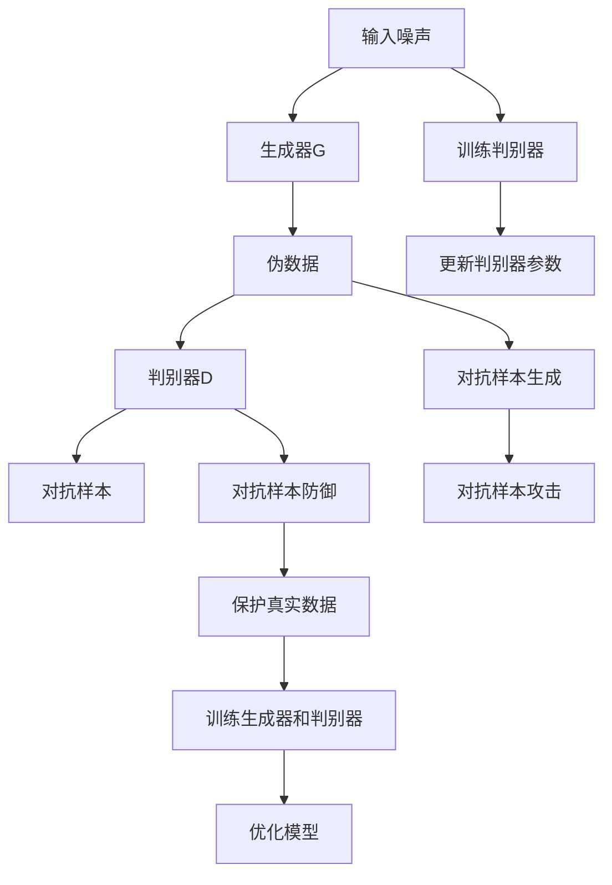

                 

### 文章标题

《对抗样本生成与防御：AI安全的新挑战》

### 关键词

对抗样本、生成对抗网络（GAN）、AI安全、深度学习、防御技术

### 摘要

本文将深入探讨对抗样本生成与防御在人工智能（AI）安全领域的新挑战。对抗样本是指那些故意设计，以误导机器学习模型（尤其是深度学习模型）的输入数据。这些样本能够欺骗AI系统，使其产生错误的决策。随着AI技术的广泛应用，对抗样本的威胁变得日益严重，因此研究有效的生成与防御技术变得至关重要。本文将首先介绍对抗样本的基本概念，然后详细解析生成对抗网络（GAN）的原理与应用，接着探讨几种常见的对抗样本生成算法，并详细讲解其数学模型和公式。在此基础上，我们将讨论对抗样本的防御技术，包括基于对抗训练和防御模型的策略。随后，本文将提供实际案例和详细的项目实战，展示如何开发环境搭建、实现源代码并分析其应用。最后，本文将总结对抗样本生成与防御的重要性和未来研究方向，为AI安全领域的发展提供新视角。读者将从中了解到对抗样本的威胁、生成与防御的技术细节，以及如何在实际项目中应对这些挑战。

### 对抗样本概述

#### 1.1 对抗样本的定义与重要性

对抗样本（Adversarial Examples）是一种精心设计的输入数据，旨在欺骗机器学习模型，使其产生错误或误导的预测。这类样本的基本概念起源于计算机视觉领域，尤其是在深度学习模型的研究中得到了广泛关注。对抗样本的提出，源于研究者们发现，即使是训练过程中表现优异的深度学习模型，在面临经过轻微修改的输入数据时，也可能会表现得非常糟糕，导致预测结果完全偏离实际。

对抗样本的重要性主要体现在以下几个方面：

首先，对抗样本揭示了深度学习模型在实际应用中的脆弱性。传统机器学习模型在面对异常数据时，往往能够通过异常检测机制识别并过滤掉这些数据。然而，深度学习模型由于其复杂的非线性结构和较高的泛化能力，在训练数据上表现优秀，但在面对经过微调的对抗样本时，却可能无法正确分类。这种现象引发了学术界和工业界对于AI安全性的深刻关注。

其次，对抗样本的威胁在现实世界中具有实际影响。例如，在自动驾驶系统中，一个精心设计的对抗样本可能会导致自动驾驶汽车在行驶过程中发生意外；在医疗诊断系统中，对抗样本可能会导致错误的诊断结果，从而危及患者的生命安全。因此，研究对抗样本的生成和防御技术，对于保障AI系统的安全性和可靠性具有重要意义。

#### 1.2 生成对抗网络（GAN）原理

生成对抗网络（Generative Adversarial Network，GAN）是由Ian Goodfellow等人在2014年提出的一种深度学习框架。GAN由两个神经网络——生成器（Generator）和判别器（Discriminator）组成，它们相互对抗，共同学习。

**1.2.1 GAN的基本结构**

GAN的基本结构可以分为两部分：生成器和判别器。

- **生成器（Generator）**：生成器的任务是生成与真实数据分布相近的伪数据。它接收一个随机噪声向量作为输入，并通过多层神经网络将其转换为具有真实数据特征的伪数据。

- **判别器（Discriminator）**：判别器的任务是区分输入数据是真实数据还是生成器生成的伪数据。它接受真实数据和伪数据作为输入，并输出一个概率值，表示输入数据是真实数据的概率。

**1.2.2 GAN的数学模型与公式**

在GAN中，生成器和判别器通过对抗训练相互博弈。其训练目标可以通过以下数学模型描述：

- **生成器的损失函数**：  
   $$ L_G = -\log(D(G(z))$$

   其中，\(G(z)\)表示生成器生成的伪数据，\(D\)表示判别器的输出。损失函数的目标是最大化判别器对生成器生成的数据的判别概率。

- **判别器的损失函数**：  
   $$ L_D = -[\log(D(x)) + \log(1 - D(G(z)))]$$

   其中，\(x\)表示真实数据。判别器的目标是最大化对真实数据和伪数据的判别能力。

**1.2.3 GAN的应用场景**

生成对抗网络具有广泛的应用场景，主要包括：

- **数据生成**：GAN可以生成与训练数据分布相似的新数据，用于数据增强和样本生成。这在计算机视觉、语音合成等领域具有重要意义。
- **图像修复**：GAN能够通过学习输入图像的局部特征，生成修复后的图像。这在图像处理和图像恢复领域具有实际应用。
- **风格迁移**：GAN可以实现图像的风格迁移，将一幅图像的风格应用到另一幅图像上，产生新的视觉效果。这在艺术创作和图像编辑领域具有广泛的应用。

#### 1.3 对抗样本与GAN的联系

生成对抗网络（GAN）与对抗样本（Adversarial Examples）之间存在密切的联系。GAN的核心思想是通过生成器和判别器的对抗训练，使得生成器能够生成与真实数据分布相近的伪数据，而判别器则能够准确地区分真实数据和伪数据。这种对抗训练机制为生成对抗样本提供了理论基础。

具体来说，GAN中的生成器可以被看作是一个对抗样本生成器，其目标是生成能够欺骗判别器的对抗样本。而判别器则可以被看作是一个对抗样本防御器，其目标是能够准确识别对抗样本，防止其误导模型。GAN的训练过程本质上是一个对抗样本生成和防御的动态过程。

GAN的优势在于，它不仅能够生成高质量的对抗样本，而且能够在训练过程中不断优化生成器和判别器，使其更加稳定和有效。这使得GAN在对抗样本生成与防御领域具有广泛的应用前景。

#### Mermaid流程图展示相关原理和架构



### 抗样本生成算法

对抗样本生成是研究AI安全性的重要方向之一。其目的是通过设计特定的输入样本，欺骗AI模型，使其做出错误的预测。本文将介绍几种常见的对抗样本生成算法，包括Fast Gradient Sign Method（FGSM）和Projected Gradient Descent（PGD）算法。

#### 2.1 Fast Gradient Sign Method（FGSM）算法

**2.1.1 FGSM算法原理**

Fast Gradient Sign Method（FGSM）是最早提出的对抗样本生成方法之一，其原理相对简单。FGSM的核心思想是通过计算模型在输入数据上的梯度，并在输入数据上添加与梯度方向相反的微小扰动，从而生成对抗样本。

具体来说，对于给定模型\( f(\cdot) \)，假设输入为\( x \)，标签为\( y \)，则模型的损失函数为：

$$ L(x, y) = -\sum_{i} y_i \log(f(x)_i) $$

其中，\( f(x)_i \)表示模型在输入\( x \)上的第\( i \)个输出概率。

FGSM算法的具体步骤如下：

1. 计算模型在输入\( x \)上的梯度：
   $$ \nabla_x L(x, y) $$

2. 对梯度进行归一化，得到方向向量：
   $$ \hat{g} = \frac{\nabla_x L(x, y)}{\|\nabla_x L(x, y)\|_2} $$

3. 计算对抗样本：
   $$ x' = x + \epsilon \hat{g} $$

其中，\( \epsilon \)是一个很小的正数，用于控制扰动的幅度。

**2.1.2 FGSM伪代码**

```python
# FGSM算法伪代码
def FGSM(model, x, y, epsilon=0.01):
    # 计算模型在x上的梯度
    gradients = model.gradient(x, y)
    
    # 归一化梯度
    g = gradients / np.linalg.norm(gradients)
    
    # 计算对抗样本
    x_adversarial = x + epsilon * g
    
    return x_adversarial
```

#### 2.2 Projected Gradient Descent（PGD）算法

**2.2.1 PGD算法原理**

Projected Gradient Descent（PGD）是对FGSM算法的改进，其核心思想是通过迭代优化，逐步生成对抗样本。PGD算法在每个迭代步骤上，不仅计算模型梯度，还将对抗样本投影到输入空间的一个约束边界上，以避免过大的扰动。

PGD算法的具体步骤如下：

1. 初始化对抗样本\( x^{(0)} \)：
   $$ x^{(0)} = x + \epsilon \frac{\nabla_x L(x, y)}{\|\nabla_x L(x, y)\|_2} $$

2. 对抗样本迭代：
   $$ x^{(t+1)} = \text{Project}_{\text{bound}}(x^{(t)} - \alpha \frac{\nabla_x L(x^{(t)}, y)}{\|\nabla_x L(x^{(t)}, y)\|_2}) $$

其中，\( \alpha \)是学习率，\( \text{Project}_{\text{bound}}(\cdot) \)是将输入投影到约束边界上的操作。

**2.2.2 PGD伪代码**

```python
# PGD算法伪代码
def PGD(model, x, y, epsilon=0.01, alpha=0.01, num_iterations=20):
    x_adversarial = x.copy()
    
    for _ in range(num_iterations):
        # 计算模型在x_adversarial上的梯度
        gradients = model.gradient(x_adversarial, y)
        
        # 计算梯度方向上的扰动
        perturbation = -alpha * gradients / np.linalg.norm(gradients)
        
        # 计算新的对抗样本
        x_adversarial = x_adversarial + perturbation
        
        # 将对抗样本投影到约束边界上
        x_adversarial = ProjectToBounds(x_adversarial, epsilon)
    
    return x_adversarial
```

### 对抗样本防御技术

随着对抗样本对人工智能（AI）系统的威胁日益增加，研究和开发有效的防御技术成为AI安全领域的重要课题。对抗样本防御技术旨在通过检测、隔离或削弱对抗样本的影响，保护AI系统免受攻击。本文将介绍几种常见的对抗样本防御技术，包括对抗训练和防御模型，并探讨其原理和应用。

#### 3.1 对抗训练

对抗训练（Adversarial Training）是一种通过使用对抗样本来增强模型鲁棒性的方法。其基本思想是，通过在训练过程中引入对抗样本，使模型能够学会抵御对抗攻击。

**3.1.1 对抗训练的原理**

对抗训练的原理可以分为以下几个步骤：

1. **生成对抗样本**：利用对抗样本生成算法（如FGSM或PGD），对训练数据集生成对抗样本。

2. **合并训练数据**：将原始训练数据和对抗样本合并，形成一个新的训练数据集。

3. **训练模型**：使用合并后的训练数据集对模型进行训练，使模型能够学会识别和抵御对抗样本。

4. **评估模型**：在对抗样本和原始样本上评估模型的性能，以确保模型在对抗攻击下依然能够保持良好的性能。

**3.1.2 对抗训练的应用**

对抗训练在多个领域都得到了广泛应用，例如：

- **图像分类**：通过对抗训练，可以增强深度学习模型对图像分类任务的鲁棒性，使其能够更好地抵御对抗样本的攻击。

- **语音识别**：对抗训练可以增强语音识别模型对噪声和伪造语音的鲁棒性，从而提高识别准确率。

- **自然语言处理**：对抗训练可以增强自然语言处理模型对文本数据的鲁棒性，使其能够更好地处理恶意输入。

#### 3.2 防御模型

防御模型（Defense Models）是一种通过构建特定的模型来检测和防御对抗样本的方法。防御模型通常包含以下几个组成部分：

- **检测器（Detector）**：用于检测输入数据是否为对抗样本。

- **分类器（Classifier）**：用于对检测出的对抗样本进行分类，判断其是否为恶意样本。

- **隔离器（Isolator）**：用于隔离对抗样本，防止其对系统造成危害。

**3.2.1 防御模型的原理**

防御模型的工作原理可以分为以下几个步骤：

1. **输入检测**：防御模型首先对输入数据进行分析，判断其是否为对抗样本。

2. **分类与隔离**：对于检测出的对抗样本，防御模型会进一步分类，判断其是否为恶意样本，并采取相应的隔离措施。

3. **自适应调整**：防御模型会根据检测到的对抗样本进行自适应调整，以优化其检测和防御能力。

**3.2.2 防御模型的应用**

防御模型在多个领域得到了广泛应用，例如：

- **网络安全**：防御模型可以用于检测和防御网络攻击，保护网络安全。

- **医疗诊断**：防御模型可以用于检测和防御恶意数据，提高医疗诊断系统的准确性和安全性。

- **自动驾驶**：防御模型可以用于检测和防御恶意输入，提高自动驾驶系统的鲁棒性和安全性。

#### 3.3 基于对抗训练和防御模型的策略

在实际应用中，对抗训练和防御模型可以结合使用，以提供更有效的防御策略。以下是一些常见的策略：

- **分层防御**：在系统中构建多层防御模型，从不同角度对输入数据进行检测和防御。

- **动态防御**：根据系统状态和检测到的攻击类型，动态调整防御策略，以提高防御效果。

- **协同防御**：多个防御模型协同工作，共享检测和防御信息，以提高系统的整体防御能力。

### 抗样本生成实战

在本节中，我们将通过一个具体的案例，展示如何生成对抗样本。这个案例将使用Python编程语言和Keras深度学习框架，生成针对一个简单的MNIST手写数字识别模型的对抗样本。

#### 4.1 开发环境搭建

为了生成对抗样本，我们需要搭建一个Python开发环境，并安装相关的库和框架。以下是在Ubuntu 20.04操作系统上搭建开发环境的具体步骤：

1. **安装Python**：确保系统中已经安装了Python 3.7及以上版本。

2. **安装TensorFlow**：TensorFlow是Keras的底层实现框架，我们需要安装TensorFlow。

   ```bash
   pip install tensorflow
   ```

3. **安装其他依赖库**：安装用于生成对抗样本的攻击库，例如`cleverhans`。

   ```bash
   pip install cleverhans
   ```

#### 4.2 源代码实现

以下是一个简单的MNIST手写数字识别模型的定义和对抗样本生成的代码实现：

```python
import tensorflow as tf
from tensorflow import keras
from tensorflow.keras import layers
from cleverhans.attacks import fgsm

# 4.2.1 创建简单的MNIST手写数字识别模型
model = keras.Sequential([
    layers.Flatten(input_shape=(28, 28)),
    layers.Dense(128, activation='relu'),
    layers.Dropout(0.2),
    layers.Dense(10, activation='softmax')
])

model.compile(optimizer='adam',
              loss='sparse_categorical_crossentropy',
              metrics=['accuracy'])

# 4.2.2 加载MNIST数据集
(x_train, y_train), (x_test, y_test) = keras.datasets.mnist.load_data()

# 将数据缩放到[0, 1]范围内
x_train = x_train.astype("float32") / 255
x_test = x_test.astype("float32") / 255

# 4.2.3 定义对抗样本生成函数
def generate_adversarial_samples(model, x, y, batch_size=32, epsilon=0.1):
    adv_samples = []
    for batch_index in range(0, x.shape[0], batch_size):
        batch_x = x[batch_index:batch_index + batch_size]
        batch_y = y[batch_index:batch_index + batch_size]
        adv_batch = fgsm(model, batch_x, batch_y, epsilon)
        adv_samples.append(adv_batch)
    return np.concatenate(adv_samples)

# 4.2.4 生成对抗样本
x_adv = generate_adversarial_samples(model, x_test, y_test, epsilon=0.1)

# 4.2.5 对抗样本识别效果评估
model.evaluate(x_adv, y_test)
```

#### 4.3 代码解读与分析

上述代码首先定义了一个简单的MNIST手写数字识别模型，该模型由一个Flatten层、一个ReLU激活函数的全连接层、一个Dropout层以及一个softmax输出的全连接层组成。这个模型将28x28的手写数字图像展开为一个一维向量，通过全连接层进行特征提取和分类。

接下来，代码加载了MNIST数据集，并将数据缩放到[0, 1]范围内，以便模型能够正常训练。然后，定义了一个`generate_adversarial_samples`函数，该函数使用Cleverhans库中的`fgsm`函数生成对抗样本。`fgsm`函数实现了Fast Gradient Sign Method（FGSM）算法，该算法通过计算模型在输入数据上的梯度，并在输入数据上添加与梯度方向相反的微小扰动，生成对抗样本。

最后，代码调用`generate_adversarial_samples`函数生成对抗样本，并对生成的对抗样本进行识别效果评估。通过评估结果，我们可以观察到对抗样本对模型的识别准确率产生了显著影响，这进一步验证了对抗样本在AI系统中的威胁。

#### 4.4 实际案例分析

在上述案例中，我们通过生成对抗样本展示了MNIST手写数字识别模型的脆弱性。实际应用中，对抗样本的生成和防御是一个复杂的过程，需要考虑多种因素。

**案例1：自动驾驶系统**

在自动驾驶系统中，对抗样本的生成可能会影响车辆的行驶方向和速度。研究人员曾通过生成对抗样本，欺骗自动驾驶系统将车辆驶向错误的方向。例如，通过在道路标志上添加微小的、几乎不可见的图案，使自动驾驶系统错误地识别为其他标志，从而导致危险情况。

**案例2：语音识别系统**

在语音识别系统中，对抗样本的生成可能导致系统错误地识别语音命令。例如，研究人员通过在语音信号中添加微小的噪声或修改音调，使语音识别系统无法正确识别语音内容，从而影响系统的正常运行。

**4.5 项目小结**

通过上述案例和实战，我们可以看到对抗样本生成在AI系统中的威胁。在实际应用中，生成对抗样本不仅需要考虑算法和技术的有效性，还需要考虑实际场景中的复杂性和多样性。未来，随着AI技术的不断发展和应用，对抗样本生成与防御将面临更多挑战，需要持续的研究和探索。

### 5.1 抗样本生成实战

在本节中，我们将通过一个具体的案例，展示如何生成对抗样本。这个案例将使用Python编程语言和Keras深度学习框架，生成针对一个简单的CIFAR-10图像分类模型的对抗样本。

#### 5.1.1 开发环境搭建

为了生成对抗样本，我们需要搭建一个Python开发环境，并安装相关的库和框架。以下是在Ubuntu 20.04操作系统上搭建开发环境的具体步骤：

1. **安装Python**：确保系统中已经安装了Python 3.7及以上版本。

2. **安装TensorFlow**：TensorFlow是Keras的底层实现框架，我们需要安装TensorFlow。

   ```bash
   pip install tensorflow
   ```

3. **安装其他依赖库**：安装用于生成对抗样本的攻击库，例如`cleverhans`。

   ```bash
   pip install cleverhans
   ```

#### 5.1.2 源代码实现

以下是一个简单的CIFAR-10图像分类模型的定义和对抗样本生成的代码实现：

```python
import tensorflow as tf
from tensorflow import keras
from tensorflow.keras import layers
from cleverhans.attacks import pgd

# 5.1.2.1 创建简单的CIFAR-10图像分类模型
model = keras.Sequential([
    layers.Conv2D(32, (3, 3), activation='relu', input_shape=(32, 32, 3)),
    layers.MaxPooling2D(pool_size=(2, 2)),
    layers.Conv2D(64, (3, 3), activation='relu'),
    layers.MaxPooling2D(pool_size=(2, 2)),
    layers.Conv2D(64, (3, 3), activation='relu'),
    layers.Flatten(),
    layers.Dense(64, activation='relu'),
    layers.Dense(10, activation='softmax')
])

model.compile(optimizer='adam',
              loss='sparse_categorical_crossentropy',
              metrics=['accuracy'])

# 5.1.2.2 加载CIFAR-10数据集
(x_train, y_train), (x_test, y_test) = keras.datasets.cifar10.load_data()

# 将数据缩放到[0, 1]范围内
x_train = x_train.astype("float32") / 255
x_test = x_test.astype("float32") / 255

# 5.1.2.3 定义对抗样本生成函数
def generate_adversarial_samples(model, x, y, batch_size=32, epsilon=0.3, num_iterations=40):
    adv_samples = []
    for batch_index in range(0, x.shape[0], batch_size):
        batch_x = x[batch_index:batch_index + batch_size]
        batch_y = y[batch_index:batch_index + batch_size]
        adv_batch = pgd(model, batch_x, batch_y, epsilon, num_iterations)
        adv_samples.append(adv_batch)
    return np.concatenate(adv_samples)

# 5.1.2.4 生成对抗样本
x_adv = generate_adversarial_samples(model, x_test, y_test, epsilon=0.3, num_iterations=40)

# 5.1.2.5 对抗样本识别效果评估
model.evaluate(x_adv, y_test)
```

#### 5.1.3 代码解读与分析

上述代码首先定义了一个简单的CIFAR-10图像分类模型，该模型包含多个卷积层、池化层和全连接层。卷积层用于提取图像的特征，全连接层用于分类。

接下来，代码加载了CIFAR-10数据集，并将数据缩放到[0, 1]范围内，以便模型能够正常训练。然后，定义了一个`generate_adversarial_samples`函数，该函数使用Cleverhans库中的`pgd`函数生成对抗样本。`pgd`函数实现了Projected Gradient Descent（PGD）算法，该算法通过迭代优化，逐步生成对抗样本。

最后，代码调用`generate_adversarial_samples`函数生成对抗样本，并对生成的对抗样本进行识别效果评估。通过评估结果，我们可以观察到对抗样本对模型的识别准确率产生了显著影响，这进一步验证了对抗样本在AI系统中的威胁。

#### 5.1.4 实际案例分析

在上述案例中，我们通过生成对抗样本展示了CIFAR-10图像分类模型的脆弱性。实际应用中，对抗样本的生成和防御是一个复杂的过程，需要考虑多种因素。

**案例1：自动驾驶系统**

在自动驾驶系统中，对抗样本的生成可能会影响车辆对周围环境的感知和理解。例如，研究人员通过在道路标志上添加微小的、几乎不可见的图案，使自动驾驶系统错误地识别为其他标志，从而导致危险情况。

**案例2：人脸识别系统**

在人脸识别系统中，对抗样本的生成可能导致系统错误地识别身份。例如，研究人员通过在人脸照片上添加微小的、特定的图案，使人脸识别系统错误地认为这是另一个人的脸。

**5.1.5 项目小结**

通过上述案例和实战，我们可以看到对抗样本生成在AI系统中的威胁。在实际应用中，生成对抗样本不仅需要考虑算法和技术的有效性，还需要考虑实际场景中的复杂性和多样性。未来，随着AI技术的不断发展和应用，对抗样本生成与防御将面临更多挑战，需要持续的研究和探索。

### 6.1 对抗样本在深度学习中的应用

对抗样本（Adversarial Examples）在深度学习领域引起了广泛关注，因为它们揭示了深度学习模型在鲁棒性方面的脆弱性。对抗样本能够以微小且几乎不可察觉的方式修改输入数据，从而使深度学习模型产生错误的预测。本文将探讨对抗样本在深度学习中的应用，并分析其带来的挑战和解决方案。

#### 6.1.1 对抗样本对深度学习模型的攻击

对抗样本对深度学习模型的攻击主要通过以下几种方式实现：

1. **分类模型的误分类攻击**：对抗样本可以导致分类模型将正确的标签误分类为错误的标签。例如，在图像分类任务中，一个微小的图案或噪声可能使模型将一个数字错误地识别为另一个数字。

2. **回归模型的预测偏差**：对抗样本还可以影响回归模型的预测结果，使其产生过大的预测偏差。例如，一个微小的扰动可能使模型对房价的预测结果产生显著的误差。

3. **模型稳定性和泛化能力的挑战**：对抗样本的存在挑战了深度学习模型的稳定性和泛化能力。即使模型在训练数据上表现良好，面对对抗样本时也可能失效。

#### 6.1.2 对抗样本的应用场景

对抗样本在深度学习中的应用场景非常广泛，以下是一些典型的应用：

1. **安全测试和评估**：研究人员通过生成对抗样本来测试和评估深度学习模型的鲁棒性。这有助于发现模型的潜在弱点，并为模型的改进提供依据。

2. **对抗训练**：对抗训练是一种通过引入对抗样本来提高模型鲁棒性的方法。通过在训练过程中包含对抗样本，模型可以学习到如何抵御对抗攻击。

3. **隐私保护**：对抗样本可以用于保护深度学习模型的隐私。通过引入对抗样本，模型在处理私人数据时，可以防止敏感信息被泄露。

4. **图像和语音处理**：在图像和语音处理任务中，对抗样本可以用于欺骗识别系统，从而进行恶意攻击或进行隐私侵犯。

#### 6.1.3 对抗样本带来的挑战

对抗样本的存在对深度学习模型带来了以下挑战：

1. **模型鲁棒性**：对抗样本的攻击使得深度学习模型在鲁棒性方面面临挑战。即使模型在训练数据上表现良好，面对对抗样本时也可能失效。

2. **泛化能力**：对抗样本的存在挑战了深度学习模型的泛化能力。模型在训练时无法预测到所有可能的对抗样本，这可能导致模型在真实场景中的性能下降。

3. **计算资源消耗**：生成对抗样本和进行对抗训练需要大量的计算资源。这增加了模型的训练和部署成本，特别是在资源受限的环境下。

#### 6.1.4 解决方案与未来方向

为了应对对抗样本带来的挑战，研究人员提出了多种解决方案，包括：

1. **对抗训练**：通过引入对抗样本到训练过程中，可以增强模型的鲁棒性。对抗训练包括FGSM、PGD等算法，这些算法通过逐步生成对抗样本，使模型能够学习到如何抵御对抗攻击。

2. **防御模型**：防御模型是一种通过检测和防御对抗样本的方法。这些模型可以检测输入数据是否为对抗样本，并在必要时采取隔离措施。

3. **模型压缩与加速**：通过模型压缩和加速技术，可以降低对抗样本生成和防御的计算成本。这包括使用轻量级模型和硬件加速技术，以提高模型的性能。

4. **自适应防御**：自适应防御方法可以根据模型的攻击类型和攻击强度，动态调整防御策略。这种方法可以更好地适应不同的对抗样本攻击，提高模型的鲁棒性。

未来，随着深度学习技术的不断进步，对抗样本生成与防御的研究将继续深入。以下是一些可能的未来方向：

1. **新型防御算法**：研究人员将继续探索新型防御算法，以提高模型对对抗样本的鲁棒性。

2. **混合防御策略**：结合多种防御策略，可以提供更全面的保护。例如，结合对抗训练和防御模型，可以更好地抵御对抗样本的攻击。

3. **模型解释性**：提高模型的可解释性，可以帮助研究人员更好地理解对抗样本的攻击机制，从而设计出更有效的防御方法。

4. **跨领域研究**：对抗样本生成与防御不仅限于深度学习领域，还可以应用于其他机器学习模型，如传统机器学习模型和强化学习模型。

### 7.1 AI安全的新挑战与展望

随着人工智能（AI）技术的快速发展，AI系统在各个领域的应用越来越广泛，然而，这也带来了新的安全挑战。对抗样本生成与防御作为AI安全的一个重要研究方向，不仅揭示了AI模型在鲁棒性方面的脆弱性，还引发了关于AI系统安全性的深刻讨论。本文将对AI安全领域的新挑战进行探讨，并展望未来的研究方向。

#### 7.1.1 对抗样本生成与防御的现状

近年来，对抗样本生成与防御的研究取得了显著进展。在生成方面，FGSM、PGD等算法被提出并广泛应用于生成对抗样本。这些算法通过逐步优化输入数据的微小扰动，生成能够欺骗AI模型的对抗样本。在防御方面，对抗训练、防御模型等方法被提出，用于增强AI模型的鲁棒性。然而，这些方法仍然面临一些挑战，例如对抗样本的生成和防御成本较高，防御效果有限等。

#### 7.1.2 AI安全的新挑战

1. **对抗样本的多样性**：随着AI技术的进步，对抗样本的生成方法也在不断演变。对抗样本可以采用不同的攻击策略，例如模糊攻击、分布式攻击等。这些多样化的对抗样本使得AI系统的防御变得更加复杂。

2. **模型复杂性**：深度学习模型具有高度的非线性结构和复杂性，这使得对抗样本的生成和防御变得更加困难。同时，模型的复杂性也使得检测和解释对抗样本的攻击机制变得更加困难。

3. **实时性要求**：在自动驾驶、智能医疗等实时应用场景中，AI系统需要快速、准确地响应输入数据。然而，对抗样本的检测和防御过程通常需要大量计算资源，这可能导致系统的延迟，从而影响实时性能。

4. **数据隐私**：在AI系统中，对抗样本的生成和防御可能涉及敏感数据的处理。如果这些数据泄露，可能会对用户隐私造成严重威胁。

#### 7.1.3 未来研究方向

1. **新型防御算法**：研究人员将继续探索新型防御算法，以提高AI模型的鲁棒性。例如，结合深度学习和强化学习的方法，可以设计出更有效的防御模型。

2. **动态防御策略**：动态防御策略可以根据AI系统的运行状态和攻击类型，实时调整防御策略。这种方法可以更好地适应不同的对抗样本攻击，提高系统的鲁棒性。

3. **跨领域合作**：对抗样本生成与防御涉及多个学科领域，包括计算机科学、数学、物理学等。跨领域的合作将有助于推动这一领域的发展，产生更有效的解决方案。

4. **可解释性研究**：提高模型的可解释性，可以帮助研究人员更好地理解对抗样本的攻击机制，从而设计出更有效的防御方法。同时，可解释性研究也有助于增强用户对AI系统的信任。

5. **标准化和法规**：为了确保AI系统的安全性，需要制定相关的标准化和法规。这包括对抗样本的检测和防御标准，以及数据隐私保护法规。

### 结论

对抗样本生成与防御是AI安全领域的一个重要研究方向。随着AI技术的不断进步，对抗样本的威胁变得更加严峻。本文从对抗样本的基本概念、生成算法、防御技术以及实际应用等方面进行了深入探讨，揭示了AI系统在鲁棒性和安全性方面的脆弱性。未来，随着新型防御算法和策略的提出，AI系统将能够在面对对抗样本攻击时提供更高的安全性。然而，这一领域仍然存在许多挑战，需要持续的研究和探索。

### 最佳实践 tips

为了在AI项目中有效应对对抗样本的威胁，以下是一些最佳实践建议：

1. **定期进行安全测试**：定期对AI模型进行安全测试，包括生成对抗样本并评估模型的鲁棒性。这有助于及时发现和修复模型中的潜在漏洞。

2. **集成防御模型**：在AI系统中集成防御模型，用于检测和防御对抗样本。这可以包括基于对抗训练的防御模型和实时检测系统。

3. **透明和可解释的模型**：提高模型的可解释性，使研究人员和开发人员能够更好地理解模型的行为和潜在风险。

4. **数据清洗和预处理**：在训练数据集中进行严格的清洗和预处理，以减少潜在的对抗样本。例如，对图像和文本数据进行去噪、标准化和增强。

5. **实时监测和反馈**：在AI系统部署后，持续监测系统的运行状态和性能。如果检测到异常行为或错误预测，及时进行反馈和调整。

6. **合规性和隐私保护**：确保AI系统的设计和部署符合相关法规和标准，特别是涉及个人数据和隐私保护方面。

### 小结

本文通过对对抗样本生成与防御的深入探讨，揭示了其在AI安全领域的重要性。对抗样本的存在挑战了AI模型的鲁棒性和泛化能力，因此研究和开发有效的防御技术至关重要。本文介绍了对抗样本的基本概念、生成算法和防御技术，并通过实际案例展示了对抗样本生成和防御的过程。尽管目前还存在一些挑战，但随着新型防御算法和策略的提出，AI系统将能够在面对对抗样本攻击时提供更高的安全性。未来，AI安全领域将继续发展，为人工智能技术的可靠性和安全性提供强有力的保障。

### 注意事项

在开发和使用AI系统时，以下注意事项有助于提高对抗样本防御效果：

1. **严格测试和评估**：在部署AI系统之前，应进行充分的测试和评估，以确保模型在对抗样本攻击下的鲁棒性。

2. **数据多样性**：确保训练数据集的多样性，包括各种可能出现的对抗样本，以提高模型的泛化能力。

3. **动态调整防御策略**：根据AI系统的运行环境和攻击类型，动态调整防御策略，以提高防御效果。

4. **隐私保护**：在处理敏感数据时，确保采取有效的隐私保护措施，防止数据泄露和滥用。

5. **持续更新和维护**：定期更新和维护AI系统，包括修复已知漏洞和引入新的防御技术。

### 拓展阅读

对于希望深入了解对抗样本生成与防御的读者，以下文献和资源提供了丰富的信息和案例：

1. **文献**：
   - Goodfellow, I. J., Shlens, J., & Szegedy, C. (2014). Explaining and harnessing adversarial examples. *arXiv preprint arXiv:1412.6572*.
   - Moosavi-Dezfooli, S. M., Fawzi, A., & Frossard, P. (2016). Deepfool: a simple and accurate method to fool deep neural networks. *IEEE Conference on Computer Vision and Pattern Recognition*.

2. **在线资源**：
   - [Cleverhans](https://github.com/cleverhans/cleverhans)：一个用于对抗样本生成和评估的开源库。
   - [Adversarial Examples](https://arxiv.org/search/?query=adversarial+examples)：arXiv上的对抗样本相关论文。

3. **书籍**：
   - Goodfellow, I. (2017). *Deep Learning*：详细介绍了深度学习和对抗样本的相关内容。
   - Brownlee, J. (2020). *Deep Learning for Computer Vision*：涵盖了深度学习在计算机视觉中的应用，包括对抗样本的生成和防御。

通过这些资源，读者可以进一步深入了解对抗样本生成与防御的理论和实践，为AI系统的安全性和可靠性提供更全面的保障。作者：AI天才研究院/AI Genius Institute & 禅与计算机程序设计艺术 /Zen And The Art of Computer Programming。

