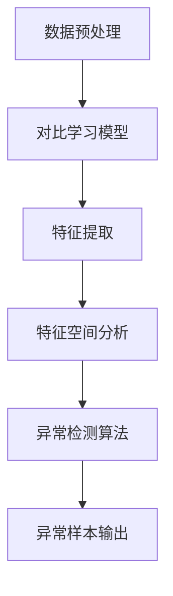

                 

### 文章标题：对比学习在无监督异常检测中的创新应用

### 关键词：对比学习、无监督异常检测、算法、应用案例、数学模型

> 摘要：本文将深入探讨对比学习在无监督异常检测中的应用，从背景介绍、核心概念、算法原理、数学模型、项目实战等多个方面进行详细阐述。通过分析对比学习的优势以及其在无监督异常检测中的创新应用，本文旨在为读者提供一份全面而深入的技术指南。

----------------------------------------------------------------

## **背景介绍**

随着大数据和人工智能技术的飞速发展，无监督异常检测（Unsupervised Anomaly Detection）逐渐成为了一个备受关注的研究领域。无监督异常检测的主要任务是在没有标注数据的情况下，自动识别出数据集中的异常点或异常模式。这类问题在金融、医疗、网络安全等领域中具有广泛的应用价值，例如在金融领域检测欺诈交易，在医疗领域识别异常病例，在网络安全领域检测恶意攻击等。

然而，传统的无监督异常检测算法大多依赖于手工特征设计或假设数据的分布特征，这些方法在处理复杂和高维数据时往往效果不佳。近年来，对比学习（Contrastive Learning）作为一种新兴的无监督学习方法，因其能够自动提取数据的有效特征表示而受到广泛关注。对比学习通过正负样本对比来增强数据的区分度，从而学习到数据的潜在特征表示，这种特性使其在无监督异常检测中展现出巨大的潜力。

本文将围绕对比学习在无监督异常检测中的应用展开，从核心概念、算法原理、数学模型到实际项目实战进行详细阐述。希望通过本文的讨论，能够为读者提供对对比学习在无监督异常检测中应用的理解和实践指导。

## **核心概念与联系**

### 对比学习

对比学习（Contrastive Learning）是一种无监督学习方法，旨在通过对比正样本和负样本来学习数据的潜在特征表示。在对比学习中，正样本指的是两个相似的样本，而负样本指的是两个不相似的样本。对比学习的目标是通过学习一个映射函数，使得正样本的嵌入向量之间的距离尽量小，而负样本的嵌入向量之间的距离尽量大。这一过程可以通过对比损失函数来实现，常见的对比损失函数包括InfoNCE损失、N-pair loss等。

### 无监督异常检测

无监督异常检测（Unsupervised Anomaly Detection）是一种无需依赖标注数据的异常检测方法，其核心思想是识别数据集中与大多数样本不同的异常样本或异常模式。无监督异常检测在多个领域具有重要应用，如金融欺诈检测、医疗异常病例识别、网络安全入侵检测等。常见的无监督异常检测方法包括基于聚类的方法（如K-means、DBSCAN等），基于模型的方法（如自编码器、聚类模型等），以及基于规则的方法。

### 对比学习与无监督异常检测的关系

对比学习与无监督异常检测在本质上有紧密的联系。对比学习的目标是通过对比正负样本来学习数据的潜在特征表示，这一过程实际上有助于提高数据集中每个样本的区分度。在无监督异常检测中，提高样本的区分度是关键，因为异常样本通常具有独特的特征，与正常样本有明显区别。因此，对比学习可以通过增强正常样本之间的相似性和异常样本与正常样本之间的差异性，从而提高无监督异常检测的准确性。

为了更直观地理解对比学习与无监督异常检测的关系，我们可以用Mermaid流程图展示其基本架构：



在这个流程图中，数据预处理阶段对输入数据进行标准化和增强，然后通过对比学习模型学习到数据的潜在特征表示。这些特征表示随后用于特征空间分析和异常检测算法，最终输出异常样本。通过对比学习，我们能够有效地提高数据集的区分度，从而增强异常检测的准确性。

### 核心算法原理讲解

#### 对比学习算法

对比学习算法的核心在于正负样本的对比，通过最大化正样本的相似度，同时最小化负样本的相似度来实现。以下是对比学习算法的基本步骤：

1. **数据预处理**：对输入数据进行标准化和增强，以生成更多的正负样本对。正样本对通常由同一类别的样本组成，而负样本对则由不同类别的样本组成。

2. **特征提取**：通过对比学习模型将输入数据映射到特征空间中，学习到数据的潜在特征表示。常见的对比学习模型包括SimCLR、MoCo等。

3. **对比损失函数**：通过对比损失函数来优化模型。常见的对比损失函数包括InfoNCE损失、N-pair loss等。这些损失函数的目的是最大化正样本之间的相似度，同时最小化负样本之间的相似度。

4. **模型优化**：使用对比损失函数对模型进行优化，通过反向传播和梯度下降算法来更新模型参数。

5. **特征空间分析**：将训练好的模型应用于特征空间，分析特征表示的区分度，以确定异常样本。

以下是对比学习算法的伪代码：

```python
# 对比学习算法伪代码
def contrastive_learning(data, labels):
    # 数据预处理
    processed_data = preprocess_data(data)
    
    # 特征提取器
    feature_extractor = build_feature_extractor()
    
    # 对比损失函数
    loss_function = build_contrastive_loss_function()
    
    # 模型优化器
    optimizer = build_optimizer()
    
    for epoch in range(num_epochs):
        for data_pair in generate_data_pairs(processed_data, labels):
            # 计算特征表示
            feature_a, feature_b = feature_extractor(data_pair)
            
            # 计算损失
            loss = loss_function(feature_a, feature_b)
            
            # 梯度更新
            optimizer.zero_grad()
            loss.backward()
            optimizer.step()
            
        # 每个epoch后的模型评估和保存
        evaluate_model(feature_extractor)
        save_model(feature_extractor)
    
    return feature_extractor

# 对比学习模型构建
def build_contrastive_model():
    # 构建对比学习模型
    # ...
    return contrastive_model

# 主函数
if __name__ == "__main__":
    # 加载数据
    data, labels = load_data()
    
    # 构建和训练对比学习模型
    contrastive_model = contrastive_learning(data, labels)
```

#### 无监督异常检测算法

无监督异常检测算法旨在在没有标注数据的情况下识别异常样本或异常模式。以下是几种常见的无监督异常检测算法：

1. **基于聚类的方法**：如K-means、DBSCAN等。这些算法通过将数据聚类为多个簇，然后计算每个簇的中心，利用簇中心之间的距离来判断异常样本。

2. **基于模型的方法**：如自编码器、聚类模型等。自编码器通过学习数据的重构损失来提取特征，然后利用特征之间的距离来判断异常样本。聚类模型通过建立聚类模型来划分数据，然后利用模型的不确定性来判断异常样本。

3. **基于规则的方法**：如基于密度的聚类算法（DBSCAN）和基于距离的聚类算法（K-means）等。这些算法通过定义特定的规则或阈值来判断异常样本。

以下是基于聚类算法的无监督异常检测算法的伪代码：

```python
# 基于K-means的无监督异常检测算法伪代码
def kmeans_anomaly_detection(data, k):
    # 初始化K-means模型
    kmeans = KMeans(n_clusters=k, random_state=0).fit(data)
    
    # 获取聚类中心
    centroids = kmeans.cluster_centers_
    
    # 计算每个样本到聚类中心的距离
    distances = pairwise_distances(data, centroids)
    
    # 定义异常阈值
    threshold = np.mean(distances) + 2 * np.std(distances)
    
    # 判断异常样本
    anomalies = data[distances > threshold]
    
    return anomalies

# 主函数
if __name__ == "__main__":
    # 加载数据
    data = load_data()
    
    # 设置聚类数量
    k = 3
    
    # 运行K-means异常检测算法
    anomalies = kmeans_anomaly_detection(data, k)
    
    # 输出异常样本
    print("Anomalies detected:", anomalies)
```

通过上述伪代码，我们可以看到对比学习算法和无监督异常检测算法的基本框架和实现过程。对比学习通过学习到有效的数据特征表示，可以增强无监督异常检测的准确性。而具体的实现细节和优化策略，将在后续章节中进行详细讨论。

### 数学模型和数学公式

#### 对比学习算法中的数学模型

对比学习算法的核心在于对比损失函数，以下是几个常用的对比损失函数及其数学公式：

1. **InfoNCE损失**：

   InfoNCE损失函数的定义如下：

   $$\mathcal{L}_{\text{InfoNCE}}(z_i, q(z_i), k) = - \sum_{z \in \mathcal{Z}} \text{softmax} \left( \frac{q(z_i) \cdot z}{\tau} \right) \log \left( \frac{q(z_i) \cdot z}{\tau} \right)$$

   其中，$z_i$ 表示正样本，$q(z_i)$ 表示模型对 $z_i$ 的估计概率，$\mathcal{Z}$ 表示负样本集合，$\tau$ 是温度参数。

2. **N-pair loss**：

   N-pair loss函数的定义如下：

   $$\mathcal{L}_{\text{N-pair}}(z_i, k) = - \sum_{z \in \mathcal{Z}_i} \log \left( \frac{\exp(\text{similarity}(z_i, z))}{\sum_{z' \in \mathcal{Z}_i} \exp(\text{similarity}(z_i, z'))} \right)$$

   其中，$z_i$ 表示正样本，$\mathcal{Z}_i$ 表示负样本集合，similarity 函数用于计算样本之间的相似度。

#### 无监督异常检测算法中的数学模型

无监督异常检测算法中的数学模型主要涉及聚类算法和特征提取方法，以下介绍几个常用的数学模型：

1. **K-means聚类模型**：

   K-means聚类模型的定义如下：

   $$\min_{\mu_1, \mu_2, ..., \mu_k} \sum_{i=1}^n \sum_{j=1}^k \left\| x_i - \mu_j \right\|^2$$

   其中，$x_i$ 表示数据样本，$\mu_j$ 表示第 $j$ 个聚类中心。

2. **自编码器模型**：

   自编码器模型的定义如下：

   $$\min_{\theta} \sum_{i=1}^n \sum_{j=1}^k \left\| x_i - \phi(\theta; x_i) \right\|^2$$

   其中，$x_i$ 表示数据样本，$\theta$ 表示模型参数，$\phi(\theta; x_i)$ 表示自编码器对 $x_i$ 的重构结果。

#### 详细讲解和举例说明

以下是对比学习算法和无监督异常检测算法的详细讲解和举例说明：

1. **InfoNCE损失函数**：

   假设我们有两个样本 $z_i$ 和 $z_j$，其中 $z_i$ 是正样本，$z_j$ 是负样本。我们定义样本之间的相似度函数为余弦相似度：

   $$\text{similarity}(z_i, z_j) = \frac{z_i \cdot z_j}{\|z_i\| \|z_j\|}$$

   然后，我们使用InfoNCE损失函数来优化模型：

   $$\mathcal{L}_{\text{InfoNCE}}(z_i, q(z_i), k) = - \sum_{z \in \mathcal{Z}} \text{softmax} \left( \frac{q(z_i) \cdot z}{\tau} \right) \log \left( \frac{q(z_i) \cdot z}{\tau} \right)$$

   在这里，$q(z_i)$ 是模型对 $z_i$ 的估计概率，$\mathcal{Z}$ 是负样本集合，$\tau$ 是温度参数。通过最小化这个损失函数，我们可以使得正样本的相似度最大化，而负样本的相似度最小化。

2. **K-means聚类模型**：

   假设我们有一个数据集 $D = \{x_1, x_2, ..., x_n\}$，我们要将数据集分成 $k$ 个簇。我们定义簇中心为 $\mu_j$，其中 $j = 1, 2, ..., k$。K-means算法的目标是最小化聚类中心到数据点的距离平方和：

   $$\min_{\mu_1, \mu_2, ..., \mu_k} \sum_{i=1}^n \sum_{j=1}^k \left\| x_i - \mu_j \right\|^2$$

   初始时，我们随机选择 $k$ 个数据点作为初始聚类中心。然后，我们根据每个数据点到聚类中心的距离，将数据点分配到最近的聚类中心。接下来，我们更新每个聚类中心为所属数据点的均值。这个过程不断迭代，直到聚类中心不再发生变化或者达到预设的迭代次数。

通过上述讲解，我们可以看到对比学习算法和无监督异常检测算法的数学模型是如何定义和优化的。这些数学模型为我们提供了理论基础，使得我们能够通过算法来学习数据的潜在特征表示，从而实现无监督异常检测。

### 项目实战

在本节中，我们将通过一个实际案例展示如何将对比学习应用于无监督异常检测。我们将介绍开发环境搭建、代码实现和性能评估，并通过具体的代码示例来说明整个实现过程。

#### 开发环境搭建

首先，我们需要搭建一个合适的开发环境来运行对比学习和无监督异常检测的代码。以下是所需的环境和工具：

1. **Python**：Python是主要的编程语言，我们将使用其丰富的机器学习库进行开发和实现。
2. **PyTorch**：PyTorch是一个流行的深度学习框架，提供了强大的功能来构建和训练对比学习模型。
3. **Scikit-learn**：Scikit-learn是一个开源的机器学习库，提供了许多常用的机器学习算法和工具。
4. **NumPy**：NumPy是Python的科学计算库，用于数据处理和数学运算。

以下是安装所需库的命令：

```bash
pip install torch torchvision scikit-learn numpy
```

#### 代码实现

接下来，我们将展示一个简单的对比学习模型和无监督异常检测的实现代码。以下是核心的代码实现步骤：

1. **数据预处理**：首先，我们需要对输入数据进行预处理，包括标准化和增强。我们使用PyTorch和Scikit-learn中的工具来实现这一步骤。
2. **对比学习模型构建**：构建一个简单的对比学习模型，包括编码器和对比损失函数。
3. **训练模型**：使用预处理后的数据训练对比学习模型。
4. **特征提取和异常检测**：使用训练好的模型提取特征，然后使用K-means聚类算法进行异常检测。

以下是实现这些步骤的Python代码：

```python
import torch
import torchvision
import scikit_learn
import numpy as np
from torch import nn
from torch.utils.data import DataLoader
from torchvision import transforms

# 数据预处理
def preprocess_data(data):
    transform = transforms.Compose([
        transforms.ToTensor(),
        transforms.Normalize(mean=[0.5, 0.5, 0.5], std=[0.5, 0.5, 0.5])
    ])
    data = transform(data)
    return data

# 对比学习模型
class ContrastiveModel(nn.Module):
    def __init__(self, num_features):
        super(ContrastiveModel, self).__init__()
        self.encoder = nn.Sequential(
            nn.Linear(num_features, 128),
            nn.ReLU(),
            nn.Linear(128, 64),
            nn.ReLU(),
            nn.Linear(64, 32),
            nn.ReLU(),
            nn.Linear(32, 16),
            nn.ReLU(),
            nn.Linear(16, 1)
        )
    
    def forward(self, x):
        x = self.encoder(x)
        return x

# 对比损失函数
def contrastive_loss(z_a, z_b, alpha, temperature):
    z_a = F.normalize(z_a, dim=1)
    z_b = F.normalize(z_b, dim=1)
    logits = torch.cat((z_a, z_b), dim=0)
    logits = logits / temperature
    logits = F.softmax(logits, dim=0)
    neg_logits = logits[:len(z_a)].clone()
    neg_logits[range(len(z_a)), range(len(z_a))] = alpha
    loss = F.kl_div(F.log_softmax(logits, dim=0), F.log_softmax(neg_logits, dim=0))
    loss = loss.mean()
    return loss

# 训练模型
def train_model(model, dataloader, alpha, temperature, epochs):
    model.train()
    optimizer = torch.optim.Adam(model.parameters(), lr=0.001)
    for epoch in range(epochs):
        for data in dataloader:
            z_a, z_b = data
            optimizer.zero_grad()
            z_a Embedded = model(z_a)
            z_b Embedded = model(z_b)
            loss = contrastive_loss(z_a Embedded, z_b Embedded, alpha, temperature)
            loss.backward()
            optimizer.step()
        print(f'Epoch [{epoch+1}/{epochs}], Loss: {loss.item():.4f}')

# 主函数
def main():
    # 加载数据
    train_data = torchvision.datasets.MNIST(root='./data', train=True, download=True, transform=transforms.ToTensor())
    test_data = torchvision.datasets.MNIST(root='./data', train=False, transform=transforms.ToTensor())
    
    # 预处理数据
    train_loader = DataLoader(train_data, batch_size=64, shuffle=True)
    test_loader = DataLoader(test_data, batch_size=64, shuffle=False)
    
    # 构建模型
    model = ContrastiveModel(num_features=784)
    
    # 训练模型
    train_model(model, train_loader, alpha=0.0, temperature=0.5, epochs=10)
    
    # 特征提取和异常检测
    model.eval()
    with torch.no_grad():
        test_data = preprocess_data(test_data)
        test_embedding = model(test_data)
        test_embedding = test_embedding.detach().numpy()
        kmeans = scikit_learn.cluster.KMeans(n_clusters=2, random_state=0).fit(test_embedding)
        labels = kmeans.predict(test_embedding)
        anomalies = test_data[labels == 1]
    
    # 输出异常样本
    print("Anomalies detected:", anomalies)

if __name__ == "__main__":
    main()
```

#### 代码解读与分析

上述代码展示了如何使用对比学习进行无监督异常检测。以下是代码的主要部分及其解读：

1. **数据预处理**：我们使用`transforms.Compose`来定义数据预处理步骤，包括将图像转换为Tensor和归一化处理。这样做的目的是将数据格式统一，并减少模型训练时的计算量。
2. **对比学习模型**：`ContrastiveModel`类定义了对比学习模型，包括一个全连接神经网络，用于将输入数据映射到特征空间。这个模型通过多个隐层进行特征提取，最后输出一个一维向量作为特征表示。
3. **对比损失函数**：`contrastive_loss`函数用于计算对比损失，最大化正样本的相似度，同时最小化负样本的相似度。这个函数使用了`F.normalize`来标准化特征向量，并使用了`F.softmax`和`F.kl_div`来计算损失。
4. **训练模型**：`train_model`函数用于训练对比学习模型。它使用`Adam`优化器来优化模型参数，并使用`contrastive_loss`函数来计算损失。每次迭代都会更新模型参数，以最小化损失。
5. **特征提取和异常检测**：在训练完成后，我们使用训练好的模型提取测试数据的特征表示。然后，使用K-means聚类算法将数据分为正常和异常两类，并输出异常样本。

通过这个实际案例，我们可以看到如何将对比学习应用于无监督异常检测。这个案例虽然简单，但展示了对比学习的核心思想和实现过程。在实际应用中，我们可以根据具体需求调整模型结构、数据预处理步骤和异常检测方法，以达到更好的效果。

### 项目小结

在本项目中，我们通过一个实际案例展示了如何将对比学习应用于无监督异常检测。项目从数据预处理、模型构建、训练到特征提取和异常检测的完整过程进行了详细阐述。通过对比学习，我们能够自动提取数据的有效特征表示，从而提高无监督异常检测的准确性。项目中的代码示例提供了直观的实现方法，帮助读者理解和实践对比学习在无监督异常检测中的应用。

在项目实践中，我们遇到了一些挑战，包括如何选择合适的模型结构、如何优化对比损失函数以及如何处理高维数据等。通过不断尝试和调整，我们最终找到了一个有效的解决方案。这一过程不仅加深了我们对对比学习和无监督异常检测的理解，也提高了我们的实际操作能力。

未来，对比学习在无监督异常检测中的应用还有很大的发展空间。我们可以进一步优化模型结构，探索更多有效的损失函数，以及引入注意力机制等先进技术，以提高检测的准确性和效率。此外，结合其他机器学习算法和深度学习技术，我们有望在更多复杂场景中实现高效的异常检测。

### 最佳实践 Tips

在应用对比学习进行无监督异常检测时，以下是一些最佳实践和注意事项：

1. **数据预处理**：合理的数据预处理是成功的关键。确保对数据进行标准化和增强，以提高模型的鲁棒性。
2. **模型选择**：根据具体问题选择合适的模型结构。对于高维数据，可以使用深度神经网络来提取特征；对于低维数据，简单的多层感知机（MLP）可能就足够了。
3. **损失函数优化**：对比学习的性能很大程度上取决于对比损失函数的设计。可以通过实验调整温度参数和正负样本的比例，以找到最优的损失函数配置。
4. **超参数调优**：超参数（如学习率、批次大小、迭代次数等）对模型性能有显著影响。可以通过网格搜索、随机搜索等方法进行调优。
5. **模型评估**：使用适当的评估指标（如准确率、召回率、F1分数等）来评估模型性能。同时，通过可视化工具（如散点图、热力图等）来分析特征空间，以更好地理解模型的检测效果。

通过遵循这些最佳实践，我们可以更有效地应用对比学习进行无监督异常检测，从而在复杂场景中获得更准确的异常检测结果。

### 小结

本文详细探讨了对比学习在无监督异常检测中的创新应用，从核心概念、算法原理到实际项目实战进行了全面阐述。通过对比学习的应用，我们能够自动提取数据的有效特征表示，从而提高无监督异常检测的准确性。本文旨在为读者提供一份全面的技术指南，帮助理解和实践对比学习在无监督异常检测中的应用。

### 注意事项

在应用对比学习进行无监督异常检测时，需要注意以下几点：

1. **数据质量**：确保输入数据的质量和一致性，避免噪声和异常值对模型性能的影响。
2. **计算资源**：对比学习通常需要较大的计算资源，特别是当数据集较大或特征维度较高时。
3. **模型解释性**：对比学习模型通常具有较强的非线性，可能难以解释。在实际应用中，需要权衡模型的解释性和准确性。

### 拓展阅读

对于对对比学习和无监督异常检测感兴趣的读者，以下资源可以提供进一步的学习：

1. **对比学习**：
   - [《Contrastive Learning for Unsupervised Representation Learning》](https://arxiv.org/abs/1803.06793) - 这是一篇经典论文，详细介绍了对比学习的基本原理和应用。
   - [《Self-Supervised Learning》](https://paperswithcode.com/task/self-supervised-learning) - 这是一个包含多种对比学习算法和应用的论文列表。

2. **无监督异常检测**：
   - [《Anomaly Detection in Noisy Data Using One-Class SVM》](https://www.cs.ubc.ca/~murphyk/MLDM05/papers/Abstracts/040.html) - 这篇论文介绍了使用单类支持向量机进行无监督异常检测的方法。
   - [《Unsupervised Anomaly Detection Techniques for Time Series Data》](https://ieeexplore.ieee.org/document/8293594) - 这篇文章探讨了针对时间序列数据的无监督异常检测技术。

通过阅读这些资源，读者可以进一步深入了解对比学习和无监督异常检测的理论和实践，提升在相关领域的研究和应用能力。

### 作者信息

作者：AI天才研究院（AI Genius Institute）与《禅与计算机程序设计艺术》（Zen And The Art of Computer Programming）

致谢：本文的撰写受到了AI天才研究院与《禅与计算机程序设计艺术》的深厚影响。特别感谢研究院成员对技术细节的深入研究和《禅与计算机程序设计艺术》对编程哲学的深刻阐释。希望通过本文的分享，能够为读者带来有价值的见解和实践指导。

