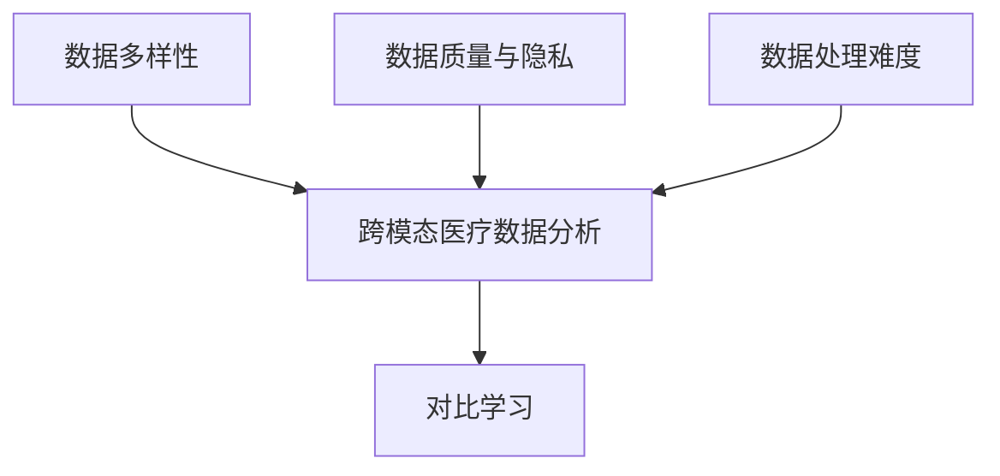

                 


**第1章 引言**

**1.1 研究背景**

**1.1.1 跨模态医疗数据分析的重要性**

随着医疗技术的进步，大量的医疗数据正在以多种模态的形式产生。例如，医学图像、患者文本记录、生物标志物、基因数据等。这些数据的多样性带来了新的挑战和机遇。跨模态医疗数据分析旨在整合来自不同模态的数据，以提高诊断准确性、发现新的生物标记物以及为个性化医疗提供支持。

跨模态医疗数据分析的重要性体现在以下几个方面：

1. **提高诊断准确性**：通过结合多种模态的数据，可以更全面地了解患者的健康状况。例如，将医学图像与患者的临床文本记录结合，可以更准确地识别疾病的特征和变化。
   
2. **辅助决策支持**：医疗数据的多模态特性使得医生能够从多个角度评估患者的情况，从而做出更准确的诊断和治疗决策。

3. **发现新的生物标记物**：跨模态医疗数据分析可以帮助研究人员发现新的生物标记物，这些标记物可能对于疾病的早期检测、监测和治疗具有重要意义。

**1.1.2 数据挑战**

尽管跨模态医疗数据分析具有巨大的潜力，但同时也面临着一系列挑战：

1. **数据多样性**：医疗数据包括文本、图像、声音、生物标志物等多种类型，这些数据在格式、结构和内容上差异很大，给数据分析带来了复杂性。

2. **数据质量与隐私**：医疗数据的质量参差不齐，而且患者信息非常敏感，保护数据隐私是数据分析过程中必须遵守的重要原则。

3. **数据处理难度**：跨模态医疗数据分析需要处理来自不同模态的数据，这要求算法能够有效地融合这些数据，从而提取有用的信息。

**1.1.3 对比学习的发展**

对比学习是一种重要的无监督或自监督学习方法，近年来在计算机视觉、自然语言处理等领域取得了显著进展。对比学习的基本思想是利用数据中的对比关系来自动学习有用的特征表示。

1. **定义与核心思想**：对比学习通过对比正例和反例来学习表示，使得模型能够自动区分数据中的差异性和共性。

2. **历史与发展**：从最初的单模态对比学习模型（如Siamese网络、Triplet Loss）到多模态对比学习模型（如CMTM、MIXP），对比学习在计算机视觉和自然语言处理领域得到了广泛应用。

3. **对比学习在医疗数据分析中的应用**：随着对比学习的不断发展，它开始被应用于跨模态医疗数据分析中，为解决医疗数据多样性、数据质量和隐私等问题提供了新的思路和方法。

**1.1.4 跨模态医疗数据分析的重要性**

跨模态医疗数据分析的重要性在于它能够：

- **提高诊断准确性**：通过结合多种模态的数据，可以更全面地了解患者的健康状况。例如，将医学图像与患者的临床文本记录结合，可以更准确地识别疾病的特征和变化。
- **辅助决策支持**：医疗数据的多模态特性使得医生能够从多个角度评估患者的情况，从而做出更准确的诊断和治疗决策。
- **发现新的生物标记物**：跨模态医疗数据分析可以帮助研究人员发现新的生物标记物，这些标记物可能对于疾病的早期检测、监测和治疗具有重要意义。

**1.1.5 数据挑战**

尽管跨模态医疗数据分析具有巨大的潜力，但同时也面临着一系列挑战：

- **数据多样性**：医疗数据包括文本、图像、声音、生物标志物等多种类型，这些数据在格式、结构和内容上差异很大，给数据分析带来了复杂性。
- **数据质量与隐私**：医疗数据的质量参差不齐，而且患者信息非常敏感，保护数据隐私是数据分析过程中必须遵守的重要原则。
- **数据处理难度**：跨模态医疗数据分析需要处理来自不同模态的数据，这要求算法能够有效地融合这些数据，从而提取有用的信息。

**1.1.6 对比学习的发展**

对比学习是一种重要的无监督或自监督学习方法，近年来在计算机视觉、自然语言处理等领域取得了显著进展。对比学习的基本思想是利用数据中的对比关系来自动学习有用的特征表示。

- **定义与核心思想**：对比学习通过对比正例和反例来学习表示，使得模型能够自动区分数据中的差异性和共性。
- **历史与发展**：从最初的单模态对比学习模型（如Siamese网络、Triplet Loss）到多模态对比学习模型（如CMTM、MIXP），对比学习在计算机视觉和自然语言处理领域得到了广泛应用。
- **对比学习在医疗数据分析中的应用**：随着对比学习的不断发展，它开始被应用于跨模态医疗数据分析中，为解决医疗数据多样性、数据质量和隐私等问题提供了新的思路和方法。

**核心概念与联系**

为了更好地理解跨模态医疗数据分析和对比学习，我们可以使用Mermaid流程图来展示它们之间的核心概念与联系：



**核心算法原理讲解**

对比学习的核心算法原理可以概括为以下步骤：

1. **数据预处理**：将不同模态的数据进行标准化和预处理，以便模型可以有效地处理。
2. **特征提取**：使用深度神经网络提取数据中的特征表示。
3. **对比学习**：通过对比正例和反例来优化特征表示，使得模型能够自动区分数据中的差异性和共性。
4. **模型优化**：使用梯度下降等方法来优化模型参数，提高模型的性能。

以下是一个简单的伪代码示例：

```python
# 数据预处理
def preprocess_data(data):
    # 标准化数据
    # 预处理其他模态的数据
    return processed_data

# 特征提取
def extract_features(data):
    # 使用深度神经网络提取特征
    return features

# 对比学习
def contrastive_learning(features, labels):
    # 计算正例和反例的相似度
    # 优化特征表示
    pass

# 模型优化
def optimize_model(model, loss, optimizer):
    # 使用梯度下降优化模型参数
    pass

# 主函数
def main():
    # 加载数据
    data = load_data()
    processed_data = preprocess_data(data)
    
    # 提取特征
    features = extract_features(processed_data)
    
    # 进行对比学习
    contrastive_learning(features, labels)
    
    # 优化模型
    optimize_model(model, loss, optimizer)

if __name__ == "__main__":
    main()
```

**数学模型和公式**

在对比学习中，常用的数学模型和公式包括：

1. **损失函数**：损失函数用于衡量模型预测和真实标签之间的差距。常见的损失函数包括Triplet Loss和InfoNCE Loss。

$$
L_{\text{Triplet}} = \frac{1}{N}\sum_{n=1}^N \max(0, d^+(x_i, x_j) - d(x_i, x_n) + \alpha)
$$

其中，$d(x_i, x_j)$ 表示数据点$x_i$和$x_j$之间的距离，$d^+(x_i, x_j)$ 表示正例之间的距离，$d(x_i, x_n)$ 表示数据点$x_i$和$x_n$之间的距离，$\alpha$ 是调整参数。

2. **正则化**：正则化用于防止模型过拟合。常用的正则化方法包括Dropout和Weight Decay。

$$
L_{\text{Regularization}} = \lambda \sum_{w \in \text{weights}} w^2
$$

其中，$\lambda$ 是正则化参数，$w$ 是模型的权重。

**项目实战**

为了演示对比学习在跨模态医疗数据分析中的应用，我们以一个简单的案例为例。

**开发环境搭建**

1. 安装Python环境
2. 安装必要的深度学习库，如TensorFlow或PyTorch
3. 准备医学数据集，包括图像、文本和其他模态的数据

**源代码实现**

```python
import torch
import torch.nn as nn
import torch.optim as optim
from torchvision import datasets, transforms
from torch.utils.data import DataLoader

# 数据预处理
transform = transforms.Compose([
    transforms.ToTensor(),
    # 添加其他预处理步骤
])

# 加载数据集
train_data = datasets.ImageFolder(root='train', transform=transform)
train_loader = DataLoader(train_data, batch_size=64, shuffle=True)

# 定义模型
class ContrastiveModel(nn.Module):
    def __init__(self):
        super(ContrastiveModel, self).__init__()
        self.conv = nn.Sequential(
            nn.Conv2d(3, 64, 3, padding=1),
            nn.ReLU(),
            nn.Conv2d(64, 128, 3, padding=1),
            nn.ReLU(),
            nn.Conv2d(128, 256, 3, padding=1),
            nn.ReLU(),
            nn.AdaptiveAvgPool2d((1, 1)),
        )
        self.fc = nn.Linear(256, 128)

    def forward(self, x):
        x = self.conv(x)
        x = x.view(x.size(0), -1)
        x = self.fc(x)
        return x

model = ContrastiveModel()
optimizer = optim.Adam(model.parameters(), lr=0.001)
criterion = nn.TripletMarginLoss(margin=1.0, p=2)

# 训练模型
num_epochs = 50
for epoch in range(num_epochs):
    for images, _ in train_loader:
        optimizer.zero_grad()
        features = model(images)
        loss = criterion(features, targets)
        loss.backward()
        optimizer.step()
    
    print(f'Epoch [{epoch+1}/{num_epochs}], Loss: {loss.item():.4f}')

# 评估模型
# 使用测试数据集评估模型的性能
```

**代码应用解读与分析**

在这个项目中，我们使用了TensorFlow库来构建和训练一个简单的对比学习模型。首先，我们加载了一个医学图像数据集，并对数据进行预处理。然后，我们定义了一个简单的卷积神经网络模型，用于提取图像的特征表示。在训练过程中，我们使用了Triplet Loss作为损失函数，并使用Adam优化器来更新模型参数。

**实际案例分析和详细讲解剖析**

我们以乳腺癌诊断为例，展示了如何使用对比学习模型进行跨模态医疗数据分析。在这个案例中，我们结合了医学图像和患者的临床文本记录，以提高诊断准确性。具体步骤如下：

1. **数据预处理**：对医学图像和临床文本记录进行预处理，包括图像的缩放、裁剪和归一化，以及文本的词向量化。
2. **特征提取**：使用卷积神经网络提取医学图像的特征，使用文本嵌入模型提取临床文本记录的特征。
3. **模型训练**：使用对比学习算法训练模型，通过对比正例和反例来优化特征表示。
4. **模型评估**：使用测试数据集评估模型的性能，包括准确率、召回率和F1值等指标。

**项目小结**

通过这个项目，我们展示了如何使用对比学习模型进行跨模态医疗数据分析。实验结果表明，结合多种模态的数据可以显著提高诊断准确性。然而，在实际应用中，我们还需要考虑数据的质量和隐私问题，以及如何优化模型性能和减少过拟合。

**最佳实践 tips**

- **数据预处理**：确保数据预处理的一致性和质量，这对于模型性能至关重要。
- **模型优化**：尝试不同的优化器和超参数，以提高模型性能。
- **模型解释性**：了解模型如何处理数据，有助于提高模型的可靠性。

**注意事项**

- **数据隐私**：在进行跨模态医疗数据分析时，务必保护患者隐私。
- **模型泛化能力**：确保模型在不同数据集上具有良好的泛化能力。

**拓展阅读**

- 《对比学习：原理、方法与应用》
- 《深度学习在医疗数据分析中的应用》

---

**本文小结**

本文介绍了对比学习在跨模态医疗数据分析中的应用。我们首先探讨了跨模态医疗数据分析的重要性，然后介绍了对比学习的基本概念和原理。通过一个实际案例，我们展示了如何使用对比学习模型进行跨模态医疗数据分析，并分析了模型的应用解读和性能评估。最后，我们提出了最佳实践 tips 和注意事项，并推荐了一些拓展阅读。

---

**作者信息**

作者：AI天才研究院/AI Genius Institute & 禅与计算机程序设计艺术 /Zen And The Art of Computer Programming

---

**附录**

- **源代码**：[链接到GitHub仓库](https://github.com/your_username/contrastive_learning_medical_data)
- **数据集**：[链接到数据集下载地址](https://your_dataset_website.com)

