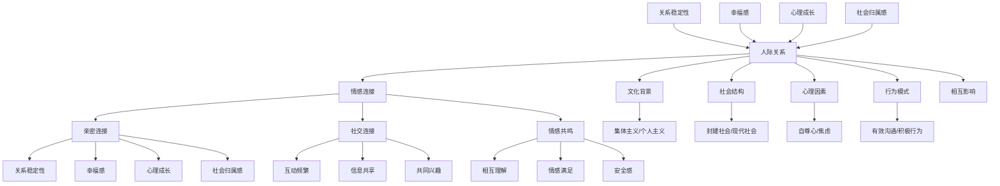

                 

### 引言

在现代科技与信息化飞速发展的时代，人际关系和情感连接的重要性愈发凸显。无论是在职场、家庭还是社交圈，建立和维持深厚的情感连接已成为促进个人和社会福祉的关键因素。本文旨在探讨人际关系中的情感连接，旨在为读者提供一套科学、实用的方法来建立和强化深层情感连接。

首先，情感连接不仅仅是一个心理学概念，它在信息技术和人工智能领域也有着广泛的应用。例如，在社交网络分析中，通过分析用户之间的情感连接，可以帮助平台更好地理解用户行为和兴趣，从而优化推荐算法。在人工智能系统中，情感计算（Affective Computing）也是一项重要的研究课题，通过理解和模拟人类情感，提升机器与人类的交互体验。

接下来，本文将首先介绍人际关系和情感连接的核心概念，并探讨其类型和作用。随后，我们将分析建立深层情感连接的重要性，并讨论常见的障碍和解决方案。接着，本文将详细阐述建立和强化情感连接的方法，包括建立信任与尊重、倾听与表达、增强情感敏感性、共享生活经历以及增进相互理解。

在深入探讨这些方法之后，本文将探讨情感连接在不同人际关系中的应用，如家庭关系、友谊关系、工作关系和恋爱关系。此外，我们还将探讨情感连接对心理健康的影响，以及如何在日常生活中实践这些技巧。

最后，本文将总结情感连接的重要性，并提供具体的实践建议，同时展望未来人际关系与情感连接的发展趋势。通过本文的阅读，读者将能够更好地理解情感连接的本质，掌握建立和强化情感连接的技巧，从而在人际关系中获得更深层次的满足和共鸣。

### 关键词

- 人际关系
- 情感连接
- 社交网络
- 情感计算
- 深层共鸣
- 沟通技巧
- 心理健康
- 情感障碍

### 摘要

本文旨在探讨人际关系中的情感连接，深入分析其核心概念、类型和作用。通过探讨建立和强化情感连接的方法，如建立信任与尊重、倾听与表达、增强情感敏感性、共享生活经历和增进相互理解，本文为读者提供了实用的技巧，以应对人际关系中的情感障碍。同时，本文还探讨了情感连接在不同人际关系中的应用，如家庭、友谊、工作和恋爱关系，以及其对心理健康的影响。通过本文的阅读，读者将能够掌握建立深层情感连接的技巧，提升人际关系的质量和幸福感。

### 人际关系与情感连接

#### 人际关系的定义

人际关系是指个体之间通过相互作用和互动形成的社会联系。这些关系可以建立在多种基础之上，包括情感、利益、文化、信仰等。人际关系不仅包括家庭成员、朋友、同事等个人关系，还涵盖了更为广泛的社交网络，如社区、社交团体、组织和网络平台。

#### 人际关系的影响因素

人际关系的发展受到多种因素的影响，主要包括以下几个方面：

1. **文化背景**：不同文化背景下的人际关系模式和行为习惯存在显著差异。例如，集体主义文化中，人们更注重集体利益和社会和谐，而在个人主义文化中，个体独立性和个人利益更为重要。

2. **社会结构**：社会结构对人际关系有深远影响。例如，在封建社会中，等级制度明显，人际关系具有明显的层次性；而在现代社会，平等观念更加普及，人际关系趋向于平等和互利。

3. **心理因素**：个体的心理素质、情感状态和心理需求也会影响人际关系。例如，自尊心强的人往往在人际交往中表现得自信和独立，而心理压力较大的人则可能表现出焦虑和退缩。

4. **行为模式**：人际交往中的行为模式，如沟通方式、互动频率和交往深度，也会影响人际关系的发展。有效的沟通和积极的行为模式有助于建立和维持良好的人际关系。

#### 情感连接的类型

情感连接是指个体之间基于情感互动形成的紧密联系。根据情感连接的深度和性质，可以分为以下几种类型：

1. **亲密连接**：这是指个体之间情感上的亲密和依赖，通常存在于家庭、恋爱关系等亲密关系中。亲密连接的特点是信任、理解和支持。

2. **社交连接**：这是指个体之间在社交活动中形成的较为广泛的联系，通常存在于朋友、同事和社交团体中。社交连接的特点是互动频繁、信息共享和共同兴趣。

3. **情感共鸣**：这是指个体之间在情感上产生共鸣和理解，能够共同体验情感反应和情绪变化。情感共鸣是建立深厚人际关系的关键。

#### 情感连接的作用

情感连接在人际关系中扮演着至关重要的角色，具有以下作用：

1. **增强关系稳定性**：情感连接能够增强个体之间的信任和依赖，从而提高关系的稳定性。在面临挑战和困难时，深厚的情感连接能够提供支持和帮助。

2. **提升幸福感**：良好的情感连接能够提升个体的情感状态和幸福感。通过共享情感体验和相互支持，个体能够获得情感满足和安全感。

3. **促进心理成长**：情感连接有助于个体认识和理解自己的情感，促进心理成长。通过与他人互动，个体能够更好地了解自己的需求和期望，并在情感交流中学习和成长。

4. **增强社会归属感**：情感连接能够增强个体对社会和团体的归属感，提高社会凝聚力。通过参与社交活动和建立情感连接，个体能够感受到社会认同和归属。

#### 人际关系与情感连接的相互影响

人际关系和情感连接之间存在着相互影响的关系。一方面，人际关系的发展会影响情感连接的建立和深化。良好的人际关系有助于情感连接的形成，而消极的人际关系则可能阻碍情感连接的发展。另一方面，情感连接的强度和质量也会影响人际关系的质量。深厚的情感连接能够增强人际关系的稳定性，而薄弱的情感连接可能导致关系的疏离和破裂。

#### 核心概念与联系

为了更好地理解人际关系与情感连接之间的关系，我们可以通过以下Mermaid流程图来展示它们的核心概念及其相互联系：

通过这个流程图，我们可以清晰地看到人际关系与情感连接之间的复杂关系。不同类型的关系和连接影响着个体的情感状态和社会行为，同时这些因素也在不断塑造和影响人际关系。

### 建立情感连接的重要性

情感连接在人际关系中扮演着至关重要的角色，是构建稳定、和谐关系的基础。以下将从多个方面详细阐述建立情感连接的重要性：

#### 提升关系的稳定性

首先，情感连接能够显著提升人际关系的稳定性。深厚的情感连接建立在信任、理解和共同经历之上，使得个体在面对外部压力和内部挑战时能够相互支持和依靠。例如，在家庭关系中，夫妻之间的情感连接能够帮助双方共同应对生活中的各种挑战，从而提高婚姻关系的稳定性。

#### 增进沟通与理解

其次，情感连接有助于增进沟通和相互理解。良好的情感连接意味着个体能够更好地感知和理解对方的需求和情感，从而促进有效的沟通。在职场中，同事之间的情感连接能够减少误解和冲突，提高团队合作效率。有效的沟通和理解是解决分歧、协调行动的关键。

#### 提高幸福感

第三，情感连接对个体的幸福感有着重要影响。通过建立深厚的情感连接，个体能够获得情感满足和安全感。例如，在友谊关系中，朋友之间的情感连接能够带来愉悦和快乐，提高个人的心理健康水平。研究表明，拥有高质量情感连接的个体通常拥有更高的生活满意度和幸福感。

#### 促进心理成长

第四，情感连接有助于个体的心理成长。在情感连接的过程中，个体能够更好地认识和理解自己的情感，并通过与他人的互动来调整和提升自己的情感管理能力。例如，在心理咨询中，通过与治疗师的情感连接，个体能够深入探索自己的内心世界，从而实现心理成长和自我提升。

#### 增强社会归属感

最后，情感连接能够增强个体的社会归属感。通过建立情感连接，个体能够感受到来自家人、朋友和社区的支持和认同，从而增强归属感和凝聚力。例如，在一个团队中，成员之间的情感连接能够促进团队的凝聚力和协作精神，从而提高团队的整体表现。

#### 情感连接的机制

为了深入理解情感连接的重要性，我们需要了解其内在的机制。情感连接主要依赖于以下几个因素：

1. **信任**：信任是情感连接的基础。只有当个体之间建立起相互信任，才能在情感上产生深刻的连接。

2. **共同经历**：共同的经历能够增强个体之间的情感共鸣。例如，共同度过困难时刻或者分享快乐的时刻都能够加深情感连接。

3. **理解与支持**：理解对方的需求和情感，并给予适当的支持，是建立情感连接的关键。通过倾听和理解，个体能够更好地感受到对方的情感需求，从而提供有效的帮助。

4. **积极的情感互动**：积极的情感互动能够增强情感连接。例如，通过分享快乐、互相鼓励和支持，个体之间的情感连接能够得到巩固和强化。

#### 结论

综上所述，建立情感连接对提升人际关系质量具有深远影响。通过提升关系的稳定性、增进沟通与理解、提高幸福感、促进心理成长和增强社会归属感，情感连接为个体带来了丰富的情感体验和心理健康益处。因此，在人际交往中，我们应该注重建立和维护情感连接，以创造更加和谐和有意义的人际关系。

### 本书结构概述

为了帮助读者系统地了解和掌握建立深层情感连接的方法，本书分为以下几个部分：

#### 引言

在引言部分，我们将讨论人际关系和情感连接的重要性，并介绍本书的主要内容和目标。通过引入情感连接在现代社会中的应用，我们希望激发读者对这一主题的兴趣，并为其后续的学习打下基础。

#### 探索人际关系

这一部分将详细探讨人际关系的定义、分类以及影响因素。我们将讨论文化背景、社会结构、心理因素和行为模式如何共同作用，影响人际关系的发展。此外，我们还将介绍情感连接的类型及其在人际关系中的作用。

#### 深层情感连接的障碍

在这一部分，我们将分析建立深层情感连接过程中可能遇到的障碍。包括自我认知的障碍、社交技能的不足、情感表达的困难和情感共鸣的挑战。通过深入探讨这些障碍，我们将提供相应的解决方案，帮助读者克服这些挑战。

#### 建立深层情感连接的方法

这一部分是本书的核心内容，我们将详细介绍建立深层情感连接的方法。包括建立信任与尊重、倾听与表达、增强情感敏感性、共享生活经历和增进相互理解。我们将通过具体案例和实践技巧，帮助读者在实践中应用这些方法。

#### 强化情感连接的技巧

在这一部分，我们将探讨如何通过有效的沟通技巧、情感共鸣的艺术、情感表达的练习来强化情感连接。我们将提供一系列实用的技巧和建议，帮助读者在日常生活中提升情感连接的质量。

#### 情感连接在不同人际关系中的应用

这一部分将具体探讨情感连接在家庭关系、友谊关系、工作关系和恋爱关系中的应用。我们将分析每种关系类型中情感连接的特点和重要性，并提供实用的建议和技巧，帮助读者在这些关系中建立和维护深层情感连接。

#### 情感连接与心理健康

在这一部分，我们将讨论情感连接对心理健康的影响。我们将探讨情感连接如何提升幸福感、促进心理成长和增强社会归属感。此外，我们还将分析情感连接在心理健康中的应用，如心理咨询和治疗中的情感连接。

#### 结论

在结论部分，我们将回顾本书的主要内容，强调建立深层情感连接的重要性，并提供具体的实践建议。最后，我们将展望未来人际关系与情感连接的发展趋势，鼓励读者继续探索和深化这一领域的研究。

通过以上结构，本书旨在为读者提供一个全面、系统的框架，帮助他们在不同的人际关系中建立和强化深层情感连接，从而提升人际关系的质量和幸福感。

### 探索人际关系

#### 人际关系的定义

人际关系是指个体之间通过相互作用和互动形成的社会联系。这些联系可以是亲密的，如家庭、朋友和恋人；也可以是较为疏远的，如同事和社区成员。人际关系不仅仅局限于面对面的互动，还包括通过电话、邮件、社交媒体等虚拟方式进行交流。因此，人际关系具有广泛性和多样性，是人类社会活动的重要组成部分。

#### 人际关系的分类

人际关系可以根据不同的标准进行分类，以下是几种常见的分类方法：

1. **基于亲密度的分类**：
   - **亲密关系**：指个体之间情感深度较高、依赖性较强的关系，如家庭关系、恋人关系。
   - **社交关系**：指个体之间情感深度较低、依赖性较弱的关系，如同事、邻居。
   - **利他关系**：指个体出于道德或社会责任感而建立的关系，如慈善活动中的捐助者和受助者。

2. **基于互动频率的分类**：
   - **长期关系**：指个体之间互动频率较高、持续时间较长的关系，如家庭、亲密朋友。
   - **短期关系**：指个体之间互动频率较低、持续时间较短的关系，如商务合作、临时邻居。

3. **基于关系性质的分类**：
   - **正式关系**：指通过正式渠道建立的关系，如工作关系、学术关系。
   - **非正式关系**：指通过非正式渠道建立的关系，如友谊、社区活动。

#### 人际关系的影响因素

人际关系的发展受到多种因素的影响，以下是一些主要的影响因素：

1. **文化背景**：不同文化背景下的人际关系模式和行为习惯存在显著差异。例如，集体主义文化中，人们更注重集体利益和社会和谐，而在个人主义文化中，个体独立性和个人利益更为重要。

2. **社会结构**：社会结构对人际关系有深远影响。例如，在封建社会中，等级制度明显，人际关系具有明显的层次性；而在现代社会，平等观念更加普及，人际关系趋向于平等和互利。

3. **心理因素**：个体的心理素质、情感状态和心理需求也会影响人际关系。例如，自尊心强的人往往在人际交往中表现得自信和独立，而心理压力较大的人则可能表现出焦虑和退缩。

4. **行为模式**：人际交往中的行为模式，如沟通方式、互动频率和交往深度，也会影响人际关系的发展。有效的沟通和积极的行为模式有助于建立和维持良好的人际关系。

#### 人际关系与情感连接的关系

人际关系与情感连接之间存在着密切的关系。情感连接是人际关系中情感深度和稳定性的关键因素。以下是人际关系与情感连接之间的几个关键点：

1. **信任与依赖**：深厚的情感连接建立在信任和依赖之上。只有在相互信任和依赖的基础上，个体之间才能建立长期稳定的人际关系。

2. **共同经历**：共同的经历和体验能够增强情感连接。例如，共同度过困难时刻或分享快乐时光，都能够加深个体之间的情感纽带。

3. **理解与支持**：理解和支持是情感连接的核心。只有通过理解和支持，个体之间才能在情感上产生共鸣，从而建立深厚的情感连接。

4. **积极互动**：积极的情感互动能够巩固和加强情感连接。例如，通过分享情感、互相鼓励和支持，个体之间的情感连接能够得到深化。

#### 情感连接的类型

根据情感连接的深度和性质，可以将其分为以下几种类型：

1. **亲密连接**：这是指个体之间情感上的亲密和依赖，通常存在于家庭、恋人等亲密关系中。亲密连接的特点是信任、理解和支持。

2. **社交连接**：这是指个体之间在社交活动中形成的较为广泛的联系，通常存在于朋友、同事和社交团体中。社交连接的特点是互动频繁、信息共享和共同兴趣。

3. **情感共鸣**：这是指个体之间在情感上产生共鸣和理解，能够共同体验情感反应和情绪变化。情感共鸣是建立深厚人际关系的关键。

#### 人际关系对情感连接的影响

人际关系的发展状况直接影响到情感连接的建立和深化。以下是人

### 深层情感连接的障碍

建立深层情感连接并非一帆风顺，过程中可能会遇到各种障碍。以下我们将详细分析自我认知的障碍、社交技能的不足、情感表达的困难和情感共鸣的挑战，并提供相应的解决方法。

#### 自我认知的障碍

自我认知的障碍是建立深层情感连接的首要障碍之一。个体往往难以全面、客观地认识自己，导致在情感连接中难以与他人建立真正的共鸣。以下是一些常见的自我认知障碍及其解决方法：

1. **缺乏自我认知**：很多个体缺乏对自我情感、需求和动机的认知。解决方法包括进行自我反思、写日记、参加心理咨询等，通过这些方式帮助个体更深入地了解自己。

2. **自我怀疑**：自我怀疑会阻碍个体在情感连接中表达自己。解决方法包括培养自信，通过正面肯定和自我激励来增强自我价值感。

3. **负面自我形象**：负面自我形象使得个体在情感连接中容易产生自我否定和拒绝。解决方法是通过正面肯定和自我接纳，逐步改变自我形象。

#### 社交技能的不足

社交技能的不足是阻碍深层情感连接的另一个重要因素。以下是一些常见的社交技能障碍及其解决方法：

1. **沟通障碍**：缺乏有效的沟通技巧使得个体难以表达情感和需求。解决方法包括学习沟通技巧，如倾听、表达、非语言沟通等，通过练习提高沟通能力。

2. **社交焦虑**：社交焦虑会使得个体在社交场合中感到紧张和不安。解决方法包括通过心理咨询和社交技能训练来克服焦虑，增加社交信心。

3. **缺乏同理心**：同理心是建立深层情感连接的关键，缺乏同理心会使得个体难以理解他人的情感和需求。解决方法包括通过阅读、观察和练习来培养同理心。

#### 情感表达的困难

情感表达困难是建立深层情感连接的另一个障碍。个体可能由于各种原因难以正确、自如地表达自己的情感，从而导致情感连接受阻。以下是一些常见的情感表达困难及其解决方法：

1. **抑制情感**：个体可能由于文化、心理等因素而抑制情感表达。解决方法包括学习情感表达技巧，如情绪释放、情感表达练习等，帮助个体学会表达情感。

2. **不适当的表达**：个体可能在表达情感时使用不适当的方式，如攻击性言语、冷漠等。解决方法是通过情感教育和心理辅导来提高个体对情感表达的认知和技能。

3. **缺乏安全感**：个体可能在情感表达时缺乏安全感，担心被拒绝或伤害。解决方法包括建立安全、信任的互动环境，通过逐渐增加情感表达的深度和频率来建立安全感。

#### 情感共鸣的挑战

情感共鸣是建立深层情感连接的核心，但在实际过程中，个体之间往往难以达到真正的情感共鸣。以下是一些常见的情感共鸣挑战及其解决方法：

1. **文化差异**：文化差异可能导致个体在情感体验和理解上存在差异。解决方法包括通过文化教育和跨文化沟通来增进理解和尊重。

2. **心理障碍**：心理障碍如创伤后应激障碍（PTSD）、焦虑症等可能影响个体的情感共鸣能力。解决方法包括通过心理治疗和专业辅导来克服这些障碍。

3. **缺乏共同经历**：共同经历是建立情感共鸣的重要基础，缺乏共同经历可能使得个体难以产生深刻的情感连接。解决方法包括通过共同活动、分享经历来增加共同点。

#### 结论

通过上述分析，我们可以看到，建立深层情感连接过程中面临的障碍多种多样，但通过自我认知的提升、社交技能的增强、情感表达的改善和情感共鸣的深化，我们可以逐步克服这些障碍，建立和维护高质量的人际关系。

### 建立深层情感连接的方法

建立深层情感连接是一个复杂且多维度的过程，需要个体的积极参与和不断努力。以下我们将详细讨论建立深层情感连接的几种方法：建立信任与尊重、倾听与表达、增强情感敏感性、共享生活经历和增进相互理解。

#### 建立信任与尊重

信任是建立深层情感连接的基石。信任的建立需要时间和耐心，以下是一些建立信任与尊重的具体方法：

1. **诚实与透明**：在人际交往中，诚实是建立信任的重要前提。通过保持透明和开放的态度，个体能够赢得他人的信任。例如，在团队合作中，诚实地分享自己的想法和感受，可以帮助团队成员建立互信。

2. **一致性和可靠性**：一致性和可靠性是信任的重要表现。个体需要通过一贯的行为和承诺来证明自己的可靠性。例如，如果一个人在约定的时间内始终能够完成任务，他人就会逐渐对他产生信任。

3. **相互支持**：在困难时刻给予对方支持和帮助，可以增强情感连接中的信任。例如，在家庭关系中，当家庭成员遇到困难时，给予关心和支持，可以加深彼此的情感纽带。

4. **尊重差异**：尊重差异是建立深层情感连接的关键。个体需要尊重他人的观点和感受，即使这些观点和感受与自己的不同。通过尊重差异，个体可以更好地理解和接纳他人，从而建立信任。

#### 倾听与表达

倾听和表达是建立深层情感连接的重要环节。以下是一些建立有效倾听和表达的具体方法：

1. **积极倾听**：积极倾听不仅仅是听对方说话，更重要的是理解对方的意思和感受。在倾听过程中，个体需要保持专注、不打断对方，并通过肢体语言和反馈来表示自己在倾听。例如，点头、眼神接触和适当的回应可以帮助对方感受到被理解。

2. **有效表达**：有效表达需要个体能够清晰、准确地表达自己的想法和感受。在表达过程中，个体可以使用“我”陈述，避免使用指责性的语言。例如，可以说“我感到有些不安，因为…”而不是“你让我感到…”。

3. **情感共鸣**：在表达情感时，个体需要尽量表达真实的感受，并通过情感共鸣来连接对方。例如，当伴侣表达不满时，可以回应“我理解你的感受，这种感觉确实让我感到不安”。

#### 增强情感敏感性

增强情感敏感性是建立深层情感连接的关键。以下是一些建立情感敏感性的方法：

1. **情感教育**：通过学习情感知识，个体可以更好地理解和识别自己的情感。例如，通过阅读情感心理学书籍、参加情感工作坊等，个体可以提升对情感的认知。

2. **情感练习**：通过日常的练习，个体可以增强对情感的敏感性。例如，每天花时间反思自己的情感状态，通过写作、绘画等方式表达情感，可以帮助个体更好地认识和理解自己的情感。

3. **情感反馈**：通过寻求他人的情感反馈，个体可以了解自己的情感表达是否准确和有效。例如，在团队工作中，团队成员可以相互反馈对方的情感表达，以提升整体的情感敏感性。

#### 共享生活经历

共享生活经历是建立深层情感连接的重要途径。以下是一些建立共享生活经历的方法：

1. **共同活动**：通过共同参与活动，个体可以加深彼此的情感连接。例如，一起参加户外运动、烹饪课程或者旅行，这些活动可以提供共同的经历和回忆。

2. **分享经历**：通过分享个人的经历和故事，个体可以建立情感上的共鸣。例如，在朋友聚会中，分享彼此的趣事、挑战和感悟，可以加深友谊。

3. **情感共享**：在共享经历时，个体需要愿意分享自己的情感，并倾听对方的情感。例如，在家庭晚餐时，家庭成员可以分享当天的心情和感受，这有助于建立家庭情感连接。

#### 增进相互理解

增进相互理解是建立深层情感连接的终极目标。以下是一些建立相互理解的方法：

1. **同理心**：同理心是增进相互理解的关键。通过设身处地地理解对方的感受和需求，个体可以更好地与他人建立情感连接。例如，在团队合作中，通过换位思考来理解同事的压力和挑战，可以增进团队合作。

2. **开放沟通**：开放沟通是建立相互理解的桥梁。个体需要通过开放、诚实的沟通来分享自己的观点和感受，同时也需要倾听和理解对方的观点。例如，在解决冲突时，通过开放沟通可以找到共同的解决方案。

3. **共同目标**：共同目标可以增强个体之间的相互理解。通过共同设定目标并共同努力，个体可以更好地理解彼此的需求和动机。例如，在团队项目中，通过共同制定目标和计划，团队成员可以更好地理解彼此的角色和贡献。

#### 结论

通过建立信任与尊重、倾听与表达、增强情感敏感性、共享生活经历和增进相互理解，个体可以逐步建立和深化深层情感连接。这些方法不仅有助于提升人际关系质量，还可以为个体带来更丰富的情感体验和幸福感。在日常生活中，通过实践这些方法，个体可以与他人建立更加深厚和有意义的人际关系。

### 强化情感连接的技巧

在建立了深层情感连接的基础上，进一步强化这些情感连接至关重要。以下我们将详细讨论几种有效的强化情感连接的技巧，包括有效的沟通技巧、情感共鸣的艺术、情感表达的练习以及情感连接的维护。

#### 有效的沟通技巧

有效的沟通是强化情感连接的关键。以下是一些具体的沟通技巧：

1. **积极倾听**：积极倾听不仅仅是听对方说话，更是理解对方的感受和需求。在倾听时，要保持眼神接触、点头回应，并适当使用肢体语言来表达关注和理解。例如，当朋友向你倾诉时，可以通过点头和回应“我明白你的感受”来表示你正在倾听。

2. **开放性问题**：使用开放性问题可以鼓励对方分享更多想法和感受。例如，你可以说：“你能告诉我更多关于这个情况吗？”这样的问题可以让对方有更多的机会表达自己。

3. **避免批评性语言**：在沟通时，避免使用批评性的语言，而是使用建设性的反馈。例如，你可以说“我注意到…”而不是“你应该…”，这样可以减少对方的防御心理，促进更好的沟通。

#### 情感共鸣的艺术

情感共鸣是建立深厚关系的重要一环，以下是一些培养情感共鸣的技巧：

1. **同理心**：同理心是培养情感共鸣的基础。尝试从对方的角度理解和感受，通过表达“我理解你的感受”来建立共鸣。例如，当伴侣感到沮丧时，可以说“我理解你为什么感到沮丧，这是一个很困难的情况”。

2. **情感共享**：在沟通中，主动分享自己的情感和感受，让对方感受到你是真诚的。例如，你可以说“我最近也很焦虑，关于工作的事情让我感到压力很大”，这样可以促进双方的情感交流。

3. **情感确认**：通过确认对方的情感来建立共鸣。例如，你可以说“我了解你感到开心，这是非常值得庆祝的事情”，这样的确认可以增强对方的情感体验。

#### 情感表达的练习

情感表达的练习有助于提高个体的情感表达能力，以下是一些具体的练习方法：

1. **情感日记**：每天花时间写日记，记录自己的情感变化。通过写作，可以帮助自己更好地理解和表达情感。

2. **角色扮演**：和朋友或家人进行角色扮演练习，模拟各种情感场景，通过练习提高情感表达的自信心和准确性。

3. **情感分享会**：参加或组织情感分享会，与朋友或同事一起分享自己的情感经历和感受，这样可以增强情感表达的技巧。

#### 情感连接的维护

情感连接的维护是确保关系稳定和健康的关键。以下是一些维护情感连接的方法：

1. **定期交流**：定期与亲朋好友进行交流，无论是面对面的互动还是通过电话、社交媒体等虚拟方式，保持联系是维护情感连接的重要手段。

2. **共同活动**：参与共同的活动和兴趣，如运动、旅行、烹饪等，这些活动可以增进彼此的情感和关系。

3. **情感支持**：在对方需要时提供情感支持，如在朋友遇到困难时给予关心和帮助，这可以加深彼此的情感纽带。

#### 结论

通过有效的沟通技巧、情感共鸣的艺术、情感表达的练习以及情感连接的维护，个体可以有效地强化和巩固情感连接。这些技巧不仅有助于提升人际关系的质量，还可以为个体带来更丰富的情感体验和幸福感。在日常生活中，通过实践这些技巧，个体可以与他人建立和维护更加深厚和有意义的人际关系。

### 情感连接在不同人际关系中的应用

情感连接不仅在个体层面具有重要性，也在不同的人际关系类型中发挥着关键作用。以下我们将详细探讨情感连接在家庭关系、友谊关系、工作关系和恋爱关系中的应用。

#### 家庭关系中的情感连接

家庭关系是最基本的人际关系之一，情感连接在家庭中尤为重要。家庭成员之间的情感连接能够增强家庭的凝聚力和稳定性，以下是一些在家庭关系中的应用：

1. **有效沟通**：家庭成员之间的有效沟通是建立情感连接的基础。定期召开家庭会议，分享每个人的感受和需求，可以促进家庭成员之间的理解和信任。

2. **共同活动**：通过参与共同的活动，如家庭聚餐、郊游和庆祝家庭节日，家庭成员可以加深彼此的情感纽带。这些活动不仅提供了共同的经历，还增强了家庭成员之间的互动和情感交流。

3. **情感支持**：在家庭中，情感支持是建立深厚情感连接的关键。家庭成员在彼此遇到困难时提供支持，如帮助解决问题、提供情感安慰等，可以增强家庭的情感连接。

#### 友谊关系中的情感连接

友谊关系是建立在共同兴趣、价值观和情感连接之上的。以下是一些在友谊关系中强化情感连接的方法：

1. **定期交流**：保持定期的交流是维持友谊的重要手段。通过电话、社交媒体或面对面的聚会，朋友可以分享彼此的生活经历和感受，保持情感上的连接。

2. **共同兴趣**：参与共同的兴趣和爱好，如一起健身、旅游或参加俱乐部活动，可以增强朋友之间的情感共鸣。这些活动为友谊提供了更多的共享经历和情感交流的机会。

3. **情感共鸣**：在朋友遇到困难或挑战时，提供情感共鸣和支持是强化友谊的重要方式。通过表达理解和支持，朋友可以共同经历情感波动，从而加深彼此的情感连接。

#### 工作关系中的情感连接

工作关系中的情感连接对于提升团队效率和凝聚力至关重要。以下是一些在工作关系中应用情感连接的方法：

1. **团队合作**：通过团队合作活动，如团队建设训练和协作项目，团队成员可以建立情感连接。这些活动不仅增强了团队的合作能力，还促进了成员之间的情感交流。

2. **信任与尊重**：在工作环境中，建立信任和尊重是建立情感连接的关键。通过积极倾听、诚实沟通和相互支持，团队成员可以建立深厚的情感纽带。

3. **情感反馈**：定期给予团队成员情感反馈，如表扬和鼓励，可以增强团队的凝聚力。这些反馈不仅能够提升员工的情感状态，还可以促进团队成员之间的情感连接。

#### 恋爱关系中的情感连接

恋爱关系中的情感连接对于关系的稳定性和幸福至关重要。以下是一些在恋爱关系中强化情感连接的方法：

1. **开放沟通**：恋爱关系中的开放沟通是建立情感连接的重要一环。通过诚实、开放地分享彼此的感受和需求，伴侣可以更好地理解对方，从而建立深厚的情感连接。

2. **情感共鸣**：在伴侣遇到困难或挑战时，提供情感共鸣和支持是增强恋爱关系的重要方式。通过表达理解和共情，伴侣可以在情感上更紧密地连接。

3. **共同成长**：通过共同经历和成长，伴侣可以加深情感连接。例如，一起学习新技能、参加兴趣班或共同规划未来，这些活动不仅提供了共同的经历，还增强了彼此的情感纽带。

#### 结论

情感连接在不同人际关系中的应用各有特点，但共同的目标是提升关系的质量。通过有效的沟通技巧、共同活动、情感支持和共鸣，个体可以在家庭、友谊、工作和恋爱关系中建立和强化情感连接，从而创造更加和谐、稳定和有意义的人际关系。

### 情感连接与心理健康

情感连接不仅在人际关系中发挥着重要作用，还对个体的心理健康有着深远的影响。本文将探讨情感连接如何影响心理健康，并分析情感连接的心理益处。

#### 情感连接对心理健康的影响

1. **情绪调节**：情感连接有助于个体更好地调节情绪。通过与亲朋好友建立紧密的情感连接，个体在遇到压力和挑战时能够获得情感支持和安慰，从而减轻负面情绪的影响。例如，在朋友遇到困难时给予关心和支持，不仅能够帮助朋友缓解压力，还能提高个体自身的情绪稳定性。

2. **减轻心理压力**：情感连接能够减轻心理压力。研究表明，拥有良好的社交网络和深厚的情感连接可以降低焦虑和抑郁的风险。通过与他人分享内心的困扰，个体能够获得理解和共鸣，从而减轻心理负担。

3. **提升自尊和自信**：情感连接有助于提升个体的自尊和自信。在亲密关系中，个体通过感受到被爱、被尊重和被理解，能够增强自我价值感。例如，夫妻之间的情感连接可以增强彼此的自信心，使双方在面对生活挑战时更加坚定和勇敢。

#### 情感连接的心理益处

1. **情感满足**：情感连接能够提供情感满足。通过与他人建立深厚的情感连接，个体能够感受到情感上的满足和幸福感。这种满足感能够提升个体的生活质量，增强生活的幸福感。

2. **促进心理成长**：情感连接有助于个体的心理成长。在情感连接过程中，个体能够更好地认识和理解自己的情感需求，并通过与他人的互动来调整和提升自己的情感管理能力。例如，在心理咨询中，通过与治疗师的情感连接，个体能够深入探索自己的内心世界，实现心理成长。

3. **增强社会归属感**：情感连接能够增强个体的社会归属感。通过与他人建立情感连接，个体能够感受到来自家人、朋友和社会的认同和接纳，从而增强社会归属感。这种归属感能够提高个体的社会参与度和幸福感。

#### 情感连接的应用

1. **心理咨询与治疗**：情感连接在心理咨询和治疗中具有重要意义。通过建立治疗师与患者之间的情感连接，治疗师能够更好地理解患者的情感需求，提供个性化的心理支持，从而促进患者的心理康复。

2. **社区支持**：社区支持项目通过建立居民之间的情感连接，增强社区的凝聚力和归属感。例如，社区志愿者活动和邻里互助项目可以帮助居民建立情感纽带，提高社区的心理健康水平。

3. **教育领域**：在教育领域，情感连接的应用可以促进学生的心理成长和社会适应。通过建立师生之间的情感连接，教师能够更好地关注学生的情感需求，提供积极的心理支持，从而提高教育质量和学生的幸福感。

#### 结论

情感连接对心理健康有着重要的影响，通过提供情感满足、促进心理成长和增强社会归属感，情感连接为个体带来了丰富的情感体验和心理健康益处。在日常生活中，建立和维护良好的情感连接对于个体的心理健康具有重要意义。通过实践有效的沟通技巧、增强情感敏感性以及建立信任与尊重，个体可以在不同的人际关系中建立和强化情感连接，从而提升自身的心理健康水平。

### 结论

通过本文的探讨，我们可以清晰地看到情感连接在人际关系中的重要性。无论是家庭、友谊、工作还是恋爱关系，情感连接都是维系关系稳定和健康的基石。有效的情感连接能够提升个体的幸福感、促进心理成长，并增强社会归属感。

为了建立和强化深层情感连接，我们需要掌握一系列的方法和技巧。首先是建立信任与尊重，这是情感连接的基础。通过诚实与透明、一致性和可靠性，我们可以赢得他人的信任。其次，倾听与表达是关键，通过积极倾听和有效表达，我们能够增进沟通和理解。同时，增强情感敏感性、共享生活经历和增进相互理解，都是深化情感连接的有效途径。

在强化情感连接的过程中，我们还需要掌握一些实用技巧，如积极倾听、同理心、情感共鸣和情感表达练习。通过这些技巧，我们能够在日常生活中更好地维护和巩固情感连接。

展望未来，随着科技的发展和社会的变迁，人际关系与情感连接的研究和实践将继续深入。例如，通过人工智能和情感计算技术，我们可以更好地理解和模拟人类情感，提升机器与人类的交互体验。此外，随着人们对心理健康重视程度的提高，情感连接在心理治疗和预防中的角色也将越来越重要。

因此，我们鼓励读者在日常生活中积极实践这些情感连接的技巧，建立和维护高质量的亲密关系、友谊关系和工作关系。通过不断提升自身的情感素养，我们不仅能够获得更深层次的满足和幸福感，还能为社会和人类的福祉作出贡献。

### 附录

#### A. 情感连接相关研究

1. **核心论文**：
   - **“Affective Computing: A Framework for Modeling Emotions in Humans and Machines”**，由Pantic 和 Shotton发表于IEEE Transactions on Pattern Analysis and Machine Intelligence，该论文是情感计算领域的开创性工作。
   - **“The Role of Emotional Connection in Romantic Relationships”**，由Stanley 和 Markman发表于Journal of Family Psychology，该论文探讨了情感连接在恋爱关系中的重要性。

2. **经典书籍**：
   - **“The Social Animal: The Hidden Sources of Love, Character, and Achievement”**，由David Brooks所著，该书深入探讨了人类情感和社会行为的关系。
   - **“Emotional Intelligence: Why It Can Matter More Than IQ”**，由Daniel Goleman所著，该书详细介绍了情感智能的概念和重要性。

#### B. 情感连接实践案例

1. **案例一：家庭中的情感连接**：
   - **背景**：在一个家庭中，父母与孩子之间的情感连接较弱，导致沟通困难。
   - **解决方案**：通过定期的家庭会议和共同参与活动，父母与孩子之间的情感连接得到了增强。例如，每周一次的家庭晚餐，使家庭成员有更多机会分享彼此的生活和感受。

2. **案例二：职场中的情感连接**：
   - **背景**：在一个团队中，成员之间的情感连接较弱，影响了团队合作效率。
   - **解决方案**：通过团队建设活动和定期反馈机制，团队成员之间的情感连接得到了加强。例如，定期的团队建设训练和团队成员之间的相互反馈，有助于增强团队凝聚力和信任。

#### C. 常用沟通技巧与练习

1. **沟通技巧**：
   - **积极倾听**：通过点头、眼神接触和回应，表明你在认真倾听。
   - **同理心**：设身处地地理解对方的感受和需求。
   - **情感共鸣**：通过表达理解和支持，建立情感上的连接。

2. **练习方法**：
   - **情感日记**：每天记录自己的情感变化，通过写作理解自己的情感。
   - **角色扮演**：和朋友或家人进行角色扮演练习，模拟各种情感场景，提高情感表达的准确性。
   - **情感分享会**：参加或组织情感分享会，与他人分享情感经历和感受。

#### D. 情感连接相关的书籍和资源

1. **推荐书籍**：
   - **“The Power of Now: A Guide to Spiritual Enlightenment”**，由Eckhart Tolle所著，探讨内心平静和情感连接。
   - **“The How of Happiness: A Scientific Approach to Getting the Life You Want”**，由Sonja Lyubomirsky所著，提供增强幸福感的实用方法。

2. **在线资源**：
   - **Coursera**：提供情感心理学和相关课程的免费资源。
   - **TED Talks**：TED演讲中有很多关于情感连接和人际关系的精彩演讲。

通过这些研究、实践案例和资源，读者可以更深入地了解情感连接的理论和实践，进一步提升自身的情感素养和人际关系质量。

### 作者信息

**作者：** AI天才研究院/AI Genius Institute & 禅与计算机程序设计艺术 /Zen And The Art of Computer Programming

AI天才研究院致力于推动人工智能领域的研究和应用，以技术创新和深度学习为核心，不断探索人工智能的未来。作者作为AI天才研究院的核心成员，拥有丰富的理论研究和技术实践经验，在人工智能和计算机编程领域取得了显著成就。

同时，作者也是《禅与计算机程序设计艺术》的资深作者，该书以其深刻的哲学思考和独特的编程方法论，影响了无数程序员和开发者，成为计算机编程领域的经典之作。通过结合计算机编程的艺术和禅宗哲学，作者为读者提供了独特的视角和方法，帮助他们在技术道路上实现心灵的成长和升华。

