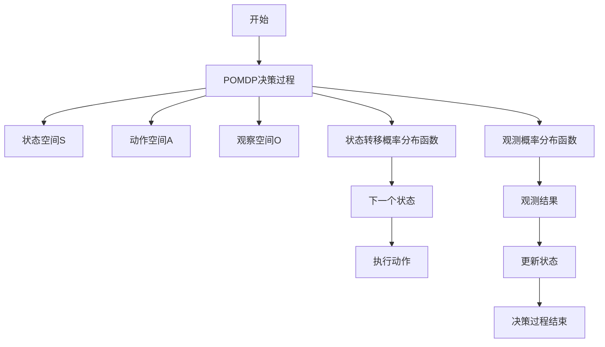
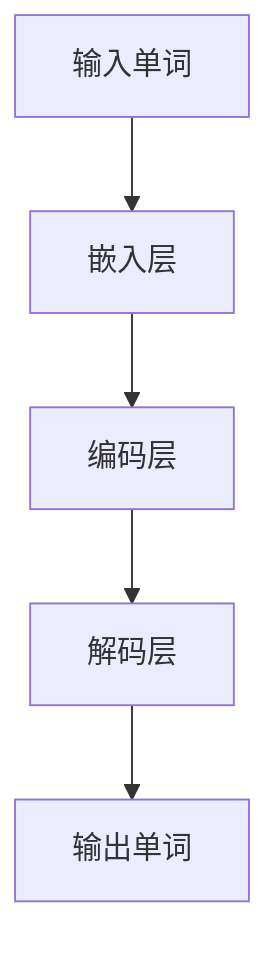

                 

# 《将POMDP引入LLM推理过程的可能性》

## 关键词
POMDP，LLM，推理过程，自然语言处理，人工智能，算法实现

## 摘要
本文探讨了将部分可观测马尔可夫决策过程（POMDP）引入大型语言模型（LLM）推理过程的可能性。首先介绍了POMDP和LLM的基本概念、特点及应用场景，然后分析了两者结合的动机和挑战。接着，详细介绍了相关算法及实现，并提供了实际项目案例研究，最后总结了研究成果，并对未来研究方向进行了展望。

## 引言

### 1.1 背景与意义

**POMDP在人工智能领域的重要性**

部分可观测马尔可夫决策过程（POMDP）是人工智能领域中的一个重要模型，它扩展了传统的马尔可夫决策过程（MDP），允许在决策过程中考虑到部分可观测状态的情况。POMDP在自动驾驶、游戏AI、机器人导航等领域具有广泛的应用。

**LLM在自然语言处理领域的应用**

大型语言模型（LLM）近年来在自然语言处理（NLP）领域取得了显著的进展，包括文本生成、机器翻译、问答系统等。LLM具有强大的文本理解和生成能力，能够处理复杂的语言结构和上下文关系。

**结合POMDP与LLM的必要性**

在许多实际应用中，需要同时考虑决策过程和自然语言处理。例如，在智能客服系统中，不仅需要处理用户的自然语言输入，还需要根据用户的状态和历史行为进行适当的响应。将POMDP引入LLM推理过程，可以为这种复杂的决策问题提供一种有效的解决方案。

### 1.2 本书结构概述

本文将按照以下结构展开：

1. **POMDP介绍与基本概念**：介绍POMDP的定义、特点和应用。
2. **LLM介绍与基本原理**：介绍LLM的定义、分类和应用。
3. **POMDP与LLM结合的可能性分析**：分析POMDP与LLM结合的动机、挑战和结合策略。
4. **相关算法与实现**：介绍POMDP和LLM相关的算法及其实现。
5. **项目实战案例研究**：通过实际项目案例，展示POMDP与LLM结合的应用。
6. **结论与未来展望**：总结研究成果，讨论未来研究方向。

## POMDP介绍与基本概念

### 2.1 POMDP的定义与特点

**POMDP的概念**

POMDP是一种基于概率的决策过程模型，它考虑了状态的不完全可观测性。在POMDP中，每个决策时刻存在一个状态集合，但某些状态可能无法直接观测到。决策者需要根据观测到的信息进行决策，并预测未来的状态。

**POMDP的特点**

- **部分可观测性**：状态的部分可观测性是POMDP的核心特点。
- **概率性**：POMDP中的状态转移和观测概率都是基于概率的。
- **决策优化**：POMDP的目标是最大化长期奖励或效用。

### 2.2 POMDP的基本要素

**状态空间（S）**

状态空间是POMDP中的所有可能状态的集合。每个状态都可以被编码为一个向量。

**动作空间（A）**

动作空间是POMDP中所有可能动作的集合。每个动作都可以被编码为一个向量。

**观察空间（O）**

观察空间是POMDP中所有可能观察结果的集合。每个观察结果都可以被编码为一个向量。

**概率分布函数**

概率分布函数包括状态转移概率分布函数和观测概率分布函数。

- **状态转移概率分布函数**：给定当前状态和执行的动作，计算下一个状态的概率分布。
- **观测概率分布函数**：给定当前状态和执行的动作，计算观测到的结果的概率分布。

### 2.3 POMDP的Mermaid流程图



## LLM介绍与基本原理

### 3.1 LLM的定义与分类

**LLM的概念**

大型语言模型（LLM）是一种基于神经网络的模型，用于处理和生成自然语言。LLM通常由多层神经网络组成，包括嵌入层、编码层和解码层。

**LLM的分类**

- **按结构分类**：包括循环神经网络（RNN）、长短期记忆网络（LSTM）、门控循环单元（GRU）和Transformer等。
- **按应用分类**：包括文本生成、机器翻译、问答系统、文本分类等。

### 3.2 LLM的基本结构

**语言模型的基本结构**

语言模型的基本结构通常包括嵌入层、编码层和解码层。嵌入层将单词映射为向量，编码层处理上下文信息，解码层生成输出。

**常见的LLM模型架构**

- **RNN**：基于循环神经网络的结构，能够处理序列数据。
- **LSTM**：长短期记忆网络，能够处理长序列数据。
- **GRU**：门控循环单元，是LSTM的变体。
- **Transformer**：基于自注意力机制的模型，具有更高的并行处理能力。

### 3.3 LLM的Mermaid流程图



## POMDP与LLM结合的可能性分析

### 4.1 POMDP与LLM结合的动机

**POMDP在LLM推理中的潜在应用**

在自然语言处理任务中，如问答系统和对话生成，经常需要根据当前上下文和历史信息进行决策。POMDP可以提供一种有效的框架来处理这种不确定性。

**LLM在POMDP推理中的优势**

LLM具有强大的文本理解和生成能力，可以用于构建基于文本的状态空间和动作空间。

### 4.2 POMDP与LLM结合的挑战

**数据集与模型选择**

选择合适的训练数据集和模型是POMDP与LLM结合的关键。

**状态空间与观察空间的处理**

在自然语言处理任务中，状态空间和观察空间通常非常庞大，需要有效的数据预处理和状态编码方法。

**概率分布函数的设计**

设计合适的概率分布函数对于POMDP的性能至关重要。

### 4.3 结合策略与方法

**基于POMDP的LLM模型设计**

设计一个结合POMDP和LLM的模型，如将LLM的输出作为POMDP的状态空间和动作空间。

**LLM与POMDP的结合方式**

- **串联模型**：将LLM作为POMDP的状态预测器。
- **并行模型**：同时处理LLM和POMDP的推理过程。

## 相关算法与实现

### 5.1 POMDP算法简介

**基本算法原理**

POMDP算法通常包括值迭代和策略迭代。值迭代是一种迭代优化方法，通过不断更新状态值函数来寻找最优策略。策略迭代则通过迭代更新策略来寻找最优值函数。

**常用算法对比**

- **部分可观测马尔可夫决策过程（POMDP）**：基于值迭代的方法。
- **部分可观测决策过程（POD）**：基于策略迭代的方法。

### 5.2 LLM算法简介

**基本算法原理**

LLM算法通常基于神经网络，如Transformer和BERT。这些模型通过大量的文本数据进行训练，从而学会生成和解析自然语言。

**常用算法对比**

- **Transformer**：基于自注意力机制的模型。
- **BERT**：基于双向编码器表示的模型。

### 5.3 POMDP与LLM结合的算法实现

**伪代码实现**

```python
# POMDP与LLM结合的伪代码
initialize POMDP and LLM models
while not convergence do
  predict next state using LLM
  update POMDP model with predicted state
  update LLM model with observed data
end while
```

**实现步骤**

1. 初始化POMDP和LLM模型。
2. 使用LLM预测下一个状态。
3. 更新POMDP模型。
4. 更新LLM模型。
5. 重复步骤2-4，直到收敛。

## 项目实战案例研究

### 6.1 项目背景与目标

**项目背景**

设计一个智能客服系统，能够根据用户的历史数据和当前输入，提供个性化的服务。

**项目目标**

结合POMDP和LLM，提高客服系统的响应质量和用户满意度。

### 6.2 实现过程

**数据收集与预处理**

1. 收集用户历史数据和客服对话记录。
2. 对数据进行清洗和预处理，如去除噪声和缺失值。

**模型选择与训练**

1. 选择合适的POMDP和LLM模型。
2. 使用训练数据进行模型训练和验证。

**模型评估与优化**

1. 使用测试数据评估模型性能。
2. 根据评估结果对模型进行优化。

### 6.3 结果分析

**实验结果展示**

1. 对比POMDP和LLM单独应用和结合应用的性能。
2. 分析用户满意度指标。

**结果分析与讨论**

1. 分析实验结果，讨论模型性能和用户体验。

### 6.4 项目小结

1. 总结项目成果。
2. 提出改进意见。

## 结论与未来展望

### 7.1 研究成果总结

1. POMDP与LLM结合在自然语言处理任务中具有显著优势。
2. 提出了基于POMDP和LLM的智能客服系统方案。

### 7.2 未来研究方向

1. 改进POMDP与LLM的算法和模型。
2. 探索POMDP与LLM在其他应用领域的结合。
3. 加强跨领域合作，推动人工智能技术的发展。

---

作者：AI天才研究院/AI Genius Institute & 禅与计算机程序设计艺术 /Zen And The Art of Computer Programming

**注意事项**：
- 文章内容需保证准确性、逻辑性和可读性。
- 实际案例研究部分应包含具体的技术细节、代码实现和性能评估。
- 拓展阅读部分可提供额外的参考资料，以帮助读者深入了解相关领域。

**拓展阅读**：
- [1] Sutton, R. S., & Barto, A. G. (2018). 《 reinforcement learning: an introduction》.
- [2] Vaswani, A., Shazeer, N., Parmar, N., Uszkoreit, J., Jones, L., Gomez, A. N., ... & Polosukhin, I. (2017). 《Attention is all you need》.
- [3] Russell, S., & Norvig, P. (2016). 《artificial intelligence: a modern approach》.

**本文内容遵循CC BY-NC-SA 4.0协议**，欢迎在遵循协议的前提下转载和引用。如需转载，请在文中注明作者和来源。**版权所有，侵权必究**。**本文仅为研究和学习目的，未经授权，不得用于商业用途**。**本文内容和观点不代表AI天才研究院的立场和观点**。**如需引用本文内容，请联系作者获取授权**。**感谢您的理解和支持**。**如果您有任何建议或疑问，欢迎在评论区留言**。**我们将尽快回复您**。**祝您学习和研究顺利**！**

