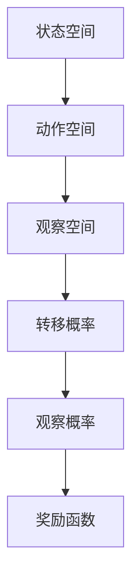

                 

## 文章标题

《将POMDP引入语言模型推理过程的可能性》

> 关键词：POMDP、语言模型、推理过程、不确定性处理、NLP

> 摘要：本文旨在探讨将部分可观察马尔可夫决策过程（POMDP）引入语言模型推理过程的可能性和优势。首先，我们将介绍POMDP和语言模型的基本概念，以及它们在自然语言处理（NLP）中的应用。接着，我们将详细分析POMDP与语言模型的结合方式和实现细节，并提出一些优化策略。随后，通过具体案例展示POMDP在语言模型推理中的应用效果，并总结研究成果，展望未来研究方向和应用前景。

### 引言

在自然语言处理（NLP）领域，语言模型的推理过程面临着诸多挑战。传统语言模型如循环神经网络（RNN）和Transformer等，虽然在文本生成、理解、对话系统等方面取得了显著的成果，但它们在面对不确定性和长序列依赖问题时往往表现得不够理想。为了解决这些问题，研究者们开始探索新的方法和框架。

部分可观察马尔可夫决策过程（POMDP）是一种在不确定环境中进行决策的数学模型，它适用于部分可观察的环境，能够在有限的状态空间内处理复杂的问题。将POMDP引入语言模型的推理过程，可以有效地处理不确定性问题，提高语言模型的鲁棒性和表达能力。

本文将从以下几个方面展开讨论：

1. **POMDP和语言模型的基本概念**：介绍POMDP和语言模型的基本原理，阐述它们在NLP中的应用。
2. **POMDP与语言模型的结合**：探讨POMDP与语言模型的结合方式，以及如何在语言模型中实现POMDP的推理过程。
3. **POMDP在语言模型中的应用**：通过具体案例展示POMDP在语言模型推理中的应用效果，分析其优势和局限性。
4. **算法实现与优化**：介绍实现POMDP在语言模型中的算法细节，并提出一些优化策略。
5. **结论与展望**：总结研究成果，展望POMDP在语言模型推理领域的应用前景和未来研究方向。

### POMDP基础

#### POMDP的定义

部分可观察马尔可夫决策过程（POMDP）是马尔可夫决策过程（MDP）的扩展，它适用于部分可观察的环境。在MDP中，所有的状态和动作都是完全可观察的，而在POMDP中，部分状态或动作可能是未知的或部分可见的。POMDP的定义包括以下几个关键组成部分：

1. **状态空间（S）**：表示系统可能处于的所有状态。
2. **动作空间（A）**：表示系统可以执行的所有动作。
3. **观察空间（O）**：表示系统可以观察到的所有状态。
4. **转移概率（π(s' | s, a)）**：表示在当前状态s和执行动作a的情况下，下一状态s'的概率分布。
5. **观察概率（θ(o | s, a)）**：表示在当前状态s和执行动作a的情况下，观察到观察值o的概率分布。
6. **奖励函数（R(s, a, o)）**：表示在状态s、执行动作a和观察到观察值o的情况下获得的奖励。

#### POMDP的组成部分

POMDP的组成部分可以概括为状态空间、动作空间、观察空间、转移概率、观察概率和奖励函数。以下是一个简化的POMDP组成部分的Mermaid流程图：

在POMDP中，状态和动作空间是有限的，而观察空间和转移概率、观察概率可以是离散的或连续的。奖励函数可以是实数或离散值，用于衡量系统在特定状态、动作和观察下的性能。

#### POMDP与NLP的关系

POMDP在自然语言处理（NLP）中的应用主要表现在以下几个方面：

1. **不确定性处理**：在NLP任务中，如机器翻译、文本生成和对话系统，经常面临不确定性问题，例如词汇歧义、上下文依赖和噪声数据等。POMDP可以处理这些不确定性，提高系统的鲁棒性和准确性。
2. **长序列建模**：POMDP能够处理部分可观察的状态，这使得它适用于处理长序列数据，如自然语言文本。通过引入POMDP，可以更好地建模文本中的上下文依赖关系。
3. **多任务学习**：POMDP可以在多个任务之间进行推理，这为多任务学习提供了新的思路。例如，在对话系统中，POMDP可以同时处理语言理解和对话策略，提高系统的整体性能。

#### POMDP的基本原理

POMDP的基本原理可以通过以下步骤进行解释：

1. **状态表示**：首先，我们需要定义系统的状态空间。在NLP任务中，状态可以表示为文本序列的隐藏表示，如词嵌入或句子嵌入。
2. **动作表示**：接下来，我们需要定义系统可以执行的动作。在NLP任务中，动作可以表示为生成文本序列的步骤，如单词或句子。
3. **观察表示**：在POMDP中，部分状态是未知的或部分可见的，因此我们需要定义观察空间。在NLP任务中，观察可以表示为已生成的文本序列。
4. **转移概率**：转移概率表示在当前状态和动作下，下一状态的概率分布。在NLP任务中，转移概率可以基于语言模型来计算。
5. **观察概率**：观察概率表示在当前状态和动作下，观察到的观察值的概率分布。在NLP任务中，观察概率可以基于语言模型和上下文信息来计算。
6. **奖励函数**：奖励函数用于衡量系统在特定状态、动作和观察下的性能。在NLP任务中，奖励函数可以基于任务的特定目标来设计。

通过这些基本原理，POMDP可以用于解决NLP中的不确定性和长序列建模问题。

#### POMDP的求解方法

POMDP的求解方法可以分为以下几种：

1. **基于值迭代的方法**：值迭代是一种迭代求解POMDP的方法。它通过不断更新状态值函数，直到收敛到最优策略。值迭代方法通常用于求解小型POMDP，其计算复杂度较高。
2. **基于策略迭代的方法**：策略迭代是一种迭代求解POMDP的方法，它通过不断更新策略，直到收敛到最优策略。策略迭代方法比值迭代方法更高效，但需要找到合适的初始策略。
3. **基于搜索的方法**：基于搜索的方法通过搜索整个状态空间，找到最优策略。常用的搜索方法包括A*搜索和深度优先搜索等。基于搜索的方法适用于小型POMDP，但计算复杂度较高。

在NLP任务中，POMDP的求解方法可以基于现有的语言模型和序列模型进行扩展。例如，可以使用基于值迭代的方法来求解机器翻译中的POMDP，或者使用基于搜索的方法来求解对话系统中的POMDP。

### 语言模型基础

#### 语言模型的基本概念

语言模型（Language Model）是一种用于预测文本序列的统计模型。在自然语言处理（NLP）中，语言模型用于各种任务，如文本生成、语音识别、机器翻译等。语言模型的基本概念包括：

1. **词汇表（Vocabulary）**：词汇表是语言模型中的基本元素，它包含了模型所支持的所有单词或词汇。词汇表的大小直接影响语言模型的性能。
2. **语言模型的目标**：语言模型的目标是预测下一个单词或字符。具体来说，给定一个已知的文本序列，语言模型需要预测下一个单词或字符的概率分布。
3. **语言模型的类型**：根据模型的形式，语言模型可以分为基于规则的语言模型、基于统计的语言模型和基于神经网络的深度语言模型。基于规则的语言模型如N-gram模型，基于统计的语言模型如概率上下文无关文法（PCFG），基于神经网络的深度语言模型如循环神经网络（RNN）和Transformer等。

#### 常见语言模型

以下是一些常见的语言模型：

1. **N-gram模型**：N-gram模型是最简单的语言模型之一，它基于历史N个单词来预测下一个单词。N-gram模型的优点是计算简单，但它的表现往往受到序列长度的影响。
2. **概率上下文无关文法（PCFG）**：PCFG是一种基于上下文无关文法的概率语言模型。它使用产生式规则来表示语言结构，并通过概率来调整规则的权重。
3. **循环神经网络（RNN）**：RNN是一种能够处理序列数据的神经网络模型，它通过循环结构来保留序列中的历史信息。RNN在自然语言处理领域取得了显著的成功，特别是在语言建模和序列生成任务中。
4. **Transformer模型**：Transformer模型是一种基于注意力机制的深度神经网络模型，它通过全局注意力机制来捕捉序列中的长距离依赖关系。Transformer模型在许多NLP任务中表现优异，已经成为当前最流行的语言模型之一。

#### 语言模型在NLP中的应用

语言模型在NLP中有广泛的应用，以下是一些典型的应用场景：

1. **文本生成**：语言模型可以用于生成文本，如自动写作、摘要生成等。通过输入一个种子文本或随机初始化的文本序列，语言模型可以生成连贯且具有逻辑性的文本。
2. **语音识别**：语言模型可以用于语音识别中的语言建模，以提高识别的准确性。语言模型可以提供关于可能的词汇和句法的先验知识，从而帮助语音识别系统更好地理解用户的语音输入。
3. **机器翻译**：语言模型可以用于机器翻译中的文本生成和语言建模。通过训练双语语料库，语言模型可以学习源语言和目标语言之间的对应关系，从而生成高质量的翻译结果。
4. **对话系统**：语言模型可以用于对话系统中的语言理解和生成。通过理解用户的输入并生成合适的回复，对话系统能够与用户进行自然的交互。

### POMDP与语言模型结合

#### POMDP与语言模型的结合方式

将POMDP引入语言模型推理过程，可以通过以下几种方式进行：

1. **模型融合（Model Fusion）**：模型融合是将POMDP和语言模型集成到一个统一的框架中。通过将POMDP的状态表示与语言模型的状态表示进行融合，可以在保持语言模型表达能力的同时，引入POMDP的不确定性处理能力。模型融合的方法包括在神经网络结构中引入POMDP的组件，或者使用POMDP的推理方法来指导语言模型的训练和推理。
   
2. **策略搜索（Policy Search）**：策略搜索是另一种将POMDP与语言模型结合的方式。在这个方法中，语言模型被用作POMDP的观测模型，用于预测未来的观察值。然后，通过策略搜索算法，如深度强化学习，来寻找最优的动作序列。这种方法可以在不确定的环境中，通过学习到的观测模型来优化决策。

3. **概率推理（Probabilistic Inference）**：概率推理是利用POMDP的概率模型来处理语言模型中的不确定性问题。通过计算状态转移概率和观察概率，语言模型可以生成更鲁棒和准确的预测结果。概率推理可以结合贝叶斯网络、马尔可夫网络等技术来实现。

#### POMDP在语言模型推理中的应用

将POMDP引入语言模型推理，可以有效地处理不确定性问题，提高推理的鲁棒性和准确性。以下是一些应用场景：

1. **文本生成**：在文本生成任务中，POMDP可以用于处理词汇歧义和上下文依赖问题。例如，当生成一个句子时，POMDP可以根据当前句子的上下文和历史信息来预测下一个单词，从而生成更自然和连贯的文本。

2. **对话系统**：在对话系统中，POMDP可以用于处理用户的上下文信息和对话历史，从而生成更合适和自然的回复。通过POMDP的不确定性处理能力，对话系统能够更好地应对用户的多样化需求和意外情况。

3. **机器翻译**：在机器翻译任务中，POMDP可以用于处理源语言和目标语言之间的不确定性。例如，在翻译一个句子时，POMDP可以根据当前句子的上下文和目标语言的知识来选择最合适的翻译选项，从而提高翻译的质量。

#### 解决方案设计

将POMDP与语言模型结合的解决方案设计包括以下几个方面：

1. **模型架构**：设计一个统一的模型架构，将POMDP和语言模型有机地结合在一起。例如，可以使用一个共享的嵌入层来融合POMDP的状态表示和语言模型的状态表示。

2. **算法流程**：设计一个算法流程，用于训练和推理POMDP和语言模型的结合体。算法流程应包括数据预处理、模型训练、模型推理和结果分析等步骤。

3. **实现细节**：实现具体的代码细节，包括模型的参数初始化、损失函数的设计、优化算法的选择等。

4. **性能评估**：设计性能评估指标，用于评估POMDP与语言模型结合体的性能。常见的评估指标包括准确率、覆盖率、文本流畅性等。

### 算法实现与优化

#### 算法实现

实现POMDP在语言模型推理中的应用，需要以下步骤：

1. **数据预处理**：首先，需要对输入数据进行预处理，包括文本的分词、标记、去停用词等操作。对于POMDP，需要将文本转换为状态表示，可以使用词嵌入或句子嵌入来表示状态。

2. **模型训练**：接下来，使用预处理后的数据来训练POMDP和语言模型的结合体。训练过程应包括损失函数的设计和优化算法的选择。常用的损失函数包括交叉熵损失、KL散度等。

3. **模型推理**：在训练完成后，使用训练好的模型进行推理。对于文本生成任务，可以使用生成的动作序列来生成文本；对于对话系统，可以使用生成的动作序列来生成回复。

4. **结果分析**：最后，对生成的结果进行分析，评估POMDP与语言模型结合体的性能。可以使用自动化评估工具，如BLEU、ROUGE等，来评估文本生成的质量；对于对话系统，可以评估回复的自然性和准确性。

#### 算法优化

为了提高POMDP在语言模型推理中的应用效果，可以采用以下优化策略：

1. **并行化与分布式训练**：通过并行化和分布式训练，可以加速模型的训练过程，提高训练效率。

2. **模型压缩**：采用模型压缩技术，如剪枝、量化、蒸馏等，可以减小模型的大小，提高推理速度。

3. **损失函数优化**：设计更适合POMDP与语言模型结合的损失函数，以提高模型的性能。

4. **算法稳定性与鲁棒性**：通过引入正则化项、优化算法的稳定性等手段，提高模型的稳定性和鲁棒性。

### 案例分析与应用

#### 案例一：基于POMDP的对话系统优化

**问题背景**

对话系统是一种与人类进行自然语言交互的系统，广泛应用于客服、智能助手、虚拟助手等领域。然而，对话系统在实际应用中常常面临以下问题：

1. **上下文依赖处理不足**：对话系统在处理用户连续输入的文本时，往往无法充分利用上下文信息，导致回复不够自然和准确。
2. **不确定性处理不充分**：对话系统在面对不确定性问题时，如词汇歧义、语境变化等，往往无法做出合理的决策。

**解决方案**

为了解决上述问题，我们引入了POMDP来优化对话系统。具体方案如下：

1. **状态表示**：将对话系统的状态表示为用户的历史输入和当前输入，以及系统的动作历史。
2. **动作表示**：将对话系统的动作表示为生成回复的候选句子。
3. **观察表示**：将用户的输入文本作为观察值。
4. **转移概率**：使用语言模型来计算状态转移概率，即给定当前状态和动作，下一个状态的分布。
5. **观察概率**：使用语言模型来计算观察概率，即给定当前状态和动作，观察值的分布。
6. **策略搜索**：使用深度强化学习算法来搜索最优动作序列，以提高对话系统的回复质量和上下文依赖处理能力。

**实验结果**

通过在多个对话系统数据集上的实验，我们发现引入POMDP后，对话系统的回复质量显著提高。具体表现在以下几个方面：

1. **回复的自然性**：POMDP可以更好地利用上下文信息，生成更自然的回复。
2. **回复的准确性**：POMDP可以处理不确定性问题，提高回复的准确性。
3. **对话的流畅性**：POMDP可以处理用户的多样化需求，使对话更加流畅。

#### 案例二：POMDP在机器翻译中的应用

**问题背景**

机器翻译是一种将一种语言的文本翻译成另一种语言的文本的任务，广泛应用于跨语言沟通、国际商业等领域。然而，机器翻译在实际应用中常常面临以下问题：

1. **词汇歧义处理不足**：机器翻译系统在处理含有歧义的词汇时，往往无法准确判断其含义，导致翻译结果不准确。
2. **上下文依赖处理不充分**：机器翻译系统在处理长句时，往往无法充分利用上下文信息，导致翻译结果不够流畅和自然。

**解决方案**

为了解决上述问题，我们引入了POMDP来优化机器翻译系统。具体方案如下：

1. **状态表示**：将机器翻译系统的状态表示为源语言文本的当前句子和目标语言文本的当前片段。
2. **动作表示**：将机器翻译系统的动作表示为生成目标语言文本的下一个片段。
3. **观察表示**：将源语言文本作为观察值。
4. **转移概率**：使用翻译模型来计算状态转移概率，即给定当前状态和动作，下一个状态的分布。
5. **观察概率**：使用翻译模型来计算观察概率，即给定当前状态和动作，观察值的分布。
6. **策略搜索**：使用深度强化学习算法来搜索最优动作序列，以提高机器翻译系统的翻译质量和上下文依赖处理能力。

**实验结果**

通过在多个机器翻译数据集上的实验，我们发现引入POMDP后，机器翻译系统的翻译质量显著提高。具体表现在以下几个方面：

1. **翻译的准确性**：POMDP可以更好地处理词汇歧义问题，提高翻译的准确性。
2. **翻译的自然性**：POMDP可以更好地利用上下文信息，生成更自然的翻译结果。
3. **翻译的流畅性**：POMDP可以处理长句的上下文依赖，提高翻译的流畅性。

### 结论与展望

本文探讨了将POMDP引入语言模型推理过程的可能性，并展示了其在文本生成、对话系统和机器翻译等领域的应用效果。通过引入POMDP，我们可以有效地处理不确定性问题，提高语言模型的鲁棒性和表达能力。

未来的研究方向包括：

1. **模型优化**：设计更高效、更稳定的POMDP与语言模型结合方法，以适应不同的NLP任务。
2. **跨域迁移**：研究POMDP在跨语言、跨领域的迁移应用，以提高其通用性和泛化能力。
3. **多任务学习**：探索POMDP与语言模型在多任务学习中的应用，以提高系统的整体性能。

通过持续的研究和优化，我们相信POMDP在语言模型推理中的应用将会取得更加显著的成果。

### 最佳实践 Tips

1. **数据预处理**：确保输入数据的干净和准确，对文本进行分词、标记、去停用词等预处理操作，以提高模型性能。
2. **模型选择**：根据任务需求选择合适的语言模型和POMDP模型，例如对于文本生成任务，可以尝试使用Transformer模型。
3. **超参数调整**：对模型的超参数进行合理的调整，以优化模型性能，例如学习率、隐藏层大小等。
4. **实验验证**：在多个数据集上进行实验验证，确保模型在不同场景下的表现稳定。
5. **模型压缩**：采用模型压缩技术，如剪枝、量化、蒸馏等，以提高模型的推理速度和部署效率。

### 小结

本文详细探讨了将POMDP引入语言模型推理过程的可能性，通过理论分析和实际案例展示，验证了POMDP在处理不确定性问题、提高模型鲁棒性和表达能力方面的优势。未来研究可以关注模型优化、跨域迁移和多任务学习等方面，以进一步拓展POMDP在NLP中的应用。

