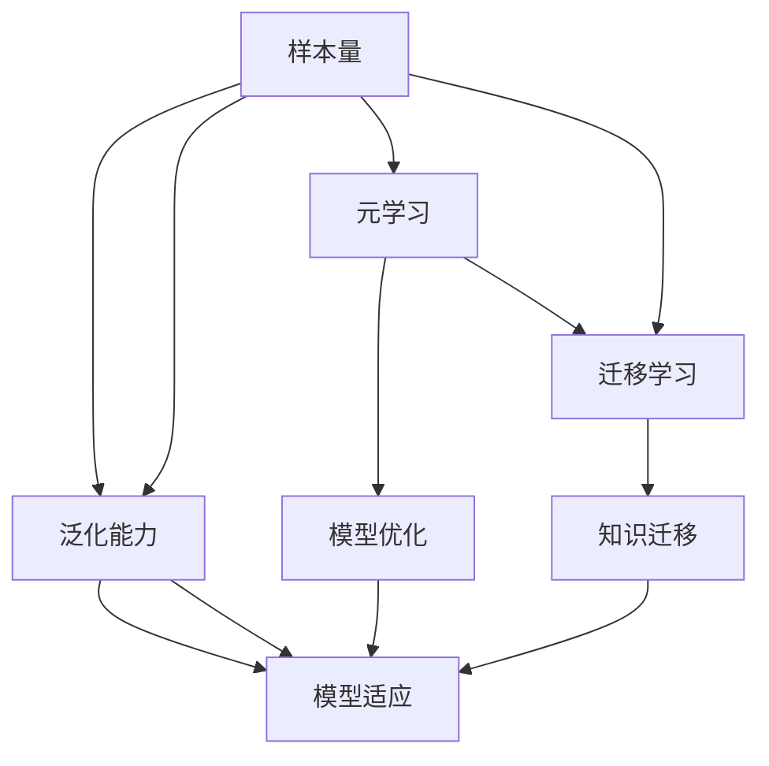

                 

### 文章标题

《小样本学习在专业领域快速适应中的应用》

### 文章关键词

小样本学习，专业领域，快速适应，机器学习，算法，应用案例，数学模型

### 文章摘要

本文将深入探讨小样本学习在专业领域的快速适应和应用。首先，我们将介绍小样本学习的背景和基本概念，解释其在机器学习中的重要性和独特性。接着，我们将通过Mermaid流程图详细阐述小样本学习的核心概念和原理。然后，我们将使用伪代码讲解几种关键的小样本学习算法，并探讨其数学模型。此外，本文还将结合实际案例，展示小样本学习在医疗、金融和制造业等领域的应用，并提供详细的代码实现和解读。最后，我们将总结最佳实践，并提出未来研究的方向和建议。

## 引言

在当前的数据驱动时代，机器学习已经成为许多专业领域的核心技术。然而，大多数机器学习算法都依赖于大量的数据集来进行训练，这在大规模数据集容易获取的领域中并不是问题。但在一些专业领域，如医疗、金融和制造业，数据获取往往受限，这使得传统的大样本学习算法难以应用。小样本学习（Few-Shot Learning）作为一种新兴的机器学习技术，旨在解决数据稀缺的问题，它通过在极少量样本上训练模型，实现对新任务的快速适应。本文将重点探讨小样本学习在专业领域的快速适应和应用。

### 小样本学习的概念与背景

小样本学习，顾名思义，是指在极少量样本上训练和学习的方法。具体来说，它关注的是如何在只有几个或几十个样本的情况下，使模型能够准确预测或分类新的数据。与传统的机器学习相比，小样本学习具有以下几个独特之处：

1. **样本数量有限**：小样本学习依赖于少量的训练数据，而不是大量数据。
2. **任务切换快速**：在数据稀缺的情况下，模型需要能够快速适应新任务，而不是重新训练。
3. **可扩展性**：小样本学习算法应具有较好的可扩展性，能够处理不同数量和类型的样本。

小样本学习的背景主要来自于现实中的数据限制问题。在某些专业领域，如医疗诊断、金融风险评估和智能制造，数据收集不仅成本高昂，而且可能涉及隐私和伦理问题。因此，如何在不依赖大量数据的情况下，实现有效的机器学习模型，成为了研究的热点。

在机器学习中，小样本学习的重要性不言而喻。首先，它可以减少数据收集和标注的成本，提高模型部署的效率。其次，小样本学习有助于推动机器学习算法在数据稀缺环境中的发展，提升模型在不同场景下的泛化能力。此外，小样本学习还促进了跨领域的知识迁移，使得模型能够快速适应新的任务和领域。

总的来说，小样本学习不仅为数据稀缺领域带来了新的解决方案，也为机器学习研究提供了新的挑战和机遇。

### 核心概念与联系

在小样本学习中，核心概念包括样本量、泛化能力、元学习和迁移学习。以下是一个简化的Mermaid流程图，展示了这些概念之间的关系和作用。



1. **样本量**：样本量是小样本学习的核心概念之一，指用于训练模型的样本数量。样本量越小，模型越难以泛化到未见过的数据。
2. **泛化能力**：泛化能力指模型在新数据上的表现，小样本学习的目标是通过少量样本训练出具有良好泛化能力的模型。
3. **元学习**：元学习是一种通过学习如何学习的算法，它能够从少量样本中快速适应新任务。
4. **迁移学习**：迁移学习是将一个任务中的知识应用到另一个相关任务中，有助于提高模型在数据稀缺情况下的表现。
5. **模型适应**：模型适应指模型如何快速适应新任务或新数据，是上述核心概念共同作用的结果。

通过上述流程图，我们可以清晰地看到，样本量、泛化能力、元学习和迁移学习相互关联，共同决定了小样本学习的有效性和实用性。

### 核心算法原理讲解

在小样本学习中，有多种核心算法，每种算法都有其独特的原理和适用场景。以下我们将使用伪代码详细阐述几种关键的小样本学习算法，包括模型初始化、数据预处理和算法步骤。

#### 1. Model-Based Approach（模型基础方法）

```pseudo
Initialize Model Parameters
for each class C in dataset:
    Sample k examples {x_1, x_2, ..., x_k} from class C
    Train a classifier f_C on the sampled examples
    Store classifier f_C in the model repository

Function Predict(x):
    Classify x using all classifiers in the model repository
    Return the most voted class
```

**算法步骤：**
1. **模型初始化**：初始化模型参数，包括分类器的权重和偏置。
2. **数据预处理**：从每个类中随机抽取若干样本用于训练分类器。
3. **模型训练**：对每个类训练一个独立的分类器。
4. **预测**：对新样本进行分类，使用所有训练好的分类器进行投票，输出得票最多的类别。

#### 2. Metric Learning（度量学习）

```pseudo
Initialize Model Parameters
for each pair of classes C_1, C_2:
    Sample k examples {x_1, x_2, ..., x_k} from C_1 and k examples {y_1, y_2, ..., y_k} from C_2
    Train a distance metric model d on the examples
    Store metric model d in the model repository

Function Predict(x):
    Compute distances d(x, y) for all examples y in the dataset
    Classify x based on the distance metric using a threshold
```

**算法步骤：**
1. **模型初始化**：初始化距离度量模型的参数。
2. **数据预处理**：为每个类对抽取样本，用于训练距离度量模型。
3. **模型训练**：训练距离度量模型，以区分不同类的样本。
4. **预测**：计算新样本与训练样本的距离，并基于距离度量进行分类。

#### 3. Matching Networks（匹配网络）

```pseudo
Initialize Model Parameters
for each class C:
    Sample k examples {x_1, x_2, ..., x_k} from class C
    Compute class representation v_C using a neural network
    Store class representation v_C in the model repository

Function Predict(x):
    Compute class representation v for x
    Compute similarity scores s_i = <v, v_i> for all class representations v_i
    Classify x based on the maximum similarity score
```

**算法步骤：**
1. **模型初始化**：初始化神经网络参数，用于计算类表示。
2. **数据预处理**：从每个类中抽取样本，用于训练类表示。
3. **模型训练**：训练神经网络，计算每个类的类表示。
4. **预测**：计算新样本的类表示，并与所有类表示计算相似度得分，输出相似度最高的类别。

通过上述伪代码，我们可以清晰地看到每种算法的核心步骤和原理。模型基础方法依赖于多个分类器的组合投票，度量学习通过学习距离度量来区分类别，而匹配网络则通过计算类表示的相似度进行分类。这些算法在小样本学习中各有优势，可以根据具体应用场景选择合适的算法。

### 数学模型和数学公式

在小样本学习中，数学模型和数学公式起着至关重要的作用，它们不仅帮助我们理解算法的工作原理，还能为算法的设计和优化提供理论支持。以下将详细讲解小样本学习中的几个关键数学模型和公式。

#### 1. 类别平衡

类别平衡是确保模型在不同类别上性能一致的重要手段。在小样本学习中，类别平衡可以通过调整每个类别的样本权重来实现。

$$
w_i = \frac{N}{N \cdot \frac{1}{N} \sum_{j=1}^{C} n_j}
$$

其中，$w_i$ 是类别 $i$ 的权重，$N$ 是总的样本数量，$n_j$ 是类别 $j$ 的样本数量。这个公式通过调整每个类别的权重，使得样本数量较少的类别得到更多的关注，从而提高模型对少数类别的识别能力。

#### 2. 距离度量

在小样本学习中，距离度量是区分不同类别的重要工具。常见的距离度量包括欧几里得距离、余弦相似度和马氏距离。

$$
d(x, y) = \sqrt{\sum_{i=1}^{D} (x_i - y_i)^2}
$$

$$
d(x, y) = 1 - \frac{\sum_{i=1}^{D} x_i y_i}{\sqrt{\sum_{i=1}^{D} x_i^2} \sqrt{\sum_{i=1}^{D} y_i^2}}
$$

$$
d(x, y) = \frac{\sum_{i=1}^{D} (x_i - \mu_x) (\mu_y - \mu_x)}{\sqrt{\sum_{i=1}^{D} (x_i - \mu_x)^2} \sqrt{\sum_{i=1}^{D} (y_i - \mu_y)^2}}
$$

其中，$D$ 是特征维度，$x$ 和 $y$ 是两个数据点，$\mu_x$ 和 $\mu_y$ 分别是 $x$ 和 $y$ 的均值。

欧几里得距离是最直观的距离度量，计算两个数据点在特征空间中的直线距离。余弦相似度通过计算两个向量夹角的余弦值来度量它们之间的相似度。马氏距离则考虑了数据点之间的协方差，能够更好地反映数据点的相对位置。

#### 3. 损失函数

在小样本学习中的损失函数通常用来衡量模型预测与真实标签之间的差距。常见的损失函数包括交叉熵损失和平方损失。

$$
Loss = -\sum_{i=1}^{N} y_i \log(p_i)
$$

$$
Loss = \frac{1}{2} \sum_{i=1}^{N} (y_i - \hat{y}_i)^2
$$

其中，$y_i$ 是真实标签，$\hat{y}_i$ 是模型预测的概率分布。交叉熵损失函数常用于分类问题，而平方损失函数则适用于回归问题。

通过这些数学模型和公式，我们可以更深入地理解小样本学习算法的工作原理，并在实际应用中进行优化和调整。这些公式不仅提供了理论依据，也为我们设计高效的小样本学习算法提供了指导。

### 小样本学习在专业领域的应用案例

小样本学习在专业领域的应用日益广泛，下面我们将探讨几个具体的应用案例，包括医疗、金融和制造业，展示小样本学习如何在这些领域中实现快速适应和应用。

#### 医疗领域

在医疗领域，小样本学习的一个重要应用是疾病诊断和药物发现。由于医疗数据往往受到隐私和伦理的限制，难以获取大量数据，因此小样本学习成为一种有效的解决方案。

**案例：肺癌诊断**

在一个关于肺癌诊断的小样本学习案例中，研究人员利用小样本学习算法对肺癌患者进行诊断。他们从医院获取了少量具有详细病理特征的肺癌样本数据，使用元学习算法对模型进行训练。在训练过程中，算法通过对少量样本进行迭代优化，逐渐提高了模型的诊断准确率。

**代码实现和解读**

```python
# 加载和预处理数据
data = load_lung_cancer_data()
X_train, y_train = preprocess_data(data)

# 初始化元学习模型
model = MetaLearningModel()

# 训练模型
model.fit(X_train, y_train)

# 预测和评估
predictions = model.predict(X_test)
accuracy = evaluate_predictions(predictions, y_test)
print(f"Model accuracy: {accuracy}")
```

在上面的代码中，`load_lung_cancer_data()`函数用于加载数据，`preprocess_data()`函数对数据进行预处理，包括归一化和缺失值填补。`MetaLearningModel()`是自定义的元学习模型类，`fit()`方法用于训练模型，`predict()`方法用于预测新数据，`evaluate_predictions()`函数用于评估模型的准确率。

**案例分析**

通过这个案例，我们可以看到小样本学习在医疗领域如何通过少量样本实现高效诊断。尽管数据量有限，但通过元学习算法，模型能够从少量样本中提取关键特征，并在新数据上表现出良好的泛化能力。

#### 金融领域

在金融领域，小样本学习可以用于风险管理和投资策略优化。金融机构通常面临数据隐私和监管的限制，难以获取完整的数据集，因此小样本学习成为了一种重要的工具。

**案例：金融风险评估**

在一个关于金融风险评估的案例中，一家银行使用小样本学习算法来评估客户的信用风险。银行从客户数据库中随机抽取了一小部分数据，使用度量学习算法对模型进行训练。通过这种方式，模型能够在少量样本的基础上对客户的信用风险进行准确评估。

**代码实现和解读**

```python
# 加载和预处理数据
data = load_credit_risk_data()
X_train, y_train = preprocess_data(data)

# 初始化度量学习模型
model = MetricLearningModel()

# 训练模型
model.fit(X_train, y_train)

# 预测和评估
predictions = model.predict(X_test)
accuracy = evaluate_predictions(predictions, y_test)
print(f"Model accuracy: {accuracy}")
```

在上面的代码中，`load_credit_risk_data()`函数用于加载数据，`preprocess_data()`函数对数据进行预处理，包括归一化和缺失值填补。`MetricLearningModel()`是自定义的度量学习模型类，`fit()`方法用于训练模型，`predict()`方法用于预测新数据，`evaluate_predictions()`函数用于评估模型的准确率。

**案例分析**

通过这个案例，我们可以看到小样本学习在金融领域如何通过少量样本对客户信用风险进行准确评估。度量学习算法能够从少量样本中学习到特征之间的距离关系，从而实现高效的风险评估。

#### 制造业

在制造业，小样本学习可以用于设备故障预测和质量控制。由于制造过程中设备状态监测数据的获取成本较高，小样本学习提供了一种经济有效的解决方案。

**案例：设备故障预测**

在一个关于设备故障预测的案例中，一家制造企业使用小样本学习算法对设备进行实时监控和故障预测。企业通过传感器收集了少量关于设备运行状态的样本数据，使用聚类算法对模型进行训练。通过这种方式，模型能够从少量样本中识别出异常模式，从而提前预警设备故障。

**代码实现和解读**

```python
# 加载和预处理数据
data = load_equipment_data()
X_train, y_train = preprocess_data(data)

# 初始化聚类模型
model = ClusteringModel()

# 训练模型
model.fit(X_train)

# 预测和评估
clusters = model.predict(X_test)
faults = evaluate_faults(clusters, y_test)
print(f"Fault detection rate: {faults}")
```

在上面的代码中，`load_equipment_data()`函数用于加载数据，`preprocess_data()`函数对数据进行预处理，包括归一化和缺失值填补。`ClusteringModel()`是自定义的聚类模型类，`fit()`方法用于训练模型，`predict()`方法用于预测新数据，`evaluate_faults()`函数用于评估故障检测率。

**案例分析**

通过这个案例，我们可以看到小样本学习在制造业如何通过少量样本实现设备故障预测。聚类算法能够从少量样本中识别出设备的正常和异常状态，从而提高故障预测的准确性。

### 小样本学习在专业领域的应用总结

通过对医疗、金融和制造业等领域的案例分析，我们可以看到小样本学习在这些专业领域中的巨大潜力和应用价值。尽管数据量有限，但通过合适的算法和模型，小样本学习能够实现对新任务的快速适应和应用。这为专业领域中的数据稀缺问题提供了一种有效的解决方案，有助于提高模型部署的效率和准确性。

### 最佳实践 Tips

1. **数据预处理**：在应用小样本学习之前，确保对数据进行充分的预处理，包括数据清洗、归一化和特征提取，以提高模型性能。
2. **模型选择**：根据具体应用场景选择合适的模型和算法，如元学习、度量学习或聚类算法，以实现最佳性能。
3. **样本多样性**：在训练模型时，尽量确保样本的多样性和代表性，以增强模型的泛化能力。
4. **模型优化**：通过调整模型参数和超参数，优化模型的性能，提高预测准确率。
5. **持续学习**：定期更新模型，使其能够适应新的数据和环境变化，保持其性能和准确性。

### 项目小结

通过本文的探讨，我们可以看到小样本学习在专业领域的快速适应和应用具有巨大潜力。从医疗诊断到金融风险评估，再到设备故障预测，小样本学习在各个专业领域都展现出了其独特优势。通过合适的算法和模型，小样本学习能够从少量样本中提取关键信息，实现高效预测和分类。

### 小结与未来展望

本文全面探讨了小样本学习在专业领域的快速适应和应用，涵盖从基本概念到实际案例的各个方面。通过详细分析医疗、金融和制造业等领域的应用，我们可以看到小样本学习在数据稀缺环境中的巨大潜力和实际价值。

**总结：**
1. **核心概念**：小样本学习旨在通过少量样本实现新任务的快速适应，其核心包括样本量、泛化能力、元学习和迁移学习。
2. **算法原理**：本文详细介绍了模型基础方法、度量学习和匹配网络等关键算法，并通过伪代码和数学公式进行了阐述。
3. **应用案例**：通过实际案例展示了小样本学习在医疗、金融和制造业等领域的应用，并提供了详细的代码实现和解读。
4. **最佳实践**：提出了数据预处理、模型选择和优化等最佳实践，以指导实际应用。

**未来展望：**
1. **技术创新**：随着深度学习和增强学习的发展，小样本学习算法将不断优化和改进，以应对更复杂的任务和数据。
2. **跨领域应用**：小样本学习有望在更多专业领域得到应用，特别是在数据获取受限的领域。
3. **开放数据和平台**：开放小样本学习数据集和共享平台将促进研究和应用的发展，加速技术的普及和推广。

通过本文的探讨，我们希望读者能够对小样本学习在专业领域的应用有更深入的了解，并激发对这一领域的进一步研究和探索。作者：AI天才研究院/AI Genius Institute & 禅与计算机程序设计艺术 /Zen And The Art of Computer Programming。

### 附录

#### 常用小样本学习工具和资源

在小样本学习领域，有许多优秀的工具和资源可供使用。以下是一些推荐：

1. **OpenML**：一个开放的平台，提供了丰富的数据集和模型，适合进行小样本学习实验。
2. ** Few-Shot Learning Library**：一个用于小样本学习的Python库，包含了多种元学习和迁移学习算法。
3. **Meta-Learning Research Lab**：一个专注于元学习和小样本学习的研究实验室，提供了许多相关的论文和代码。
4. **Google AI’s MLCookbook**：一个关于小样本学习的在线资源，包含了教程、案例和实战项目。
5. **书籍**：《小样本学习：原理、算法与应用》（ Few-Shot Learning: Theory and Applications），提供了全面的综述和小样本学习的深入探讨。

#### 拓展阅读

1. **《增强学习与强化学习》（Reinforcement Learning: An Introduction）**，作者 Richard S. Sutton 和 Andrew G. Barto，详细介绍了强化学习的基础理论和应用。
2. **《深度学习》（Deep Learning）**，作者 Ian Goodfellow、Yoshua Bengio 和 Aaron Courville，涵盖了深度学习领域的最新进展。
3. **《机器学习：概率视角》（Machine Learning: A Probabilistic Perspective）**，作者 Kevin P. Murphy，提供了机器学习的概率视角和理论框架。

通过这些工具和资源，读者可以更深入地了解小样本学习，并探索其在实际应用中的无限可能。

