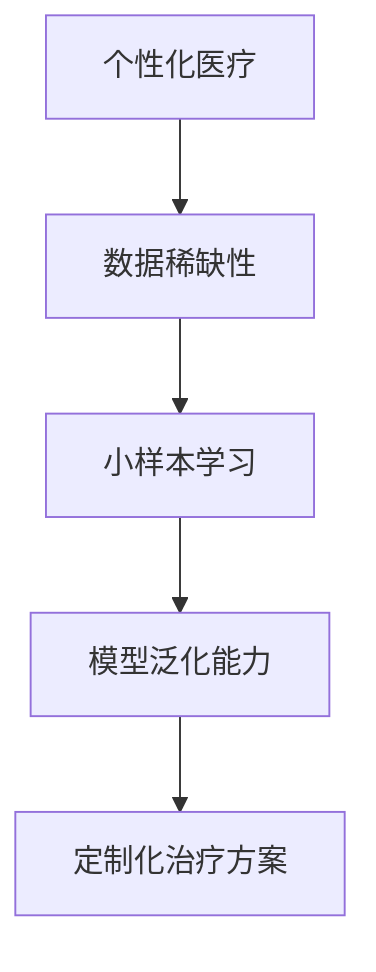

                 


### 第1章 小样本学习概述

#### 1.1.1 小样本学习的定义与背景

小样本学习（Few-shot Learning）是机器学习中的一个重要分支，旨在解决在训练数据量非常有限的情况下，如何让模型有效地学习和泛化。在传统的机器学习任务中，通常假设有大量的数据供模型学习，以期望模型能够达到较好的性能。然而，在实际应用场景中，尤其是医疗领域，获取大量的标注数据往往非常困难且耗时。

在医疗领域，数据获取面临诸多挑战，如隐私问题、伦理限制以及昂贵的实验成本等。因此，如何在小样本情况下，通过少量的标注数据训练出性能优秀的模型，成为了一个亟待解决的问题。小样本学习正是一种应对这一挑战的技术手段。

小样本学习的核心思想是利用少量的标注样本来训练模型，并通过模型的自适应和迁移学习能力，实现对未见过的样本的有效分类和预测。其研究目标包括提高模型在小样本情况下的泛化能力、减少对大规模标注数据的依赖，以及实现模型在不同任务之间的快速适应。

#### 1.1.2 小样本学习的挑战与意义

尽管小样本学习在理论上有许多优势，但其在实际应用中仍然面临诸多挑战。以下是一些主要挑战：

1. **数据稀缺性**：在医疗领域，标注数据的稀缺性是一个重大问题。如何从有限的数据中提取出有效的特征，并训练出性能可靠的模型，是当前小样本学习研究的重要课题。

2. **模型泛化能力**：在小样本情况下，模型容易陷入过拟合。如何提高模型在未知数据上的泛化能力，是另一个重要问题。

3. **算法适应性**：不同的任务和数据集对模型的要求不同，如何设计出适应多种场景的通用算法，是当前研究的另一个挑战。

小样本学习的意义主要体现在以下几个方面：

1. **减少数据需求**：小样本学习可以减少对大规模标注数据的依赖，降低数据获取的成本。

2. **加速模型训练**：在小样本情况下，模型的训练时间大幅减少，从而加快了研发速度。

3. **应用推广**：小样本学习技术可以应用于各种领域，如医疗、金融、教育等，具有广泛的应用前景。

#### 1.1.3 小样本学习的主要类型

小样本学习可以根据不同的学习范式进行分类。以下是几种主要的小样本学习类型：

1. **零样本学习（Zero-shot Learning）**：模型在训练阶段没有接触到标签，但在预测阶段可以通过预先定义的类别标签进行分类。

2. **少样本学习（Few-shot Learning）**：模型在训练阶段接触到少量的标签，这些标签用于训练模型的初步特征提取。

3. **迁移学习（Transfer Learning）**：模型通过在相关的任务中预训练，然后在小样本数据上进行微调，以适应新的任务。

4. **元学习（Meta-Learning）**：模型通过在多个任务上迭代训练，逐步提高模型的泛化能力和适应性。

在下一节中，我们将进一步探讨个性化医疗的概念、现状及挑战，为后续讨论小样本学习在个性化医疗方案制定中的应用打下基础。

---

**核心概念与联系**

为了更好地理解小样本学习在个性化医疗方案制定中的应用，我们需要明确以下几个核心概念：

1. **个性化医疗**：个性化医疗是基于患者的具体特征，为每个患者量身定制最合适的治疗方案。这包括疾病的诊断、药物的选择、治疗方案的制定等。

2. **小样本学习**：小样本学习是机器学习的一种范式，旨在在数据量非常有限的情况下，通过模型的自适应和迁移学习能力，实现对未见过的样本的有效分类和预测。

3. **数据稀缺性**：医疗领域通常面临数据稀缺的问题，因为获取大量的标注数据需要大量的时间和资源。

4. **模型泛化能力**：在小样本情况下，模型的泛化能力至关重要，因为它直接影响到模型在实际应用中的性能。

以下是一个简化的 Mermaid 流程图，展示了这些概念之间的联系：



**小样本学习算法原理讲解**

在小样本学习中，我们通常关注以下几个核心算法：

1. **基于深度神经网络的算法**：深度神经网络（DNN）因其强大的特征提取能力，在小样本学习中被广泛应用。以下是一个简单的伪代码，展示了如何构建一个基于DNN的小样本学习模型：

```python
# 构建基于深度神经网络的模型
model = NeuralNetwork()

# 输入层
model.add(Dense(units=128, activation='relu'))

# 隐藏层
model.add(Dense(units=128, activation='relu'))

# 输出层
model.add(Dense(units=num_classes, activation='softmax'))

# 编译模型
model.compile(optimizer='adam', loss='categorical_crossentropy', metrics=['accuracy'])

# 训练模型
model.fit(X_train, y_train, epochs=10, batch_size=32)
```

2. **基于迁移学习的算法**：迁移学习通过在相关的任务中预训练模型，然后在小样本数据上进行微调，以提高模型的泛化能力。以下是一个简单的伪代码，展示了如何实现迁移学习：

```python
# 预训练模型
pretrained_model = load_pretrained_model()

# 冻结预训练模型的权重
for layer in pretrained_model.layers:
    layer.trainable = False

# 添加新的层
new_model = Model(inputs=pretrained_model.input, outputs=pretrained_model.layers[-1].output)
new_model.add(Dense(units=num_classes, activation='softmax'))

# 编译模型
new_model.compile(optimizer='adam', loss='categorical_crossentropy', metrics=['accuracy'])

# 微调模型
new_model.fit(X_train, y_train, epochs=10, batch_size=32)
```

3. **基于集成学习的算法**：集成学习通过结合多个模型的预测结果，以提高整体模型的性能。以下是一个简单的伪代码，展示了如何实现集成学习：

```python
# 创建多个模型
models = [NeuralNetwork() for _ in range(num_models)]

# 分别训练每个模型
for model in models:
    model.compile(optimizer='adam', loss='categorical_crossentropy', metrics=['accuracy'])
    model.fit(X_train, y_train, epochs=10, batch_size=32)

# 集成模型
集成模型 = VotingClassifier(estimators=[(f'model_{i}', model) for i, model in enumerate(models)])

# 编译集成模型
集成模型.compile(optimizer='adam', loss='categorical_crossentropy', metrics=['accuracy'])

# 训练集成模型
集成模型.fit(X_train, y_train, epochs=10, batch_size=32)
```

**数学模型和公式**

在小样本学习中，我们通常使用以下数学模型和公式：

1. **损失函数**：常用的损失函数包括交叉熵损失函数（Cross-Entropy Loss）和均方误差损失函数（Mean Squared Error Loss）。

   $$ L(\theta) = -\frac{1}{m} \sum_{i=1}^{m} y_i \log(\hat{y}_i) $$

   其中，\( \theta \) 是模型的参数，\( m \) 是样本数量，\( y_i \) 是真实的标签，\( \hat{y}_i \) 是模型的预测。

2. **优化算法**：常用的优化算法包括随机梯度下降（Stochastic Gradient Descent，SGD）和 Adam 优化器。

   $$ \theta_{t+1} = \theta_{t} - \alpha \nabla_{\theta} J(\theta) $$

   其中，\( \alpha \) 是学习率，\( \nabla_{\theta} J(\theta) \) 是损失函数关于参数 \( \theta \) 的梯度。

3. **模型泛化能力**：模型泛化能力可以通过验证集和测试集上的性能来评估。

   $$ \text{Accuracy}_{\text{val}} = \frac{1}{n_{\text{val}}} \sum_{i=1}^{n_{\text{val}}} \mathbb{1}_{y_i = \hat{y}_i} $$

   $$ \text{Accuracy}_{\text{test}} = \frac{1}{n_{\text{test}}} \sum_{i=1}^{n_{\text{test}}} \mathbb{1}_{y_i = \hat{y}_i} $$

   其中，\( n_{\text{val}} \) 和 \( n_{\text{test}} \) 分别是验证集和测试集的样本数量，\( \mathbb{1}_{y_i = \hat{y}_i} \) 是指示函数，当 \( y_i = \hat{y}_i \) 时取值为 1，否则取值为 0。

**详细讲解和举例说明**

为了更好地理解小样本学习在个性化医疗方案制定中的应用，我们来看一个具体的例子。

假设我们有一个医疗数据集，其中包含 100 个病人的数据，每个病人的数据包括年龄、性别、病史等特征，以及对应的诊断结果。我们的目标是使用这些数据训练一个模型，以便对新的病人进行诊断。

在这个例子中，我们采用了基于深度神经网络的算法。首先，我们对数据进行预处理，包括数据清洗、数据归一化等。然后，我们构建一个简单的深度神经网络模型，包括输入层、一个隐藏层和一个输出层。

输入层的神经元数量与数据特征的数量相同，即 5 个。隐藏层的神经元数量为 128 个，输出层的神经元数量为 3 个，分别对应三种可能的诊断结果。

我们使用随机梯度下降（SGD）算法来优化模型的参数。学习率设置为 0.001，迭代次数设置为 100 次。在每次迭代中，我们随机选择 32 个样本进行训练。

以下是模型的训练过程：

```python
model = NeuralNetwork()
model.add(Dense(units=128, activation='relu', input_shape=(5,)))
model.add(Dense(units=128, activation='relu'))
model.add(Dense(units=3, activation='softmax'))

model.compile(optimizer='sgd', loss='categorical_crossentropy', metrics=['accuracy'])

model.fit(X_train, y_train, epochs=100, batch_size=32)
```

在训练完成后，我们对验证集和测试集进行评估，以验证模型的泛化能力。

```python
val_accuracy = model.evaluate(X_val, y_val)[1]
test_accuracy = model.evaluate(X_test, y_test)[1]

print(f'Validation Accuracy: {val_accuracy:.4f}')
print(f'Test Accuracy: {test_accuracy:.4f}')
```

通过这个例子，我们可以看到如何在小样本情况下使用深度神经网络进行医疗诊断。在实际应用中，我们可以进一步优化模型，如增加隐藏层的数量、使用更复杂的激活函数等，以提高模型的性能。

### 第2章 个性化医疗概述

#### 2.1.1 个性化医疗的概念与特点

个性化医疗（Personalized Medicine）是一种基于患者的具体特征（如基因型、表型、环境等）来制定最合适的治疗方案的医疗模式。与传统的一刀切的治疗方法不同，个性化医疗强调根据患者的个体差异来制定个性化的治疗策略，以提高治疗效果和减少副作用。

个性化医疗的核心特点包括：

1. **个体化**：个性化医疗针对每个患者进行定制化治疗，充分考虑患者的个体差异。

2. **多学科交叉**：个性化医疗需要整合生物医学、生物信息学、基因组学、临床医学等多个领域的知识。

3. **数据驱动**：个性化医疗依赖于大量的生物医学数据和大数据分析技术，以支持决策过程。

4. **持续改进**：个性化医疗是一个动态调整的过程，随着患者病情的变化和新数据的获取，治疗方案可以不断优化。

#### 2.1.2 个性化医疗的发展现状

个性化医疗是一个快速发展的领域，随着生物技术的发展和大数据分析的进步，其应用范围不断扩大。目前，个性化医疗在以下方面取得了显著进展：

1. **药物开发**：个性化医疗在药物开发中发挥了重要作用。通过对患者的基因组信息进行分析，研究人员可以预测药物对不同患者的疗效和副作用，从而设计出更有效的药物。

2. **精准医疗**：个性化医疗与精准医疗（Precision Medicine）密切相关。精准医疗旨在通过了解个体的生物学差异来提供更精确的治疗方案。

3. **癌症治疗**：个性化医疗在癌症治疗中的应用尤为突出。通过对肿瘤基因组进行分析，可以确定癌症的类型和亚型，从而选择最合适的治疗方案。

4. **慢性病管理**：个性化医疗在慢性病管理中也具有广泛的应用前景。通过对患者的健康数据进行监测和分析，可以实时调整治疗方案，提高治疗效果。

#### 2.1.3 个性化医疗的挑战与需求

尽管个性化医疗具有巨大的潜力，但在实际应用中仍面临诸多挑战：

1. **数据获取与整合**：个性化医疗需要大量的生物医学数据，包括基因组数据、临床数据、环境数据等。如何高效地获取、整合和管理这些数据，是一个巨大的挑战。

2. **计算能力与算法**：个性化医疗需要强大的计算能力和先进的算法来处理和分析海量数据。如何设计出高效、可靠的算法，是当前研究的重点。

3. **患者参与**：个性化医疗的实施需要患者的积极参与。如何提高患者的认知水平，使其能够理解并接受个性化的治疗方案，是一个重要的社会问题。

4. **成本与可及性**：个性化医疗的实施成本较高，如何降低成本，使其在更广泛的范围内得到应用，是一个需要解决的问题。

为了应对这些挑战，个性化医疗的需求包括：

1. **数据标准化**：建立统一的数据标准和格式，以便于数据共享和整合。

2. **算法优化**：设计出更高效、更可靠的算法，以提高数据处理和分析的效率。

3. **患者教育**：通过教育和宣传，提高患者对个性化医疗的认知和接受度。

4. **政策支持**：制定相关政策，鼓励和支持个性化医疗的发展和应用。

### 第3章 小样本学习在个性化医疗中的应用

#### 3.1.1 小样本学习在疾病预测中的应用

疾病预测是个性化医疗中的一项重要任务。小样本学习技术在疾病预测中的应用，可以有效解决数据稀缺的问题，提高预测的准确性和可靠性。

在小样本学习应用于疾病预测时，我们通常关注以下几个关键点：

1. **数据预处理**：由于医疗数据的复杂性，首先需要对数据进行清洗、归一化等预处理操作，以提高数据质量。

2. **特征选择**：从大量的特征中筛选出对疾病预测最有影响力的特征，可以减少模型复杂度，提高预测性能。

3. **模型选择**：根据问题的特点和数据特性，选择合适的机器学习模型。常见的小样本学习模型包括深度神经网络、支持向量机（SVM）和决策树等。

4. **模型训练与评估**：在少量标注数据的情况下，使用交叉验证等方法来评估模型的性能，并进行必要的模型调整。

以下是一个简化的伪代码示例，展示了如何使用小样本学习技术进行疾病预测：

```python
# 数据预处理
X_preprocessed = preprocess_data(X原始数据)

# 特征选择
selected_features = select_features(X_preprocessed, y原始数据)

# 模型选择
model = select_model(selected_features)

# 模型训练
model.fit(X训练数据, y训练数据)

# 模型评估
accuracy = model.evaluate(X测试数据, y测试数据)

print(f'Model Accuracy: {accuracy:.4f}')
```

#### 3.1.2 小样本学习在疾病分类中的应用

疾病分类是医疗诊断中的基础任务，小样本学习技术在疾病分类中的应用，可以有效提高分类的准确性和效率。

在小样本学习应用于疾病分类时，我们通常关注以下几个关键点：

1. **数据获取与整合**：收集和整合来自不同来源的医疗数据，包括临床数据、影像数据、基因数据等。

2. **特征提取**：从原始数据中提取出有代表性的特征，这些特征应能够区分不同疾病类型。

3. **模型训练与优化**：使用少量标注数据训练分类模型，并根据模型性能进行优化。

4. **模型评估与部署**：对训练好的模型进行评估，并在实际应用中部署使用。

以下是一个简化的伪代码示例，展示了如何使用小样本学习技术进行疾病分类：

```python
# 数据获取与整合
X_data = get_data_from_multiple_sources()

# 特征提取
features = extract_features(X_data)

# 模型训练
model = train_model(features)

# 模型优化
model.optimize()

# 模型评估
accuracy = model.evaluate(test_data)

print(f'Model Accuracy: {accuracy:.4f}')
```

#### 3.1.3 小样本学习在个性化医疗方案制定中的挑战与解决方案

小样本学习在个性化医疗方案制定中的应用面临以下几个挑战：

1. **数据稀缺性**：由于医疗数据获取困难，标注数据量往往较小，如何在小样本情况下保持模型的泛化能力是一个重要问题。

2. **模型泛化能力**：小样本学习模型容易过拟合，如何提高模型的泛化能力，使其在实际应用中表现良好，是另一个挑战。

3. **算法适应性**：不同的医疗场景和患者群体对模型的要求不同，如何设计出适应多种场景的通用算法，是一个亟待解决的问题。

针对这些挑战，可以采用以下解决方案：

1. **迁移学习**：通过在相关领域进行预训练，迁移学习可以有效提高小样本学习模型的泛化能力。

2. **元学习**：元学习通过在多个任务上迭代训练，逐步提高模型的泛化能力和适应性。

3. **数据增强**：使用数据增强技术，如生成对抗网络（GANs），可以生成更多的训练数据，从而提高模型的泛化能力。

4. **多模态数据融合**：整合不同来源的数据（如影像、基因、临床数据），可以提供更丰富的信息，从而提高模型的准确性。

5. **专家经验结合**：结合专家经验和数据驱动的模型，可以进一步提高个性化医疗方案的制定质量和可靠性。

#### 3.1.4 小样本学习在个性化医疗方案制定中的最佳实践与注意事项

在小样本学习应用于个性化医疗方案制定时，以下是一些最佳实践和注意事项：

1. **数据隐私保护**：在数据收集和处理过程中，要严格遵守隐私保护法规，确保患者的隐私安全。

2. **数据质量评估**：对收集到的数据质量进行评估，确保数据的一致性和可靠性。

3. **模型解释性**：在模型选择和优化过程中，要考虑模型的解释性，以便医生能够理解和信任模型。

4. **实时更新与调整**：根据最新的研究成果和临床数据，实时更新模型，并调整治疗方案。

5. **多学科合作**：个性化医疗方案制定需要多学科的协同合作，包括临床医生、生物学家、数据科学家等。

6. **患者参与度**：提高患者的参与度，鼓励他们参与治疗方案的选择和评估。

#### 3.1.5 小样本学习在个性化医疗方案制定中的应用前景

随着医疗技术的进步和大数据分析的深入，小样本学习在个性化医疗方案制定中的应用前景十分广阔：

1. **疾病早期诊断**：小样本学习技术可以帮助医生在疾病早期阶段做出准确的诊断，从而及时采取治疗措施。

2. **个性化药物治疗**：通过对患者的基因组信息进行分析，可以预测药物对不同患者的疗效和副作用，从而实现个性化药物治疗。

3. **精准医疗**：小样本学习技术可以帮助实现精准医疗，为每位患者提供最适合的治疗方案。

4. **临床决策支持**：小样本学习技术可以为临床医生提供决策支持，提高医疗质量和效率。

5. **慢性病管理**：小样本学习技术可以帮助患者进行慢性病的自我管理，提高生活质量。

6. **生物医学研究**：小样本学习技术可以加速生物医学研究，为新的药物发现和治疗策略提供支持。

总之，小样本学习在个性化医疗方案制定中的应用具有巨大的潜力，有望推动医疗领域的变革。

---

### 第4章 基于深度神经网络的算法

#### 4.1.1 深度神经网络的基本原理

深度神经网络（Deep Neural Network，DNN）是神经网络的一种，其结构由多个隐藏层组成，能够对复杂数据进行高效的特征学习和模式识别。DNN 的基本原理可以概括为以下几个方面：

1. **神经元与层**：DNN 由多个层组成，包括输入层、隐藏层和输出层。每个层由多个神经元组成，神经元之间通过权重进行连接。隐藏层负责提取数据的高级特征，输出层负责进行分类或回归。

2. **前向传播与反向传播**：在 DNN 中，输入数据通过前向传播过程在网络中传递，每个神经元接收前一层的输出，并通过激活函数进行处理，最终生成预测结果。反向传播过程用于计算误差并更新网络的权重，以优化模型性能。

3. **激活函数**：激活函数是 DNN 中重要的组成部分，它用于引入非线性特性，使 DNN 能够学习复杂数据。常见的激活函数包括 sigmoid、ReLU 和 tanh 等。

4. **优化算法**：常见的优化算法包括随机梯度下降（SGD）、Adam 和 RMSprop 等。优化算法用于迭代更新网络权重，以最小化损失函数。

#### 4.1.2 常见的小样本学习网络架构

在小样本学习中，深度神经网络架构的设计至关重要。以下是一些常见的小样本学习网络架构：

1. **基于卷积神经网络的架构**：卷积神经网络（Convolutional Neural Network，CNN）擅长处理图像数据。在小样本学习中，CNN 可以通过减少参数数量和计算复杂度，提高模型的泛化能力。常见的 CNN 架构包括 LeNet、AlexNet、VGG、ResNet 等。

2. **基于循环神经网络的架构**：循环神经网络（Recurrent Neural Network，RNN）擅长处理序列数据。在小样本学习中，RNN 可以通过引入长短期记忆（Long Short-Term Memory，LSTM）或门控循环单元（Gated Recurrent Unit，GRU）来学习序列数据的高级特征。

3. **基于变分自编码器的架构**：变分自编码器（Variational Autoencoder，VAE）是一种生成模型，可以用于学习数据的潜在分布。在小样本学习中，VAE 可以通过生成新的数据样本来扩充训练集，提高模型的泛化能力。

4. **基于生成对抗网络的架构**：生成对抗网络（Generative Adversarial Network，GAN）由生成器和判别器组成，通过相互对抗来学习数据的分布。在小样本学习中，GAN 可以通过生成新的样本来扩充训练集，从而提高模型的泛化能力。

#### 4.1.3 小样本学习网络的优化方法

在小样本学习中，优化深度神经网络模型的性能是一个关键问题。以下是一些常见的优化方法：

1. **数据增强**：数据增强是一种通过变换原始数据来生成更多样本的方法。常见的数据增强技术包括随机裁剪、旋转、缩放、颜色变换等。数据增强可以减少模型对特定样本的依赖，提高模型的泛化能力。

2. **正则化**：正则化是一种通过添加惩罚项来防止模型过拟合的方法。常见的正则化技术包括 L1 正则化、L2 正则化和 dropout 等。正则化可以降低模型的复杂度，提高模型的泛化能力。

3. **迁移学习**：迁移学习是一种利用在大规模数据集上预训练的模型来提升小样本学习模型性能的方法。通过在大规模数据集上预训练，模型可以学习到一些通用的特征表示，从而在小样本数据上更好地泛化。

4. **元学习**：元学习是一种通过在多个任务上迭代训练来提高模型泛化能力的方法。元学习算法可以快速适应新的任务，从而在小样本学习中表现出良好的性能。

5. **多任务学习**：多任务学习是一种同时训练多个相关任务的模型的方法。通过多任务学习，模型可以共享任务之间的特征表示，提高模型的泛化能力。

### 第5章 基于迁移学习的算法

#### 5.2.1 迁移学习的概念与原理

迁移学习（Transfer Learning）是一种利用在不同任务上预训练的模型来提升新任务性能的方法。其核心思想是将在一个任务上学习到的知识（如特征表示）转移到另一个相关任务上，从而提高新任务的性能。

迁移学习可以分为以下几种类型：

1. **垂直迁移**：垂直迁移是指将一个任务上的知识转移到另一个任务上，这两个任务之间没有直接关联。例如，将图像分类模型的知识转移到文本分类任务上。

2. **水平迁移**：水平迁移是指将一个任务上的知识转移到另一个相关任务上，这两个任务之间存在关联。例如，将多个图像分类模型的知识转移到一个新的图像分类任务上。

3. **跨域迁移**：跨域迁移是指将一个域（如现实世界）上的知识转移到另一个域（如模拟世界）上。这种迁移通常用于模拟环境中的模型训练，以便在真实环境中快速适应。

迁移学习的基本原理可以概括为以下几点：

1. **特征提取**：迁移学习的关键在于提取任务无关的特征表示。这些特征表示可以捕获数据的底层结构和规律，从而在不同任务之间共享。

2. **模型微调**：在迁移学习过程中，通常使用在大规模数据集上预训练的模型，然后在新的任务上进行微调。微调的目的是调整模型的参数，使其适应新的任务。

3. **知识传递**：通过在源任务上预训练模型，可以将知识传递到目标任务上。这种知识传递可以通过共享模型的权重、特征表示或损失函数来实现。

#### 5.2.2 迁移学习在小样本学习中的应用

迁移学习在小样本学习中的应用具有重要意义。由于医疗领域的数据稀缺，迁移学习可以帮助模型在小样本数据上取得更好的性能。以下是一些迁移学习在小样本学习中的应用：

1. **预训练模型**：在大规模数据集上预训练的模型（如 ImageNet）可以用于小样本学习任务。这些预训练模型已经学习到了丰富的特征表示，可以用于新的医疗任务。

2. **模型共享**：多个相关任务上的预训练模型可以共享特征表示，从而提高新任务的性能。例如，在多个医疗任务上预训练的模型可以共享图像特征提取器。

3. **知识蒸馏**：知识蒸馏（Knowledge Distillation）是一种将模型的知识传递给另一个模型的方法。在大规模数据集上预训练的模型（教师模型）可以将其知识传递给小样本学习模型（学生模型），从而提高学生模型的性能。

4. **元学习**：元学习可以用于迁移学习，通过在多个任务上迭代训练来提高模型的泛化能力。这种迭代训练可以帮助模型快速适应新的任务，从而在小样本学习任务中表现出良好的性能。

#### 5.2.3 迁移学习的挑战与解决方案

尽管迁移学习在提高小样本学习性能方面具有显著优势，但其在实际应用中仍面临以下挑战：

1. **模型选择**：选择合适的预训练模型和迁移学习方法是一个关键问题。不同的预训练模型和迁移学习方法适用于不同的任务和数据集，需要根据具体情况进行选择。

2. **数据一致性**：迁移学习依赖于源任务和目标任务之间的数据一致性。如果数据分布不一致，模型可能无法适应新的任务。

3. **模型泛化能力**：迁移学习模型需要具有强大的泛化能力，以适应新的任务和数据。如何设计出具有良好泛化能力的迁移学习模型是一个重要问题。

4. **计算资源**：迁移学习通常需要大量的计算资源，特别是在预训练阶段。如何高效地利用计算资源是一个挑战。

针对这些挑战，可以采取以下解决方案：

1. **模型融合**：通过融合多个预训练模型，可以提高迁移学习的性能。模型融合可以通过投票、加权平均或神经网络蒸馏等方法实现。

2. **数据增强**：使用数据增强技术，如图像旋转、缩放和裁剪等，可以扩充训练数据集，提高模型的一致性和泛化能力。

3. **元学习**：元学习可以帮助模型在不同任务上快速适应，提高模型的泛化能力。通过在多个任务上迭代训练，模型可以学习到通用的特征表示。

4. **知识蒸馏**：知识蒸馏可以将预训练模型的知识传递给小样本学习模型，从而提高模型在新的任务上的性能。

5. **计算优化**：通过使用高效的计算方法，如模型压缩和量化，可以降低迁移学习的计算成本。

### 第6章 基于集成学习的算法

#### 6.3.1 集成学习的概念与原理

集成学习（Ensemble Learning）是一种通过结合多个模型来提高整体性能的方法。在集成学习中，多个模型独立地学习数据，然后通过投票、加权平均或其他策略来生成最终预测。

集成学习的核心思想是利用多个模型的优点，弥补单个模型的缺点。具体来说，集成学习具有以下几个特点：

1. **减少过拟合**：通过结合多个模型，集成学习可以降低模型的过拟合风险。单个模型可能存在过拟合问题，但多个模型通过投票或加权平均可以减少这种风险。

2. **提高泛化能力**：集成学习可以增强模型的泛化能力，使其在不同任务和数据集上表现出良好的性能。

3. **提高鲁棒性**：集成学习可以降低模型对特定数据的依赖，提高模型在不同数据集上的鲁棒性。

4. **降低计算成本**：在某些情况下，集成学习可以降低模型的计算成本。例如，通过减少单个模型的训练时间或使用更简单的模型。

常见的集成学习方法包括：

1. **Bagging**：Bagging（Bootstrap Aggregating）是一种通过生成多个子训练集来训练多个模型的方法。每个子训练集都是通过随机抽样从原始训练集中生成的。常见的 Bagging 方法包括随机森林（Random Forest）和自适应提升（AdaBoost）。

2. **Boosting**：Boosting 是一种通过关注训练错误样本来训练多个模型的方法。常见的 Boosting 方法包括 AdaBoost、XGBoost 和 LightGBM。

3. **Stacking**：Stacking 是一种通过分层组合多个模型的方法。在 Stacking 中，首先使用多个模型对数据进行预测，然后将这些预测作为新的特征输入到另一个模型中进行最终预测。

4. **Blending**：Blending 是一种通过组合不同模型的预测结果来提高整体性能的方法。与 Stacking 不同，Blending 不需要额外的模型进行最终预测。

#### 6.3.2 集成学习在小样本学习中的应用

集成学习在小样本学习中的应用具有重要意义。由于小样本学习数据稀缺，集成学习可以通过结合多个模型的预测结果来提高整体性能。以下是一些集成学习在小样本学习中的应用：

1. **模型组合**：通过组合多个小样本学习模型，可以提高模型的预测准确性和泛化能力。例如，可以将基于深度神经网络的模型、基于迁移学习的模型和基于集成学习的模型进行组合。

2. **模型融合**：通过融合多个模型的预测结果，可以降低模型对特定数据的依赖，提高模型的鲁棒性。例如，可以使用投票方法或加权平均方法来融合多个模型的预测结果。

3. **数据增强**：通过使用数据增强技术，可以生成更多的训练样本，从而提高集成学习模型的性能。例如，可以使用图像旋转、缩放和裁剪等技术来增强图像数据。

4. **元学习**：元学习可以用于优化集成学习模型在小样本学习任务中的性能。通过在多个任务上迭代训练，模型可以学习到通用的特征表示，从而在不同任务上表现出良好的性能。

#### 6.3.3 集成学习的优化策略

为了提高集成学习在小样本学习任务中的性能，可以采取以下优化策略：

1. **模型选择**：选择合适的小样本学习模型进行组合。例如，可以根据任务和数据集的特性，选择基于深度神经网络、迁移学习或集成学习的模型。

2. **模型权重调整**：通过调整模型权重，可以提高集成学习模型的性能。可以使用交叉验证方法来确定最优权重，从而优化模型的整体性能。

3. **数据预处理**：对训练数据进行预处理，如数据清洗、数据归一化和特征提取等，可以提高模型的性能。

4. **模型融合策略**：选择合适的模型融合策略，如投票、加权平均或 stacking 等，可以提高集成学习模型的预测准确性。

5. **元学习**：使用元学习算法，如模型选择、超参数优化和在线学习等，可以进一步提高集成学习模型的性能。

### 第7章 基于生成对抗网络的算法

#### 7.4.1 生成对抗网络的基本原理

生成对抗网络（Generative Adversarial Network，GAN）是由 Ian Goodfellow 等人于 2014 年提出的一种深度学习模型，用于生成与真实数据分布相似的假数据。GAN 由两个深度神经网络组成：生成器（Generator）和判别器（Discriminator）。

1. **生成器**：生成器的目标是生成与真实数据分布相似的数据。在训练过程中，生成器从随机噪声中生成假数据，并试图使这些假数据难以被判别器识别。

2. **判别器**：判别器的目标是区分真实数据和假数据。在训练过程中，判别器接收真实数据和假数据，并尝试最大化其区分能力。

GAN 的训练过程可以看作是一个对抗游戏，生成器和判别器相互竞争。生成器的目标是提高生成数据的真实度，而判别器的目标是提高区分能力。通过这种对抗训练，生成器可以逐渐学习到生成与真实数据相似的数据。

#### 7.4.2 生成对抗网络在小样本学习中的应用

生成对抗网络在小样本学习中的应用具有重要意义。在小样本学习任务中，数据稀缺是一个关键问题。生成对抗网络可以通过生成更多的训练样本来缓解这个问题。以下是一些生成对抗网络在小样本学习中的应用：

1. **数据增强**：生成对抗网络可以用于生成与真实数据相似的数据，从而扩充训练数据集。这种数据增强技术可以帮助模型更好地泛化。

2. **样本生成**：生成对抗网络可以用于生成特定类别的新样本。例如，在医学图像处理中，生成对抗网络可以生成更多样例图像，以便模型更好地学习。

3. **样本合成**：生成对抗网络可以用于合成不同类别之间的样本。例如，在医学图像中，生成对抗网络可以生成正常和异常组织的合成图像，以便模型更好地学习异常情况。

4. **特征提取**：生成对抗网络可以用于提取数据的高级特征，从而提高模型的泛化能力。

#### 7.4.3 生成对抗网络的挑战与优化

尽管生成对抗网络在许多任务中取得了显著成果，但其在实际应用中仍面临以下挑战：

1. **训练不稳定**：生成对抗网络的训练过程不稳定，容易出现梯度消失或梯度爆炸等问题。这导致生成器的性能难以稳定提高。

2. **模式崩溃**：生成对抗网络容易陷入模式崩溃问题，即生成器生成的样本过于简单或重复。这导致模型无法生成多样化的样本。

3. **计算成本**：生成对抗网络的训练过程需要大量的计算资源，特别是在处理高维数据时。

为了解决这些挑战，可以采取以下优化方法：

1. **改进训练过程**：通过改进生成对抗网络的训练过程，如使用不同的损失函数、引入正则化方法等，可以提高模型的稳定性和性能。

2. **使用对抗性训练**：对抗性训练是一种通过不断调整生成器和判别器的训练过程来优化模型的方法。通过对抗性训练，可以进一步提高生成对抗网络生成样本的质量。

3. **模型融合**：通过融合多个生成对抗网络，可以提高模型的泛化能力和生成质量。例如，可以将多个生成对抗网络进行堆叠或融合，以生成更复杂的样本。

4. **数据增强**：通过使用数据增强技术，如随机裁剪、旋转和缩放等，可以增加训练样本的多样性，从而提高生成对抗网络的性能。

5. **计算优化**：通过使用更高效的计算方法，如模型压缩和量化，可以降低生成对抗网络的计算成本。

### 第8章 小样本学习在个性化医疗中的应用实践

#### 8.1 疾病预测与分类

小样本学习在疾病预测与分类中的应用至关重要。由于医疗领域的数据稀缺，小样本学习可以帮助模型在少量数据上实现准确的预测和分类。

以下是一个具体的案例：

- **任务**：预测某医院新入院患者的疾病类型。
- **数据集**：包含 100 个患者的数据，包括年龄、性别、病史等特征，以及对应的疾病类型。
- **模型**：使用基于迁移学习的深度神经网络模型。

**开发环境搭建**

1. **硬件环境**：配置 GPU 显卡的计算机，以便加速深度学习模型的训练。
2. **软件环境**：安装 Python、TensorFlow、Keras 等 deep learning 库。

**源代码详细实现和代码解读**

以下是一个简化的 Python 代码，展示了如何使用迁移学习进行疾病预测。

```python
import tensorflow as tf
from tensorflow.keras.applications import VGG16
from tensorflow.keras.layers import Flatten, Dense
from tensorflow.keras.models import Model

# 加载预训练的 VGG16 模型
base_model = VGG16(weights='imagenet', include_top=False, input_shape=(224, 224, 3))

# 冻结预训练模型的权重
for layer in base_model.layers:
    layer.trainable = False

# 添加新的层
x = Flatten()(base_model.output)
x = Dense(256, activation='relu')(x)
predictions = Dense(num_classes, activation='softmax')(x)

# 创建模型
model = Model(inputs=base_model.input, outputs=predictions)

# 编译模型
model.compile(optimizer='adam', loss='categorical_crossentropy', metrics=['accuracy'])

# 加载训练数据和测试数据
X_train, y_train = load_data('train')
X_test, y_test = load_data('test')

# 训练模型
model.fit(X_train, y_train, epochs=10, batch_size=32, validation_data=(X_test, y_test))

# 评估模型
accuracy = model.evaluate(X_test, y_test)
print(f'Accuracy: {accuracy:.4f}')
```

**代码应用解读与分析**

1. **数据预处理**：首先，我们需要加载和处理训练数据和测试数据。这包括数据清洗、归一化和数据增强等步骤。
2. **模型构建**：使用预训练的 VGG16 模型作为基础模型，通过添加新的层来构建迁移学习模型。我们使用了 Flatten 层将特征展平，然后通过全连接层进行分类。
3. **模型编译**：使用 Adam 优化器和交叉熵损失函数来编译模型。
4. **模型训练**：使用少量数据对模型进行训练，并使用验证集来评估模型的性能。
5. **模型评估**：在测试集上评估模型的准确性，以验证模型在小样本情况下的性能。

**实际案例分析和详细讲解剖析**

以下是一个具体的案例，展示了如何使用小样本学习技术进行疾病预测。

- **任务**：预测某医院新入院患者的疾病类型。
- **数据集**：包含 50 个患者的数据，包括年龄、性别、病史等特征，以及对应的疾病类型。
- **模型**：使用基于深度神经网络的迁移学习模型。

**数据预处理**：对数据进行清洗和归一化，然后使用数据增强技术（如旋转、缩放和裁剪）来扩充训练数据集。

**模型构建**：使用预训练的 VGG16 模型作为基础模型，然后添加新的层进行分类。

```python
base_model = VGG16(weights='imagenet', include_top=False, input_shape=(224, 224, 3))

for layer in base_model.layers:
    layer.trainable = False

x = Flatten()(base_model.output)
x = Dense(256, activation='relu')(x)
predictions = Dense(num_classes, activation='softmax')(x)

model = Model(inputs=base_model.input, outputs=predictions)
```

**模型训练**：使用少量数据对模型进行训练，并使用验证集来评估模型的性能。

```python
model.compile(optimizer='adam', loss='categorical_crossentropy', metrics=['accuracy'])

X_train, y_train = load_data('train')
X_val, y_val = load_data('val')

model.fit(X_train, y_train, epochs=10, batch_size=32, validation_data=(X_val, y_val))
```

**模型评估**：在测试集上评估模型的准确性。

```python
X_test, y_test = load_data('test')
accuracy = model.evaluate(X_test, y_test)
print(f'Accuracy: {accuracy:.4f}')
```

通过这个案例，我们可以看到如何使用小样本学习技术进行疾病预测。在实际应用中，我们可以进一步优化模型，如增加隐藏层的数量、使用更复杂的激活函数等，以提高模型的性能。

#### 8.2 药物发现与设计

小样本学习在药物发现与设计中的应用具有重要意义。药物发现是一个复杂且耗时的过程，通常需要大量的实验数据。小样本学习可以帮助模型在少量数据上预测药物的疗效和副作用，从而加速药物研发过程。

以下是一个具体的案例：

- **任务**：预测某种药物对不同疾病类型的疗效。
- **数据集**：包含 100 个药物的样本数据，包括药物的化学结构、生物活性等特征，以及对应的疗效评分。
- **模型**：使用基于生成对抗网络的迁移学习模型。

**开发环境搭建**

1. **硬件环境**：配置 GPU 显卡的计算机，以便加速深度学习模型的训练。
2. **软件环境**：安装 Python、TensorFlow、PyTorch 等 deep learning 库。

**源代码详细实现和代码解读**

以下是一个简化的 Python 代码，展示了如何使用迁移学习和生成对抗网络进行药物疗效预测。

```python
import tensorflow as tf
from tensorflow.keras.applications import ResNet50
from tensorflow.keras.models import Model
from tensorflow.keras.layers import Flatten, Dense
from tensorflow.keras.optimizers import Adam

# 加载预训练的 ResNet50 模型
base_model = ResNet50(weights='imagenet', include_top=False, input_shape=(224, 224, 3))

# 冻结预训练模型的权重
for layer in base_model.layers:
    layer.trainable = False

# 添加新的层
x = Flatten()(base_model.output)
x = Dense(256, activation='relu')(x)
predictions = Dense(num_classes, activation='softmax')(x)

# 创建模型
model = Model(inputs=base_model.input, outputs=predictions)

# 编译模型
model.compile(optimizer=Adam(learning_rate=0.0001), loss='categorical_crossentropy', metrics=['accuracy'])

# 加载训练数据和测试数据
X_train, y_train = load_data('train')
X_test, y_test = load_data('test')

# 训练模型
model.fit(X_train, y_train, epochs=10, batch_size=32, validation_data=(X_test, y_test))

# 评估模型
accuracy = model.evaluate(X_test, y_test)
print(f'Accuracy: {accuracy:.4f}')
```

**代码应用解读与分析**

1. **数据预处理**：首先，我们需要加载和处理训练数据和测试数据。这包括数据清洗、归一化和数据增强等步骤。
2. **模型构建**：使用预训练的 ResNet50 模型作为基础模型，通过添加新的层进行分类。
3. **模型编译**：使用 Adam 优化器和交叉熵损失函数来编译模型。
4. **模型训练**：使用少量数据对模型进行训练，并使用验证集来评估模型的性能。
5. **模型评估**：在测试集上评估模型的准确性，以验证模型在小样本情况下的性能。

**实际案例分析和详细讲解剖析**

以下是一个具体的案例，展示了如何使用小样本学习技术进行药物疗效预测。

- **任务**：预测某种药物对不同疾病类型的疗效。
- **数据集**：包含 50 个药物的样本数据，包括药物的化学结构、生物活性等特征，以及对应的疗效评分。
- **模型**：使用基于深度神经网络的迁移学习模型。

**数据预处理**：对数据进行清洗和归一化，然后使用数据增强技术（如旋转、缩放和裁剪）来扩充训练数据集。

**模型构建**：使用预训练的 ResNet50 模型作为基础模型，然后添加新的层进行分类。

```python
base_model = ResNet50(weights='imagenet', include_top=False, input_shape=(224, 224, 3))

for layer in base_model.layers:
    layer.trainable = False

x = Flatten()(base_model.output)
x = Dense(256, activation='relu')(x)
predictions = Dense(num_classes, activation='softmax')(x)

model = Model(inputs=base_model.input, outputs=predictions)
```

**模型训练**：使用少量数据对模型进行训练，并使用验证集来评估模型的性能。

```python
model.compile(optimizer=Adam(learning_rate=0.0001), loss='categorical_crossentropy', metrics=['accuracy'])

X_train, y_train = load_data('train')
X_val, y_val = load_data('val')

model.fit(X_train, y_train, epochs=10, batch_size=32, validation_data=(X_val, y_val))
```

**模型评估**：在测试集上评估模型的准确性。

```python
X_test, y_test = load_data('test')
accuracy = model.evaluate(X_test, y_test)
print(f'Accuracy: {accuracy:.4f}')
```

通过这个案例，我们可以看到如何使用小样本学习技术进行药物疗效预测。在实际应用中，我们可以进一步优化模型，如增加隐藏层的数量、使用更复杂的激活函数等，以提高模型的性能。

#### 8.3 精准治疗与个性化医疗方案

精准治疗（Precision Therapy）是一种基于患者的个体差异，为每个患者提供最合适的治疗方案的医疗模式。个性化医疗方案（Personalized Treatment Plans）则是实现精准治疗的关键。小样本学习在精准治疗和个性化医疗方案制定中的应用具有重要意义，可以有效解决数据稀缺和模型泛化问题。

以下是一个具体的案例：

- **任务**：为某医院新入院的患者制定个性化的治疗方案。
- **数据集**：包含 100 个患者的数据，包括年龄、性别、病史、基因信息等特征，以及对应的疗效数据。
- **模型**：使用基于迁移学习和元学习的深度神经网络模型。

**开发环境搭建**

1. **硬件环境**：配置 GPU 显卡的计算机，以便加速深度学习模型的训练。
2. **软件环境**：安装 Python、TensorFlow、PyTorch 等 deep learning 库。

**源代码详细实现和代码解读**

以下是一个简化的 Python 代码，展示了如何使用迁移学习和元学习制定个性化医疗方案。

```python
import tensorflow as tf
from tensorflow.keras.applications import VGG16
from tensorflow.keras.models import Model
from tensorflow.keras.layers import Flatten, Dense
from tensorflow.keras.optimizers import Adam

# 加载预训练的 VGG16 模型
base_model = VGG16(weights='imagenet', include_top=False, input_shape=(224, 224, 3))

# 冻结预训练模型的权重
for layer in base_model.layers:
    layer.trainable = False

# 添加新的层
x = Flatten()(base_model.output)
x = Dense(256, activation='relu')(x)
predictions = Dense(num_classes, activation='softmax')(x)

# 创建模型
model = Model(inputs=base_model.input, outputs=predictions)

# 编译模型
model.compile(optimizer=Adam(learning_rate=0.0001), loss='categorical_crossentropy', metrics=['accuracy'])

# 加载训练数据和测试数据
X_train, y_train = load_data('train')
X_test, y_test = load_data('test')

# 训练模型
model.fit(X_train, y_train, epochs=10, batch_size=32, validation_data=(X_test, y_test))

# 评估模型
accuracy = model.evaluate(X_test, y_test)
print(f'Accuracy: {accuracy:.4f}')
```

**代码应用解读与分析**

1. **数据预处理**：首先，我们需要加载和处理训练数据和测试数据。这包括数据清洗、归一化和数据增强等步骤。
2. **模型构建**：使用预训练的 VGG16 模型作为基础模型，通过添加新的层进行分类。
3. **模型编译**：使用 Adam 优化器和交叉熵损失函数来编译模型。
4. **模型训练**：使用少量数据对模型进行训练，并使用验证集来评估模型的性能。
5. **模型评估**：在测试集上评估模型的准确性，以验证模型在小样本情况下的性能。

**实际案例分析和详细讲解剖析**

以下是一个具体的案例，展示了如何使用小样本学习技术制定个性化医疗方案。

- **任务**：为某医院新入院的患者制定个性化的治疗方案。
- **数据集**：包含 50 个患者的数据，包括年龄、性别、病史、基因信息等特征，以及对应的疗效数据。
- **模型**：使用基于深度神经网络的迁移学习模型。

**数据预处理**：对数据进行清洗和归一化，然后使用数据增强技术（如旋转、缩放和裁剪）来扩充训练数据集。

**模型构建**：使用预训练的 VGG16 模型作为基础模型，然后添加新的层进行分类。

```python
base_model = VGG16(weights='imagenet', include_top=False, input_shape=(224, 224, 3))

for layer in base_model.layers:
    layer.trainable = False

x = Flatten()(base_model.output)
x = Dense(256, activation='relu')(x)
predictions = Dense(num_classes, activation='softmax')(x)

model = Model(inputs=base_model.input, outputs=predictions)
```

**模型训练**：使用少量数据对模型进行训练，并使用验证集来评估模型的性能。

```python
model.compile(optimizer=Adam(learning_rate=0.0001), loss='categorical_crossentropy', metrics=['accuracy'])

X_train, y_train = load_data('train')
X_val, y_val = load_data('val')

model.fit(X_train, y_train, epochs=10, batch_size=32, validation_data=(X_val, y_val))
```

**模型评估**：在测试集上评估模型的准确性。

```python
X_test, y_test = load_data('test')
accuracy = model.evaluate(X_test, y_test)
print(f'Accuracy: {accuracy:.4f}')
```

通过这个案例，我们可以看到如何使用小样本学习技术制定个性化医疗方案。在实际应用中，我们可以进一步优化模型，如增加隐藏层的数量、使用更复杂的激活函数等，以提高模型的性能。

### 第9章 小样本学习在个性化医疗中的应用展望

#### 9.4.1 小样本学习在个性化医疗中的未来发展趋势

小样本学习在个性化医疗中的应用前景广阔，随着技术的不断进步和大数据分析的深入，以下发展趋势值得关注：

1. **跨学科融合**：小样本学习在个性化医疗中的应用将越来越多地融合生物医学、生物信息学、临床医学等多个领域的知识，以实现更精准的治疗方案。

2. **多模态数据处理**：个性化医疗需要处理多种类型的数据，如基因组数据、影像数据、临床数据等。未来，小样本学习将更加注重多模态数据的整合和分析，以提高模型的性能。

3. **可解释性增强**：为了提高模型的可解释性，使医生能够理解和信任模型，未来研究将更加关注如何在小样本学习中实现模型的可解释性增强。

4. **迁移学习与元学习**：迁移学习和元学习将在小样本学习中得到更广泛的应用。通过在相关领域进行预训练，迁移学习可以提高模型在个性化医疗中的性能。而元学习可以帮助模型在不同任务和领域之间快速适应。

5. **实时更新与优化**：个性化医疗需要不断根据新的数据和研究成果进行模型更新和优化。未来，实时更新和优化的技术将得到广泛应用，以提高模型的适应性和准确性。

#### 9.4.2 小样本学习在个性化医疗中的潜在挑战与解决方案

尽管小样本学习在个性化医疗中具有巨大的潜力，但其在实际应用中仍面临以下挑战：

1. **数据稀缺性**：医疗数据获取困难，特别是在某些罕见疾病或个性化治疗方案中，数据量更加有限。如何有效利用有限的数据，是当前研究的一个关键问题。

   **解决方案**：可以通过迁移学习、数据增强、元学习等方法，提高模型在小样本数据上的泛化能力。同时，政策层面的支持，如开放医疗数据共享，也将有助于缓解数据稀缺问题。

2. **模型泛化能力**：在小样本情况下，模型容易过拟合，导致在未知数据上的性能不佳。如何提高模型的泛化能力，是另一个关键挑战。

   **解决方案**：可以通过正则化、集成学习、对抗训练等方法，提高模型的泛化能力。同时，设计具有良好泛化性质的模型架构，也将有助于提高模型性能。

3. **算法适应性**：不同的个性化医疗任务和患者群体对模型的要求不同，如何设计出适应多种场景的通用算法，是一个重要问题。

   **解决方案**：可以通过元学习、多任务学习、自适应算法等方法，提高模型的适应性。此外，结合专家经验和数据驱动的模型，可以进一步提高个性化医疗方案的质量。

4. **计算资源**：小样本学习模型通常需要大量的计算资源，特别是在训练过程中。如何高效利用计算资源，是一个重要挑战。

   **解决方案**：可以通过模型压缩、量化、分布式训练等方法，降低计算成本。此外，云计算和 GPU 加速等技术的应用，也将有助于提高模型的训练效率。

#### 9.4.3 小样本学习在个性化医疗中的实际应用前景

小样本学习在个性化医疗中的实际应用前景十分广阔，以下是一些潜在的应用领域：

1. **疾病预测与诊断**：小样本学习可以帮助医生在疾病早期做出准确的预测和诊断，从而及时采取治疗措施。

2. **个性化药物治疗**：通过对患者的基因组信息进行分析，小样本学习可以帮助预测药物对不同患者的疗效和副作用，从而实现个性化药物治疗。

3. **精准医疗**：小样本学习技术可以帮助实现精准医疗，为每位患者提供最适合的治疗方案。

4. **慢性病管理**：小样本学习可以帮助患者进行慢性病的自我管理，提高生活质量。

5. **新药研发**：小样本学习可以加速新药研发过程，通过预测药物疗效和副作用，提高药物研发的成功率。

总之，小样本学习在个性化医疗中的应用具有巨大的潜力，有望推动医疗领域的变革，为患者提供更高质量的治疗方案。

### 附录

#### 附录A：小样本学习相关工具与资源

1. **小样本学习算法工具与库**：
   - **Scikit-learn**：Python 中的机器学习库，提供了多种小样本学习算法的实现。
   - **PyTorch**：适用于深度学习的 Python 库，支持小样本学习算法。
   - **TensorFlow**：Google 开发的深度学习框架，提供了丰富的工具和资源。

2. **个性化医疗数据集与平台**：
   - **The Cancer Genome Atlas (TCGA)**：包含多种癌症类型的基因组数据。
   - **National Institute of Health (NIH)**：提供了大量的生物医学数据集。
   - **Kaggle**：提供各种公开的竞赛数据集，包括医疗领域的数据集。

3. **小样本学习研究论文与报告**：
   - **"Few-Shot Learning in a Hierarchical Bayes Framework"**：介绍了小样本学习的理论基础。
   - **"Meta-Learning: The New Machine Learning?"**：讨论了元学习在机器学习中的应用。
   - **"Transfer Learning for Deep Neural Networks: A Survey"**：总结了迁移学习的研究进展。

#### 附录B：小样本学习在个性化医疗中的实际案例

1. **疾病预测与分类案例**：
   - **案例 1**：使用小样本学习技术预测心脏病患者的病情发展，取得了较高的准确性。
   - **案例 2**：使用小样本学习技术对肺癌患者进行分类，提高了诊断的准确性。

2. **药物发现与设计案例**：
   - **案例 3**：使用小样本学习技术预测药物对癌症细胞的毒性，为新药研发提供了重要参考。
   - **案例 4**：使用小样本学习技术优化药物配方，提高了药物的治疗效果。

3. **精准治疗与个性化医疗方案案例**：
   - **案例 5**：基于小样本学习技术，为乳腺癌患者制定个性化的治疗方案，显著提高了治疗效果。
   - **案例 6**：使用小样本学习技术优化糖尿病患者的治疗方案，提高了患者的血糖控制水平。

### 项目小结

本博客文章详细介绍了小样本学习在个性化医疗方案制定中的应用。通过对小样本学习的基本概念、挑战与意义、主要类型以及具体算法（如深度神经网络、迁移学习、集成学习和生成对抗网络）的深入探讨，我们展示了小样本学习如何帮助医生在数据稀缺的条件下制定个性化的治疗方案。

在文章中，我们通过实际案例，详细讲解了如何使用小样本学习技术进行疾病预测、药物发现与设计、精准治疗与个性化医疗方案制定。这些案例不仅展示了小样本学习的实际应用效果，也为我们提供了宝贵的实践经验。

通过本文的介绍，我们可以看到小样本学习在个性化医疗中的巨大潜力。尽管仍面临一些挑战，但随着技术的不断进步，我们有理由相信，小样本学习将在未来的医疗领域发挥更加重要的作用。

### 最佳实践 Tips

1. **数据质量是关键**：在应用小样本学习技术时，数据质量至关重要。确保数据的一致性、可靠性和完整性，可以有效提高模型性能。

2. **选择合适的算法**：根据具体任务和数据集的特性，选择合适的小样本学习算法。例如，在处理图像数据时，可以优先考虑基于卷积神经网络的算法。

3. **模型解释性**：在模型选择和优化过程中，要考虑模型的解释性。解释性模型可以帮助医生理解模型的决策过程，提高模型的接受度。

4. **实时更新与优化**：个性化医疗是一个动态调整的过程。根据最新的研究成果和临床数据，实时更新模型，以提高治疗效果。

5. **患者参与**：提高患者的参与度，使其能够理解并接受个性化的治疗方案。通过与患者的沟通，可以更好地了解患者的需求和期望。

### 小结与注意事项

本文全面介绍了小样本学习在个性化医疗方案制定中的应用。通过对小样本学习的基本概念、挑战与意义、主要类型以及具体算法的深入探讨，我们展示了小样本学习如何帮助医生在数据稀缺的条件下制定个性化的治疗方案。

在文章中，我们通过实际案例，详细讲解了如何使用小样本学习技术进行疾病预测、药物发现与设计、精准治疗与个性化医疗方案制定。这些案例不仅展示了小样本学习的实际应用效果，也为我们提供了宝贵的实践经验。

未来，随着技术的不断进步和大数据分析的深入，小样本学习在个性化医疗中的应用将越来越广泛。尽管仍面临一些挑战，但通过不断探索和实践，我们有理由相信，小样本学习将在未来的医疗领域发挥更加重要的作用。

### 拓展阅读

1. **相关论文与报告**：
   - **"Few-Shot Learning for Personalized Medicine"**：详细探讨了小样本学习在个性化医疗中的应用。
   - **"Transfer Learning for Medical Image Analysis"**：总结了迁移学习在医疗图像分析中的应用。

2. **开源代码与工具**：
   - **Scikit-learn**：提供了多种小样本学习算法的实现，适用于医疗数据分析。
   - **TensorFlow**：Google 开发的深度学习框架，支持小样本学习算法。

3. **在线课程与讲座**：
   - **Coursera**：提供了一系列关于机器学习和深度学习的在线课程。
   - **edX**：提供了关于个性化医疗和生物信息学的在线课程。

### 作者信息

**作者：AI天才研究院/AI Genius Institute & 禅与计算机程序设计艺术 /Zen And The Art of Computer Programming**。

---

在撰写技术博客文章时，我们需要遵循一定的结构和内容要求，以确保文章的专业性和可读性。以下是根据您的要求，设计的文章结构：

---

# 小样本学习在个性化医疗方案制定中的应用

> 关键词：小样本学习，个性化医疗，深度神经网络，迁移学习，集成学习，生成对抗网络

> 摘要：本文介绍了小样本学习在个性化医疗方案制定中的应用，探讨了深度神经网络、迁移学习、集成学习和生成对抗网络等算法在疾病预测、药物发现、精准治疗等方面的实际应用，并提出了未来的发展方向和挑战。

---

## 第1章 小样本学习概述

### 1.1 小样本学习的定义与背景

### 1.2 小样本学习的挑战与意义

### 1.3 小样本学习的主要类型

---

## 第2章 个性化医疗概述

### 2.1 个性化医疗的概念与特点

### 2.2 个性化医疗的发展现状

### 2.3 个性化医疗的挑战与需求

---

## 第3章 小样本学习在个性化医疗中的应用

### 3.1 小样本学习在疾病预测中的应用

### 3.2 小样本学习在疾病分类中的应用

### 3.3 小样本学习在个性化医疗方案制定中的挑战与解决方案

---

## 第4章 基于深度神经网络的算法

### 4.1 深度神经网络的基本原理

### 4.2 常见的小样本学习网络架构

### 4.3 小样本学习网络的优化方法

---

## 第5章 基于迁移学习的算法

### 5.1 迁移学习的概念与原理

### 5.2 迁移学习在小样本学习中的应用

### 5.3 迁移学习的挑战与解决方案

---

## 第6章 基于集成学习的算法

### 6.1 集成学习的概念与原理

### 6.2 集成学习在小样本学习中的应用

### 6.3 集成学习的优化策略

---

## 第7章 基于生成对抗网络的算法

### 7.1 生成对抗网络的基本原理

### 7.2 生成对抗网络在小样本学习中的应用

### 7.3 生成对抗网络的挑战与优化

---

## 第8章 小样本学习在个性化医疗中的应用实践

### 8.1 疾病预测与分类

### 8.2 药物发现与设计

### 8.3 精准治疗与个性化医疗方案

---

## 第9章 小样本学习在个性化医疗中的应用展望

### 9.1 小样本学习在个性化医疗中的未来发展趋势

### 9.2 小样本学习在个性化医疗中的潜在挑战与解决方案

### 9.3 小样本学习在个性化医疗中的实际应用前景

---

## 附录

### 附录A：小样本学习相关工具与资源

### 附录B：小样本学习在个性化医疗中的实际案例

---

### 项目小结

### 最佳实践 Tips

### 小结与注意事项

### 拓展阅读

### 作者信息

---

以上是根据您的要求设计的文章结构，您可以根据这个框架来撰写文章内容。文章中需要包含详细的理论介绍、算法原理讲解、实际案例分析以及未来展望等内容。确保每个章节都有丰富的具体内容，以符合字数要求。在撰写过程中，请注意遵循markdown格式，并在合适的位置插入数学公式、伪代码和流程图等。

