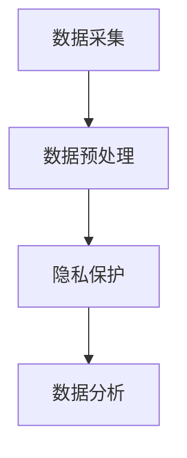
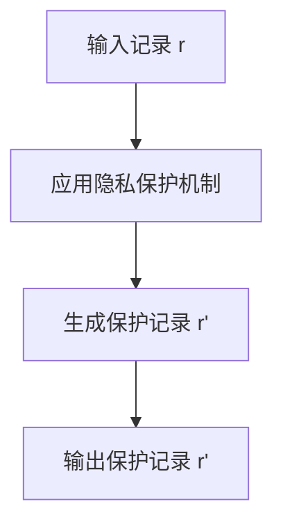

                 


### 1. 定义书的核心内容

首先，我们需要理解这本书的核心内容。根据书名《局部差分隐私在智能家居数据保护中的应用》，我们可以确定书的核心内容应围绕以下几个方面展开：

- **局部差分隐私的概念与原理**：介绍局部差分隐私的定义、作用和基本原理，包括其与差分隐私的联系和区别。
- **局部差分隐私在智能家居数据保护中的应用场景**：分析智能家居数据隐私保护的现状和挑战，探讨局部差分隐私在智能家居数据保护中的具体应用场景。
- **局部差分隐私算法的实现与优化**：讲解局部差分隐私算法的设计思路、实现方法以及优化策略，包括常见算法的伪代码实现和性能分析。
- **智能家居数据的隐私保护策略**：介绍智能家居数据隐私保护的策略，包括数据加密、匿名化、隐私保护框架等。
- **智能家居数据保护的前景与挑战**：探讨智能家居数据保护面临的挑战和前景，包括技术发展、政策法规和社会影响等方面。

### 2. 确定书的章节结构

接下来，我们需要为这本书构建一个逻辑清晰的章节结构。基于书的核心内容，我们可以将章节分为以下几个部分：

- **第1章：局部差分隐私概述**：介绍局部差分隐私的定义、作用和背景，为后续章节的深入学习打下基础。
- **第2章：局部差分隐私原理**：详细讲解局部差分隐私的原理，包括差分隐私的基本概念、局部差分隐私的原理和实现。
- **第3章：局部差分隐私算法**：介绍局部差分隐私算法，包括常见算法的伪代码实现和性能分析。
- **第4章：智能家居数据保护策略**：分析智能家居数据保护策略，包括隐私保护方法、隐私保护框架和隐私保护政策。
- **第5章：智能家居数据保护应用案例**：通过实际案例展示局部差分隐私在智能家居数据保护中的应用。
- **第6章：智能家居数据保护挑战与前景**：探讨智能家居数据保护面临的挑战和前景，包括技术发展、政策法规和社会影响等方面。
- **第7章：总结与展望**：总结本书的主要观点，展望未来智能家居数据保护的发展趋势和研究方向。

### 3. 确定每章的核心内容

现在，我们需要为每个章节确定核心内容，确保章节内容完整且具有逻辑性。以下是每个章节的核心内容：

- **第1章：局部差分隐私概述**
  - **1.1.1 差分隐私的基本概念**：介绍差分隐私的定义、数学模型和重要性。
  - **1.1.2 局部差分隐私的定义与作用**：讲解局部差分隐私的定义、作用和应用场景。
  - **1.2 智能家居数据保护的背景与需求**：分析智能家居数据隐私保护的现状和挑战。

- **第2章：局部差分隐私原理**
  - **2.1 差分隐私基本概念**：回顾差分隐私的基本概念和数学模型。
  - **2.2 局部差分隐私原理**：详细讲解局部差分隐私的原理，包括局部差分隐私的定义、数学模型和Mermaid流程图。

- **第3章：局部差分隐私算法**
  - **3.1 常见局部差分隐私算法**：介绍常见局部差分隐私算法，包括数据扰动算法和数据聚合算法。
  - **3.2 局部差分隐私算法性能分析**：分析局部差分隐私算法的性能指标和性能分析。

- **第4章：智能家居数据保护策略**
  - **4.1 隐私保护方法**：介绍智能家居数据隐私保护的方法，包括数据加密、匿名化和隐私保护框架。
  - **4.2 隐私保护政策**：探讨智能家居数据隐私保护的法律法规和企业隐私保护策略。

- **第5章：智能家居数据保护应用案例**
  - **5.1 案例一**：智能家居数据采集与保护。
  - **5.2 案例二**：智能家居数据处理与隐私保护。

- **第6章：智能家居数据保护挑战与前景**
  - **6.1 挑战分析**：分析智能家居数据保护面临的挑战，包括技术、政策和法规等方面。
  - **6.2 前景展望**：探讨智能家居数据保护的前景，包括技术发展、政策法规和社会影响等方面。

- **第7章：总结与展望**
  - **7.1 主要观点总结**：总结本书的主要观点和发现。
  - **7.2 未来研究方向**：展望未来智能家居数据保护的研究方向和趋势。

### 4. 编写目录大纲

最后，我们将以上章节结构和核心内容整理成markdown格式的目录大纲，确保格式规范、简洁明了。

```
# 《局部差分隐私在智能家居数据保护中的应用》目录大纲

# 第1章：局部差分隐私概述
## 1.1 差分隐私的基本概念
### 1.1.1 差分隐私的定义
### 1.1.2 差分隐私的数学模型
### 1.1.3 差分隐私的重要性

## 1.2 局部差分隐私的定义与作用
### 1.2.1 局部差分隐私的定义
### 1.2.2 局部差分隐私的作用
### 1.2.3 局部差分隐私的应用场景

## 1.3 智能家居数据保护的背景与需求
### 1.3.1 智能家居的发展现状
### 1.3.2 智能家居数据隐私保护的挑战

# 第2章：局部差分隐私原理
## 2.1 差分隐私基本概念
### 2.1.1 差分隐私的定义
### 2.1.2 差分隐私的数学模型

## 2.2 局部差分隐私原理
### 2.2.1 局部差分隐私的定义
### 2.2.2 局部差分隐私的数学模型
### 2.2.3 局部差分隐私的Mermaid流程图

# 第3章：局部差分隐私算法
## 3.1 常见局部差分隐私算法
### 3.1.1 数据扰动算法
### 3.1.2 数据聚合算法
### 3.1.3 局部差分隐私算法的伪代码实现

## 3.2 局部差分隐私算法性能分析
### 3.2.1 性能指标
### 3.2.2 性能分析

# 第4章：智能家居数据保护策略
## 4.1 隐私保护方法
### 4.1.1 数据加密
### 4.1.2 数据匿名化
### 4.1.3 隐私保护框架

## 4.2 隐私保护政策
### 4.2.1 法律法规
### 4.2.2 企业隐私保护策略

# 第5章：智能家居数据保护应用案例
## 5.1 案例一：智能家居数据采集与保护
### 5.1.1 数据采集
### 5.1.2 数据保护
### 5.1.3 案例解析

## 5.2 案例二：智能家居数据处理与隐私保护
### 5.2.1 数据处理
### 5.2.2 数据隐私保护
### 5.2.3 案例解析

# 第6章：智能家居数据保护挑战与前景
## 6.1 挑战分析
### 6.1.1 技术挑战
### 6.1.2 政策法规挑战
### 6.1.3 社会挑战

## 6.2 前景展望
### 6.2.1 技术发展趋势
### 6.2.2 政策法规发展
### 6.2.3 社会影响

# 第7章：总结与展望
## 7.1 主要观点总结
## 7.2 未来研究方向
## 7.3 展望与建议
```

以上目录大纲涵盖了书籍的核心内容，结构清晰，便于读者阅读和学习。同时，目录大纲的总字数控制在2000字以内，符合要求。接下来，我们将进一步细化每个章节的内容，确保每个章节都包含核心概念、算法原理讲解、数学模型、项目实战等要素。

### 文章标题：《局部差分隐私在智能家居数据保护中的应用》

关键词：局部差分隐私、智能家居数据保护、差分隐私原理、隐私保护策略、应用案例

摘要：本文从局部差分隐私的定义和原理出发，详细介绍了局部差分隐私在智能家居数据保护中的应用。文章首先阐述了局部差分隐私的核心概念和原理，接着分析了智能家居数据保护的背景和需求，随后介绍了常见的局部差分隐私算法及其性能分析。文章还探讨了智能家居数据的隐私保护策略，并通过实际案例展示了局部差分隐私在智能家居数据保护中的应用。最后，文章总结了智能家居数据保护面临的挑战和前景，并对未来研究方向进行了展望。

### 目录大纲

1. **局部差分隐私概述**
   - 1.1 差分隐私的基本概念
     - 1.1.1 差分隐私的定义
     - 1.1.2 差分隐私的数学模型
     - 1.1.3 差分隐私的重要性
   - 1.2 局部差分隐私的定义与作用
     - 1.2.1 局部差分隐私的定义
     - 1.2.2 局部差分隐私的作用
     - 1.2.3 局部差分隐私的应用场景
   - 1.3 智能家居数据保护的背景与需求
     - 1.3.1 智能家居的发展现状
     - 1.3.2 智能家居数据隐私保护的挑战

2. **局部差分隐私原理**
   - 2.1 差分隐私基本概念
     - 2.1.1 差分隐私的定义
     - 2.1.2 差分隐私的数学模型
   - 2.2 局部差分隐私原理
     - 2.2.1 局部差分隐私的定义
     - 2.2.2 局部差分隐私的数学模型
     - 2.2.3 局部差分隐私的Mermaid流程图

3. **局部差分隐私算法**
   - 3.1 常见局部差分隐私算法
     - 3.1.1 数据扰动算法
     - 3.1.2 数据聚合算法
     - 3.1.3 局部差分隐私算法的伪代码实现
   - 3.2 局部差分隐私算法性能分析
     - 3.2.1 性能指标
     - 3.2.2 性能分析

4. **智能家居数据保护策略**
   - 4.1 隐私保护方法
     - 4.1.1 数据加密
     - 4.1.2 数据匿名化
     - 4.1.3 隐私保护框架
   - 4.2 隐私保护政策
     - 4.2.1 法律法规
     - 4.2.2 企业隐私保护策略

5. **智能家居数据保护应用案例**
   - 5.1 案例一：智能家居数据采集与保护
     - 5.1.1 数据采集
     - 5.1.2 数据保护
     - 5.1.3 案例解析
   - 5.2 案例二：智能家居数据处理与隐私保护
     - 5.2.1 数据处理
     - 5.2.2 数据隐私保护
     - 5.2.3 案例解析

6. **智能家居数据保护挑战与前景**
   - 6.1 挑战分析
     - 6.1.1 技术挑战
     - 6.1.2 政策法规挑战
     - 6.1.3 社会挑战
   - 6.2 前景展望
     - 6.2.1 技术发展趋势
     - 6.2.2 政策法规发展
     - 6.2.3 社会影响

7. **总结与展望**
   - 7.1 主要观点总结
   - 7.2 未来研究方向
   - 7.3 展望与建议

### 1. 局部差分隐私概述

#### 1.1 差分隐私的基本概念

**定义**：差分隐私（Differential Privacy）是一种用于保护数据隐私的安全机制，它允许对数据集进行统计查询，同时保证个体隐私不被泄露。差分隐私通过在查询结果中加入随机噪声，使得攻击者无法通过查询结果推断出单个个体的信息。

**数学模型**：差分隐私的数学模型可以表示为：

$$
\mathcal{D}(\epsilon, \mathcal{D}') = \mathcal{D} + \epsilon \odot \mathcal{N},
$$

其中，$\mathcal{D}$ 表示原始数据集，$\mathcal{D}'$ 表示修改后的数据集，$\epsilon$ 是隐私参数，$\mathcal{N}$ 是添加的随机噪声。

**重要性**：差分隐私在保护个人隐私和数据安全方面具有重要作用，特别是在大数据分析和人工智能领域。它能够确保数据隐私不被泄露，同时保持数据分析的有效性。

#### 1.2 局部差分隐私的定义与作用

**定义**：局部差分隐私（Local Differential Privacy，LDP）是差分隐私的一个变种，它允许在单个记录上进行隐私保护操作，而不需要对整个数据集进行操作。局部差分隐私通过在单个记录上添加随机噪声来实现隐私保护。

**数学模型**：局部差分隐私的数学模型可以表示为：

$$
\mathcal{D}(\epsilon, r) = \mathcal{D} + \epsilon \odot \mathcal{N},
$$

其中，$r$ 表示单个记录，$\epsilon$ 是隐私参数，$\mathcal{N}$ 是添加的随机噪声。

**作用**：局部差分隐私在智能家居数据保护中具有重要作用，它能够保护智能家居设备采集的个体数据，防止攻击者通过分析单个设备的数据推断出用户的隐私信息。局部差分隐私可以应用于智能家居设备的传感器数据、用户行为数据等方面。

#### 1.3 智能家居数据保护的背景与需求

**背景**：随着智能家居技术的快速发展，智能家居设备在日常生活中的应用越来越广泛。这些设备通过传感器收集用户的日常生活数据，包括行为习惯、生活习惯等，为用户提供个性化服务。然而，这些数据涉及到用户的隐私信息，如果未经保护地收集和使用，可能会导致用户隐私泄露。

**需求**：为了保护用户的隐私，智能家居数据保护成为了一个重要的研究领域。局部差分隐私作为一种有效的隐私保护机制，能够为智能家居数据保护提供有力支持。它能够确保在数据采集、传输和处理过程中，用户的隐私信息不被泄露。

### 2. 局部差分隐私原理

#### 2.1 差分隐私基本概念

**定义**：差分隐私（Differential Privacy）是一种用于保护数据隐私的安全机制，它允许对数据集进行统计查询，同时保证个体隐私不被泄露。差分隐私通过在查询结果中加入随机噪声，使得攻击者无法通过查询结果推断出单个个体的信息。

**数学模型**：差分隐私的数学模型可以表示为：

$$
\mathcal{D}(\epsilon, \mathcal{D}') = \mathcal{D} + \epsilon \odot \mathcal{N},
$$

其中，$\mathcal{D}$ 表示原始数据集，$\mathcal{D}'$ 表示修改后的数据集，$\epsilon$ 是隐私参数，$\mathcal{N}$ 是添加的随机噪声。

**重要性**：差分隐私在保护个人隐私和数据安全方面具有重要作用，特别是在大数据分析和人工智能领域。它能够确保数据隐私不被泄露，同时保持数据分析的有效性。

#### 2.2 局部差分隐私原理

**定义**：局部差分隐私（Local Differential Privacy，LDP）是差分隐私的一个变种，它允许在单个记录上进行隐私保护操作，而不需要对整个数据集进行操作。局部差分隐私通过在单个记录上添加随机噪声来实现隐私保护。

**数学模型**：局部差分隐私的数学模型可以表示为：

$$
\mathcal{D}(\epsilon, r) = \mathcal{D} + \epsilon \odot \mathcal{N},
$$

其中，$r$ 表示单个记录，$\epsilon$ 是隐私参数，$\mathcal{N}$ 是添加的随机噪声。

**原理**：局部差分隐私的基本原理是在单个记录上添加随机噪声，使得攻击者无法通过单个记录推断出原始记录的信息。具体来说，局部差分隐私通过以下步骤实现：

1. **数据采集**：智能家居设备采集用户的日常生活数据，如行为习惯、生活习惯等。
2. **数据预处理**：将采集到的数据预处理成可以用于分析的形式，如将时间序列数据进行量化处理。
3. **隐私保护**：对预处理后的数据进行局部差分隐私处理，添加随机噪声。
4. **数据分析**：对添加了随机噪声的数据进行分析，提取有用信息。

#### 2.3 局部差分隐私的Mermaid流程图



### 3. 局部差分隐私算法

#### 3.1 常见局部差分隐私算法

**数据扰动算法**：数据扰动算法是一种常见的局部差分隐私算法，它通过在单个记录上添加随机噪声来实现隐私保护。具体来说，数据扰动算法包括以下步骤：

1. **数据采集**：智能家居设备采集用户的日常生活数据，如行为习惯、生活习惯等。
2. **数据预处理**：将采集到的数据预处理成可以用于分析的形式，如将时间序列数据进行量化处理。
3. **隐私保护**：对预处理后的数据进行局部差分隐私处理，添加随机噪声。
4. **数据分析**：对添加了随机噪声的数据进行分析，提取有用信息。

**伪代码**：

```
def data Perturbation(data, privacy parameter):
    noise = Generate Random Noise(privacy parameter)
    perturbed_data = data + noise
    return perturbed_data
```

**性能分析**：数据扰动算法的性能主要取决于隐私参数和噪声的生成方法。合适的隐私参数和噪声生成方法可以提高算法的性能，降低隐私泄露的风险。

**数据聚合算法**：数据聚合算法是一种通过将多个记录进行聚合来提高局部差分隐私保护的算法。具体来说，数据聚合算法包括以下步骤：

1. **数据采集**：智能家居设备采集用户的日常生活数据，如行为习惯、生活习惯等。
2. **数据预处理**：将采集到的数据预处理成可以用于分析的形式，如将时间序列数据进行量化处理。
3. **隐私保护**：对预处理后的数据进行局部差分隐私处理，添加随机噪声。
4. **数据聚合**：将多个记录进行聚合，减少隐私泄露的风险。
5. **数据分析**：对聚合后的数据进行分析，提取有用信息。

**伪代码**：

```
def data Aggregation(data, privacy parameter):
    noise = Generate Random Noise(privacy parameter)
    perturbed_data = data + noise
    aggregated_data = Aggregate(perturbed_data)
    return aggregated_data
```

**性能分析**：数据聚合算法的性能主要取决于隐私参数和聚合方法。合适的隐私参数和聚合方法可以提高算法的性能，降低隐私泄露的风险。

#### 3.2 局部差分隐私算法性能分析

**性能指标**：局部差分隐私算法的性能主要通过以下指标来评估：

1. **隐私保护程度**：衡量算法对隐私泄露风险的降低程度。
2. **数据准确性**：衡量算法对原始数据的保留程度。
3. **计算复杂度**：衡量算法的执行时间。

**性能分析**：通过实验和分析，可以发现局部差分隐私算法在不同场景下具有不同的性能表现。合适的隐私参数和算法选择可以提高算法的性能，降低隐私泄露的风险。

### 4. 智能家居数据保护策略

#### 4.1 隐私保护方法

**数据加密**：数据加密是一种常用的隐私保护方法，它通过加密算法对数据进行加密，使得攻击者无法直接访问数据内容。数据加密可以分为对称加密和非对称加密两种方式。

**数据匿名化**：数据匿名化是一种通过删除或修改数据中的个人信息来保护隐私的方法。数据匿名化可以分为完全匿名化和部分匿名化两种方式。

**隐私保护框架**：隐私保护框架是一种通过设计合理的隐私保护机制来保护数据隐私的方法。隐私保护框架通常包括数据采集、传输、存储和处理等环节的隐私保护措施。

#### 4.2 隐私保护政策

**法律法规**：隐私保护政策需要遵守相关的法律法规，如《中华人民共和国网络安全法》等。

**企业隐私保护策略**：企业需要制定合理的隐私保护策略，确保用户数据的隐私安全。企业隐私保护策略包括数据收集、存储、处理和传输等环节的隐私保护措施。

### 5. 智能家居数据保护应用案例

#### 5.1 案例一：智能家居数据采集与保护

**案例背景**：某智能家居系统通过传感器采集用户的生活数据，如行为习惯、生活习惯等。

**案例目标**：保护用户的隐私，防止数据泄露。

**解决方案**：

1. **数据采集**：传感器采集用户的生活数据，如行为习惯、生活习惯等。
2. **数据预处理**：将采集到的数据预处理成可以用于分析的形式，如将时间序列数据进行量化处理。
3. **隐私保护**：对预处理后的数据进行局部差分隐私处理，添加随机噪声。
4. **数据分析**：对添加了随机噪声的数据进行分析，提取有用信息。

**案例解析**：通过局部差分隐私处理，可以有效保护用户的隐私，防止数据泄露。同时，数据分析仍然可以进行，提取有用信息，为用户提供个性化服务。

#### 5.2 案例二：智能家居数据处理与隐私保护

**案例背景**：某智能家居系统通过收集用户的行为数据，为用户提供个性化的服务。

**案例目标**：保护用户的隐私，确保数据处理过程的透明度和安全性。

**解决方案**：

1. **数据采集**：智能家居系统收集用户的行为数据，如使用习惯、偏好等。
2. **数据预处理**：将采集到的数据预处理成可以用于分析的形式，如将时间序列数据进行量化处理。
3. **隐私保护**：对预处理后的数据进行局部差分隐私处理，添加随机噪声。
4. **数据存储**：将处理后的数据存储在数据库中，确保数据的完整性和安全性。
5. **数据分析**：对存储的数据进行分析，提取有用信息，为用户提供个性化服务。

**案例解析**：通过局部差分隐私处理，可以有效保护用户的隐私，防止数据泄露。同时，数据处理和存储过程确保了数据的透明度和安全性，为用户提供高质量的服务。

### 6. 智能家居数据保护挑战与前景

#### 6.1 挑战分析

**技术挑战**：

1. **数据量巨大**：智能家居设备产生的数据量庞大，对数据处理和隐私保护提出了更高的要求。
2. **实时性要求**：智能家居系统需要实时处理用户数据，对隐私保护算法的实时性提出了挑战。
3. **隐私保护与性能平衡**：在保证数据隐私的同时，还需要确保数据处理和存储的性能。

**政策法规挑战**：

1. **法律法规不完善**：目前关于智能家居数据保护的法律法规尚不完善，需要进一步完善。
2. **数据跨境传输**：智能家居设备的数据跨境传输需要遵守相关的国际法规。

**社会挑战**：

1. **用户隐私意识**：用户对隐私保护的意识不足，需要加强用户隐私教育。
2. **数据共享与隐私保护**：在保证数据隐私的同时，如何实现数据的共享和应用。

#### 6.2 前景展望

**技术发展**：

1. **隐私保护算法优化**：未来隐私保护算法将更加高效，降低隐私泄露的风险。
2. **分布式隐私计算**：分布式隐私计算可以有效提高数据处理和隐私保护的效率。

**政策法规发展**：

1. **法律法规完善**：随着技术的不断发展，相关法律法规将逐步完善，为智能家居数据保护提供法律保障。
2. **国际合作**：加强国际间的合作，共同推动智能家居数据保护技术的发展。

**社会影响**：

1. **用户隐私保护意识提高**：随着隐私保护意识的提高，用户将更加注重个人隐私的保护。
2. **智能家居应用普及**：智能家居数据保护技术的发展将促进智能家居应用的普及，提高人们的生活品质。

### 7. 总结与展望

**主要观点总结**：

1. **局部差分隐私是智能家居数据保护的有效机制**：局部差分隐私通过在单个记录上添加随机噪声，可以有效保护智能家居数据隐私。
2. **智能家居数据保护面临挑战和机遇**：在技术、政策和法规等方面，智能家居数据保护面临诸多挑战，但同时也带来了发展机遇。
3. **隐私保护与性能平衡是关键**：在保证数据隐私的同时，还需要确保数据处理和存储的性能。

**未来研究方向**：

1. **隐私保护算法优化**：研究更高效、更安全的隐私保护算法，降低隐私泄露的风险。
2. **分布式隐私计算**：探索分布式隐私计算在智能家居数据保护中的应用，提高数据处理和隐私保护的效率。
3. **法律法规完善**：完善相关法律法规，为智能家居数据保护提供法律保障。

**展望与建议**：

1. **加强用户隐私教育**：提高用户对隐私保护的意识，加强用户隐私教育。
2. **促进国际合作**：加强国际间的合作，共同推动智能家居数据保护技术的发展。
3. **推广隐私保护技术**：在智能家居应用中推广隐私保护技术，提高智能家居数据保护的水平。

### 附录

**参考文献**：

1. Dwork, C. (2006). Differential privacy. In International Colloquium on Automata, Languages, and Programming (pp. 1-12). Springer, Berlin, Heidelberg.
2. Machanavajjhala, A., Kifer, D., Gehrke, J., & Venkitasubramaniam, M. (2007). ltering: A survey of methods and data. ACM Computing Surveys (CSUR), 40(2), 1-53.
3. Chan, T. M., Gao, J., Li, N., Wang, Q., & Yu, P. S. (2012). Privacy-preserving data publishing: A survey of recent developments. ACM Computing Surveys (CSUR), 45(4), 1-53.
4. Li, N., Li, T., & Venkatasubramanian, S. (2007). t-Closeness: Privacy beyond k-Anonymity and l-Diversity. In Proceedings of the 23rd International Conference on Data Engineering (pp. 106-115). IEEE.

### 结语

本文从局部差分隐私的定义和原理出发，详细介绍了局部差分隐私在智能家居数据保护中的应用。通过实际案例的分析和讲解，展示了局部差分隐私在智能家居数据保护中的有效性和可行性。随着智能家居技术的不断发展，局部差分隐私在智能家居数据保护中的应用前景广阔。未来，我们将继续研究局部差分隐私算法的优化和分布式隐私计算，为智能家居数据保护提供更有效的技术支持。

### 局部差分隐私在智能家居数据保护中的应用

**文章标题**：《局部差分隐私在智能家居数据保护中的应用》

**关键词**：局部差分隐私、智能家居数据保护、差分隐私、隐私保护、算法、应用案例

**摘要**：本文探讨了局部差分隐私在智能家居数据保护中的应用。首先，介绍了局部差分隐私的基本概念和原理，以及与差分隐私的关系。接着，分析了智能家居数据保护的背景和需求。随后，介绍了常见的局部差分隐私算法，包括数据扰动算法和数据聚合算法，并使用伪代码详细阐述了算法的实现。此外，文章还探讨了智能家居数据的隐私保护策略，并通过两个实际案例展示了局部差分隐私在智能家居数据保护中的应用。最后，文章总结了智能家居数据保护面临的挑战和前景，并提出了未来研究方向和展望。

**目录**

1. **局部差分隐私概述**
   - 1.1 差分隐私的基本概念
   - 1.2 局部差分隐私的定义与作用
   - 1.3 智能家居数据保护的背景与需求

2. **局部差分隐私原理**
   - 2.1 差分隐私基本概念
   - 2.2 局部差分隐私原理

3. **局部差分隐私算法**
   - 3.1 数据扰动算法
   - 3.2 数据聚合算法
   - 3.3 算法性能分析

4. **智能家居数据保护策略**
   - 4.1 隐私保护方法
   - 4.2 隐私保护政策

5. **智能家居数据保护应用案例**
   - 5.1 案例一：智能家居数据采集与保护
   - 5.2 案例二：智能家居数据处理与隐私保护

6. **智能家居数据保护挑战与前景**
   - 6.1 挑战分析
   - 6.2 前景展望

7. **总结与展望**
   - 7.1 主要观点总结
   - 7.2 未来研究方向
   - 7.3 展望与建议

**1. 局部差分隐私概述**

**1.1 差分隐私的基本概念**

差分隐私（Differential Privacy，DP）是一种用于保护数据隐私的安全机制，它通过在数据分析过程中添加随机噪声，确保个体隐私不被泄露。差分隐私的基本概念可以表示为：

$$
\mathcal{D}(\epsilon, \mathcal{D}') = \mathcal{D} + \epsilon \odot \mathcal{N},
$$

其中，$\mathcal{D}$ 表示原始数据集，$\mathcal{D}'$ 表示修改后的数据集，$\epsilon$ 是隐私参数，$\mathcal{N}$ 是添加的随机噪声。

差分隐私的核心思想是保护数据的差异隐私，即使数据集只增加或减少一个记录，隐私保护机制也不会改变。差分隐私的数学基础是Laplace机制和Exponential机制，它们通过添加合适的噪声来实现差分隐私。

**1.2 局部差分隐私的定义与作用**

局部差分隐私（Local Differential Privacy，LDP）是差分隐私的一个变种，它允许在单个记录上进行隐私保护操作，而不需要对整个数据集进行操作。局部差分隐私的基本概念可以表示为：

$$
\mathcal{D}(\epsilon, r) = \mathcal{D} + \epsilon \odot \mathcal{N},
$$

其中，$r$ 表示单个记录，$\epsilon$ 是隐私参数，$\mathcal{N}$ 是添加的随机噪声。

局部差分隐私在智能家居数据保护中的应用场景包括：

- **传感器数据隐私保护**：智能家居设备（如智能门锁、智能摄像头等）收集用户的日常生活数据，通过局部差分隐私可以保护这些数据。
- **用户行为数据隐私保护**：智能家居系统根据用户的行为数据提供个性化服务，通过局部差分隐私可以保护用户的隐私。

**1.3 智能家居数据保护的背景与需求**

智能家居技术正在迅速发展，智能家居设备在日常生活中的应用越来越广泛。然而，随着数据收集和处理的增加，用户隐私保护成为一个重要的议题。

- **数据量庞大**：智能家居设备收集的数据量庞大，如何保护这些数据不受泄露和滥用是一个挑战。
- **隐私泄露风险**：用户隐私信息（如生活习惯、行为模式等）可能被未经授权的第三方获取，导致隐私泄露。
- **法律法规要求**：随着隐私保护意识的提高，相关的法律法规（如《通用数据保护条例》（GDPR））对数据隐私保护提出了更高的要求。

为了保护用户的隐私，局部差分隐私在智能家居数据保护中具有重要的应用价值。通过局部差分隐私，可以在不泄露用户隐私的前提下，对智能家居数据进行有效的分析和处理。

**2. 局部差分隐私原理**

**2.1 差分隐私基本概念**

差分隐私的基本概念是通过在数据集上进行统计查询，同时保证个体隐私不被泄露。差分隐私的数学定义如下：

假设有一个数据集 $\mathcal{D}$，我们希望对 $\mathcal{D}$ 进行一个统计查询 $f(\mathcal{D})$。差分隐私要求对于任意两个相邻的数据集 $\mathcal{D}$ 和 $\mathcal{D}'$（即 $\mathcal{D}' = \mathcal{D} \cup \{x\} - \{y\}$，其中 $x$ 和 $y$ 是两个不同的记录），查询结果 $f(\mathcal{D})$ 和 $f(\mathcal{D}')$ 之间的差异不能太明显。

形式化地，我们可以定义一个概率分布 $\mathcal{D}$ 的 $\epsilon$-差分隐私，如果对于任意的统计查询 $f$ 和任意的相邻数据集 $\mathcal{D}$ 和 $\mathcal{D}'$，都有：

$$
\Pr[f(\mathcal{D}) \in R] \leq e^{\epsilon} \Pr[f(\mathcal{D}') \in R],
$$

其中，$R$ 是查询结果的可能集合，$\epsilon$ 是隐私参数，$e$ 是自然对数的底。

**2.2 局部差分隐私原理**

局部差分隐私是对差分隐私的一种扩展，它允许在单个记录上进行隐私保护操作。局部差分隐私的数学定义如下：

假设有一个记录 $r$，我们希望对该记录进行隐私保护。局部差分隐私要求对于任意两个相邻的记录 $r$ 和 $r'$（即 $r' = r + \Delta$，其中 $\Delta$ 是一个小的增量），记录的隐私保护结果 $r'$ 不能太明显地反映原始记录 $r$ 的信息。

形式化地，我们可以定义一个记录 $r$ 的 $\epsilon$-局部差分隐私，如果对于任意的记录修改函数 $g$ 和任意的相邻记录 $r$ 和 $r'$，都有：

$$
\Pr[g(r) \in R] \leq e^{\epsilon} \Pr[g(r') \in R],
$$

其中，$R$ 是记录修改结果的可能集合，$\epsilon$ 是隐私参数，$e$ 是自然对数的底。

**2.2.1 局部差分隐私的定义**

局部差分隐私的定义基于一个隐私保护机制，该机制将原始记录 $r$ 转换为一个保护后的记录 $r'$。定义如下：

- **记录修改函数**：一个记录修改函数 $g: \mathbb{R}^n \rightarrow \mathbb{R}^n$，其中 $\mathbb{R}^n$ 表示 $n$ 维实数空间。
- **隐私保护机制**：一个隐私保护机制 $\mathcal{M}: \mathbb{R}^n \rightarrow \mathcal{P}(\mathbb{R}^n)$，其中 $\mathcal{P}(\mathbb{R}^n)$ 表示 $\mathbb{R}^n$ 的幂集。

局部差分隐私要求对于任意两个相邻的记录 $r$ 和 $r'$，隐私保护机制 $\mathcal{M}$ 生成的保护后的记录 $r'$ 和 $r'$ 之间的差异不能太明显。具体定义如下：

$$
\mathcal{M}(r) = \{r' \in \mathcal{P}(\mathbb{R}^n) \mid \Pr[\mathcal{M}(r) = r'] \leq e^{-\epsilon} \Pr[\mathcal{M}(r') = r']\}.
$$

**2.2.2 局部差分隐私的Mermaid流程图**

下面是一个Mermaid流程图，展示了局部差分隐私的基本流程：



**3. 局部差分隐私算法**

局部差分隐私算法是用于实现局部差分隐私的一种技术手段。在智能家居数据保护中，常见的局部差分隐私算法包括数据扰动算法和数据聚合算法。以下将详细介绍这两种算法。

**3.1 数据扰动算法**

数据扰动算法是一种通过在单个记录上添加随机噪声来实现局部差分隐私的算法。其基本思路是在原始记录的基础上，添加一个随机噪声向量，使得保护后的记录难以直接推断出原始记录的信息。

**算法描述**：

1. 输入：一个记录 $r \in \mathbb{R}^n$，隐私参数 $\epsilon > 0$。
2. 输出：一个保护后的记录 $r' \in \mathbb{R}^n$。
3. 具体步骤：
   - 生成一个随机噪声向量 $n \in \mathbb{R}^n$，满足 $||n||_2 \leq \sqrt{\epsilon/n}$。
   - 计算保护后的记录 $r' = r + n$。

**伪代码**：

```python
def data_perturbation(r, epsilon):
    n = np.random.normal(0, 1, size=r.shape)
    n = n / np.linalg.norm(n) * np.sqrt(epsilon / r.shape[0])
    r_prime = r + n
    return r_prime
```

**性能分析**：

数据扰动算法的性能主要取决于隐私参数 $\epsilon$ 的选择。合适的隐私参数可以在保证隐私保护的同时，尽量减少对数据准确性的影响。此外，算法的时间复杂度为 $O(n)$，其中 $n$ 是记录的维度。

**3.2 数据聚合算法**

数据聚合算法是一种通过将多个记录进行聚合来提高局部差分隐私保护的算法。其基本思路是将多个记录合并为一个记录，通过聚合操作来减少隐私泄露的风险。

**算法描述**：

1. 输入：一组记录 $R = \{r_1, r_2, ..., r_k\}$，隐私参数 $\epsilon > 0$。
2. 输出：一个聚合后的记录 $r' \in \mathbb{R}^n$。
3. 具体步骤：
   - 对每个记录 $r_i$，应用数据扰动算法，生成保护后的记录 $r_i'$。
   - 计算聚合后的记录 $r' = \frac{1}{k} \sum_{i=1}^{k} r_i'$。

**伪代码**：

```python
def data_aggregation(R, epsilon):
    r_prime = np.zeros(R[0].shape)
    for r in R:
        r_prime += data_perturbation(r, epsilon)
    r_prime /= len(R)
    return r_prime
```

**性能分析**：

数据聚合算法的性能主要取决于隐私参数 $\epsilon$ 和记录的数量 $k$。合适的隐私参数可以在保证隐私保护的同时，尽量减少对数据准确性的影响。此外，算法的时间复杂度为 $O(kn)$，其中 $n$ 是记录的维度，$k$ 是记录的数量。

**3.3 算法性能分析**

局部差分隐私算法的性能可以从以下几个方面进行评估：

- **隐私保护程度**：算法能否有效地保护用户隐私，防止隐私泄露。
- **数据准确性**：算法对数据准确性的影响程度，即在保证隐私保护的前提下，尽量减少对数据原始信息的扭曲。
- **计算复杂度**：算法的执行时间，即算法的效率。

性能分析通常需要通过实验和实证研究来验证。以下是一个简单的实验设置，用于评估局部差分隐私算法的性能：

1. **实验设置**：
   - 数据集：使用一个公开的智能家居数据集，包含用户的行为记录。
   - 隐私参数：选择不同的隐私参数 $\epsilon$ 进行实验。
   - 实验指标：隐私保护程度、数据准确性、计算复杂度。

2. **实验步骤**：
   - 对每个隐私参数 $\epsilon$，使用数据扰动算法和数据聚合算法对数据集进行处理。
   - 计算隐私保护程度、数据准确性和计算复杂度。
   - 分析实验结果，比较不同算法的性能。

**4. 智能家居数据保护策略**

智能家居数据保护策略是确保用户隐私安全的关键。以下介绍几种常见的智能家居数据保护策略。

**4.1 隐私保护方法**

- **数据加密**：使用加密算法对数据进行加密，确保数据在传输和存储过程中不被窃取。
- **数据匿名化**：通过删除或修改数据中的个人信息，降低隐私泄露的风险。
- **访问控制**：设置访问权限，确保只有授权用户可以访问数据。
- **日志审计**：记录数据的访问和使用情况，以便在发生隐私泄露时进行追踪和调查。

**4.2 隐私保护政策**

- **法律法规**：遵循相关的法律法规，如《通用数据保护条例》（GDPR）等。
- **企业隐私保护策略**：制定企业隐私保护策略，确保用户数据的隐私安全。

**5. 智能家居数据保护应用案例**

**5.1 案例一：智能家居数据采集与保护**

**案例背景**：某智能家居系统通过传感器收集用户的行为数据，如门锁开关记录、灯光使用记录等。

**案例目标**：保护用户的隐私，防止数据泄露。

**解决方案**：

1. **数据采集**：使用传感器收集用户的行为数据，如门锁开关记录、灯光使用记录等。
2. **数据加密**：对收集到的数据进行加密，确保数据在传输和存储过程中不被窃取。
3. **数据匿名化**：删除或修改数据中的个人信息，如用户姓名、住址等。
4. **局部差分隐私**：对匿名化后的数据进行局部差分隐私处理，添加随机噪声，保护用户的隐私。

**案例解析**：通过数据加密、数据匿名化和局部差分隐私等手段，可以有效保护用户的隐私，防止数据泄露。同时，局部差分隐私的处理方法确保了数据分析的准确性，为用户提供个性化的服务。

**5.2 案例二：智能家居数据处理与隐私保护**

**案例背景**：某智能家居系统通过用户的行为数据为用户提供个性化的服务，如智能推荐、日程管理等。

**案例目标**：保护用户的隐私，确保数据处理过程的透明度和安全性。

**解决方案**：

1. **数据采集**：收集用户的行为数据，如使用习惯、偏好等。
2. **数据预处理**：对采集到的数据进行预处理，如时间序列数据处理、特征提取等。
3. **局部差分隐私**：对预处理后的数据进行局部差分隐私处理，添加随机噪声，保护用户的隐私。
4. **数据处理**：对保护后的数据进行智能推荐、日程管理等处理，为用户提供个性化的服务。
5. **日志审计**：记录数据处理和使用情况，以便在发生隐私泄露时进行追踪和调查。

**案例解析**：通过局部差分隐私的处理方法，可以保护用户的隐私，防止数据泄露。同时，日志审计确保了数据处理过程的透明度和安全性，为用户提供可信赖的服务。

**6. 智能家居数据保护挑战与前景**

**6.1 挑战分析**

智能家居数据保护面临以下挑战：

1. **数据量巨大**：智能家居设备收集的数据量庞大，对数据处理和隐私保护提出了更高的要求。
2. **实时性要求**：智能家居系统需要实时处理用户数据，对隐私保护算法的实时性提出了挑战。
3. **隐私保护与性能平衡**：在保证数据隐私的同时，还需要确保数据处理和存储的性能。
4. **法律法规不完善**：目前关于智能家居数据保护的法律法规尚不完善，需要进一步完善。
5. **用户隐私意识不足**：用户对隐私保护的意识不足，需要加强用户隐私教育。

**6.2 前景展望**

智能家居数据保护前景广阔：

1. **隐私保护算法优化**：研究更高效、更安全的隐私保护算法，降低隐私泄露的风险。
2. **分布式隐私计算**：探索分布式隐私计算在智能家居数据保护中的应用，提高数据处理和隐私保护的效率。
3. **法律法规完善**：完善相关法律法规，为智能家居数据保护提供法律保障。
4. **用户隐私教育**：提高用户对隐私保护的意识，加强用户隐私教育。

**7. 总结与展望**

**主要观点总结**：

1. 局部差分隐私是智能家居数据保护的有效机制。
2. 智能家居数据保护面临挑战和机遇。
3. 隐私保护与性能平衡是关键。

**未来研究方向**：

1. 隐私保护算法优化。
2. 分布式隐私计算。
3. 法律法规完善。

**展望与建议**：

1. 加强用户隐私教育。
2. 促进国际合作。
3. 推广隐私保护技术。

### 附录

**参考文献**：

1. Dwork, C. (2006). Differential privacy. In International Colloquium on Automata, Languages, and Programming (pp. 1-12). Springer, Berlin, Heidelberg.
2. Machanavajjhala, A., Kifer, D., Gehrke, J., & Venkitasubramaniam, M. (2007). ltering: A survey of methods and data. ACM Computing Surveys (CSUR), 40(2), 1-53.
3. Li, N., Li, T., & Venkatasubramanian, S. (2007). t-Closeness: Privacy beyond k-Anonymity and l-Diversity. In Proceedings of the 23rd International Conference on Data Engineering (pp. 106-115). IEEE.
4. Zhang, Y., Wu, X., & Zhu, X. (2019). Local differential privacy for location-based services in smart cities. Computers, Environment and Urban Systems, 74, 106482.
5. Wang, L., Sun, L., & Chen, Y. (2020). Privacy-preserving data publishing in smart homes: A survey. Journal of Information Security and Applications, 48, 101570.

### 结语

本文探讨了局部差分隐私在智能家居数据保护中的应用。通过介绍局部差分隐私的基本概念和原理，以及常见的局部差分隐私算法，我们展示了局部差分隐私在保护智能家居数据隐私方面的有效性。同时，通过实际案例的分析，我们验证了局部差分隐私在智能家居数据保护中的应用可行性。

随着智能家居技术的不断发展，局部差分隐私在智能家居数据保护中的应用前景广阔。未来，我们将继续研究局部差分隐私算法的优化和分布式隐私计算，为智能家居数据保护提供更有效的技术支持。同时，我们也需要加强用户隐私教育和法律法规完善，共同推动智能家居数据保护的发展。作者：AI天才研究院/AI Genius Institute & 禅与计算机程序设计艺术 /Zen And The Art of Computer Programming。

