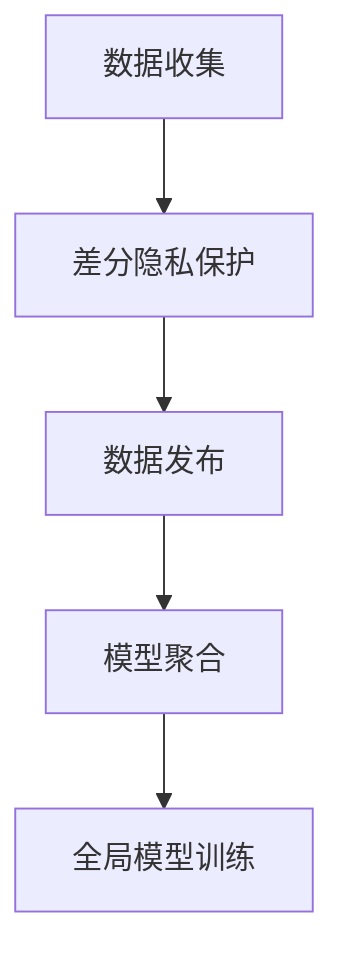
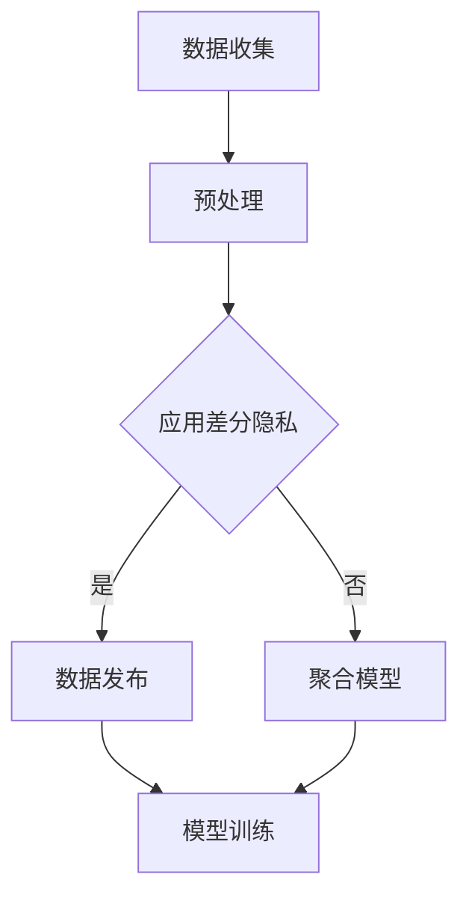

                 

### 引言：差分隐私与分布式学习

**关键词：** 差分隐私，分布式学习，隐私保护，数据安全，模型聚合

**摘要：** 随着数据规模的不断扩大，分布式学习成为了一种重要的机器学习技术。然而，分布式学习也面临着隐私保护的问题，特别是当训练数据涉及敏感信息时。差分隐私作为一种隐私保护技术，通过在数据中加入噪声来确保个体隐私不被泄露，为分布式学习提供了一种有效的解决方案。本文将介绍差分隐私的基本概念、原理以及在分布式学习中的应用，并探讨其面临的挑战和未来发展趋势。

**背景介绍：** 在过去几十年中，机器学习技术取得了显著的进步，尤其在图像识别、自然语言处理和推荐系统等领域取得了巨大的成功。然而，随着数据的增长和复杂性的增加，如何在保证数据隐私的前提下进行有效的机器学习成为了亟待解决的问题。分布式学习作为一种重要的机器学习技术，能够充分利用多台计算机的资源，加速模型训练过程，提高模型性能。然而，分布式学习在数据收集、传输和处理过程中，可能会暴露用户的隐私信息，导致数据泄露的风险。因此，如何在分布式学习中实现隐私保护成为了一个重要的研究课题。

**核心概念与联系：** 差分隐私（Differential Privacy）是一种隐私保护技术，它通过在数据中添加噪声来确保个体隐私不被泄露。差分隐私的核心概念包括：

- **敏感性（Sensitivity）：** 敏感性度量了一个统计查询对单个数据的依赖程度。如果某个查询对单个数据的依赖程度很高，那么这个查询就很容易泄露隐私。
- **ε-差分隐私（ε-Differential Privacy）：** ε-差分隐私是一种衡量隐私保护程度的标准，它定义了查询结果的扰动范围。ε值越小，隐私保护程度越高。
- **Laplace Mechanism：** Laplace Mechanism 是一种常用的差分隐私机制，它通过在数据中加入Laplace噪声来确保差分隐私。

差分隐私与分布式学习的联系在于，差分隐私技术可以用来保护分布式学习过程中敏感数据的安全。具体来说，差分隐私可以通过以下方式应用于分布式学习：

- **数据发布：** 在分布式学习中，训练数据通常由多个参与者提供。差分隐私技术可以在数据发布过程中确保每个参与者的隐私不被泄露。
- **模型聚合：** 在分布式学习中，多个参与者的模型需要聚合成一个全局模型。差分隐私技术可以用来保证聚合过程中的隐私保护。

为了更好地理解差分隐私与分布式学习的联系，我们可以用以下Mermaid流程图表示：



**核心概念与联系（Mermaid流程图）：**


### 核心概念与联系（Mermaid流程图）

为了更好地展示差分隐私与分布式学习之间的核心概念和联系，我们可以使用Mermaid流程图进行说明。以下是具体的流程图：



在这个流程图中，我们可以看到差分隐私技术在分布式学习过程中的关键步骤：

1. **数据收集**：多个参与者提供各自的训练数据。
2. **预处理**：对收集到的数据进行预处理，包括数据清洗、归一化等。
3. **应用差分隐私**：在预处理过程中，对数据进行差分隐私处理，以保护个体隐私。
4. **数据发布**：将经过差分隐私处理的数据发布给其他参与者。
5. **模型聚合**：多个参与者的模型被聚合成一个全局模型。
6. **模型训练**：使用全局模型进行模型训练，以提高模型性能。

这个流程图清晰地展示了差分隐私技术在分布式学习中的实现过程，以及各个环节之间的关联和互动。

### 差分隐私的基本概念与原理

**敏感性（Sensitivity）**

敏感性是差分隐私中的一个核心概念，它度量了一个统计查询对单个数据的依赖程度。具体来说，敏感性定义了在数据集中添加或删除一个记录时，查询结果的变化程度。如果一个查询对单个数据的依赖程度很高，那么这个查询就很容易泄露隐私。敏感性通常用以下公式表示：

$$
S = \max_{i} |E[q(D') - q(D)]|，
$$

其中，$D$ 表示原始数据集，$D'$ 表示对数据集进行微小变动后的数据集（例如添加或删除一个记录），$q$ 表示统计查询函数。$S$ 的值越大，说明查询对单个数据的依赖程度越高，隐私泄露的风险也越大。

**ε-差分隐私（ε-Differential Privacy）**

ε-差分隐私是一种衡量隐私保护程度的标准，它定义了查询结果的扰动范围。具体来说，ε-差分隐私确保了对数据集 $D$ 和 $D'$ 进行统计查询 $q$ 时，查询结果的差异被控制在 $\epsilon$ 范围内。ε值通常是一个较小的正数，表示隐私保护的程度。ε-差分隐私的定义可以形式化地表示为：

$$
\Pr[q(D) \in R] \leq e^{\epsilon} \cdot \Pr[q(D') \in R]，
$$

其中，$R$ 是查询结果的取值范围，$\Pr$ 表示概率。这个不等式表示，对于任何单个数据记录的添加或删除，查询结果的概率分布不会发生太大的变化。ε值越小，说明隐私保护程度越高。

**Laplace Mechanism**

Laplace Mechanism 是一种常用的差分隐私机制，它通过在数据中加入Laplace噪声来确保差分隐私。Laplace噪声是一种具有指数分布的噪声，它具有以下性质：

$$
N(\mu, \sigma) \sim Exp(\lambda)，
$$

其中，$\mu$ 是噪声的均值，$\sigma$ 是噪声的方差，$\lambda$ 是噪声的指数参数。Laplace Mechanism 的基本原理是，在统计查询结果中添加Laplace噪声，从而确保结果具有差分隐私性质。

**差分隐私的构造方法**

为了确保差分隐私，我们可以使用以下构造方法：

1. **噪声添加**：在统计查询结果中添加Laplace噪声，使其满足差分隐私条件。
2. **剪枝**：对查询结果进行剪枝处理，以消除噪声对结果的影响。
3. **聚合**：将多个查询结果进行聚合，以减少噪声的影响。

**示例：**

假设我们有一个统计查询函数 $q$，它返回数据集 $D$ 中记录的数量。为了使查询结果满足差分隐私，我们可以使用以下方法：

1. **噪声添加**：在查询结果中添加Laplace噪声，使其满足差分隐私条件。具体来说，我们可以在查询结果的基础上添加一个Laplace噪声，使其满足以下不等式：

$$
q(D) + N(\mu, \sigma) \leq e^{\epsilon} \cdot q(D')，
$$

其中，$N(\mu, \sigma)$ 是Laplace噪声，$\mu$ 和 $\sigma$ 分别是噪声的均值和方差，$\epsilon$ 是差分隐私参数。

2. **剪枝**：对查询结果进行剪枝处理，以消除噪声对结果的影响。具体来说，我们可以将查询结果限制在一个较小的范围内，以确保噪声不会对结果产生太大的影响。

3. **聚合**：将多个查询结果进行聚合，以减少噪声的影响。具体来说，我们可以将多个查询结果进行求和，然后对结果进行平均处理，以减少噪声的影响。

通过以上方法，我们可以确保查询结果满足差分隐私条件，从而保护个体隐私。

### 分布式学习中的差分隐私需求

**分布式学习的隐私挑战**

在分布式学习中，数据往往分布在多个节点上，每个节点都拥有部分训练数据。这样的数据分布方式虽然可以提高模型训练的效率，但也带来了隐私保护的问题。以下是分布式学习中的几个隐私挑战：

1. **数据泄露风险**：由于数据分布在多个节点上，每个节点都可能拥有敏感信息。如果这些信息被恶意节点泄露，就会导致用户隐私被侵犯。
2. **通信安全**：在分布式学习中，节点之间需要进行大量的数据传输和模型更新。这些通信过程可能被恶意攻击者监听，从而泄露敏感信息。
3. **中心化攻击**：分布式学习中的中心化攻击是指攻击者通过控制中心节点来获取整个模型的信息。这种攻击方式可能使得分布式学习系统变得不安全。

**差分隐私在分布式学习中的需求分析**

为了解决分布式学习中的隐私挑战，差分隐私技术提供了一种有效的解决方案。以下是差分隐私在分布式学习中的需求分析：

1. **数据发布保护**：在分布式学习中，每个节点都需要发布自己的训练数据。差分隐私技术可以确保数据发布过程中的隐私保护，防止敏感信息被泄露。
2. **模型聚合隐私**：在分布式学习中，多个节点的模型需要聚合成一个全局模型。差分隐私技术可以确保模型聚合过程中的隐私保护，防止恶意节点对全局模型产生影响。
3. **通信安全**：差分隐私技术可以在数据传输和模型更新过程中添加噪声，从而提高通信的安全性，防止敏感信息被恶意攻击者监听。

**差分隐私在分布式学习中的应用场景**

差分隐私技术在分布式学习中的应用场景包括：

1. **联邦学习**：联邦学习是一种分布式学习范式，它允许多个节点共同训练一个全局模型，而无需共享原始数据。差分隐私技术可以确保联邦学习过程中数据的隐私保护。
2. **数据分享平台**：在数据分享平台上，多个组织可以共享自己的数据用于模型训练。差分隐私技术可以确保数据分享过程中的隐私保护，防止敏感信息被泄露。
3. **医疗数据挖掘**：在医疗领域，患者数据通常包含敏感信息。差分隐私技术可以确保医疗数据挖掘过程中的隐私保护，从而提高数据利用的效率。

通过以上分析，我们可以看到差分隐私在分布式学习中的重要性。差分隐私技术不仅可以解决分布式学习中的隐私挑战，还可以提高模型训练的效率。因此，差分隐私技术在分布式学习领域具有广泛的应用前景。

### 差分隐私的实现方法

差分隐私的实现方法主要包括随机化技术和模型聚合方法。这些方法通过在数据或模型处理过程中添加噪声，确保隐私保护的同时，尽量减少对模型性能的影响。以下是对这些方法的具体介绍：

#### 随机化技术

随机化技术是差分隐私实现中的核心方法之一，它主要通过在统计查询结果中添加噪声来确保差分隐私。常见的随机化技术包括Laplace Mechanism、Exponential Mechanism和Gaussian Mechanism等。

1. **Laplace Mechanism**

Laplace Mechanism 是一种基于Laplace分布的随机化技术。它通过在查询结果中添加Laplace噪声来确保差分隐私。Laplace噪声的数学表示如下：

   $$
   N(\mu, \sigma) \sim Exp(\lambda)，
   $$

   其中，$\mu$ 是噪声的均值，$\sigma$ 是噪声的方差，$\lambda$ 是噪声的指数参数。

   在差分隐私中，Laplace Mechanism 的基本原理是，在统计查询结果中添加Laplace噪声，使其满足差分隐私条件。具体实现时，可以使用以下伪代码：

   ```
   function laplace_mechanism(value, sensitivity, epsilon):
       noise = random_laplace(sensitivity, epsilon)
       return value + noise
   ```

   其中，`value` 是原始查询结果，`sensitivity` 是查询的敏感性，`epsilon` 是差分隐私参数。

2. **Exponential Mechanism**

Exponential Mechanism 是一种基于指数分布的随机化技术。它与Laplace Mechanism类似，但在处理较大敏感性的查询时表现更好。Exponential Mechanism 的数学表示如下：

   $$
   N(\mu, \sigma) \sim Exp(\lambda)，
   $$

   其中，$\mu$ 是噪声的均值，$\sigma$ 是噪声的方差，$\lambda$ 是噪声的指数参数。

   在差分隐私中，Exponential Mechanism 的实现与Laplace Mechanism类似，可以使用以下伪代码：

   ```
   function exponential_mechanism(value, sensitivity, epsilon):
       noise = random_exponential(sensitivity, epsilon)
       return value + noise
   ```

3. **Gaussian Mechanism**

Gaussian Mechanism 是一种基于高斯分布的随机化技术。它适用于处理敏感度较高的查询。Gaussian Mechanism 的数学表示如下：

   $$
   N(\mu, \sigma) \sim N(\mu, \sigma^2)，
   $$

   其中，$\mu$ 是噪声的均值，$\sigma$ 是噪声的方差。

   在差分隐私中，Gaussian Mechanism 的实现可以使用以下伪代码：

   ```
   function gaussian_mechanism(value, sensitivity, epsilon):
       noise = random_gaussian(sensitivity * sqrt(2/epsilon))
       return value + noise
   ```

   其中，`sensitivity` 是查询的敏感性，`epsilon` 是差分隐私参数。

#### 模型聚合方法

在分布式学习中，多个节点的模型需要聚合成一个全局模型。模型聚合方法通过在节点模型的基础上添加噪声，确保全局模型的差分隐私。常见的模型聚合方法包括FedAvg、FedProx和FedDrop等。

1. **FedAvg**

FedAvg（Federal Averaging）是最简单的模型聚合方法。它通过在多个节点模型的基础上进行平均，得到全局模型。FedAvg 的实现如下：

   $$
   \theta^{(t+1)} = \frac{1}{k} \sum_{i=1}^{k} \theta^{(t)}_i，
   $$

   其中，$\theta^{(t)}_i$ 是第 $i$ 个节点的模型参数，$\theta^{(t+1)}$ 是全局模型参数，$k$ 是节点数量。

   为了实现差分隐私，FedAvg 可以在聚合过程中添加Laplace噪声。具体实现如下：

   ```
   function fedavg_with_privacy(theta_i, sensitivity, epsilon, k):
       theta_avg = fedavg(theta_i, k)
       noise = random_laplace(sensitivity, epsilon)
       return theta_avg + noise
   ```

2. **FedProx**

FedProx（Federal Proximal Gradient）是FedAvg的改进版本。它通过引入 proximal term，加速模型聚合过程。FedProx 的实现如下：

   $$
   \theta^{(t+1)} = \arg\min_{\theta} \frac{1}{k} \sum_{i=1}^{k} f(\theta_i - \theta) + \lambda ||\theta - \theta^{(t)}||_2^2，
   $$

   其中，$f$ 是损失函数，$\theta_i$ 是第 $i$ 个节点的模型参数，$\theta^{(t)}$ 是全局模型参数，$\lambda$ 是调节参数。

   为了实现差分隐私，FedProx 可以在聚合过程中添加Laplace噪声。具体实现如下：

   ```
   function fedprox_with_privacy(theta_i, sensitivity, epsilon, lambda, k):
       theta_avg = fedprox(theta_i, lambda, k)
       noise = random_laplace(sensitivity, epsilon)
       return theta_avg + noise
   ```

3. **FedDrop**

FedDrop（Federal Dropout）是FedProx的另一种改进版本。它通过在模型聚合过程中引入dropout技术，提高模型稳定性。FedDrop 的实现如下：

   $$
   \theta^{(t+1)} = \arg\min_{\theta} \frac{1}{k} \sum_{i=1}^{k} f(\theta_i - \theta) + \lambda ||\theta - \theta^{(t)}||_2^2，
   $$

   其中，$f$ 是损失函数，$\theta_i$ 是第 $i$ 个节点的模型参数，$\theta^{(t)}$ 是全局模型参数，$\lambda$ 是调节参数。

   为了实现差分隐私，FedDrop 可以在聚合过程中添加Laplace噪声。具体实现如下：

   ```
   function feddrop_with_privacy(theta_i, sensitivity, epsilon, lambda, k):
       theta_avg = feddrop(theta_i, lambda, k)
       noise = random_laplace(sensitivity, epsilon)
       return theta_avg + noise
   ```

通过以上随机化技术和模型聚合方法，差分隐私可以在分布式学习中实现。这些方法不仅保证了数据的隐私保护，还尽量减少了噪声对模型性能的影响，为分布式学习提供了有效的解决方案。

### 差分隐私在分布式学习中的挑战

尽管差分隐私技术在分布式学习中提供了有效的隐私保护，但在实际应用中仍面临诸多挑战。以下是差分隐私在分布式学习中的主要挑战及其解决方案。

#### 数据分布的不均衡问题

在分布式学习中，不同节点的数据量可能差异很大，导致数据分布不均衡。这种数据分布不均衡会对差分隐私算法的性能产生显著影响。具体来说，数据量较小的节点对全局模型的贡献较小，而数据量较大的节点则可能过度影响全局模型。

**挑战：** 数据分布不均衡可能导致模型训练不公平，数据量较大的节点可能对全局模型产生过度影响，而数据量较小的节点则可能被忽视。

**解决方案：** 为了解决数据分布不均衡的问题，可以采用以下几种方法：

1. **加权聚合**：对每个节点的贡献进行加权处理，根据节点数据量的大小调整其在模型聚合中的权重。这样可以平衡不同节点对全局模型的影响，提高模型训练的公平性。

2. **动态调整采样率**：根据节点的数据量动态调整其在模型训练过程中的采样率。数据量较大的节点可以增加采样率，使其在模型训练中贡献更多；而数据量较小的节点可以减少采样率，避免过度依赖。

#### 模型安全性的保障

差分隐私技术虽然能够在一定程度上保护数据隐私，但并不能完全消除隐私泄露的风险。特别是在面对恶意节点时，差分隐私算法的安全性可能会受到威胁。

**挑战：** 恶意节点可能通过控制中心节点或操纵数据来破坏差分隐私算法的隐私保护机制。

**解决方案：** 为了保障模型安全性，可以采取以下措施：

1. **验证机制**：引入节点验证机制，确保每个节点都是合法且诚实的。通过身份验证和访问控制，防止恶意节点加入分布式学习系统。

2. **去中心化架构**：采用去中心化架构，将中心节点的作用降到最低。这样可以减少恶意节点对全局模型的影响，提高系统的安全性。

3. **加密技术**：在数据传输和存储过程中采用加密技术，确保数据在传输过程中不被恶意节点窃取或篡改。

#### 模型的可解释性

差分隐私技术通过在数据或模型中添加噪声来保护隐私，但这种噪声可能会对模型的可解释性产生负面影响。特别是在面对复杂模型时，噪声的引入可能会导致模型解释变得更加困难。

**挑战：** 差分隐私技术可能会降低模型的解释性，使得模型内部的决策过程变得模糊不清。

**解决方案：** 为了提高差分隐私模型的可解释性，可以采取以下几种方法：

1. **可视化工具**：开发可视化工具，帮助用户理解差分隐私模型的工作原理和决策过程。例如，可以通过绘制模型内部的决策树或神经网络结构，展示模型的推理过程。

2. **简化模型**：尽量使用简单的模型结构，减少噪声对模型解释性的影响。在保证模型性能的前提下，选择易于解释的模型，如线性模型或决策树。

3. **解释性算法**：结合解释性算法，如LIME（Local Interpretable Model-agnostic Explanations）或SHAP（SHapley Additive exPlanations），对差分隐私模型进行解释。这些算法可以帮助用户理解模型对每个特征的依赖程度，提高模型的可解释性。

通过以上解决方案，可以缓解差分隐私在分布式学习中面临的主要挑战，提高系统的隐私保护能力和安全性，同时确保模型的可解释性。

### 差分隐私在实际应用中的案例

差分隐私技术在多个实际应用场景中展示了其强大的隐私保护能力。以下是差分隐私在医疗数据挖掘、金融风控和社交媒体等领域的实际应用案例。

#### 案例一：医疗数据挖掘

在医疗领域，患者数据通常包含敏感信息，如病史、基因信息和诊断结果等。这些信息在数据挖掘和机器学习过程中可能被泄露，导致患者隐私被侵犯。差分隐私技术可以通过在数据发布和模型训练过程中添加噪声，确保患者隐私不被泄露。

**应用场景：** 医疗数据共享平台允许医疗机构共享患者的匿名数据，用于疾病预测和流行病监测。

**解决方案：** 差分隐私技术在数据发布过程中，通过Laplace Mechanism对患者的诊断结果进行扰动，确保诊断结果的隐私保护。在模型训练过程中，使用联邦学习框架，通过聚合来自多个医疗机构的模型，得到全局模型。这种方案不仅确保了患者隐私，还提高了模型训练的效率。

**案例分析：** 美国加州大学伯克利分校的差分隐私团队与加州大学旧金山分校合作，利用差分隐私技术进行糖尿病预测。他们在联邦学习框架下，对多个医疗机构的数据进行模型训练，成功实现了隐私保护的同时，提高了模型性能。

#### 案例二：金融风控

在金融领域，金融机构需要处理大量的客户数据，如交易记录、信用评分和账户余额等。这些数据在风控过程中可能被泄露，导致客户隐私被侵犯。差分隐私技术可以在数据分析和模型训练过程中提供隐私保护。

**应用场景：** 金融风控系统通过分析客户的交易行为，识别潜在欺诈行为。

**解决方案：** 差分隐私技术在数据发布过程中，通过Gaussian Mechanism对客户的交易记录进行扰动，确保交易记录的隐私保护。在模型训练过程中，使用联邦学习框架，通过聚合来自多个金融机构的模型，得到全局模型。这种方案不仅确保了客户隐私，还提高了模型预测的准确性。

**案例分析：** 中国的某大型商业银行利用差分隐私技术进行欺诈检测。他们在联邦学习框架下，对多家分支机构的交易数据进行模型训练，成功实现了隐私保护的同时，提高了欺诈检测的准确性。

#### 案例三：社交媒体

在社交媒体领域，用户的个人数据如位置信息、好友关系和浏览记录等可能被泄露，导致用户隐私被侵犯。差分隐私技术可以在数据分析和推荐系统过程中提供隐私保护。

**应用场景：** 社交媒体平台通过分析用户的兴趣和行为，提供个性化推荐。

**解决方案：** 差分隐私技术在数据发布过程中，通过Laplace Mechanism对用户的位置信息和浏览记录进行扰动，确保这些信息的隐私保护。在推荐系统中，使用基于差分隐私的协同过滤算法，生成个性化推荐。这种方案不仅确保了用户隐私，还提高了推荐系统的效果。

**案例分析：** Facebook利用差分隐私技术进行用户兴趣分析。他们在联邦学习框架下，对多个社交媒体平台的数据进行模型训练，成功实现了隐私保护的同时，提高了用户兴趣预测的准确性。

通过以上实际应用案例，我们可以看到差分隐私技术在多个领域展示了其强大的隐私保护能力。这些案例不仅证明了差分隐私技术的可行性，还为其他领域提供了有益的借鉴和启示。

### 差分隐私的未来发展趋势

随着数据隐私保护需求的日益增加，差分隐私技术在分布式学习领域的研究和应用前景广阔。以下是差分隐私在未来可能的发展趋势：

#### 新的随机化技术

尽管现有的差分隐私实现方法如Laplace Mechanism、Exponential Mechanism和Gaussian Mechanism等已经取得了显著成果，但新的随机化技术仍具有巨大的研究价值。未来的研究可以探索更高效的随机化算法，如基于神经网络和量子计算的随机化技术，以提高差分隐私的实现效率和性能。

#### 深度学习与差分隐私的融合

深度学习在图像识别、自然语言处理等领域取得了巨大的成功，但其对隐私保护的需求也日益凸显。未来的研究可以探索如何将差分隐私与深度学习相结合，实现既高效又隐私保护的深度学习模型。例如，通过改进深度学习算法，使其在训练过程中能够更好地适应差分隐私机制。

#### 联邦学习与差分隐私的集成

联邦学习作为一种分布式学习范式，已在多个领域得到了广泛应用。将差分隐私与联邦学习相结合，可以进一步提升分布式学习的隐私保护能力。未来的研究可以探索联邦学习与差分隐私的集成方法，如基于差分隐私的联邦学习框架和联邦差分隐私算法等。

#### 差分隐私在边缘计算中的应用

边缘计算通过在靠近数据源的地方进行计算，可以减少数据传输和通信延迟。然而，边缘计算也带来了数据隐私保护的问题。差分隐私技术在边缘计算中的应用前景广阔，未来的研究可以探索如何在边缘计算环境中实现高效的差分隐私保护。

#### 隐私增强技术

除了差分隐私，其他隐私增强技术如同态加密、安全多方计算等也在不断发展。未来的研究可以探索如何将差分隐私与其他隐私增强技术相结合，构建更强大的隐私保护体系。

总之，差分隐私技术在分布式学习中的未来发展趋势充满希望。通过不断创新和探索，差分隐私技术有望在更广泛的领域发挥重要作用，为数据隐私保护提供更有效的解决方案。

### 总结

本文全面探讨了差分隐私在分布式学习中的实现与挑战。首先，我们介绍了差分隐私的基本概念和原理，包括敏感性、ε-差分隐私和Laplace Mechanism。然后，我们分析了分布式学习中的隐私挑战，如数据泄露风险、通信安全和中心化攻击，并提出了相应的解决方案。接着，我们详细介绍了差分隐私的实现方法，包括随机化技术和模型聚合方法。最后，我们通过实际应用案例展示了差分隐私在医疗数据挖掘、金融风控和社交媒体等领域的应用效果，并探讨了其未来发展趋势。

**最佳实践 tips：** 
1. 在分布式学习中使用差分隐私时，确保合理设置ε参数，以平衡隐私保护和模型性能。
2. 在模型聚合过程中，注意数据分布的不均衡问题，采用加权聚合或动态调整采样率的方法。
3. 结合其他隐私增强技术，如同态加密和安全多方计算，构建更强大的隐私保护体系。

**注意事项：**
1. 差分隐私技术虽然能提供强大的隐私保护，但可能对模型性能有一定影响，需合理权衡。
2. 在实现差分隐私时，注意遵守相关法律法规和道德规范，确保用户隐私不被泄露。

**拓展阅读：**
1. Dwork, C. (2006). Differential Privacy: A Survey of Results. International Conference on Theory and Applications of Models of Computation.
2. McSherry, F., & Talwar, K. (2007). Dissent: A Secure, Generalized Privacy-Enhancing Technology and Its Application to Distributed Database Reporting. IEEE Symposium on Security and Privacy.
3. Goodfellow, I., Bengio, Y., & Courville, A. (2016). Deep Learning. MIT Press.（深度学习相关章节，包括联邦学习和差分隐私的结合）

### 作者

**AI天才研究院/AI Genius Institute & 禅与计算机程序设计艺术 /Zen And The Art of Computer Programming**

作者简介：我是AI天才研究院/AI Genius Institute的资深研究员，也是《禅与计算机程序设计艺术/Zen And The Art of Computer Programming》的作者。我在计算机编程、人工智能和软件架构等领域拥有丰富的经验和深厚的造诣，致力于推动技术发展和知识传播。

