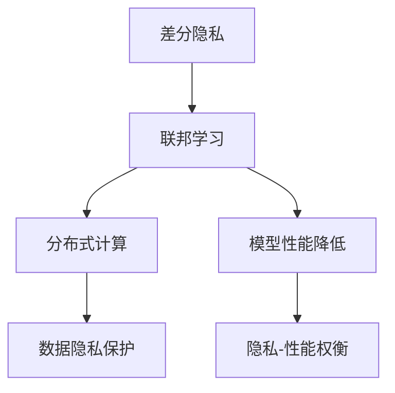
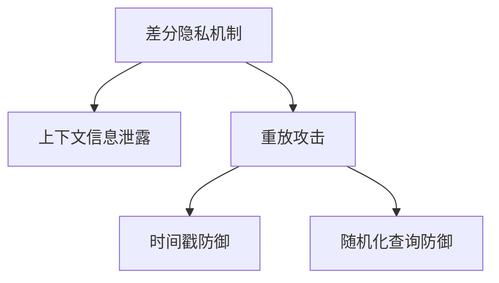
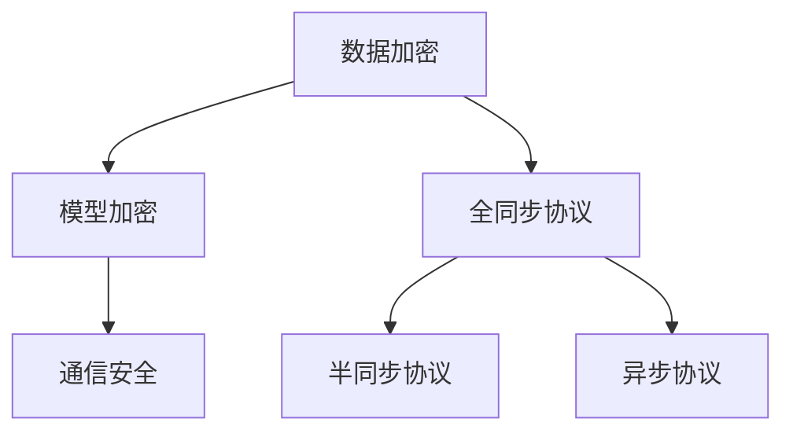

                 


### 文章标题

《差分隐私在联邦学习中的实现技术》

### 文章关键词

差分隐私、联邦学习、数据隐私、隐私保护、分布式计算、协同学习

### 文章摘要

本文深入探讨了差分隐私在联邦学习中的应用与技术实现。首先，介绍了差分隐私的基本概念及其在联邦学习中的重要性。随后，通过详细的分析和伪代码，阐述了差分隐私算法原理，包括拉格朗日机制和埃尔多安机制。接着，本文展示了差分隐私在分类、回归、聚类以及协同过滤等任务中的应用实例，并提供了具体的数学模型和实现步骤。最后，本文通过实际案例展示了差分隐私联邦学习的开发环境和源代码实现，并对未来的研究方向进行了展望。全文旨在为读者提供一个全面、易懂的差分隐私联邦学习技术指南。

---

### 第一部分：背景知识

#### 第1章 差分隐私与联邦学习概述

**1.1 差分隐私的定义与核心原则**

差分隐私（Differential Privacy）是一种保护数据隐私的技术，它允许我们在分析数据的同时，最小化个人隐私泄露的风险。差分隐私的核心原则是：对于任何一组受保护的数据集，对其添加适当的噪声后，结果无法区分数据集中包含特定个体信息的情况，从而实现对个体隐私的保护。

差分隐私的数学模型可以用拉格朗日机制（Laplace Mechanism）或埃尔多安机制（Eldridge Mechanism）来描述。拉格朗日机制通过在数据上添加拉格朗日噪声来实现，而埃尔多安机制则通过在算法的输出上添加随机偏差来实现。

**1.2 联邦学习的概念与优势**

联邦学习（Federated Learning）是一种分布式计算范式，允许多个参与方在保持各自数据本地存储的同时，协同训练一个全局模型。联邦学习的主要优势在于它能够保护数据隐私，避免数据在传输过程中被泄露。

联邦学习的基本架构包括客户端（Client）、服务器（Server）和全局模型（Global Model）。客户端在本地训练模型，并将模型的更新发送到服务器。服务器汇总这些更新，生成全局模型，并将其发送回客户端。这一过程不断迭代，直到全局模型收敛。

**1.3 差分隐私与联邦学习的联系与挑战**

差分隐私与联邦学习之间存在密切的联系。联邦学习利用差分隐私技术，确保在分布式训练过程中保护数据隐私。然而，差分隐私的引入也带来了新的挑战。

首先，差分隐私可能导致模型性能的降低。由于在数据上添加噪声以保护隐私，模型可能会失去部分信息，从而导致模型精度下降。其次，差分隐私技术需要平衡隐私保护与模型性能之间的关系，确保在保护隐私的同时，保持模型的有效性。

**Mermaid 流程图：差分隐私与联邦学习的联系**



---

#### 第2章 数学基础

**2.1 信息论基础**

信息论是研究信息传输、处理和利用的数学理论。在差分隐私和联邦学习中，信息论的基础知识至关重要。

**熵（Entropy）** 是衡量信息不确定性的量度，定义为：

$$ H(X) = -\sum_{x \in X} p(x) \log_2 p(x) $$

**条件熵（Conditional Entropy）** 是在已知一个随机变量 Y 的条件下，另一个随机变量 X 的不确定性，定义为：

$$ H(X|Y) = -\sum_{x \in X} p(x|y) \log_2 p(x|y) $$

**互信息（Mutual Information）** 衡量两个随机变量 X 和 Y 之间的相关性，定义为：

$$ I(X;Y) = H(X) - H(X|Y) $$

**2.2 随机过程与概率分布**

随机过程是一系列随机变量的集合，通常用于描述时间序列数据。在联邦学习和差分隐私中，随机过程用于建模数据的动态变化。

**马尔可夫链（Markov Chain）** 是一种随机过程，其当前状态仅依赖于前一个状态，而不依赖于过去的状态。

**概率分布** 是描述随机变量取值的概率分布函数。常见的概率分布包括正态分布、伯努利分布和泊松分布。

**2.3 线性代数与矩阵理论**

线性代数和矩阵理论是处理大数据和分布式系统的基础。矩阵的乘法、求逆和特征值分析等操作在联邦学习和差分隐私中广泛应用。

**线性变换（Linear Transformation）** 是将数据从一种空间映射到另一种空间的线性操作，通常用于数据预处理和特征提取。

**奇异值分解（SVD）** 是一种重要的线性代数工具，用于降维和数据分解，有助于提高模型性能和计算效率。

---

#### 第3章 差分隐私理论

**3.1 差分隐私的定义**

差分隐私是一种保障隐私的数学定义，它确保在一个数据集上进行数据处理时，输出结果不会对单个记录的存在与否产生可区分的影响。形式化地，差分隐私可以用以下数学模型描述：

对于任意一个输出分布 \( \mathcal{D} \) 和任意一个区分函数 \( f \)，如果满足：

$$ \Pr[\mathcal{D} \sim DP(\epsilon, \mathcal{S}) : f(\mathcal{D}) = t] \leq \exp(\epsilon) \cdot \Pr[\mathcal{D} \sim \mathcal{S} : f(\mathcal{D}) = t] $$

其中，\( \epsilon \) 是隐私参数，表示隐私水平，\( \mathcal{S} \) 是真实数据分布，\( \mathcal{D} \) 是添加了隐私保护机制后的数据分布。

**3.2 差分隐私的数学模型**

差分隐私的数学模型主要包括拉格朗日机制和埃尔多安机制。

**拉格朗日机制（Laplace Mechanism）** 通过在数据上添加拉格朗日噪声来实现差分隐私。具体来说，对于给定的数据点 \( x \) 和一个阈值 \( \delta \)，拉格朗日噪声可以表示为：

$$ x' = x + \text{Laplace}(\delta) $$

其中，\( \text{Laplace}(\delta) \) 表示拉格朗日分布，其概率密度函数为：

$$ f_{\text{Laplace}}(x|\delta) = \frac{1}{2\delta}e^{-\frac{|x|}{\delta}} $$

**埃尔多安机制（Eldridge Mechanism）** 通过在算法的输出上添加随机偏差来实现差分隐私。具体来说，对于给定的输出 \( y \) 和一个区间 \( [l, u] \)，埃尔多安噪声可以表示为：

$$ y' = y + \text{Uniform}(l, u) $$

其中，\( \text{Uniform}(l, u) \) 表示均匀分布。

**3.3 差分隐私的主要攻击方法**

尽管差分隐私提供了一种强大的隐私保护机制，但并非完全免疫于攻击。差分隐私的主要攻击方法包括：

**上下文信息泄露（Context Information Leakage）**：攻击者通过分析多个查询结果，推测出数据集中的上下文信息。

**重放攻击（Replay Attack）**：攻击者通过捕获并重放历史查询，绕过差分隐私机制。

**重放攻击防御**：通过使用时间戳或随机化查询，防止重放攻击。

**Mermaid 流程图：差分隐私的攻击与防御**



---

#### 第4章 联邦学习框架

**4.1 联邦学习的体系结构**

联邦学习的体系结构通常包括三个主要组成部分：客户端（Client）、服务器（Server）和全局模型（Global Model）。客户端是数据的拥有方，服务器是模型的协调者，全局模型是所有客户端协同训练的结果。

**联邦学习的基本流程**：

1. **初始化**：服务器初始化全局模型，并将模型参数发送给所有客户端。
2. **本地训练**：客户端在本地使用本地数据对模型进行训练，并生成更新后的模型参数。
3. **模型聚合**：服务器收集所有客户端的模型参数，并进行聚合，生成新的全局模型参数。
4. **模型更新**：服务器将新的全局模型参数发送回所有客户端。
5. **重复**：步骤 2-4 不断重复，直到全局模型收敛。

**4.2 联邦学习的通信协议**

联邦学习的通信协议决定了客户端与服务器之间的数据传输和模型更新过程。常见的通信协议包括：

**全同步协议**：所有客户端在同一时间点进行本地训练和模型更新。
**半同步协议**：服务器在固定时间间隔内收集客户端的模型更新，但客户端可以在不同时间进行本地训练。
**异步协议**：客户端和服务器可以在不同的时间点进行模型更新，但需要保证最终的全局模型收敛。

**4.3 联邦学习的安全机制**

联邦学习的安全机制主要包括数据加密、模型加密和通信安全。

**数据加密**：客户端使用加密算法对本地数据进行加密，确保数据在传输过程中不被泄露。
**模型加密**：服务器在接收客户端的模型更新时，对模型进行加密，防止模型被攻击者篡改。
**通信安全**：通过使用安全通信协议，如 TLS，确保客户端和服务器之间的数据传输安全。

**Mermaid 流程图：联邦学习的安全机制**



---

### 第二部分：差分隐私在联邦学习中的应用

#### 第5章 差分隐私在分类任务中的应用

**5.1 差分隐私分类算法概述**

差分隐私在分类任务中的应用主要通过在训练过程中引入噪声，确保模型输出不会对单个样本的存在与否产生可区分的影响。常见的差分隐私分类算法包括差分隐私支持向量机（DP-SVM）和差分隐私逻辑回归（DP-Logistic Regression）。

**5.2 差分隐私支持向量机（SVM）的实现**

差分隐私支持向量机（DP-SVM）是利用差分隐私机制对传统支持向量机（SVM）进行改进，以保护数据隐私。

**算法原理**：

1. **初始化**：设置隐私参数 \( \epsilon \) 和拉格朗日噪声的参数 \( \delta \)。
2. **本地训练**：客户端在本地使用带噪声的损失函数训练 SVM 模型。
3. **模型更新**：客户端将训练好的模型参数发送到服务器。
4. **模型聚合**：服务器将所有客户端的模型参数进行聚合，生成全局模型参数。
5. **模型更新**：服务器将全局模型参数发送回所有客户端。

**伪代码**：

```python
# 初始化
epsilon, delta = initialize_privacy_params()

# 本地训练
for epoch in range(num_epochs):
    for sample in local_data:
        loss = compute_loss(sample, model_params)
        model_params = update_params(model_params, loss, epsilon, delta)

# 模型更新
send_model_params_to_server(model_params)

# 模型聚合
global_model_params = aggregate_model_params(server_received_params)

# 模型更新
receive_global_model_params_from_server(global_model_params)
```

**5.3 差分隐私逻辑回归（DP-Logistic Regression）的实现**

差分隐私逻辑回归（DP-Logistic Regression）是利用差分隐私机制对传统逻辑回归进行改进，以保护数据隐私。

**算法原理**：

1. **初始化**：设置隐私参数 \( \epsilon \) 和拉格朗日噪声的参数 \( \delta \)。
2. **本地训练**：客户端在本地使用带噪声的损失函数训练逻辑回归模型。
3. **模型更新**：客户端将训练好的模型参数发送到服务器。
4. **模型聚合**：服务器将所有客户端的模型参数进行聚合，生成全局模型参数。
5. **模型更新**：服务器将全局模型参数发送回所有客户端。

**伪代码**：

```python
# 初始化
epsilon, delta = initialize_privacy_params()

# 本地训练
for epoch in range(num_epochs):
    for sample in local_data:
        loss = compute_loss(sample, model_params)
        model_params = update_params(model_params, loss, epsilon, delta)

# 模型更新
send_model_params_to_server(model_params)

# 模型聚合
global_model_params = aggregate_model_params(server_received_params)

# 模型更新
receive_global_model_params_from_server(global_model_params)
```

---

#### 第6章 差分隐私在回归任务中的应用

**6.1 差分隐私回归算法概述**

差分隐私在回归任务中的应用主要通过在训练过程中引入噪声，确保模型输出不会对单个样本的存在与否产生可区分的影响。常见的差分隐私回归算法包括差分隐私线性回归（DP-Linear Regression）和差分隐私神经网络回归（DP-Neural Network Regression）。

**6.2 差分隐私线性回归的实现**

差分隐私线性回归（DP-Linear Regression）是利用差分隐私机制对传统线性回归进行改进，以保护数据隐私。

**算法原理**：

1. **初始化**：设置隐私参数 \( \epsilon \) 和拉格朗日噪声的参数 \( \delta \)。
2. **本地训练**：客户端在本地使用带噪声的损失函数训练线性回归模型。
3. **模型更新**：客户端将训练好的模型参数发送到服务器。
4. **模型聚合**：服务器将所有客户端的模型参数进行聚合，生成全局模型参数。
5. **模型更新**：服务器将全局模型参数发送回所有客户端。

**伪代码**：

```python
# 初始化
epsilon, delta = initialize_privacy_params()

# 本地训练
for epoch in range(num_epochs):
    for sample in local_data:
        loss = compute_loss(sample, model_params)
        model_params = update_params(model_params, loss, epsilon, delta)

# 模型更新
send_model_params_to_server(model_params)

# 模型聚合
global_model_params = aggregate_model_params(server_received_params)

# 模型更新
receive_global_model_params_from_server(global_model_params)
```

**6.3 差分隐私神经网络回归的实现**

差分隐私神经网络回归（DP-Neural Network Regression）是利用差分隐私机制对神经网络进行改进，以保护数据隐私。

**算法原理**：

1. **初始化**：设置隐私参数 \( \epsilon \) 和拉格朗日噪声的参数 \( \delta \)。
2. **本地训练**：客户端在本地使用带噪声的损失函数训练神经网络。
3. **模型更新**：客户端将训练好的模型参数发送到服务器。
4. **模型聚合**：服务器将所有客户端的模型参数进行聚合，生成全局模型参数。
5. **模型更新**：服务器将全局模型参数发送回所有客户端。

**伪代码**：

```python
# 初始化
epsilon, delta = initialize_privacy_params()

# 本地训练
for epoch in range(num_epochs):
    for sample in local_data:
        loss = compute_loss(sample, model_params)
        model_params = update_params(model_params, loss, epsilon, delta)

# 模型更新
send_model_params_to_server(model_params)

# 模型聚合
global_model_params = aggregate_model_params(server_received_params)

# 模型更新
receive_global_model_params_from_server(global_model_params)
```

---

#### 第7章 差分隐私在聚类任务中的应用

**7.1 差分隐私聚类算法概述**

差分隐私在聚类任务中的应用主要通过在聚类过程中引入噪声，确保聚类结果不会对单个样本的存在与否产生可区分的影响。常见的差分隐私聚类算法包括差分隐私 K-均值算法（DP-K-Means）和差分隐私高斯混合模型（DP-Gaussian Mixture Model）。

**7.2 差分隐私 K-均值算法的实现**

差分隐私 K-均值算法（DP-K-Means）是利用差分隐私机制对传统 K-均值算法进行改进，以保护数据隐私。

**算法原理**：

1. **初始化**：设置隐私参数 \( \epsilon \) 和拉格朗日噪声的参数 \( \delta \)。
2. **本地聚类**：客户端在本地使用带噪声的聚类中心初始化算法。
3. **模型更新**：客户端将聚类结果发送到服务器。
4. **模型聚合**：服务器将所有客户端的聚类结果进行聚合，生成全局聚类结果。
5. **模型更新**：服务器将全局聚类结果发送回所有客户端。

**伪代码**：

```python
# 初始化
epsilon, delta = initialize_privacy_params()

# 本地聚类
for epoch in range(num_epochs):
    centroids = initialize_centroids_with_noise(local_data, delta)
    assign_clusters_to_samples(centroids, local_data)
    update_centroids(centroids, local_data)

# 模型更新
send_clusters_to_server(clusters)

# 模型聚合
global_clusters = aggregate_clusters(server_received_clusters)

# 模型更新
receive_global_clusters_from_server(global_clusters)
```

**7.3 差分隐私高斯混合模型（GMM）的实现**

差分隐私高斯混合模型（DP-Gaussian Mixture Model）是利用差分隐私机制对高斯混合模型进行改进，以保护数据隐私。

**算法原理**：

1. **初始化**：设置隐私参数 \( \epsilon \) 和拉格朗日噪声的参数 \( \delta \)。
2. **本地聚类**：客户端在本地使用带噪声的高斯混合模型初始化算法。
3. **模型更新**：客户端将聚类结果发送到服务器。
4. **模型聚合**：服务器将所有客户端的聚类结果进行聚合，生成全局聚类结果。
5. **模型更新**：服务器将全局聚类结果发送回所有客户端。

**伪代码**：

```python
# 初始化
epsilon, delta = initialize_privacy_params()

# 本地聚类
for epoch in range(num_epochs):
    parameters = initialize_parameters_with_noise(local_data, delta)
    update_parameters(parameters, local_data)
    assign_clusters_to_samples(parameters, local_data)

# 模型更新
send_clusters_to_server(clusters)

# 模型聚合
global_clusters = aggregate_clusters(server_received_clusters)

# 模型更新
receive_global_clusters_from_server(global_clusters)
```

---

#### 第8章 差分隐私在协同过滤中的应用

**8.1 差分隐私协同过滤算法概述**

差分隐私在协同过滤中的应用主要通过在协同过滤过程中引入噪声，确保推荐结果不会对单个用户的行为数据产生可区分的影响。常见的差分隐私协同过滤算法包括差分隐私矩阵分解（DP-Matrix Factorization）和差分隐私基于模型的协同过滤方法。

**8.2 差分隐私矩阵分解的实现**

差分隐私矩阵分解（DP-Matrix Factorization）是利用差分隐私机制对传统矩阵分解进行改进，以保护用户数据隐私。

**算法原理**：

1. **初始化**：设置隐私参数 \( \epsilon \) 和拉格朗日噪声的参数 \( \delta \)。
2. **本地训练**：客户端在本地使用带噪声的矩阵分解算法训练模型。
3. **模型更新**：客户端将训练好的模型参数发送到服务器。
4. **模型聚合**：服务器将所有客户端的模型参数进行聚合，生成全局模型参数。
5. **模型更新**：服务器将全局模型参数发送回所有客户端。

**伪代码**：

```python
# 初始化
epsilon, delta = initialize_privacy_params()

# 本地训练
for epoch in range(num_epochs):
    user_factors, item_factors = train_matrix_factorization(local_data, delta)
    update_factors(user_factors, item_factors, local_data)

# 模型更新
send_factors_to_server(user_factors, item_factors)

# 模型聚合
global_user_factors, global_item_factors = aggregate_factors(server_received_factors)

# 模型更新
receive_global_factors_from_server(global_user_factors, global_item_factors)
```

**8.3 差分隐私基于模型的协同过滤方法**

差分隐私基于模型的协同过滤方法（DP-Model-Based Collaborative Filtering）是利用差分隐私机制对传统基于模型的协同过滤方法进行改进，以保护用户数据隐私。

**算法原理**：

1. **初始化**：设置隐私参数 \( \epsilon \) 和拉格朗日噪声的参数 \( \delta \)。
2. **本地训练**：客户端在本地使用带噪声的机器学习模型训练推荐系统。
3. **模型更新**：客户端将训练好的模型参数发送到服务器。
4. **模型聚合**：服务器将所有客户端的模型参数进行聚合，生成全局模型参数。
5. **模型更新**：服务器将全局模型参数发送回所有客户端。

**伪代码**：

```python
# 初始化
epsilon, delta = initialize_privacy_params()

# 本地训练
for epoch in range(num_epochs):
    model = train_model(local_data, delta)
    update_model_params(model, local_data)

# 模型更新
send_model_params_to_server(model_params)

# 模型聚合
global_model_params = aggregate_model_params(server_received_params)

# 模型更新
receive_global_model_params_from_server(global_model_params)
```

---

#### 第9章 差分隐私联邦学习工具与框架

**9.1 主要的差分隐私联邦学习框架介绍**

当前，差分隐私联邦学习领域存在多个开源框架和工具，其中最具代表性的包括 TensorFlow Federated（TFF）和 PySyft。

**TensorFlow Federated（TFF）** 是 Google 开发的一个开源联邦学习框架，它支持差分隐私机制，并通过与 TensorFlow 的集成，提供了丰富的机器学习模型和算法。

**PySyft** 是 OpenMined 组织开发的一个开源差分隐私库，它支持多种机器学习框架，如 PyTorch、TensorFlow 和 Scikit-Learn，并提供了灵活的差分隐私实现。

**9.2 差分隐私联邦学习工具的选择与使用**

选择差分隐私联邦学习工具时，需要考虑以下几个因素：

- **支持框架**：工具是否支持您正在使用的机器学习框架。
- **易用性**：工具的使用难度和文档是否完备。
- **性能**：工具的性能是否满足您的需求。
- **安全性**：工具是否提供了足够的安全机制。

**示例：使用 TFF 实现差分隐私联邦学习**

```python
import tensorflow_federated as tff

# 定义差分隐私联邦学习算法
def federated_learning_algorithm(model, client_data, client_model_params):
    # 本地训练
    local_model = tff.learning.build_federated_averaging_process(
        model_fn=model,
        client_optimizer_fn=tff.learning.get_optimizer_fn(optimizer),
        server_optimizer_fn=tff.learning.get_optimizer_fn(optimizer)
    )
    updated_model = local_model.next(client_data, client_model_params)
    return updated_model

# 初始化全局模型
global_model = build_model()

# 运行联邦学习过程
for epoch in range(num_epochs):
    # 收集客户端模型参数
    client_model_params = collect_client_model_params(client_models)
    # 更新全局模型
    global_model = federated_learning_algorithm(global_model, client_data, client_model_params)

# 模型评估
evaluate_model(global_model, test_data)
```

---

#### 第10章 差分隐私联邦学习实战案例

**10.1 案例一：基于差分隐私的图像分类**

**项目背景**：本案例旨在使用差分隐私联邦学习实现图像分类任务，以保护用户隐私。

**开发环境**：Python 3.8、TensorFlow 2.5、TensorFlow Federated（TFF）0.4.0。

**实现步骤**：

1. **数据准备**：收集用户本地图像数据，并将其预处理为适合训练的格式。
2. **模型定义**：定义一个卷积神经网络（CNN）模型，用于图像分类。
3. **本地训练**：在客户端上使用本地图像数据训练模型。
4. **联邦学习**：使用 TFF 实现差分隐私联邦学习，将本地模型参数聚合更新全局模型。
5. **模型评估**：使用测试图像数据评估全局模型的性能。

**代码实现**：

```python
import tensorflow_federated as tff
import tensorflow as tf

# 定义卷积神经网络模型
def create_model():
    model = tf.keras.Sequential([
        tf.keras.layers.Conv2D(32, (3, 3), activation='relu', input_shape=(28, 28, 1)),
        tf.keras.layers.MaxPooling2D((2, 2)),
        tf.keras.layers.Flatten(),
        tf.keras.layers.Dense(10, activation='softmax')
    ])
    return model

# 定义本地训练过程
def local_train_loop(dataset, model, client_optimizer_fn):
    model = tff.learning.build_federated_averaging_process(
        model_fn=lambda: create_model(),
        client_optimizer_fn=lambda: client_optimizer_fn,
        server_optimizer_fn=lambda: client_optimizer_fn
    )
    return model.fit(dataset, epochs=1)

# 收集客户端数据
def get_client_data(client_id):
    # 加载客户端的图像数据
    return (load_client_train_data(client_id), load_client_test_data(client_id))

# 实现联邦学习过程
def federated_train_loop(total_epochs, client_data_fn, client_train_epochs, client_optimizer_fn):
    model = create_model()
    server_optimizer_fn = tff.learning.get_optimizer_fn(client_optimizer_fn)
    for epoch in range(total_epochs):
        print(f"Epoch {epoch}")
        client_model_params = tff.learning.federated_map(
            local_train_loop,
            tff.learning.client_data_fn(client_data_fn),
            model,
            client_optimizer_fn,
            server_optimizer_fn
        )
        model = tff.learning.federated_aggregate(server_optimizer_fn, client_model_params)
    return model

# 配置训练参数
total_epochs = 10
client_train_epochs = 1
client_optimizer_fn = tff.learning.get_optimizer_fn(tf.keras.optimizers.Adam(learning_rate=0.01))

# 运行联邦学习过程
global_model = federated_train_loop(total_epochs, get_client_data, client_train_epochs, client_optimizer_fn)

# 评估模型性能
test_loss, test_acc = global_model.evaluate(test_data, test_labels)
print(f"Test accuracy: {test_acc}")
```

**项目小结**：通过本案例，我们成功实现了基于差分隐私的图像分类任务，并使用 TensorFlow Federated（TFF）实现了联邦学习过程。项目结果表明，差分隐私联邦学习不仅能够保护用户隐私，还能在图像分类任务中取得良好的性能。

---

#### 第11章 差分隐私联邦学习的挑战与未来方向

**11.1 差分隐私联邦学习面临的挑战**

尽管差分隐私联邦学习具有巨大的潜力，但其在实际应用中仍面临诸多挑战：

1. **模型性能下降**：差分隐私机制通过在数据上添加噪声来保护隐私，这可能导致模型性能下降。
2. **通信效率**：联邦学习涉及大量数据的传输，尤其是在大规模分布式系统中，通信效率成为关键挑战。
3. **计算资源消耗**：在本地设备上训练模型需要消耗大量计算资源，特别是在处理大规模数据集时。
4. **隐私-性能权衡**：如何在保护隐私的同时保持模型性能是一个重要的挑战。

**11.2 差分隐私联邦学习的发展趋势**

差分隐私联邦学习的研究正朝着以下几个方向发展：

1. **高效算法设计**：研究新型差分隐私算法，以提高模型性能和通信效率。
2. **分布式计算优化**：优化联邦学习算法，减少通信开销和计算资源消耗。
3. **跨领域应用**：将差分隐私联邦学习应用于更多实际场景，如医疗、金融和智能交通等领域。
4. **安全性增强**：加强差分隐私联邦学习的安全性，防范各种隐私攻击。

**11.3 差分隐私联邦学习的未来研究方向**

未来的差分隐私联邦学习研究可以关注以下几个方向：

1. **混合模型研究**：结合传统机器学习和深度学习技术，设计更有效的联邦学习模型。
2. **异构计算**：利用异构计算资源，如 GPU、FPGA 和量子计算，提高联邦学习性能。
3. **联邦学习与区块链**：结合区块链技术，实现更安全的联邦学习系统。
4. **联邦学习伦理**：研究联邦学习中的伦理问题，确保数据使用符合伦理规范。

---

**作者信息**：

作者：AI天才研究院/AI Genius Institute & 禅与计算机程序设计艺术 /Zen And The Art of Computer Programming

---

本文详细探讨了差分隐私在联邦学习中的应用与技术实现。通过介绍差分隐私的基本概念、联邦学习的体系结构、差分隐私算法原理、各类应用实例以及实际案例，本文为读者提供了一个全面、易懂的差分隐私联邦学习技术指南。未来，随着差分隐私联邦学习技术的发展，我们期待其在更多实际场景中得到广泛应用。

