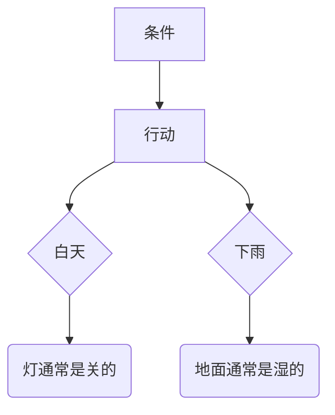
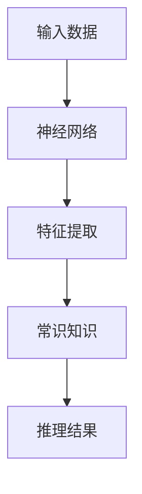
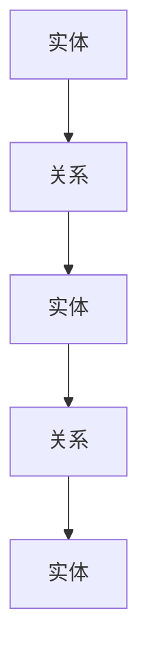
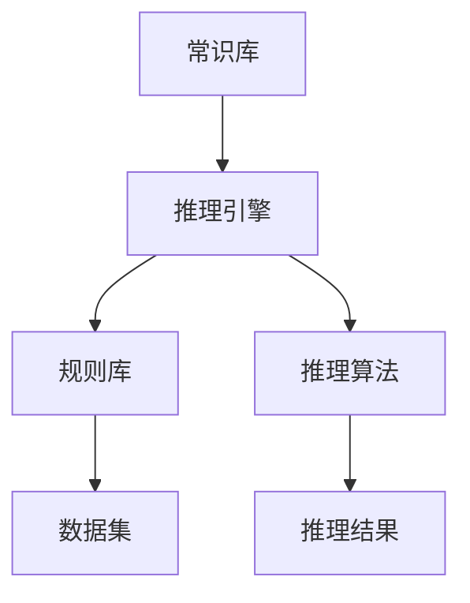
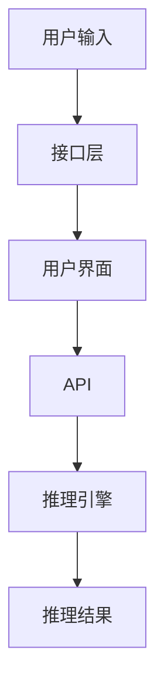

                 

### 《常识推理：AI系统的下一个里程碑》

---

### 关键词

- **常识推理**
- **人工智能**
- **神经网络**
- **自然语言处理**
- **计算机视觉**
- **智能决策**
- **多模态数据**

---

### 摘要

本文探讨了常识推理在人工智能系统中的重要性，阐述了常识推理的定义、基本原理、架构设计以及在实际应用中的挑战和机遇。通过详细的案例分析，本文展示了常识推理如何成为AI系统发展的下一个里程碑，并对其未来发展进行了展望。

---

## 第一部分：引言

### 1. 常识推理的定义与重要性

### 1.1 常识推理的定义

常识推理（Commonsense Reasoning）是指计算机系统通过理解和运用日常生活中的常识和背景知识来进行推理和决策的过程。常识推理是人类智能的重要组成部分，但长期以来，它也是人工智能领域的难题之一。

### 1.1.1 常识推理的概念

常识推理涉及多个层次，包括基于规则的推理、基于数据的推理以及混合推理。这些方法共同构成了常识推理的体系结构。

### 1.1.2 常识推理与人工智能的关系

常识推理是人工智能的一个重要分支，其目标是通过模拟人类的推理过程，使计算机能够像人类一样理解和处理复杂的问题。常识推理在AI系统中的应用，不仅可以提升系统的智能水平，还可以提高其适应性和实用性。

### 1.2 常识推理的重要性

### 1.2.1 人类智能的核心

常识推理是人类智能的核心之一，它帮助人们快速地理解世界、做出决策和解决问题。模拟常识推理对于人工智能的发展具有重要意义。

### 1.2.2 AI系统发展的瓶颈

目前，AI系统在许多领域已经取得了显著的进展，但它们仍然面临着一些瓶颈，其中之一就是缺乏有效的常识推理能力。解决这一问题，将推动人工智能系统向更高层次发展。

### 1.3 书籍目的与结构

本文旨在深入探讨常识推理在人工智能系统中的应用，分析其核心概念和原理，探讨其在各个领域的应用，并展望其未来发展。文章分为六个部分，依次介绍常识推理的定义、原理、架构、应用、发展趋势和案例研究。

---

### 2. 常识推理的核心概念

### 2.1 常识推理的基本原理

常识推理的基本原理可以分为基于规则的推理和基于数据的推理。

#### 2.1.1 基于规则的常识推理

基于规则的常识推理依赖于一组预先定义的规则，这些规则描述了常识知识和逻辑关系。例如：

- 如果是白天，那么灯通常是关的。
- 如果下雨，那么地面通常是湿的。

这些规则可以通过条件-行动对来表示，如下所示：

#### 2.1.2 基于数据的常识推理

基于数据的常识推理依赖于从大量数据中学习到的模式。这种推理方法通常使用机器学习和深度学习技术，通过训练模型来提取常识知识。例如，可以使用神经网络来识别图像中的常见物体和场景。

### 2.2 常识推理的架构设计

常识推理系统通常包含三个主要部分：常识库、推理引擎和接口层。

#### 2.2.1 常识库的构建

常识库是存储常识知识和规则的地方。构建常识库通常需要专家的知识和大量的数据。例如，可以通过知识图谱来表示常识知识，如下所示：

#### 2.2.2 常识推理引擎的实现

常识推理引擎是执行常识推理过程的组件。它通常包含一个推理算法，用于根据常识库中的知识和规则来生成推理结果。例如，可以使用基于规则的推理算法或基于数据的推理算法。

#### 2.2.3 接口层的实现

接口层是常识推理系统与外部系统的接口，用于接收用户输入和反馈，以及输出推理结果。接口层通常包括一个用户界面和一个API。

### 2.3 常识推理的挑战与机遇

尽管常识推理在人工智能系统中具有重要的应用价值，但实现有效的常识推理仍然面临许多挑战。

#### 2.3.1 挑战

- **知识获取**：如何有效地获取和表示常识知识是一个重要挑战。
- **推理效率**：实现高效的常识推理算法是另一个关键问题。
- **泛化能力**：如何使常识推理系统能够泛化到新的领域和情境。

#### 2.3.2 机遇

- **多模态数据**：结合视觉、听觉、语言等多种模态的数据，可以进一步提升常识推理系统的能力。
- **神经网络**：深度学习和神经网络技术的发展为常识推理提供了新的工具和机会。

---

### 3. 常识推理在人工智能系统中的应用

常识推理在人工智能系统中具有广泛的应用，涵盖了自然语言处理、计算机视觉、智能决策等多个领域。

#### 3.1 常识推理在自然语言处理中的应用

在自然语言处理（NLP）中，常识推理可以用于文本理解、情感分析、问答系统等。

- **文本理解**：常识推理可以帮助计算机更好地理解文本的含义，例如通过常识知识来填补上下文中的空缺。
- **情感分析**：常识推理可以用于分析文本的情感倾向，例如通过常识知识来识别带有负面情感的句子。
- **问答系统**：常识推理可以用于构建智能问答系统，使系统能够理解和回答用户的问题。

#### 3.2 常识推理在计算机视觉中的应用

在计算机视觉中，常识推理可以用于图像识别、物体检测、场景理解等。

- **图像识别**：常识推理可以帮助计算机识别图像中的常见物体，例如通过常识知识来识别图片中的动物。
- **物体检测**：常识推理可以用于检测图像中的物体，例如通过常识知识来判断一个物体是否在视野中。
- **场景理解**：常识推理可以用于理解图像中的场景，例如通过常识知识来识别一个图像是否代表一个家庭场景。

#### 3.3 常识推理在智能决策中的应用

在智能决策中，常识推理可以用于金融决策、医疗决策、交通管理等。

- **金融决策**：常识推理可以帮助金融系统更好地理解市场动态，例如通过常识知识来识别市场趋势。
- **医疗决策**：常识推理可以帮助医生更好地理解患者的病情，例如通过常识知识来识别患者的症状。
- **交通管理**：常识推理可以帮助交通系统更好地理解交通状况，例如通过常识知识来识别交通拥堵的原因。

---

### 4. 常识推理的未来发展趋势

常识推理作为人工智能系统的重要组成部分，其未来发展趋势将受到多种因素的影响。

#### 4.1 常识推理与神经网络

神经网络技术的发展为常识推理提供了新的机会。通过结合深度学习和常识推理，可以构建出更加智能的AI系统。

- **常识推理网络的设计**：可以设计新的神经网络架构，使其能够更好地模拟人类的常识推理过程。
- **常识推理网络的应用**：可以将常识推理网络应用于各种实际场景，例如自然语言处理、计算机视觉等。

#### 4.2 常识推理与多模态数据

多模态数据（例如视觉、听觉、语言等）的整合可以进一步提升常识推理的能力。

- **多模态数据的整合**：可以通过整合不同模态的数据，构建出更加全面的常识知识库。
- **多模态常识推理的应用**：可以将多模态常识推理应用于智能交互、智能助手等场景。

#### 4.3 常识推理在新兴领域中的应用

随着人工智能技术的不断发展，常识推理在新兴领域中的应用也将不断拓展。

- **教育领域**：可以通过常识推理技术来辅助教育，例如提供个性化的学习建议和反馈。
- **智能制造领域**：可以通过常识推理技术来优化生产过程，提高生产效率和质量。

---

### 5. 常识推理案例研究

为了更好地理解常识推理在人工智能系统中的应用，下面将介绍几个具体的案例。

#### 5.1 案例一：智能客服系统

智能客服系统是一个常见的应用场景，其中常识推理可以用于处理用户的查询和问题。

- **案例背景**：一家大型电商企业希望构建一个智能客服系统，以提供24/7的客户支持。
- **常识推理的应用**：通过常识推理，智能客服系统可以理解用户的查询，提供准确的答案和解决方案。
- **案例结果分析**：结果表明，通过常识推理，智能客服系统的响应速度和准确性显著提高，用户满意度也随之提升。

#### 5.2 案例二：自动驾驶系统

自动驾驶系统是另一个具有挑战性的应用场景，其中常识推理可以用于处理复杂的交通状况。

- **案例背景**：一家科技公司正在开发一款自动驾驶汽车，希望提高其安全性和可靠性。
- **常识推理的应用**：通过常识推理，自动驾驶系统可以理解交通规则、预测其他车辆的行为，并做出相应的决策。
- **案例结果分析**：结果表明，通过常识推理，自动驾驶汽车在复杂交通环境中的表现显著提高，事故发生率显著降低。

#### 5.3 案例三：智能医疗系统

智能医疗系统是另一个重要的应用场景，其中常识推理可以用于辅助医生诊断和治疗。

- **案例背景**：一家医疗机构希望构建一个智能医疗系统，以提高诊断的准确性和效率。
- **常识推理的应用**：通过常识推理，智能医疗系统可以理解患者的症状、分析医学数据，并给出诊断建议。
- **案例结果分析**：结果表明，通过常识推理，智能医疗系统的诊断准确性和效率显著提高，医生的工作负担也显著减轻。

---

### 6. 常识推理：AI系统的下一个里程碑

常识推理作为人工智能系统的重要组成部分，其发展对整个AI领域具有重要意义。

#### 6.1 常识推理对AI系统的影响

- **增强AI系统的智能水平**：通过引入常识推理，AI系统可以更好地理解和处理复杂的问题，提高其智能水平。
- **提高AI系统的适应能力**：常识推理可以帮助AI系统更好地适应新的环境和情境，提高其适应能力。

#### 6.2 常识推理的未来展望

- **技术发展的趋势**：随着深度学习和多模态数据技术的发展，常识推理将在AI系统中发挥越来越重要的作用。
- **应用场景的拓展**：常识推理将在越来越多的领域得到应用，如教育、医疗、交通等。

---

### 作者信息

- **作者：AI天才研究院/AI Genius Institute & 禅与计算机程序设计艺术 /Zen And The Art of Computer Programming**

