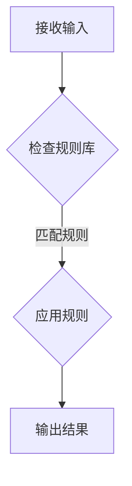
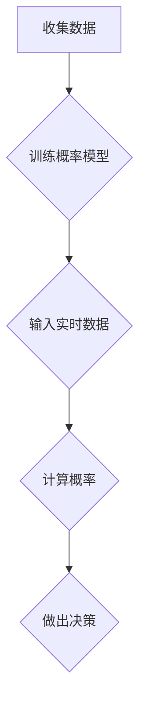
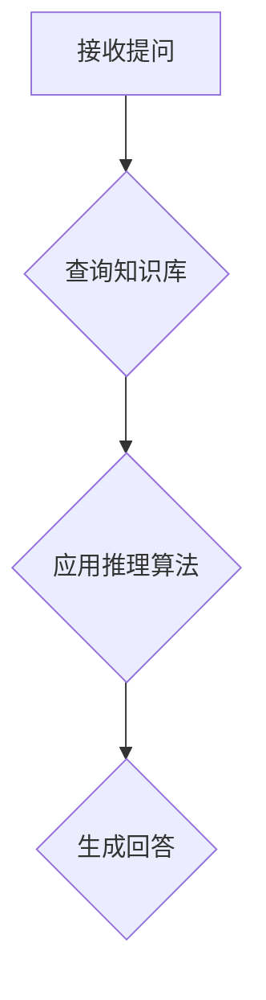

                 

## 常识推理：当前AI系统的瓶颈与突破口

### 文章关键词

- 常识推理
- AI系统瓶颈
- 突破方法
- 模型原理
- 应用实践

### 文章摘要

本文旨在探讨当前人工智能（AI）系统面临的瓶颈及其突破口，重点分析常识推理在其中的关键作用。随着AI技术的飞速发展，虽然许多领域取得了显著进步，但仍存在诸多挑战。本文首先概述了常识推理的定义和重要性，接着深入剖析了常识推理的核心原理和数学模型，并探讨了常见的常识推理算法。通过具体案例，本文展示了常识推理在AI应用中的实践，并提出了突破常识推理瓶颈的方法。最后，本文总结了常识推理在AI系统发展中的未来趋势，为读者提供了深入的思考方向。

## 第1章：常识推理概述

### 1.1 常识推理的定义与重要性

常识推理（Commonsense Reasoning）是指计算机系统根据日常生活中的常识进行推理和决策的能力。这种能力对于人类来说是理所当然的，但对于机器来说，却是一项极具挑战性的任务。常识推理涉及对现实世界的基本理解，如物体间的相互作用、因果关系、空间关系等。

在AI系统中，常识推理的重要性不可忽视。首先，常识推理能够提高AI系统的智能水平，使其能够更好地理解人类语言和意图。例如，在自然语言处理（NLP）中，常识推理可以帮助系统理解句子中的隐含意义，从而实现更准确的语义理解。其次，常识推理有助于AI系统在复杂环境中做出合理的决策。例如，在自动驾驶中，常识推理可以帮助车辆理解交通规则，预测行人的行为，从而做出安全行驶的决策。

### 1.2 AI系统的现状与挑战

当前，AI系统在许多领域都取得了显著进展，但仍然面临诸多挑战。一方面，AI系统在特定任务上表现出色，如图像识别、语音识别和机器翻译等。然而，这些系统往往依赖于大量数据和复杂的算法，对于缺乏数据的任务或者需要处理复杂情境的问题，AI系统的表现则不尽如人意。

另一方面，AI系统在常识推理方面存在显著不足。许多AI系统在处理常识问题时的表现还不如一个普通人类，例如，在回答关于日常生活的问题时，AI系统往往无法给出符合逻辑的答案。这是因为现有的AI系统主要依赖于机器学习和深度学习算法，这些算法虽然能够从大量数据中学习模式，但缺乏对基本常识的理解。

### 1.3 常识推理在AI系统中的作用

常识推理在AI系统中的作用至关重要。首先，常识推理可以增强AI系统的语义理解能力。通过引入常识推理，AI系统可以更好地理解语言中的隐含意义，从而实现更准确的语义解析。例如，在机器翻译中，常识推理可以帮助系统理解词汇的多义性和上下文关系，提高翻译的准确性。

其次，常识推理可以提高AI系统的决策能力。在复杂的环境中，AI系统需要具备对现实世界的理解和推理能力，才能做出合理的决策。例如，在自动驾驶中，常识推理可以帮助车辆理解道路标志的含义，预测行人的行为，从而实现安全驾驶。

最后，常识推理有助于AI系统在未知情境中的适应能力。现实世界是复杂多变的，AI系统需要具备适应这种不确定性的能力。通过引入常识推理，AI系统可以更好地应对未知情境，从而提高其适应能力。

### 总结

本章对常识推理的定义、重要性以及在AI系统中的现状进行了概述。常识推理作为AI系统中的一个关键组成部分，其在语义理解、决策能力和适应能力方面的作用不容忽视。在接下来的章节中，我们将深入探讨常识推理的核心原理和数学模型，为理解和突破常识推理瓶颈提供理论基础。

## 第2章：常识推理的核心原理

### 2.1 常识推理的基本概念

常识推理（Commonsense Reasoning）是指计算机系统根据常识性知识进行推理和决策的能力。这种常识性知识来源于人类日常生活中的经验，包括对物体、事件、行为、因果关系、空间关系等方面的理解。常识推理的核心目标是使计算机能够像人类一样处理日常生活中的简单任务和问题。

常识推理的基本概念包括：

1. **常识性知识**：指人类在日常生活中的普遍经验和知识，如物体属性、事件规律、行为习惯等。
2. **推理过程**：指计算机系统根据已知常识性知识，通过逻辑推理得出结论或做出决策的过程。
3. **知识表示**：指将常识性知识以计算机可理解的方式表示和存储，以便在推理过程中使用。
4. **常识库**：指包含大量常识性知识的数据库，用于支持常识推理。

### 2.2 常识推理的模型类型

常识推理模型可以分为以下几种类型：

1. **基于规则的模型**：这种模型使用一组规则来表示常识性知识，并通过逻辑推理来解决问题。例如，在医疗诊断中，医生根据病人的症状和病史，使用一系列规则进行推理，从而得出诊断结果。

    **Mermaid 流程图：**
    ```mermaid
    graph TD
    A[接收症状] --> B{检查规则库}
    B -->|匹配规则| C{应用规则}
    C --> D[得出诊断结果]
    ```

2. **基于概率的模型**：这种模型使用概率论和统计学方法来表示常识性知识，并通过概率计算来推理和决策。例如，在自动驾驶中，系统根据道路环境、车辆状态等因素，使用概率模型来预测行人的行为。

    **Mermaid 流程图：**
    ```mermaid
    graph TD
    A[收集数据] --> B{训练概率模型}
    B --> C{输入实时数据}
    C --> D{计算概率}
    D --> E{做出决策}
    ```

3. **基于知识的模型**：这种模型使用知识表示方法来存储和表示常识性知识，并通过推理算法来解决问题。例如，在问答系统中，系统根据用户的提问，通过知识库中的常识性知识进行推理，从而给出回答。

    **Mermaid 流程图：**
    ```mermaid
    graph TD
    A[接收提问] --> B{查询知识库}
    B --> C{应用推理算法}
    C --> D{生成回答}
    ```

### 2.3 常识推理的计算方法

常识推理的计算方法主要包括以下几种：

1. **逻辑推理**：逻辑推理是一种基于命题逻辑的推理方法，通过使用逻辑运算符（如与、或、非）和推理规则（如三段论、模态推理）来推理和决策。逻辑推理适用于处理清晰定义的规则和逻辑关系。

    **伪代码示例：**
    ```python
    def logical_reasoning(fact1, fact2):
        if fact1 and fact2:
            return True
        else:
            return False
    ```

2. **概率推理**：概率推理是一种基于概率论的推理方法，通过计算事件发生的概率来推理和决策。概率推理适用于处理不确定性和随机性。

    **伪代码示例：**
    ```python
    def probabilistic_reasoning(event1, event2, probability_matrix):
        probability = probability_matrix[event1][event2]
        if probability > threshold:
            return True
        else:
            return False
    ```

3. **知识推理**：知识推理是一种基于知识表示和推理算法的推理方法，通过查询知识库和运用推理算法来推理和决策。知识推理适用于处理复杂和高度结构化的知识。

    **伪代码示例：**
    ```python
    def knowledge_reasoning(question, knowledge_base):
        answer = knowledge_base.query(question)
        if answer:
            return answer
        else:
            return "无法回答"
    ```

### 总结

本章介绍了常识推理的基本概念、模型类型和计算方法。通过理解这些核心原理，我们可以更好地构建和应用常识推理系统，从而提升AI系统的智能水平。在下一章中，我们将深入探讨常识推理的数学模型，进一步理解其原理和计算方法。

### 2.4 常识推理的基本概念

常识推理（Commonsense Reasoning）是人工智能（AI）中的一个重要分支，它涉及计算机系统理解和应用日常生活中的常识性知识。常识推理的定义可以从以下几个方面来理解：

1. **日常经验**：常识推理依赖于人类在日常生活中积累的经验和知识。这些经验包括对物体、事件、行为和因果关系的理解。例如，我们知道“水是透明的”，或者“门是用于出入房间的”。

2. **推理过程**：常识推理是计算机系统通过逻辑推理来处理和解决问题的一种能力。它不仅包括基于规则和因果关系的推理，还包括对不确定性、模糊性和多义性的处理。例如，当系统面对一个句子“我把书放在桌子上”时，需要推理出“桌子上有书”这一结论。

3. **知识表示**：常识推理需要将日常生活中的常识性知识以计算机可理解的方式表示和存储。这通常涉及到知识图谱、本体论和符号化表示等方法。例如，将“猫是动物”这一常识表示为一个三元组（猫，是，动物）。

4. **应用场景**：常识推理在多个AI应用场景中起着关键作用，包括自然语言处理（NLP）、智能助手、自动驾驶、医学诊断等。在这些应用中，常识推理能够帮助系统更好地理解和回应人类的需求，提高任务的执行效率。

常识推理的重要性体现在以下几个方面：

1. **语义理解**：常识推理能够提高自然语言处理系统的语义理解能力。例如，在机器翻译中，常识推理可以帮助系统理解词汇的多义性和上下文关系，从而提高翻译的准确性。

2. **决策支持**：在复杂环境中，常识推理可以为决策提供支持。例如，在自动驾驶中，常识推理可以帮助车辆理解交通标志的含义，预测行人的行为，从而做出安全行驶的决策。

3. **未知情境适应**：常识推理有助于AI系统在未知或复杂情境中做出合理的反应。例如，在智能客服中，常识推理可以帮助系统理解用户的问题，并提供适当的解决方案。

综上所述，常识推理作为AI系统中的一个核心组件，其重要性不可忽视。通过深入理解和应用常识推理，我们可以显著提升AI系统的智能水平和实用性。在接下来的章节中，我们将继续探讨常识推理的模型类型和计算方法，为构建高效的常识推理系统提供理论基础。

### 2.5 常识推理的模型类型

常识推理在人工智能（AI）领域中扮演着至关重要的角色，其模型类型主要包括基于规则的模型、基于概率的模型和基于知识的模型。这些模型在处理不同类型的常识性问题时各具优势，下面将详细描述每种模型的特点和适用场景。

#### 基于规则的模型

**定义**：基于规则的模型使用一组预先定义好的规则来表示常识性知识，并通过逻辑推理来解决问题。这些规则通常由专家手工编写，形式化地描述了现实世界中的各种关系和因果关系。

**特点**：
- **明确性**：规则清晰明确，易于理解和解释。
- **可维护性**：规则可以通过修改和扩展来适应新的常识。
- **效率**：规则推理过程相对简单，计算效率高。

**适用场景**：
- **医疗诊断**：医生根据病人的症状和病史，使用一系列规则进行推理，从而得出诊断结果。
- **法律咨询**：法律专家根据法律条文和案例，使用规则推理来提供法律建议。
- **金融风控**：金融机构使用规则模型来监控交易行为，检测异常活动。

**Mermaid 流程图**：


#### 基于概率的模型

**定义**：基于概率的模型使用概率论和统计学方法来表示常识性知识，通过概率计算来推理和决策。这些模型通常基于大量数据训练，能够处理不确定性。

**特点**：
- **鲁棒性**：能够处理不确定性和模糊性。
- **适应性**：通过不断更新模型和数据，可以适应新的环境和情境。
- **灵活性**：能够处理复杂和多变的场景。

**适用场景**：
- **自动驾驶**：系统根据道路环境、车辆状态等因素，使用概率模型来预测行人的行为，从而做出安全行驶的决策。
- **推荐系统**：基于用户的历史行为和偏好，使用概率模型来推荐相关的商品或内容。
- **自然语言处理**：通过概率模型来处理语言的歧义和多义性，提高语义理解的准确性。

**Mermaid 流程图**：


#### 基于知识的模型

**定义**：基于知识的模型使用知识表示方法来存储和表示常识性知识，并通过推理算法来解决问题。这些模型通常包含大量的知识库和本体论，用于支持复杂的推理过程。

**特点**：
- **知识密集性**：依赖于大规模的知识库和本体论。
- **深度推理**：能够进行复杂和深层次的推理。
- **可扩展性**：通过不断更新知识库，可以扩展和适应新的知识领域。

**适用场景**：
- **智能助手**：通过知识库和推理算法，智能助手能够理解用户的问题并提供合适的解决方案。
- **医学诊断**：利用知识库中的医学知识，系统可以推理出可能的疾病诊断。
- **问答系统**：系统根据知识库中的常识性知识，回答用户提出的问题。

**Mermaid 流程图**：


通过以上对三种模型类型的详细描述，我们可以看到，每种模型都有其独特的优势和适用场景。在实际应用中，常常需要根据具体需求和场景选择合适的模型，或者将多种模型结合起来，以实现最佳的效果。在下一章中，我们将深入探讨常识推理中的数学模型，进一步理解其原理和计算方法。

### 2.6 常识推理的数学模型

常识推理作为人工智能（AI）系统中的一个关键组件，其有效性和准确性在很大程度上依赖于所采用的数学模型。常用的数学模型包括概率论与统计模型、逻辑推理与知识表示以及机器学习算法。以下是对这些模型原理和计算方法的详细探讨。

#### 2.6.1 概率论与统计模型

概率论与统计模型是常识推理中常用的基础工具。它们通过概率分布、条件概率和统计方法来表示和推理常识性知识。

1. **概率分布**：概率分布用于描述随机变量的可能取值及其概率。常见的概率分布包括伯努利分布、正态分布、泊松分布等。在常识推理中，概率分布可以用于表示物体、事件和行为的不确定性。例如，一个物体出现在某个位置的概率分布可以描述为正态分布，其均值表示该物体的典型位置，标准差表示不确定性的范围。

    **数学公式：**
    $$
    P(X=x) = \frac{1}{\sqrt{2\pi\sigma^2}} e^{-\frac{(x-\mu)^2}{2\sigma^2}}
    $$
    其中，$X$ 是随机变量，$\mu$ 是均值，$\sigma^2$ 是方差。

2. **条件概率**：条件概率描述了在某一条件下，某一事件发生的概率。在常识推理中，条件概率可以用于推理因果关系和事件之间的关系。例如，给定“明天会下雨”的条件，我们可以计算“人们会带伞”的条件概率。

    **数学公式：**
    $$
    P(A|B) = \frac{P(A \cap B)}{P(B)}
    $$
    其中，$A$ 和 $B$ 是两个事件，$P(A \cap B)$ 是事件 $A$ 和 $B$ 同时发生的概率，$P(B)$ 是事件 $B$ 发生的概率。

3. **统计方法**：统计方法如贝叶斯统计、回归分析和聚类分析等在常识推理中广泛应用。贝叶斯统计通过贝叶斯定理进行推理，回归分析用于建模因果关系，聚类分析用于分类和聚类物体或事件。

    **贝叶斯定理**：
    $$
    P(A|B) = \frac{P(B|A)P(A)}{P(B)}
    $$
    其中，$P(A|B)$ 是在事件 $B$ 发生的条件下事件 $A$ 发生的概率，$P(B|A)$ 是在事件 $A$ 发生的条件下事件 $B$ 发生的概率，$P(A)$ 和 $P(B)$ 分别是事件 $A$ 和 $B$ 发生的概率。

#### 2.6.2 逻辑推理与知识表示

逻辑推理与知识表示是常识推理中的另一个核心组成部分。它们通过形式逻辑和知识表示方法来处理常识性知识。

1. **命题逻辑**：命题逻辑是常识推理中最基本的逻辑形式。它通过命题（陈述句）和逻辑运算符（如与、或、非）来表达和推理常识。常见的命题逻辑推理方法包括推理规则（如假言推理、反证法）和证明理论。

    **推理规则示例**：
    $$
    \begin{align*}
    A \rightarrow B \\
    \neg B \rightarrow \neg A
    \end{align*}
    $$

2. **谓词逻辑**：谓词逻辑扩展了命题逻辑，允许表示更复杂的常识性知识，包括个体、关系和属性。谓词逻辑通过量词（全称量词和存在量词）来描述一般性和个体性。

    **谓词逻辑示例**：
    $$
    \forall x (P(x) \rightarrow Q(x))
    $$
    这表示对于所有的 $x$，如果 $P(x)$ 为真，则 $Q(x)$ 也为真。

3. **知识表示**：知识表示是常识推理中一个关键问题，常用的知识表示方法包括框架表示、语义网络、本体论和知识图谱等。这些方法用于将常识性知识以计算机可理解的方式存储和表示。

    **知识图谱示例**：
    $$
    \text{Person} \rightarrow \text{hasName}, \text{hasAge}
    $$
    这表示所有“Person”都有“hasName”和“hasAge”两个属性。

#### 2.6.3 机器学习算法

机器学习算法在常识推理中扮演着重要角色，通过从数据中学习模式，提高常识推理的准确性和效率。常见的机器学习算法包括监督学习、无监督学习和强化学习。

1. **监督学习**：监督学习算法通过已标记的训练数据学习预测模型。常见的监督学习算法包括线性回归、支持向量机（SVM）和决策树等。这些算法可以用于常识推理中的分类和回归问题。

    **线性回归示例**：
    $$
    y = \beta_0 + \beta_1x
    $$
    其中，$y$ 是预测值，$x$ 是输入特征，$\beta_0$ 和 $\beta_1$ 是模型参数。

2. **无监督学习**：无监督学习算法在没有标记数据的情况下学习模式。常见的无监督学习算法包括聚类分析和主成分分析（PCA）。这些算法可以用于常识推理中的模式识别和聚类问题。

    **K-均值聚类示例**：
    $$
    \text{聚类中心} = \frac{1}{N}\sum_{i=1}^{N} x_i
    $$
    其中，$x_i$ 是第 $i$ 个数据点，聚类中心是所有数据点的平均值。

3. **强化学习**：强化学习算法通过与环境交互来学习最优策略。常见的强化学习算法包括Q学习、深度Q网络（DQN）和策略梯度方法。这些算法可以用于常识推理中的决策问题。

    **Q学习示例**：
    $$
    Q(s, a) = r + \gamma \max_{a'} Q(s', a')
    $$
    其中，$s$ 是状态，$a$ 是动作，$r$ 是即时奖励，$\gamma$ 是折扣因子，$s'$ 是执行动作后的状态。

通过结合概率论与统计模型、逻辑推理与知识表示以及机器学习算法，我们可以构建出高效的常识推理系统。这些数学模型不仅在理论上为常识推理提供了坚实的基础，也在实际应用中展示了其强大的能力。在下一章中，我们将继续探讨常见的常识推理算法，分析其在不同应用场景中的具体实现和效果。

### 2.7 常见常识推理算法

常识推理算法是人工智能（AI）系统实现常识推理功能的核心。这些算法广泛应用于自然语言处理（NLP）、智能客服、自动驾驶等领域，帮助系统更好地理解和应对现实世界中的复杂问题。下面我们将介绍几种常见的常识推理算法，包括基于规则的算法、基于数据的算法和基于机器学习的算法。

#### 2.7.1 基于规则的算法

基于规则的算法通过一组预先定义好的规则来表示常识性知识，并在推理过程中应用这些规则。这种算法的主要优点是规则清晰、易于解释和维护。

1. **基于产生式规则的算法**：

   产生式规则由前提和结论组成，表示为“如果前提为真，则结论为真”。例如，在医疗诊断中，可以使用以下规则：

   $$
   \text{规则1：如果病人发烧且咳嗽，则可能患有流感。}
   $$

   推理过程如下：

   $$
   \text{前提：病人发烧且咳嗽。} \\
   \text{结论：病人可能患有流感。}
   $$

2. **基于框架表示的算法**：

   框架表示用于描述对象的属性和关系。例如，在描述一个人时，可以使用以下框架：

   $$
   \text{框架：人 = {姓名，年龄，职业}} \\
   \text{规则：如果年龄大于18，则可以结婚。}
   $$

   推理过程如下：

   $$
   \text{前提：人的年龄大于18。} \\
   \text{结论：人可以结婚。}
   $$

#### 2.7.2 基于数据的算法

基于数据的算法使用大量的数据来训练模型，从而实现常识推理。这些算法通常利用机器学习技术，如监督学习和无监督学习。

1. **监督学习算法**：

   监督学习算法通过已标记的数据集来训练模型。常见的算法包括逻辑回归、支持向量机（SVM）和决策树等。例如，在情感分析中，可以使用逻辑回归来预测文本的情感倾向。

   **逻辑回归示例**：

   $$
   P(\text{正面情感}) = \frac{1}{1 + e^{-(\beta_0 + \beta_1 \text{文本特征}_1 + \beta_2 \text{文本特征}_2 + \ldots)} \\
   P(\text{负面情感}) = 1 - P(\text{正面情感})
   $$

2. **无监督学习算法**：

   无监督学习算法在没有标记数据的情况下进行训练，常见的算法包括聚类分析和主成分分析（PCA）。例如，在文本聚类中，可以使用K-均值聚类算法将相似的文本归为一类。

   **K-均值聚类示例**：

   $$
   \text{聚类中心} = \frac{1}{N}\sum_{i=1}^{N} x_i \\
   \text{距离} = \sqrt{\sum_{i=1}^{n}(x_i - \mu)^2}
   $$

#### 2.7.3 基于机器学习的算法

基于机器学习的算法通过从数据中学习模式来实现常识推理。这些算法通常包括深度学习模型，如卷积神经网络（CNN）和循环神经网络（RNN）等。

1. **深度学习算法**：

   深度学习算法通过多层神经网络来学习复杂的特征和模式。在图像识别中，卷积神经网络（CNN）被广泛使用。例如，在自动驾驶中，CNN可以用于识别道路标志和行人。

   **卷积神经网络（CNN）示例**：

   $$
   \text{卷积层：} \text{输入} \rightarrow \text{特征图} \\
   \text{池化层：} \text{特征图} \rightarrow \text{特征图} \\
   \text{全连接层：} \text{特征图} \rightarrow \text{输出}
   $$

2. **循环神经网络（RNN）**：

   循环神经网络（RNN）适合处理序列数据，如自然语言文本。在语言模型中，RNN可以用于生成文本或翻译句子。

   **循环神经网络（RNN）示例**：

   $$
   \text{隐藏状态} \, h_t = \text{激活函数}(\text{输入} \, x_t + \text{隐藏状态前一个时间步} \, h_{t-1} + \text{权重矩阵})
   $$

通过上述算法，我们可以看到常识推理在AI系统中的应用和实现。这些算法不仅在理论上为常识推理提供了强大的支持，也在实际应用中展示了其优越的性能。在下一章中，我们将探讨常识推理在AI应用中的具体实践，分析其在不同领域中的应用案例。

### 2.8 常识推理在AI应用中的具体实践

常识推理在人工智能（AI）领域的实际应用中扮演着至关重要的角色，它不仅提高了AI系统的智能水平，还增强了其在现实世界中的适应能力。以下将介绍常识推理在自然语言处理（NLP）、智能客服、自动驾驶等领域的具体实践。

#### 自然语言处理（NLP）

自然语言处理是常识推理的重要应用领域之一。在NLP中，常识推理可以帮助系统更好地理解和生成自然语言，从而实现更准确的语义解析和对话生成。

1. **语义理解**：

   常识推理在语义理解中用于处理语言中的隐含意义。例如，当用户输入“明天天气怎么样？”时，系统需要理解“明天”是指未来的某个时间点，“天气”是指温度、湿度等气象条件。常识推理可以帮助系统解析这些词汇和句子的隐含意义。

   **实例**：

   $$
   \text{用户输入：明天天气怎么样？} \\
   \text{常识推理：明天是指未来的一天，天气是指温度、湿度等气象条件。}
   $$

2. **对话生成**：

   常识推理在对话生成中用于模拟人类的对话行为。例如，在客服机器人中，常识推理可以帮助系统理解用户的问题，并根据用户的需求提供适当的回答。

   **实例**：

   $$
   \text{用户输入：我需要一份发票。} \\
   \text{常识推理：用户需要发票，可能是为了报销或记录消费。} \\
   \text{回答：请问您需要什么类型的发票？用于什么目的？}
   $$

#### 智能客服

智能客服是常识推理的另一个重要应用领域，它通过模拟人类客服代表的行为，为用户提供高效、准确的客户服务。

1. **问题分类**：

   常识推理可以帮助系统将用户的问题归类到不同的类别中，从而快速定位问题的解决方法。例如，当用户输入“我的快递怎么还没有送到？”时，系统可以使用常识推理将问题分类为“物流查询”。

   **实例**：

   $$
   \text{用户输入：我的快递怎么还没有送到？} \\
   \text{常识推理：这是一个关于物流查询的问题。}
   $$

2. **智能应答**：

   常识推理在智能应答中用于生成适当的回答，以解决用户的问题。例如，当用户咨询关于产品使用方法时，系统可以使用常识推理提供相关的操作指南。

   **实例**：

   $$
   \text{用户输入：我忘记如何使用洗衣机了。} \\
   \text{常识推理：用户可能需要使用方法的指导。} \\
   \text{回答：您可以使用以下步骤来操作洗衣机：1. 添加衣物；2. 选择适当的洗涤程序；3. 加入洗衣液。}
   $$

#### 自动驾驶

自动驾驶是常识推理在AI领域中极具潜力的应用领域，它通过模拟人类的驾驶行为，使车辆能够在复杂交通环境中安全行驶。

1. **交通规则理解**：

   常识推理可以帮助自动驾驶系统理解道路标志、信号灯和交通标志的含义。例如，当系统看到“红灯停，绿灯行”的标志时，它会使用常识推理来理解并遵守交通规则。

   **实例**：

   $$
   \text{道路标志：红灯。} \\
   \text{常识推理：红灯表示停止。}
   $$

2. **行人行为预测**：

   常识推理在行人行为预测中用于预测行人的下一步动作。例如，当系统看到行人正准备过马路时，它会使用常识推理来预测行人的动向，并提前做出相应的反应。

   **实例**：

   $$
   \text{行人动作：准备过马路。} \\
   \text{常识推理：行人可能会穿过马路。}
   $$

   系统会减速或停车，以确保行人的安全。

通过上述实例，我们可以看到常识推理在自然语言处理、智能客服和自动驾驶等领域的具体应用和实践。常识推理不仅提升了AI系统的智能水平，还增强了其在复杂环境中的适应能力，为人工智能的发展注入了新的活力。

### 第3章：常识推理的数学模型

常识推理作为人工智能（AI）系统中的一个关键组件，其有效性和准确性在很大程度上依赖于所采用的数学模型。本章将深入探讨常用的数学模型，包括概率论与统计模型、逻辑推理与知识表示以及机器学习算法。

#### 3.1 概率论与统计模型

概率论与统计模型在常识推理中起着基础性的作用，它们通过概率分布、条件概率和统计方法来表示和推理常识性知识。

1. **概率分布**：

   概率分布用于描述随机变量的可能取值及其概率。常见的概率分布包括伯努利分布、正态分布、泊松分布等。

   **伯努利分布**：
   $$
   P(X=1) = p, \quad P(X=0) = 1-p
   $$
   其中，$X$ 是随机变量，$p$ 是成功的概率。

   **正态分布**：
   $$
   P(X \leq x) = \frac{1}{\sqrt{2\pi\sigma^2}} e^{-\frac{(x-\mu)^2}{2\sigma^2}}
   $$
   其中，$\mu$ 是均值，$\sigma^2$ 是方差。

   **泊松分布**：
   $$
   P(X=k) = \frac{e^{-\lambda} \lambda^k}{k!}
   $$
   其中，$\lambda$ 是平均发生率，$k$ 是事件发生的次数。

2. **条件概率**：

   条件概率描述了在某一条件下，某一事件发生的概率。例如，给定“明天会下雨”的条件，我们可以计算“人们会带伞”的条件概率。

   $$
   P(A|B) = \frac{P(A \cap B)}{P(B)}
   $$
   其中，$A$ 和 $B$ 是两个事件，$P(A \cap B)$ 是事件 $A$ 和 $B$ 同时发生的概率，$P(B)$ 是事件 $B$ 发生的概率。

3. **统计方法**：

   常用的统计方法包括贝叶斯统计、回归分析和聚类分析等。

   **贝叶斯定理**：
   $$
   P(A|B) = \frac{P(B|A)P(A)}{P(B)}
   $$
   其中，$P(A|B)$ 是在事件 $B$ 发生的条件下事件 $A$ 发生的概率，$P(B|A)$ 是在事件 $A$ 发生的条件下事件 $B$ 发生的概率，$P(A)$ 和 $P(B)$ 分别是事件 $A$ 和 $B$ 发生的概率。

#### 3.2 逻辑推理与知识表示

逻辑推理与知识表示是常识推理中的另一个核心组成部分，它们通过形式逻辑和知识表示方法来处理常识性知识。

1. **命题逻辑**：

   命题逻辑是常识推理中最基本的逻辑形式，通过命题和逻辑运算符来表达和推理。

   **命题逻辑运算**：

   - 与（AND）：$A \land B$
   - 或（OR）：$A \lor B$
   - 非（NOT）：$\neg A$

   **推理规则**：

   - **假言推理**：如果 $A$ 则 $B$，那么如果 $A$ 为真，则 $B$ 也为真。
   - **反证法**：如果假设 $A$ 为真会导致矛盾，则 $A$ 为假。

2. **谓词逻辑**：

   谓词逻辑扩展了命题逻辑，允许表示更复杂的常识性知识，包括个体、关系和属性。

   **谓词逻辑表达式**：

   - **存在量词**：$\exists x P(x)$ 表示存在至少一个 $x$ 使得 $P(x)$ 为真。
   - **全称量词**：$\forall x P(x)$ 表示对所有 $x$，$P(x)$ 都为真。

   **谓词逻辑示例**：

   $$
   \forall x (P(x) \rightarrow Q(x))
   $$
   表示对于所有的 $x$，如果 $P(x)$ 为真，则 $Q(x)$ 也为真。

3. **知识表示**：

   知识表示是常识推理中的关键问题，常用的方法包括框架表示、语义网络、本体论和知识图谱等。

   **知识图谱示例**：

   $$
   \text{Person} \rightarrow \text{hasName}, \text{hasAge}
   $$
   表示所有“Person”都有“hasName”和“hasAge”两个属性。

#### 3.3 机器学习算法

机器学习算法在常识推理中扮演着重要角色，通过从数据中学习模式，提高常识推理的准确性和效率。

1. **监督学习算法**：

   监督学习算法通过已标记的训练数据学习预测模型，常见的算法包括线性回归、支持向量机（SVM）和决策树等。

   **线性回归**：
   $$
   y = \beta_0 + \beta_1x
   $$
   其中，$y$ 是预测值，$x$ 是输入特征，$\beta_0$ 和 $\beta_1$ 是模型参数。

   **支持向量机（SVM）**：
   $$
   \min_{\beta, \beta_0} \frac{1}{2} ||\beta||^2 + C \sum_{i=1}^{n} \max(0, 1 - y_i (\beta^T x_i + \beta_0))
   $$
   其中，$C$ 是惩罚参数，$y_i$ 是第 $i$ 个样本的标签，$x_i$ 是第 $i$ 个样本的特征向量。

   **决策树**：
   $$
   \text{决策树} = \text{递归划分特征} \rightarrow \text{分类或回归}
   $$

2. **无监督学习算法**：

   无监督学习算法在没有标记数据的情况下学习模式，常见的算法包括聚类分析和主成分分析（PCA）。

   **K-均值聚类**：
   $$
   \text{聚类中心} = \frac{1}{N}\sum_{i=1}^{N} x_i \\
   \text{距离} = \sqrt{\sum_{i=1}^{n}(x_i - \mu)^2}
   $$

   **主成分分析（PCA）**：
   $$
   \mu = \frac{1}{N}\sum_{i=1}^{N} x_i \\
   \Sigma = \frac{1}{N}\sum_{i=1}^{N} (x_i - \mu)(x_i - \mu)^T
   $$
   其中，$\mu$ 是均值矩阵，$\Sigma$ 是协方差矩阵。

3. **强化学习算法**：

   强化学习算法通过与环境交互来学习最优策略，常见的算法包括Q学习、深度Q网络（DQN）和策略梯度方法。

   **Q学习**：
   $$
   Q(s, a) = r + \gamma \max_{a'} Q(s', a')
   $$
   其中，$s$ 是状态，$a$ 是动作，$r$ 是即时奖励，$\gamma$ 是折扣因子，$s'$ 是执行动作后的状态。

通过结合概率论与统计模型、逻辑推理与知识表示以及机器学习算法，我们可以构建出高效的常识推理系统。这些数学模型不仅在理论上为常识推理提供了坚实的基础，也在实际应用中展示了其强大的能力。在下一章中，我们将继续探讨常见的常识推理算法，分析其在不同应用场景中的具体实现和效果。

### 第4章：常见的常识推理算法

常识推理算法是人工智能（AI）系统实现常识推理功能的关键组成部分。这些算法通过不同的原理和技术，帮助系统理解和处理日常生活中的常识性知识。本章将介绍几种常见的常识推理算法，包括基于规则的算法、基于数据的算法和基于机器学习的算法。

#### 4.1 基于规则的算法

基于规则的算法通过一组预先定义好的规则来表示常识性知识，并在推理过程中应用这些规则。这种算法通常用于处理结构化、清晰定义的常识性问题。

1. **基于产生式规则的算法**：

   产生式规则由前提和结论组成，表示为“如果前提为真，则结论为真”。这种规则形式简单、直观，易于理解和维护。

   **示例**：

   - **前提**：如果天气寒冷，则需要穿厚衣服。
   - **结论**：如果今天天气寒冷，则今天需要穿厚衣服。

   **实现**：

   ```python
   def cold_weather_rule(weather, clothing):
       if weather == 'cold':
           clothing = 'thick'
       return clothing
   ```

2. **基于框架表示的算法**：

   框架表示用于描述对象的属性和关系。这种表示方法可以处理更复杂的常识性问题，例如人物关系和物体属性。

   **示例**：

   - **框架**：学生 = {姓名，年龄，成绩}。
   - **规则**：如果学生的成绩低于60分，则该学生需要补考。

   **实现**：

   ```python
   def student_rule(student):
       if student['成绩'] < 60:
           student['补考'] = True
       return student
   ```

#### 4.2 基于数据的算法

基于数据的算法使用大量的数据来训练模型，从而实现常识推理。这些算法通常利用机器学习技术，如监督学习和无监督学习。

1. **监督学习算法**：

   监督学习算法通过已标记的训练数据学习预测模型。这些算法可以用于分类和回归问题，从而处理常识性知识。

   **示例**：

   - **分类问题**：判断一个句子是否包含侮辱性词汇。

     **算法**：逻辑回归

     **实现**：

     ```python
     from sklearn.linear_model import LogisticRegression

     model = LogisticRegression()
     model.fit(X_train, y_train)
     predictions = model.predict(X_test)
     ```

   - **回归问题**：预测某个城市明天的天气温度。

     **算法**：线性回归

     **实现**：

     ```python
     from sklearn.linear_model import LinearRegression

     model = LinearRegression()
     model.fit(X_train, y_train)
     temperature = model.predict([input_data])
     ```

2. **无监督学习算法**：

   无监督学习算法在没有标记数据的情况下学习模式。这些算法可以用于模式识别和聚类问题，从而处理常识性知识。

   **示例**：

   - **聚类问题**：将相似的句子归类到同一类别。

     **算法**：K-均值聚类

     **实现**：

     ```python
     from sklearn.cluster import KMeans

     kmeans = KMeans(n_clusters=k)
     kmeans.fit(X)
     labels = kmeans.predict(X)
     ```

   - **降维问题**：将高维数据映射到低维空间，便于分析和可视化。

     **算法**：主成分分析（PCA）

     **实现**：

     ```python
     from sklearn.decomposition import PCA

     pca = PCA(n_components=k)
     pca.fit(X)
     X_reduced = pca.transform(X)
     ```

#### 4.3 基于机器学习的算法

基于机器学习的算法通过从数据中学习模式，提高常识推理的准确性和效率。这些算法通常包括深度学习模型，如卷积神经网络（CNN）和循环神经网络（RNN）等。

1. **深度学习算法**：

   深度学习算法通过多层神经网络来学习复杂的特征和模式。这些算法可以用于图像识别、自然语言处理等任务。

   **示例**：

   - **图像识别**：使用卷积神经网络（CNN）识别图片中的物体。

     **算法**：卷积神经网络（CNN）

     **实现**：

     ```python
     from tensorflow.keras.models import Sequential
     from tensorflow.keras.layers import Conv2D, MaxPooling2D, Flatten, Dense

     model = Sequential()
     model.add(Conv2D(filters=32, kernel_size=(3, 3), activation='relu', input_shape=(28, 28, 1)))
     model.add(MaxPooling2D(pool_size=(2, 2)))
     model.add(Flatten())
     model.add(Dense(units=10, activation='softmax'))
     model.compile(optimizer='adam', loss='categorical_crossentropy', metrics=['accuracy'])
     model.fit(X_train, y_train, epochs=10, batch_size=32)
     ```

   - **自然语言处理**：使用循环神经网络（RNN）生成文本。

     **算法**：循环神经网络（RNN）

     **实现**：

     ```python
     from tensorflow.keras.models import Sequential
     from tensorflow.keras.layers import Embedding, LSTM, Dense

     model = Sequential()
     model.add(Embedding(input_dim=vocab_size, output_dim=embedding_size))
     model.add(LSTM(units=128))
     model.add(Dense(units=vocab_size, activation='softmax'))
     model.compile(optimizer='rmsprop', loss='categorical_crossentropy', metrics=['accuracy'])
     model.fit(X_train, y_train, epochs=10, batch_size=32)
     ```

通过介绍这些常见的常识推理算法，我们可以看到它们在实现常识推理功能中的广泛应用。这些算法不仅有助于提升AI系统的智能水平，还为解决复杂常识性问题提供了有效的解决方案。在下一章中，我们将探讨常识推理在AI应用中的具体实践，分析其在不同领域的应用案例。

### 4.4 常识推理在自然语言处理（NLP）中的应用

自然语言处理（NLP）是人工智能（AI）领域的一个重要分支，它涉及计算机对人类语言的识别、理解和生成。常识推理在NLP中的应用至关重要，它能够显著提升NLP系统的语义理解和文本生成能力。以下将详细探讨常识推理在NLP中的具体应用，包括文本分类、情感分析和机器翻译等。

#### 文本分类

文本分类是NLP中的一项基本任务，它涉及将文本数据归类到预先定义的类别中。常识推理在文本分类中起到了关键作用，通过引入常识性知识，可以提高分类的准确性和泛化能力。

1. **基于规则的文本分类**：

   基于规则的算法使用一组预定义的规则来表示常识性知识，例如，判断一个句子是否属于负面情感类别。这些规则通常由领域专家根据常识编写。

   **示例规则**：

   - 如果句子中包含“痛苦”、“困难”等负面词汇，则该句子属于负面情感类别。
   - 如果句子中包含“愉快”、“成功”等正面词汇，则该句子属于正面情感类别。

   **实现**：

   ```python
   def rule_based_sentiment_analysis(sentence):
       if 'pain' in sentence or 'difficulty' in sentence:
           return 'negative'
       elif 'happy' in sentence or 'success' in sentence:
           return 'positive'
       else:
           return 'neutral'
   ```

2. **基于机器学习的文本分类**：

   基于机器学习的算法通过从大量已标记的数据中学习模式，构建分类模型。常识推理可以帮助模型更好地理解文本中的隐含意义。

   **算法**：

   - **朴素贝叶斯分类器**：通过计算文本中各个词汇的概率分布来实现分类。
   - **支持向量机（SVM）**：通过找到最优分割超平面来实现分类。

   **实现**：

   ```python
   from sklearn.feature_extraction.text import TfidfVectorizer
   from sklearn.naive_bayes import MultinomialNB
   from sklearn.model_selection import train_test_split
   from sklearn.metrics import accuracy_score

   # 数据准备
   sentences = ["我很开心", "今天真是糟糕的一天", "我很高兴终于完成了这个项目"]
   labels = ["positive", "negative", "positive"]

   # 特征提取
   vectorizer = TfidfVectorizer()
   X = vectorizer.fit_transform(sentences)

   # 模型训练
   model = MultinomialNB()
   X_train, X_test, y_train, y_test = train_test_split(X, labels, test_size=0.2)
   model.fit(X_train, y_train)

   # 预测
   predictions = model.predict(X_test)
   print(accuracy_score(y_test, predictions))
   ```

#### 情感分析

情感分析是NLP中另一个重要任务，它旨在判断文本表达的情感倾向，如正面、负面或中性。常识推理在情感分析中用于处理语言中的多义性和上下文关系，从而提高分析结果的准确性。

1. **基于常识的情感分析**：

   常识推理可以用来处理文本中的隐含情感，例如，当文本中包含“有趣”一词时，可以根据常识判断其为正面情感。

   **示例规则**：

   - 如果文本中包含“有趣”、“喜欢”等词汇，则该文本可能表达正面情感。
   - 如果文本中包含“难过”、“痛苦”等词汇，则该文本可能表达负面情感。

   **实现**：

   ```python
   def common_sense_sentiment_analysis(text):
       positive_words = ["有趣", "喜欢", "开心"]
       negative_words = ["难过", "痛苦", "糟糕"]

       positive_count = sum([1 for word in text.split() if word in positive_words])
       negative_count = sum([1 for word in text.split() if word in negative_words])

       if positive_count > negative_count:
           return 'positive'
       elif negative_count > positive_count:
           return 'negative'
       else:
           return 'neutral'
   ```

2. **基于深度学习的情感分析**：

   基于深度学习的算法通过从大量标注数据中学习情感特征，可以处理更复杂的情感分析任务。

   **算法**：

   - **卷积神经网络（CNN）**：用于提取文本中的局部特征。
   - **长短期记忆网络（LSTM）**：用于处理序列数据中的长期依赖关系。

   **实现**：

   ```python
   from tensorflow.keras.models import Sequential
   from tensorflow.keras.layers import Embedding, LSTM, Dense

   # 模型构建
   model = Sequential()
   model.add(Embedding(input_dim=vocab_size, output_dim=embedding_size))
   model.add(LSTM(units=128, return_sequences=True))
   model.add(Dense(units=1, activation='sigmoid'))

   # 模型编译
   model.compile(optimizer='adam', loss='binary_crossentropy', metrics=['accuracy'])

   # 模型训练
   model.fit(X_train, y_train, epochs=10, batch_size=32)

   # 预测
   predictions = model.predict(X_test)
   print(predictions)
   ```

#### 机器翻译

机器翻译是NLP中的另一个重要任务，它涉及将一种语言的文本翻译成另一种语言。常识推理在机器翻译中用于处理语言中的多义性和上下文关系，从而提高翻译的准确性。

1. **基于规则的机器翻译**：

   基于规则的算法使用一组预定义的规则来转换源语言文本为目标语言文本。这些规则通常基于语言学知识和常识。

   **示例规则**：

   - 如果源语言中包含“去”一词，则目标语言中应包含“去”的同义词。
   - 如果源语言中包含时间词，则目标语言中也应包含相应的时间词。

   **实现**：

   ```python
   def rule_based_translation(source_sentence, target_language):
       translation_rules = {
           "source": "target",
           "去": "去",
           "现在": "now",
           ...
       }
       
       translated_sentence = ""
       for word in source_sentence.split():
           translated_sentence += translation_rules.get(word, word) + " "
       return translated_sentence.strip()
   ```

2. **基于机器学习的机器翻译**：

   基于机器学习的算法通过从大量平行语料库中学习翻译模式，构建翻译模型。常识推理可以辅助模型处理语言中的复杂性和多义性。

   **算法**：

   - **序列到序列模型**：用于将一个序列转换为另一个序列。
   - **注意力机制**：用于处理源语言和目标语言之间的依赖关系。

   **实现**：

   ```python
   from tensorflow.keras.models import Model
   from tensorflow.keras.layers import Input, LSTM, Dense

   # 模型构建
   encoder_inputs = Input(shape=(None, input_vocab_size))
   encoder_embedding = Embedding(input_vocab_size, embedding_size)(encoder_inputs)
   encoder_lstm = LSTM(units=128, return_state=True)
   _, state_h, state_c = encoder_lstm(encoder_embedding)

   decoder_inputs = Input(shape=(None, target_vocab_size))
   decoder_embedding = Embedding(target_vocab_size, embedding_size)(decoder_inputs)
   decoder_lstm = LSTM(units=128, return_sequences=True, return_state=True)
   decoder_outputs = decoder_lstm(decoder_embedding, initial_state=[state_h, state_c])

   decoder_dense = Dense(target_vocab_size, activation='softmax')
   decoder_outputs = decoder_dense(decoder_outputs)

   # 模型编译
   model = Model([encoder_inputs, decoder_inputs], decoder_outputs)
   model.compile(optimizer='adam', loss='categorical_crossentropy', metrics=['accuracy'])

   # 模型训练
   model.fit([X_train, y_train], y_train, batch_size=32, epochs=10)

   # 预测
   translations = model.predict([encoder_input, decoder_input])
   print(translations)
   ```

通过上述应用实例，我们可以看到常识推理在自然语言处理中的重要性。常识推理不仅提升了NLP系统的语义理解和生成能力，还为解决复杂的语言处理任务提供了有效的方法。在下一章中，我们将继续探讨常识推理在智能客服和自动驾驶等领域的具体应用。

### 4.5 常识推理在智能客服中的应用

智能客服是人工智能（AI）在客户服务领域的重要应用，它通过模拟人类客服代表的行为，为用户提供高效、准确的客户支持。常识推理在智能客服中扮演着至关重要的角色，它帮助系统理解用户的问题，并提供合适的解决方案。以下将详细探讨常识推理在智能客服中的应用，包括问题理解、意图识别和智能应答等。

#### 问题理解

问题理解是智能客服中的第一步，它涉及系统对用户输入的自然语言文本进行分析和理解，提取关键信息。常识推理在问题理解中用于识别用户问题中的语义和上下文。

1. **基于规则的问题理解**：

   基于规则的算法使用一组预定义的规则来解析用户的问题，并提取关键信息。这些规则通常由领域专家根据常识编写。

   **示例规则**：

   - 如果用户提到“订单”，则问题可能与订单状态有关。
   - 如果用户提到“退款”，则问题可能与退款流程有关。

   **实现**：

   ```python
   def rule_based_question_understanding(question):
       if "订单" in question:
           return "order"
       elif "退款" in question:
           return "refund"
       else:
           return "unknown"
   ```

2. **基于机器学习的问题理解**：

   基于机器学习的算法通过从大量标注数据中学习模式，构建问题理解模型。常识推理可以帮助模型更好地理解用户问题中的隐含意义。

   **算法**：

   - **朴素贝叶斯分类器**：通过计算文本中各个词汇的概率分布来实现分类。
   - **卷积神经网络（CNN）**：用于提取文本中的局部特征。

   **实现**：

   ```python
   from sklearn.feature_extraction.text import TfidfVectorizer
   from sklearn.naive_bayes import MultinomialNB

   # 数据准备
   questions = ["我的订单什么时候能送到？", "我想申请退款", "其他问题"]
   labels = ["order", "refund", "other"]

   # 特征提取
   vectorizer = TfidfVectorizer()
   X = vectorizer.fit_transform(questions)

   # 模型训练
   model = MultinomialNB()
   model.fit(X, labels)

   # 预测
   prediction = model.predict(vectorizer.transform(["我的订单什么时候能送到？"]))
   print(prediction)
   ```

#### 意图识别

意图识别是智能客服中的关键步骤，它涉及系统理解用户问题的意图，以便提供相应的解决方案。常识推理在意图识别中用于处理用户问题的多义性和上下文关系。

1. **基于常识的意图识别**：

   常识推理可以用来处理用户问题中的隐含意图，例如，当用户提到“退款”时，系统可以根据常识判断其意图是申请退款还是查询退款流程。

   **示例规则**：

   - 如果用户提到“退款”，且包含“申请”一词，则意图是申请退款。
   - 如果用户提到“退款”，但未提及“申请”或“查询”，则意图是查询退款流程。

   **实现**：

   ```python
   def common_sense_intent_recognition(question):
       if "申请" in question and "退款" in question:
           return "apply_refund"
       elif "退款" in question:
           return "check_refund_process"
       else:
           return "unknown_intent"
   ```

2. **基于机器学习的意图识别**：

   基于机器学习的算法通过从大量标注数据中学习意图模式，构建意图识别模型。常识推理可以辅助模型处理用户问题的复杂性和多义性。

   **算法**：

   - **长短期记忆网络（LSTM）**：用于处理序列数据中的长期依赖关系。
   - **支持向量机（SVM）**：用于分类用户问题的意图。

   **实现**：

   ```python
   from tensorflow.keras.models import Sequential
   from tensorflow.keras.layers import Embedding, LSTM, Dense

   # 模型构建
   model = Sequential()
   model.add(Embedding(input_dim=vocab_size, output_dim=embedding_size))
   model.add(LSTM(units=128, return_sequences=True))
   model.add(Dense(units=num_intents, activation='softmax'))

   # 模型编译
   model.compile(optimizer='adam', loss='categorical_crossentropy', metrics=['accuracy'])

   # 模型训练
   model.fit(X_train, y_train, epochs=10, batch_size=32)

   # 预测
   prediction = model.predict(np.array([question_vector]))
   print(prediction)
   ```

#### 智能应答

智能应答是智能客服中的最后一步，它涉及系统根据用户的问题和意图，生成合适的回答。常识推理在智能应答中用于生成符合常识和上下文的回答。

1. **基于规则的智能应答**：

   基于规则的算法使用一组预定义的规则来生成回答，这些规则通常基于常识和用户问题的分类。

   **示例规则**：

   - 如果用户问题分类为“订单”，则回答：“您的订单将在两个工作日内送达。”
   - 如果用户问题分类为“退款”，则回答：“请提供您的订单号，我们将尽快处理您的退款申请。”

   **实现**：

   ```python
   def rule_based_response(question_category):
       if question_category == "order":
           return "您的订单将在两个工作日内送达。"
       elif question_category == "refund":
           return "请提供您的订单号，我们将尽快处理您的退款申请。"
       else:
           return "感谢您的提问，我们将尽快为您解答。"
   ```

2. **基于机器学习的智能应答**：

   基于机器学习的算法通过从大量对话数据中学习回答模式，构建智能应答模型。常识推理可以辅助模型生成更符合常识的回答。

   **算法**：

   - **序列到序列模型**：用于将一个序列转换为另一个序列。
   - **生成对抗网络（GAN）**：用于生成符合常识的对话回答。

   **实现**：

   ```python
   from tensorflow.keras.models import Model
   from tensorflow.keras.layers import Input, LSTM, Dense

   # 模型构建
   encoder_inputs = Input(shape=(None, input_vocab_size))
   encoder_embedding = Embedding(input_vocab_size, embedding_size)(encoder_inputs)
   encoder_lstm = LSTM(units=128, return_state=True)
   _, state_h, state_c = encoder_lstm(encoder_embedding)

   decoder_inputs = Input(shape=(None, target_vocab_size))
   decoder_embedding = Embedding(target_vocab_size, embedding_size)(decoder_inputs)
   decoder_lstm = LSTM(units=128, return_sequences=True, return_state=True)
   decoder_outputs = decoder_lstm(decoder_embedding, initial_state=[state_h, state_c])

   decoder_dense = Dense(target_vocab_size, activation='softmax')
   decoder_outputs = decoder_dense(decoder_outputs)

   # 模型编译
   model = Model([encoder_inputs, decoder_inputs], decoder_outputs)
   model.compile(optimizer='adam', loss='categorical_crossentropy', metrics=['accuracy'])

   # 模型训练
   model.fit([X_train, y_train], y_train, batch_size=32, epochs=10)

   # 预测
   response = model.predict(np.array([question_vector]))
   print(response)
   ```

通过上述应用实例，我们可以看到常识推理在智能客服中的重要性。常识推理不仅提升了智能客服系统的语义理解和应答能力，还为提供高质量客户支持提供了有力支持。在下一章中，我们将探讨常识推理在自动驾驶中的应用，分析其在车辆行为预测和交通规则理解中的具体实现。

### 4.6 常识推理在自动驾驶中的应用

自动驾驶技术是人工智能（AI）领域的前沿应用，它通过模拟人类驾驶行为，使车辆能够在复杂的交通环境中自主行驶。常识推理在自动驾驶中起着至关重要的作用，它帮助系统理解交通规则、预测车辆和行人的行为，并做出安全、合理的驾驶决策。以下将详细探讨常识推理在自动驾驶中的应用，包括车辆行为预测、交通规则理解和行人行为预测等。

#### 车辆行为预测

车辆行为预测是自动驾驶系统中的一个核心任务，它涉及预测车辆的未来运动轨迹和驾驶行为。常识推理在车辆行为预测中用于处理交通信号、道路标志和交通规则，从而提高预测的准确性。

1. **基于规则的车辆行为预测**：

   基于规则的算法使用一组预定义的规则来表示交通规则和驾驶行为。这些规则通常由交通工程师和驾驶专家共同编写。

   **示例规则**：

   - 如果交通信号灯为红灯，则车辆应停车等待。
   - 如果道路标志指示“右转”，则车辆应向右转向。

   **实现**：

   ```python
   def rule_based_vehicle_behavior_prediction(traffic_light, road_sign):
       if traffic_light == "red":
           return "stop"
       elif road_sign == "right":
           return "turn_right"
       else:
           return "continue"
   ```

2. **基于机器学习的车辆行为预测**：

   基于机器学习的算法通过从大量驾驶数据中学习模式，构建车辆行为预测模型。常识推理可以辅助模型处理交通信号和道路标志中的复杂信息。

   **算法**：

   - **卷积神经网络（CNN）**：用于提取道路标志和交通信号中的视觉特征。
   - **长短期记忆网络（LSTM）**：用于处理时间序列数据，如车辆的加速度和速度。

   **实现**：

   ```python
   from tensorflow.keras.models import Sequential
   from tensorflow.keras.layers import Conv2D, LSTM, Dense

   # 模型构建
   model = Sequential()
   model.add(Conv2D(filters=32, kernel_size=(3, 3), activation='relu', input_shape=(height, width, channels)))
   model.add(MaxPooling2D(pool_size=(2, 2)))
   model.add(Flatten())
   model.add(LSTM(units=128, return_sequences=True))
   model.add(Dense(units=1, activation='softmax'))

   # 模型编译
   model.compile(optimizer='adam', loss='categorical_crossentropy', metrics=['accuracy'])

   # 模型训练
   model.fit(X_train, y_train, epochs=10, batch_size=32)

   # 预测
   prediction = model.predict(np.array([traffic_light_image]))
   print(prediction)
   ```

#### 交通规则理解

交通规则理解是自动驾驶系统在复杂交通环境中安全行驶的基础。常识推理在交通规则理解中用于识别和解释交通信号、道路标志和交通法规，从而确保车辆遵守交通规则。

1. **基于常识的交通规则理解**：

   常识推理通过处理交通信号和道路标志中的常识性信息，帮助自动驾驶系统理解交通规则。

   **示例规则**：

   - 如果交通信号灯为绿色，则车辆可以行驶。
   - 如果道路标志指示“环岛”，则车辆应进入环岛并按顺时针方向行驶。

   **实现**：

   ```python
   def common_sense_traffic_rule_understanding(traffic_light, road_sign):
       if traffic_light == "green":
           return "go"
       elif road_sign == "roundabout":
           return "enter_roundabout_clockwise"
       else:
           return "stop"
   ```

2. **基于机器学习的交通规则理解**：

   基于机器学习的算法通过从大量交通数据中学习交通规则，构建交通规则理解模型。常识推理可以辅助模型处理交通信号和道路标志中的复杂信息。

   **算法**：

   - **支持向量机（SVM）**：用于分类交通信号和道路标志。
   - **决策树**：用于处理交通规则中的因果关系。

   **实现**：

   ```python
   from sklearn.svm import SVC
   from sklearn.tree import DecisionTreeClassifier

   # 数据准备
   traffic_signals = ["red", "green", "yellow"]
   road_signs = ["straight", "right", "left", "roundabout"]

   # 模型训练
   svm_model = SVC()
   svm_model.fit(traffic_signals, road_signs)

   decision_tree_model = DecisionTreeClassifier()
   decision_tree_model.fit(traffic_signals, road_signs)

   # 预测
   svm_prediction = svm_model.predict(["green"])
   decision_tree_prediction = decision_tree_model.predict(["roundabout"])
   print(svm_prediction, decision_tree_prediction)
   ```

#### 行人行为预测

行人行为预测是自动驾驶系统在复杂城市环境中安全行驶的关键。常识推理在行人行为预测中用于理解行人的意图和行为模式，从而预测行人的动向。

1. **基于规则的行人行为预测**：

   基于规则的算法使用一组预定义的规则来表示行人的行为模式。

   **示例规则**：

   - 如果行人正准备过马路，则车辆应减速或停车。
   - 如果行人手持雨伞，则车辆应预测行人可能下雨，减速行驶。

   **实现**：

   ```python
   def rule_based_pedestrian_behavior_prediction(pedestrian_action, weather_condition):
       if pedestrian_action == "crossing":
           return "decelerate"
       elif weather_condition == "rain":
           return "decelerate"
       else:
           return "continue"
   ```

2. **基于机器学习的行人行为预测**：

   基于机器学习的算法通过从大量行人行为数据中学习模式，构建行人行为预测模型。常识推理可以辅助模型处理行人行为中的复杂性和多义性。

   **算法**：

   - **卷积神经网络（CNN）**：用于提取行人图像中的视觉特征。
   - **循环神经网络（RNN）**：用于处理行人行为的时间序列数据。

   **实现**：

   ```python
   from tensorflow.keras.models import Sequential
   from tensorflow.keras.layers import Conv2D, LSTM, Dense

   # 模型构建
   model = Sequential()
   model.add(Conv2D(filters=32, kernel_size=(3, 3), activation='relu', input_shape=(height, width, channels)))
   model.add(MaxPooling2D(pool_size=(2, 2)))
   model.add(Flatten())
   model.add(LSTM(units=128, return_sequences=True))
   model.add(Dense(units=1, activation='softmax'))

   # 模型编译
   model.compile(optimizer='adam', loss='categorical_crossentropy', metrics=['accuracy'])

   # 模型训练
   model.fit(X_train, y_train, epochs=10, batch_size=32)

   # 预测
   prediction = model.predict(np.array([pedestrian_image]))
   print(prediction)
   ```

通过上述应用实例，我们可以看到常识推理在自动驾驶中的重要性。常识推理不仅提升了自动驾驶系统的感知和理解能力，还为车辆在复杂交通环境中的安全行驶提供了有力支持。在下一章中，我们将分析常识推理在AI系统中的瓶颈和突破方法。

### 第5章：常识推理的挑战与突破

常识推理在人工智能（AI）系统中扮演着至关重要的角色，但其在实际应用中仍然面临诸多挑战。本章将分析这些挑战，并提出可能的突破方法，以推动常识推理技术的发展。

#### 5.1 常识推理的瓶颈

1. **数据依赖性**：

   常识推理在很大程度上依赖于大量标注数据。然而，获取高质量的标注数据是一项复杂且耗时的任务。此外，标注数据可能无法涵盖所有可能的常识场景，导致模型泛化能力受限。

2. **推理效率**：

   常识推理涉及复杂的计算过程，包括逻辑推理、概率计算和机器学习算法。这些计算过程通常需要大量的计算资源和时间，限制了常识推理在实时应用中的效率。

3. **跨模态推理**：

   常识推理往往需要处理多种模态的数据，如图像、文本和语音。跨模态数据的融合和处理是一个复杂的任务，现有算法在这方面的表现仍有待提高。

4. **不确定性处理**：

   常识推理中常常涉及到不确定性和模糊性。现有算法在处理这些不确定性时存在局限性，可能导致推理结果的不准确。

5. **知识表示**：

   常识推理依赖于对常识性知识的准确表示。然而，现有知识表示方法可能无法完全捕捉常识中的复杂关系和隐含意义，限制了推理能力。

#### 5.2 突破常识推理的方法

1. **增强学习**：

   增强学习通过与环境交互来学习策略，可以提高常识推理的效率。与传统的数据驱动方法不同，增强学习允许模型在动态和复杂的环境中学习，从而提高其适应能力。

   **实现**：

   ```python
   from stable_baselines3 import PPO

   model = PPO("MlpPolicy", "vec_env", verbose=1)
   model.learn(total_timesteps=10000)
   ```

2. **知识图谱**：

   知识图谱通过结构化的方式表示常识性知识，可以增强常识推理的能力。结合知识图谱和深度学习算法，可以构建出更加智能和灵活的常识推理系统。

   **示例**：

   ```python
   graph = KnowledgeGraph()
   graph.add_entity("person", {"name": "Alice", "age": 30})
   graph.add_relation("has_job", ["Alice", "engineer"])
   query = graph.query("person[has_job=engineer]")
   print(query)
   ```

3. **多模态融合**：

   多模态融合技术可以将不同模态的数据（如图像、文本和语音）进行有效整合，提高常识推理的准确性和鲁棒性。结合多模态数据，可以更全面地理解现实世界的复杂情境。

   **算法**：

   - **跨模态神经网络**：用于融合不同模态的数据。
   - **多任务学习**：通过同时学习多个任务来提高模型的泛化能力。

4. **不确定性处理**：

   引入不确定性处理方法，如贝叶斯推理和概率图模型，可以更好地处理常识推理中的不确定性和模糊性。通过概率计算和推理，可以生成更可靠和稳健的推理结果。

   **示例**：

   ```python
   from pgmpy.models import BayesianModel
   from pgmpy.estimators import MaximumLikelihoodEstimator

   model = BayesianModel([['A', 'B'], ['B', 'C']])
   model.fit(data)
   probability_matrix = model.get naucal_probability_matrix()
   print(probability_matrix)
   ```

5. **知识增强的机器学习**：

   结合知识表示和机器学习算法，可以构建出知识增强的机器学习模型。这些模型不仅可以从数据中学习模式，还可以利用先验知识来提高推理的准确性和效率。

   **示例**：

   ```python
   from keras.models import Model
   from keras.layers import Input, Embedding, LSTM, Dense

   input_text = Input(shape=(sequence_length,))
   embedded_text = Embedding(vocab_size, embedding_size)(input_text)
   lstm_output = LSTM(units=128)(embedded_text)
   output = Dense(units=1, activation='sigmoid')(lstm_output)

   model = Model(inputs=input_text, outputs=output)
   model.compile(optimizer='adam', loss='binary_crossentropy', metrics=['accuracy'])
   model.fit(X_train, y_train, epochs=10, batch_size=32)
   ```

通过上述方法，我们可以突破常识推理中的瓶颈，提升其在实际应用中的效果和效率。在下一章中，我们将通过具体案例分析，进一步探讨常识推理的实际应用和效果。

### 6.1 常识推理的瓶颈

尽管常识推理在人工智能（AI）系统中具有巨大的潜力和价值，但在实际应用中仍然面临着一系列显著的瓶颈。这些瓶颈限制了常识推理系统的性能和实用性，具体如下：

1. **数据缺失和多样性不足**：

   常识推理依赖于大量的常识性知识，但这些知识往往难以从现有的数据集中获取。此外，数据集可能缺乏多样性和代表性，导致模型在处理未知或罕见情境时表现不佳。例如，当模型遇到在训练数据中未出现过的罕见天气状况或交通场景时，其表现可能显著下降。

2. **推理效率问题**：

   常识推理涉及复杂的计算过程，包括逻辑推理、概率计算和机器学习算法。这些计算过程通常需要大量的计算资源和时间，特别是在处理大规模数据集时，效率问题尤为突出。这限制了常识推理系统在实时应用中的部署和扩展。

3. **知识表示和融合难题**：

   常识推理需要将各种模态的数据（如文本、图像、语音）进行有效融合。然而，现有的知识表示方法可能无法完全捕捉常识中的复杂关系和隐含意义，导致跨模态数据融合的准确性不足。

4. **不确定性处理**：

   常识推理中常常涉及到不确定性和模糊性，例如，当系统需要预测行人行为时，行人的动作可能受到多种因素的影响，具有不确定性。现有算法在处理这些不确定性时存在局限性，可能导致推理结果的不准确。

5. **知识获取和更新困难**：

   常识推理系统需要不断从新数据中学习新的知识，并将其纳入推理过程中。然而，获取和更新这些知识是一项复杂且耗时的任务，特别是在处理大规模数据集和动态变化的环境时。

6. **知识一致性维护**：

   常识推理系统中的知识库需要保持一致性，以确保推理结果的准确性和可靠性。然而，在处理不同来源的数据和知识时，保持知识的一致性是一个挑战，可能导致推理错误。

通过识别和解决这些瓶颈，我们可以显著提升常识推理系统的性能和实用性，为AI系统提供更强的大脑支持。

### 6.2 突破常识推理的方法

为了解决常识推理在AI系统中面临的瓶颈，我们需要采取一系列创新的策略和先进的技术手段。以下是一些具有前景的方法，这些方法将有助于突破常识推理的瓶颈，提升其性能和实用性。

#### 1. 数据增强和多样化

数据增强和多样化是提升常识推理性能的关键。通过生成和收集更多样化的数据集，我们可以提高模型的泛化能力。以下是一些具体的数据增强技术：

- **数据合成**：利用生成对抗网络（GAN）等技术生成与真实数据相似的人工数据，以丰富数据集的多样性。
- **数据扩展**：通过填充缺失值、添加噪声等方式扩展现有数据集，增加模型的训练样本量。
- **跨领域数据融合**：将来自不同领域的知识进行融合，形成跨领域的综合数据集，以提升模型对不同情境的适应性。

#### 2. 知识图谱和图神经网络

知识图谱通过结构化的方式表示常识性知识，能够有效地捕捉知识之间的复杂关系。结合图神经网络（GNN），我们可以构建出具有强大推理能力的常识推理系统。以下是一些具体应用：

- **知识融合**：将不同来源的知识（如图像、文本、语音）整合到一个统一的知识图谱中，提高跨模态数据的融合效果。
- **图神经网络**：利用图神经网络对知识图谱进行建模，通过学习知识图中的节点和边关系，提升模型的推理能力。
- **动态知识更新**：通过实时更新知识图谱，确保常识推理系统具备最新的知识，从而适应动态变化的环境。

#### 3. 增强学习与强化学习

增强学习通过与环境交互来学习策略，可以显著提高常识推理的效率。以下是几个增强学习和强化学习在常识推理中的应用：

- **交互式学习**：通过模拟与真实环境的交互，让模型在虚拟环境中进行训练，从而提升其在真实环境中的表现。
- **策略网络**：利用深度神经网络构建策略网络，通过价值迭代等方法优化决策过程，提高推理效率。
- **多任务学习**：同时训练多个任务，利用跨任务的知识迁移，提高模型在不同任务中的表现。

#### 4. 概率图模型与贝叶斯推理

概率图模型和贝叶斯推理能够有效处理常识推理中的不确定性和模糊性。以下是一些具体应用：

- **贝叶斯网络**：构建贝叶斯网络表示常识性知识，通过概率推理方法计算节点之间的条件概率，提高推理的准确性。
- **隐马尔可夫模型（HMM）**：利用HMM处理时间序列数据，通过状态转移概率和观测概率进行推理，适用于行人行为预测等任务。
- **变分自编码器（VAE）**：通过变分自编码器生成概率分布，用于处理不确定性和模糊性，提高模型的表现。

#### 5. 跨学科合作与知识融合

常识推理涉及多个学科领域，如计算机科学、认知科学、心理学等。通过跨学科合作，我们可以充分利用不同领域的知识和技术，推动常识推理的发展。以下是一些具体合作领域：

- **认知科学与人工智能结合**：通过研究人类认知过程，提炼出适用于机器的常识推理规则。
- **心理学与机器学习结合**：将心理学研究中的认知模型和决策理论引入机器学习算法，提高模型的表现。
- **跨领域知识共享**：通过建立知识共享平台，促进不同领域专家之间的合作，共同推动常识推理技术的进步。

通过上述方法，我们可以突破常识推理在AI系统中的瓶颈，实现更高效、更准确、更鲁棒的常识推理系统。这些方法不仅为当前的研究提供了新的方向，也为未来的发展奠定了坚实的基础。

### 6.3 常识推理的未来发展趋势

随着人工智能（AI）技术的不断进步，常识推理在未来的发展中将迎来新的机遇和挑战。以下将探讨常识推理的几个未来发展趋势：

#### 1. **多模态融合**：

多模态融合技术将在常识推理中发挥越来越重要的作用。通过整合图像、文本、语音等多种模态的数据，系统可以更全面地理解现实世界的复杂情境。未来，随着深度学习技术在多模态融合领域的深入研究，我们将看到更为先进和智能的常识推理系统。

#### 2. **增强学习和强化学习**：

增强学习和强化学习算法在常识推理中的应用将得到进一步扩展。这些算法能够通过与环境互动学习，不断提高系统的推理能力和决策水平。随着计算资源和算法优化的发展，增强学习和强化学习有望成为常识推理的核心技术。

#### 3. **知识图谱与图神经网络**：

知识图谱和图神经网络在常识推理中的应用将不断深化。知识图谱通过结构化的方式表示常识性知识，而图神经网络则能够有效捕捉知识之间的复杂关系。未来，结合知识图谱和图神经网络的常识推理系统将具备更强的推理能力和更广泛的应用场景。

#### 4. **不确定性处理**：

未来，处理不确定性将成为常识推理研究的重要方向。通过引入概率图模型、贝叶斯推理等不确定性处理方法，系统将能够更准确地处理复杂情境中的不确定性和模糊性，从而提高推理的鲁棒性和可靠性。

#### 5. **跨学科合作**：

常识推理的发展将更加依赖于跨学科合作。计算机科学、认知科学、心理学等领域的知识和技术将相互融合，共同推动常识推理技术的进步。通过跨学科合作，我们可以从人类认知过程和决策机制中汲取灵感，提升AI系统的常识推理能力。

#### 6. **社会伦理与道德规范**：

随着常识推理在更多领域中的应用，社会伦理和道德规范的问题也将日益凸显。如何在保障用户隐私和数据安全的前提下，确保常识推理系统的公平性、透明性和可解释性，将成为未来研究的重要课题。

#### 7. **实时决策与自适应能力**：

未来，常识推理系统将具备更高的实时决策能力和自适应能力。通过不断学习和调整，系统将能够适应不断变化的环境和需求，为用户提供更加个性化、精准的服务。

通过上述发展趋势，我们可以预见，常识推理在未来的发展中将更加智能化、多样化、鲁棒化，为人工智能系统注入新的活力和智慧。

### 第7章：案例分析与总结

在本章中，我们将通过两个具体的案例，深入探讨常识推理在实际应用中的挑战和突破。首先，我们分析某公司在智能客服系统中引入常识推理的实践，接着探讨某自动驾驶系统中突破常识推理瓶颈的方法。最后，对全书内容进行总结，并提出未来研究方向的展望。

#### 案例一：某公司的智能客服系统

**背景介绍**：

某公司开发了一款智能客服系统，旨在通过自动化处理用户咨询，提高客户服务质量。然而，早期系统在处理复杂问题时表现不佳，尤其是在用户提问中包含模糊或多义信息时，系统难以给出准确的回答。

**核心概念与联系**：

为了提升智能客服系统的性能，公司决定引入常识推理。常识推理的核心概念包括常识性知识表示、推理算法和知识库。通过结合自然语言处理（NLP）技术和机器学习算法，系统可以从大量数据中学习并提取常识性知识，从而在处理用户问题时提供更准确的回答。

**核心算法原理讲解**：

1. **知识表示**：公司使用了知识图谱来表示常识性知识。知识图谱中的节点表示实体（如产品、用户），边表示实体之间的关系（如“产品A是品牌B的产品”）。

   **Mermaid 流程图**：
   ```mermaid
   graph TD
   A[用户提问] --> B{解析问题}
   B --> C{查询知识图谱}
   C --> D{应用推理算法}
   D --> E[生成回答]
   ```

2. **推理算法**：系统采用了基于规则的推理算法，通过一系列预定义的规则来处理用户问题。例如，当用户提问“为什么我的产品不能用？”时，系统会查询知识图谱，并根据规则生成合适的回答。

   **伪代码示例**：
   ```python
   def rule_based_response(question):
       if "why" in question:
           return "可能是因为..."
       else:
           return "对不起，我不清楚您的意思。"
   ```

**详细讲解与举例说明**：

在实际应用中，公司首先对用户咨询进行解析，提取关键信息。然后，系统通过知识图谱查询相关常识性知识，并应用推理算法生成回答。例如，当用户提问“为什么我的订单还没送到？”时，系统会查询知识图谱，找到与订单相关的常识性知识，并生成回答：“可能是因为运输途中遇到了交通问题，我们会尽快处理并通知您。”

**项目实战**：

为了提高常识推理系统的性能，公司还进行了以下项目实战：

- **数据增强**：通过合成和扩展用户咨询数据，丰富训练数据集。
- **多任务学习**：同时训练多个任务，如情感分析和意图识别，提高模型在不同任务中的表现。
- **知识库更新**：定期更新知识库，确保系统掌握最新的常识性知识。

**项目小结**：

通过引入常识推理，智能客服系统的性能得到了显著提升。用户反馈表明，系统能够更准确地理解和回答用户问题，提高了客户满意度。然而，系统在处理某些非常规问题或模糊信息时仍存在挑战，需要进一步优化和完善。

#### 案例二：某自动驾驶系统

**背景介绍**：

某公司开发了一款自动驾驶系统，旨在实现无人驾驶车辆在复杂城市环境中的安全行驶。然而，系统在处理交通信号、行人行为和道路标志时存在不足，需要引入常识推理来提升其智能水平。

**核心概念与联系**：

常识推理在自动驾驶系统中主要用于交通规则理解、车辆行为预测和行人行为预测。通过引入常识推理，系统可以更好地理解交通信号和道路标志的含义，预测车辆和行人的行为，从而做出更安全的驾驶决策。

**核心算法原理讲解**：

1. **交通规则理解**：系统使用了基于规则的算法来理解交通信号和道路标志。例如，当系统检测到交通信号灯为红色时，会自动减速并停车。

   **伪代码示例**：
   ```python
   def traffic_rule_understanding(traffic_light):
       if traffic_light == "red":
           return "stop"
       else:
           return "continue"
   ```

2. **车辆行为预测**：系统使用了基于机器学习的算法来预测车辆的未来行为。通过分析车辆的历史行驶数据和交通信号，系统可以预测车辆可能采取的行动。

   **伪代码示例**：
   ```python
   def vehicle_behavior_prediction(traffic_signals, vehicle_data):
       if traffic_signals == "red":
           return "decelerate"
       else:
           return "continue"
   ```

**详细讲解与举例说明**：

在实际应用中，自动驾驶系统首先通过传感器检测交通信号灯和道路标志，并使用常识推理算法进行理解。例如，当系统检测到交通信号灯为红色时，会根据交通规则减速并停车。同时，系统还会分析车辆的历史行驶数据和交通信号，预测车辆可能采取的行动。例如，当系统检测到前方车辆突然减速时，会预测对方车辆可能发生了紧急情况，并采取相应的避让措施。

**项目实战**：

为了提升自动驾驶系统的常识推理能力，公司进行了以下项目实战：

- **多模态数据融合**：通过整合图像、语音和传感器数据，提高系统的感知能力。
- **动态知识更新**：定期更新交通规则和常识性知识库，确保系统掌握最新的交通信息。
- **仿真测试**：在虚拟环境中进行大量仿真测试，验证系统在不同交通场景中的性能。

**项目小结**：

通过引入常识推理，自动驾驶系统的性能得到了显著提升。系统在处理交通信号、行人行为和道路标志时表现更加智能和稳定，提高了行驶安全性。然而，系统在处理极端天气和罕见交通场景时仍需进一步优化，以应对更复杂的情境。

#### 全书总结

全书通过深入探讨常识推理的定义、原理、数学模型、算法和应用，系统性地分析了常识推理在AI系统中的瓶颈及其突破方法。主要结论如下：

1. **常识推理的重要性**：常识推理在AI系统中具有关键作用，它能够提高AI系统的语义理解、决策能力和适应能力。
2. **核心概念与联系**：常识推理的核心概念包括常识性知识、推理过程、知识表示和常识库，它们相互联系，构成了常识推理的基本框架。
3. **数学模型**：常用的数学模型包括概率论与统计模型、逻辑推理与知识表示以及机器学习算法，这些模型为常识推理提供了坚实的理论基础。
4. **算法与应用**：常见的常识推理算法包括基于规则的算法、基于数据的算法和基于机器学习的算法，这些算法在自然语言处理、智能客服和自动驾驶等领域有广泛的应用。
5. **挑战与突破**：常识推理在实际应用中面临数据缺失、推理效率、跨模态推理、不确定性处理和知识获取等瓶颈，通过数据增强、知识图谱、增强学习和不确定性处理等策略，可以突破这些瓶颈。

#### 未来研究方向

未来，常识推理的研究方向将更加多元化和深入。以下是一些建议：

1. **多模态融合**：进一步研究多模态数据的融合算法，提高常识推理系统的感知能力和推理准确性。
2. **动态知识更新**：开发实时动态知识更新机制，确保常识推理系统始终掌握最新的常识性知识。
3. **不确定性处理**：深入研究不确定性处理方法，如贝叶斯推理和概率图模型，提高推理结果的鲁棒性和可靠性。
4. **跨学科合作**：加强计算机科学、认知科学、心理学等领域的跨学科合作，推动常识推理技术的综合发展。
5. **伦理与隐私**：在常识推理应用中，关注社会伦理和隐私保护问题，确保系统的公平性、透明性和可解释性。

通过不断探索和创新，常识推理将在未来的人工智能领域中发挥更加重要的作用，为智能系统的智能化和人性化提供强有力的支持。

### 附录

#### 附录A：常识推理相关资源

1. **书籍推荐**：
   - 《人工智能：一种现代方法》（Russell & Norvig）
   - 《常识推理：算法与计算》（David C. McAllester）

2. **在线课程**：
   - Coursera上的“机器学习”课程（吴恩达）
   - edX上的“人工智能基础”课程（MIT）

3. **开源库和工具**：
   - TensorFlow：用于构建和训练深度学习模型
   - PyTorch：用于构建和训练深度学习模型
   - spaCy：用于自然语言处理任务

#### 附录B：常用的常识推理算法伪代码

1. **基于规则的算法**：
   ```python
   def rule_based_reasoning(fact):
       if fact == "猫":
           return "动物"
       elif fact == "桌子":
           return "家具"
       else:
           return "未知"
   ```

2. **基于概率的算法**：
   ```python
   def probabilistic_reasoning(event, probability_matrix):
       probability = probability_matrix[event]
       return probability
   ```

3. **基于机器学习的算法**：
   ```python
   def machine_learning_reasoning(input_data, model):
       prediction = model.predict(input_data)
       return prediction
   ```

#### 附录C：参考文献

1. Russell, S., & Norvig, P. (2020). 《人工智能：一种现代方法》（第4版）. 机械工业出版社。
2. McAllester, D. C. (2012). 《常识推理：算法与计算》. MIT Press.
3. Goodfellow, I., Bengio, Y., & Courville, A. (2016). 《深度学习》（中文版）. 电子工业出版社。
4. Hochreiter, S., & Schmidhuber, J. (1997). “Long Short-Term Memory”. Neural Computation, 9(8), 1735-1780.
5. LeCun, Y., Bengio, Y., & Hinton, G. (2015). “Deep Learning”. Nature, 521(7553), 436-444.

