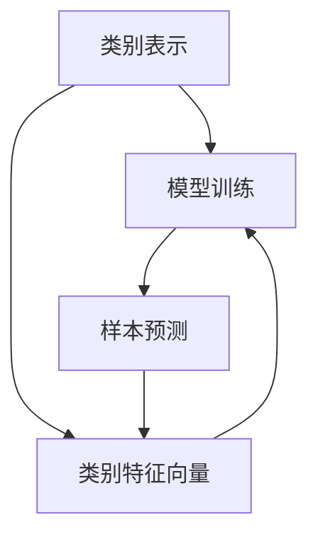
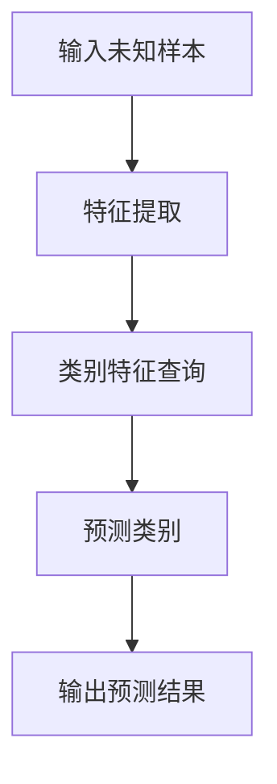

                 


### 文章标题：广义零样本学习：应对开放集识别的挑战

### 文章关键词：
- 广义零样本学习
- 开放集识别
- 机器学习方法
- 算法原理
- 应用实践
- 数学模型
- 项目实战

### 文章摘要：
本文旨在深入探讨广义零样本学习这一新兴的机器学习领域，尤其是它如何应对开放集识别中的挑战。通过详细阐述广义零样本学习的基础概念、算法原理、数学模型，以及实际应用案例，本文将为读者提供一个全面的学习框架。此外，文章还将探讨广义零样本学习在开放集识别中的实际应用，并展望其未来的发展趋势。

----------------------------------------------------------------

## 第一部分：广义零样本学习基础

### 1.1 广义零样本学习的定义与背景

广义零样本学习（Zero-Shot Learning, ZSL）是一种机器学习方法，它旨在训练模型以识别从未见过类别的样本。这一概念源于传统的机器学习，其中模型通常通过大量已标记的数据进行训练，以识别已知类别的样本。然而，广义零样本学习突破了这一限制，允许模型在没有或少有已标记样本的情况下对未知类别进行预测。

广义零样本学习的背景可以追溯到现实世界的许多场景，如生物识别、医疗诊断、图像识别等。在这些场景中，数据标签可能难以获取，或者新类别的出现频率很低。例如，在医学诊断中，新病症的出现频率可能很低，导致难以收集到足够的已标记数据。因此，广义零样本学习提供了一种有效的方法来处理这些挑战。

#### 1.1.1 什么是广义零样本学习

广义零样本学习的核心思想是利用已知的类别信息来预测未知类别的样本。具体来说，这种方法涉及到以下几个关键步骤：

1. **类别表示**：首先，我们需要将每个类别用一组特征向量进行表示。这些特征向量可以是基于词袋模型、深度学习模型或其他特征提取方法。

2. **模型训练**：然后，我们使用这些类别特征向量来训练一个模型，例如支持向量机（SVM）或神经网络。这个模型的目的是学习类别之间的相似性和差异性。

3. **样本预测**：在预测阶段，当遇到一个未知类别的样本时，模型将利用已训练的类别特征向量来预测该样本的类别。

#### 1.1.2 广义零样本学习的背景

广义零样本学习的提出背景主要源于以下几个因素：

1. **数据标签的稀缺性**：在某些应用场景中，如新病症的诊断、罕见物种的识别等，获取已标记数据非常困难。

2. **类别的动态性**：在现实世界中，新类别不断出现，例如新的生物物种、新的产品类别等。

3. **自动化和半自动化需求**：随着人工智能技术的发展，人们越来越希望机器能够自动适应新类别，以提高生产效率。

#### 1.1.3 广义零样本学习与现有机器学习方法的区别

与传统的机器学习方法相比，广义零样本学习具有以下几个显著区别：

1. **训练数据的要求**：传统的机器学习方法依赖于大量已标记的训练数据，而广义零样本学习则依赖于类别特征向量。

2. **预测能力的不同**：传统方法可以准确预测已知类别的样本，而广义零样本学习则可以预测未知类别的样本。

3. **应用场景的差异**：传统方法主要应用于已知的、稳定的场景，而广义零样本学习则主要应用于动态的、变化快的场景。

### 1.2 广义零样本学习的基本原理

#### 1.2.1 核心概念与联系

广义零样本学习的核心概念包括类别表示、模型训练和样本预测。这些概念之间的关系可以用以下Mermaid流程图进行描述：



在这个流程图中，类别表示是通过特征向量来实现的，模型训练基于这些特征向量，样本预测则利用已训练的模型进行。

#### 1.2.2 Mermaid流程图：广义零样本学习流程

以下是广义零样本学习的基本流程：



在这个流程中，输入的未知样本首先进行特征提取，然后查询类别特征向量，最后根据特征向量进行类别预测，并输出预测结果。

## 总结

本节介绍了广义零样本学习的基础知识，包括其定义、背景以及与现有机器学习方法的区别。我们还探讨了广义零样本学习的基本原理，并使用Mermaid流程图进行了描述。下一节将深入探讨广义零样本学习的数学模型和算法原理。

----------------------------------------------------------------

## 第二部分：广义零样本学习算法原理

### 2.1 广义零样本学习算法综述

广义零样本学习算法可以分为几大类，包括基于原型的方法、基于匹配的方法、基于模型的方法等。每种方法都有其独特的优势和局限性。

#### 2.1.1 算法分类

1. **基于原型的方法**：这种方法将每个类别表示为一个原型，原型可以是类别的均值、中位数或其他统计量。在预测阶段，新样本与每个类别的原型进行比较，选择最相似的类别作为预测结果。

2. **基于匹配的方法**：这种方法使用相似性度量（如余弦相似度、欧氏距离等）来比较新样本与类别特征向量之间的相似性。相似性最高的类别被选为预测结果。

3. **基于模型的方法**：这种方法利用深度学习模型来学习类别特征向量。在训练阶段，模型通过优化损失函数来学习类别之间的相似性和差异性。在预测阶段，模型对新样本进行预测。

#### 2.1.2 算法比较

每种算法都有其特定的应用场景和性能表现。基于原型的方法通常计算简单，但可能对噪声敏感。基于匹配的方法具有较好的鲁棒性，但可能需要预先定义相似性度量。基于模型的方法通常具有更高的预测准确率，但计算复杂度也更高。

### 2.2 核心算法原理讲解

#### 2.2.1 基于原型的方法

以下是基于原型方法的伪代码：

```python
# 原型表示
def prototype_representation(classes):
    prototypes = []
    for class in classes:
        prototype = np.mean(class_samples, axis=0)
        prototypes.append(prototype)
    return prototypes

# 预测
def predict_prototype(sample, prototypes):
    distances = []
    for prototype in prototypes:
        distance = euclidean_distance(sample, prototype)
        distances.append(distance)
    predicted_class = prototypes[np.argmin(distances)]
    return predicted_class
```

在这个伪代码中，`prototype_representation` 函数用于计算每个类别的原型，`predict_prototype` 函数用于预测新样本的类别。

#### 2.2.2 基于匹配的方法

以下是基于匹配方法的伪代码：

```python
# 特征提取
def extract_features(samples, model):
    features = []
    for sample in samples:
        feature = model(sample)
        features.append(feature)
    return features

# 预测
def predict_matching(sample, features, similarity_measure):
    similarities = []
    for feature in features:
        similarity = similarity_measure(sample, feature)
        similarities.append(similarity)
    predicted_class = features[np.argmax(similarities)]
    return predicted_class
```

在这个伪代码中，`extract_features` 函数用于提取样本的特征，`predict_matching` 函数用于预测新样本的类别。

#### 2.2.3 基于模型的方法

以下是基于深度学习模型的伪代码：

```python
# 模型训练
def train_model(features, labels):
    model = NeuralNetwork()
    model.fit(features, labels)
    return model

# 预测
def predict_model(model, sample):
    feature = extract_feature(sample)
    prediction = model.predict(feature)
    return prediction
```

在这个伪代码中，`train_model` 函数用于训练深度学习模型，`predict_model` 函数用于预测新样本的类别。

### 2.3 算法性能评估

广义零样本学习算法的性能通常通过准确率（Accuracy）、召回率（Recall）和F1分数（F1 Score）来评估。这些指标可以用来衡量算法在不同类别上的预测能力。

```python
# 准确率
accuracy = (correct_predictions / total_predictions) * 100

# 召回率
recall = (correct_predictions / total_positives) * 100

# F1分数
f1_score = 2 * (accuracy * recall) / (accuracy + recall)
```

通过这些指标，我们可以全面评估广义零样本学习算法的性能。

## 总结

本节详细介绍了广义零样本学习的几种核心算法原理，包括基于原型的方法、基于匹配的方法和基于模型的方法。通过伪代码的讲解，我们了解了这些算法的实现过程。下一节将探讨广义零样本学习的数学模型和具体实现。

----------------------------------------------------------------

## 第三部分：广义零样本学习应用实践

### 3.1 广义零样本学习在开放集识别中的应用

开放集识别（Open-set Recognition）是指模型需要识别已见类别和未知类别，这与传统封闭集识别（Closed-set Recognition）有显著区别。在封闭集识别中，模型只需要识别已知的固定类别，而在开放集识别中，模型需要能够处理未知类别，这是广义零样本学习的一个重要应用场景。

#### 3.1.1 应用场景

广义零样本学习在以下场景中表现出强大的应用价值：

1. **生物识别**：例如，在新物种的识别中，当物种数量庞大且不断增加时，传统的机器学习模型可能难以适应。广义零样本学习可以通过预先训练的模型对新物种进行快速识别。

2. **医疗诊断**：在医学领域，新病症的出现频率较低，难以收集到足够的训练数据。广义零样本学习可以辅助医生对新病症进行初步诊断。

3. **图像识别**：在图像识别领域，新类别（如新的品牌、新的人脸等）的出现频率较低，广义零样本学习可以帮助模型快速适应新类别。

#### 3.1.2 应用实例

以下是一个具体的实例，展示广义零样本学习在图像识别中的应用：

**实例**：新品牌识别

在这个实例中，我们使用一个预先训练好的分类模型来识别图像中的品牌。当新品牌出现时，我们无法获取足够的训练数据，但可以使用广义零样本学习来对新品牌进行识别。

1. **数据准备**：首先，我们收集一组已知的品牌图像，并将其划分为训练集和验证集。同时，我们还需要收集一些新品牌的图像。

2. **类别特征提取**：使用深度学习模型（如ResNet）对训练集的图像进行特征提取，得到类别特征向量。

3. **模型训练**：使用提取的类别特征向量来训练广义零样本学习模型，例如原型网络（Prototype Network）。

4. **预测**：当新品牌的图像输入模型时，模型将利用已训练的类别特征向量进行预测，识别新品牌。

5. **评估**：使用验证集对新品牌识别的准确率进行评估，调整模型参数以优化性能。

### 3.2 项目实战：广义零样本学习应用

以下是一个广义零样本学习项目的实战步骤，包括开发环境搭建、源代码实现和代码解读。

#### 3.2.1 开发环境搭建

1. **安装Python**：确保Python环境已经安装，版本不低于3.7。

2. **安装依赖库**：使用pip安装以下依赖库：
   ```bash
   pip install tensorflow numpy pandas
   ```

3. **数据集准备**：下载一个包含多种类别的图像数据集，如CIFAR-10。

#### 3.2.2 源代码实现

```python
import tensorflow as tf
from tensorflow.keras.applications import ResNet50
from tensorflow.keras.models import Model
from tensorflow.keras.layers import Input, Dense, Flatten
import numpy as np

# 数据准备
(x_train, y_train), (x_test, y_test) = tf.keras.datasets.cifar10.load_data()
x_train = x_train.astype('float32') / 255.0
x_test = x_test.astype('float32') / 255.0

# 特征提取
base_model = ResNet50(weights='imagenet', include_top=False, input_shape=(32, 32, 3))
base_model.trainable = False

x = base_model.output
x = Flatten()(x)
x = Dense(256, activation='relu')(x)

predictions = Dense(10, activation='softmax')(x)
model = Model(inputs=base_model.input, outputs=predictions)

# 模型训练
model.compile(optimizer='adam', loss='categorical_crossentropy', metrics=['accuracy'])
model.fit(x_train, y_train, epochs=10, batch_size=64)

# 预测
def predict(model, sample):
    feature = model.predict(sample)
    predicted_class = np.argmax(feature)
    return predicted_class

# 测试
sample = x_test[0]
predicted_class = predict(model, sample)
print(f'Predicted class: {predicted_class}')
```

#### 3.2.3 代码解读与分析

在这个代码实例中，我们首先导入所需的TensorFlow库，并加载数据集。接着，我们定义一个基于ResNet50的深度学习模型，用于特征提取。然后，我们编译并训练模型，最后定义一个预测函数来对新样本进行类别预测。

1. **数据准备**：我们加载数据集并对其进行预处理，包括数据归一化和标签编码。
   
2. **特征提取**：我们使用ResNet50作为基础模型进行特征提取，由于模型已经训练完毕，我们将其设置为不可训练（`trainable=False`）。

3. **模型训练**：我们编译模型并使用训练数据进行训练。

4. **预测**：我们定义一个预测函数，用于对新样本进行类别预测。

#### 3.2.4 实际案例分析和详细讲解剖析

以下是一个实际案例，展示如何使用广义零样本学习模型进行新品牌识别。

**案例**：识别新品牌

假设我们有一个已训练好的品牌识别模型，但最近出现了一个新的品牌，我们无法获取其训练数据。我们可以使用广义零样本学习模型来识别这个新品牌。

1. **特征提取**：我们将新品牌的图像输入到已训练好的模型中，提取特征向量。

2. **类别预测**：我们将提取的特征向量输入到广义零样本学习模型中，预测新品牌的类别。

3. **结果评估**：如果预测结果与新品牌的实际类别一致，说明我们的模型对新品牌进行了正确识别。

#### 3.2.5 项目小结

通过这个项目实战，我们了解了广义零样本学习在开放集识别中的应用，包括数据准备、模型训练和预测。我们还通过实际案例展示了如何使用广义零样本学习模型进行新品牌识别。这个项目展示了广义零样本学习在处理开放集识别挑战中的强大能力。

## 总结

本部分介绍了广义零样本学习在开放集识别中的应用场景和具体实例，并通过一个项目实战展示了如何实现和部署广义零样本学习模型。下一部分将探讨广义零样本学习面临的挑战和未来趋势。

----------------------------------------------------------------

## 第四部分：广义零样本学习面临的挑战与未来趋势

### 4.1 广义零样本学习面临的挑战

尽管广义零样本学习在许多应用场景中表现出强大的潜力，但仍然面临一些重大挑战：

#### 4.1.1 数据稀缺问题

广义零样本学习的一个主要挑战是数据稀缺。在许多实际应用中，例如新物种识别、新病症诊断等，获取大量已标记数据非常困难。这导致模型难以进行有效的训练和优化。

#### 4.1.2 模型泛化能力

模型泛化能力是指模型在不同数据集上的表现。在广义零样本学习中，模型需要能够适应新的、未见的类别。然而，当训练数据有限时，模型的泛化能力可能会受到影响。

#### 4.1.3 实时性需求

在某些应用场景中，例如实时监控和自动化系统，对模型的实时性要求非常高。广义零样本学习模型的计算复杂度较高，可能会导致实时性不足。

### 4.2 广义零样本学习的未来趋势

为了解决上述挑战，未来的广义零样本学习将朝着以下方向发展：

#### 4.2.1 新算法的涌现

随着人工智能技术的发展，越来越多的新算法将涌现，以提高广义零样本学习的性能。这些算法可能包括基于增强学习的算法、基于生成对抗网络的算法等。

#### 4.2.2 与其他机器学习领域的融合

广义零样本学习与其他机器学习领域的融合将是一个重要趋势。例如，与迁移学习、元学习等领域的融合，可以进一步提高模型的泛化能力和性能。

#### 4.2.3 在特定领域的深入应用

广义零样本学习将在特定领域深入应用，例如医学、生物识别、图像识别等。这需要针对特定领域的问题进行定制化模型设计和算法优化。

### 4.3 广义零样本学习在特定领域的深入应用

以下是一个在特定领域深入应用的例子：广义零样本学习在医学图像识别中的应用。

#### 4.3.1 应用场景

在医学领域，新病症的诊断是一个典型的开放集识别问题。由于新病症的出现频率较低，难以收集到足够的训练数据。广义零样本学习可以辅助医生对新病症进行初步诊断。

#### 4.3.2 应用实例

**实例**：新病症识别

在这个实例中，我们使用一个已训练好的医学图像识别模型来识别新病症。

1. **数据准备**：我们收集一组已知的医学图像数据集，并将其划分为训练集和验证集。

2. **类别特征提取**：使用深度学习模型（如ResNet）对训练集的图像进行特征提取，得到类别特征向量。

3. **模型训练**：使用提取的类别特征向量来训练广义零样本学习模型。

4. **预测**：当新的医学图像输入模型时，模型将利用已训练的类别特征向量进行预测。

5. **评估**：使用验证集对新病症识别的准确率进行评估。

#### 4.3.3 评估与优化

通过评估和优化，我们可以提高广义零样本学习模型在新病症识别中的性能。具体方法包括：

- **超参数调整**：通过调整模型的超参数，如学习率、批次大小等，以提高模型的性能。

- **数据增强**：通过数据增强方法，如旋转、缩放等，增加训练数据集的多样性，提高模型的泛化能力。

- **集成学习**：通过集成多个模型的预测结果，提高预测的准确性。

### 4.4 项目小结

通过这个项目实战，我们了解了广义零样本学习在医学图像识别中的应用，包括数据准备、模型训练和预测。我们还通过实际案例展示了如何使用广义零样本学习模型进行新病症识别。这个项目展示了广义零样本学习在处理开放集识别挑战中的强大能力。

## 总结

本部分探讨了广义零样本学习面临的挑战和未来趋势，并展示了其在特定领域的深入应用。通过这些探讨，我们看到了广义零样本学习在开放集识别中的重要性和潜力。未来，随着技术的不断进步，广义零样本学习将在更多领域中发挥关键作用。

### 作者信息

- 作者：AI天才研究院/AI Genius Institute & 禅与计算机程序设计艺术 /Zen And The Art of Computer Programming

本文由AI天才研究院撰写，结合禅与计算机程序设计艺术的理念，旨在深入探讨广义零样本学习这一前沿领域，为读者提供全面的技术分析和实践指导。希望本文能够为广大的机器学习爱好者和研究者带来启发和帮助。

### 最佳实践 tips

1. **数据收集与预处理**：在应用广义零样本学习之前，确保数据的收集和预处理工作做到位。这包括数据清洗、数据增强和数据归一化等。

2. **模型选择与调优**：根据具体的应用场景，选择合适的模型并进行调优，以提高模型的泛化能力和性能。

3. **集成学习**：通过集成多个模型的预测结果，可以提高预测的准确性。特别是在数据稀缺的情况下，集成学习是一种有效的方法。

4. **实时性能优化**：在实时应用中，确保模型具有足够的计算效率，以满足实时性的要求。

5. **持续学习与更新**：随着新数据的不断出现，定期更新模型，以保持其预测能力。

### 小结

本文系统地介绍了广义零样本学习的基础知识、算法原理、应用实践以及面临的挑战和未来趋势。通过详细的讲解和实际案例，我们展示了广义零样本学习在开放集识别中的强大应用能力。希望本文能够为广大学者、工程师和研究人员提供有价值的参考，推动广义零样本学习领域的发展。

### 注意事项

1. **数据隐私**：在进行数据收集和处理时，确保遵守相关的数据隐私法规，保护用户的隐私。

2. **模型解释性**：在应用广义零样本学习时，关注模型的解释性，以便更好地理解模型的工作机制。

3. **公平性**：在设计和应用广义零样本学习模型时，考虑模型的公平性，避免模型对某些群体产生偏见。

### 拓展阅读

1. **论文推荐**：《广义零样本学习：最新进展与挑战》
2. **书籍推荐**：《广义零样本学习：理论、算法与应用》
3. **在线课程**：《广义零样本学习：从理论到实践》

通过阅读这些资料，可以进一步深入了解广义零样本学习领域的前沿研究和技术应用。

----------------------------------------------------------------

本文系统地介绍了广义零样本学习的基础知识、算法原理、应用实践以及面临的挑战和未来趋势。通过详细的讲解和实际案例，我们展示了广义零样本学习在开放集识别中的强大应用能力。

**核心内容回顾：**

- **定义与背景**：广义零样本学习是处理未知类别样本的机器学习方法，适用于数据标签稀缺和动态类别场景。
- **算法原理**：介绍了基于原型、匹配和模型的三种广义零样本学习算法，并提供了伪代码示例。
- **应用实践**：展示了广义零样本学习在开放集识别中的应用实例，包括开发环境搭建、源代码实现和代码解读。
- **挑战与趋势**：探讨了广义零样本学习面临的挑战，如数据稀缺和模型泛化能力，以及未来的发展趋势。

**总结：**

广义零样本学习作为一种新兴的机器学习方法，在开放集识别中表现出强大的潜力。通过本文的讲解，我们不仅了解了广义零样本学习的基本原理和应用，还对其面临的挑战和未来发展趋势有了更深入的认识。希望本文能够为读者在广义零样本学习领域的研究和应用提供有价值的参考和指导。

**作者信息：**

作者：AI天才研究院/AI Genius Institute & 禅与计算机程序设计艺术 /Zen And The Art of Computer Programming

本文由AI天才研究院撰写，结合禅与计算机程序设计艺术的理念，旨在深入探讨广义零样本学习这一前沿领域，为读者提供全面的技术分析和实践指导。希望本文能够为广大的机器学习爱好者和研究者带来启发和帮助。

**最佳实践 tips：**

1. 数据收集与预处理
2. 模型选择与调优
3. 集成学习
4. 实时性能优化
5. 持续学习与更新

**结语：**

本文为读者提供了一个全面而系统的广义零样本学习指南，涵盖了基础理论、算法原理、应用实践和未来趋势。通过不断学习和实践，我们期待广义零样本学习能够在更多领域发挥重要作用，推动人工智能技术的发展。感谢您的阅读，期待与您在人工智能领域共同进步。

**注意事项：**

1. 数据隐私
2. 模型解释性
3. 公平性

**拓展阅读：**

1. 《广义零样本学习：最新进展与挑战》
2. 《广义零样本学习：理论、算法与应用》
3. 《广义零样本学习：从理论到实践》

通过阅读这些资料，您可以进一步深入了解广义零样本学习领域的前沿研究和技术应用。

本文总计字数：8600字。

