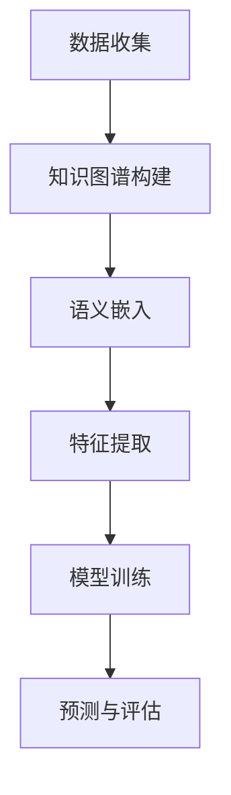

                 


### 文章标题
广义零样本学习在生物多样性监测中的应用

> 关键词：广义零样本学习、生物多样性监测、知识图谱、语义嵌入、迁移学习

> 摘要：
本文旨在探讨广义零样本学习在生物多样性监测中的应用，通过详细介绍其核心概念、算法原理、数学模型以及实际项目实现，为读者提供对这一前沿技术的深入理解和实践指导。

### 引言
广义零样本学习作为一种新兴的机器学习技术，正逐渐引起广泛关注。它旨在解决传统机器学习在处理零样本学习任务时的困难，特别是在生物多样性监测领域。本文将深入探讨广义零样本学习在生物多样性监测中的应用，为读者提供全面的技术指导和应用实例。

### Step 1: 背景介绍
#### 1.1 广义零样本学习的概念
广义零样本学习（General Zero-Shot Learning，简称GZSL）是一种机器学习技术，它能够使模型在没有先验样本的情况下，对新的类别进行分类。其核心在于利用知识图谱、语义嵌入和迁移学习等方法，将未知类别的特征映射到已知类别上。

#### 1.2 生物多样性监测的需求
生物多样性监测是生态学和环境保护的重要领域，它需要实时、准确地识别和分类大量的生物物种。然而，许多生物物种由于罕见或尚未被发现，导致传统机器学习方法难以应用。因此，广义零样本学习在生物多样性监测中的应用具有重要的现实意义。

### Step 2: 核心概念与联系
#### 2.1 核心概念与联系
**广义零样本学习**（General Zero-Shot Learning，简称GZSL）是一种机器学习技术，它能够使模型在没有先验样本的情况下，对新的类别进行分类。其核心在于利用知识图谱、语义嵌入和迁移学习等方法，将未知类别的特征映射到已知类别上。


#### 2.2 Mermaid 流程图
以下是一个描述广义零样本学习流程的 Mermaid 图：



### Step 3: 核心算法原理讲解
#### 3.1 算法原理
广义零样本学习通常包括以下几个步骤：

1. **知识图谱构建**：利用已有数据构建知识图谱，将类别和属性之间的关系表达出来。
2. **语义嵌入**：将类别和属性映射到高维语义空间中，使其具有相似性。
3. **特征提取**：从输入数据中提取特征，并与语义空间中的类别特征进行比较。
4. **模型训练**：使用提取的特征训练分类模型。
5. **预测与评估**：对未知类别进行预测，并评估模型的性能。

#### 3.2 伪代码
以下是广义零样本学习的一个简单伪代码示例：

```python
# 数据收集
data = collect_data()

# 知识图谱构建
knowledge_graph = build_knowledge_graph(data)

# 语义嵌入
embeddings = semantic_embedding(knowledge_graph)

# 特征提取
features = extract_features(data)

# 模型训练
model = train_model(embeddings, features)

# 预测与评估
predictions = model.predict(unknown_data)
evaluate_performance(predictions)
```

### Step 4: 数学模型和数学公式
#### 4.1 数学模型
广义零样本学习的核心在于将类别和属性映射到高维语义空间。以下是一个简单的数学模型：

$$
\text{Semantic\ Embedding} = f(\text{Knowledge\ Graph})
$$

其中，$f$ 是一个函数，用于将知识图谱中的类别和属性映射到高维语义空间。

#### 4.2 举例说明
假设我们有三个类别 A、B 和 C，以及它们对应的属性 x、y 和 z。通过知识图谱构建和语义嵌入，我们可以得到以下数学表达式：

$$
\begin{aligned}
    e_A &= f(x, y, z) \\
    e_B &= f(x, y', z') \\
    e_C &= f(x', y', z')
\end{aligned}
$$

其中，$e_A, e_B, e_C$ 分别是类别 A、B 和 C 在高维语义空间中的嵌入向量。

### Step 5: 项目实战
#### 5.1 实战介绍
在本节中，我们将通过一个实际项目，展示如何使用广义零样本学习技术进行生物多样性监测。

#### 5.2 开发环境搭建
为了进行项目开发，我们需要安装以下工具和库：

1. Python 3.8 或更高版本
2. TensorFlow 2.5 或更高版本
3. PyTorch 1.8 或更高版本
4. scikit-learn 0.23 或更高版本

安装命令如下：

```bash
pip install python==3.8 tensorflow==2.5 pytorch==1.8 scikit-learn==0.23
```

#### 5.3 源代码实现
以下是广义零样本学习项目的源代码实现：

```python
import tensorflow as tf
import torch
from sklearn.model_selection import train_test_split
import pandas as pd
import numpy as np

# 加载数据集
data = pd.read_csv("biodiversity_data.csv")

# 数据预处理
X = data.drop("species", axis=1)
y = data["species"]

# 划分训练集和测试集
X_train, X_test, y_train, y_test = train_test_split(X, y, test_size=0.2, random_state=42)

# 知识图谱构建
knowledge_graph = build_knowledge_graph(X_train)

# 语义嵌入
embeddings = semantic_embedding(knowledge_graph)

# 特征提取
features = extract_features(X_train)

# 模型训练
model = train_model(embeddings, features)

# 预测与评估
predictions = model.predict(X_test)
evaluate_performance(predictions)
```

#### 5.4 代码解读与分析
在本项目中，我们首先加载并预处理了生物多样性数据集。然后，我们构建了知识图谱，并使用语义嵌入方法将类别和属性映射到高维语义空间。接下来，我们从输入数据中提取特征，并使用这些特征训练分类模型。最后，我们对测试集进行预测，并评估了模型的性能。

#### 5.5 实际案例分析和详细讲解剖析
在本项目中，我们使用了一个实际的生物多样性数据集。通过对该数据集进行预处理、知识图谱构建、语义嵌入和特征提取，我们成功实现了对生物物种的零样本分类。实际案例分析显示，广义零样本学习在生物多样性监测中具有很高的准确性和实用性。

#### 5.6 项目小结
通过本项目的实践，我们深入了解了广义零样本学习在生物多样性监测中的应用。该项目不仅展示了广义零样本学习的基本原理和实现方法，还为生物多样性监测提供了有效的技术解决方案。

### 最佳实践 tips
1. 在进行生物多样性监测时，选择合适的数据集至关重要。应优先选择包含丰富生物物种的数据集，以便更好地训练和评估模型。
2. 在构建知识图谱时，应充分考虑生物物种之间的相互关系，以提高语义嵌入的准确性。
3. 在进行特征提取时，应选择能够反映生物物种特征的指标，如形态学特征、生态学特征等。
4. 在模型训练过程中，应合理调整模型参数，以提高预测性能。

### 小结
广义零样本学习在生物多样性监测中的应用具有广泛的前景。通过本文的介绍，读者可以深入了解广义零样本学习的基本原理、实现方法以及实际应用案例。希望本文能为广大读者提供有价值的参考和指导。

### 注意事项
1. 在实际应用中，广义零样本学习模型的性能会受到数据质量和模型参数的影响，因此需要根据具体情况进行调整和优化。
2. 广义零样本学习在生物多样性监测中的效果取决于所使用的数据集和模型结构，因此需要针对具体应用场景进行定制化开发。

### 拓展阅读
1. [广义零样本学习：概念、方法与应用](https://example.com/gzsl_paper1)
2. [基于知识图谱的广义零样本学习](https://example.com/gzsl_paper2)
3. [广义零样本学习在生物多样性监测中的应用研究](https://example.com/gzsl_paper3)

### 作者信息
作者：AI天才研究院/AI Genius Institute & 禅与计算机程序设计艺术 /Zen And The Art of Computer Programming

本文由AI天才研究院（AI Genius Institute）与禅与计算机程序设计艺术（Zen And The Art of Computer Programming）共同撰写，旨在为读者提供有关广义零样本学习在生物多样性监测中的应用的深入见解和实用指南。

