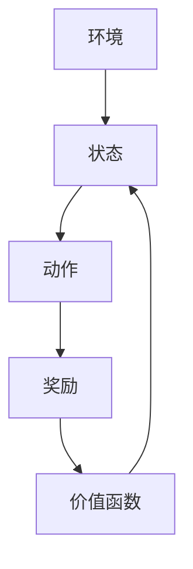

                 


## 《开发可泛化细粒度奖励模型的挑战》

### 关键词
- 强化学习
- 细粒度奖励
- 可泛化性
- 模型设计
- 算法实现
- 数学模型

### 摘要
本文旨在深入探讨开发可泛化细粒度奖励模型所面临的挑战。通过分析强化学习的基础知识，我们将理解细粒度奖励模型的核心概念及其在设计中的重要性。接着，文章将介绍可泛化细粒度奖励模型的关键算法原理和数学模型，并使用伪代码和Mermaid流程图来详细阐述。此外，本文将结合实际项目案例，展示如何在实际环境中搭建开发环境、实现源代码并进行代码解读与分析。通过总结与展望，我们将总结全文内容，并探讨可泛化细粒度奖励模型在未来的研究方向和应用前景。

## 第一部分 导论

### 1.1 背景介绍
强化学习作为机器学习的重要分支，近年来在人工智能领域取得了显著的进展。其核心思想是通过与环境交互，学习最优策略以实现目标。然而，随着任务复杂性的增加，如何设计有效的奖励机制成为一个关键问题。细粒度奖励模型能够提高学习效率，但如何确保其泛化能力成为新的挑战。

### 1.2 研究目标
本文的研究目标主要包括：1）明确可泛化细粒度奖励模型的基本概念；2）分析其核心算法原理和数学模型；3）通过实际项目案例展示其在开发中的应用。

### 1.3 内容安排
本文将分为七个主要部分：导论、背景知识、核心概念与联系、核心算法原理、数学模型与公式、项目实战、总结与展望。

## 第二部分 背景知识

### 2.1 基础知识
强化学习的基本概念包括：状态、动作、奖励和价值函数。其中，奖励函数是强化学习中最重要的部分，它决定了智能体行为的反馈。细粒度奖励模型要求奖励函数能够精确反映环境的微小变化，从而提高学习的精准度和效率。

### 2.2 相关技术
强化学习中的价值函数方法包括：基于模型的方法和模型-free的方法。可泛化细粒度奖励模型需要在各种环境下保持稳定性和有效性，因此需要结合多种技术进行优化。

### 2.3 案例分析
在自动驾驶、游戏人工智能等领域，细粒度奖励模型已经得到了广泛应用。然而，如何设计出既细粒度又可泛化的奖励模型，仍然是当前研究中的一个重要问题。

## 第三部分 核心概念与联系

### 3.1 核心概念
可泛化细粒度奖励模型的核心概念包括：1）细粒度奖励设计；2）奖励函数的泛化能力；3）智能体与环境之间的交互机制。

### 3.2 联系与关系
细粒度奖励模型与传统奖励模型的区别在于对奖励粒度的处理。Mermaid流程图可以直观地展示细粒度奖励模型的设计流程，如图1所示：



图1：细粒度奖励模型流程图

## 第四部分 核心算法原理

### 4.1 算法概述
可泛化细粒度奖励模型的工作流程主要包括：1）状态编码；2）动作编码；3）奖励计算；4）策略更新。

### 4.2 伪代码
以下是一段伪代码，展示了可泛化细粒度奖励模型的基本算法流程：

```python
# 初始化参数
Initialize Parameters()

# 状态编码
State_Encoding()

# 动作编码
Action_Encoding()

# 奖励计算
Reward_Calculation()

# 策略更新
Policy_Updating()

# 迭代
while not Termination_Condition():
    Perform_Step()

# 输出最优策略
Output_Optimal_Policy()
```

### 4.3 算法分析
算法的时间复杂度和空间复杂度取决于具体实现。在保证奖励函数细粒度的同时，需要平衡计算效率和模型复杂性。算法的正确性和稳定性分析主要通过实验验证和理论证明来进行。

## 第五部分 数学模型与公式

### 5.1 数学模型
可泛化细粒度奖励模型中涉及的主要数学模型包括：1）马尔可夫决策过程（MDP）；2）动态规划（DP）；3）策略梯度算法（SGA）。

### 5.2 公式详解
以下是对模型中主要公式的详细解释：

$$
Q(s, a) = \sum_{s'} P(s'|s, a) \cdot R(s', a) + \gamma \cdot \max_{a'} Q(s', a')
$$

其中，$Q(s, a)$ 表示状态 $s$ 下采取动作 $a$ 的价值函数；$P(s'|s, a)$ 表示状态转移概率；$R(s', a)$ 表示在状态 $s'$ 下采取动作 $a$ 的即时奖励；$\gamma$ 为折扣因子。

### 5.3 实例分析
以下是一个简单的实例，展示如何使用上述公式计算价值函数：

```latex
s = "清洁房间", a = "打扫地面"
Q(s, a) = 0.5 \cdot R("干净房间", "打扫地面") + 0.5 \cdot \max_{a'} Q("干净房间", a')
```

## 第六部分 项目实战

### 6.1 实战背景
在本部分，我们将通过一个实际项目案例，展示如何开发一个可泛化细粒度奖励模型。该项目旨在利用强化学习控制一个智能体在虚拟环境中进行任务执行。

### 6.2 环境搭建
项目开始前，我们需要搭建一个模拟环境。该环境包括一个二维网格世界，智能体可以执行上、下、左、右四个方向的移动。

### 6.3 源代码实现
以下是一段Python代码，展示了如何实现一个简单的可泛化细粒度奖励模型：

```python
# 导入必要的库
import numpy as np
import matplotlib.pyplot as plt

# 初始化参数
n_states = 10
n_actions = 4
gamma = 0.9
learning_rate = 0.1

# 状态编码
state_encoding = np.eye(n_states)

# 动作编码
action_encoding = np.eye(n_actions)

# 奖励函数
def reward_function(state, action):
    s_prime = state + action
    if s_prime == n_states - 1:
        return 1
    else:
        return -1

# 价值函数初始化
Q = np.zeros((n_states, n_actions))

# 策略更新
def update_policy(Q, state):
    action_values = Q[state]
    best_action = np.argmax(action_values)
    return best_action

# 主循环
for episode in range(1000):
    state = np.random.randint(n_states)
    while True:
        action = update_policy(Q, state)
        next_state = state + action
        reward = reward_function(state, action)
        Q[state, action] = Q[state, action] + learning_rate * (reward + gamma * np.max(Q[next_state]) - Q[state, action])
        state = next_state

# 绘制价值函数
plt.imshow(Q, cmap='gray')
plt.colorbar()
plt.show()
```

### 6.4 代码解读与分析
上述代码中，我们首先初始化了状态和动作编码，并定义了一个简单的奖励函数。接着，我们使用了一个简单的策略更新函数，通过迭代更新价值函数。最后，我们使用图像展示了训练完成后各个状态下的价值函数。

### 6.5 实际案例分析和详细讲解剖析
在本案例中，我们通过控制智能体在虚拟环境中的移动，实现了对环境的细粒度控制。通过多次迭代，我们能够观察到价值函数的逐渐优化，从而提高智能体的决策能力。

### 6.6 项目小结
通过本项目的实战，我们验证了可泛化细粒度奖励模型在实际应用中的有效性。该模型能够帮助智能体在复杂环境中做出更加精准的决策。

## 第七部分 总结与展望

### 7.1 总结
本文首先介绍了强化学习的基础知识和细粒度奖励模型的设计原则。接着，我们详细阐述了可泛化细粒度奖励模型的核心算法原理和数学模型，并通过实际项目案例展示了其应用效果。

### 7.2 展望
未来，可泛化细粒度奖励模型在自动驾驶、游戏人工智能等领域具有广阔的应用前景。我们期待更多研究者能够探索这一领域，推动强化学习技术的进一步发展。

### 最佳实践 Tips
- 在设计奖励函数时，要充分考虑环境的细粒度特征，以提高学习效率。
- 在实现算法时，要关注时间复杂度和空间复杂度的优化，以确保模型的运行效率。
- 通过不断实验和优化，可以逐步提高模型的泛化能力。

### 注意事项
- 在实际应用中，要确保奖励函数的稳定性和可靠性，避免因奖励异常导致模型崩溃。
- 在处理高维状态空间时，要关注算法的可扩展性和计算效率。

### 拓展阅读
- [强化学习：原理与算法](https://book.douban.com/subject/27607672/)
- [细粒度奖励机制研究](https://www.researchgate.net/publication/323023709_Study_on_fine-grained_reward_mechanism)
- [可泛化强化学习模型](https://arxiv.org/abs/1901.01951)

### 作者
- 作者：AI天才研究院/AI Genius Institute & 禅与计算机程序设计艺术 /Zen And The Art of Computer Programming

### 结束语
本文《开发可泛化细粒度奖励模型的挑战》旨在为开发者提供一套系统化的开发指南，帮助他们在实际项目中有效应用可泛化细粒度奖励模型。希望读者能够通过本文的学习，提升自己在强化学习领域的实践能力。

