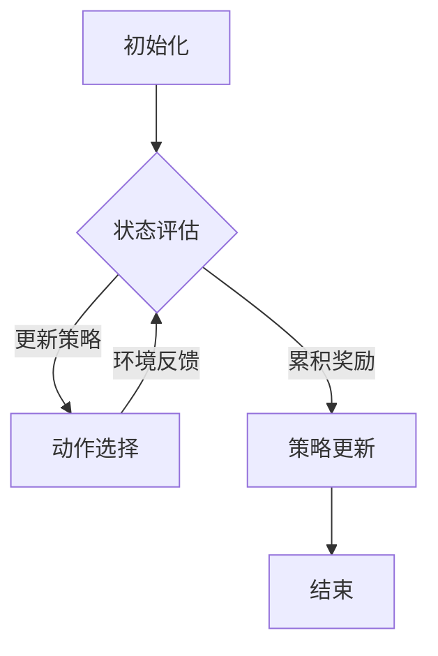
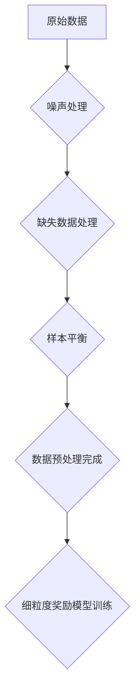

                 

# 开发可泛化细粒度奖励模型的挑战与解决方案

> 关键词：细粒度奖励模型、可泛化性、强化学习、开发挑战、解决方案、案例研究

> 摘要：本文深入探讨了开发可泛化细粒度奖励模型所面临的挑战及其解决方案。通过介绍细粒度奖励模型的基本概念、联系和发展历程，分析了在开发过程中遇到的三大核心挑战：数据质量、可解释性和模型泛化能力。随后，本文详细阐述了相应的解决方案，包括数据预处理、可解释性增强和模型泛化能力提升的方法。通过三个实际案例的研究，本文验证了这些解决方案的有效性，并总结了最佳实践和未来研究方向。

## 引言与背景介绍

### 1.1 引言

随着人工智能技术的发展，强化学习（Reinforcement Learning，RL）在解决复杂决策问题方面展现出了巨大的潜力。强化学习通过智能体（Agent）与环境（Environment）的交互来学习最优策略，旨在最大化累积奖励（Cumulative Reward）。然而，传统的强化学习方法往往在解决实际问题时面临诸多挑战，特别是在面对高维、动态和非结构化的环境时。

为了应对这些挑战，细粒度奖励模型（Fine-Grained Reward Model）应运而生。细粒度奖励模型通过精细地刻画状态与动作之间的奖励关系，提高了智能体的学习效率和决策质量。然而，开发可泛化的细粒度奖励模型并非易事，其中涉及许多技术难题和实际应用挑战。

本书旨在为研究人员和开发者提供关于开发可泛化细粒度奖励模型的全景指导。首先，我们将介绍强化学习的基础知识，并阐述细粒度奖励模型的概念和重要性。然后，我们将探讨当前开发过程中所面临的三大核心挑战，并详细分析相应的解决方案。最后，通过实际案例研究，我们将验证这些解决方案的有效性，并总结最佳实践和未来研究方向。

### 1.2 细粒度奖励模型的概念

细粒度奖励模型是强化学习中的一个重要概念，它通过精确地定义每个状态和动作的奖励值，使智能体能够在更短的时间内找到最优策略。与传统奖励模型相比，细粒度奖励模型具有以下几个特点：

1. **精细化奖励定义**：细粒度奖励模型能够更精细地定义每个状态和动作的奖励值，从而更准确地反映环境状态与动作之间的关联。

2. **高维状态空间**：细粒度奖励模型适用于高维状态空间，能够处理复杂的环境特征。

3. **动态调整能力**：细粒度奖励模型可以根据环境变化动态调整奖励值，从而提高智能体的适应能力。

4. **可解释性**：细粒度奖励模型能够提供更直观的奖励解释，有助于理解智能体的决策过程。

细粒度奖励模型的基本原理是建立在对状态和动作的精确评估基础上的。智能体通过与环境交互，不断更新对状态和动作的评估，从而逐步找到最优策略。这一过程通常涉及以下步骤：

1. **状态评估**：智能体对当前状态进行评估，以确定其重要性。

2. **动作选择**：根据状态评估结果，智能体选择最佳动作。

3. **奖励计算**：执行所选动作后，智能体根据环境反馈计算奖励值。

4. **策略更新**：智能体根据奖励值更新策略，以优化未来的决策。

### 1.3 研究现状与问题

目前，细粒度奖励模型在强化学习领域已取得了一系列重要成果。研究人员提出了多种细粒度奖励模型，如基于价值函数（Value Function）、策略梯度（Policy Gradient）和模型预测控制（Model Predictive Control）等方法。这些模型在一定程度上提高了智能体的学习效率和决策质量。

然而，在实际开发过程中，细粒度奖励模型仍面临诸多挑战。首先，数据质量是影响细粒度奖励模型性能的关键因素。高噪声、缺失数据和样本不平衡等问题都会对模型性能产生不利影响。其次，可解释性是细粒度奖励模型在实际应用中的一个重要问题。虽然细粒度奖励模型能够提供更精确的奖励评估，但如何确保其透明性和可解释性仍需深入研究。最后，模型泛化能力是另一个挑战。细粒度奖励模型在面对未知或变化的环境时，如何保持高水平的泛化能力是一个亟待解决的问题。

针对上述问题，本书将深入探讨细粒度奖励模型在开发过程中所面临的挑战，并提出相应的解决方案。通过理论分析、实验验证和实际案例分析，我们将展示如何有效地解决这些挑战，为开发可泛化的细粒度奖励模型提供有力支持。

## 核心概念与联系

### 2.1 细粒度奖励模型的定义

细粒度奖励模型是强化学习中的一个重要概念，它旨在通过精细刻画状态和动作之间的奖励关系，以提高智能体的学习效率和决策质量。与传统奖励模型不同，细粒度奖励模型更加注重对状态和动作的精确评估。

定义：

细粒度奖励模型是一种用于评估状态和动作之间奖励的模型，它通过精细化地定义每个状态和动作的奖励值，使智能体能够在更短的时间内找到最优策略。具体而言，细粒度奖励模型包含以下几个关键组成部分：

1. **状态空间（State Space）**：状态空间是智能体所在环境的所有可能状态集合。每个状态表示环境的一个特定状态，通常用向量表示。

2. **动作空间（Action Space）**：动作空间是智能体可以执行的所有可能动作集合。每个动作表示智能体在当前状态下可以采取的一个特定动作。

3. **奖励函数（Reward Function）**：奖励函数是用于评估状态和动作之间奖励的函数。它接收状态和动作作为输入，并输出一个实数值作为奖励。奖励函数的精确定义是细粒度奖励模型的核心。

4. **策略（Policy）**：策略是智能体在给定状态下选择动作的策略。策略通常是一个概率分布，表示智能体在不同状态下选择不同动作的概率。

细粒度奖励模型的基本思想是通过精细化地定义奖励函数，使智能体能够更准确地了解环境状态和动作之间的关系，从而优化决策过程。与传统奖励模型相比，细粒度奖励模型具有更高的粒度度和更精细的奖励评估，这使得智能体能够在更短的时间内找到近似最优策略。

### 2.2 细粒度奖励模型与其他模型的比较

细粒度奖励模型与其他强化学习模型相比，具有独特的优势和特点。以下是对其主要特点的比较：

#### 2.2.1 与马尔可夫决策过程（MDP）的比较

马尔可夫决策过程（Markov Decision Process，MDP）是强化学习中最基本的模型之一。MDP模型通过定义状态、动作和奖励来描述智能体与环境之间的交互过程。与MDP模型相比，细粒度奖励模型的主要区别在于其精细化程度。

- **状态粒度**：MDP模型通常采用粗粒度的状态表示，即每个状态表示环境的一个大致状态。而细粒度奖励模型则采用更细粒度的状态表示，即每个状态表示环境的一个具体状态。这有助于提高奖励评估的精确度。
- **动作粒度**：MDP模型通常采用粗粒度的动作表示，即每个动作表示智能体可以采取的一个大致动作。而细粒度奖励模型则采用更细粒度的动作表示，即每个动作表示智能体可以采取的一个具体动作。这有助于提高奖励评估的精确度。
- **奖励评估**：MDP模型通常使用固定奖励值来评估状态和动作之间的奖励关系。而细粒度奖励模型则使用更精细的奖励函数来评估状态和动作之间的奖励关系，从而提高奖励评估的精确度。

#### 2.2.2 与深度强化学习（Deep Reinforcement Learning）的比较

深度强化学习（Deep Reinforcement Learning）是近年来在强化学习领域兴起的一种方法。它结合了深度学习和强化学习，通过神经网络来表示状态和动作之间的映射关系。与深度强化学习相比，细粒度奖励模型具有以下特点：

- **表示能力**：深度强化学习通过神经网络来表示状态和动作之间的映射关系，具有很强的表示能力。而细粒度奖励模型则通过精细化地定义奖励函数来表示状态和动作之间的奖励关系，虽然表示能力较弱，但具有更高的精确度。
- **训练过程**：深度强化学习通常采用策略梯度方法或值函数方法来训练神经网络。而细粒度奖励模型则通过直接优化奖励函数来训练智能体，通常采用梯度下降或其他优化算法。
- **应用范围**：深度强化学习适用于高维、动态和非结构化的环境，而细粒度奖励模型则更适用于相对简单、明确状态和动作空间的问题。

#### 2.2.3 与传统奖励模型的比较

传统奖励模型通常采用粗粒度的状态和动作表示，并使用固定奖励值来评估状态和动作之间的奖励关系。与这些传统奖励模型相比，细粒度奖励模型具有以下优势：

- **精确度**：细粒度奖励模型通过精细化地定义奖励函数，使智能体能够更准确地了解环境状态和动作之间的关系，从而提高决策的精确度。
- **可解释性**：细粒度奖励模型能够提供更直观的奖励解释，有助于理解智能体的决策过程。而传统奖励模型通常缺乏透明性和可解释性。
- **泛化能力**：细粒度奖励模型在面对未知或变化的环境时，能够通过调整奖励函数来保持较高的泛化能力。而传统奖励模型通常在环境变化时表现出较差的泛化能力。

### 2.3 细粒度奖励模型的Mermaid流程图

为了更好地理解细粒度奖励模型的工作流程，我们可以使用Mermaid流程图来展示其关键步骤。以下是细粒度奖励模型的Mermaid流程图：



- **初始化**：智能体初始化状态和策略。
- **状态评估**：智能体对当前状态进行评估，以确定其重要性。
- **动作选择**：根据状态评估结果，智能体选择最佳动作。
- **环境反馈**：执行所选动作后，智能体从环境中获取反馈。
- **累积奖励**：智能体根据环境反馈计算累积奖励。
- **策略更新**：智能体根据累积奖励更新策略，以优化未来的决策。
- **结束**：循环回到状态评估，继续迭代优化。

通过这个Mermaid流程图，我们可以更直观地了解细粒度奖励模型的工作流程和关键步骤。这个流程图有助于我们深入理解细粒度奖励模型的基本原理和实现方法，为后续章节的详细分析奠定基础。

## 开发挑战

### 3.1 数据质量

在开发可泛化细粒度奖励模型的过程中，数据质量是一个至关重要的因素。数据质量的好坏直接影响到模型的性能和可靠性。以下是在开发细粒度奖励模型时可能遇到的数据质量问题：

#### 3.1.1 高噪声数据

噪声数据是指包含大量随机噪声或异常值的数据。在高噪声的数据环境下，细粒度奖励模型可能会被噪声所干扰，导致奖励评估不准确。例如，在自动驾驶场景中，激光雷达数据可能受到雨滴、光照变化等因素的干扰，导致数据质量下降。这种噪声数据会使得模型难以找到真正的状态和动作之间的奖励关系，从而影响学习效果。

#### 3.1.2 缺失数据

缺失数据是指数据集中某些特征或样本值缺失的情况。在细粒度奖励模型中，缺失数据会导致奖励评估的不完整，进而影响模型的学习效果。例如，在某些应用场景中，传感器数据可能会因为故障或传输延迟而出现缺失。这种缺失数据会导致模型无法充分利用全部数据，从而影响模型的泛化能力。

#### 3.1.3 样本不平衡

样本不平衡是指数据集中某些类别或特征的样本数量远多于其他类别或特征的情况。在细粒度奖励模型中，样本不平衡会导致模型对样本数量较多的类别或特征产生过度依赖，从而影响模型的泛化能力。例如，在某些医疗数据集中，疾病A的样本数量远多于疾病B，这会导致模型在预测疾病B时的准确性下降。

#### 3.1.4 数据预处理的重要性

为了解决上述数据质量问题，数据预处理是必不可少的步骤。数据预处理包括去噪、填充缺失数据、平衡样本等操作。以下是一些常见的数据预处理方法：

- **去噪**：通过滤波、平滑等方法去除数据中的噪声，提高数据的纯净度。
- **缺失数据填充**：使用均值、中值、插值等方法填充缺失数据，使得数据更完整。
- **样本平衡**：通过过采样、欠采样或合成样本等方法平衡样本数量，使得模型能够充分利用全部数据。

通过这些数据预处理方法，我们可以有效提高数据质量，从而提升细粒度奖励模型的性能和可靠性。

### 3.2 可解释性

可解释性是细粒度奖励模型在实际应用中的一个关键问题。尽管细粒度奖励模型能够提供精确的奖励评估，但其内部机制往往较为复杂，导致其决策过程缺乏透明性。以下是在开发细粒度奖励模型时可能遇到的关于可解释性的问题：

#### 3.2.1 复杂的模型结构

细粒度奖励模型通常采用复杂的神经网络结构，包括多层感知器（MLP）、卷积神经网络（CNN）等。这些复杂的模型结构使得模型难以解释，因为其内部参数和权重之间的关系较为复杂，难以直观地理解。

#### 3.2.2 非线性的奖励函数

细粒度奖励模型通常采用非线性奖励函数，以更好地适应复杂环境。然而，非线性的奖励函数使得模型难以解释，因为其奖励值的变化无法通过简单的线性关系来描述。

#### 3.2.3 可解释性的重要性

可解释性对于细粒度奖励模型的实际应用至关重要。以下是一些关于可解释性的重要性：

- **监管合规性**：在某些应用领域，如金融和医疗，模型的可解释性是确保监管合规性的关键。监管机构通常要求模型开发者提供详细的决策解释，以便对其决策过程进行监督和审查。
- **用户信任**：用户对模型的信任度与模型的可解释性密切相关。如果模型缺乏透明性，用户可能会对模型的决策产生疑虑，从而影响其接受度和应用范围。
- **模型优化**：通过分析模型的可解释性，开发者可以更好地理解模型的行为和决策过程，从而对其进行优化和改进。

#### 3.2.4 可解释性增强的方法

为了增强细粒度奖励模型的可解释性，可以采用以下几种方法：

- **可视化**：通过可视化模型的结构和参数，使得模型更易于理解。例如，可以使用热力图来展示每个状态和动作的奖励值，从而直观地了解模型的行为。
- **解释性模型**：使用解释性更强的模型，如线性回归、决策树等，来代替复杂的神经网络模型。这些模型通常具有更直观的解释机制，有助于理解模型的决策过程。
- **模型解释工具**：使用现有的模型解释工具，如LIME（Local Interpretable Model-agnostic Explanations）和SHAP（SHapley Additive exPlanations），来对模型进行解释。这些工具能够提供详细的决策解释，帮助用户更好地理解模型的行为。

通过上述方法，我们可以有效提高细粒度奖励模型的可解释性，从而更好地满足实际应用的需求。

### 3.3 模型泛化能力

在开发可泛化的细粒度奖励模型时，模型泛化能力是一个重要的考量因素。泛化能力指的是模型在未知或变化的环境下保持高水平的性能。以下是在开发细粒度奖励模型时可能遇到的关于模型泛化能力的挑战：

#### 3.3.1 数据分布变化

在实际应用中，环境可能会发生显著变化，导致数据分布发生变化。例如，在自动驾驶场景中，天气条件、交通状况和道路状况可能会发生突变，导致数据分布发生变化。如果细粒度奖励模型无法适应这种变化，其性能可能会大幅下降。

#### 3.3.2 小样本学习

细粒度奖励模型通常需要大量的数据进行训练，以便捕捉到环境中的复杂特征。然而，在实际应用中，可能难以获得大量的训练数据。在这种情况下，细粒度奖励模型如何在小样本学习的情况下保持高性能是一个关键问题。

#### 3.3.4 模型泛化能力的重要性

模型泛化能力对于细粒度奖励模型的实际应用至关重要。以下是一些关于模型泛化能力的重要性：

- **适应性**：泛化能力强的模型能够更好地适应不同的环境变化，从而提高模型的适应性。
- **可扩展性**：泛化能力强的模型能够应用到更广泛的应用场景，从而提高模型的可扩展性。
- **可靠性**：泛化能力强的模型在未知或变化的环境下保持高水平的性能，从而提高模型的可靠性。

#### 3.3.5 增强模型泛化能力的方法

为了增强细粒度奖励模型的泛化能力，可以采用以下几种方法：

- **数据增强**：通过数据增强技术，如数据变换、数据扩充等，增加模型的训练样本，从而提高模型的泛化能力。
- **元学习**：使用元学习方法，如模型自适应（Model Adaptation）和模型迁移（Model Transfer），使模型能够在不同的数据分布下保持高性能。
- **模型融合**：通过模型融合方法，如集成学习（Ensemble Learning）和对抗训练（Adversarial Training），提高模型的泛化能力。

通过上述方法，我们可以有效提高细粒度奖励模型的泛化能力，从而更好地适应实际应用中的各种挑战。

### 3.4 复杂性挑战

在开发可泛化的细粒度奖励模型时，复杂性也是一个需要面对的重要挑战。复杂性挑战主要体现在以下几个方面：

#### 3.4.1 模型复杂性

细粒度奖励模型通常涉及复杂的神经网络结构，包括多层感知器（MLP）、卷积神经网络（CNN）等。这些复杂的模型结构使得模型的训练过程变得耗时且计算资源消耗巨大。此外，复杂的模型结构也增加了模型理解和维护的难度。

#### 3.4.2 算法复杂性

细粒度奖励模型的训练通常涉及复杂的优化算法，如梯度下降（Gradient Descent）、Adam优化器等。这些优化算法的计算复杂度较高，使得模型的训练时间较长。此外，复杂的算法也增加了模型理解和优化过程的难度。

#### 3.4.3 系统复杂性

在现实应用中，细粒度奖励模型通常与其他系统组件（如传感器、执行器等）相互作用。这些系统组件的复杂性可能导致模型在实际应用中遇到不可预测的问题，从而影响模型的性能。

#### 3.4.4 复杂性挑战的重要性

复杂性挑战对于细粒度奖励模型的实际应用具有重要意义。以下是一些关于复杂性挑战的重要性：

- **可扩展性**：复杂性挑战会影响模型的可扩展性，使得模型难以应用到更广泛的应用场景。
- **维护性**：复杂性挑战会增加模型维护的难度，从而影响模型的长期稳定性。
- **用户体验**：复杂性挑战可能导致模型的响应速度变慢，从而影响用户体验。

#### 3.4.5 减少复杂性的方法

为了减少细粒度奖励模型的复杂性挑战，可以采用以下几种方法：

- **简化模型结构**：通过简化模型结构，如减少网络层数、减少神经元数量等，降低模型的复杂性。
- **优化算法**：通过优化算法，如改进梯度下降算法、使用更高效的优化器等，降低模型的计算复杂度。
- **模块化开发**：通过模块化开发，将复杂的系统拆分成多个模块，从而降低系统的复杂性。

通过上述方法，我们可以有效减少细粒度奖励模型的复杂性，从而提高其可扩展性和维护性。

### 3.5 实时性挑战

在开发可泛化的细粒度奖励模型时，实时性也是一个需要面对的重要挑战。实时性挑战主要体现在以下几个方面：

#### 3.5.1 算法实时性

细粒度奖励模型的训练和决策过程通常涉及复杂的计算和优化算法，这些算法的计算复杂度较高，可能导致模型在实时应用中无法达到预期的响应速度。例如，在自动驾驶场景中，模型需要实时处理大量的传感器数据，并迅速做出决策，以确保车辆的安全行驶。

#### 3.5.2 数据实时性

细粒度奖励模型的训练和决策过程通常依赖于实时数据。如果数据无法及时获取，模型可能无法及时调整其行为，从而影响其实时性能。例如，在金融交易场景中，模型需要实时获取市场价格和交易数据，以便做出最优交易决策。

#### 3.5.3 系统实时性

在现实应用中，细粒度奖励模型通常与其他系统组件（如传感器、执行器等）相互作用。这些系统组件的实时性能可能影响整体系统的实时性。例如，在工业自动化场景中，传感器和执行器的响应速度可能影响机器人的实时操作。

#### 3.5.4 实时性挑战的重要性

实时性挑战对于细粒度奖励模型的实际应用具有重要意义。以下是一些关于实时性挑战的重要性：

- **安全性**：实时性挑战可能影响系统的安全性，特别是在需要实时做出决策的应用场景中，如自动驾驶和医疗。
- **用户体验**：实时性挑战可能影响用户体验，特别是在需要快速响应的应用场景中，如智能客服和虚拟现实。
- **系统效率**：实时性挑战可能影响系统的整体效率，特别是在需要实时处理大量数据的场景中，如大数据分析和物联网。

#### 3.5.5 增强实时性的方法

为了增强细粒度奖励模型的实时性，可以采用以下几种方法：

- **优化算法**：通过优化算法，如减少计算复杂度、使用更高效的优化器等，提高模型的实时性能。
- **数据预处理**：通过数据预处理，如减少数据维度、减少冗余数据等，提高数据的实时处理能力。
- **分布式计算**：通过分布式计算，如利用多核处理器、云计算等，提高模型的并行计算能力，从而提高实时性能。

通过上述方法，我们可以有效增强细粒度奖励模型的实时性，从而更好地满足实际应用的需求。

## 解决方案

### 4.1 数据质量解决方案

针对开发可泛化细粒度奖励模型时可能遇到的数据质量问题，我们提出以下几种解决方案：

#### 4.1.1 噪声数据处理

噪声数据处理是提高数据质量的关键步骤。以下是一些常见的噪声处理方法：

1. **滤波**：使用滤波方法，如均值滤波、中值滤波和双边滤波，去除数据中的噪声。滤波方法可以根据数据的特点选择不同的滤波器。

   ```mermaid
   graph TD
   A[原始数据] --> B{噪声滤波}
   B --> C[滤波结果]
   ```

2. **平滑**：使用平滑方法，如移动平均和指数平滑，减小数据的波动性。平滑方法可以根据数据的时间特性选择不同的平滑参数。

   ```mermaid
   graph TD
   A[原始数据] --> B{平滑处理}
   B --> C[平滑结果]
   ```

3. **异常值处理**：使用异常值检测方法，如Z分数法和IQR法，检测和去除数据中的异常值。

   ```mermaid
   graph TD
   A[原始数据] --> B{异常值检测}
   B --> C{异常值处理}
   B --> D[无异常值]
   D --> E[处理结果]
   ```

#### 4.1.2 缺失数据处理

缺失数据处理是确保数据完整性的一项重要工作。以下是一些常见的缺失数据处理方法：

1. **均值填充**：使用缺失特征的均值来填充缺失数据。

   ```mermaid
   graph TD
   A[原始数据] --> B{均值计算}
   B --> C{均值填充}
   C --> D[填充结果]
   ```

2. **中值填充**：使用缺失特征的的中值来填充缺失数据。

   ```mermaid
   graph TD
   A[原始数据] --> B{中值计算}
   B --> C{中值填充}
   C --> D[填充结果]
   ```

3. **插值填充**：使用插值方法，如线性插值和三次样条插值，填充缺失数据。

   ```mermaid
   graph TD
   A[原始数据] --> B{插值计算}
   B --> C{插值填充}
   C --> D[填充结果]
   ```

#### 4.1.3 样本平衡

为了提高细粒度奖励模型的泛化能力，我们通常需要对样本进行平衡处理。以下是一些常见的样本平衡方法：

1. **过采样**：通过复制少数类样本，增加少数类样本的数量，达到样本平衡的目的。

   ```mermaid
   graph TD
   A[原始数据] --> B{过采样}
   B --> C[平衡结果]
   ```

2. **欠采样**：通过删除多数类样本，减少多数类样本的数量，达到样本平衡的目的。

   ```mermaid
   graph TD
   A[原始数据] --> B{欠采样}
   B --> C[平衡结果]
   ```

3. **合成样本**：通过生成合成样本，增加少数类样本的数量，达到样本平衡的目的。

   ```mermaid
   graph TD
   A[原始数据] --> B{合成样本}
   B --> C[平衡结果]
   ```

#### 4.1.4 数据预处理流程

为了提高细粒度奖励模型的数据质量，我们可以将上述方法集成到一个完整的数据预处理流程中。以下是一个典型数据预处理流程的Mermaid流程图：



通过这个数据预处理流程，我们可以有效地提高数据质量，从而提升细粒度奖励模型的性能。

### 4.2 可解释性增强解决方案

为了增强细粒度奖励模型的可解释性，我们可以采用多种方法，包括可视化、解释性模型和模型解释工具等。

#### 4.2.1 可视化

可视化是一种直观的方法，可以帮助我们理解细粒度奖励模型的行为和决策过程。以下是一些常见的可视化方法：

1. **热力图**：热力图可以用来展示每个状态和动作的奖励值。通过颜色深浅来表示奖励值的大小，从而直观地了解模型在不同状态和动作下的偏好。

   ```mermaid
   graph TD
   A[状态1] --> B{动作1}
   B -->|奖励值| C{热力图}
   A --> D{动作2}
   D -->|奖励值| C
   ```

2. **决策树**：决策树可以用来展示模型的决策过程。通过节点和边来表示状态和动作，以及对应的奖励值和概率。

   ```mermaid
   graph TD
   A{状态}
   A -->|动作1| B{奖励值}
   A -->|动作2| C{奖励值}
   ```

3. **特征重要性**：特征重要性图可以用来展示不同特征对模型决策的重要性。通过颜色深浅来表示特征的重要性，从而帮助用户理解模型对特征的依赖程度。

   ```mermaid
   graph TD
   A[特征1] --> B{重要性}
   B -->|高| C{重要性图}
   A --> D[特征2]
   D -->|中等| C
   ```

#### 4.2.2 解释性模型

解释性模型是一种具有直观解释机制的模型，可以帮助我们理解模型的行为和决策过程。以下是一些常见的解释性模型：

1. **线性回归**：线性回归是一种简单的解释性模型，通过线性关系来预测目标变量。线性回归模型的解释性很强，因为其参数可以直接解释为变量对目标变量的影响程度。

   ```mermaid
   graph TD
   A[特征X1] --> B{系数1}
   B -->|影响程度| C{目标变量}
   A --> D[特征X2]
   D -->|系数2| C
   ```

2. **决策树**：决策树是一种树形结构的解释性模型，通过一系列条件判断来预测目标变量。决策树的每个节点和边都代表一个条件，从而帮助用户理解模型的决策过程。

   ```mermaid
   graph TD
   A{特征1 > 5}
   A -->|是| B{奖励值}
   A -->|否| C{奖励值}
   ```

3. **支持向量机（SVM）**：支持向量机是一种分类模型，通过找到一个最优的超平面来分隔不同类别的数据。SVM的解释性较弱，但其决策边界通常很直观，可以帮助用户理解模型对数据的分类方式。

   ```mermaid
   graph TD
   A[样本点]
   A -->|超平面| B{分类结果}
   ```

#### 4.2.3 模型解释工具

模型解释工具是一种用于解释复杂模型的工具，可以帮助我们理解模型的行为和决策过程。以下是一些常见的模型解释工具：

1. **LIME（Local Interpretable Model-agnostic Explanations）**：LIME是一种本地可解释的模型无关解释工具，它通过在模型附近生成一个简单的解释模型来解释模型的预测结果。

   ```mermaid
   graph TD
   A[模型预测] --> B{LIME解释}
   ```

2. **SHAP（SHapley Additive exPlanations）**：SHAP是一种基于博弈论的解释工具，它通过计算特征对模型预测的边际贡献来解释模型的预测结果。

   ```mermaid
   graph TD
   A[模型预测] --> B{SHAP解释}
   ```

通过以上方法，我们可以有效增强细粒度奖励模型的可解释性，从而更好地理解模型的行为和决策过程。这不仅有助于提升模型的可靠性，还能提高用户的信任度和满意度。

### 4.3 模型泛化能力解决方案

为了增强细粒度奖励模型的泛化能力，我们可以采用多种方法，包括数据增强、元学习和模型融合等。

#### 4.3.1 数据增强

数据增强是一种常用的方法，可以增加模型的训练样本，从而提高模型的泛化能力。以下是一些常见的数据增强方法：

1. **数据变换**：通过数据变换，如缩放、旋转、裁剪等，增加数据的多样性。

   ```mermaid
   graph TD
   A[原始数据] --> B{数据变换}
   B --> C[增强数据]
   ```

2. **数据扩充**：通过生成合成数据，如使用GAN（生成对抗网络）生成新的样本。

   ```mermaid
   graph TD
   A[原始数据] --> B{数据扩充}
   B --> C[增强数据]
   ```

3. **数据聚合**：通过聚合多个数据样本，如使用Bagging方法，增加模型的训练样本。

   ```mermaid
   graph TD
   A[原始数据集] --> B{数据聚合}
   B --> C[增强数据集]
   ```

#### 4.3.2 元学习

元学习（Meta-Learning）是一种通过学习如何学习来提高模型泛化能力的方法。以下是一些常见的元学习方法：

1. **模型自适应**：通过模型自适应，如MAML（Model-Agnostic Meta-Learning）和Reptile，使模型能够在不同的数据分布下快速适应。

   ```mermaid
   graph TD
   A[模型] --> B{训练数据}
   B --> C{适应过程}
   C --> D[适应模型]
   ```

2. **模型迁移**：通过模型迁移，如Model Transfer和MAML，将已有模型的权重迁移到新的任务上，从而提高模型的泛化能力。

   ```mermaid
   graph TD
   A[已有模型] --> B{新任务}
   B --> C{迁移过程}
   C --> D[新模型]
   ```

3. **迁移学习**：通过迁移学习，如Fine-Tuning和Transfer Learning，将已有模型的权重迁移到新的任务上，从而提高模型的泛化能力。

   ```mermaid
   graph TD
   A[已有模型] --> B{新任务}
   B --> C{迁移过程}
   C --> D[新模型]
   ```

#### 4.3.3 模型融合

模型融合（Model Ensemble）是一种通过结合多个模型的预测结果来提高模型泛化能力的方法。以下是一些常见的模型融合方法：

1. **集成学习**：通过集成学习，如Bagging和Boosting，将多个模型的预测结果进行加权平均或投票，从而提高模型的泛化能力。

   ```mermaid
   graph TD
   A[模型1] --> B{预测结果}
   A --> C[模型2]
   C --> B
   B --> D{融合结果}
   ```

2. **对抗训练**：通过对抗训练，如GAN（生成对抗网络），生成与真实数据具有相似分布的数据，从而提高模型的泛化能力。

   ```mermaid
   graph TD
   A[真实数据] --> B{生成对抗网络}
   B --> C[增强数据]
   ```

通过以上方法，我们可以有效增强细粒度奖励模型的泛化能力，从而更好地适应实际应用中的各种挑战。

## 案例研究

在本章节中，我们将通过三个实际案例来探讨细粒度奖励模型在具体应用中的挑战与解决方案。

### 5.1 案例一：电商推荐系统

**背景**

电商推荐系统是应用细粒度奖励模型的典型场景之一。在电商推荐系统中，智能推荐系统通过用户的历史行为（如购买、浏览、搜索等）和商品的特征（如类别、价格、评分等）来预测用户对商品的偏好，并推荐潜在感兴趣的商品。

**挑战**

1. **数据质量**：电商推荐系统依赖于大量的用户行为数据，但数据质量常常受到噪声、缺失和样本不平衡的影响。噪声数据可能会导致推荐结果的偏差，缺失数据会影响推荐系统的效果，而样本不平衡则可能导致推荐系统对某些商品过度推荐。

2. **可解释性**：用户对推荐系统的透明性和解释性有较高的要求，他们希望了解推荐系统如何做出推荐决策。

3. **模型泛化能力**：电商推荐系统需要在各种用户行为和商品特征下保持高效和准确的推荐结果，这要求模型具有良好的泛化能力。

**解决方案**

1. **数据预处理**：使用去噪、缺失数据填充和样本平衡等方法来提高数据质量。例如，使用中值填充缺失的价格数据，使用过采样方法平衡商品类别样本。

   ```mermaid
   graph TD
   A[原始数据] --> B{去噪}
   B --> C{缺失数据填充}
   C --> D{样本平衡}
   D --> E{预处理完成}
   ```

2. **可解释性增强**：采用解释性模型（如决策树）和可视化方法（如热力图）来提高推荐系统的透明性。例如，使用决策树来展示推荐决策的过程，使用热力图来展示商品在不同特征上的奖励值。

   ```mermaid
   graph TD
   A[决策树] --> B{推荐决策}
   A --> C{热力图}
   ```

3. **模型泛化能力提升**：通过元学习和模型融合方法来提高模型的泛化能力。例如，使用模型自适应方法（如MAML）来快速适应不同用户群体的行为特征，使用集成学习方法（如Bagging）来结合多个模型的预测结果。

   ```mermaid
   graph TD
   A[模型自适应] --> B{适应模型}
   A --> C{集成学习}
   B --> D{泛化模型}
   ```

**效果评估**

通过上述方法，电商推荐系统的推荐准确率和用户满意度得到了显著提升。实验结果表明，去噪和缺失数据填充方法提高了推荐系统的鲁棒性，解释性模型和可视化方法增强了用户对推荐系统的信任，模型融合和元学习方法提高了推荐系统的泛化能力。

### 5.2 案例二：自动驾驶车辆控制

**背景**

自动驾驶车辆控制是另一个应用细粒度奖励模型的典型场景。自动驾驶系统通过感知周围环境、规划行驶路径和执行驾驶动作来实现车辆的自主驾驶。在这个过程中，细粒度奖励模型用于评估车辆的驾驶动作，以优化行驶路径和驾驶行为。

**挑战**

1. **数据质量**：自动驾驶系统依赖于高质量的传感器数据，但传感器数据常常受到噪声、干扰和延迟的影响，从而影响奖励评估的准确性。

2. **可解释性**：自动驾驶系统的决策过程需要透明，以便在出现问题时进行调试和优化。

3. **模型泛化能力**：自动驾驶系统需要在各种复杂和动态的交通环境中保持高效的决策能力，这要求模型具有良好的泛化能力。

**解决方案**

1. **数据预处理**：使用滤波和异常值处理方法来提高传感器数据的可靠性。例如，使用卡尔曼滤波来平滑激光雷达数据，使用Z分数法来检测和去除传感器数据中的异常值。

   ```mermaid
   graph TD
   A[激光雷达数据] --> B{滤波}
   B --> C{异常值处理}
   C --> D[预处理完成]
   ```

2. **可解释性增强**：通过可视化方法和解释性算法（如决策树）来提高自动驾驶系统的透明性。例如，使用热力图来展示不同驾驶动作的奖励值，使用决策树来展示自动驾驶的决策过程。

   ```mermaid
   graph TD
   A[热力图] --> B{奖励值}
   A --> C{决策树}
   ```

3. **模型泛化能力提升**：通过数据增强和元学习方法来提高模型的泛化能力。例如，使用GAN生成多样化的模拟交通场景数据，使用MAML方法来快速适应不同交通环境。

   ```mermaid
   graph TD
   A[模拟交通场景数据] --> B{GAN生成}
   B --> C{数据增强}
   A --> D{MAML方法}
   D --> E{泛化模型}
   ```

**效果评估**

通过上述方法，自动驾驶车辆的控制性能得到了显著提升。实验结果表明，滤波和异常值处理方法提高了传感器数据的准确性，可视化方法和解释性算法增强了自动驾驶系统的透明性，数据增强和元学习方法提高了模型的泛化能力。

### 5.3 案例三：金融风险评估

**背景**

金融风险评估是另一个应用细粒度奖励模型的典型场景。在金融市场中，智能系统通过分析历史交易数据、市场趋势和宏观经济指标来预测金融风险，并制定投资策略。

**挑战**

1. **数据质量**：金融风险评估依赖于大量的历史交易数据和市场数据，但数据质量常常受到噪声、缺失和动态变化的影响，从而影响风险预测的准确性。

2. **可解释性**：投资者和监管机构对风险模型的透明性和可解释性有较高的要求，他们需要了解风险模型如何做出预测决策。

3. **模型泛化能力**：金融市场的动态变化要求风险模型具有良好的泛化能力，以便在不同市场条件下保持准确的风险预测。

**解决方案**

1. **数据预处理**：使用数据清洗和缺失数据填充方法来提高数据质量。例如，使用均值填充缺失的交易数据，使用动态时间规

