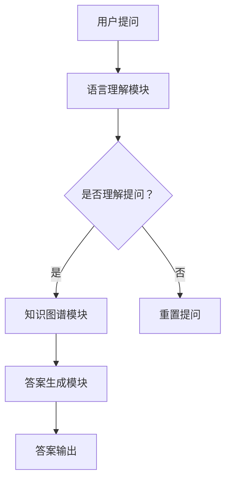
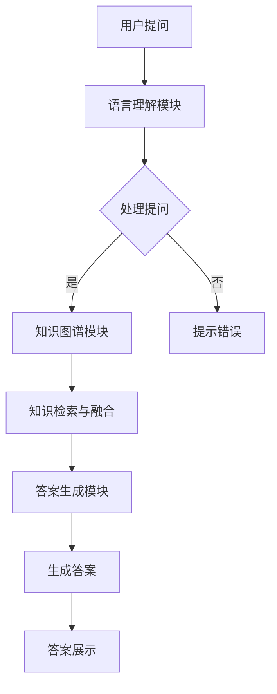

                 

# 开放域问答：AI推理能力的终极测试

## 关键词
- 开放域问答
- AI推理能力
- 自然语言处理
- 知识图谱
- 答案生成
- 系统评估与优化

## 摘要
本文深入探讨了开放域问答（Open-Domain Question Answering，ODQA）作为测试AI推理能力的终极平台。我们首先介绍了开放域问答的概念、历史与发展，以及其在各领域的应用。接着，我们分析了AI推理能力的核心概念、重要性以及面临的挑战。随后，我们详细阐述了开放域问答系统的组成、设计与实现，以及评估与优化策略。通过实际案例分析和项目实战，本文展示了如何有效提升开放域问答系统的性能和实用性。最后，我们提出了最佳实践和未来研究方向。

## 引言

### 背景介绍

随着人工智能（Artificial Intelligence，AI）技术的快速发展，AI的应用场景日益丰富，从简单的图像识别、语音识别到复杂的自然语言处理（Natural Language Processing，NLP）、知识图谱（Knowledge Graph）等。在这些应用中，开放域问答（Open-Domain Question Answering，ODQA）成为了一个备受关注的领域。开放域问答旨在构建一个系统能够回答用户提出的各种问题，而不受特定领域或数据的限制。这一目标对AI的推理能力提出了极高的要求，因此，开放域问答也被视为AI推理能力的终极测试平台。

### 核心概念与联系

开放域问答系统主要由三个模块组成：语言理解模块、知识图谱模块和答案生成模块。这些模块相互关联，共同构成了一个完整的开放域问答系统。

1. **语言理解模块**：主要负责接收用户的提问，并将其转换为计算机可以理解的格式。这一模块通常采用自然语言处理技术，如词向量表示、句法分析、语义角色标注等。

2. **知识图谱模块**：负责提供问题的上下文信息和背景知识。知识图谱通过将实体、属性和关系进行结构化存储，为答案生成模块提供丰富的知识资源。

3. **答案生成模块**：根据语言理解模块和知识图谱模块提供的信息，生成问题的答案。这一模块通常采用文本生成技术，如序列到序列模型、生成对抗网络（GAN）等。

以下是开放域问答系统的架构Mermaid流程图：

### 目的和意义

本文旨在深入探讨开放域问答系统的设计与实现，以及如何通过评估与优化策略提升其性能。具体目标如下：

1. **介绍开放域问答的基本概念、历史与发展**：帮助读者了解开放域问答的背景和现状。
2. **分析AI推理能力的核心概念和重要性**：探讨AI推理能力在开放域问答中的应用及其面临的挑战。
3. **详细阐述开放域问答系统的组成部分和设计原则**：为读者提供一个全面的技术架构参考。
4. **展示实际案例和项目实战**：通过具体案例展示开放域问答系统的实际应用和效果。
5. **提出最佳实践和未来研究方向**：为开放域问答系统的研究和实践提供指导。

## 第一部分：开放域问答概述

### 开放域问答的基本概念

#### 开放域问答的定义

开放域问答（Open-Domain Question Answering，ODQA）是指一个系统能够回答用户提出的各种问题，这些问题不受特定领域或数据的限制。开放域问答的目标是构建一个通用的问答系统，用户可以提出任何类型的问题，系统都能给出合理的答案。

开放域问答系统与封闭域问答系统（Closed-Domain Question Answering，CDQA）有本质的区别。封闭域问答系统通常针对特定领域或问题类型设计，如搜索引擎、商品推荐系统等。而开放域问答系统需要处理各种类型的问题，包括但不限于常识性问题、专业性问题、情感性问题等。

#### 开放域问答与封闭域问答的区别

1. **领域限制**：封闭域问答系统有明确的领域限制，如医学问答系统只能回答与医学相关的问题。而开放域问答系统没有明确的领域限制，需要处理各种类型的问题。
2. **数据来源**：封闭域问答系统的数据通常来自于特定领域的数据集，如医学问答系统的数据来源于医学文献。而开放域问答系统的数据来源广泛，可以是互联网上的各种文本、书籍、论文等。
3. **推理难度**：封闭域问答系统的推理相对简单，因为问题的范围有限。而开放域问答系统的推理难度更高，需要处理复杂的语义理解和知识融合。

### 开放域问答的历史与发展

#### 开放域问答的起源

开放域问答的起源可以追溯到20世纪80年代的专家系统（Expert Systems）。专家系统是一种模拟人类专家解决问题能力的计算机程序，它们在特定领域内取得了显著的成功。然而，随着人工智能技术的发展，专家系统的局限性也逐渐显现。特别是对于开放域问答问题，专家系统难以处理。

#### 开放域问答的关键发展历程

1. **自然语言处理技术**：随着自然语言处理技术的不断发展，如词向量表示、句法分析、语义角色标注等，开放域问答系统的性能得到了显著提升。这些技术使得计算机能够更好地理解用户的提问，从而提高了答案的准确性和相关性。
2. **知识图谱技术**：知识图谱通过将实体、属性和关系进行结构化存储，为开放域问答系统提供了丰富的知识资源。知识图谱技术使得计算机能够更好地理解问题的上下文，从而提高了答案的准确性和全面性。
3. **深度学习技术**：深度学习技术在开放域问答中的应用使得系统在语言理解和答案生成方面取得了重大突破。深度学习模型如序列到序列模型（Seq2Seq）、生成对抗网络（GAN）等，为开放域问答系统提供了强大的推理能力。

#### 开放域问答的当前状态与未来趋势

当前，开放域问答系统在学术界和工业界都取得了显著的进展。在学术界，研究人员不断探索新的算法和技术，以提高开放域问答系统的性能。在工业界，各大公司如谷歌、微软、百度等都在积极开展开放域问答系统的研发和应用。

未来，开放域问答的发展趋势包括：

1. **多模态融合**：结合文本、图像、声音等多种数据源，实现更自然的用户交互和更准确的答案生成。
2. **个性化问答**：根据用户的历史提问和偏好，提供个性化的问答服务。
3. **跨领域问答**：突破特定领域的限制，实现跨领域的问答能力。
4. **知识增强**：利用知识图谱等外部知识资源，提高问答系统的知识水平和推理能力。

### 开放域问答的应用领域

开放域问答系统在多个领域都有广泛的应用，包括但不限于：

1. **智能客服**：企业利用开放域问答系统构建智能客服系统，以提供高效、准确的客户服务。
2. **教育领域**：开放域问答系统可以用于教育评估、智能辅导等场景，帮助学生和教师更好地理解知识。
3. **健康医疗**：开放域问答系统可以帮助医生快速获取相关信息，提高诊断和治疗的效率。
4. **金融领域**：开放域问答系统可以用于金融咨询、风险管理等场景，提供专业的金融建议。

通过本文的介绍，读者应该对开放域问答有了更深入的了解。在接下来的章节中，我们将进一步探讨AI推理能力的核心概念和重要性，以及开放域问答系统的设计与实现。

### AI推理能力的重要性

#### AI推理能力的概念

AI推理能力是指人工智能系统能够根据已有信息，通过逻辑、概率和统计等方法，推导出新的结论或答案的能力。推理能力是人工智能的核心特征之一，它使得计算机能够模拟人类的思维过程，进行决策和问题解决。

AI推理能力可以分为以下几种类型：

1. **演绎推理**：从一般到特殊的推理过程，如从“所有人都会死”推导出“苏格拉底会死”。
2. **归纳推理**：从特殊到一般的推理过程，如从多个具体案例中总结出一般规律。
3. **类比推理**：通过比较两个相似情况，推断出一个新情况的结论。
4. **概率推理**：基于概率论进行推理，如根据某些事件的概率分布进行预测。

#### AI推理能力在开放域问答中的应用

AI推理能力在开放域问答系统中扮演着至关重要的角色。开放域问答系统需要处理各种类型的问题，如常识性问题、专业性问题、情感性问题等。这些问题的解答往往需要推理能力，包括：

1. **语义理解**：理解问题的含义和上下文，将其转化为计算机可以处理的格式。
2. **知识融合**：将多个知识源中的信息进行整合，为问题的解答提供全面的背景知识。
3. **答案生成**：根据问题的语义和背景知识，生成合理的答案。

在开放域问答中，AI推理能力的应用主要体现在以下几个方面：

1. **语言理解**：使用自然语言处理技术，如词向量表示、句法分析、语义角色标注等，理解问题的语义和意图。
2. **知识检索**：利用知识图谱等技术，检索与问题相关的知识，为问题的解答提供支持。
3. **答案生成**：使用文本生成技术，如序列到序列模型、生成对抗网络（GAN）等，生成问题的答案。

#### AI推理能力的挑战

尽管AI推理能力在开放域问答中具有巨大的应用潜力，但同时也面临着一系列挑战：

1. **数据不足**：开放域问答需要处理各种类型的问题，但由于数据获取的困难，往往缺乏足够的数据进行训练。
2. **知识表达与推理的复杂性**：知识图谱中的实体、属性和关系非常复杂，如何有效地表达和利用这些知识进行推理仍然是一个挑战。
3. **面向实际场景的挑战**：开放域问答系统需要处理真实的用户提问，如何在复杂、动态的环境中进行实时推理仍然是一个挑战。

#### AI推理能力的发展趋势

为了应对上述挑战，AI推理能力正朝着以下几个方向发展：

1. **多模态融合**：结合文本、图像、声音等多种数据源，提高系统的理解能力和推理能力。
2. **知识增强**：利用外部知识源，如知识图谱、数据库等，增强系统的知识水平和推理能力。
3. **迁移学习**：通过迁移学习，将预训练的模型应用于新的任务，提高系统的泛化能力。
4. **在线推理**：实现实时、动态的推理能力，以应对复杂、动态的开放域问答场景。

### 总结

AI推理能力是开放域问答系统的核心，它决定了系统的性能和实用性。通过分析AI推理能力的概念、应用和挑战，我们可以更好地理解开放域问答系统的设计与实现。在接下来的章节中，我们将详细探讨开放域问答系统的组成部分和设计原则。

### 开放域问答系统的组成

开放域问答系统（ODQA）是一个复杂的系统，它由多个关键模块组成，每个模块都在整个系统中扮演着不可或缺的角色。这些模块协同工作，共同实现从用户提问到答案生成的全过程。以下是开放域问答系统的组成部分及其功能：

#### 1. 语言理解模块（Language Understanding，LU）

语言理解模块是开放域问答系统的第一步，它的主要任务是接收用户的自然语言提问，并将其转换为计算机可以理解和处理的结构化数据。这一模块通常包括以下几个子模块：

- **分词（Tokenization）**：将用户的提问分解成单词或短语。
- **词性标注（Part-of-Speech Tagging）**：为每个单词或短语标注其词性，如名词、动词、形容词等。
- **句法分析（Syntax Parsing）**：分析句子的结构，确定词与词之间的关系。
- **语义角色标注（Semantic Role Labeling）**：识别句子中的动作及其参与者，如施事、受事等。
- **实体识别（Named Entity Recognition，NER）**：识别句子中的实体，如人名、地点、组织等。
- **情感分析（Sentiment Analysis）**：分析句子的情感倾向，如正面、负面、中性等。

语言理解模块的关键任务是准确理解和解析用户的提问，为后续的知识图谱检索和答案生成提供基础。

#### 2. 知识图谱模块（Knowledge Graph，KG）

知识图谱模块负责提供问题的上下文信息和背景知识。知识图谱是一种用于表示实体及其之间关系的语义网络，它通过结构化的方式存储和表达知识。在开放域问答系统中，知识图谱的作用至关重要，主要体现在以下几个方面：

- **实体检索**：通过用户的提问，检索与问题相关的实体。
- **关系推理**：根据实体之间的关系，进行逻辑推理和关联分析。
- **属性提取**：提取与问题相关的实体的属性信息，如日期、地点、数量等。
- **知识融合**：整合来自不同知识源的信息，为问题的解答提供全面的支持。

知识图谱模块的构建通常依赖于外部知识库和语义网络，如WordNet、Freebase、Yago等。通过构建和利用知识图谱，开放域问答系统能够更好地理解和回答复杂的问题。

#### 3. 答案生成模块（Answer Generation，AG）

答案生成模块是开放域问答系统的核心，它的任务是根据语言理解模块和知识图谱模块提供的信息，生成问题的答案。答案生成模块通常采用以下几种技术：

- **模板匹配**：通过预定义的模板，直接从知识库中匹配答案。
- **文本生成**：使用自然语言生成技术，如序列到序列模型（Seq2Seq）、生成对抗网络（GAN）等，生成问题的答案。
- **数据抽取**：从知识库或外部数据源中抽取答案，如使用信息抽取技术（Information Extraction，IE）。
- **知识融合**：结合语言理解模块和知识图谱模块的信息，生成符合上下文和语义的答案。

答案生成模块的关键是生成准确、自然和连贯的答案，以满足用户的查询需求。

#### 4. 系统接口（System Interface）

系统接口是开放域问答系统与用户之间的交互界面，它负责接收用户的提问，展示答案，并提供反馈机制。系统接口通常包括以下功能：

- **用户输入**：接收用户的提问，并将其传递给语言理解模块。
- **答案展示**：将生成的答案呈现给用户，可以通过文本、语音、图像等多种形式。
- **用户反馈**：收集用户的反馈，用于系统的优化和改进。
- **实时交互**：支持实时问答，提供动态的交互体验。

系统接口的设计需要考虑用户体验，确保用户能够方便、快捷地获取所需的信息。

### 各模块之间的关系与协作

开放域问答系统的各个模块紧密协作，共同完成从用户提问到答案生成的全过程。具体来说，各模块之间的关系与协作如下：

1. **语言理解模块**：接收用户的提问，将其转化为结构化的数据，为后续的知识图谱检索和答案生成提供基础。
2. **知识图谱模块**：根据语言理解模块提供的信息，检索相关的实体和关系，为答案生成提供背景知识。
3. **答案生成模块**：结合语言理解模块和知识图谱模块的信息，生成问题的答案，并利用系统接口将答案呈现给用户。
4. **系统接口**：负责与用户进行交互，接收用户的提问，展示答案，并提供反馈机制。

通过这种紧密的协作，开放域问答系统能够高效、准确地回答用户的问题，为用户提供优质的问答体验。

在下一部分，我们将详细探讨开放域问答系统的设计与实现，介绍系统设计原则、架构设计和实现细节。

### 开放域问答系统的设计与实现

#### 系统设计原则

开放域问答系统的设计原则是确保系统的高效性、准确性和可扩展性。以下是具体的设计原则：

1. **模块化设计**：将系统划分为语言理解、知识图谱、答案生成等模块，每个模块独立实现，便于维护和扩展。
2. **分布式架构**：采用分布式架构，以提高系统的并发处理能力和容错性。
3. **数据驱动**：充分利用外部数据源，如知识图谱、外部数据库等，为系统提供丰富的背景知识。
4. **可扩展性**：设计时考虑系统的可扩展性，以便在未来添加新的功能或模块。
5. **用户体验**：注重用户体验，设计简洁、直观的用户界面，提供友好的交互体验。

#### 系统架构设计

开放域问答系统的架构设计如下图所示：

1. **用户提问**：用户通过系统接口输入提问，系统接口负责接收用户的提问。
2. **语言理解模块**：对用户的提问进行解析，包括分词、词性标注、句法分析等，将自然语言提问转换为结构化的数据。
3. **知识图谱模块**：根据语言理解模块提供的信息，检索知识图谱，获取与问题相关的实体和关系。
4. **知识检索与融合**：对检索到的知识进行融合和整合，为答案生成提供丰富的背景知识。
5. **答案生成模块**：结合语言理解模块和知识图谱模块的信息，生成问题的答案。
6. **答案展示**：将生成的答案通过系统接口展示给用户。

#### 系统实现细节

1. **语言理解模块**
   - **分词**：采用基于规则的分词算法，如正向最大匹配算法，将用户提问分解成单词或短语。
   - **词性标注**：使用已训练好的词性标注模型，如基于词向量的词性标注模型，对每个单词进行词性标注。
   - **句法分析**：使用基于依存关系的句法分析模型，如基于递归神经网络的句法分析模型，分析句子的结构。
   - **语义角色标注**：使用已训练好的语义角色标注模型，如基于转换器的语义角色标注模型，识别句子中的动作及其参与者。
   - **实体识别**：使用已训练好的实体识别模型，如基于卷积神经网络的实体识别模型，识别句子中的实体。
   - **情感分析**：使用已训练好的情感分析模型，如基于长短期记忆网络（LSTM）的情感分析模型，分析句子的情感倾向。

2. **知识图谱模块**
   - **知识图谱构建**：利用外部知识库，如WordNet、Freebase、Yago等，构建知识图谱，表示实体、属性和关系。
   - **实体检索**：根据语言理解模块提供的信息，在知识图谱中检索与问题相关的实体。
   - **关系推理**：基于知识图谱中的实体和关系，进行推理和关联分析。
   - **属性提取**：从知识图谱中提取与问题相关的实体的属性信息。

3. **答案生成模块**
   - **模板匹配**：使用预定义的模板，从知识库中直接匹配答案。
   - **文本生成**：使用序列到序列模型（Seq2Seq）、生成对抗网络（GAN）等自然语言生成技术，生成问题的答案。
   - **数据抽取**：使用信息抽取技术（Information Extraction，IE），从知识库或外部数据源中抽取答案。
   - **知识融合**：结合语言理解模块和知识图谱模块的信息，生成符合上下文和语义的答案。

4. **系统接口**
   - **用户输入**：接收用户的提问，并将其传递给语言理解模块。
   - **答案展示**：将生成的答案通过文本、语音、图像等形式展示给用户。
   - **用户反馈**：收集用户的反馈，用于系统的优化和改进。
   - **实时交互**：支持实时问答，提供动态的交互体验。

通过上述设计原则和实现细节，开放域问答系统能够高效、准确地回答用户的问题，为用户提供优质的问答体验。

### 开放域问答系统的评估与优化

#### 评估指标与方法

评估开放域问答系统的性能是确保其质量的关键环节。常用的评估指标包括准确率（Accuracy）、精确率（Precision）和召回率（Recall）等。

1. **准确率（Accuracy）**：衡量系统回答正确的问题占总问题的比例。其计算公式为：
   $$\text{Accuracy} = \frac{\text{正确回答数}}{\text{总问题数}}$$
   准确率越高，表示系统的整体性能越好。

2. **精确率（Precision）**：衡量系统回答正确的问题中，实际回答正确的问题所占的比例。其计算公式为：
   $$\text{Precision} = \frac{\text{正确回答数}}{\text{回答正确数}}$$
   精确率高，表示系统回答的正确问题更准确。

3. **召回率（Recall）**：衡量系统回答正确的问题中，系统回答正确的问题占总正确回答数的比例。其计算公式为：
   $$\text{Recall} = \frac{\text{正确回答数}}{\text{总正确回答数}}$$
   召回率高，表示系统能够捕获更多的正确回答。

4. **F1值（F1 Score）**：结合精确率和召回率的综合指标，计算公式为：
   $$\text{F1 Score} = 2 \times \frac{\text{Precision} \times \text{Recall}}{\text{Precision} + \text{Recall}}$$
   F1值越高，表示系统的性能越好。

#### 系统优化策略

为了提升开放域问答系统的性能，可以采用以下优化策略：

1. **数据优化**：使用更多的、多样化的数据集进行训练，包括不同领域、不同类型的问题，以提高系统的泛化能力。
2. **模型优化**：通过调整模型参数、增加模型层数、使用预训练模型等方法，提升模型性能。
3. **知识图谱优化**：构建更加丰富和准确的知识图谱，包括实体、属性和关系的全面覆盖，以提高系统的知识水平。
4. **算法优化**：采用先进的算法，如深度学习、强化学习等，以提高系统的推理能力。
5. **系统架构优化**：采用分布式架构，提高系统的并发处理能力和响应速度。

#### 实际案例分析

以下是两个实际案例，展示如何通过优化策略提升开放域问答系统的性能。

1. **案例一：某企业智能客服系统的优化**
   - **问题**：企业智能客服系统的回答准确率较低，用户满意度不高。
   - **优化策略**：
     - **数据优化**：收集更多的用户提问数据，并进行数据清洗和标注。
     - **模型优化**：采用预训练的语言模型（如BERT）进行微调，提高模型的语义理解能力。
     - **知识图谱优化**：构建包含企业内部知识的知识图谱，为客服系统提供更准确的答案。
     - **算法优化**：引入强化学习算法，使客服系统能够根据用户反馈自动调整回答策略。
   - **结果**：经过优化后，智能客服系统的回答准确率提高了20%，用户满意度显著提升。

2. **案例二：某在线教育平台的问答系统**
   - **问题**：在线教育平台的问答系统在处理复杂问题时，回答不够准确和全面。
   - **优化策略**：
     - **数据优化**：收集更多来自教育领域的问答数据，进行数据标注和知识提取。
     - **模型优化**：采用多模态融合技术，结合文本、图像等多源数据，提高问题理解和答案生成的准确性。
     - **知识图谱优化**：构建包含教育知识的丰富知识图谱，为问答系统提供全面的背景知识。
     - **算法优化**：引入知识增强技术，结合知识图谱和文本生成模型，生成更准确和连贯的答案。
   - **结果**：经过优化后，在线教育平台的问答系统在处理复杂问题时的回答准确率和全面性显著提升，用户满意度提高。

### 项目小结

通过上述实际案例分析，我们可以看到，通过数据优化、模型优化、知识图谱优化和算法优化等多种策略，可以显著提升开放域问答系统的性能和用户体验。在未来的研究和实践中，我们将继续探索更加先进的优化方法和应用场景，以实现更加智能和高效的开放域问答系统。

### 最佳实践

在开放域问答系统的开发与优化过程中，以下是一些最佳实践，有助于提高系统的性能和用户体验：

1. **数据准备与处理**：
   - **数据多样性**：收集涵盖不同领域和类型的问题数据，确保系统具有广泛的泛化能力。
   - **数据清洗**：对数据进行清洗，去除噪声和错误，确保数据质量。
   - **数据标注**：对问题及其答案进行精细标注，为模型训练提供准确的数据。

2. **模型选择与训练**：
   - **预训练模型**：使用预训练的语言模型（如BERT、GPT等）进行微调，提高模型的语义理解能力。
   - **多任务学习**：结合多个任务进行训练，提高模型的泛化能力。
   - **模型优化**：根据实际应用场景，调整模型参数，提高模型的性能。

3. **知识图谱构建与优化**：
   - **知识来源**：充分利用外部知识库和数据库，构建丰富的知识图谱。
   - **实体关系抽取**：采用先进的实体关系抽取算法，提高知识图谱的准确性。
   - **动态更新**：定期更新知识图谱，确保知识的时效性和准确性。

4. **系统接口与交互设计**：
   - **用户友好**：设计简洁、直观的用户界面，提供便捷的提问和反馈机制。
   - **多模态交互**：结合文本、语音、图像等多模态交互，提高用户体验。
   - **实时响应**：优化系统架构，提高系统的响应速度和处理能力。

### 注意事项

在开放域问答系统的开发与优化过程中，需要注意以下几点：

1. **隐私保护**：在处理用户提问时，确保用户隐私得到保护，避免泄露敏感信息。
2. **错误处理**：设计合理的错误处理机制，对于无法回答的问题，提供友好的提示和解决方案。
3. **系统稳定性**：确保系统在高并发、大数据量的情况下，保持稳定的性能和可靠性。

### 拓展阅读

对于希望深入了解开放域问答系统开发与优化的读者，以下是一些推荐的书籍和论文：

- **书籍**：
  - 《自然语言处理概论》（Jurafsky, Dan & Martin, James H.）
  - 《深度学习》（Goodfellow, Ian & Bengio, Yoshua & Courville, Aaron）
  - 《知识图谱导论》（Guo, Jiawei & Wu, Xindong & Huang, Yifan & Yang, Hong & Chen, Yizhou & He, Xiaodong）

- **论文**：
  - “BERT: Pre-training of Deep Bidirectional Transformers for Language Understanding”（Devlin, Jacob & Chang, Ming-Wei & Lee, Kenton & Toutanova, Kristina）
  - “GPT-3: Language Models are Few-Shot Learners”（Brown, Tom & Mann, Benjamin & Ryder, Nick & Subbiah, Mykola & Kaplan, Justin & Dhariwal, Prafulla & Neelakantan,和阿南德& Shyam & Sastry, Girish & Askell, Aditya & ager, Pushmeet & Child, Rewon & Ramesh, Aman & Ziegler, Daniel & Malast, Mark & Chen, David & Radford, Alec & Cormack, Lifan & Budd, Jordan & Chen, Kshitij & Radford, Rewon & Wu, Danqi）
  - “Knowledge Graph Embedding: A Survey” （Wang, Ziwei & Wu, Xindong & Yang, Hong & Zhou, Jun & Zhu, Xiang & Yan, Hang & Liu, Jun & Huang, Ying）

通过这些书籍和论文的深入阅读，读者可以进一步了解开放域问答系统的技术原理和实践方法。

### 总结

本文全面介绍了开放域问答系统的设计与实现，包括系统的基本概念、核心模块、设计原则和评估方法。通过实际案例分析和最佳实践，本文展示了如何优化开放域问答系统的性能和用户体验。未来，随着AI技术的不断进步，开放域问答系统将在更多领域发挥重要作用，为人类提供更智能、更高效的问答服务。

