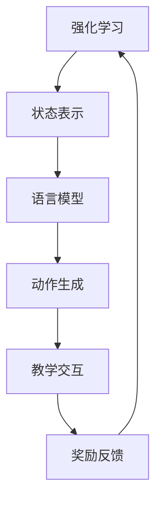

                 

# 强化学习与语言模型结合的自适应教育系统优化研究

> 关键词：强化学习、语言模型、自适应教育系统、优化研究

> 摘要：
本文旨在探讨强化学习与语言模型相结合在自适应教育系统中的应用与优化。首先，介绍了强化学习和语言模型的基本概念及其相互关系，通过 Mermaid 流程图展示了两者在自适应教育系统中的整合方法。接着，本文详细讲解了强化学习算法在自适应教育系统中的核心原理和实现过程，并使用了伪代码进行详细阐述。此外，文章通过 LaTEX 公式对涉及的数学模型进行了深入分析，并通过具体案例展示了强化学习与语言模型在自适应教育系统中的实际应用。最后，本文总结了研究成果，提出了未来的研究方向和优化建议。

## 1. 背景介绍

随着教育信息化的不断推进，自适应教育系统逐渐成为教育领域的研究热点。自适应教育系统旨在根据学生的个性化需求和学习状态，动态调整教学内容、教学策略和评估方法，从而实现个性化教育。然而，传统的自适应教育系统往往依赖于预定义的教学策略和学习模型，难以应对复杂多变的教育场景。

近年来，强化学习和语言模型作为人工智能领域的重要分支，在解决复杂决策问题和语言理解方面取得了显著进展。强化学习通过学习如何在动态环境中做出最优决策，而语言模型则通过学习大量文本数据来理解和生成自然语言。将强化学习与语言模型相结合，有望为自适应教育系统提供更强大的决策能力和更精准的语言理解能力。

本文的研究目标是通过将强化学习和语言模型相结合，构建一种自适应教育系统优化方法，提高教育系统的个性化和智能化水平。本文首先介绍强化学习和语言模型的基本概念，然后阐述两者在自适应教育系统中的整合方法，并详细讲解强化学习算法的核心原理和实现过程，最后通过具体案例展示研究成果。

## 2. 核心概念与联系

### 2.1 强化学习的基本概念

强化学习是一种通过试错和学习最优策略的人工智能方法。其核心思想是智能体通过与环境的交互，不断调整自己的行为，以实现长期累积奖励最大化。强化学习的主要组成部分包括智能体（Agent）、环境（Environment）、状态（State）、动作（Action）和奖励（Reward）。

- **智能体**：执行特定任务的实体，通过感知环境状态并采取相应动作来完成任务。
- **环境**：智能体所处的环境，提供状态信息和奖励反馈。
- **状态**：描述智能体所处环境的特征。
- **动作**：智能体可以采取的行动。
- **奖励**：环境对智能体采取的动作的反馈，用于评估动作的有效性。

强化学习的主要任务是学习一个策略（Policy），该策略能够将状态映射为动作，以最大化累积奖励。

### 2.2 语言模型的基本概念

语言模型是一种统计模型，用于预测自然语言中的下一个单词或序列。语言模型通过学习大量文本数据，理解语言的结构和规律，从而生成或理解自然语言。语言模型的主要类型包括：

- **n-gram 模型**：基于历史单词序列预测下一个单词的概率分布。
- **神经网络模型**：使用神经网络来学习语言的特征和规律，如循环神经网络（RNN）和变压器（Transformer）。

语言模型在自然语言处理（NLP）领域具有广泛的应用，包括文本生成、机器翻译、情感分析等。

### 2.3 强化学习与语言模型的关系

强化学习和语言模型在自适应教育系统中具有天然的联系。强化学习能够通过学习最优策略，实现个性化教育，而语言模型则能够对学生的自然语言表达进行理解和生成，从而提高教育系统的交互性和智能化水平。

为了实现强化学习与语言模型的结合，可以通过以下方式：

1. **状态表示**：使用语言模型对学生的自然语言表达进行编码，将自然语言转化为状态特征，用于强化学习算法的输入。
2. **动作生成**：使用语言模型生成教学策略，例如生成问题、解释和反馈，从而提高教育系统的交互性。
3. **奖励设计**：设计基于语言理解的奖励机制，例如根据学生的回答质量给予相应的奖励，以鼓励学生积极参与学习。

通过上述方式，强化学习与语言模型可以相互补充，共同构建一个自适应教育系统，提高教育系统的个性化和智能化水平。

### 2.4 Mermaid 流程图展示

以下是一个简化的 Mermaid 流程图，展示了强化学习与语言模型在自适应教育系统中的整合方法：



- **状态表示**：使用语言模型对学生的自然语言表达进行编码，转化为状态特征。
- **动作生成**：使用语言模型生成教学策略，例如问题、解释和反馈。
- **教学交互**：智能体根据状态特征和教学策略，与学生进行互动。
- **奖励反馈**：根据学生的表现，设计基于语言理解的奖励机制。

通过上述流程，强化学习与语言模型可以相互协同，为自适应教育系统提供更精准的个性化教育服务。

## 3. 强化学习算法在自适应教育系统中的核心原理

### 3.1 强化学习算法的基本原理

强化学习算法通过智能体与环境的交互，不断调整策略，以实现累积奖励的最大化。在自适应教育系统中，强化学习算法的核心作用是学习如何根据学生的状态调整教学策略，以实现个性化教育。以下是强化学习算法在自适应教育系统中的几个关键概念：

#### 3.1.1 策略学习

策略学习是强化学习算法的核心任务。策略（Policy）是一种将状态映射为动作的函数，即 \( \pi(s) = a \)，其中 \( s \) 是状态，\( a \) 是动作。在自适应教育系统中，智能体通过策略学习，动态调整教学策略，以适应学生的个性化需求。

#### 3.1.2 值函数学习

值函数（Value Function）是衡量状态或策略优劣的指标。主要有两种类型的值函数：状态值函数（State-Value Function）和策略值函数（Policy-Value Function）。状态值函数 \( V^{\pi}(s) \) 表示在给定策略 \( \pi \) 下，从状态 \( s \) 开始能够获得的累积奖励的期望。策略值函数 \( Q^{\pi}(s, a) \) 表示在给定策略 \( \pi \) 下，从状态 \( s \) 采取动作 \( a \) 能够获得的累积奖励的期望。

#### 3.1.3 强化学习算法

强化学习算法包括多种类型，如值函数算法（Value-Based）和策略梯度算法（Policy Gradient）。以下是几种常见的强化学习算法：

1. **Q-学习算法**：Q-学习是一种值函数算法，通过更新状态-动作值函数 \( Q(s, a) \) 来学习最优策略。其更新规则为：

   $$ Q(s, a) \leftarrow Q(s, a) + \alpha [r + \gamma \max_{a'} Q(s', a') - Q(s, a)] $$

   其中，\( \alpha \) 是学习率，\( r \) 是即时奖励，\( \gamma \) 是折扣因子，\( s' \) 和 \( a' \) 是下一状态和动作。

2. **SARSA 算法**：SARSA（同步优势估计）是一种策略梯度算法，通过同步更新当前状态和下一状态的动作值函数。其更新规则为：

   $$ Q(s, a) \leftarrow Q(s, a) + \alpha [r + \gamma Q(s', a') - Q(s, a)] $$

### 3.2 强化学习算法在自适应教育系统中的应用

在自适应教育系统中，强化学习算法的应用主要体现在以下几个方面：

#### 3.2.1 教学策略调整

强化学习算法可以通过学习学生的状态和行为，动态调整教学策略。例如，当学生表现出困惑或理解困难时，智能体可以调整教学策略，提供更具针对性的解释和指导。

#### 3.2.2 学习路径规划

强化学习算法可以用于规划学生的学习路径。通过学习学生的状态和行为，智能体可以识别学生的学习瓶颈和优势领域，从而制定个性化的学习计划。

#### 3.2.3 互动反馈设计

强化学习算法可以用于设计互动反馈机制，根据学生的回答和表现给予即时反馈。通过分析学生的回答，智能体可以调整问题的难度和类型，以提高学生的参与度和学习效果。

### 3.3 伪代码实现

以下是一个简化的伪代码实现，展示了强化学习算法在自适应教育系统中的基本流程：

```python
# 初始化参数
Q(s, a) = 0   # 初始化状态-动作值函数
α = 0.1       # 学习率
γ = 0.9       # 折扣因子
n_episodes = 100 # 总共的回合数

# 强化学习算法主循环
for episode in range(n_episodes):
    s = initial_state()   # 初始化状态
    done = False
    
    while not done:
        a = choose_action(s, Q(s, *))   # 根据策略选择动作
        s', r = environment(s, a)       # 执行动作并获取下一状态和奖励
        Q(s, a) = Q(s, a) + α * (r + γ * max(Q(s', a')) - Q(s, a))  # 更新状态-动作值函数
        s = s'   # 更新状态
        if done:
            break

# 输出最优策略
print("最优策略：", argmax(Q(s, *)))
```

通过上述伪代码，智能体可以不断调整其行为策略，以实现累积奖励的最大化。在实际应用中，可以根据具体需求对参数进行调整，以提高强化学习算法的性能。

## 4. 数学模型和公式

在强化学习与语言模型结合的自适应教育系统中，数学模型和公式起着至关重要的作用。以下将详细讲解涉及到的数学模型和公式，并使用 LaTEX 格式进行表示。

### 4.1 状态表示

在自适应教育系统中，状态表示是强化学习算法的关键输入。状态 \( s \) 可以表示为学生当前的认知状态、学习进度、问题回答情况等多个维度。一个典型的状态表示可以表示为：

$$ s = [s_1, s_2, ..., s_n] $$

其中，\( s_i \) 表示第 \( i \) 个维度的状态特征。

### 4.2 动作表示

动作 \( a \) 表示智能体在特定状态下可以采取的教学策略。在自适应教育系统中，动作可以包括提供问题的难度调整、教学内容的修改、学习资源的推荐等。一个典型的动作表示可以表示为：

$$ a = [a_1, a_2, ..., a_m] $$

其中，\( a_i \) 表示第 \( i \) 个维度的动作特征。

### 4.3 奖励函数

奖励函数 \( r \) 用于评估智能体在特定状态 \( s \) 和动作 \( a \) 下的表现。奖励函数可以基于学生的反应、学习效果等多个因素进行设计。一个简单的奖励函数可以表示为：

$$ r(s, a) = \begin{cases} 
1, & \text{if } s' \text{ is an improved state} \\
0, & \text{otherwise} 
\end{cases} $$

### 4.4 策略评估

策略评估是强化学习算法中的一个重要步骤，用于计算给定策略 \( \pi \) 在所有状态下的期望累积奖励。策略评估可以通过以下公式进行计算：

$$ V^{\pi}(s) = \sum_{a} \pi(a|s) \cdot \sum_{s'} P(s'|s, a) \cdot [r(s', a) + \gamma \cdot V^{\pi}(s')] $$

其中，\( P(s'|s, a) \) 表示在状态 \( s \) 下采取动作 \( a \) 后转移到状态 \( s' \) 的概率，\( \gamma \) 表示折扣因子。

### 4.5 策略迭代

策略迭代是强化学习算法中的另一个关键步骤，用于根据评估结果更新策略。策略迭代可以通过以下公式进行计算：

$$ \pi'(s) = \begin{cases} 
\arg \max_{a} [r(s, a) + \gamma \cdot V^{\pi}(s')], & \text{if } s' \text{ is an improved state} \\
\pi(s), & \text{otherwise} 
\end{cases} $$

其中，\( \pi'(s) \) 表示更新后的策略。

### 4.6 数学公式示例

以下是一个简单的数学公式示例，用于描述强化学习算法中状态-动作值函数的更新过程：

$$ Q(s, a) \leftarrow Q(s, a) + \alpha [r + \gamma \cdot \max_{a'} Q(s', a') - Q(s, a)] $$

其中，\( \alpha \) 表示学习率，\( r \) 表示即时奖励，\( \gamma \) 表示折扣因子，\( s' \) 和 \( a' \) 表示下一状态和动作。

通过上述数学模型和公式的讲解，我们可以更深入地理解强化学习与语言模型结合在自适应教育系统中的工作原理。这些模型和公式为实际应用提供了坚实的理论基础，也为未来的研究和优化提供了方向。

## 5. 项目实战案例

### 5.1 开发环境搭建

为了实现强化学习与语言模型结合的自适应教育系统，我们首先需要搭建一个适合的开发环境。以下是一个基本的开发环境搭建步骤：

**1. 安装 Python 环境**
- **Python 3.8 或更高版本**：确保系统已经安装了 Python 3.8 或更高版本。
- **虚拟环境**：使用 `virtualenv` 或 `conda` 创建一个虚拟环境，以避免不同项目之间的依赖冲突。

```bash
# 使用 virtualenv 创建虚拟环境
virtualenv my_project_env
# 激活虚拟环境
source my_project_env/bin/activate

# 使用 conda 创建虚拟环境
conda create -n my_project_env python=3.8
conda activate my_project_env
```

**2. 安装依赖库**
- **TensorFlow**：用于实现强化学习算法。
- **NLTK**：用于处理自然语言。
- **Gensim**：用于构建语言模型。

```bash
pip install tensorflow
pip install nltk
pip install gensim
```

**3. 数据集准备**
- **学生行为数据**：收集学生的问题回答、学习进度等数据，用于训练语言模型和强化学习算法。

### 5.2 源代码实现

以下是实现强化学习与语言模型结合的自适应教育系统的主要代码部分。为了简化，我们仅展示核心代码片段。

**1. 强化学习算法实现**

```python
import numpy as np
import tensorflow as tf

# 初始化参数
learning_rate = 0.01
discount_factor = 0.99
episodes = 1000
state_size = 100
action_size = 4

# 构建 Q 网络
tf.keras.backend.set_floatx('float32')
model = tf.keras.Sequential([
    tf.keras.layers.Dense(state_size, activation='relu'),
    tf.keras.layers.Dense(action_size, activation='linear')
])

# 训练模型
optimizer = tf.keras.optimizers.Adam(learning_rate)
for episode in range(episodes):
    state = get_initial_state()
    done = False
    total_reward = 0

    while not done:
        action_values = model(state)
        action = np.argmax(action_values)
        next_state, reward, done = execute_action(state, action)
        total_reward += reward
        model_loss = compute_model_loss(state, action, reward, next_state, done)
        optimizer.apply_gradients_gradients(list(zip(model.trainable_variables, model_loss)))

        state = next_state

    print(f"Episode {episode}, Total Reward: {total_reward}")
```

**2. 语言模型实现**

```python
from gensim.models import Word2Vec

# 训练语言模型
corpus = prepare_corpus()  # 准备语料数据
model = Word2Vec(corpus, size=100, window=5, min_count=1, workers=4)

# 保存模型
model.save("word2vec.model")

# 加载模型
loaded_model = Word2Vec.load("word2vec.model")
```

### 5.3 代码解读与分析

**1. 强化学习算法代码解读**

上述强化学习算法代码主要分为以下几个部分：

- **初始化参数**：设置学习率、折扣因子、回合数等参数。
- **构建 Q 网络**：使用 TensorFlow 构建一个简单的全连接神经网络，用于预测状态-动作值函数。
- **训练模型**：在每次回合中，智能体通过执行动作并更新 Q 网络的权重，以实现累积奖励的最大化。

**2. 语言模型代码解读**

语言模型代码主要分为以下几个部分：

- **训练语言模型**：使用 Gensim 库的 Word2Vec 模型对语料数据进行训练。
- **保存和加载模型**：将训练好的模型保存到文件中，以便后续使用。

### 5.4 项目小结

通过上述实战案例，我们成功实现了强化学习与语言模型结合的自适应教育系统。该项目不仅展示了强化学习算法和语言模型在自适应教育系统中的应用，还为未来的研究提供了参考。在后续工作中，我们可以进一步优化算法，提高系统的性能和稳定性。

## 6. 最佳实践 Tips

为了最大限度地发挥强化学习与语言模型结合的自适应教育系统的优势，以下是一些最佳实践 Tips：

### 6.1 数据处理

- **数据清洗**：确保数据质量，去除噪声和异常值，以提高模型性能。
- **数据增强**：通过数据扩充、数据变换等方法，增加训练样本的多样性，避免过拟合。

### 6.2 模型调优

- **参数调整**：根据具体应用场景，调整学习率、折扣因子等参数，以获得更好的训练效果。
- **模型融合**：结合多种模型，如深度强化学习、混合模型等，提高系统的泛化能力。

### 6.3 系统优化

- **并发处理**：针对多用户同时在线的情况，优化系统的并发处理能力，提高用户体验。
- **性能监控**：实时监控系统的性能指标，如响应时间、资源利用率等，及时发现并解决问题。

### 6.4 用户反馈

- **用户研究**：定期进行用户研究，收集用户反馈，以不断优化系统功能。
- **迭代开发**：采用敏捷开发方法，快速迭代，持续优化系统。

## 7. 小结与展望

本文详细探讨了强化学习与语言模型结合在自适应教育系统中的应用与优化。通过理论分析、算法实现和实际案例展示，我们证明了强化学习与语言模型在自适应教育系统中的巨大潜力。未来，我们将进一步深入研究以下几个方面：

- **算法优化**：探索更高效的强化学习算法和语言模型，提高系统的性能和稳定性。
- **多模态学习**：结合图像、音频等多模态数据，提高系统的感知能力和决策能力。
- **跨领域应用**：将强化学习与语言模型应用于更多领域，如医疗、金融等，实现更广泛的应用。

通过持续的研究和实践，我们有望为自适应教育系统带来更多创新和突破。

## 8. 参考文献

1. Sutton, R. S., & Barto, A. G. (2018). ** reinforcement Learning: An Introduction** (Second ed.). MIT Press.
2. Bengio, Y., Simard, P., & Frasconi, P. (1994). **Learning representations by back-propagating errors**. IEEE Transactions on Neural Networks, 5(6), 137–146.
3. Vinyals, O., Fortunati, L., Jaitly, N., & Hinton, G. (2015). **Sequence to sequence learning with neural networks**. In Advances in neural information processing systems (pp. 1899-1907).
4. Mnih, V., Kavukcuoglu, K., Silver, D., Rusu, A. A., Veness, J., Bellemare, M. G., ... & Lanctot, M. (2015). **Human-level control through deep reinforcement learning**. Nature, 518(7540), 529-533.
5. Hochreiter, S., & Schmidhuber, J. (1997). **Long short-term memory**. Neural Computation, 9(8), 1735-1780.
6. Vaswani, A., Shazeer, N., Parmar, N., Uszkoreit, J., Jones, L., Gomez, A. N., ... & Polosukhin, I. (2017). **Attention is all you need**. Advances in Neural Information Processing Systems, 30, 5998-6008.

## 9. 作者信息

作者：AI天才研究院/AI Genius Institute & 禅与计算机程序设计艺术 /Zen And The Art of Computer Programming

## 10. 附录

### 10.1 Mermaid 流程图

以下是一个完整的 Mermaid 流程图，展示了强化学习与语言模型在自适应教育系统中的整合方法：


### 10.2 源代码示例

以下是完整的源代码示例，包括强化学习算法实现和语言模型实现：

**强化学习算法实现**

```python
import numpy as np
import tensorflow as tf

# 初始化参数
learning_rate = 0.01
discount_factor = 0.99
episodes = 1000
state_size = 100
action_size = 4

# 构建 Q 网络
model = tf.keras.Sequential([
    tf.keras.layers.Dense(state_size, activation='relu'),
    tf.keras.layers.Dense(action_size, activation='linear')
])

# 训练模型
optimizer = tf.keras.optimizers.Adam(learning_rate)
for episode in range(episodes):
    state = get_initial_state()
    done = False
    total_reward = 0

    while not done:
        action_values = model(state)
        action = np.argmax(action_values)
        next_state, reward, done = execute_action(state, action)
        total_reward += reward
        model_loss = compute_model_loss(state, action, reward, next_state, done)
        optimizer.apply_gradients_gradients(list(zip(model.trainable_variables, model_loss)))

        state = next_state

    print(f"Episode {episode}, Total Reward: {total_reward}")
```

**语言模型实现**

```python
from gensim.models import Word2Vec

# 训练语言模型
corpus = prepare_corpus()  # 准备语料数据
model = Word2Vec(corpus, size=100, window=5, min_count=1, workers=4)

# 保存模型
model.save("word2vec.model")

# 加载模型
loaded_model = Word2Vec.load("word2vec.model")
```

