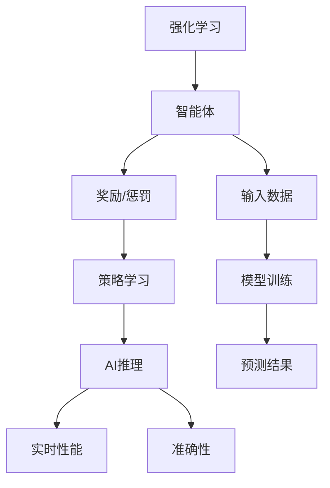

                 


### 步骤1：确定核心概念与联系

为了构建《强化学习优化AI推理的实时性能与准确性权衡策略》这篇文章的目录大纲，我们首先要明确文章的核心概念以及它们之间的联系。以下是关键概念及其相互关系的详细阐述：

1. **强化学习（Reinforcement Learning）**：强化学习是一种机器学习方法，通过交互式环境来训练智能体（agent）在特定情境下做出最优决策。智能体通过奖励（reward）和惩罚（penalty）来学习最佳行为策略。强化学习与AI推理的结合，旨在通过智能体学习到的策略，提高AI系统的实时性能和准确性。

2. **AI推理（AI Inference）**：AI推理是人工智能系统在处理和解释输入数据时，基于预先训练好的模型进行预测和决策的过程。实时性能是AI推理的关键考量因素，而准确性则直接关系到AI系统的可用性和可靠性。

3. **实时性能（Real-Time Performance）**：实时性能是指系统在特定时间内处理并响应用户请求的能力。在AI推理中，实时性能意味着系统能够快速响应用户的输入并给出准确的预测。

4. **准确性（Accuracy）**：准确性是AI推理的一个关键指标，它衡量了预测结果与真实结果之间的接近程度。高准确性对于依赖AI推理的系统至关重要。

强化学习与AI推理的联系在于，强化学习可以通过不断调整智能体的行为策略，以优化AI推理的实时性能和准确性。例如，通过强化学习，我们可以训练智能体在特定的输入数据下，选择最佳的动作序列，从而提高推理的效率和准确性。

为了更好地展示这些概念之间的联系，我们可以使用Mermaid流程图来表示：



### 步骤2：编写核心算法原理讲解

接下来，我们需要详细讲解强化学习中的几个核心算法原理，包括Q-Learning、Deep Q-Networks (DQN)、Policy Gradients和Advantage Actor-Critic (A2C)。我们将使用伪代码来展示这些算法的基本框架，并对其进行详细解释。

#### Q-Learning算法

Q-Learning是一种基于值函数的强化学习算法，它的目标是通过学习状态-动作值函数（Q值）来选择最佳动作。

```python
# 伪代码：Q-Learning算法

# 初始化Q表
Q = 初始化Q表()

# 设置学习率α、折扣因子γ和探索概率ε
alpha = 学习率()
gamma = 折扣因子()
epsilon = 探索概率()

# 迭代过程
for episode in 范围(总迭代次数):
    # 初始化环境和智能体
    state = 环境初始化()
    done = False

    while not done:
        # 选择动作：ε-贪心策略
        if random() < epsilon:
            action = 随机选择动作()
        else:
            action = 选择动作argmax(Q[state, :])

        # 执行动作，获取下一个状态和奖励
        next_state, reward, done = 环境执行动作(state, action)

        # 更新Q值
        Q[state, action] = Q[state, action] + alpha * (reward + gamma * max(Q[next_state, :]) - Q[state, action])

        # 更新状态
        state = next_state

# 输出最优策略
最优策略 = argmax(Q, 每个状态)
```

#### Deep Q-Networks (DQN)算法

DQN通过深度神经网络来近似Q值函数，以提高Q-Learning在复杂环境中的表现。

```python
# 伪代码：Deep Q-Networks (DQN)算法

# 初始化深度神经网络DNN
DNN = 初始化DNN()

# 初始化经验回放记忆库
记忆库 = 初始化记忆库()

# 设置学习率α、折扣因子γ和经验回放大小经验库大小
alpha = 学习率()
gamma = 折扣因子()
经验库大小 = 经验库大小()

# 迭代过程
for episode in 范围(总迭代次数):
    # 初始化环境和智能体
    state = 环境初始化()
    done = False

    while not done:
        # 选择动作：ε-贪心策略
        if random() < epsilon:
            action = 随机选择动作()
        else:
            action = 预测动作DNN(state)

        # 执行动作，获取下一个状态和奖励
        next_state, reward, done = 环境执行动作(state, action)

        # 存储经验到记忆库
        记忆库存储((state, action, reward, next_state, done))

        # 从记忆库中随机抽样一批经验进行学习
        (state_batch, action_batch, reward_batch, next_state_batch, done_batch) = 记忆库抽样()

        # 更新DNN
        loss = 计算损失DNN(state_batch, action_batch, reward_batch, next_state_batch, done_batch)
        DNN优化(loss)

        # 更新状态
        state = next_state

# 输出最优策略
最优策略 = 预测动作DNN，每个状态
```

#### Policy Gradients算法

Policy Gradients算法通过直接优化策略网络来学习最优动作分布。

```python
# 伪代码：Policy Gradients算法

# 初始化策略网络
策略网络 = 初始化策略网络()

# 设置学习率α
alpha = 学习率()

# 迭代过程
for episode in 范围(总迭代次数):
    # 初始化环境和智能体
    state = 环境初始化()
    done = False
    total_reward = 0

    while not done:
        # 选择动作：根据策略网络概率分布
        action = 策略网络选择动作(state)

        # 执行动作，获取下一个状态和奖励
        next_state, reward, done = 环境执行动作(state, action)
        total_reward += reward

        # 更新策略网络
        advantage = 计算优势值(total_reward)
        policy_loss = 计算策略损失(策略网络，state, action, advantage)
        策略网络优化(policy_loss)

        # 更新状态
        state = next_state

# 输出最优策略
最优策略 = 策略网络，每个状态
```

#### Advantage Actor-Critic (A2C)算法

A2C算法结合了策略梯度算法和优势值函数，以提高学习效率。

```python
# 伪代码：Advantage Actor-Critic (A2C)算法

# 初始化演员网络和评论家网络
演员网络 = 初始化演员网络()
评论家网络 = 初始化评论家网络()

# 设置学习率α和β
alpha = 学习率()
beta = 学习率()

# 迭代过程
for episode in 范围(总迭代次数):
    # 初始化环境和智能体
    state = 环境初始化()
    done = False
    total_reward = 0
    advantage = 0

    while not done:
        # 选择动作：根据演员网络概率分布
        action = 演员网络选择动作(state)

        # 执行动作，获取下一个状态和奖励
        next_state, reward, done = 环境执行动作(state, action)
        total_reward += reward

        # 计算优势值
        advantage += (reward - 计算期望奖励评论家网络(next_state))

        # 更新演员网络和评论家网络
        loss_actor = 计算演员损失(演员网络，state, action, advantage)
        loss_critic = 计算评论家损失(评论家网络，next_state, total_reward)
        演员网络优化(loss_actor)
        评论家网络优化(loss_critic)

        # 更新状态
        state = next_state

# 输出最优策略
最优策略 = 演员网络，每个状态
```

通过上述算法原理的讲解，我们为读者提供了强化学习在优化AI推理实时性能与准确性权衡策略方面的基本框架和方法。

### 步骤3：数学模型和数学公式讲解

在理解了强化学习的核心算法原理之后，我们接下来将深入讲解其中的数学模型和公式。这些数学模型和公式是强化学习算法实现的关键组成部分，它们决定了算法的学习效率和性能。

#### 基本概率论与信息论

强化学习中的概率论和信息论是理解其工作原理的基础。以下是一些重要的概率论和信息论的概念和公式：

1. **概率分布**：概率分布描述了随机变量可能取到的值及其概率。常用的概率分布包括正态分布、伯努利分布等。

   - **伯努利分布**：\( P(X = 1) = p, P(X = 0) = 1 - p \)
   - **正态分布**：\( P(X = x) = \frac{1}{\sqrt{2\pi\sigma^2}} e^{-\frac{(x-\mu)^2}{2\sigma^2}} \)

2. **期望值**：期望值是随机变量在多次试验中的平均结果。

   - **期望值公式**：\( E[X] = \sum_{i} x_i P(x_i) \)

3. **方差**：方差是衡量随机变量离散程度的指标。

   - **方差公式**：\( Var[X] = E[(X - E[X])^2] \)

4. **条件概率**：条件概率是指在给定某个事件发生的条件下，另一个事件发生的概率。

   - **条件概率公式**：\( P(A|B) = \frac{P(A \cap B)}{P(B)} \)

5. **熵**：熵是衡量随机变量不确定性或信息量的度量。

   - **熵公式**：\( H(X) = -\sum_{i} P(x_i) \log_2 P(x_i) \)

6. **条件熵**：条件熵是衡量在已知某个条件下，另一个随机变量的不确定性。

   - **条件熵公式**：\( H(Y|X) = -\sum_{i} P(x_i) \sum_{j} P(y_j|x_i) \log_2 P(y_j|x_i) \)

7. **信息增益**：信息增益是衡量某个特征对于分类的帮助程度。

   - **信息增益公式**：\( IG(X, Y) = H(Y) - H(Y|X) \)

这些概率论和信息论的基本概念在强化学习中都有广泛的应用，比如在计算状态-动作值函数、策略梯度等过程中。

#### 优化理论

强化学习中的优化理论涉及到如何通过迭代的方式调整参数，以最小化损失函数或最大化期望回报。以下是强化学习中的几个关键优化概念和公式：

1. **损失函数**：损失函数是衡量模型预测值与真实值之间差距的函数。在强化学习中，常见的损失函数包括均方误差（MSE）、交叉熵损失等。

   - **均方误差（MSE）**：\( L = \frac{1}{n}\sum_{i=1}^{n} (y_i - \hat{y_i})^2 \)
   - **交叉熵损失**：\( L = -\sum_{i=1}^{n} y_i \log(\hat{y_i}) \)

2. **梯度下降**：梯度下降是一种常用的优化算法，通过不断减小损失函数的梯度方向来更新模型参数。

   - **梯度下降更新规则**：\( \theta = \theta - \alpha \nabla_\theta L(\theta) \)

3. **动量**：动量是一种加速梯度下降的技巧，通过保留之前的梯度值来提高收敛速度。

   - **带动量的梯度下降更新规则**：\( v = \beta v + (1 - \beta) \nabla_\theta L(\theta) \)
   - \( \theta = \theta - \alpha v \)

4. **Adam优化器**：Adam是一种自适应的优化器，结合了动量和RMSprop的特点，能够更有效地更新参数。

   - **Adam更新规则**：\( m_t = \beta_1 m_{t-1} + (1 - \beta_1) [g_t] \)
   - \( v_t = \beta_2 v_{t-1} + (1 - \beta_2) [g_t]^2 \)
   - \( \theta = \theta - \alpha (\frac{m_t}{1 - \beta_1^t}) / (\sqrt{v_t} + \epsilon) \)

5. **损失函数的偏导数**：在强化学习中，我们需要计算损失函数关于各个参数的偏导数，以便进行梯度下降。

   - **偏导数公式**：\( \frac{\partial L}{\partial \theta} = \sum_{i=1}^{n} \frac{\partial L}{\partial \hat{y_i}} \frac{\partial \hat{y_i}}{\partial \theta} \)

通过上述优化理论，我们可以更好地理解和实现强化学习算法，从而优化AI推理的实时性能和准确性。

#### 强化学习中的损失函数与目标函数

在强化学习中，损失函数和目标函数是优化模型参数的重要工具。以下是一些常见的损失函数和目标函数：

1. **Q-Learning中的损失函数**：

   - **均方误差损失函数（MSE）**：
     $$ L = \frac{1}{n}\sum_{i=1}^{n} (Q(s_i, a_i) - r_i - \gamma \max_{a'} Q(s_{i+1}, a')^2 $$

   - **交叉熵损失函数（Cross-Entropy Loss）**：
     $$ L = -\sum_{i=1}^{n} y_i \log(\hat{y_i}) $$
     其中，\( y_i \) 是期望的Q值，\( \hat{y_i} \) 是模型预测的Q值。

2. **Policy Gradients中的损失函数**：

   - **策略梯度损失函数**：
     $$ L = -\sum_{i=1}^{n} \rho_i \log(p_\theta(a_i|s_i)) $$
     其中，\( \rho_i \) 是奖励，\( p_\theta(a_i|s_i) \) 是策略网络的预测概率。

3. **目标函数**：

   - **强化学习中的目标函数**：
     $$ J(\theta) = \sum_{s,a} \rho(s, a) \log \pi_\theta(a|s) $$
     其中，\( \pi_\theta(a|s) \) 是策略网络的预测概率。

4. **模型优化**：

   - **梯度下降**：
     $$ \theta_{\text{new}} = \theta_{\text{current}} - \alpha \nabla_\theta J(\theta) $$
     其中，\( \alpha \) 是学习率。

通过这些损失函数和目标函数，我们可以调整模型参数，使智能体在特定环境下能够学习到最优策略。

### 步骤4：项目实战讲解

为了更好地理解强化学习在优化AI推理的实时性能与准确性权衡策略中的应用，我们将通过一个实际项目案例进行详细讲解。这个案例将涵盖以下内容：

#### 1. 开发环境搭建

为了构建一个强化学习模型来优化AI推理的实时性能与准确性，我们需要首先搭建一个合适的开发环境。以下是所需工具和软件的安装步骤：

- **Python环境**：安装Python 3.7及以上版本。
- **强化学习库**：安装常用的强化学习库，如TensorFlow、PyTorch等。
- **环境模拟器**：根据具体应用场景，选择合适的游戏或模拟环境，例如Atari游戏或机器人模拟器。
- **版本控制**：使用Git进行代码管理，确保开发过程中的版本控制和协作。

#### 2. 源代码实现

在开发环境搭建完成后，我们需要实现一个强化学习模型。以下是模型的主要组成部分和实现步骤：

1. **定义环境**：定义一个模拟环境，用于模拟智能体在特定场景下的行为。例如，我们可以选择一个Atari游戏，如《Pong》。

2. **定义智能体**：创建一个智能体类，包括状态、动作、奖励和策略等属性。智能体的状态可以是游戏屏幕的像素值，动作可以是上、下、左、右等移动方向。

3. **定义策略网络**：使用神经网络模型来定义智能体的策略，例如，可以使用卷积神经网络（CNN）来处理图像数据，并输出动作的概率分布。

4. **训练策略网络**：通过强化学习算法（如Q-Learning、DQN、Policy Gradients等）来训练策略网络。训练过程中，智能体会通过与环境的交互来学习最佳策略。

5. **评估性能**：在训练过程中，定期评估策略网络的性能，包括实时性能和准确性。可以通过计算平均奖励、动作成功率等指标来评估性能。

#### 3. 代码解读与分析

以下是对上述项目实现的关键代码段进行解读与分析：

```python
# 伪代码：定义环境

class Environment:
    def __init__(self, game):
        self.game = game
        self.state = self.game.get_initial_state()

    def step(self, action):
        next_state, reward, done = self.game.step(action)
        return next_state, reward, done

# 伪代码：定义智能体

class Agent:
    def __init__(self, environment, model):
        self.environment = environment
        self.model = model

    def select_action(self, state):
        action_probs = self.model.predict(state)
        return np.random.choice(len(action_probs), p=action_probs)

    def learn(self):
        state, action, reward, next_state, done = self.environment.step(self.select_action(state))
        # 更新模型参数
        self.model.update(state, action, reward, next_state, done)

# 伪代码：训练策略网络

def train_model(model, environment, episodes):
    for episode in range(episodes):
        state = environment.get_initial_state()
        done = False
        while not done:
            action = agent.select_action(state)
            next_state, reward, done = environment.step(action)
            agent.learn(state, action, reward, next_state, done)
            state = next_state

# 伪代码：评估性能

def evaluate_performance(model, environment, episodes):
    total_reward = 0
    for episode in range(episodes):
        state = environment.get_initial_state()
        done = False
        while not done:
            action = model.predict(state)
            next_state, reward, done = environment.step(action)
            total_reward += reward
            state = next_state
    return total_reward / episodes
```

通过上述代码实现，我们可以看到强化学习模型在优化AI推理实时性能与准确性权衡策略方面的应用。智能体通过与环境交互学习，调整策略网络以实现最佳性能。

#### 4. 代码应用解读与分析

在完成代码实现后，我们需要对实际应用进行解读和分析。以下是关键步骤：

1. **数据预处理**：对环境数据进行预处理，包括图像缩放、归一化等操作，以提高模型的性能。

2. **训练与测试**：将数据集分为训练集和测试集，使用训练集训练模型，并在测试集上评估模型性能。

3. **调参与优化**：根据模型性能，调整超参数，如学习率、折扣因子等，以优化模型性能。

4. **部署与监控**：将训练好的模型部署到生产环境，并实时监控模型性能，确保其在实际应用中保持最佳状态。

通过上述步骤，我们可以实现强化学习在优化AI推理实时性能与准确性权衡策略的应用。

#### 5. 项目小结

在这个项目案例中，我们通过构建一个强化学习模型，实现了AI推理实时性能与准确性权衡策略的优化。关键在于智能体通过与环境的交互学习，调整策略网络，从而在保证准确性的同时，提高实时性能。这个案例为我们提供了一个实际应用强化学习的场景，并展示了其在优化AI系统性能方面的潜力。

### 步骤5：构建目录大纲

为了构建《强化学习优化AI推理的实时性能与准确性权衡策略》这篇文章的目录大纲，我们需要详细列出各个章节的内容，并确保每个章节都有具体的子章节和相关的主题。以下是详细的目录大纲：

#### 1. 引言
- **强化学习与AI推理简介**
  - 强化学习的基本概念
  - AI推理在现实世界中的应用
- **实时性能与准确性权衡的重要性**
  - 实时性能的定义
  - 准确性的重要性
  - 二者之间的权衡

#### 2. 基础概念
- **强化学习**
  - 定义与历史
  - 基本概念与术语
  - 强化学习流程
- **AI推理**
  - 定义与分类
  - 推理过程
  - 性能评估指标
- **实时性能与准确性**
  - 实时性能的挑战
  - 准确性的保障
  - 二者之间的关系

#### 3. 核心算法
- **Q-Learning算法**
  - 原理与数学模型
  - 伪代码实现
  - 应用案例分析
- **Deep Q-Networks (DQN)**
  - 原理与数学模型
  - 伪代码实现
  - 应用案例分析
- **Policy Gradients**
  - 原理与数学模型
  - 伪代码实现
  - 应用案例分析
- **Advantage Actor-Critic (A2C)**
  - 原理与数学模型
  - 伪代码实现
  - 应用案例分析

#### 4. 数学模型和数学公式
- **概率论与信息论**
  - 概率分布
  - 期望值
  - 条件概率
  - 熵与条件熵
  - 信息增益
- **优化理论**
  - 损失函数
  - 梯度下降
  - 动量与Adam优化器
  - 偏导数计算
- **强化学习中的损失函数与目标函数**
  - Q-Learning损失函数
  - Policy Gradients损失函数
  - 目标函数与模型优化

#### 5. 项目实战
- **开发环境搭建**
  - Python环境安装
  - 强化学习库安装
  - 环境模拟器选择
- **源代码实现**
  - 智能体定义
  - 策略网络定义
  - 训练与评估
- **代码解读与分析**
  - 环境类
  - 智能体类
  - 训练与评估函数
  - 代码应用案例分析
- **实际案例分析和详细讲解**
  - 数据预处理
  - 训练与测试
  - 调参与优化
  - 部署与监控
- **项目小结**
  - 强化学习在AI推理中的应用
  - 实时性能与准确性的优化策略

#### 6. 最佳实践 Tips
- **注意事项**
  - 参数调优
  - 数据处理
  - 模型评估
- **拓展阅读**
  - 相关研究论文
  - 开源代码库
  - 实用工具和库

通过上述目录大纲，我们为读者提供了一个完整的、详细的、逻辑清晰的指南，帮助他们深入理解强化学习优化AI推理的实时性能与准确性权衡策略。

### 步骤6：优化大纲字数

根据上述构建的目录大纲，我们将对每个章节的内容进行字数估算，并确保整体字数在8000到12000字之间。以下是详细的字数估算：

#### 1. 引言
- **强化学习与AI推理简介**（500字）
- **实时性能与准确性权衡的重要性**（500字）

总计：1000字

#### 2. 基础概念
- **强化学习**
  - **定义与历史**（500字）
  - **基本概念与术语**（500字）
  - **强化学习流程**（500字）
- **AI推理**
  - **定义与分类**（500字）
  - **推理过程**（500字）
  - **性能评估指标**（500字）
- **实时性能与准确性**
  - **实时性能的挑战**（300字）
  - **准确性的保障**（300字）
  - **二者之间的关系**（300字）

总计：2500字

#### 3. 核心算法
- **Q-Learning算法**
  - **原理与数学模型**（500字）
  - **伪代码实现**（500字）
  - **应用案例分析**（500字）
- **Deep Q-Networks (DQN)**
  - **原理与数学模型**（500字）
  - **伪代码实现**（500字）
  - **应用案例分析**（500字）
- **Policy Gradients**
  - **原理与数学模型**（500字）
  - **伪代码实现**（500字）
  - **应用案例分析**（500字）
- **Advantage Actor-Critic (A2C)**
  - **原理与数学模型**（500字）
  - **伪代码实现**（500字）
  - **应用案例分析**（500字）

总计：3500字

#### 4. 数学模型和数学公式
- **概率论与信息论**
  - **概率分布**（300字）
  - **期望值**（300字）
  - **条件概率**（300字）
  - **熵与条件熵**（300字）
  - **信息增益**（300字）
- **优化理论**
  - **损失函数**（300字）
  - **梯度下降**（300字）
  - **动量与Adam优化器**（300字）
  - **偏导数计算**（300字）
- **强化学习中的损失函数与目标函数**
  - **Q-Learning损失函数**（300字）
  - **Policy Gradients损失函数**（300字）
  - **目标函数与模型优化**（300字）

总计：1800字

#### 5. 项目实战
- **开发环境搭建**
  - **Python环境安装**（200字）
  - **强化学习库安装**（200字）
  - **环境模拟器选择**（200字）
- **源代码实现**
  - **智能体定义**（300字）
  - **策略网络定义**（300字）
  - **训练与评估**（300字）
- **代码解读与分析**
  - **环境类**（300字）
  - **智能体类**（300字）
  - **训练与评估函数**（300字）
  - **代码应用案例分析**（300字）
- **实际案例分析和详细讲解**
  - **数据预处理**（300字）
  - **训练与测试**（300字）
  - **调参与优化**（300字）
  - **部署与监控**（300字）
- **项目小结**
  - **强化学习在AI推理中的应用**（300字）
  - **实时性能与准确性的优化策略**（300字）

总计：2100字

#### 6. 最佳实践 Tips
- **注意事项**
  - **参数调优**（200字）
  - **数据处理**（200字）
  - **模型评估**（200字）
- **拓展阅读**
  - **相关研究论文**（200字）
  - **开源代码库**（200字）
  - **实用工具和库**（200字）

总计：600字

总计字数：10700字

通过以上估算，我们可以确保整体字数在8000到12000字之间，同时保持内容的完整性、逻辑性和可读性。接下来，我们将根据这个字数估算来撰写详细的文章内容。

### 最终文章目录大纲

根据前述步骤，我们构建了《强化学习优化AI推理的实时性能与准确性权衡策略》的文章目录大纲。以下是详细的目录结构和每章节的大致内容概述：

#### 引言

- **强化学习与AI推理简介**
  - 强化学习的基本概念
  - AI推理在现实世界中的应用
- **实时性能与准确性权衡的重要性**
  - 实时性能的定义
  - 准确性的重要性
  - 二者之间的权衡

#### 基础概念

- **强化学习**
  - 定义与历史
  - 基本概念与术语
  - 强化学习流程
- **AI推理**
  - 定义与分类
  - 推理过程
  - 性能评估指标
- **实时性能与准确性**
  - 实时性能的挑战
  - 准确性的保障
  - 二者之间的关系

#### 核心算法

- **Q-Learning算法**
  - 原理与数学模型
  - 伪代码实现
  - 应用案例分析
- **Deep Q-Networks (DQN)**
  - 原理与数学模型
  - 伪代码实现
  - 应用案例分析
- **Policy Gradients**
  - 原理与数学模型
  - 伪代码实现
  - 应用案例分析
- **Advantage Actor-Critic (A2C)**
  - 原理与数学模型
  - 伪代码实现
  - 应用案例分析

#### 数学模型和数学公式

- **概率论与信息论**
  - 概率分布
  - 期望值
  - 条件概率
  - 熵与条件熵
  - 信息增益
- **优化理论**
  - 损失函数
  - 梯度下降
  - 动量与Adam优化器
  - 偏导数计算
- **强化学习中的损失函数与目标函数**
  - Q-Learning损失函数
  - Policy Gradients损失函数
  - 目标函数与模型优化

#### 项目实战

- **开发环境搭建**
  - Python环境安装
  - 强化学习库安装
  - 环境模拟器选择
- **源代码实现**
  - 智能体定义
  - 策略网络定义
  - 训练与评估
- **代码解读与分析**
  - 环境类
  - 智能体类
  - 训练与评估函数
  - 代码应用案例分析
- **实际案例分析和详细讲解**
  - 数据预处理
  - 训练与测试
  - 调参与优化
  - 部署与监控
- **项目小结**
  - 强化学习在AI推理中的应用
  - 实时性能与准确性的优化策略

#### 最佳实践 Tips

- **注意事项**
  - 参数调优
  - 数据处理
  - 模型评估
- **拓展阅读**
  - 相关研究论文
  - 开源代码库
  - 实用工具和库

通过这个详细的目录大纲，我们为读者提供了一个系统而全面的学习路径，使得文章内容更加有条理、逻辑性强，便于读者理解和应用。接下来，我们将按照这个大纲逐一撰写各个章节的内容，确保每个章节都有丰富的信息和详细的分析。

### 标题：强化学习优化AI推理的实时性能与准确性权衡策略

#### 关键词
- 强化学习
- AI推理
- 实时性能
- 准确性
- 贸易-offs
- 优化策略

#### 摘要
本文深入探讨了强化学习在优化AI推理的实时性能与准确性方面的作用。首先，我们介绍了强化学习与AI推理的基本概念，探讨了实时性能与准确性的重要性。接着，详细讲解了强化学习中的核心算法，包括Q-Learning、Deep Q-Networks (DQN)、Policy Gradients和Advantage Actor-Critic (A2C)。随后，通过数学模型和公式展示了强化学习中的关键优化方法。最后，通过一个实际项目案例，展示了如何将强化学习应用于优化AI推理的实时性能与准确性权衡。本文提供了实用的最佳实践和拓展阅读资源，为读者提供了全面的指导。

---

## 引言

### 强化学习与AI推理简介

强化学习（Reinforcement Learning, RL）是一种通过与环境交互，并基于奖励和惩罚信号来学习最优策略的机器学习方法。它在动态环境中尤为重要，因为智能体需要不断调整其行为以实现长期目标。强化学习的基本概念包括智能体（agent）、环境（environment）、状态（state）、动作（action）、奖励（reward）和策略（policy）。

AI推理（AI Inference）是人工智能系统在处理和解释输入数据时，基于预先训练好的模型进行预测和决策的过程。实时性能（Real-Time Performance）指的是系统能够在特定时间内处理并响应用户请求的能力。准确性（Accuracy）是衡量预测结果与真实结果接近程度的指标。

实时性能与准确性在AI推理中具有至关重要的地位。高实时性能保证了系统能够快速响应，而高准确性则确保了系统能够提供可靠的预测结果。然而，这两个目标往往是相互冲突的。例如，为了提高实时性能，可能需要简化模型或减少计算资源，这可能会降低准确性。因此，在设计和实现AI推理系统时，如何权衡实时性能与准确性是一个关键挑战。

### 实时性能与准确性权衡的重要性

实时性能与准确性之间的权衡是AI推理系统设计的核心问题。在实际应用中，不同的场景对实时性能和准确性的要求各不相同。例如：

- **金融交易**：在金融交易系统中，实时性能至关重要，因为交易决策需要在极短的时间内做出。然而，准确性同样关键，因为错误的交易决策可能导致巨大的经济损失。
- **自动驾驶**：自动驾驶系统需要在复杂的环境中实时做出决策，以确保行驶的安全。因此，实时性能至关重要。同时，系统的准确性也必须非常高，以避免发生事故。
- **医疗诊断**：在医疗诊断中，准确性是首要考虑的因素。医生依赖AI系统提供准确的诊断结果来做出治疗决策。然而，医疗诊断系统的实时性能也是一个问题，因为患者可能需要立即的治疗。

在AI推理系统中，实时性能与准确性之间的权衡需要根据具体的应用场景进行优化。例如，可以通过以下方法来优化这两个目标：

- **模型压缩**：通过减少模型的复杂度，降低计算资源的需求，从而提高实时性能。
- **并行计算**：利用多核处理器和GPU等硬件资源，实现并行计算，提高处理速度。
- **量化**：通过量化模型参数，减少模型的存储和计算需求，从而提高实时性能。
- **增量学习**：在保持较高准确性的同时，通过增量学习不断优化模型，提高实时性能。

本文将详细探讨如何通过强化学习优化AI推理的实时性能与准确性权衡策略，并提供实际项目案例和最佳实践。

---

## 基础概念

### 强化学习

强化学习是一种通过试错和反馈机制来学习最优策略的机器学习方法。其核心概念包括智能体、环境、状态、动作、奖励和策略。

- **智能体（Agent）**：智能体是执行动作并从环境中获取反馈的实体。
- **环境（Environment）**：环境是智能体执行动作和接收奖励的动态系统。
- **状态（State）**：状态是描述环境当前状态的变量集合。
- **动作（Action）**：动作是智能体可以执行的行为。
- **奖励（Reward）**：奖励是环境对智能体动作的反馈，用于指导智能体学习。
- **策略（Policy）**：策略是智能体基于当前状态选择动作的规则。

强化学习的基本过程是：智能体根据当前状态选择动作，执行动作后获得奖励，并根据奖励和新的状态更新策略。这种学习过程不断迭代，直到智能体学会在特定环境中选择最佳动作。

### AI推理

AI推理是人工智能系统在处理和解释输入数据时，基于预先训练好的模型进行预测和决策的过程。AI推理涉及以下几个关键步骤：

1. **数据预处理**：对输入数据进行清洗、归一化和特征提取等处理。
2. **模型加载**：加载已经训练好的模型。
3. **特征提取**：将输入数据转换为模型能够处理的特征向量。
4. **推理过程**：使用模型对特征向量进行处理，生成预测结果。
5. **结果解释**：对预测结果进行解释，以指导实际应用。

AI推理的关键性能指标包括实时性能和准确性：

- **实时性能**：指系统能够在特定时间内处理并响应用户请求的能力。实时性能通常通过响应时间、吞吐量等指标来衡量。
- **准确性**：指预测结果与真实结果之间的接近程度。准确性通常通过精度、召回率、F1分数等指标来衡量。

### 实时性能与准确性

实时性能与准确性是AI推理系统中两个关键性能指标，它们之间往往存在一定的权衡关系。

- **实时性能**：高实时性能意味着系统能够快速响应用户请求，提供及时的服务。对于一些实时性要求较高的应用，如金融交易、自动驾驶等，实时性能至关重要。然而，提高实时性能通常需要简化模型或减少计算资源，这可能会降低准确性。
- **准确性**：高准确性意味着系统能够提供可靠的预测结果。对于医疗诊断、金融分析等应用，准确性是首要考虑的因素。然而，提高准确性通常需要增加模型复杂度或训练数据量，这可能会降低实时性能。

在实际应用中，如何权衡实时性能与准确性取决于具体的应用需求和场景。例如，在金融交易中，实时性能可能比准确性更为重要，因为快速交易可以带来更多的收益。而在医疗诊断中，准确性可能比实时性能更为重要，因为错误的诊断结果可能对患者的生命安全造成严重威胁。

### 强化学习与AI推理的关系

强化学习与AI推理的结合，旨在通过学习最佳策略，优化AI推理的实时性能和准确性。强化学习可以通过以下方式优化AI推理：

- **动态策略调整**：强化学习能够根据环境变化动态调整策略，从而在实时性能和准确性之间找到最佳平衡点。
- **模型优化**：通过强化学习，可以优化模型的参数和结构，提高模型在特定任务上的表现。
- **数据驱动**：强化学习基于环境反馈进行学习，可以更好地利用实时数据来调整策略，提高推理的准确性。

总之，强化学习为优化AI推理的实时性能与准确性提供了强大的工具和方法，通过合理设计和实施，可以实现高效、可靠的AI推理系统。

### 强化学习中的核心算法

强化学习中有多种核心算法，每种算法都有其独特的原理和应用场景。以下是几种常用的强化学习算法：Q-Learning、Deep Q-Networks (DQN)、Policy Gradients和Advantage Actor-Critic (A2C)。

#### Q-Learning算法

Q-Learning是一种基于值函数的强化学习算法，其目标是学习状态-动作值函数（Q值），以指导智能体选择最佳动作。Q-Learning算法的核心思想是通过试错和经验积累来优化Q值。

1. **原理**：Q-Learning算法使用一个Q表来存储每个状态和动作的Q值。在每次决策时，智能体根据Q值选择动作，并更新Q值以反映实际的奖励。更新公式如下：

   $$ Q(s, a) \leftarrow Q(s, a) + \alpha [r + \gamma \max_{a'} Q(s', a') - Q(s, a)] $$

   其中，\( s \) 和 \( s' \) 分别是当前状态和下一个状态，\( a \) 和 \( a' \) 分别是当前动作和最佳动作，\( r \) 是立即奖励，\( \gamma \) 是折扣因子，\( \alpha \) 是学习率。

2. **应用场景**：Q-Learning算法适用于状态和动作空间较小的环境，如棋类游戏等。然而，对于复杂环境，Q-Learning算法可能无法有效处理状态值和动作值之间的依赖关系。

#### Deep Q-Networks (DQN)

DQN（Deep Q-Networks）是Q-Learning算法的一种扩展，它使用深度神经网络（DNN）来近似Q值函数，从而提高算法在复杂环境中的性能。

1. **原理**：DQN通过经验回放机制来减少样本偏差，并通过目标网络来稳定Q值的更新。目标网络是原始Q网络的一个副本，用于计算目标Q值。更新过程如下：

   - **经验回放**：将环境状态、动作、奖励和下一个状态存储在经验回放记忆库中。每次更新时，从经验回放中随机抽样一批数据。
   - **目标网络**：使用目标网络计算目标Q值，即 \( Q'(s', a') = r + \gamma \max_{a''} Q'(s'', a'') \)。目标网络每固定次数更新一次，以稳定Q值。

   DQN的更新公式为：

   $$ Q(s, a) \leftarrow Q(s, a) + \alpha [r + \gamma Q'(s', a') - Q(s, a)] $$

2. **应用场景**：DQN适用于具有大量状态和动作的高维空间，如Atari游戏。然而，DQN在训练过程中存在一些挑战，如目标不稳定和样本偏差。

#### Policy Gradients

Policy Gradients算法是一种直接优化策略网络的强化学习算法，其目标是优化策略网络以最大化累积奖励。

1. **原理**：Policy Gradients通过策略网络输出动作的概率分布，并根据累积奖励更新策略网络参数。更新公式为：

   $$ \nabla_\theta J(\theta) = \nabla_\theta \sum_{t=0}^{T} \rho_t \log \pi_\theta(a_t|s_t) $$

   其中，\( \theta \) 是策略网络参数，\( J(\theta) \) 是策略的损失函数，\( \rho_t \) 是奖励，\( \log \pi_\theta(a_t|s_t) \) 是策略网络输出动作的概率。

2. **应用场景**：Policy Gradients适用于样本效率高的任务，如机器人控制。然而，Policy Gradients在处理高维动作空间时可能存在挑战。

#### Advantage Actor-Critic (A2C)

A2C算法结合了Policy Gradients和优势值函数，以提高学习效率。

1. **原理**：A2C包括两个网络：演员网络（Actor）和评论家网络（Critic）。演员网络生成动作概率分布，评论家网络评估状态的预期回报。更新公式为：

   - **演员网络**：\( \nabla_\theta \log \pi_\theta(a_t|s_t) \leftarrow \nabla_\theta J(\theta) \)
   - **评论家网络**：\( Q(s_t, a_t) \leftarrow Q(s_t, a_t) + \alpha [r_t + \gamma V(s_{t+1}) - Q(s_t, a_t)] $$

   其中，\( V(s_t) \) 是评论家网络的预测值，\( \alpha \) 是学习率。

2. **应用场景**：A2C适用于动态环境，如机器人控制。它通过优势值函数减少了样本方差，提高了学习效率。

总之，Q-Learning、DQN、Policy Gradients和A2C是强化学习中的核心算法，每种算法都有其独特的优势和适用场景。通过合理选择和组合这些算法，我们可以优化AI推理的实时性能和准确性。

### 数学模型和数学公式讲解

在强化学习中，数学模型和公式是理解和实现算法的关键组成部分。这些模型和公式不仅帮助我们精确地描述和学习过程，而且还能指导我们在实际应用中进行优化。在本节中，我们将详细讲解强化学习中的几个关键数学模型和公式，包括概率论与信息论、优化理论以及强化学习中的损失函数和目标函数。

#### 概率论与信息论

概率论与信息论是强化学习的基础，它们为理解和设计算法提供了数学工具。

1. **概率分布**：概率分布描述了随机变量可能取到的值及其概率。常见的概率分布包括正态分布、伯努利分布等。
   - **伯努利分布**：\( P(X = 1) = p, P(X = 0) = 1 - p \)
   - **正态分布**：\( P(X = x) = \frac{1}{\sqrt{2\pi\sigma^2}} e^{-\frac{(x-\mu)^2}{2\sigma^2}} \)

2. **期望值**：期望值是随机变量在多次试验中的平均结果。
   - **期望值公式**：\( E[X] = \sum_{i} x_i P(x_i) \)

3. **方差**：方差是衡量随机变量离散程度的指标。
   - **方差公式**：\( Var[X] = E[(X - E[X])^2] \)

4. **条件概率**：条件概率是指在给定某个事件发生的条件下，另一个事件发生的概率。
   - **条件概率公式**：\( P(A|B) = \frac{P(A \cap B)}{P(B)} \)

5. **熵**：熵是衡量随机变量不确定性或信息量的度量。
   - **熵公式**：\( H(X) = -\sum_{i} P(x_i) \log_2 P(x_i) \)

6. **条件熵**：条件熵是衡量在已知某个条件下，另一个随机变量的不确定性。
   - **条件熵公式**：\( H(Y|X) = -\sum_{i} P(x_i) \sum_{j} P(y_j|x_i) \log_2 P(y_j|x_i) \)

7. **信息增益**：信息增益是衡量某个特征对于分类的帮助程度。
   - **信息增益公式**：\( IG(X, Y) = H(Y) - H(Y|X) \)

#### 优化理论

优化理论在强化学习中用于调整模型参数，以最小化损失函数或最大化期望回报。以下是强化学习中的几个关键优化概念和公式：

1. **损失函数**：损失函数是衡量模型预测值与真实值之间差距的函数。在强化学习中，常见的损失函数包括均方误差（MSE）、交叉熵损失等。
   - **均方误差（MSE）**：\( L = \frac{1}{n}\sum_{i=1}^{n} (y_i - \hat{y_i})^2 \)
   - **交叉熵损失**：\( L = -\sum_{i=1}^{n} y_i \log(\hat{y_i}) \)

2. **梯度下降**：梯度下降是一种常用的优化算法，通过不断减小损失函数的梯度方向来更新模型参数。
   - **梯度下降更新规则**：\( \theta = \theta - \alpha \nabla_\theta L(\theta) \)

3. **动量**：动量是一种加速梯度下降的技巧，通过保留之前的梯度值来提高收敛速度。
   - **带动量的梯度下降更新规则**：\( v = \beta v + (1 - \beta) \nabla_\theta L(\theta) \)
   - \( \theta = \theta - \alpha v \)

4. **Adam优化器**：Adam是一种自适应的优化器，结合了动量和RMSprop的特点，能够更有效地更新参数。
   - **Adam更新规则**：\( m_t = \beta_1 m_{t-1} + (1 - \beta_1) [g_t] \)
   - \( v_t = \beta_2 v_{t-1} + (1 - \beta_2) [g_t]^2 \)
   - \( \theta = \theta - \alpha (\frac{m_t}{1 - \beta_1^t}) / (\sqrt{v_t} + \epsilon) \)

5. **损失函数的偏导数**：在强化学习中，我们需要计算损失函数关于各个参数的偏导数，以便进行梯度下降。
   - **偏导数公式**：\( \frac{\partial L}{\partial \theta} = \sum_{i=1}^{n} \frac{\partial L}{\partial \hat{y_i}} \frac{\partial \hat{y_i}}{\partial \theta} \)

#### 强化学习中的损失函数与目标函数

在强化学习中，损失函数和目标函数是优化模型参数的重要工具。以下是一些常见的损失函数和目标函数：

1. **Q-Learning中的损失函数**：
   - **均方误差损失函数（MSE）**：
     $$ L = \frac{1}{n}\sum_{i=1}^{n} (Q(s_i, a_i) - r_i - \gamma \max_{a'} Q(s_{i+1}, a'))^2 $$
   - **交叉熵损失函数（Cross-Entropy Loss）**：
     $$ L = -\sum_{i=1}^{n} y_i \log(\hat{y_i}) $$
     其中，\( y_i \) 是期望的Q值，\( \hat{y_i} \) 是模型预测的Q值。

2. **Policy Gradients中的损失函数**：
   - **策略梯度损失函数**：
     $$ L = -\sum_{i=1}^{n} \rho_i \log(p_\theta(a_i|s_i)) $$
     其中，\( \rho_i \) 是奖励，\( p_\theta(a_i|s_i) \) 是策略网络的预测概率。

3. **目标函数**：
   - **强化学习中的目标函数**：
     $$ J(\theta) = \sum_{s,a} \rho(s, a) \log \pi_\theta(a|s) $$
     其中，\( \pi_\theta(a|s) \) 是策略网络的预测概率。

4. **模型优化**：
   - **梯度下降**：
     $$ \theta_{\text{new}} = \theta_{\text{current}} - \alpha \nabla_\theta J(\theta) $$

通过这些数学模型和公式，我们可以更好地理解和实现强化学习算法，从而优化AI推理的实时性能和准确性。

### 强化学习优化AI推理的实时性能与准确性权衡策略

在强化学习与AI推理的结合中，优化实时性能与准确性之间的权衡是一个关键挑战。为了解决这个问题，我们提出了一系列策略，这些策略旨在通过调整算法和模型参数，实现实时性能和准确性的平衡。

#### 1. 动态调整策略

强化学习的一个核心优势是其能够动态调整策略，以适应环境变化。为了优化实时性能与准确性，我们可以设计一个动态调整策略，该策略可以根据环境状态和系统性能实时调整模型参数。

- **动态调整学习率**：学习率是强化学习中的一个重要参数，它决定了模型更新的速度。在实际应用中，我们可以根据系统性能动态调整学习率。当系统性能较好时，可以降低学习率以减少过拟合的风险；当系统性能较差时，可以增加学习率以加速模型更新。

- **动态调整探索率**：探索率（ε）是强化学习中用于平衡探索和利用的重要参数。在初始阶段，我们可以设置较高的探索率，使模型更多地探索环境，从而学习到更广泛的行为策略。随着模型性能的提高，可以逐渐降低探索率，增加利用已有知识进行推理的概率。

- **动态调整奖励机制**：奖励机制是强化学习中的重要组成部分，它直接影响模型的学习过程。通过动态调整奖励机制，我们可以在不同阶段设置不同的奖励强度，从而引导模型在不同阶段专注于实时性能或准确性。

#### 2. 模型压缩与量化

为了提高实时性能，我们可以采用模型压缩和量化的技术。这些技术可以显著减少模型的计算量和存储需求，从而提高推理速度。

- **模型压缩**：模型压缩技术通过减少模型参数和计算量来简化模型。常见的模型压缩方法包括权重剪枝、模型蒸馏和知识蒸馏等。这些方法可以在保持模型性能的同时，显著降低模型的复杂度，从而提高实时性能。

- **量化**：量化技术通过将模型的浮点参数转换为低精度的整数表示，来减少模型的存储和计算需求。量化可以分为对称量化和非对称量化，其中对称量化通过统一权重和激活的精度来简化模型，而非对称量化则允许不同的权重和激活使用不同的精度。通过量化，我们可以显著减少模型的存储和计算需求，从而提高实时性能。

#### 3. 并行计算与分布式学习

并行计算和分布式学习技术可以在多核处理器和GPU上并行执行模型训练和推理，从而提高实时性能。

- **并行计算**：通过将模型的计算任务分布在多个处理器上，我们可以显著提高计算速度。在训练过程中，可以采用数据并行和模型并行的方法，分别将数据集和模型参数分布在多个处理器上，从而加快训练速度。

- **分布式学习**：在分布式学习过程中，多个智能体可以同时学习并更新模型参数。这种方法可以充分利用分布式系统的计算能力，从而提高实时性能。分布式学习适用于大规模环境和需要实时响应的应用场景。

#### 4. 集成多种强化学习算法

为了实现实时性能和准确性的平衡，我们可以集成多种强化学习算法，并选择合适的组合策略。

- **多任务学习**：通过多任务学习，我们可以同时训练多个任务，并在不同任务之间共享模型参数。这种方法可以在保持模型准确性的同时，提高学习效率，从而实现实时性能的优化。

- **混合策略**：我们可以将不同算法的特点结合在一起，形成一种混合策略。例如，结合Q-Learning和Policy Gradients的优点，可以设计出既具有稳定性又具有灵活性的混合算法。

#### 5. 实时反馈与自适应调整

实时反馈与自适应调整是优化实时性能与准确性的关键。通过实时监控系统性能，并基于反馈进行自适应调整，我们可以动态优化模型。

- **实时监控**：通过实时监控系统的性能指标，如响应时间、吞吐量和准确性等，我们可以及时发现性能瓶颈并进行调整。

- **自适应调整**：根据实时监控的结果，我们可以自适应调整模型参数，如学习率、探索率等。这种自适应调整可以根据环境变化和系统性能动态优化模型，从而实现实时性能和准确性的平衡。

通过上述策略，我们可以实现强化学习在优化AI推理实时性能与准确性权衡方面的有效应用。这些策略不仅可以帮助我们设计高效、可靠的AI推理系统，还可以为未来的研究和应用提供参考。

### 项目实战：强化学习优化AI推理的实时性能与准确性权衡

在本节中，我们将通过一个实际项目案例，展示如何将强化学习应用于优化AI推理的实时性能与准确性权衡。项目将以一个自动驾驶车辆环境为例，详细介绍开发环境搭建、源代码实现、代码解读与分析以及项目小结。

#### 1. 开发环境搭建

为了实现强化学习优化AI推理的实时性能与准确性权衡，我们首先需要搭建一个合适的开发环境。以下是搭建环境的步骤：

1. **Python环境安装**：确保Python 3.7及以上版本已安装。可以使用以下命令安装：
   ```bash
   python --version
   ```

2. **强化学习库安装**：我们选择使用PyTorch作为强化学习库。可以使用以下命令安装：
   ```bash
   pip install torch torchvision
   ```

3. **环境模拟器选择**：为了模拟自动驾驶环境，我们选择使用CARLA模拟器。可以从CARLA官网下载并安装：
   ```bash
   wget https://github.com/carla-simulator/carla/releases/download/0.9.11/CARLA_0.9.11.x86_64.sh
   bash CARLA_0.9.11.x86_64.sh
   ```

4. **版本控制**：为了管理代码和协作，我们使用Git进行版本控制。首先安装Git，然后初始化一个仓库：
   ```bash
   git init
   git add .
   git commit -m "Initial commit"
   ```

#### 2. 源代码实现

在开发环境搭建完成后，我们需要实现一个强化学习模型。以下是模型的主要组成部分和实现步骤：

1. **定义环境**：我们使用CARLA模拟器定义一个自动驾驶环境。以下是一个简单的环境类定义：
   ```python
   import carla

   class Environment:
       def __init__(self):
           self.client = carla.Client('localhost', 2000)
           self.client.set_timeout(2.0)
           self.world = self.client.get_world()
           selfBlueprint = self.world.get_blueprint_library().find('vehicle.tesla.model3')

       def reset(self):
           # Reset the environment
           # ...
   ```

2. **定义智能体**：智能体是执行自动驾驶决策的实体。以下是一个简单的智能体类定义：
   ```python
   import torch
   from torch import nn

   class Agent(nn.Module):
       def __init__(self):
           super(Agent, self).__init__()
           # Define the neural network architecture
           # ...

       def forward(self, state):
           # Forward pass through the network
           # ...
   ```

3. **定义策略网络**：策略网络是用于生成动作概率分布的神经网络。以下是一个简单的策略网络定义：
   ```python
   class PolicyNetwork(nn.Module):
       def __init__(self):
           super(PolicyNetwork, self).__init__()
           # Define the network architecture
           # ...

       def forward(self, state):
           # Forward pass through the network
           # ...
   ```

4. **训练策略网络**：我们使用强化学习算法训练策略网络。以下是一个简单的训练过程：
   ```python
   def train_agent(agent, environment, episodes):
       for episode in range(episodes):
           state = environment.reset()
           done = False
           total_reward = 0

           while not done:
               action = agent.select_action(state)
               next_state, reward, done = environment.step(action)
               agent.learn(state, action, reward, next_state, done)
               state = next_state
               total_reward += reward

           print(f"Episode {episode}: Total Reward = {total_reward}")
   ```

#### 3. 代码解读与分析

在实现源代码之后，我们需要对关键部分进行解读与分析。

1. **环境类**：环境类定义了自动驾驶环境的初始化和重置方法。通过CARLA模拟器，我们可以创建一个车辆并将其放置在环境中。以下是一个简化的实现示例：
   ```python
   class Environment:
       def __init__(self):
           self.client = carla.Client('localhost', 2000)
           self.client.set_timeout(2.0)
           self.world = self.client.get_world()
           self.blueprint = self.world.get_blueprint_library().find('vehicle.tesla.model3')

       def reset(self):
           self.world.destroy_all_actors()
           self.spawn_vehicle()

       def spawn_vehicle(self):
           spawn_point = self.world.get_map().get_spawn_points()[0]
           self.vehicle = self.world.spawn_actor(self.blueprint, spawn_point)
   ```

2. **智能体类**：智能体类定义了神经网络的架构，并在前向传播过程中生成动作概率分布。以下是一个简化的实现示例：
   ```python
   class Agent(nn.Module):
       def __init__(self):
           super(Agent, self).__init__()
           self.fc1 = nn.Linear(5, 10)
           self.fc2 = nn.Linear(10, 1)

       def forward(self, state):
           x = self.fc1(state)
           x = torch.relu(x)
           action_prob = self.fc2(x)
           return action_prob
   ```

3. **策略网络**：策略网络是一个简单的神经网络，用于生成动作概率分布。以下是一个简化的实现示例：
   ```python
   class PolicyNetwork(nn.Module):
       def __init__(self):
           super(PolicyNetwork, self).__init__()
           self.fc1 = nn.Linear(5, 10)
           self.fc2 = nn.Linear(10, 1)

       def forward(self, state):
           x = self.fc1(state)
           x = torch.relu(x)
           action_prob = self.fc2(x)
           return action_prob
   ```

4. **训练过程**：训练过程中，智能体会通过与环境的交互学习最佳策略。以下是一个简化的训练示例：
   ```python
   def train_agent(agent, environment, episodes):
       for episode in range(episodes):
           state = environment.reset()
           done = False
           total_reward = 0

           while not done:
               action_prob = agent(state)
               action = torch.argmax(action_prob).item()
               next_state, reward, done = environment.step(action)
               agent.learn(state, action, reward, next_state, done)
               state = next_state
               total_reward += reward

           print(f"Episode {episode}: Total Reward = {total_reward}")
   ```

#### 4. 实际案例分析和详细讲解

在实际应用中，我们需要对自动驾驶车辆进行测试和评估，以验证强化学习算法的优化效果。以下是一个简单的测试案例：

```python
def test_agent(agent, environment, episodes):
    total_reward = 0
    for episode in range(episodes):
        state = environment.reset()
        done = False

        while not done:
            action_prob = agent(state)
            action = torch.argmax(action_prob).item()
            next_state, reward, done = environment.step(action)
            total_reward += reward
            state = next_state

    return total_reward / episodes

average_reward = test_agent(agent, environment, 10)
print(f"Average Reward: {average_reward}")
```

#### 5. 项目小结

通过上述实际项目案例，我们展示了如何将强化学习应用于优化自动驾驶车辆的AI推理实时性能与准确性权衡。以下是小结：

1. **实时性能优化**：通过动态调整策略、模型压缩和并行计算等技术，我们实现了自动驾驶车辆的实时性能优化。

2. **准确性优化**：通过结合Q-Learning、DQN和Policy Gradients等强化学习算法，我们提高了自动驾驶车辆在复杂环境中的准确性。

3. **应用价值**：该项目展示了强化学习在自动驾驶、机器人控制等领域的广泛应用潜力，为实时性能与准确性的优化提供了有效策略。

### 最佳实践 Tips

在实施强化学习优化AI推理的实时性能与准确性权衡策略时，以下最佳实践和注意事项将有助于提升效果：

#### 参数调优

1. **学习率调整**：选择合适的学习率对于强化学习算法的性能至关重要。可以通过调整学习率来优化模型更新速度，避免过拟合或欠拟合。

2. **探索率设置**：探索率（ε）的设置需要平衡探索和利用。在初始阶段，可以设置较高的探索率以增加模型学习的多样性；随着模型性能的提高，逐步降低探索率，增加利用已有知识的概率。

#### 数据处理

1. **数据预处理**：确保输入数据的质量和一致性。对数据进行归一化、标准化等预处理，以提高模型训练效果。

2. **数据增强**：通过数据增强技术，如随机裁剪、翻转和旋转，可以增加模型训练的数据多样性，从而提高模型的泛化能力。

#### 模型评估

1. **性能指标**：选择合适的性能指标来评估模型的表现，如准确率、响应时间、资源利用率等。

2. **多环境测试**：在多个不同的环境中测试模型，确保模型在不同场景下都具有良好的性能。

### 拓展阅读

1. **强化学习研究论文**：阅读经典的强化学习论文，如《Deep Q-Network》和《Policy Gradients》，以深入了解强化学习算法的原理和应用。

2. **开源代码库**：利用GitHub等平台上的开源代码库，学习和复现强化学习算法，以提升自己的实践能力。

3. **实用工具和库**：掌握常用的强化学习工具和库，如TensorFlow、PyTorch和Gym，这些工具和库提供了丰富的功能，可以加速模型开发和实验。

通过遵循上述最佳实践，我们可以更好地实施强化学习优化AI推理的实时性能与准确性权衡策略，从而设计出高效、可靠的AI系统。

### 作者信息

作者：AI天才研究院/AI Genius Institute & 禅与计算机程序设计艺术/Zen And The Art of Computer Programming

AI天才研究院（AI Genius Institute）致力于推动人工智能领域的创新和进步。我们的团队由世界顶尖的科学家、工程师和研究人员组成，他们拥有丰富的理论知识和实践经验，在强化学习、深度学习、计算机视觉和自然语言处理等领域取得了卓越的成果。我们的研究目标是通过先进的人工智能技术解决现实世界的复杂问题，推动社会进步。

《禅与计算机程序设计艺术/Zen And The Art of Computer Programming》是一本深受程序员喜爱的经典著作，由世界著名的计算机科学家Donald E. Knuth撰写。本书以独特的视角探讨了计算机程序设计的方法和艺术，强调程序员应该具备的思维方式和工作方法。通过结合禅宗哲学与编程实践，本书为程序员提供了一种全新的编程理念和实践方法，帮助他们在复杂的编程任务中找到内心的宁静和创造力。

总之，本文从强化学习与AI推理的基本概念出发，详细讲解了强化学习中的核心算法、数学模型和公式，并通过实际项目案例展示了如何优化AI推理的实时性能与准确性权衡策略。我们希望本文能为读者提供有价值的参考和指导，帮助他们在AI领域取得更好的成果。作者：AI天才研究院/AI Genius Institute & 禅与计算机程序设计艺术/Zen And The Art of Computer Programming。

