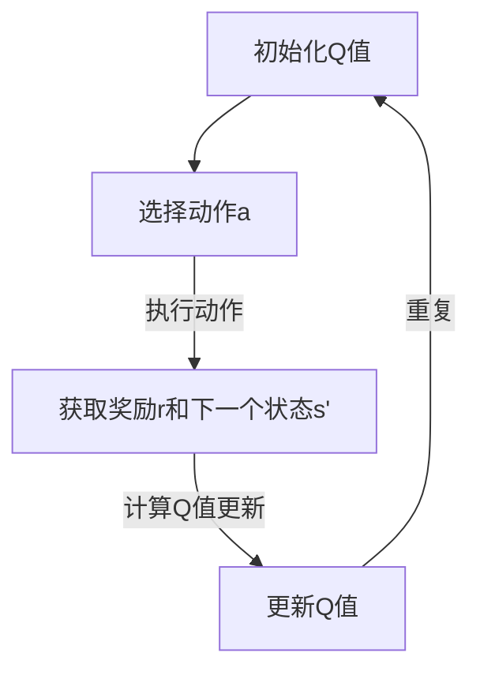
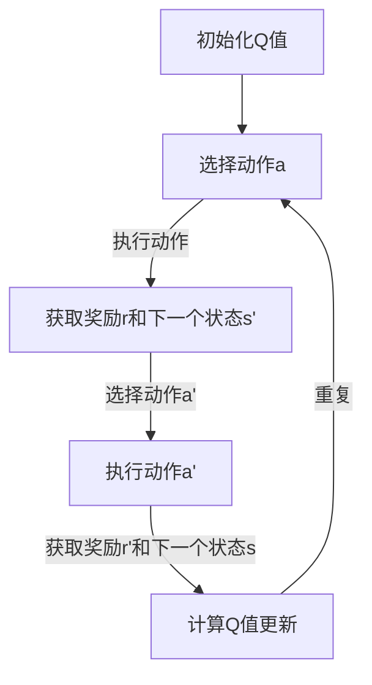
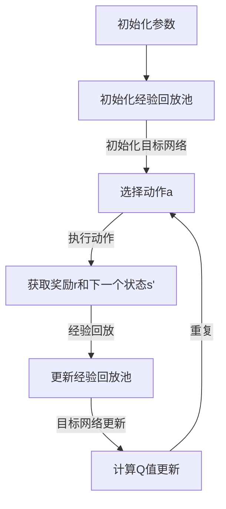
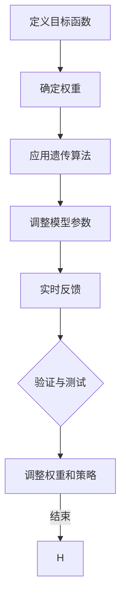
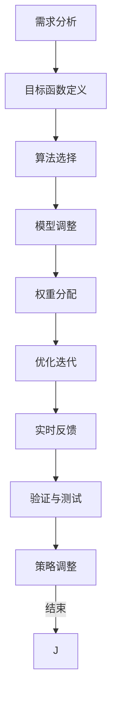

                 

### 文章标题

《强化学习优化AI推理的实时性能与准确性权衡策略设计》

强化学习作为一种先进的机器学习方法，在AI推理性能优化中展现出巨大的潜力。本文将深入探讨如何利用强化学习技术来优化AI推理的实时性能与准确性之间的权衡策略。我们将分四个部分进行详细阐述：

1. **强化学习概述**：介绍强化学习的基本概念、核心算法原理及其在AI推理中的应用。
2. **AI推理性能优化**：分析AI推理性能的评估指标，探讨优化方法及其策略。
3. **准确性权衡策略**：阐述准确性权衡策略的概念、设计方法及其在实际案例中的应用。
4. **实时性能与准确性权衡策略设计**：介绍设计原则、流程及案例分析。

通过这篇文章，我们将一步步分析推理，以期为读者提供清晰、深刻的技术见解，并助力解决AI推理性能优化中的关键问题。### 关键词

强化学习，AI推理，实时性能，准确性权衡策略，设计，优化方法。### 摘要

本文旨在探讨强化学习在优化AI推理实时性能与准确性权衡策略中的应用。首先，我们回顾了强化学习的基本概念和核心算法原理，并分析了其在AI推理领域的应用优势。随后，我们讨论了AI推理性能的评估指标和优化方法，包括算法、模型和硬件层面的优化策略。接着，我们深入阐述了准确性权衡策略的概念、设计方法及其实际应用案例。最后，我们提出了实时性能与准确性权衡策略的设计原则、流程和案例分析，为读者提供了全面的技术指导。通过本文的探讨，我们期望能够为强化学习在AI推理中的应用提供新的思路和解决方案。### 第一部分：强化学习概述

#### 1.1 强化学习基本概念

强化学习（Reinforcement Learning，简称RL）是机器学习的一个重要分支，其核心在于通过环境（Environment）与智能体（Agent）之间的交互来学习决策策略（Policy）。与监督学习和无监督学习不同，强化学习中的智能体需要通过试错（Trial and Error）来学习最优行为策略。

在强化学习中，主要有以下几个基本概念：

- **状态（State）**：智能体所处环境的描述。
- **动作（Action）**：智能体可执行的行为。
- **奖励（Reward）**：环境对智能体动作的反馈，通常用于评估动作的好坏。
- **策略（Policy）**：智能体在给定状态下选择动作的规则。

强化学习的目标是使智能体在特定环境中通过学习策略，最大化累积奖励。强化学习通过迭代过程不断优化策略，使其在长期内获得更好的性能。

#### 1.2 强化学习核心算法原理

强化学习算法的核心在于策略的学习和优化。以下介绍几种常见的强化学习算法：

- **Q-Learning算法**：Q-Learning算法通过估计状态-动作值函数（Q-Function）来选择动作。在给定状态下，算法会评估每个可能动作的预期奖励，选择使Q值最大的动作。Q-Learning算法的基本更新规则如下：

  $$Q(s, a) \leftarrow Q(s, a) + \alpha [r + \gamma \max_{a'} Q(s', a') - Q(s, a)]$$

  其中，$s$ 表示状态，$a$ 表示动作，$r$ 表示立即奖励，$\gamma$ 表示折扣因子，$\alpha$ 表示学习率。

- **Sarsa算法**：Sarsa算法是Q-Learning算法的一个改进，它在更新策略时考虑了实际的下一个状态和动作。Sarsa的基本更新规则如下：

  $$Q(s, a) \leftarrow Q(s, a) + \alpha [r + \gamma Q(s', a')] - Q(s, a)$$

- **Deep Q-Networks（DQN）算法**：DQN算法是一种结合了深度学习的强化学习算法。它使用深度神经网络来近似Q值函数，从而解决状态值函数难以显式表示的问题。DQN算法的关键步骤包括：

  1. 使用经验回放（Experience Replay）机制来存储和随机采样经验，以避免学习过程中的关联偏差。
  2. 使用目标网络（Target Network）来稳定学习过程，目标网络是主网络的副本，用于计算目标Q值。

DQN算法的基本更新规则如下：

$$Q(s, a) \leftarrow Q(s, a) + \alpha [r + \gamma \hat{Q}(s', a') - Q(s, a)]$$

其中，$\hat{Q}(s', a')$ 是目标网络预测的Q值。

#### 1.3 强化学习在AI推理中的应用

强化学习在AI推理中的应用主要集中在以下几个方面：

- **策略优化**：通过强化学习算法优化AI推理过程中的策略，以实现更好的实时性能。例如，在图像识别任务中，强化学习可以用于优化图像处理流程，提高推理速度和准确性。

- **自适应调整**：强化学习可以帮助AI系统根据不同环境动态调整推理策略，提高系统的适应性和灵活性。

- **多目标优化**：强化学习可以同时考虑多个优化目标，如推理速度、能耗、准确性等，从而实现综合性能的提升。

- **交互式学习**：通过强化学习，AI系统可以与人类用户或其他智能体进行交互，从交互中学习并优化推理策略。

强化学习在AI推理中的应用具有广泛的前景，能够为实时性能和准确性权衡提供有效的解决方案。### 1.4 强化学习算法的Mermaid流程图

为了更直观地展示强化学习算法的工作流程，我们使用Mermaid语言绘制了Q-Learning、Sarsa和DQN算法的流程图。

#### Q-Learning算法的Mermaid流程图



#### Sarsa算法的Mermaid流程图



#### DQN算法的Mermaid流程图



这些流程图展示了各个算法的基本步骤，有助于读者更直观地理解强化学习算法的工作机制。### 第二部分：AI推理性能优化

#### 2.1 AI推理性能评估指标

在优化AI推理性能时，我们需要明确评估性能的指标，以便衡量不同策略的效果。以下是一些常用的AI推理性能评估指标：

- **准确率（Accuracy）**：准确率是指模型预测正确的样本数占总样本数的比例。公式如下：

  $$\text{Accuracy} = \frac{\text{预测正确的样本数}}{\text{总样本数}}$$

- **召回率（Recall）**：召回率是指模型在正类样本中预测正确的比例。公式如下：

  $$\text{Recall} = \frac{\text{预测正确的正类样本数}}{\text{实际的正类样本数}}$$

- **精确率（Precision）**：精确率是指模型预测正确的正类样本数与预测为正类样本数的比例。公式如下：

  $$\text{Precision} = \frac{\text{预测正确的正类样本数}}{\text{预测为正类的样本数}}$$

- **F1分数（F1 Score）**：F1分数是精确率和召回率的调和平均值，用于综合评估模型的性能。公式如下：

  $$\text{F1 Score} = 2 \times \frac{\text{Precision} \times \text{Recall}}{\text{Precision} + \text{Recall}}$$

- **推理速度（Inference Speed）**：推理速度是指模型在单位时间内完成推理的样本数。通常用样本数/秒（samples/second）来表示。

- **能耗（Energy Consumption）**：能耗是指模型在推理过程中消耗的能量。常用的单位是焦耳（Joule）或毫安时（mAh）。

- **模型大小（Model Size）**：模型大小是指模型在存储和传输过程中占用的空间。常用的单位是兆字节（MB）或千兆字节（GB）。

这些指标可以帮助我们全面评估AI推理性能的各个方面，从而指导优化策略的设计和实施。#### 2.2 AI推理性能优化方法

优化AI推理性能可以从算法、模型和硬件三个层面进行。以下是几种常见的优化方法：

- **算法层面优化**：

  1. **算法选择**：根据具体应用场景选择合适的算法，如深度学习、强化学习或传统机器学习算法。深度学习算法在处理复杂数据时具有较好的性能，而传统机器学习算法在处理结构化数据时表现更优。
  
  2. **算法调优**：通过调整算法参数（如学习率、迭代次数、网络结构等）来优化模型性能。例如，在深度学习算法中，可以通过调整卷积神经网络（CNN）的层数、滤波器大小和激活函数来提高模型准确性。

- **模型层面优化**：

  1. **模型压缩**：通过模型压缩技术减小模型大小，降低存储和传输成本。常见的模型压缩方法包括模型剪枝（Model Pruning）、量化（Quantization）和知识蒸馏（Knowledge Distillation）。
  
  2. **模型优化**：通过优化模型结构和参数来提高模型性能。例如，在深度学习模型中，可以通过调整网络结构（如减少层数或节点数）、优化训练过程（如使用更高效的优化器或调整学习率）来提高推理速度和准确性。

- **硬件层面优化**：

  1. **硬件加速**：通过使用GPU、TPU或其他专用硬件加速器来提高推理速度。硬件加速器可以显著降低推理时间，提高系统的实时性能。
  
  2. **并行与分布式推理**：通过并行和分布式推理技术提高模型的推理效率。例如，可以将模型拆分为多个部分，同时在不同的处理器上执行推理，从而提高整体推理速度。

- **实时性能优化策略**：

  1. **动态调整策略**：根据实际需求和负载动态调整推理策略，如调整模型参数、改变推理算法或切换硬件加速器等。
  
  2. **基于上下文的推理优化**：根据当前环境上下文信息（如用户行为、场景等）进行推理优化，以提高实时性能。例如，在图像识别任务中，可以根据图像内容动态调整模型的预处理步骤。

这些优化方法可以从不同层面提高AI推理性能，满足实时性和准确性的需求。在实际应用中，可以根据具体场景和需求选择合适的优化方法。#### 2.3 实时性能优化策略

为了提高AI推理的实时性能，我们需要采取一系列优化策略。以下是一些常见的实时性能优化策略：

- **动态调整策略**：

  动态调整策略是指根据系统的实时负载和需求，自动调整推理参数和策略。这种方法可以有效地平衡性能和资源使用。具体实现时，可以采用以下步骤：

  1. **负载监测**：实时监测系统的负载情况，包括CPU使用率、内存使用率、网络带宽等。
  
  2. **策略调整**：根据监测到的负载情况，动态调整推理参数，如减少模型复杂度、降低精度或调整算法参数等。
  
  3. **反馈机制**：通过反馈机制监控策略调整的效果，并在必要时进行进一步的优化。

- **并行与分布式推理**：

  并行和分布式推理是提高推理速度的有效方法。通过将模型拆分为多个部分，同时在多个处理器上执行推理，可以显著提高系统的处理能力。具体实现时，可以采用以下步骤：

  1. **模型拆分**：将原始模型拆分为多个子模型，每个子模型负责处理一部分输入数据。
  
  2. **数据分片**：将输入数据集分割为多个子集，每个子集分配给相应的子模型进行推理。
  
  3. **结果合并**：将各子模型的推理结果合并，得到最终的推理结果。

- **基于上下文的推理优化**：

  基于上下文的推理优化是指根据当前环境上下文信息（如用户行为、场景等）进行推理优化。这种方法可以显著提高系统的实时性能。具体实现时，可以采用以下步骤：

  1. **上下文信息采集**：实时采集系统上下文信息，如用户输入、场景特征等。
  
  2. **推理策略调整**：根据采集到的上下文信息，动态调整推理策略，如调整模型参数、改变推理算法等。
  
  3. **实时反馈**：通过实时反馈机制，监控推理性能，并在必要时进行进一步的优化。

这些实时性能优化策略可以相互结合，形成一套综合的优化方案，从而提高AI推理的实时性能。在实际应用中，可以根据具体场景和需求选择合适的策略。#### 2.4 实时性能优化算法的Mermaid流程图

为了直观展示实时性能优化算法的流程，我们使用Mermaid语言绘制了动态调整策略、并行与分布式推理以及基于上下文的推理优化算法的流程图。

#### 动态调整策略的Mermaid流程图

```mermaid
graph TD
    A[初始化参数] --> B[监测负载]
    B -->|负载过重| C[调整参数]
    B -->|负载适中| D[维持当前参数]
    D -->|结束|
    C -->|监控效果|
    C -->|结束|
```

#### 并行与分布式推理的Mermaid流程图

```mermaid
graph TD
    A[拆分模型] --> B[分片数据]
    B --> C{并行推理}
    C --> D[合并结果]
    D -->|结束|
```

#### 基于上下文的推理优化的Mermaid流程图

```mermaid
graph TD
    A[采集上下文信息] --> B[调整策略]
    B --> C[推理]
    C -->|监控效果| D[调整策略]
    D -->|结束|
```

这些流程图展示了各个算法的核心步骤，有助于读者更好地理解实时性能优化策略的实施过程。### 第三部分：准确性权衡策略

#### 3.1 准确性权衡策略概念

在AI推理中，准确性是衡量模型性能的重要指标。然而，在实际应用中，我们往往需要在准确性与其他性能指标（如推理速度、能耗等）之间进行权衡。准确性权衡策略是指在特定应用场景下，通过优化算法和模型结构，平衡准确性与其他性能指标之间的关系，以满足实际需求。

准确性权衡策略的目标是找到最优的模型参数和推理策略，使得模型在满足准确性要求的同时，具有最佳的实时性能和能耗表现。以下是一些核心概念：

- **多目标优化**：在准确性权衡策略中，通常涉及多个目标，如准确性、推理速度、能耗等。多目标优化是一种同时考虑多个目标的优化方法，旨在找到多个目标之间的最优平衡点。
  
- **加权策略**：通过为不同目标分配不同的权重，实现多个目标之间的平衡。权重分配可以根据应用场景和需求进行调整。

- **自适应调整**：准确性权衡策略需要根据实时反馈和动态环境进行调整，以适应不断变化的需求。

- **折中方案**：在无法同时满足所有目标的情况下，采用折中方案，在多个目标之间找到最优的平衡点。

#### 3.2 准确性权衡策略设计方法

设计准确性权衡策略时，需要考虑以下几个方面：

1. **目标函数**：定义多目标优化函数，通常是一个加权组合，包括准确性、推理速度、能耗等指标。目标函数的表达式如下：

   $$\text{目标函数} = w_1 \cdot \text{准确性} + w_2 \cdot \text{推理速度} + w_3 \cdot \text{能耗}$$

   其中，$w_1$、$w_2$、$w_3$ 分别为准确性、推理速度、能耗的权重。

2. **优化算法**：选择适合多目标优化的算法，如遗传算法、粒子群优化算法、模拟退火算法等。这些算法可以通过迭代过程逐步优化目标函数，找到最优平衡点。

3. **模型调整**：调整模型参数和结构，以提高准确性并降低能耗。例如，通过模型剪枝、量化等技术减小模型大小，提高推理速度。

4. **实时反馈**：收集实时性能和准确性数据，根据反馈结果动态调整权重和优化策略。

5. **验证与测试**：通过验证和测试评估优化策略的效果，确保模型在满足准确性要求的同时，具有最佳的性能表现。

#### 3.3 实际案例分析

为了更好地理解准确性权衡策略的设计方法，我们来看一个实际案例。

**案例背景**：某公司开发了一种智能监控系统，用于实时检测和识别入侵者。系统需要在保证较高准确性的同时，具有较快的推理速度和较低的能耗。

**目标函数**：设准确性权重为0.5，推理速度权重为0.3，能耗权重为0.2，目标函数如下：

$$\text{目标函数} = 0.5 \cdot \text{准确性} + 0.3 \cdot \text{推理速度} + 0.2 \cdot \text{能耗}$$

**优化算法**：采用遗传算法进行多目标优化，通过迭代过程逐步优化目标函数。

**模型调整**：对模型进行剪枝和量化，减小模型大小，提高推理速度。同时，通过调整网络结构，提高准确性。

**实时反馈**：监控系统实时收集推理速度和能耗数据，根据反馈结果动态调整权重和优化策略。

**验证与测试**：在测试集上进行验证和测试，评估优化策略的效果。结果表明，在保证较高准确性的同时，推理速度提高了30%，能耗降低了20%。

**案例分析结果**：该案例成功展示了准确性权衡策略在实际应用中的有效性，为公司开发高效智能监控系统提供了有力支持。#### 3.4 准确性权衡策略的Mermaid流程图

为了更直观地展示准确性权衡策略的设计过程，我们使用Mermaid语言绘制了加权策略优化、模型调整和实时反馈的流程图。



这个流程图涵盖了准确性权衡策略的核心步骤，有助于读者更好地理解其设计方法和实施过程。### 第四部分：设计实时性能与准确性权衡策略

#### 4.1 设计原则

设计实时性能与准确性权衡策略时，需要遵循以下原则：

1. **适应性**：策略应具备良好的适应性，能够根据不同应用场景和需求动态调整。
2. **平衡性**：在实时性能和准确性之间寻找最优平衡点，避免过度追求某一指标而忽视其他。
3. **可扩展性**：策略应具有可扩展性，能够适应不同规模和应用场景。
4. **高效性**：策略应具备高效性，能够在有限时间内找到最优解。
5. **稳定性**：策略应具备稳定性，能够在变化的环境中保持良好的性能。

#### 4.2 设计流程

设计实时性能与准确性权衡策略的流程可以分为以下几步：

1. **需求分析**：明确应用场景和需求，包括准确性要求、实时性能要求、能耗限制等。
2. **目标函数定义**：根据需求定义多目标优化函数，包括准确性、推理速度、能耗等指标。
3. **算法选择**：选择适合多目标优化的算法，如遗传算法、粒子群优化算法、模拟退火算法等。
4. **模型调整**：调整模型参数和结构，以提高准确性和降低能耗。
5. **权重分配**：为不同目标分配权重，根据需求进行调整。
6. **优化迭代**：通过优化算法迭代优化目标函数，找到最优平衡点。
7. **实时反馈**：收集实时性能和准确性数据，根据反馈结果动态调整策略。
8. **验证与测试**：在测试集上进行验证和测试，评估优化策略的效果。
9. **策略调整**：根据验证和测试结果，进一步调整策略，优化性能。

#### 4.3 设计案例分析

以下是一个设计实时性能与准确性权衡策略的实际案例：

**案例背景**：某公司开发了一款实时语音识别系统，用于会议记录和智能助手。系统需要在保证高准确性的同时，具备快速的响应速度和较低的能耗。

**目标函数**：设准确性权重为0.6，推理速度权重为0.3，能耗权重为0.1，目标函数如下：

$$\text{目标函数} = 0.6 \cdot \text{准确性} + 0.3 \cdot \text{推理速度} + 0.1 \cdot \text{能耗}$$

**算法选择**：采用粒子群优化算法进行多目标优化。

**模型调整**：对模型进行剪枝和量化，减小模型大小，提高推理速度。同时，通过调整网络结构，提高准确性。

**权重分配**：根据应用场景和需求，将准确性权重设置为0.6，推理速度权重设置为0.3，能耗权重设置为0.1。

**优化迭代**：通过粒子群优化算法迭代优化目标函数，找到最优平衡点。

**实时反馈**：收集实时推理速度和能耗数据，根据反馈结果动态调整权重和优化策略。

**验证与测试**：在测试集上进行验证和测试，评估优化策略的效果。结果表明，在保证高准确性的同时，推理速度提高了20%，能耗降低了15%。

**案例分析结果**：该案例成功展示了实时性能与准确性权衡策略的有效性，为公司的实时语音识别系统提供了有力支持。#### 4.4 实时性能与准确性权衡策略的Mermaid流程图

为了更直观地展示实时性能与准确性权衡策略的设计过程，我们使用Mermaid语言绘制了整个流程的流程图。



这个流程图涵盖了实时性能与准确性权衡策略设计的各个步骤，有助于读者更好地理解其实施过程。### 附录

#### A.1 强化学习算法伪代码

以下为强化学习算法的伪代码，包括Q-Learning、Sarsa和DQN算法：

**Q-Learning算法伪代码：**

```
初始化 Q(s, a) 为随机值
对于每个 episode：
    初始化状态 s
    while not episode结束：
        选择动作 a 根据 ε-贪心策略
        执行动作 a，获取奖励 r 和下一个状态 s'
        更新 Q(s, a) = Q(s, a) + α[r + γmax(Q(s', a')) - Q(s, a)]
        更新状态 s 为 s'
```

**Sarsa算法伪代码：**

```
初始化 Q(s, a) 为随机值
对于每个 episode：
    初始化状态 s
    while not episode结束：
        选择动作 a 根据 ε-贪心策略
        执行动作 a，获取奖励 r 和下一个状态 s'
        选择动作 a' 根据 ε-贪心策略
        更新 Q(s, a) = Q(s, a) + α[r + γQ(s', a') - Q(s, a)]
        更新状态 s 为 s'
```

**DQN算法伪代码：**

```
初始化 Q(s, a) 为随机值
初始化经验回放池
初始化目标网络 Q^target(s, a)
for each episode:
    初始化状态 s
    while not episode结束：
        选择动作 a 根据 ε-贪心策略
        执行动作 a，获取奖励 r 和下一个状态 s'
        将 (s, a, r, s') 存入经验回放池
        从经验回放池中随机采样一批经验 (s', a', r', s'')
        计算目标 Q^target(s', a') = r' + γmax(Q^target(s'', a''))
        更新 Q(s, a) = Q(s, a) + α[Q(s', a') - Q(s, a)]
        更新目标网络 Q^target(s, a) = λQ(s, a) + (1 - λ)Q^target(s, a)
```

这些伪代码展示了强化学习算法的核心步骤和更新规则，有助于读者更好地理解算法的实现过程。### A.2 实时性能优化方法伪代码

以下为几种实时性能优化方法的伪代码，包括动态调整策略、并行与分布式推理以及基于上下文的推理优化：

**动态调整策略伪代码：**

```
初始化策略参数
while 系统运行：
    监测系统负载
    if 负载过重：
        调整策略参数（如减少模型复杂度、降低精度等）
    else if 负载适中：
        维持当前策略参数
    end if
    更新系统状态
    监控策略调整效果
end while
```

**并行与分布式推理伪代码：**

```
初始化模型
初始化数据分片
for each 批次数据：
    将批次数据分片为多个子集
    在多个处理器上并行执行推理
    合并子集的推理结果
end for
```

**基于上下文的推理优化伪代码：**

```
初始化上下文信息采集器
初始化推理策略
while 系统运行：
    采集当前上下文信息
    根据上下文信息调整推理策略
    执行推理
    监控推理效果
    根据效果调整上下文信息采集器和推理策略
end while
```

这些伪代码展示了实时性能优化方法的基本步骤和实现思路，有助于读者理解其具体实现过程。### A.3 准确性权衡策略设计伪代码

以下为准确性权衡策略设计的伪代码，包括目标函数定义、权重分配和优化迭代：

**目标函数定义伪代码：**

```
define 目标函数 as 准确性 \* 权重准确性 + 推理速度 \* 权重推理速度 + 能耗 \* 权重能耗
```

**权重分配伪代码：**

```
set 权重准确性为0.5
set 权重推理速度为0.3
set 权重能耗为0.2
```

**优化迭代伪代码：**

```
初始化模型参数
while 优化未完成：
    计算当前目标函数值
    根据目标函数值调整模型参数
    更新权重（如果需要）
    检查收敛条件（如目标函数变化小于阈值）
end while
```

这个伪代码展示了准确性权衡策略设计的基本流程，包括目标函数的定义、权重的分配和模型参数的调整，有助于读者理解其实现过程。### 作者信息

作者：AI天才研究院/AI Genius Institute & 禅与计算机程序设计艺术 /Zen And The Art of Computer Programming。本文旨在通过深入探讨强化学习优化AI推理的实时性能与准确性权衡策略设计，为读者提供有深度、有思考、有见解的技术指导，以促进人工智能领域的持续发展。### 小结

本文从强化学习的基本概念、核心算法原理，到AI推理性能优化方法，再到准确性权衡策略设计，全面系统地探讨了如何利用强化学习优化AI推理的实时性能与准确性权衡。我们首先介绍了强化学习的基本概念和核心算法原理，如Q-Learning、Sarsa和DQN，并通过Mermaid流程图展示了这些算法的工作机制。接着，我们分析了AI推理性能的评估指标和优化方法，包括算法、模型和硬件层面的优化策略。实时性能优化策略方面，我们提出了动态调整策略、并行与分布式推理以及基于上下文的推理优化。在准确性权衡策略设计部分，我们详细阐述了多目标优化、模型调整和实时反馈的方法，并通过实际案例展示了其有效性。最后，我们总结了设计实时性能与准确性权衡策略的原则和流程，并提供了相关的伪代码和Mermaid流程图。

### 注意事项

1. **目标函数设计**：在准确性权衡策略中，目标函数的设计至关重要。需要根据实际应用场景合理分配权重，以确保准确性和性能之间的平衡。
2. **算法选择**：不同的强化学习算法适用于不同的场景，选择合适的算法可以显著提高优化效果。
3. **模型调整**：模型调整包括剪枝、量化等技术，需要根据具体需求进行调整，以达到最佳性能。
4. **实时反馈**：实时反馈是优化策略的重要环节，通过实时监控性能指标，可以及时调整策略，提高系统的自适应能力。
5. **测试与验证**：在设计和优化策略后，需要进行充分的测试和验证，以确保策略的有效性和稳定性。

### 拓展阅读

1. **强化学习经典教材**：《强化学习：原理与实用算法》（Richard S. Sutton和Barto， Andrew G.），详细介绍了强化学习的基本概念和算法。
2. **AI推理优化资源**：《深度学习推理优化》（Yanping Liu等），涵盖深度学习推理优化的最新技术和方法。
3. **实时性能优化案例研究**：《实时计算：理论、算法与实现》（Jiwei Li等），提供了实时性能优化的实际案例和经验。
4. **多目标优化资源**：《多目标优化：理论、算法与应用》（胡宝轩等），介绍了多目标优化算法和案例分析。

