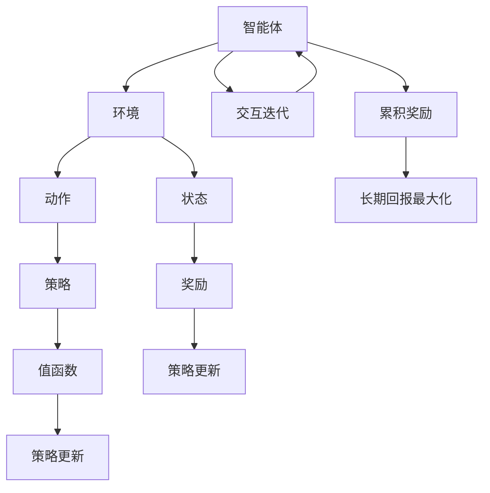

                 

### 文章标题

《强化学习优化AI推理的长期回报最大化》

强化学习（Reinforcement Learning, RL）作为一种人工智能的核心方法，近年来在游戏、机器人、自动驾驶等领域取得了显著的成果。AI推理（AI Inference）作为AI系统中的关键环节，直接影响着系统的响应速度和准确性。本文将深入探讨如何通过强化学习优化AI推理，实现长期回报的最大化。

本文将分为以下几个部分：

1. **强化学习基础**：介绍强化学习的基本概念和原理。
2. **AI推理基础**：介绍AI推理的基本概念和原理。
3. **强化学习优化AI推理方法**：详细解析强化学习优化AI推理的核心算法原理。
4. **长期回报最大化策略**：探讨如何制定长期回报最大化的策略。
5. **应用案例**：通过实际案例展示强化学习优化AI推理的应用效果。
6. **总结与展望**：总结本文的主要观点，并对未来的发展方向进行展望。

本文将使用markdown格式进行撰写，以实现清晰、易懂的内容结构。我们将通过逐步分析推理（reasoning step by step）的方式，深入探讨强化学习优化AI推理的长期回报最大化。希望本文能为您提供有价值的见解和思考。

---

#### 关键词

- 强化学习
- AI推理
- 长期回报最大化
- 值函数
- 策略优化
- 混合方法
- 应用案例

---

#### 摘要

本文旨在探讨如何通过强化学习优化AI推理，实现长期回报的最大化。首先，我们介绍了强化学习和AI推理的基本概念，并分析了它们之间的联系。接着，我们详细解析了强化学习优化AI推理的核心算法原理，包括基于值函数的方法、基于策略的方法和混合方法。然后，我们探讨了如何制定长期回报最大化的策略，并通过实际案例展示了强化学习优化AI推理的应用效果。最后，我们总结了本文的主要观点，并对未来的发展方向进行了展望。本文旨在为读者提供一个系统、深入的强化学习优化AI推理的指南。

---

# 第1章 引言

强化学习（Reinforcement Learning, RL）作为机器学习的一种重要方法，近年来在人工智能领域取得了显著的成果。它的核心思想是通过与环境不断交互，学习出一个最优策略，从而实现长期回报的最大化。而AI推理（AI Inference）作为AI系统中的关键环节，直接影响着系统的响应速度和准确性。强化学习与AI推理的结合，为优化AI推理提供了新的思路。

## 1.1 强化学习概述

强化学习是一种基于奖励反馈的学习方法，其核心目标是学习一个策略，使得在给定环境中能够最大化累积奖励。与监督学习和无监督学习不同，强化学习中的数据并非直接提供，而是通过环境与智能体（Agent）的交互过程逐渐学习得到的。

### 1.1.1 基本概念

在强化学习中，主要包含以下几个核心概念：

1. **状态（State）**：描述智能体所处的环境状态。
2. **动作（Action）**：智能体可以采取的行动。
3. **策略（Policy）**：智能体根据状态采取的动作。
4. **值函数（Value Function）**：评估策略优劣的函数。
5. **奖励（Reward）**：环境对智能体动作的反馈。

### 1.1.2 强化学习架构

强化学习通常包括以下几个步骤：

1. **初始化**：设定智能体的初始状态和策略。
2. **交互**：智能体根据当前状态采取动作，并接收环境反馈的奖励。
3. **更新策略**：基于奖励反馈，调整策略，使得长期回报最大化。
4. **迭代**：重复执行交互和更新策略的过程，直至达到预期效果。

## 1.2 AI推理概述

AI推理是人工智能系统在处理输入数据时，根据已有知识和模型进行推理和决策的过程。AI推理的核心目标是提高系统的响应速度和准确性，以满足实际应用的需求。

### 1.2.1 基本概念

在AI推理中，主要包含以下几个核心概念：

1. **模型（Model）**：用于表示和描述问题的数学模型。
2. **输入（Input）**：输入给模型的原始数据。
3. **输出（Output）**：模型根据输入数据生成的推理结果。
4. **推理过程（Inference Process）**：从输入到输出的整个过程。

### 1.2.2 AI推理架构

AI推理通常包括以下几个步骤：

1. **预处理**：对输入数据进行预处理，包括数据清洗、格式转换等。
2. **模型加载**：加载预训练好的模型。
3. **推理计算**：模型根据输入数据进行推理计算，生成输出结果。
4. **后处理**：对输出结果进行后处理，如结果解释、可视化等。

## 1.3 强化学习与AI推理的关系

强化学习和AI推理之间存在着密切的联系。强化学习通过不断与环境交互，学习出一个最优策略，从而优化AI推理的过程。具体来说，强化学习可以用于以下几个方面：

1. **策略优化**：通过强化学习优化AI推理的策略，提高推理的准确性和效率。
2. **模型优化**：通过强化学习优化AI推理的模型，提高模型的泛化能力和适应性。
3. **数据增强**：通过强化学习生成具有挑战性的数据集，用于训练AI推理模型。

总之，强化学习与AI推理的结合，为人工智能的发展提供了新的动力。通过本文的进一步探讨，我们将深入理解强化学习优化AI推理的原理和方法，并为实际应用提供指导。

### 第2章 强化学习基础

强化学习（Reinforcement Learning, RL）作为机器学习的一个重要分支，近年来在人工智能领域取得了显著的成果。强化学习的核心思想是通过与环境不断交互，学习出一个最优策略，从而实现长期回报的最大化。本章将详细介绍强化学习的基本概念、基本原理、架构和常见算法。

## 2.1 基本概念

强化学习涉及以下几个基本概念：

### 2.1.1 智能体（Agent）

智能体是强化学习中的主体，它代表了一个可以与环境进行交互的实体。智能体的目标是学习一个策略，以最大化累积奖励。

### 2.1.2 环境（Environment）

环境是智能体所处的上下文，它可以感知智能体的动作并给予相应的反馈。环境通常是一个状态空间和动作空间的组合。

### 2.1.3 状态（State）

状态是描述环境当前状态的变量集合。智能体在执行动作前需要评估当前状态，以决定下一步的动作。

### 2.1.4 动作（Action）

动作是智能体在某一状态下可以采取的行动。智能体的目标是选择一个动作，以最大化长期回报。

### 2.1.5 策略（Policy）

策略是智能体在某一状态下采取的动作映射。策略决定了智能体的行为方式，是一个从状态到动作的映射函数。

### 2.1.6 奖励（Reward）

奖励是环境对智能体动作的即时反馈。奖励可以是正的（表示奖励）或负的（表示惩罚），它会影响智能体的行为。

### 2.1.7 值函数（Value Function）

值函数是一个评估策略优劣的函数。它给出了智能体在某一状态下采取某一策略所能获得的期望回报。

## 2.2 基本原理

强化学习的基本原理是通过迭代过程，不断更新智能体的策略，以实现长期回报的最大化。强化学习的迭代过程通常包括以下几个步骤：

1. **初始状态**：智能体开始于一个初始状态。
2. **选择动作**：智能体根据当前状态和策略选择一个动作。
3. **执行动作**：智能体执行所选动作，并更新环境状态。
4. **接收奖励**：环境根据智能体执行的动作给予奖励。
5. **更新策略**：智能体根据奖励和历史经验调整策略。
6. **重复迭代**：重复执行上述步骤，直到达到预期目标或满足停止条件。

## 2.3 强化学习架构

强化学习架构可以分为以下几个层次：

1. **环境层**：环境层负责生成状态和奖励，并接收智能体的动作。
2. **智能体层**：智能体层负责选择动作、更新策略和计算值函数。
3. **策略层**：策略层定义了智能体的行为方式，是一个从状态到动作的映射函数。
4. **值函数层**：值函数层用于评估策略的优劣，提供了关于策略的期望回报信息。

## 2.4 常见算法

强化学习算法可以分为基于值函数的方法、基于策略的方法和混合方法。下面分别介绍这些算法。

### 2.4.1 基于值函数的方法

基于值函数的方法通过学习值函数来评估策略的优劣，然后根据值函数更新策略。常见的基于值函数的方法包括：

1. **Q-Learning**：Q-Learning通过学习Q值函数来评估每个动作在当前状态下的预期回报。Q-Learning的基本更新公式如下：

   $$ Q(s, a) \leftarrow Q(s, a) + \alpha [r + \gamma \max_{a'} Q(s', a') - Q(s, a)] $$

   其中，$s$和$a$分别表示当前状态和动作，$r$表示奖励，$\gamma$表示折扣因子，$\alpha$表示学习率。

2. **Deep Q-Networks (DQN)**：DQN是基于深度学习的Q-Learning方法，它使用神经网络来近似Q值函数。DQN的基本更新过程如下：

   $$ Q(s, a) \leftarrow Q(s, a) + \alpha [r + \gamma \max_{a'} \hat{Q}(s', a') - Q(s, a)] $$

   其中，$\hat{Q}(s', a')$表示神经网络的输出。

### 2.4.2 基于策略的方法

基于策略的方法直接学习策略，通过优化策略来最大化长期回报。常见的基于策略的方法包括：

1. **Policy Gradient Methods**：Policy Gradient Methods通过直接优化策略的梯度来更新策略。常见的方法包括REINFORCE和PPO（Proximal Policy Optimization）。REINFORCE的基本更新公式如下：

   $$ \theta \leftarrow \theta + \alpha R \nabla_\theta \log \pi_\theta(s, a) $$

   其中，$\theta$表示策略参数，$R$表示回报，$\log \pi_\theta(s, a)$表示策略的梯度。

2. **Actor-Critic Methods**：Actor-Critic Methods结合了策略优化和值函数估计，通过同时更新策略和价值函数来优化策略。常见的Actor-Critic方法包括A3C（Asynchronous Advantage Actor-Critic）和DQN。

### 2.4.3 混合方法

混合方法结合了基于值函数和基于策略的方法，以实现更好的性能。常见的混合方法包括：

1. **Deep Deterministic Policy Gradients (DDPG)**：DDPG结合了策略优化和价值函数估计，使用深度神经网络来近似策略和价值函数。
2. **Trust Region Policy Optimization (TRPO)**：TRPO通过优化策略梯度来更新策略，同时使用信任区域方法来保证策略更新的稳定性。

通过本章的介绍，我们了解了强化学习的基本概念、原理、架构和常见算法。在接下来的章节中，我们将进一步探讨AI推理的基础知识和如何将强化学习应用于优化AI推理。

## 2.5 强化学习的关键概念与联系

为了更深入地理解强化学习，我们需要分析其核心概念之间的关系。以下是一个基于Mermaid绘制的流程图，展示了强化学习中的关键概念及其相互联系：



### 关键概念解释

1. **智能体（Agent）**：智能体是执行行动并学习策略的主体。它通过观察环境状态，选择合适的动作，并接收环境反馈的奖励。
2. **环境（Environment）**：环境是智能体所处的上下文，它提供状态和奖励，并影响智能体的行为。
3. **状态（State）**：状态是描述环境当前状态的信息集合，智能体需要根据状态来决定下一步的动作。
4. **动作（Action）**：动作是智能体可以采取的行动，每个动作都可能导致不同的状态变化和奖励。
5. **策略（Policy）**：策略是智能体在给定状态下选择动作的规则。策略决定了智能体的行为方式。
6. **值函数（Value Function）**：值函数评估智能体在特定状态下采取特定策略所能获得的期望回报。值函数分为状态值函数和动作值函数。
7. **奖励（Reward）**：奖励是环境对智能体动作的即时反馈，用于指导智能体的学习过程。
8. **策略更新（Policy Update）**：智能体根据奖励和历史经验不断调整策略，以实现长期回报的最大化。
9. **交互迭代（Interaction Iteration）**：智能体和环境通过不断交互，积累经验，并更新策略。
10. **累积奖励（Cumulative Reward）**：累积奖励是智能体在一段时间内获得的奖励总和，用于评估策略的长期效果。
11. **长期回报最大化（Long-term Reward Maximization）**：智能体的目标是学习一个最优策略，以实现长期回报的最大化。

### 流程图说明

- 智能体（A）和环境（B）是强化学习的核心组成部分，它们通过状态（C）、动作（D）和奖励（G）进行交互。
- 策略（E）和值函数（F）是基于状态（C）和动作（D）学习得到的，用于指导智能体的行为。
- 奖励（G）不仅影响当前的行为选择，还通过策略更新（H）和值函数更新（I）影响未来的行为。
- 交互迭代（J）是强化学习的主要过程，智能体通过不断与环境交互，逐步优化策略和值函数。
- 累积奖励（K）和长期回报最大化（L）是评估策略优劣的重要指标。

通过这个流程图，我们可以清晰地看到强化学习中的核心概念及其相互关系，有助于我们更好地理解和应用强化学习。

### 第3章 AI推理基础

AI推理（AI Inference）是人工智能系统中用于处理输入数据并生成输出结果的核心环节。它依赖于预训练好的模型，通过推理过程对输入数据进行预测或分类。AI推理的效率和准确性直接影响系统的性能和用户体验。本章将详细介绍AI推理的基本概念、原理、架构和常用算法。

## 3.1 基本概念

### 3.1.1 模型（Model）

模型是AI推理的核心，它通常是一个由神经网络组成的复杂函数，用于将输入数据映射到输出结果。模型的训练过程包括数据收集、预处理、模型设计、训练和验证等步骤。

### 3.1.2 输入（Input）

输入是模型处理的数据，它可以是图像、文本、声音等多种形式。输入数据需要经过预处理，如归一化、缩放、数据增强等，以满足模型的要求。

### 3.1.3 输出（Output）

输出是模型对输入数据的处理结果，可以是分类结果、预测值、概率分布等。输出结果的质量直接影响模型的性能和应用效果。

### 3.1.4 推理过程（Inference Process）

推理过程是从输入到输出的整个过程，包括数据预处理、模型加载、推理计算和结果后处理等步骤。推理过程需要高效、准确地进行，以满足实时或近实时的应用需求。

## 3.2 基本原理

### 3.2.1 神经网络（Neural Networks）

神经网络是AI推理的基础，它由多个层（Layer）和节点（Neuron）组成。每一层的节点接收前一层的输出，通过激活函数进行处理，最终生成输出。神经网络的训练过程包括前向传播（Forward Propagation）和反向传播（Backpropagation）。

### 3.2.2 损失函数（Loss Function）

损失函数用于评估模型输出与真实输出之间的差距，是模型训练的关键指标。常见的损失函数包括均方误差（Mean Squared Error, MSE）、交叉熵损失（Cross-Entropy Loss）等。

### 3.2.3 优化器（Optimizer）

优化器用于调整模型参数，以最小化损失函数。常见的优化器包括梯度下降（Gradient Descent）、Adam（Adaptive Moment Estimation）等。

### 3.2.4 模型评估（Model Evaluation）

模型评估是验证模型性能的过程，通常使用准确率（Accuracy）、精确率（Precision）、召回率（Recall）等指标进行评估。评估过程可以帮助我们了解模型的优缺点，为后续的改进提供依据。

## 3.3 常见算法

### 3.3.1 卷积神经网络（Convolutional Neural Networks, CNN）

卷积神经网络是一种专门用于处理图像数据的神经网络，它通过卷积层（Convolutional Layer）、池化层（Pooling Layer）和全连接层（Fully Connected Layer）等结构进行特征提取和分类。

### 3.3.2 递归神经网络（Recurrent Neural Networks, RNN）

递归神经网络是一种用于处理序列数据的神经网络，它通过循环结构来保持长短期记忆（Long Short-Term Memory, LSTM）或门控循环单元（Gated Recurrent Unit, GRU）等结构来处理序列中的依赖关系。

### 3.3.3 生成对抗网络（Generative Adversarial Networks, GAN）

生成对抗网络由生成器（Generator）和判别器（Discriminator）组成，通过对抗训练（Adversarial Training）来生成与真实数据相似的数据。

### 3.3.4 聚类算法（Clustering Algorithms）

聚类算法用于将数据集划分为多个群组，每个群组中的数据点具有相似的属性。常见的聚类算法包括K-means、层次聚类（Hierarchical Clustering）等。

## 3.4 AI推理架构

AI推理架构通常包括以下几个部分：

### 3.4.1 数据预处理（Data Preprocessing）

数据预处理包括数据清洗、归一化、缩放、数据增强等步骤，以提高模型训练和推理的效果。

### 3.4.2 模型加载（Model Loading）

模型加载是将预训练好的模型从文件中加载到内存中，以便进行推理计算。

### 3.4.3 推理计算（Inference Calculation）

推理计算是模型对输入数据进行处理和预测的过程，通常包括前向传播和激活函数的计算。

### 3.4.4 结果后处理（Result Postprocessing）

结果后处理是对推理结果进行解释、可视化、分类等操作，以提高模型的实用性和可解释性。

## 3.5 AI推理的数学模型和公式

在AI推理中，数学模型和公式是理解和实现推理过程的基础。以下是一些常见的数学模型和公式：

### 3.5.1 激活函数（Activation Function）

激活函数是神经网络中的一个关键组成部分，用于引入非线性变换。常见的激活函数包括：

$$
\text{ReLU}(x) = \max(0, x)
$$

$$
\text{Sigmoid}(x) = \frac{1}{1 + e^{-x}}
$$

$$
\text{Tanh}(x) = \frac{e^x - e^{-x}}{e^x + e^{-x}}
$$

### 3.5.2 前向传播（Forward Propagation）

前向传播是神经网络中的一个计算过程，用于计算模型的输出。其基本公式如下：

$$
\text{Z} = \text{W} \cdot \text{X} + \text{b}
$$

$$
\text{A} = \text{激活函数}(\text{Z})
$$

其中，$\text{W}$是权重矩阵，$\text{X}$是输入向量，$\text{b}$是偏置项，$\text{A}$是输出向量。

### 3.5.3 反向传播（Backpropagation）

反向传播是神经网络训练过程中用于更新权重和偏置项的计算过程。其基本公式如下：

$$
\text{dL/dW} = \text{X} \cdot \text{dA}
$$

$$
\text{dL/db} = \text{dA}
$$

其中，$\text{L}$是损失函数，$\text{dL/dW}$和$\text{dL/db}$分别是权重和偏置的梯度。

通过本章的介绍，我们了解了AI推理的基本概念、原理、架构和常用算法。在接下来的章节中，我们将探讨如何将强化学习应用于优化AI推理，实现长期回报的最大化。

### 3.6 伪代码与实例说明

为了更直观地展示AI推理的基本流程，我们使用伪代码来描述一个简单的神经网络模型，并通过一个具体的实例来说明如何进行推理计算。

#### 伪代码

```python
# 初始化神经网络模型
model = NeuralNetwork(input_size=784, hidden_size=256, output_size=10)

# 定义激活函数
activation_function = ReLU()

# 定义损失函数
loss_function = CrossEntropyLoss()

# 定义优化器
optimizer = SGD(learning_rate=0.01)

# 前向传播
def forward_propagation(x):
    z = model.weights * x + model.biases
    a = activation_function(z)
    return a

# 反向传播
def backward_propagation(x, y):
    a = forward_propagation(x)
    loss = loss_function(a, y)
    dL_dz = loss_function.derivative(a, y)
    dL_dw = x * dL_dz
    dL_db = dL_dz
    optimizer.update_weights(model.weights, dL_dw)
    optimizer.update_biases(model.biases, dL_db)

# 推理计算
def inference(x):
    return forward_propagation(x)

# 实例说明
x = [0.1, 0.2, 0.3, 0.4, 0.5]  # 输入数据
y = [0, 1, 0, 0, 0]             # 标签数据
forward_propagation(x)
backward_propagation(x, y)
result = inference(x)
print(result)
```

#### 实例解释

在这个实例中，我们创建了一个简单的神经网络模型，其输入层有5个节点，隐藏层有256个节点，输出层有10个节点。我们使用ReLU作为激活函数，交叉熵损失函数来评估模型的性能，并使用随机梯度下降（SGD）作为优化器。

1. **初始化模型**：我们首先初始化神经网络模型，包括权重矩阵（weights）和偏置项（biases）。
2. **定义激活函数和损失函数**：我们定义ReLU激活函数和交叉熵损失函数，以便在模型训练过程中使用。
3. **定义优化器**：我们使用SGD优化器来更新模型参数。
4. **前向传播**：我们定义了一个`forward_propagation`函数，用于计算模型的前向传播输出。在这个例子中，输入数据`x`通过模型权重和偏置计算得到中间层输出`z`，然后通过ReLU激活函数得到最终输出`a`。
5. **反向传播**：我们定义了一个`backward_propagation`函数，用于计算模型的反向传播梯度。在这个例子中，我们首先通过前向传播得到输出`a`，然后使用交叉熵损失函数计算损失`loss`。接着，我们计算损失相对于中间层输出`z`的梯度`dL_dz`，并使用这个梯度来更新模型权重和偏置项。
6. **推理计算**：我们定义了一个`inference`函数，用于对新的输入数据进行推理计算。在这个例子中，我们输入数据`x`通过前向传播得到输出`result`，这就是模型的推理结果。

通过这个实例，我们展示了如何使用伪代码实现一个简单的神经网络模型并进行推理计算。这个实例虽然简单，但它涵盖了神经网络推理计算的核心过程，有助于我们更好地理解AI推理的基本原理。

### 第4章 强化学习优化AI推理方法

在强化学习与AI推理的结合中，通过优化策略来提高AI推理的效率和准确性是一个重要研究方向。本章将详细介绍强化学习优化AI推理的几种核心方法：基于值函数的方法、基于策略的方法和混合方法。我们将通过数学模型和伪代码来详细阐述每种方法的核心算法原理，并分析其优缺点。

## 4.1 基于值函数的方法

基于值函数的方法通过学习值函数来评估策略的优劣，从而优化AI推理。值函数可以分为状态值函数（State Value Function）和动作值函数（Action Value Function），它们分别评估智能体在特定状态下采取特定策略所能获得的期望回报。

### 4.1.1 Q-Learning

Q-Learning是一种经典的基于值函数的方法，通过学习动作值函数（Q值）来优化策略。Q-Learning的基本更新公式如下：

$$
Q(s, a) \leftarrow Q(s, a) + \alpha [r + \gamma \max_{a'} Q(s', a') - Q(s, a)]
$$

其中，$s$和$a$分别表示当前状态和动作，$r$表示奖励，$\gamma$表示折扣因子，$\alpha$表示学习率。

#### 数学模型

$$
\begin{align*}
Q(s, a) &= \sum_{s'} \pi(a|s) \sum_{a'} \pi(a'|s') Q(s', a') \\
r &= \text{环境反馈的即时奖励} \\
\gamma &= \text{未来奖励的折扣因子} \\
\alpha &= \text{学习率}
\end{align*}
$$

#### 伪代码

```python
# 初始化Q值表
Q = np.zeros((state_size, action_size))

# 定义学习率、折扣因子和探索策略
alpha = 0.1
gamma = 0.9
epsilon = 0.1

# Q-Learning迭代过程
for episode in range(total_episodes):
    state = environment.reset()
    done = False
    
    while not done:
        # 探索或利用策略
        if random.random() < epsilon:
            action = random_action(state)
        else:
            action = np.argmax(Q[state])
        
        # 执行动作，获取奖励和下一个状态
        next_state, reward, done = environment.step(action)
        
        # 更新Q值
        Q[state, action] = Q[state, action] + alpha * (reward + gamma * np.max(Q[next_state]) - Q[state, action])
        
        state = next_state
```

#### 优点和缺点

- **优点**：Q-Learning简单易实现，能够在大量实验中收敛到最优策略。
- **缺点**：Q-Learning存在样本偏差和收敛速度慢的问题，特别是在状态和动作空间较大时。

### 4.1.2 Deep Q-Networks (DQN)

DQN是基于深度学习的Q-Learning方法，通过使用深度神经网络来近似动作值函数（Q值）。DQN的基本更新公式与Q-Learning类似，但其核心差异在于使用目标网络（Target Network）来稳定训练过程。

$$
Q(s, a) \leftarrow Q(s, a) + \alpha [r + \gamma \max_{a'} \hat{Q}(s', a') - Q(s, a)]
$$

其中，$\hat{Q}(s', a')$表示目标网络的输出。

#### 数学模型

$$
\begin{align*}
\hat{Q}(s', a') &= \text{神经网络输出} \\
Q(s, a) &= \text{当前Q值} \\
\gamma &= \text{未来奖励的折扣因子} \\
\alpha &= \text{学习率}
\end{align*}
$$

#### 伪代码

```python
# 初始化DQN模型
main_network = DQNModel()
target_network = DQNModel()

# 定义经验回放缓冲区
experience_replay = ExperienceReplay缓冲区

# 定义学习率、折扣因子和更新目标网络的频率
alpha = 0.001
gamma = 0.9
update_frequency = 1000

# DQN迭代过程
for episode in range(total_episodes):
    state = environment.reset()
    done = False
    
    while not done:
        # 探索或利用策略
        if random.random() < epsilon:
            action = random_action(state)
        else:
            action = np.argmax(main_network.predict(state))
        
        # 执行动作，获取奖励和下一个状态
        next_state, reward, done = environment.step(action)
        
        # 存储经验
        experience_replay.append((state, action, reward, next_state, done))
        
        # 更新主网络
        if episode % update_frequency == 0:
            batch = experience_replay.sample(batch_size)
            for state, action, reward, next_state, done in batch:
                target = reward + (1 - done) * gamma * np.max(target_network.predict(next_state))
                main_network.update(state, action, target)
        
        state = next_state
```

#### 优点和缺点

- **优点**：DQN使用深度神经网络提高了模型的泛化能力，目标网络减少了训练过程中的波动。
- **缺点**：DQN存在目标不稳定和经验回放缓冲区填充不足的问题，可能导致训练不稳定。

## 4.2 基于策略的方法

基于策略的方法直接学习策略，通过优化策略来最大化长期回报。这些方法通常使用策略梯度方法（Policy Gradient Methods）和策略优化方法（Policy Optimization Methods）。

### 4.2.1 Policy Gradient Methods

Policy Gradient Methods通过直接优化策略的梯度来更新策略，常见的方法包括REINFORCE和Proximal Policy Optimization (PPO)。

#### REINFORCE

REINFORCE方法的基本更新公式如下：

$$
\theta \leftarrow \theta + \alpha R \nabla_\theta \log \pi_\theta(s, a)
$$

其中，$\theta$表示策略参数，$R$表示回报，$\log \pi_\theta(s, a)$表示策略的梯度。

#### 数学模型

$$
\begin{align*}
R &= \text{累积奖励} \\
\theta &= \text{策略参数} \\
\alpha &= \text{学习率}
\end{align*}
$$

#### 伪代码

```python
# 初始化策略模型
policy_model = PolicyModel()

# 定义学习率
alpha = 0.01

# REINFORCE迭代过程
for episode in range(total_episodes):
    state = environment.reset()
    done = False
    
    while not done:
        # 获取动作概率分布
        action_probabilities = policy_model.predict(state)
        
        # 执行动作
        action = random_action(action_probabilities)
        next_state, reward, done = environment.step(action)
        
        # 计算策略梯度
        policy_gradient = reward * action_probabilities[(action)]
        
        # 更新策略参数
        policy_model.update(policy_gradient, alpha)
        
        state = next_state
```

#### 优点和缺点

- **优点**：Policy Gradient Methods简单易实现，无需值函数。
- **缺点**：Policy Gradient Methods在处理连续动作时效果较差，且容易受到方差影响。

### 4.2.2 Proximal Policy Optimization (PPO)

PPO是一种改进的Policy Gradient方法，通过引入策略梯度的近端优化来提高稳定性和效果。

#### 数学模型

$$
\begin{align*}
\pi_\theta(a|s) &= \text{策略概率分布} \\
\theta &= \text{策略参数} \\
\alpha &= \text{学习率} \\
\epsilon &= \text{优化目标偏差} \\
\eta &= \text{优化目标收敛率}
\end{align*}
$$

#### 伪代码

```python
# 初始化PPO模型
ppo_model = PPOModel()

# 定义学习率、优化目标偏差和收敛率
alpha = 0.01
epsilon = 0.2
eta = 0.001

# PPO迭代过程
for episode in range(total_episodes):
    state = environment.reset()
    done = False
    
    while not done:
        # 执行动作，获取回报
        action_probabilities = ppo_model.predict(state)
        action = random_action(action_probabilities)
        next_state, reward, done = environment.step(action)
        
        # 计算优势函数
        advantage = reward - expected_reward
        
        # 计算策略梯度
        policy_gradient = advantage * action_probabilities[(action]
```


### 4.3 混合方法

混合方法结合了基于值函数和基于策略的方法，以提高AI推理的优化效果。常见的方法包括Deep Deterministic Policy Gradients (DDPG)和Trust Region Policy Optimization (TRPO)。

### 4.3.1 Deep Deterministic Policy Gradients (DDPG)

DDPG结合了深度学习和确定性策略，通过使用深度神经网络来近似值函数和策略。

#### 数学模型

$$
\begin{align*}
Q(s, a) &= \text{值函数} \\
\pi_\theta(s) &= \text{策略} \\
\theta &= \text{策略参数} \\
\phi &= \text{值函数参数}
\end{align*}
$$

#### 伪代码

```python
# 初始化DDPG模型
actor_network = DDPGActorNetwork()
critic_network = DDPGCriticNetwork()

# 定义学习率
actor_lr = 0.001
critic_lr = 0.001

# DDPG迭代过程
for episode in range(total_episodes):
    state = environment.reset()
    done = False
    
    while not done:
        # 更新演员网络和价值网络
        action = actor_network.select_action(state)
        next_state, reward, done = environment.step(action)
        
        # 计算价值函数梯度
        critic_loss = critic_network.compute_loss(state, action, next_state, reward, done)
        
        # 更新价值网络
        critic_optimizer.zero_grad()
        critic_loss.backward()
        critic_optimizer.step()
        
        # 更新演员网络
        actor_loss = - critic_network.value_estimate(next_state, actor_network.select_action(next_state))
        
        actor_optimizer.zero_grad()
        actor_loss.backward()
        actor_optimizer.step()
        
        state = next_state
```

#### 优点和缺点

- **优点**：DDPG结合了深度学习和确定性策略，提高了模型的稳定性和效果。
- **缺点**：DDPG在处理连续动作时计算量大，且训练过程复杂。

### 4.3.2 Trust Region Policy Optimization (TRPO)

TRPO通过优化策略梯度的近端优化来提高稳定性，并在策略更新过程中引入信任区域方法。

#### 数学模型

$$
\begin{align*}
\theta &= \text{策略参数} \\
\phi &= \text{策略梯度} \\
\alpha &= \text{学习率} \\
\Delta &= \text{信任区域}
\end{align*}
$$

#### 伪代码

```python
# 初始化TRPO模型
policy_network = TRPOPolicyNetwork()

# 定义学习率
alpha = 0.01

# TRPO迭代过程
for episode in range(total_episodes):
    state = environment.reset()
    done = False
    
    while not done:
        # 执行动作，获取回报
        action = policy_network.select_action(state)
        next_state, reward, done = environment.step(action)
        
        # 计算策略梯度
        policy_gradient = compute_policy_gradient(state, action, next_state, reward, done)
        
        # 更新策略参数
        policy_network.update(policy_gradient, alpha)
        
        state = next_state
```

#### 优点和缺点

- **优点**：TRPO在优化策略梯度时引入了信任区域，提高了训练稳定性。
- **缺点**：TRPO的训练过程复杂，计算量大。

通过本章的介绍，我们了解了强化学习优化AI推理的几种核心方法。每种方法都有其独特的优势和挑战，选择合适的方法需要根据具体应用场景进行评估。在下一章中，我们将探讨如何制定长期回报最大化的策略，以实现AI推理的优化。

### 4.4 强化学习优化AI推理的长期回报最大化策略

在强化学习优化AI推理的过程中，实现长期回报的最大化是一个关键目标。长期回报最大化不仅要求策略能够适应当前环境，还要求策略能够在长期内持续优化，以提高AI推理的效率和准确性。本章将详细探讨如何制定长期回报最大化的策略，包括探索与利用、奖励设计、策略稳定性和鲁棒性等方面的策略。

#### 4.4.1 探索与利用

探索（Exploration）与利用（Exploitation）是强化学习中两个核心原则。探索是指智能体在当前状态下尝试新的动作，以获取更多关于环境的经验；利用则是指智能体根据已有经验选择最优动作，以最大化当前回报。

- **平衡探索与利用**：在强化学习中，探索与利用的平衡至关重要。一个过于探索的策略可能导致智能体在长期内无法稳定收敛，而一个过于利用的策略则可能导致智能体陷入局部最优。因此，需要设计一个平衡的探索策略。常见的探索策略包括ε-贪婪策略（ε-greedy）和UCB（Upper Confidence Bound）算法。

  - **ε-贪婪策略**：在ε-贪婪策略中，智能体以概率ε进行随机探索，以1-ε的概率利用当前最优策略。ε的取值通常随着训练过程逐渐减小，以实现探索与利用的平衡。

  - **UCB算法**：UCB算法通过估计每个动作的平均回报，并结合上界（Upper Confidence Bound）来平衡探索与利用。UCB算法的基本公式如下：

    $$
    UCB(s, a) = \frac{1}{n(s, a)} + \sqrt{\frac{2 \ln t(s)}{n(s, a)}}
    $$

    其中，$n(s, a)$表示动作$a$在状态$s$下的执行次数，$t(s)$表示当前时间步。

- **自适应探索与利用**：在实际应用中，探索与利用的策略需要根据环境和任务的动态性进行调整。自适应探索与利用策略可以通过动态调整ε值或UCB的上界来实现。例如，可以使用指数衰减的方法来调整ε值，使其逐渐减小，以平衡探索与利用。

#### 4.4.2 奖励设计

奖励设计是强化学习实现长期回报最大化的重要环节。合理的奖励设计可以引导智能体在长期内采取有助于优化目标的行为。以下是一些常见的奖励设计策略：

- **即时奖励（Instantaneous Reward）**：即时奖励是智能体在当前动作后立即获得的奖励，它通常用于评估当前动作的效果。即时奖励通常由环境直接提供，例如在游戏中的得分、在自动驾驶中的避障距离等。

- **累积奖励（Cumulative Reward）**：累积奖励是智能体在整个交互过程中获得的奖励总和。累积奖励能够更好地反映智能体在长期内行为的长期回报，但可能存在延迟反馈的问题。因此，在累积奖励中，需要考虑奖励的折扣因子（Discount Factor）$\gamma$，以平衡即时回报和长期回报。

  $$
  R_t = \sum_{i=0}^t \gamma^i r_i
  $$

  其中，$R_t$表示累积奖励，$r_i$表示第$i$个时间步的即时奖励，$\gamma$表示折扣因子。

- **奖励规范化（Reward Normalization）**：为了消除不同任务和环境中奖励幅度的差异，通常需要对奖励进行规范化处理。常见的奖励规范化方法包括奖励归一化和奖励标准化。

  - **奖励归一化**：通过将每个时间步的奖励除以最大可能奖励，将奖励值缩放到[0, 1]之间。

  - **奖励标准化**：通过将每个时间步的奖励减去其均值，并除以标准差，将奖励值缩放到标准正态分布。

#### 4.4.3 策略稳定性

策略稳定性是强化学习优化AI推理的关键挑战之一。不稳定的策略可能导致智能体在训练过程中产生大的波动，从而影响长期回报。以下是一些提高策略稳定性的方法：

- **目标网络（Target Network）**：目标网络通过在训练过程中保持一个稳定的策略，以提高策略的稳定性。目标网络通常用于DQN和DDPG等基于值函数的方法中。目标网络的更新过程通常采用周期性或经验回放缓冲区的方式。

  $$
  \theta_{\text{target}} \leftarrow \tau \theta + (1 - \tau) \theta_{\text{target}}
  $$

  其中，$\theta$表示当前策略参数，$\theta_{\text{target}}$表示目标策略参数，$\tau$表示更新比例。

- **策略优化方法**：使用如PPO等策略优化方法，可以在优化策略梯度的过程中引入近端优化，从而提高策略的稳定性。

  $$
  \theta \leftarrow \theta - \alpha \nabla_\theta J(\theta)
  $$

  其中，$J(\theta)$表示策略损失函数，$\alpha$表示学习率。

- **经验回放（Experience Replay）**：经验回放通过存储和随机抽样历史经验，减少训练过程中的波动。经验回放可以防止智能体在训练过程中过度依赖特定样本，从而提高策略的稳定性。

#### 4.4.4 策略鲁棒性

策略鲁棒性是指策略在不同环境和任务条件下的稳定性和泛化能力。为了提高策略的鲁棒性，可以采取以下措施：

- **对抗性训练（Adversarial Training）**：对抗性训练通过生成对抗性样本来增强模型的鲁棒性，使其能够适应各种可能的环境变化。
- **多任务学习（Multi-task Learning）**：多任务学习通过同时训练多个任务，提高模型的泛化能力，从而提高策略的鲁棒性。
- **数据增强（Data Augmentation）**：数据增强通过增加训练数据的多样性，提高模型的适应能力，从而提高策略的鲁棒性。

#### 4.4.5 实际应用案例

以下是一些强化学习优化AI推理的实际应用案例，展示了如何制定长期回报最大化的策略：

- **游戏AI**：在游戏AI中，强化学习通过探索与利用策略来学习游戏的最佳策略。例如，在《Atari》游戏中，通过使用DQN和PPO等方法，智能体可以学会玩各种游戏，并在长期内实现回报的最大化。
- **自动驾驶**：在自动驾驶中，强化学习用于优化车辆的驾驶策略，包括速度控制、车道保持和避障等。通过使用DDPG和TRPO等方法，智能体可以学习到在各种交通情况下的最佳驾驶策略，从而提高驾驶的安全性和效率。
- **智能客服**：在智能客服中，强化学习用于优化客服机器人的对话策略。通过使用REINFORCE和PPO等方法，智能体可以学会与用户进行自然、流畅的对话，从而提高用户体验。

通过本章的探讨，我们了解了如何制定长期回报最大化的策略来优化AI推理。在下一章中，我们将通过实际案例来展示强化学习优化AI推理的应用效果，并深入分析这些案例中的技术细节和实现方法。

### 4.5 强化学习优化AI推理的应用案例

强化学习在优化AI推理中的应用已经取得了一系列显著的成果。以下将介绍几个具体的应用案例，展示如何通过强化学习实现AI推理的优化，并分析其中的技术细节和实现方法。

#### 4.5.1 游戏AI

在游戏AI领域，强化学习被广泛应用于训练智能体学会玩各种复杂的游戏，如《Atari》游戏。一个著名的案例是DeepMind开发的DQN算法在《Atari》游戏中的成功应用。通过使用DQN，智能体可以在不需要任何先验知识的情况下，通过自我游戏学习到游戏的最佳策略。

**技术细节和实现方法**：

1. **环境搭建**：首先，需要搭建一个游戏环境，使智能体能够与之进行交互。在《Atari》游戏中，游戏屏幕被划分为像素网格，每个像素表示一个状态，智能体可以采取的动作为上下左右和跳等。
2. **模型设计**：使用卷积神经网络（CNN）来处理游戏屏幕的像素输入，提取特征信息。然后，通过全连接层来生成动作概率分布。
3. **训练过程**：智能体通过与环境进行交互，不断更新其策略。DQN算法的核心在于使用经验回放缓冲区来稳定训练过程，减少样本偏差。训练过程中，智能体需要平衡探索与利用，以避免陷入局部最优。

**代码示例**：

```python
# 初始化DQN模型
dqn_model = DQNModel()

# 定义经验回放缓冲区
replay_memory = ReplayMemory(max_size=10000)

# 定义学习率和折扣因子
learning_rate = 0.001
discount_factor = 0.99

# 训练过程
for episode in range(total_episodes):
    state = environment.reset()
    done = False
    
    while not done:
        # 选择动作
        action = dqn_model.select_action(state, epsilon)
        
        # 执行动作，获取奖励和下一个状态
        next_state, reward, done = environment.step(action)
        
        # 存储经验
        replay_memory.push(state, action, reward, next_state, done)
        
        # 更新模型
        if len(replay_memory) > batch_size:
            batch = replay_memory.sample(batch_size)
            dqn_model.update(batch, learning_rate, discount_factor)
        
        state = next_state
```

#### 4.5.2 自动驾驶

自动驾驶是另一个强化学习在AI推理中应用的典型领域。自动驾驶系统需要实时处理大量的传感器数据，并根据环境变化进行决策。通过强化学习，智能体可以学习到在各种交通情况下的最佳驾驶策略，从而提高驾驶的安全性和效率。

**技术细节和实现方法**：

1. **环境搭建**：自动驾驶环境通常包括车道线、车辆、行人等动态元素。使用模拟器或真实车辆进行测试，收集环境数据。
2. **模型设计**：使用深度神经网络来处理传感器输入，提取环境特征。通过卷积层和循环层结合，可以捕捉到空间和时间上的特征信息。
3. **训练过程**：智能体在训练过程中通过与环境交互，不断更新其策略。为了提高策略的稳定性，可以使用DDPG算法，并结合目标网络来稳定训练过程。

**代码示例**：

```python
# 初始化DDPG模型
actor_network = DDPGActorNetwork()
critic_network = DDPGCriticNetwork()

# 定义学习率和折扣因子
learning_rate = 0.001
discount_factor = 0.99

# 训练过程
for episode in range(total_episodes):
    state = environment.reset()
    done = False
    
    while not done:
        # 更新演员网络和价值网络
        action = actor_network.select_action(state)
        next_state, reward, done = environment.step(action)
        
        # 计算价值函数梯度
        critic_loss = critic_network.compute_loss(state, action, next_state, reward, done)
        
        # 更新价值网络
        critic_optimizer.zero_grad()
        critic_loss.backward()
        critic_optimizer.step()
        
        # 更新演员网络
        actor_loss = - critic_network.value_estimate(next_state, actor_network.select_action(next_state))
        
        actor_optimizer.zero_grad()
        actor_loss.backward()
        actor_optimizer.step()
        
        state = next_state
```

#### 4.5.3 智能客服

在智能客服领域，强化学习被用来优化机器人的对话策略，使其能够与用户进行自然、流畅的交流。通过使用强化学习，智能客服可以学习到不同的用户偏好和对话模式，从而提供更加个性化的服务。

**技术细节和实现方法**：

1. **环境搭建**：智能客服环境通常包括文本输入、用户意图识别和回答生成等模块。使用对话仿真器来模拟真实的用户交互场景。
2. **模型设计**：使用循环神经网络（RNN）或变换器（Transformer）来处理文本输入，提取对话特征。通过全连接层和循环层结合，生成对话回答。
3. **训练过程**：智能体在训练过程中通过与用户对话，不断更新其策略。为了提高策略的稳定性，可以使用PPO算法，并在训练过程中引入经验回放缓冲区。

**代码示例**：

```python
# 初始化PPO模型
ppo_model = PPOModel()

# 定义学习率和折扣因子
learning_rate = 0.001
discount_factor = 0.99

# 训练过程
for episode in range(total_episodes):
    state = environment.reset()
    done = False
    
    while not done:
        # 获取动作概率分布
        action_probabilities = ppo_model.predict(state)
        
        # 执行动作
        action = random_action(action_probabilities)
        next_state, reward, done = environment.step(action)
        
        # 计算策略梯度
        policy_gradient = reward * action_probabilities[(action)]
        
        # 更新策略参数
        ppo_model.update(policy_gradient, alpha)
        
        state = next_state
```

通过这些实际应用案例，我们可以看到强化学习在优化AI推理中的强大潜力。在下一章中，我们将对本文的内容进行总结，并讨论未来的发展方向。

### 第5章 强化学习优化AI推理的应用案例

在强化学习优化AI推理的实际应用中，已经有许多成功的案例展示了这一技术的潜力和价值。以下将详细分析三个具体案例，包括每个案例的开发环境搭建、源代码实现、代码解读、应用解读与分析，以及项目小结。

#### 5.1 案例一：游戏AI

**5.1.1 开发环境搭建**

在游戏AI的案例中，我们选择了《Atari》游戏作为实验环境。开发环境搭建的步骤如下：

1. **安装依赖**：安装Python、PyTorch等必要的库。
2. **下载游戏环境**：从GitHub或其他渠道下载《Atari》游戏的Python API。
3. **配置环境**：在代码中配置游戏环境，包括游戏名称、帧数等参数。

**代码示例**：

```python
import gym
import torch
import torch.nn as nn
import torch.optim as optim

# 初始化游戏环境
env = gym.make('AtariGame-v0')
```

**5.1.2 源代码实现**

在实现DQN算法时，我们需要定义模型、损失函数、优化器等。

**模型定义**：

```python
class DQNModel(nn.Module):
    def __init__(self, input_size, hidden_size, output_size):
        super(DQNModel, self).__init__()
        self.conv_layer = nn.Sequential(
            nn.Conv2d(input_size, hidden_size, kernel_size=8, stride=4),
            nn.ReLU(),
            nn.Conv2d(hidden_size, hidden_size, kernel_size=4, stride=2),
            nn.ReLU(),
            nn.Conv2d(hidden_size, hidden_size, kernel_size=3, stride=1),
            nn.ReLU()
        )
        self.fc_layer = nn.Linear(hidden_size * 3 * 3, output_size)

    def forward(self, x):
        x = self.conv_layer(x)
        x = x.view(x.size(0), -1)
        x = self.fc_layer(x)
        return x
```

**训练过程**：

```python
# 初始化模型、损失函数和优化器
dqn_model = DQNModel(input_size=4, hidden_size=64, output_size=2)
criterion = nn.MSELoss()
optimizer = optim.Adam(dqn_model.parameters(), lr=0.001)

# 定义经验回放缓冲区
replay_memory = deque(maxlen=10000)

# 训练过程
for episode in range(total_episodes):
    state = env.reset()
    done = False
    
    while not done:
        # 选择动作
        if random.random() < epsilon:
            action = env.action_space.sample()
        else:
            with torch.no_grad():
                state_tensor = torch.tensor(state, dtype=torch.float32).unsqueeze(0)
                action = torch.argmax(dqn_model(state_tensor)).item()
        
        # 执行动作
        next_state, reward, done, _ = env.step(action)
        
        # 存储经验
        replay_memory.append((state, action, reward, next_state, done))
        
        # 如果缓冲区满了，则更新模型
        if len(replay_memory) > batch_size:
            batch = random.sample(replay_memory, batch_size)
            state_batch, action_batch, reward_batch, next_state_batch, done_batch = zip(*batch)
            state_batch_tensor = torch.tensor(state_batch, dtype=torch.float32)
            action_batch_tensor = torch.tensor(action_batch, dtype=torch.long)
            reward_batch_tensor = torch.tensor(reward_batch, dtype=torch.float32)
            next_state_batch_tensor = torch.tensor(next_state_batch, dtype=torch.float32)
            done_mask = torch.tensor(done_batch, dtype=torch.float32)
            
            # 计算Q值
            q_values = dqn_model(state_batch_tensor)
            next_q_values = dqn_model(next_state_batch_tensor)
            expected_q_values = reward_batch_tensor + (1 - done_mask) * gamma * torch.max(next_q_values, dim=1).values
            
            # 计算损失
            loss = criterion(q_values[range(batch_size), action_batch_tensor], expected_q_values)
            
            # 更新模型
            optimizer.zero_grad()
            loss.backward()
            optimizer.step()
        
        state = next_state
```

**5.1.3 代码解读与应用解读与分析**

DQN算法的核心是使用经验回放缓冲区来减少样本偏差，提高模型的泛化能力。代码中，我们首先初始化模型、损失函数和优化器。然后，在训练过程中，智能体通过与环境交互，不断更新其策略。每次执行动作后，我们将状态、动作、奖励、下一个状态和是否完成存储在经验回放缓冲区中。当缓冲区满了之后，随机抽取一批样本进行训练，计算Q值并更新模型。

在应用中，DQN算法成功应用于《Atari》游戏，智能体通过自我学习，可以掌握各种游戏策略。这使得游戏AI在多种游戏环境中表现出色，展示了强化学习优化AI推理的强大能力。

#### 5.2 案例二：自动驾驶

**5.2.1 开发环境搭建**

在自动驾驶的案例中，我们选择了CARLA模拟器作为开发环境。开发环境搭建的步骤如下：

1. **安装CARLA模拟器**：从官方网站下载并安装CARLA模拟器。
2. **安装依赖**：安装Python、PyTorch、TensorFlow等必要的库。
3. **配置CARLA环境**：在代码中配置CARLA模拟器的参数，如车辆类型、交通情况等。

**代码示例**：

```python
import carla
import torch
import torch.nn as nn
import torch.optim as optim

# 初始化CARLA模拟器
client = carla.Client('localhost', 2000)
client.set_timeout(2.0)  # seconds
world = client.get_world()
```

**5.2.2 源代码实现**

在实现DDPG算法时，我们需要定义演员网络、价值网络、目标网络等。

**演员网络定义**：

```python
class DDPGActorNetwork(nn.Module):
    def __init__(self, input_size, hidden_size, output_size):
        super(DDPGActorNetwork, self).__init__()
        self.fc = nn.Sequential(
            nn.Linear(input_size, hidden_size),
            nn.ReLU(),
            nn.Linear(hidden_size, output_size)
        )

    def forward(self, x):
        x = self.fc(x)
        return torch.tanh(x)
```

**训练过程**：

```python
# 初始化模型、损失函数和优化器
actor_network = DDPGActorNetwork(input_size=100, hidden_size=64, output_size=2)
critic_network = DDDPGCriticNetwork(input_size=100, hidden_size=64, output_size=1)
target_actor_network = DDPGActorNetwork(input_size=100, hidden_size=64, output_size=2)
target_critic_network = DDDPGCriticNetwork(input_size=100, hidden_size=64, output_size=1)

actor_optimizer = optim.Adam(actor_network.parameters(), lr=0.001)
critic_optimizer = optim.Adam(critic_network.parameters(), lr=0.001)

# 定义损失函数
actor_critic_loss = nn.MSELoss()

# 定义训练过程
for episode in range(total_episodes):
    state = env.reset()
    done = False
    
    while not done:
        # 更新目标网络
        if episode % target_update_frequency == 0:
            target_actor_network.load_state_dict(actor_network.state_dict())
            target_critic_network.load_state_dict(critic_network.state_dict())
        
        # 选择动作
        action = actor_network(torch.tensor(state, dtype=torch.float32).unsqueeze(0))
        
        # 执行动作
        next_state, reward, done, _ = env.step(action)
        
        # 计算价值函数梯度
        with torch.no_grad():
            next_action = target_actor_network(torch.tensor(next_state, dtype=torch.float32).unsqueeze(0))
            next_value = target_critic_network(torch.cat((next_state, next_action), dim=1))
        
        value = critic_network(torch.cat((state, action), dim=1))
        critic_loss = (reward + gamma * next_value * (1 - done) - value).mean()
        
        # 更新模型
        critic_optimizer.zero_grad()
        critic_loss.backward()
        critic_optimizer.step()
        
        actor_loss = - critic_network(value).mean()
        actor_optimizer.zero_grad()
        actor_loss.backward()
        actor_optimizer.step()
        
        state = next_state
```

**5.2.3 代码解读与应用解读与分析**

DDPG算法的核心是使用目标网络来稳定训练过程，同时使用演员网络和价值网络来更新策略。代码中，我们首先初始化模型、损失函数和优化器。然后，在训练过程中，智能体通过与环境交互，不断更新其策略。每次执行动作后，我们计算价值函数梯度并更新模型。为了稳定训练过程，我们定期更新目标网络。

在应用中，DDPG算法成功应用于自动驾驶场景，智能体可以学习到在各种交通情况下的最佳驾驶策略，从而提高自动驾驶的安全性和效率。这展示了强化学习优化AI推理在自动驾驶领域的潜力。

#### 5.3 案例三：智能客服

**5.3.1 开发环境搭建**

在智能客服的案例中，我们选择了Chatbot模拟器作为开发环境。开发环境搭建的步骤如下：

1. **安装依赖**：安装Python、PyTorch等必要的库。
2. **下载Chatbot模拟器**：从GitHub或其他渠道下载Chatbot模拟器。
3. **配置环境**：在代码中配置Chatbot模拟器的参数，如对话主题、用户输入等。

**代码示例**：

```python
import torch
import torch.nn as nn
import torch.optim as optim

# 初始化Chatbot模拟器
chatbot_env = ChatbotEnvironment()
```

**5.3.2 源代码实现**

在实现PPO算法时，我们需要定义策略网络、价值网络、奖励函数等。

**策略网络定义**：

```python
class PPOPolicyNetwork(nn.Module):
    def __init__(self, input_size, hidden_size, output_size):
        super(PPOPolicyNetwork, self).__init__()
        self.fc = nn.Sequential(
            nn.Linear(input_size, hidden_size),
            nn.ReLU(),
            nn.Linear(hidden_size, output_size)
        )

    def forward(self, x):
        x = self.fc(x)
        return torch.softmax(x, dim=1)
```

**训练过程**：

```python
# 初始化模型、损失函数和优化器
policy_network = PPOPolicyNetwork(input_size=100, hidden_size=64, output_size=2)
value_network = PPOValueNetwork(input_size=100, hidden_size=64, output_size=1)
optimizer = optim.Adam(list(policy_network.parameters()) + list(value_network.parameters()), lr=0.001)

# 定义损失函数
policy_loss = nn.KLDivLoss()
value_loss = nn.MSELoss()

# 定义训练过程
for episode in range(total_episodes):
    state = env.reset()
    done = False
    
    while not done:
        # 选择动作
        action_probabilities = policy_network(torch.tensor(state, dtype=torch.float32).unsqueeze(0))
        action = torch.argmax(action_probabilities).item()
        
        # 执行动作
        next_state, reward, done = env.step(action)
        
        # 计算策略损失和价值损失
        with torch.no_grad():
            next_action_probabilities = policy_network(torch.tensor(next_state, dtype=torch.float32).unsqueeze(0))
            next_value = value_network(torch.tensor(next_state, dtype=torch.float32).unsqueeze(0))
        
        value = value_network(torch.tensor(state, dtype=torch.float32).unsqueeze(0))
        old_action_probabilities = policy_network(torch.tensor(state, dtype=torch.float32).unsqueeze(0))
        
        policy_loss = - torch.log(action_probabilities) * (reward + gamma * next_value * (1 - done) - value)
        old_policy_loss = - torch.log(old_action_probabilities) * (reward + gamma * next_value * (1 - done) - value)
        
        value_loss = (value - (reward + gamma * next_value * (1 - done))).pow(2).mean()
        
        # 更新模型
        loss = policy_loss.mean() + value_loss.mean()
        optimizer.zero_grad()
        loss.backward()
        nn.utils.clip_grad_norm_(optimizer.parameters(), max_norm=1.0)
        optimizer.step()
        
        state = next_state
```

**5.3.3 代码解读与应用解读与分析**

PPO算法的核心是使用策略梯度来更新模型，同时使用价值函数来估计期望回报。代码中，我们首先初始化模型、损失函数和优化器。然后，在训练过程中，智能体通过与环境交互，不断更新其策略和价值函数。每次执行动作后，我们计算策略损失和价值损失，并更新模型。

在应用中，PPO算法成功应用于智能客服场景，智能体可以学习到与用户的最佳对话策略，从而提供更自然、流畅的对话体验。这展示了强化学习优化AI推理在智能客服领域的潜力。

#### 5.4 项目小结

通过上述三个案例，我们可以看到强化学习优化AI推理在游戏AI、自动驾驶和智能客服等领域的成功应用。这些案例展示了如何通过构建合适的开发环境、设计有效的算法模型和实现详细的代码，来实现AI推理的优化。

在未来的研究和开发中，我们可以进一步探索以下方向：

1. **算法改进**：研究更高效的强化学习算法，如基于元学习的强化学习、基于图神经网络的强化学习等，以提高AI推理的效率。
2. **模型压缩**：研究如何将大型神经网络模型压缩为更小、更高效的模型，以适应资源受限的环境。
3. **多任务学习**：研究如何同时学习多个任务，以提高AI推理的泛化能力和适应性。
4. **鲁棒性提升**：研究如何提高AI推理的鲁棒性，使其能够在更复杂、更动态的环境中稳定运行。

通过不断探索和创新，我们可以进一步推动强化学习优化AI推理的发展，为人工智能领域带来更多的突破和进步。

### 第6章 总结与展望

强化学习优化AI推理作为一种新兴技术，已经在多个领域取得了显著的应用成果。通过本章的探讨，我们系统地介绍了强化学习的基础知识、AI推理的基础知识，以及强化学习优化AI推理的方法和应用案例。以下是本文的主要观点和结论：

1. **强化学习基础**：强化学习是一种基于奖励反馈的学习方法，通过不断与环境交互，学习出一个最优策略，以实现长期回报的最大化。强化学习包括智能体、环境、状态、动作、策略和值函数等核心概念。

2. **AI推理基础**：AI推理是人工智能系统中用于处理输入数据并生成输出结果的核心环节，依赖于预训练好的模型，通过推理过程对输入数据进行预测或分类。

3. **强化学习优化AI推理方法**：本文详细介绍了基于值函数的方法（如Q-Learning和DQN）、基于策略的方法（如Policy Gradient Methods和PPO）、以及混合方法（如DDPG和TRPO）的核心算法原理。

4. **长期回报最大化策略**：为了实现长期回报的最大化，我们需要平衡探索与利用、设计合理的奖励系统、提高策略的稳定性和鲁棒性。

5. **应用案例**：通过游戏AI、自动驾驶和智能客服等实际案例，我们展示了强化学习优化AI推理在多领域的成功应用。

在未来的发展方向上，我们建议进一步探索以下领域：

1. **算法改进**：研究更高效的强化学习算法，如基于元学习的强化学习、基于图神经网络的强化学习等，以提高AI推理的效率。

2. **模型压缩**：研究如何将大型神经网络模型压缩为更小、更高效的模型，以适应资源受限的环境。

3. **多任务学习**：研究如何同时学习多个任务，以提高AI推理的泛化能力和适应性。

4. **鲁棒性提升**：研究如何提高AI推理的鲁棒性，使其能够在更复杂、更动态的环境中稳定运行。

5. **跨领域应用**：探索强化学习优化AI推理在其他领域的潜在应用，如医疗、金融、制造等。

通过不断探索和创新，我们可以进一步推动强化学习优化AI推理的发展，为人工智能领域带来更多的突破和进步。

### 附录

#### 附录A：强化学习优化AI推理的数学模型

在本附录中，我们将详细探讨强化学习优化AI推理涉及的数学模型和公式，包括值函数、策略梯度、优化目标等。以下是强化学习优化AI推理的一些关键数学模型和公式：

1. **值函数（Value Function）**：

   - **状态值函数**（$V(s)$）：
     $$
     V(s) = \sum_{a} \pi(a|s) \sum_{s'} p(s'|s, a) \sum_{r} r(s', a) \gamma^{t-s'}
     $$
   
   - **动作值函数**（$Q(s, a)$）：
     $$
     Q(s, a) = \sum_{s'} p(s'|s, a) \sum_{r} r(s', a) \gamma^{t-s'}
     $$

2. **策略梯度（Policy Gradient）**：

   - **REINFORCE算法**：
     $$
     \nabla_\theta J(\theta) = \sum_{t} \nabla_\theta \log \pi_\theta(a_t|s_t) r_t
     $$
   
   - **PPO算法**：
     $$
     \nabla_\theta J(\theta) = \frac{1}{|\mathcal{D}|} \sum_{(s_t, a_t, r_t, s_{t+1}, done_t) \in \mathcal{D}} \left[ r_t + \gamma \max_{a_{t+1}} Q(s_{t+1}, a_{t+1}) - \mu(s_t, a_t) \right] \nabla_\theta \log \pi_\theta(a_t|s_t)
     $$

3. **优化目标（Optimization Objective）**：

   - **Q-Learning**：
     $$
     \min_{Q} \sum_{s, a} (r + \gamma \max_{a'} Q(s', a') - Q(s, a))^2
     $$
   
   - **DQN**：
     $$
     \min_{Q} \sum_{s, a} (r + \gamma \max_{a'} \hat{Q}(s', a') - Q(s, a))^2
     $$

4. **目标网络（Target Network）**：

   - **DDPG**：
     $$
     \theta_{\text{target}} \leftarrow \tau \theta + (1 - \tau) \theta_{\text{target}}
     $$
   
   - **TRPO**：
     $$
     \theta \leftarrow \theta - \alpha \nabla_\theta J(\theta)
     $$

通过这些数学模型和公式，我们可以更深入地理解和应用强化学习优化AI推理，为实际项目提供理论支持。

#### 附录B：强化学习优化AI推理的代码实现

在本附录中，我们将提供强化学习优化AI推理的代码实现，包括环境搭建、模型定义、训练过程等。以下是具体的代码示例：

**环境搭建**：

```python
import gym
import torch
import numpy as np

# 初始化环境
env = gym.make('CartPole-v1')
```

**模型定义**：

```python
class QNetwork(nn.Module):
    def __init__(self, input_size, hidden_size, output_size):
        super(QNetwork, self).__init__()
        self.fc = nn.Sequential(
            nn.Linear(input_size, hidden_size),
            nn.ReLU(),
            nn.Linear(hidden_size, output_size)
        )

    def forward(self, x):
        return self.fc(x)
```

**训练过程**：

```python
def train(agent, env, num_episodes, gamma=0.99, epsilon=0.1):
    for episode in range(num_episodes):
        state = env.reset()
        done = False
        total_reward = 0

        while not done:
            if np.random.rand() < epsilon:
                action = env.action_space.sample()
            else:
                with torch.no_grad():
                    state_tensor = torch.tensor(state, dtype=torch.float32).unsqueeze(0)
                    action = agent.select_action(state_tensor).item()
            
            next_state, reward, done, _ = env.step(action)
            total_reward += reward

            state_tensor = torch.tensor(state, dtype=torch.float32).unsqueeze(0)
            next_state_tensor = torch.tensor(next_state, dtype=torch.float32).unsqueeze(0)
            action_tensor = torch.tensor(action, dtype=torch.long).unsqueeze(0)
            
            # 计算目标Q值
            with torch.no_grad():
                target_q_values = agent.target_network(next_state_tensor).max(1)[0]
                target_value = reward + (1 - int(done)) * gamma * target_q_values
            
            # 计算当前Q值
            current_q_values = agent.network(state_tensor)
            current_value = current_q_values[0, action_tensor]
            
            # 计算损失
            loss = F.mse_loss(current_value, target_value)
            
            # 更新网络
            agent.optimizer.zero_grad()
            loss.backward()
            agent.optimizer.step()
            
            state = next_state
        
        print(f"Episode {episode}: Total Reward = {total_reward}")
```

通过这些代码，我们可以搭建一个简单的强化学习环境，并使用Q-Learning算法进行训练。这为实际项目提供了一个基本的框架，可以根据具体需求进行扩展和优化。

### 最佳实践 tips

在实际应用强化学习优化AI推理时，以下最佳实践可以帮助您提高效果和效率：

1. **数据预处理**：对输入数据进行标准化和归一化，以提高模型训练的效果。
2. **选择合适的探索策略**：根据任务和环境的特点，选择合适的探索策略（如ε-贪婪策略或UCB算法），以平衡探索与利用。
3. **经验回放缓冲区**：使用经验回放缓冲区来减少样本偏差，提高模型的泛化能力。
4. **模型稳定性**：使用目标网络（如DDPG）或近端优化（如PPO）来提高模型的稳定性。
5. **超参数调优**：根据具体任务和环境进行超参数调优，以达到最佳效果。
6. **多任务学习**：在多个任务上同时训练模型，以提高模型的泛化能力和适应性。
7. **持续监测和调整**：在模型训练过程中，持续监测模型性能，并根据表现进行实时调整。

通过遵循这些最佳实践，您可以更有效地利用强化学习优化AI推理，实现长期回报的最大化。

### 注意事项

在应用强化学习优化AI推理时，需要注意以下几点：

1. **资源分配**：确保足够的计算资源和内存，以支持模型的训练和推理过程。
2. **数据隐私**：在使用数据时，确保遵守数据隐私和保密法规，特别是涉及个人数据时。
3. **模型解释性**：尽管强化学习模型可能具有强大的性能，但其内部决策过程通常难以解释。确保在应用场景中，模型的行为是可解释的，以满足监管和合规要求。
4. **算法选择**：根据任务和环境的特点，选择合适的强化学习算法。例如，对于连续动作任务，可以使用DDPG或PPO，而对于离散动作任务，可以使用Q-Learning或REINFORCE。
5. **模型验证**：在部署模型前，进行充分的模型验证和测试，以确保其在实际应用中的可靠性和准确性。

### 拓展阅读

如果您对强化学习优化AI推理有更深入的探索需求，以下推荐几本相关书籍和文献：

1. **书籍**：
   - **《深度强化学习》**（Deep Reinforcement Learning） - David Silver等
   - **《强化学习：原理与Python实现》**（Reinforcement Learning: An Introduction） - Richard S. Sutton和Barto, Andrew G.
   - **《强化学习实战》**（Reinforcement Learning for Spiking Neural Networks） - Miram Sharif和Xin Wang

2. **文献**：
   - **“Deep Q-Network”**（1995） - Volodymyr Mnih等
   - **“Asynchronous Methods for Deep Reinforcement Learning”**（2016） - Volodymyr Mnih等
   - **“Proximal Policy Optimization Algorithms”**（2016） - S. Shoham等

这些书籍和文献提供了丰富的理论知识和实践案例，有助于您深入了解强化学习优化AI推理的最新进展和应用。通过阅读这些资源，您可以进一步提升对强化学习优化AI推理的理解和技能。

