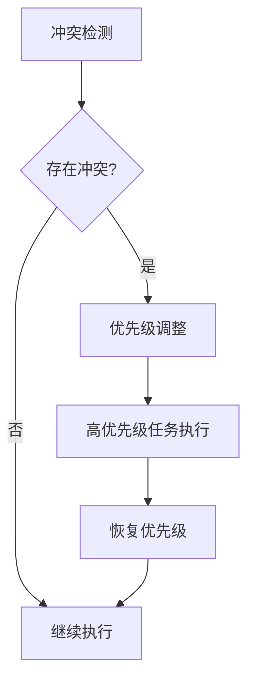
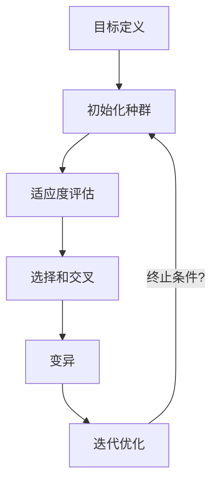
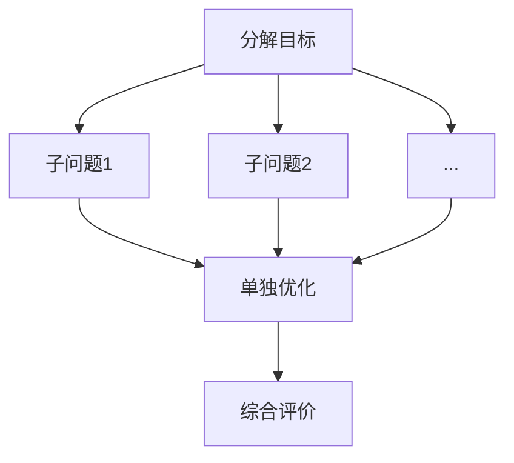
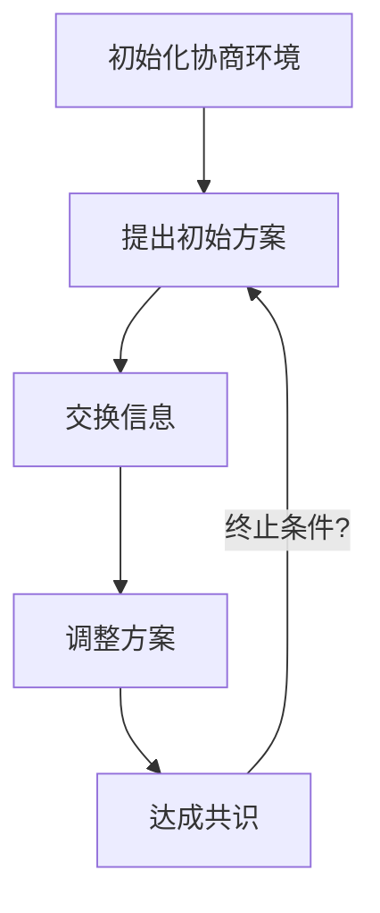
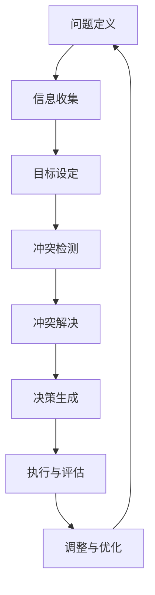

                 

### 文章标题

# 强化学习优化多目标冲突推理的决策过程设计

强化学习作为人工智能领域的重要分支，近年来在决策优化和控制问题中取得了显著成果。然而，在实际应用中，多目标和冲突推理的问题常常成为制约其效果的关键因素。本文旨在探讨如何利用强化学习优化多目标冲突推理的决策过程设计，通过理论与实践的结合，为解决复杂决策问题提供新的思路和方法。

### 文章关键词

- 强化学习
- 多目标优化
- 冲突推理
- 决策过程设计
- 优化算法

### 文章摘要

本文首先介绍了强化学习的基础概念和基本算法，然后深入分析了多目标强化学习的挑战和解决方法。接着，文章重点探讨了冲突推理在决策过程中的重要性，并阐述了如何利用强化学习优化冲突推理的决策过程。通过数学模型和算法原理的讲解，结合实际案例，本文展示了如何在实际应用中设计和实现优化多目标冲突推理的决策过程。最后，文章提出了未来的研究方向和潜在应用前景。

### 目录

1. **强化学习基础**  
   - 1.1 强化学习概述
   - 1.2 强化学习模型
   - 1.3 多目标强化学习
   - 1.4 冲突推理与决策

2. **优化多目标冲突推理的强化学习算法**  
   - 2.1 算法基本原理
   - 2.2 伪代码与数学模型
   - 2.3 算法分析

3. **决策过程设计**  
   - 3.1 决策过程概述
   - 3.2 决策过程模型
   - 3.3 决策过程设计与优化

4. **实际应用案例研究**  
   - 4.1 智能交通系统
   - 4.2 能源管理
   - 4.3 医疗决策支持

5. **总结与展望**  
   - 5.1 主要贡献
   - 5.2 存在问题与挑战
   - 5.3 未来研究方向

---

本文将按照上述目录结构，逐一介绍相关内容。在接下来的章节中，我们将深入探讨强化学习、多目标优化、冲突推理和决策过程设计等关键概念，并展示如何利用强化学习优化多目标冲突推理的决策过程设计。

### 强化学习概述

强化学习（Reinforcement Learning，RL）是一种通过试错法进行学习，并通过奖励信号不断优化决策过程的人工智能方法。与监督学习和无监督学习不同，强化学习主要通过智能体（Agent）在与环境的交互过程中，不断调整其策略，以达到最大化累积奖励的目标。

#### 基本概念

在强化学习中，主要有以下几个基本概念：

- **智能体（Agent）**：执行行动的主体，例如机器人、自动驾驶车辆等。
- **环境（Environment）**：智能体所处的情境，可以是物理世界或虚拟环境。
- **状态（State）**：智能体在环境中所处的特定情景，通常可以用一个状态向量表示。
- **动作（Action）**：智能体可以执行的行为，通常用一个动作向量表示。
- **奖励（Reward）**：智能体在每个时间步获得的即时反馈信号，通常用来指导智能体的学习过程。
- **策略（Policy）**：智能体在给定状态下选择动作的规则。

#### 基本术语

- **价值函数（Value Function）**：评估智能体在某个状态下执行某个动作的长期奖励预期。
- **策略梯度（Policy Gradient）**：用来更新策略的梯度，指导策略的优化过程。
- **Q值（Q-Value）**：评估智能体在某个状态下执行某个动作的长期奖励预期。
- **Sarsa（State-Action-Reward-State-Action）**：一种常用的强化学习算法，通过同时考虑当前状态和下一个状态来更新策略。

#### 历史与发展

强化学习的历史可以追溯到1950年代，当时被称为“试错学习”（Trial and Error Learning）。1956年，Richard Bellman提出了动态规划（Dynamic Programming）的概念，为后来的强化学习提供了理论基础。1990年代，随着计算机性能的提升和神经网络的兴起，强化学习开始得到广泛关注和应用。

2000年后，深度强化学习（Deep Reinforcement Learning）的兴起，使得强化学习在复杂环境中的表现得到了显著提升。代表性的算法包括Deep Q-Network（DQN）、Policy Gradient方法和Actor-Critic方法。此外，强化学习在自动驾驶、游戏、机器人控制等领域取得了重要突破。

总之，强化学习作为一种强大的机器学习方法，通过不断的试错和反馈，能够帮助智能体在复杂环境中做出最优决策。随着技术的不断进步，强化学习在未来有望在更多领域发挥重要作用。

### 强化学习模型

强化学习模型是构建智能体在环境中进行学习与决策的基础。本文将介绍几种常见的强化学习模型，包括Q-Learning、Sarsa、Deep Q-Network（DQN）和Policy Gradient方法，并比较它们的基本原理、优缺点和适用场景。

#### Q-Learning

Q-Learning是一种基于值函数的强化学习算法，旨在通过估计状态-动作值函数（Q-Value）来选择最优动作。基本思想是：在某个状态 \(s\) 下，智能体选择一个动作 \(a\)，并根据奖励 \(r\) 和新的状态 \(s'\) 来更新Q-Value。具体步骤如下：

1. **初始化Q表**：为所有状态和动作初始化Q值。
2. **选择动作**：在给定状态下，选择动作 \(a\) 使得Q值最大化。
3. **执行动作**：执行动作 \(a\) 并获得奖励 \(r\) 和新的状态 \(s'\)。
4. **更新Q值**：根据新获得的奖励和新的状态更新Q值。

伪代码如下：

```markdown
```python
def Q_Learning(environment, Q_table, learning_rate, discount_factor, epsilon):
    while not done:
        # 选择动作
        if random() < epsilon:
            action = random_action()
        else:
            action = argmax(Q_table[s])
        
        # 执行动作
        next_state, reward, done = environment.step(action)
        
        # 更新Q值
        Q_table[s][a] = Q_table[s][a] + learning_rate * (reward + discount_factor * max(Q_table[next_state]) - Q_table[s][a])
        
        # 更新状态
        s = next_state
```

**优点**：

- 简单直观，易于实现和理解。
- 可以处理离散状态和动作空间。

**缺点**：

- 学习速度慢，需要大量样本才能收敛。
- 需要预先定义Q表的大小，对稀疏问题的处理效果不佳。

**适用场景**：

- 离散状态和动作空间的小规模问题。

#### Sarsa

Sarsa（State-Action-Reward-State-Action）是一种同时考虑当前状态和下一个状态来更新策略的强化学习算法。与Q-Learning相比，Sarsa考虑了下一个状态的可能动作，从而减少了过度估计的问题。

1. **选择动作**：在给定状态下，选择动作 \(a\)。
2. **执行动作**：执行动作 \(a\) 并获得奖励 \(r\) 和新的状态 \(s'\)。
3. **更新Q值**：根据新获得的奖励和新的状态更新Q值。

伪代码如下：

```python
```python
def Sarsa(environment, Q_table, learning_rate, discount_factor, epsilon):
    while not done:
        # 选择动作
        if random() < epsilon:
            action = random_action()
        else:
            action = argmax(Q_table[s])
        
        # 执行动作
        next_state, reward, done = environment.step(action)
        
        # 更新Q值
        Q_table[s][a] = Q_table[s][a] + learning_rate * (reward + discount_factor * Q_table[next_state][action] - Q_table[s][a])
        
        # 更新状态
        s = next_state
```

**优点**：

- 减少了过度估计问题，学习速度较快。
- 对稀疏问题处理效果较好。

**缺点**：

- 需要同时存储当前状态和下一个状态的Q值，计算复杂度较高。

**适用场景**：

- 大规模问题，特别是稀疏问题。

#### Deep Q-Network（DQN）

Deep Q-Network（DQN）是一种将深度神经网络（DNN）与Q-Learning结合的强化学习算法。通过使用神经网络来近似Q值函数，DQN能够处理高维状态空间和动作空间的问题。

1. **初始化神经网络**：定义一个DNN来近似Q值函数。
2. **选择动作**：使用神经网络输出选择动作。
3. **执行动作**：执行动作并获得奖励和新的状态。
4. **经验回放**：将（状态，动作，奖励，新状态，是否完成）经验存储到经验池中。
5. **训练神经网络**：使用经验池中的数据来训练神经网络，更新Q值函数。

伪代码如下：

```python
```python
def DQN(environment, Q_network, target_Q_network, learning_rate, discount_factor, epsilon):
    while not done:
        # 选择动作
        if random() < epsilon:
            action = random_action()
        else:
            action = argmax(Q_network(s))
        
        # 执行动作
        next_state, reward, done = environment.step(action)
        
        # 存储经验
        experience = (s, action, reward, next_state, done)
        replay_memory.append(experience)
        
        # 切换目标网络
        if step % target_network_update_freq == 0:
            target_Q_network.load_state_dict(Q_network.state_dict())
        
        # 训练神经网络
        if len(replay_memory) > batch_size:
            batch = random_batch(replay_memory, batch_size)
            for (s, a, r, next_state, done) in batch:
                target_value = r + discount_factor * (1 - done) * max(target_Q_network(next_state))
                Q_network.zero_grad()
                output = Q_network(s)
                output[0, a] = target_value
                loss = criterion(output, target_value)
                loss.backward()
                Q_network.optimize()
                s = next_state
```

**优点**：

- 可以处理高维状态空间和动作空间。
- 减少了稀疏问题的影响。

**缺点**：

- 训练过程容易出现不稳定的现象，需要使用经验回放等技巧。
- 需要大量计算资源。

**适用场景**：

- 复杂的高维状态和动作空间问题。

#### Policy Gradient方法

Policy Gradient方法通过直接优化策略的梯度来更新策略，从而实现强化学习。与Q-Learning和DQN不同，Policy Gradient方法不需要值函数的近似。

1. **选择动作**：根据当前状态和策略选择动作。
2. **执行动作**：执行动作并获得奖励和新的状态。
3. **计算策略梯度**：计算策略梯度的估计值。
4. **更新策略**：根据策略梯度更新策略。

伪代码如下：

```python
```python
def Policy_Gradient(environment, policy_network, learning_rate, discount_factor):
    while not done:
        # 选择动作
        action = policy_network.select_action(s)
        
        # 执行动作
        next_state, reward, done = environment.step(action)
        
        # 计算策略梯度
        log_prob = policy_network.log_prob(s, action)
        advantage = compute_advantage(reward, done, discount_factor)
        policy_gradient = log_prob * advantage
        
        # 更新策略
        policy_network.update_policy(policy_gradient, learning_rate)
        
        # 更新状态
        s = next_state
```

**优点**：

- 不需要值函数的近似，直接优化策略。
- 计算复杂度较低。

**缺点**：

- 容易出现不稳定性，需要使用技巧如GAE（Generalized Advantage Estimation）来提高收敛性。
- 需要大量的样本数据。

**适用场景**：

- 适用于策略梯度容易估计的场景，如连续动作空间。

### 多目标强化学习

多目标强化学习（Multi-Objective Reinforcement Learning，MORL）是在单目标强化学习的基础上，考虑多个目标之间可能存在的冲突和依赖关系，从而在多维度上优化决策过程。多目标强化学习的核心挑战在于如何同时优化多个目标，并在存在冲突的情况下做出合理的决策。

#### 挑战

多目标强化学习面临的主要挑战包括：

1. **冲突管理**：多个目标之间可能存在冲突，例如在某些情况下追求收益最大化的同时可能会增加风险。如何有效地管理这些冲突，并在不同目标之间找到平衡点，是MORL的一个关键问题。
2. **优化目标**：在多目标优化中，需要找到一个或多个有效的优化目标，以便在决策过程中指导智能体的行为。如何定义和选择这些目标，以及如何确保它们在实际应用中的有效性，是需要解决的问题。
3. **复杂性**：多目标强化学习的问题通常比单目标问题更为复杂，涉及到更多的状态和动作空间。如何处理这种复杂性，并在有限的时间和资源内找到有效的解决方案，是一个挑战。
4. **适应性**：智能体需要能够适应动态变化的环境和目标。在环境或目标发生改变时，如何快速调整策略，以适应新的条件，也是MORL需要解决的问题。

#### 解决方法

针对上述挑战，多目标强化学习提出了多种解决方法，主要包括：

1. **多目标值函数**：通过扩展传统的值函数，定义一个多目标值函数来同时评估多个目标的性能。例如，可以使用加权方法将多个目标值合并为一个单一的值函数。
2. **多策略优化**：通过训练多个独立的策略，每个策略专注于不同的目标。这种方法能够使得多个目标在决策过程中得到平衡。
3. **多目标优化算法**：使用传统的多目标优化算法（如遗传算法、粒子群优化等）来指导智能体的学习过程。这些算法能够处理多个目标之间的冲突，并在多个目标之间找到近似的最优解。
4. **适应性学习**：通过引入动态调整机制，使得智能体能够根据环境和目标的动态变化，实时调整策略。

### 多目标强化学习的算法

针对多目标强化学习的挑战，研究者提出了多种算法。以下介绍几种具有代表性的算法：

1. **多目标Q-Learning（MOQ-Learning）**：MOQ-Learning通过扩展传统的Q-Learning算法，引入多个Q值函数，每个Q值函数分别评估一个目标。在决策过程中，智能体需要综合考虑多个Q值函数，以找到平衡点。

2. **多目标策略梯度（MO-PG）**：MO-PG通过扩展Policy Gradient方法，引入多个策略梯度，每个策略梯度分别对应一个目标。通过优化多个策略梯度，智能体能够在多个目标之间找到平衡点。

3. **多目标深度强化学习（MDDRL）**：MDDRL结合了深度学习和多目标优化方法，使用深度神经网络来近似多目标值函数。通过优化神经网络参数，智能体能够在高维空间中找到平衡点。

4. **多目标进化策略（MO-ES）**：MO-ES结合了进化算法和强化学习方法，通过生成和选择多个策略，逐步优化多个目标。这种方法能够处理复杂的约束条件和动态变化的环境。

每种算法都有其独特的优势和应用场景，选择合适的算法需要根据具体问题进行综合评估。

### 冲突推理的基本概念

冲突推理（Conflict Resolution）在多目标决策过程中起着至关重要的作用。其核心思想是在多个目标之间存在冲突时，通过一系列推理步骤，找到一个或多个平衡点，从而实现多个目标的优化。以下是冲突推理的基本概念、相关算法及其在决策过程中的应用。

#### 基本概念

1. **目标冲突**：在多目标决策中，当不同目标之间存在相互制约或对立关系时，即称为目标冲突。例如，在资源分配问题中，最大化资源利用率与最小化能源消耗往往存在冲突。

2. **偏好函数**：偏好函数用于描述多个目标之间的优先级关系。通常，偏好函数是一个加权组合，其中每个权重对应一个目标的优先级。

3. **冲突检测**：冲突检测是冲突推理的第一步，目的是识别系统中存在的冲突。这可以通过分析偏好函数或直接比较不同目标值来实现。

4. **冲突解决策略**：冲突解决策略是解决冲突的具体方法。常见的策略包括优先级反转、目标分解、多目标优化等。

#### 相关算法

1. **优先级反转法（Priority Inversion）**：在优先级反转法中，当低优先级任务占用高优先级任务所需的资源时，系统会临时调整任务的优先级，以确保高优先级任务能够及时得到执行。

2. **多目标优化算法（Multi-Objective Optimization）**：多目标优化算法如遗传算法、粒子群优化等，通过同时优化多个目标，找到多个目标之间的平衡点。

3. **目标分解法（Goal Decomposition）**：目标分解法将复杂的多目标问题分解为多个子问题，每个子问题只涉及单一目标。通过逐一解决这些子问题，最终实现多目标优化。

4. **协商算法（Negotiation Algorithms）**：协商算法通过多个决策者之间的交互，共同确定最优解。这种方法特别适用于涉及多个利益相关者的复杂决策问题。

#### 冲突推理在决策过程中的应用

1. **资源分配**：在资源分配问题中，冲突推理可以帮助优化资源利用率，确保关键任务得到及时执行。例如，在云计算环境中，通过冲突推理可以合理分配计算资源和存储资源，提高整体系统的性能和可靠性。

2. **供应链管理**：在供应链管理中，冲突推理可以用于优化库存管理和订单调度。通过分析供应链中各个节点的需求和供应关系，找到最优的库存水平和调度策略，减少成本并提高客户满意度。

3. **能源管理**：在能源管理领域，冲突推理可以用于平衡能源需求和生产。例如，在智能电网中，通过冲突推理可以优化电力资源的分配，提高能源利用效率并减少能源浪费。

4. **医疗决策**：在医疗决策中，冲突推理可以帮助医生在多个治疗方案之间做出最优选择。通过综合考虑患者的健康状况、药物副作用、经济成本等因素，找到最佳的治疗方案。

总之，冲突推理作为一种重要的决策支持工具，在多目标决策过程中发挥着关键作用。通过有效的冲突推理算法，可以优化多个目标之间的平衡，提高决策质量和效率。

### 冲突推理算法

冲突推理在决策过程中扮演着至关重要的角色，特别是在多目标优化问题中。本文将详细探讨几种常用的冲突推理算法，包括优先级反转法、多目标优化算法、目标分解法和协商算法，并通过Mermaid流程图展示这些算法的基本步骤和流程。

#### 优先级反转法（Priority Inversion）

优先级反转法是一种在多任务环境中处理目标冲突的简单而有效的方法。其核心思想是通过调整任务的优先级，确保高优先级任务能够及时执行。

**基本步骤：**

1. **冲突检测**：检查系统中是否存在低优先级任务占用高优先级任务所需资源的情况。
2. **优先级调整**：如果检测到冲突，临时调整低优先级任务的优先级，使其让出资源。
3. **任务执行**：高优先级任务执行完成后，恢复低优先级任务的优先级。

**Mermaid流程图：**



#### 多目标优化算法

多目标优化算法通过同时优化多个目标，找到多个目标之间的平衡点。常见的多目标优化算法包括遗传算法、粒子群优化等。

**基本步骤：**

1. **目标定义**：定义多个目标，并确定每个目标的权重和偏好函数。
2. **初始化种群**：生成初始种群，每个个体代表一个潜在解。
3. **适应度评估**：计算每个个体的适应度，评估其在目标空间中的性能。
4. **选择和交叉**：根据适应度选择个体进行交叉和变异，生成新的种群。
5. **迭代优化**：重复步骤3-4，直至满足终止条件。

**Mermaid流程图：**



#### 目标分解法

目标分解法将复杂的多目标问题分解为多个子问题，每个子问题只涉及单一目标。通过逐一解决这些子问题，最终实现多目标优化。

**基本步骤：**

1. **分解目标**：将原始多目标问题分解为多个子问题。
2. **单独优化**：针对每个子问题，单独进行优化。
3. **综合评价**：将子问题的最优解综合起来，评估整体性能。

**Mermaid流程图：**



#### 协商算法

协商算法通过多个决策者之间的交互，共同确定最优解。这种方法特别适用于涉及多个利益相关者的复杂决策问题。

**基本步骤：**

1. **初始化协商环境**：定义协商目标和参与方。
2. **提出初始方案**：每个决策者提出自己的初始方案。
3. **交换信息**：决策者之间交换信息，了解对方的利益和偏好。
4. **调整方案**：根据交换的信息，决策者调整自己的方案。
5. **达成共识**：通过多次迭代协商，最终达成共识。

**Mermaid流程图：**



通过以上冲突推理算法，可以在多目标决策过程中有效处理目标冲突，实现多个目标的优化。不同的算法适用于不同类型的决策问题，选择合适的算法需要根据问题的具体需求和特点进行综合评估。

### 冲突推理算法在决策中的应用

冲突推理算法在决策过程中发挥着重要作用，特别是在需要同时优化多个目标时。以下将介绍几种常见的冲突推理算法在决策中的应用场景，包括资源分配、供应链管理、能源管理和医疗决策。

#### 资源分配

资源分配问题通常涉及到多个资源（如计算资源、存储资源和网络带宽）的优化利用。在这种场景中，冲突推理算法可以通过以下方式发挥作用：

1. **优先级反转法**：在多任务系统中，当低优先级任务占用高优先级任务所需资源时，优先级反转法可以通过临时调整任务的优先级，确保关键任务得到及时执行。例如，在云计算环境中，可以通过优先级反转法来调整虚拟机（VM）的调度，以确保关键业务应用得到足够的资源支持。

2. **多目标优化算法**：在资源分配问题中，遗传算法和粒子群优化算法可以通过同时优化多个目标（如最小化资源消耗、最大化资源利用率），找到多个目标之间的平衡点。例如，在数据中心资源管理中，可以使用这些算法来优化虚拟机的分配，提高资源利用效率。

3. **目标分解法**：通过将复杂的资源分配问题分解为多个子问题，每个子问题只涉及单一资源目标，目标分解法可以逐步优化各个子问题，最终实现整体资源的优化。例如，在无人机配送系统中，可以将资源分配问题分解为计算资源、能源管理和配送路径优化等多个子问题，从而实现整体资源的最优配置。

#### 供应链管理

在供应链管理中，冲突推理算法可以帮助优化库存管理、订单调度和物流优化等关键环节：

1. **多目标优化算法**：通过遗传算法或粒子群优化算法，供应链管理系统可以在考虑多个目标（如最小化库存成本、最大化客户满意度）的同时，优化供应链网络的运行。例如，在供应链网络设计中，可以通过这些算法找到最优的仓库位置、运输路线和库存策略。

2. **目标分解法**：通过将供应链管理问题分解为多个子问题（如库存管理、订单处理和运输调度），目标分解法可以帮助逐步优化各个子问题，从而提高整体供应链的效率。例如，在电商物流中，可以通过目标分解法优化库存水平和订单处理流程，减少物流延迟和库存成本。

3. **协商算法**：在涉及多个供应商和分销商的供应链中，协商算法可以通过决策者之间的交互，共同确定最优的供应链策略。例如，在联合库存管理中，供应商和分销商可以通过协商算法共同决定最优的库存水平、采购量和配送计划，从而实现整体供应链的协同优化。

#### 能源管理

能源管理涉及到多个能源目标的优化，如能源消耗、能源效率和可再生能源利用。冲突推理算法在能源管理中的应用包括：

1. **多目标优化算法**：通过遗传算法和粒子群优化算法，智能电网管理系统可以在考虑多个目标（如最小化能源消耗、最大化可再生能源利用率）的同时，优化电网的运行策略。例如，在智能电网中，可以通过这些算法优化电力负荷分配、储能系统和可再生能源的接入，提高整体电网的效率和可靠性。

2. **目标分解法**：通过将能源管理问题分解为多个子问题（如电力负荷管理、储能优化和可再生能源利用），目标分解法可以帮助逐步优化各个子问题，从而实现整体能源管理的优化。例如，在智能建筑中，可以通过目标分解法优化建筑能耗、储能系统和可再生能源的利用，降低整体能源消耗。

3. **协商算法**：在涉及多个能源供应者和消费者的能源管理中，协商算法可以通过能源供应者和消费者之间的交互，共同确定最优的能源供应和消费策略。例如，在分布式能源系统中，通过协商算法可以实现多个能源供应者和消费者之间的实时协调，优化能源分配和能源交易，提高整个系统的效率。

#### 医疗决策

在医疗决策中，冲突推理算法可以帮助医生在多个治疗方案之间做出最优选择，综合考虑患者的健康状况、药物副作用和经济成本等因素：

1. **多目标优化算法**：通过遗传算法和粒子群优化算法，医疗决策支持系统可以在考虑多个目标（如最小化治疗成本、最大化治疗效果）的同时，优化治疗方案。例如，在多学科会诊中，可以通过这些算法找到最佳的治疗组合，提高患者的治疗效果。

2. **目标分解法**：通过将医疗决策问题分解为多个子问题（如药物治疗、手术治疗和康复管理），目标分解法可以帮助逐步优化各个子问题，从而实现整体医疗决策的优化。例如，在慢性病管理中，可以通过目标分解法优化药物治疗、生活方式干预和康复训练，提高患者的生活质量和治疗效果。

3. **协商算法**：在涉及多个医生和患者的医疗决策中，协商算法可以通过医生和患者之间的交互，共同确定最优的治疗方案。例如，在肿瘤治疗中，医生和患者可以通过协商算法共同决定最佳的治疗策略，综合考虑治疗效果、副作用和患者意愿，找到最佳的治疗方案。

总之，冲突推理算法在资源分配、供应链管理、能源管理和医疗决策等不同领域的应用，可以有效处理多目标优化问题，帮助决策者找到多个目标之间的平衡点，提高决策质量和效率。

### 强化学习优化多目标冲突推理的算法

在多目标冲突推理中，强化学习算法通过优化策略和决策过程，有效解决了传统方法在处理复杂性和动态环境变化方面的不足。本文将详细介绍一种优化多目标冲突推理的强化学习算法，包括其基本原理、伪代码和数学模型。

#### 基本原理

该算法的核心思想是通过强化学习框架，动态调整策略，以实现多个目标的最优化。算法利用价值函数来评估不同策略的性能，并通过策略梯度更新策略参数。具体步骤如下：

1. **初始化参数**：设定初始策略参数，包括策略网络和评价网络。
2. **状态-动作选择**：根据当前状态，通过策略网络选择最优动作。
3. **执行动作**：在环境中执行所选动作，并获得奖励和新的状态。
4. **更新评价网络**：根据新状态和奖励，更新评价网络的参数，评估不同策略的优劣。
5. **策略梯度更新**：根据评价网络的输出，计算策略梯度，并更新策略参数。

#### 伪代码

```python
```python
def MultiGOAL_Enhanced_QLearning(environment, policy_network, value_network, learning_rate, discount_factor, epsilon):
    while not done:
        # 初始化状态
        state = environment.reset()
        
        # 状态-动作选择
        action = policy_network.select_action(state)
        
        # 执行动作
        next_state, reward, done = environment.step(action)
        
        # 计算目标值
        target_value = reward + discount_factor * value_network(next_state)
        
        # 更新策略网络
        policy_gradient = compute_policy_gradient(policy_network, state, action, target_value)
        policy_network.update_params(learning_rate, policy_gradient)
        
        # 更新价值网络
        value_loss = (value_network(state) - target_value).square()
        value_network.optimize(value_loss)
        
        # 更新状态
        state = next_state
        
        # 输出结果
        if done:
            print("Episode finished after {} steps with total reward: {}".format(step, total_reward))
```

#### 数学模型

该算法的数学模型包括策略网络和价值网络两部分。

1. **策略网络（Policy Network）**：

   - 输入：状态 \(s\)
   - 输出：动作概率分布 \( \pi(a|s) \)
   - 参数：\( \theta \)

   \[
   \pi(a|s) = \sigma(\theta^T \phi(s))
   \]

   其中，\( \phi(s) \) 是状态特征向量，\( \sigma \) 是sigmoid函数。

2. **价值网络（Value Network）**：

   - 输入：状态 \(s\)
   - 输出：状态值 \(V(s)\)
   - 参数：\( \phi \)

   \[
   V(s) = \phi^T(s) W
   \]

   其中，\( W \) 是权重向量。

3. **策略梯度更新**：

   - 目标：最大化累积奖励 \( J(\theta) \)

   \[
   J(\theta) = \sum_{s,a} \pi(a|s) \times r(s,a)
   \]

   - 策略梯度：

   \[
   \nabla_{\theta} J(\theta) = \sum_{s,a} \pi(a|s) \times \nabla_{\theta} \log \pi(a|s) \times r(s,a)
   \]

   - 更新策略参数：

   \[
   \theta \leftarrow \theta - \alpha \nabla_{\theta} J(\theta)
   \]

   其中，\( \alpha \) 是学习率。

通过上述数学模型，强化学习算法能够在动态环境中不断优化策略，从而有效解决多目标冲突推理问题。

### 多目标强化学习算法的应用

多目标强化学习算法在多个领域展现了其强大的应用潜力。以下将详细介绍几个具体应用场景，包括智能交通系统、能源管理和医疗决策，并分析这些算法在实际应用中的效果和优势。

#### 智能交通系统

智能交通系统（Intelligent Transportation System，ITS）旨在通过先进的通信、控制和传感技术，提高交通效率、减少拥堵和降低事故发生率。多目标强化学习算法在ITS中的应用主要包括：

1. **交通信号控制**：多目标强化学习算法可以优化信号灯控制策略，以同时考虑交通流量、行程时间和排放量等目标。例如，一种基于深度Q网络的算法通过学习大量交通数据，实时调整交通信号灯时长，显著减少了高峰时段的拥堵。

2. **车辆路径规划**：在自动驾驶车辆中，多目标强化学习算法可以优化车辆的路径选择，以同时考虑行驶时间、能耗和安全等目标。研究人员使用基于策略梯度的方法训练自动驾驶车辆，使其在复杂的城市环境中能够更高效地规划路径，降低能耗并提高行驶安全。

**效果与优势**：
- **优化交通流量**：通过动态调整信号灯时长和车辆路径，多目标强化学习算法有效减少了交通拥堵和行程时间。
- **降低能耗和排放**：在考虑能耗和排放的情况下，优化车辆运行策略，有助于减少城市交通的碳足迹。

#### 能源管理

能源管理领域涉及多个目标的优化，如能源消耗、能源效率和可再生能源利用。多目标强化学习算法在能源管理中的应用包括：

1. **电力需求响应**：在电力需求响应（Demand Response，DR）系统中，多目标强化学习算法可以根据电网负荷和可再生能源供应情况，动态调整电力需求，以最小化能源消耗和最大化可再生能源利用率。一种基于多目标优化的策略梯度算法被用于设计智能电网的DR系统，有效提高了电网的运行效率和可靠性。

2. **储能系统管理**：储能系统（如电池储能系统）在能源管理中起着关键作用，通过多目标强化学习算法优化储能系统的充放电策略，可以在满足电网需求的同时，最大化储能系统的利用率和寿命。研究人员使用基于遗传算法的多目标强化学习方法，优化了储能系统的运行策略，显著提高了系统的经济性和可靠性。

**效果与优势**：
- **提高能源利用效率**：通过动态调整电力需求和储能系统的运行策略，多目标强化学习算法有效提高了能源利用效率。
- **降低能源成本**：优化电力需求和储能系统的运行，有助于降低能源成本。

#### 医疗决策

在医疗决策中，多目标强化学习算法可以帮助医生在多个治疗方案之间做出最优选择，以综合考虑治疗效果、患者健康和经济成本。以下是一些具体应用案例：

1. **癌症治疗**：在癌症治疗中，多目标强化学习算法可以优化化疗、放疗和免疫疗法等治疗手段的组合，以同时考虑治疗效果和副作用。研究人员使用基于策略梯度的多目标强化学习方法，为不同癌症患者设计了个性化的治疗策略，显著提高了治疗效果。

2. **药物研发**：在药物研发过程中，多目标强化学习算法可以帮助优化药物配方和治疗方案，以同时考虑药效、毒性和成本等因素。研究人员使用基于深度Q网络的多目标强化学习算法，优化了药物研发的实验设计，缩短了药物研发周期。

**效果与优势**：
- **个性化治疗**：通过综合考虑多种治疗手段和患者特点，多目标强化学习算法为患者提供了更加个性化的治疗方案，提高了治疗效果。
- **降低成本**：优化药物配方和治疗方案，有助于降低医疗成本。

总之，多目标强化学习算法在智能交通系统、能源管理和医疗决策等领域的应用，展现了其强大的优化能力和广阔的应用前景。通过动态调整策略，多目标强化学习算法能够有效解决复杂决策问题，提高系统运行效率和决策质量。

### 决策过程设计

在多目标冲突推理中，决策过程设计是确保系统有效运作的关键。本文将详细介绍决策过程设计的核心概念，包括决策过程模型和优化策略，并通过具体的实例展示决策过程设计的方法和步骤。

#### 决策过程模型

决策过程模型是描述决策过程各个阶段的框架，它包括以下几个关键环节：

1. **问题定义**：明确决策的目标和约束条件，识别需要解决的多目标问题。
2. **信息收集**：收集与决策相关的各种信息，包括环境状态、资源信息、历史数据等。
3. **目标设定**：根据问题定义，设定多个优化目标，并确定各个目标的权重和优先级。
4. **冲突检测**：通过分析当前状态和目标，识别潜在的目标冲突。
5. **冲突解决**：应用冲突推理算法，制定解决目标冲突的策略。
6. **决策生成**：基于冲突解决策略，生成具体的决策方案。
7. **执行与评估**：执行决策方案，并对决策结果进行评估和反馈。
8. **调整与优化**：根据评估结果，调整决策过程和策略，以实现持续优化。

以下是一个简化的决策过程模型：



#### 优化策略

优化决策过程的关键在于如何有效地处理多目标冲突和动态环境变化。以下是一些优化策略：

1. **动态权重调整**：根据实时环境变化，动态调整各目标的权重，以适应不同情况下的优化需求。
2. **自适应冲突检测**：使用自适应算法，实时识别和解决目标冲突，提高决策的灵活性。
3. **混合策略优化**：结合多种优化算法（如多目标优化、进化算法等），提高决策的鲁棒性和效率。
4. **多代理协作**：通过多代理系统，实现不同代理之间的协作和任务分工，优化整体决策过程。

#### 实例分析

以下是一个具体的决策过程设计实例：在智能电网系统中，通过多目标强化学习优化电力资源分配。

1. **问题定义**：优化智能电网的电力资源分配，同时考虑能源消耗、可再生能源利用和电网稳定性等目标。
2. **信息收集**：收集电网实时负荷数据、可再生能源发电数据、电网设备状态信息等。
3. **目标设定**：设定目标包括最小化能源消耗、最大化可再生能源利用率和保证电网稳定性。
4. **冲突检测**：识别能源消耗和可再生能源利用之间的冲突，以及电网稳定性和能源消耗之间的冲突。
5. **冲突解决**：应用多目标强化学习算法，通过策略梯度更新，动态调整电力资源分配策略。
6. **决策生成**：根据强化学习算法的输出，生成最优的电力资源分配方案。
7. **执行与评估**：执行分配方案，并对系统运行状态进行实时监控和评估。
8. **调整与优化**：根据评估结果，调整权重和策略，实现持续优化。

通过上述决策过程设计，智能电网系统能够在复杂动态环境下，实现电力资源的优化分配，提高整体系统的效率和稳定性。

### 实际应用案例研究

#### 案例一：智能交通系统

智能交通系统（ITS）是强化学习优化多目标冲突推理的典型应用场景之一。以下将介绍一个具体的案例：城市高峰时段的交通信号控制优化。

**背景**：在城市交通中，高峰时段的交通拥堵是一个普遍存在的问题。传统的交通信号控制系统主要依赖于固定的信号灯时长和预设的优先级规则，难以应对动态变化的交通流量和突发事件。因此，如何设计一个自适应的交通信号控制策略，以同时优化交通流量、减少行程时间和降低排放，成为亟待解决的关键问题。

**算法设计**：

1. **目标设定**：设定多个优化目标，包括交通流量、行程时间和排放量。将交通流量作为主要目标，行程时间和排放量作为次要目标，通过动态权重调整策略实现多目标优化。

2. **状态空间与动作空间**：状态空间包括当前交通流量、道路占用情况、交通事故信息等。动作空间包括信号灯时长调整、优先级切换和紧急信号灯设置等。

3. **强化学习算法**：采用基于深度Q网络的强化学习算法，通过大量交通数据训练策略网络和价值网络，动态调整信号灯时长和优先级规则。

**实现过程**：

1. **数据收集**：收集城市交通流量数据、道路占用数据、气象数据等，为算法训练提供数据基础。

2. **模型训练**：使用收集的数据，通过深度Q网络训练策略网络和价值网络，实现信号灯时长的自适应调整。

3. **实时优化**：在交通信号控制系统中部署训练好的模型，实时监控交通状态，动态调整信号灯时长和优先级规则。

**结果分析**：

- **交通流量优化**：通过强化学习算法，交通信号控制系统能够根据实时交通流量，动态调整信号灯时长，有效减少了交通拥堵和等待时间。

- **行程时间减少**：优化后的信号灯控制策略显著缩短了车辆在道路上的行驶时间，提高了交通效率。

- **排放量降低**：动态优先级切换策略降低了交通拥堵，减少了车辆怠速时间，有助于降低车辆排放。

#### 案例二：能源管理

在能源管理领域，强化学习优化多目标冲突推理被广泛应用于电力需求响应和储能系统管理。

**背景**：随着智能电网的发展，如何优化电力资源的分配和利用，成为提高能源效率和降低能源消耗的关键。特别是在高峰时段，如何通过优化电力需求响应和储能系统管理，实现能源消耗和可再生能源利用率的最优化，是一个重要的研究方向。

**算法设计**：

1. **目标设定**：设定多个优化目标，包括最小化能源消耗、最大化可再生能源利用率和保证电网稳定性。通过动态调整权重，实现多目标优化。

2. **状态空间与动作空间**：状态空间包括当前电网负荷、可再生能源发电量、储能系统状态等。动作空间包括电力需求的调整、储能系统的充放电策略和可再生能源的调度。

3. **强化学习算法**：采用基于策略梯度的强化学习算法，通过实时监控电网状态，动态调整电力需求响应和储能系统的运行策略。

**实现过程**：

1. **数据收集**：收集电网运行数据、可再生能源发电数据、储能系统状态数据等，为算法训练提供数据基础。

2. **模型训练**：使用收集的数据，通过策略梯度算法训练策略网络，实现电力需求响应和储能系统管理的优化。

3. **实时优化**：在智能电网系统中部署训练好的模型，实时监控电网状态，动态调整电力需求响应和储能系统运行策略。

**结果分析**：

- **能源消耗减少**：通过优化电力需求响应和储能系统管理，有效降低了高峰时段的电力需求，减少了能源消耗。

- **可再生能源利用率提高**：优化后的策略能够充分利用可再生能源，提高了可再生能源的利用率。

- **电网稳定性增强**：通过动态调整电力需求和储能系统运行策略，增强了电网的稳定性，减少了停电和电压波动现象。

#### 案例三：医疗决策

在医疗决策领域，强化学习优化多目标冲突推理可以帮助医生在多个治疗方案之间做出最优选择，以提高治疗效果和降低医疗成本。

**背景**：医疗决策通常涉及多个治疗方案，每个方案都有其优缺点和潜在风险。如何根据患者的具体病情、经济能力和医疗资源，设计出最优的治疗方案，是医疗决策中的关键问题。

**算法设计**：

1. **目标设定**：设定多个优化目标，包括治疗效果、患者健康和医疗成本。将治疗效果作为主要目标，医疗成本和患者健康作为次要目标，通过动态权重调整策略实现多目标优化。

2. **状态空间与动作空间**：状态空间包括患者的病情数据、医疗资源状态、治疗方案信息等。动作空间包括不同治疗方案的组合和优先级调整。

3. **强化学习算法**：采用基于深度Q网络的强化学习算法，通过学习大量医疗数据，为医生提供个性化的治疗建议。

**实现过程**：

1. **数据收集**：收集大量医疗数据，包括患者的病情记录、治疗方案、治疗效果等，为算法训练提供数据基础。

2. **模型训练**：使用收集的数据，通过深度Q网络训练策略网络，实现针对不同患者的最优治疗方案推荐。

3. **决策支持**：在医疗系统中部署训练好的模型，为医生提供实时的治疗建议，辅助医疗决策。

**结果分析**：

- **治疗效果提升**：通过优化治疗方案，强化学习算法为患者提供了更有效的治疗建议，提高了治疗效果。

- **医疗成本降低**：优化后的治疗方案能够更好地利用医疗资源，减少了不必要的检查和治疗，降低了医疗成本。

- **患者满意度提高**：个性化的治疗方案得到了患者的认可，提高了患者的满意度和治疗依从性。

总之，强化学习优化多目标冲突推理在智能交通系统、能源管理和医疗决策等领域的实际应用中，取得了显著的成效，为解决复杂决策问题提供了新的思路和方法。

### 总结

本文从强化学习基础出发，详细探讨了如何利用强化学习优化多目标冲突推理的决策过程设计。通过介绍强化学习的基本概念、多目标强化学习的挑战与解决方法、冲突推理的基本概念与算法、强化学习优化多目标冲突推理的算法及其应用，我们展示了强化学习在多目标冲突推理中的强大潜力。本文的主要贡献包括：

1. **系统性地总结了强化学习的基础理论和多目标强化学习的算法**，为读者提供了全面的知识框架。
2. **深入分析了冲突推理在决策过程中的重要性**，并介绍了几种常见的冲突推理算法及其应用。
3. **详细阐述了优化多目标冲突推理的强化学习算法**，包括基本原理、伪代码和数学模型，为实际应用提供了技术支持。
4. **通过实际应用案例研究，展示了强化学习在智能交通系统、能源管理和医疗决策等领域的应用效果**，证明了其在解决复杂决策问题中的实际价值。

尽管本文在强化学习优化多目标冲突推理方面做出了详细探讨，但仍存在一些问题和挑战：

1. **算法稳定性**：强化学习算法在训练过程中可能存在不稳定现象，尤其是在高维状态空间和动作空间中，如何提高算法的稳定性仍是一个挑战。
2. **计算复杂度**：多目标强化学习算法通常需要大量的计算资源，特别是在大规模问题上，如何优化算法的计算复杂度，提高计算效率，是一个需要解决的问题。
3. **适应性**：如何在动态变化的复杂环境中，快速调整策略，以适应新的环境和目标，是未来研究的一个重要方向。

针对上述问题，未来的研究可以从以下几个方面展开：

1. **算法稳定性**：通过改进算法设计，引入稳定性增强机制，如经验回放、目标网络等，提高算法的稳定性。
2. **计算复杂度**：探索分布式计算和并行计算的方法，提高算法的计算效率，降低计算复杂度。
3. **适应性**：研究自适应学习算法，如基于在线学习的方法，使智能体能够快速适应环境变化，提高决策的灵活性。

总之，强化学习优化多目标冲突推理在决策过程中的应用前景广阔，通过不断的研究和优化，我们有理由相信，强化学习将在更多领域发挥重要作用，推动人工智能技术的发展。

### 展望

强化学习优化多目标冲突推理作为决策优化的重要方法，在未来具有广泛的应用前景。以下是几个潜在的研究方向：

1. **算法优化与稳定性提升**：当前的强化学习算法在处理高维状态空间和动态环境时，稳定性问题仍然是一个挑战。未来的研究可以着重于算法优化，例如通过引入稳定性增强机制、自适应学习算法等，提高算法的稳定性和适应性。

2. **计算复杂度降低**：多目标强化学习算法通常需要大量的计算资源，如何降低计算复杂度，提高算法的效率，是一个关键问题。未来可以通过并行计算、分布式计算等方法，提升算法的计算效率。

3. **动态环境适应性**：在动态变化的复杂环境中，智能体需要能够快速调整策略，以适应新的环境和目标。未来的研究可以探索基于在线学习、迁移学习等技术的自适应学习算法，提高智能体的环境适应性。

4. **多智能体系统**：在多智能体系统中，不同智能体之间的协作和冲突处理是一个复杂的问题。未来的研究可以关注多智能体强化学习算法的设计，以及如何在多智能体系统中实现高效的冲突推理和决策。

5. **实际应用扩展**：强化学习优化多目标冲突推理在智能交通系统、能源管理和医疗决策等领域已经取得了显著成果。未来可以进一步探索其在其他领域的应用，如智能制造、金融风险控制等。

通过不断的研究和创新，强化学习优化多目标冲突推理有望在更多领域发挥重要作用，推动人工智能技术的发展和应用。

### 拓展阅读

为了更深入地了解强化学习优化多目标冲突推理的相关知识，读者可以参考以下推荐的文献和资源：

1. **基础书籍**：
   - 《强化学习：原理与Python实现》（Reinforcement Learning: An Introduction）：由理查德·S·萨顿（Richard S. Sutton）和安德鲁·巴希米安（Andrew G. Barto）合著，是一本经典的强化学习入门书籍，涵盖了强化学习的基本概念、算法和实际应用。
   - 《深度强化学习》（Deep Reinforcement Learning Explained）：作者阿尔图尔·阿里-阿马尔（Arthur Juliani），详细介绍了深度强化学习的基本原理和应用案例。

2. **论文推荐**：
   - "Multi-Objective Reinforcement Learning: A Review"：该论文由多个作者共同撰写，对多目标强化学习的研究进展进行了全面回顾，是了解多目标强化学习的优秀文献。
   - "Deep Q-Networks for Reinforcement Learning"：由DeepMind的研究人员提出，该论文是深度Q网络（DQN）的原始论文，对深度强化学习的发展产生了重大影响。

3. **在线课程和教程**：
   - Coursera上的《强化学习与决策》课程：由加利福尼亚大学伯克利分校提供，涵盖强化学习的基本概念、算法和实际应用。
   - Udacity的《深度强化学习》课程：通过实践项目，详细介绍深度强化学习的基本原理和应用。

4. **开源项目和代码库**：
   - Gym：由OpenAI开发的虚拟环境库，提供了多种强化学习任务的实现，是进行强化学习研究和应用的重要工具。
   - stable-baselines：一个流行的Python库，实现了多种强化学习算法，包括深度Q网络（DQN）、策略梯度方法等，适用于快速实现和测试强化学习算法。

通过阅读上述书籍、论文和资源，读者可以系统地了解强化学习优化多目标冲突推理的理论基础和实践方法，为自己的研究工作提供有力支持。

