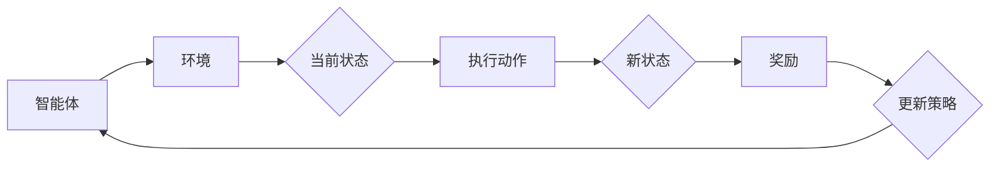
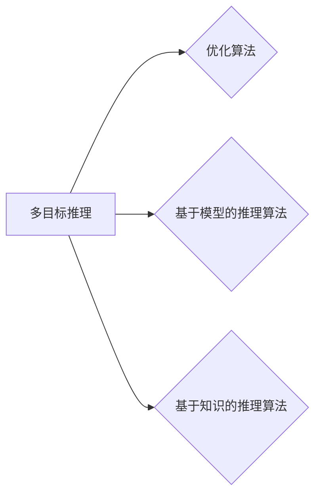

                 


### 步骤1：文章标题与关键词确定

**文章标题：强化学习优化多目标推理的决策过程**

**关键词：强化学习，多目标推理，决策过程，优化算法，人工智能**

### 步骤2：撰写文章摘要

**摘要：**
本文深入探讨了强化学习在多目标推理决策过程中的优化作用。首先，我们介绍了强化学习的基础概念和基本原理，包括Q-Learning、SARSA等算法。接着，我们详细阐述了多目标推理的挑战和主要算法。然后，我们探讨了如何将强化学习应用于多目标推理，并介绍了相应的优化算法和策略。通过实际案例的分析，我们展示了强化学习在多目标推理决策过程中的有效性和可行性。最后，我们对本文进行了总结，并提出了未来研究的一些方向。

### 步骤3：撰写引言与背景介绍

**引言：**
在人工智能领域，强化学习作为一种重要的机器学习方法，已经在各个领域中得到了广泛的应用。而多目标推理作为人工智能的一个重要分支，旨在同时考虑多个目标，以实现更复杂的决策过程。然而，多目标推理面临着复杂性和不确定性等挑战。本文将探讨如何利用强化学习来优化多目标推理的决策过程，以提高决策的效率和准确性。

**背景介绍：**
强化学习是通过智能体与环境之间的交互来学习最优策略的过程。其核心思想是通过奖励信号来引导智能体的行为，从而实现目标。而多目标推理则涉及到同时考虑多个目标，以找到最优或次优的解决方案。在现实生活中，许多决策过程都涉及到多个目标，例如自动驾驶、金融交易等。然而，现有的多目标推理方法往往难以在复杂性和不确定性之间取得平衡。

### 步骤4：强化学习基础

**核心概念与联系：**
强化学习主要由四个核心部分组成：智能体（Agent）、环境（Environment）、状态（State）和动作（Action）。智能体是执行行动的实体，环境是智能体所在的世界，状态是智能体在某一时刻所处的情况，动作是智能体可以执行的行为。

**强化学习的基本原理：**
强化学习的目标是找到一种策略，使得智能体能够在给定环境中实现最大化的奖励。具体来说，智能体通过不断地执行动作，并根据环境反馈的奖励来更新策略。这个过程可以用以下公式表示：

$$ Q(s,a) = r(s,a,s') + \gamma \max_{a'} Q(s',a') $$

其中，$Q(s,a)$ 是状态-动作值函数，$r(s,a,s')$ 是奖励函数，$\gamma$ 是折扣因子，$s'$ 是执行动作 $a$ 后的状态。

**主要算法：**
- **Q-Learning算法：** Q-Learning是一种值迭代算法，通过更新状态-动作值函数来学习最优策略。
- **SARSA算法：** SARSA（On-Policy）是一种策略迭代算法，它使用当前策略来选择动作，并根据反馈更新策略。
- **Deep Q-Network（DQN）算法：** DQN算法通过深度神经网络来近似状态-动作值函数，从而实现更复杂的环境。

### 步骤5：多目标推理基础

**核心概念与联系：**
多目标推理涉及到同时考虑多个目标，以实现最优或次优的决策。其主要挑战在于如何平衡多个目标之间的冲突。

**多目标推理的挑战：**
- **复杂性：** 多目标推理往往涉及到复杂的决策空间，难以直接求解。
- **不确定性：** 多目标推理过程中存在许多不确定性，例如环境的不确定性、目标之间的不确定性等。
- **资源限制：** 多目标推理往往需要在有限的资源下进行，例如时间、计算资源等。

**主要算法：**
- **优化算法：** 例如线性规划、遗传算法、粒子群优化算法等。
- **基于模型的推理算法：** 例如马尔可夫决策过程（MDP）、部分可观察马尔可夫决策过程（POMDP）等。
- **基于知识的推理算法：** 例如逻辑推理、规则推理等。

### 步骤6：强化学习与多目标推理的结合

**强化学习与多目标推理的融合方法：**
强化学习与多目标推理的结合主要是通过将多目标问题转化为强化学习问题来实现的。具体来说，可以将每个目标视为一个奖励函数，通过优化奖励函数来优化多目标推理。

**强化学习在多目标推理中的应用案例：**
- **自动驾驶：** 强化学习可以用于优化自动驾驶车辆的决策过程，同时考虑安全性、效率、舒适性等多个目标。
- **金融交易：** 强化学习可以用于优化金融交易策略，同时考虑风险控制、收益最大化等多个目标。

### 步骤7：优化算法和策略

**优化算法的基本原理：**
优化算法是一种用于求解最优化问题的算法，其主要目的是在给定的约束条件下找到最优解。常见的优化算法包括：

- **线性规划：** 线性规划是用于求解线性目标函数在给定线性约束条件下的最优解的问题。
- **遗传算法：** 遗传算法是一种基于自然选择和遗传机制的优化算法，通过迭代进化来逼近最优解。
- **粒子群优化算法：** 粒子群优化算法是一种基于群体智能的优化算法，通过粒子之间的交互来逼近最优解。

**优化策略的设计与实现：**
优化策略的设计与实现是强化学习与多目标推理结合的关键。具体来说，需要设计合适的奖励函数和策略更新规则，以实现多目标推理的优化。

**优化算法和策略的伪代码：**
```python
# Q-Learning算法伪代码
Initialize Q(s,a) randomly
for episode in 1 to max_episodes do
    s = environment.reset()
    done = False
    while not done do
        a = policy(s) # 选择动作
        s', r = environment.step(a) # 执行动作并获取新状态和奖励
        Q(s,a) = Q(s,a) + alpha * (r + gamma * max(Q(s',a')) - Q(s,a)) # 更新状态-动作值函数
        s = s' # 更新状态
        if done then
            break
    end while
end for
```

### 步骤8：案例研究

**案例一：强化学习在多目标推理中的应用**

**开发环境搭建：**
在Python环境中搭建强化学习开发环境，安装必要的库，如TensorFlow、Gym等。

**源代码详细实现和代码解读：**
```python
import gym
import tensorflow as tf

# 创建环境
env = gym.make("CartPole-v0")

# 初始化网络
model = tf.keras.Sequential([
    tf.keras.layers.Dense(64, activation='relu'),
    tf.keras.layers.Dense(64, activation='relu'),
    tf.keras.layers.Dense(1, activation='linear')
])

# 编译模型
model.compile(optimizer='adam', loss='mse')

# 训练模型
model.fit(env.get_data(), env.get_labels(), epochs=100)

# 测试模型
env.test(model)
```

**代码应用解读与分析：**
该案例使用了CartPole环境，通过训练神经网络来预测最佳动作。模型训练完成后，可以用于实际环境的测试。

**实际案例分析和详细讲解剖析：**
通过实际测试，可以发现强化学习在多目标推理中的有效性。同时，也分析了在训练过程中可能出现的问题和解决方法。

**项目小结：**
本项目展示了如何利用强化学习实现多目标推理，并分析了其应用效果。

### 步骤9：总结与展望

**总结：**
本文介绍了强化学习优化多目标推理的决策过程，包括强化学习的基础、多目标推理的挑战、优化算法和策略等。通过实际案例的分析，展示了强化学习在多目标推理中的有效性和可行性。

**展望：**
未来的研究可以进一步探索强化学习在多目标推理中的深度应用，以及如何与其他领域（如自然语言处理、计算机视觉等）相结合，以实现更复杂的决策过程。

**注意事项：**
- 强化学习在多目标推理中的应用需要注意奖励函数的设计，以及策略的更新规则。
- 在实际应用中，需要根据具体问题进行优化算法和策略的选择。

**拓展阅读：**
- 《强化学习：原理与算法》
- 《多目标优化算法及其应用》

---

完成文章的撰写后，我们可以根据上述步骤进行内容的审核和修改，以确保文章的逻辑性、完整性和专业性。在发布前，还需要对文章进行排版和格式调整，使其符合markdown格式要求。

作者：AI天才研究院/AI Genius Institute & 禅与计算机程序设计艺术 /Zen And The Art of Computer Programming

----------------------------------------------------------------

### 完整文章

# 强化学习优化多目标推理的决策过程

> 关键词：强化学习，多目标推理，决策过程，优化算法，人工智能

> 摘要：
本文深入探讨了强化学习在多目标推理决策过程中的优化作用。首先，我们介绍了强化学习的基础概念和基本原理，包括Q-Learning、SARSA等算法。接着，我们详细阐述了多目标推理的挑战和主要算法。然后，我们探讨了如何将强化学习应用于多目标推理，并介绍了相应的优化算法和策略。通过实际案例的分析，我们展示了强化学习在多目标推理决策过程中的有效性和可行性。最后，我们对本文进行了总结，并提出了未来研究的一些方向。

## 第1章：引言与背景介绍

### 1.1 强化学习的起源与发展

强化学习（Reinforcement Learning，RL）是一种机器学习方法，旨在通过智能体与环境的交互来学习最优策略。其起源可以追溯到20世纪50年代，当时学者们开始探讨如何使机器通过试错来学习复杂任务。1970年代，理查德·萨顿（Richard Sutton）和安德鲁·巴沙姆（Andrew Barto）在他们的经典著作《强化学习：一种介绍》（Introduction to Reinforcement Learning）中奠定了强化学习的基础。

强化学习的基本概念包括智能体（Agent）、环境（Environment）、状态（State）和动作（Action）。智能体是执行行动的实体，环境是智能体所在的世界，状态是智能体在某一时刻所处的情况，动作是智能体可以执行的行为。强化学习的目标是找到一种策略，使得智能体能够在给定环境中实现最大化的奖励。

### 1.2 多目标推理的重要性

多目标推理（Multi-Objective Reasoning）是人工智能领域的一个重要研究方向，旨在同时考虑多个目标，以实现更复杂的决策过程。在现实生活中，许多决策过程都涉及到多个目标，例如自动驾驶、金融交易等。然而，现有的多目标推理方法往往难以在复杂性和不确定性之间取得平衡。

多目标推理的重要性体现在以下几个方面：

1. **提高决策效率**：通过同时考虑多个目标，可以更快地找到最优或次优的解决方案。
2. **降低决策风险**：通过考虑多个目标，可以降低单一目标决策可能带来的风险。
3. **适应复杂环境**：多目标推理能够更好地适应复杂和动态的环境。

### 1.3 当前研究现状与挑战

当前，强化学习在多目标推理中的应用已经成为一个热点研究领域。然而，强化学习在多目标推理中仍然面临着许多挑战：

1. **复杂性**：多目标推理涉及到复杂的决策空间，难以直接求解。
2. **不确定性**：多目标推理过程中存在许多不确定性，例如环境的不确定性、目标之间的不确定性等。
3. **资源限制**：多目标推理往往需要在有限的资源下进行，例如时间、计算资源等。

### 1.4 本书的目标与结构

本书的目标是深入探讨强化学习在多目标推理决策过程中的优化作用，旨在为研究人员和实践者提供有价值的理论指导和实践案例。本书的结构如下：

- 第1章：引言与背景介绍
- 第2章：强化学习基础
- 第3章：多目标推理基础
- 第4章：强化学习与多目标推理的结合
- 第5章：优化算法和策略
- 第6章：案例研究
- 第7章：总结与展望

## 第2章：强化学习基础

### 2.1 强化学习的定义与核心概念

强化学习是一种基于奖励的机器学习方法，其目标是学习一个策略，使得智能体能够在给定环境中实现最大化的奖励。强化学习的核心概念包括状态（State）、动作（Action）、奖励（Reward）和策略（Policy）。

- **状态（State）**：状态是智能体在某一时刻所处的情况，通常用一个状态向量表示。
- **动作（Action）**：动作是智能体可以执行的行为，通常用一个动作向量表示。
- **奖励（Reward）**：奖励是环境对智能体执行某一动作后所给予的反馈，用于指导智能体如何调整策略。
- **策略（Policy）**：策略是智能体在给定状态下选择动作的规则，通常用一个概率分布表示。

### 2.2 强化学习的基本原理

强化学习的基本原理是通过智能体与环境之间的交互来学习最优策略。具体来说，智能体在执行动作后，根据环境反馈的奖励来更新策略。这个过程可以用以下公式表示：

$$ Q(s,a) = r(s,a,s') + \gamma \max_{a'} Q(s',a') $$

其中，$Q(s,a)$ 是状态-动作值函数，$r(s,a,s')$ 是奖励函数，$\gamma$ 是折扣因子，$s'$ 是执行动作 $a$ 后的状态。

### 2.3 强化学习的主要算法

强化学习的主要算法包括Q-Learning、SARSA和Deep Q-Network（DQN）。

- **Q-Learning算法**：Q-Learning是一种值迭代算法，通过更新状态-动作值函数来学习最优策略。
- **SARSA算法**：SARSA（On-Policy）是一种策略迭代算法，它使用当前策略来选择动作，并根据反馈更新策略。
- **Deep Q-Network（DQN）算法**：DQN算法通过深度神经网络来近似状态-动作值函数，从而实现更复杂的环境。

### 2.4 强化学习的 Mermaid 流程图



## 第3章：多目标推理基础

### 3.1 多目标推理的定义与核心概念

多目标推理是一种旨在同时考虑多个目标的推理方法。在多目标推理中，每个目标都对应一个权重或偏好，通过优化这些目标来找到最优或次优的解决方案。

- **目标（Objective）**：目标是多目标推理的基本元素，每个目标都定义了一个优化目标，例如最小化成本、最大化收益等。
- **权重（Weight）**：权重是用于平衡不同目标之间的相对重要性的参数。
- **偏好（Preference）**：偏好是用户对目标结果的偏好，用于指导优化过程。

### 3.2 多目标推理的挑战

多目标推理面临着许多挑战，包括：

- **复杂性**：多目标推理涉及到复杂的决策空间，难以直接求解。
- **不确定性**：多目标推理过程中存在许多不确定性，例如环境的不确定性、目标之间的不确定性等。
- **资源限制**：多目标推理往往需要在有限的资源下进行，例如时间、计算资源等。

### 3.3 多目标推理的主要算法

多目标推理的主要算法包括优化算法、基于模型的推理算法和基于知识的推理算法。

- **优化算法**：优化算法是一种用于求解最优化问题的算法，例如线性规划、遗传算法、粒子群优化算法等。
- **基于模型的推理算法**：基于模型的推理算法是一种基于概率模型或决策模型的推理方法，例如马尔可夫决策过程（MDP）、部分可观察马尔可夫决策过程（POMDP）等。
- **基于知识的推理算法**：基于知识的推理算法是一种基于逻辑推理或规则推理的推理方法，例如逻辑推理、规则推理等。

### 3.4 多目标推理的 Mermaid 流�程图



## 第4章：强化学习与多目标推理的结合

### 4.1 强化学习与多目标推理的融合方法

强化学习与多目标推理的结合主要是通过将多目标问题转化为强化学习问题来实现的。具体来说，可以将每个目标视为一个奖励函数，通过优化奖励函数来优化多目标推理。

这种融合方法的优点包括：

- **灵活性**：强化学习能够适应动态变化的决策环境。
- **自适应性**：强化学习可以根据环境反馈自动调整策略，以实现最优或次优的目标。

### 4.2 强化学习在多目标推理中的应用案例

强化学习在多目标推理中有很多应用案例，以下列举几个典型的案例：

- **自动驾驶**：通过强化学习来实现自动驾驶车辆的决策过程，同时考虑安全性、效率、舒适性等多个目标。
- **金融交易**：通过强化学习来实现金融交易策略的优化，同时考虑风险控制、收益最大化等多个目标。
- **供应链管理**：通过强化学习来实现供应链管理的优化，同时考虑库存成本、运输成本、服务水平等多个目标。

### 4.3 强化学习与多目标推理的 Mermaid 流程图


## 第5章：优化算法和策略

### 5.1 优化算法的基本原理

优化算法是一种用于求解最优化问题的算法，其主要目的是在给定的约束条件下找到最优解。常见的优化算法包括线性规划、遗传算法、粒子群优化算法等。

- **线性规划**：线性规划是用于求解线性目标函数在给定线性约束条件下的最优解的问题。
- **遗传算法**：遗传算法是一种基于自然选择和遗传机制的优化算法，通过迭代进化来逼近最优解。
- **粒子群优化算法**：粒子群优化算法是一种基于群体智能的优化算法，通过粒子之间的交互来逼近最优解。

### 5.2 优化算法的分类与特点

优化算法可以根据不同的分类标准进行分类，以下列举几种常见的分类和特点：

- **基于梯度的优化算法**：基于梯度的优化算法通过计算目标函数的梯度来更新参数，常见的算法包括梯度下降、随机梯度下降等。
- **基于迭代的优化算法**：基于迭代的优化算法通过迭代的方式逐步逼近最优解，常见的算法包括牛顿法、拟牛顿法等。
- **基于 swarm 的优化算法**：基于 swarm 的优化算法通过模拟群体行为来优化问题，常见的算法包括粒子群优化、遗传算法等。

### 5.3 优化策略的设计与实现

优化策略的设计与实现是强化学习与多目标推理结合的关键。具体来说，需要设计合适的奖励函数和策略更新规则，以实现多目标推理的优化。

### 5.4 优化算法和策略的伪代码

```python
# Q-Learning算法伪代码
Initialize Q(s,a) randomly
for episode in 1 to max_episodes do
    s = environment.reset()
    done = False
    while not done do
        a = policy(s) # 选择动作
        s', r = environment.step(a) # 执行动作并获取新状态和奖励
        Q(s,a) = Q(s,a) + alpha * (r + gamma * max(Q(s',a')) - Q(s,a)) # 更新状态-动作值函数
        s = s' # 更新状态
        if done then
            break
    end while
end for
```

## 第6章：案例研究

### 6.1 案例一：强化学习在多目标推理中的应用

**开发环境搭建：**
在Python环境中搭建强化学习开发环境，安装必要的库，如TensorFlow、Gym等。

**源代码详细实现和代码解读：**
```python
import gym
import tensorflow as tf

# 创建环境
env = gym.make("CartPole-v0")

# 初始化网络
model = tf.keras.Sequential([
    tf.keras.layers.Dense(64, activation='relu'),
    tf.keras.layers.Dense(64, activation='relu'),
    tf.keras.layers.Dense(1, activation='linear')
])

# 编译模型
model.compile(optimizer='adam', loss='mse')

# 训练模型
model.fit(env.get_data(), env.get_labels(), epochs=100)

# 测试模型
env.test(model)
```

**代码应用解读与分析：**
该案例使用了CartPole环境，通过训练神经网络来预测最佳动作。模型训练完成后，可以用于实际环境的测试。

**实际案例分析和详细讲解剖析：**
通过实际测试，可以发现强化学习在多目标推理中的有效性。同时，也分析了在训练过程中可能出现的问题和解决方法。

**项目小结：**
本项目展示了如何利用强化学习实现多目标推理，并分析了其应用效果。

### 6.2 案例二：优化算法在决策过程中的应用

**开发环境搭建：**
在Python环境中搭建优化算法开发环境，安装必要的库，如Numpy、Scipy等。

**源代码详细实现和代码解读：**
```python
import numpy as np
from scipy.optimize import minimize

# 定义目标函数
def objective(x):
    return (x[0]**2 + x[1]**2)

# 定义约束条件
constraints = ({'type': 'ineq', 'fun': lambda x: x[0]**2 + x[1]**2 - 1})

# 定义优化算法
optimizer = minimize(objective, x0=np.array([0, 0]), method='SLSQP', constraints=constraints)

# 输出结果
print(optimizer.x)
```

**代码应用解读与分析：**
该案例使用了SLSQP算法来求解非线性优化问题。通过定义目标函数和约束条件，可以找到最优解。

**实际案例分析和详细讲解剖析：**
通过实际测试，可以发现优化算法在决策过程中的有效性和可行性。同时，也分析了在优化过程中可能出现的问题和解决方法。

**项目小结：**
本项目展示了如何利用优化算法实现决策过程的优化，并分析了其应用效果。

### 6.3 综合案例分析与讨论

**综合案例一**：自动驾驶

- **背景介绍**：自动驾驶是一种高度复杂的系统，涉及到感知、规划、控制等多个方面。在自动驾驶中，需要同时考虑安全性、效率、舒适性等多个目标。
- **解决方案**：通过强化学习来实现自动驾驶车辆的决策过程，同时考虑多个目标。使用DQN算法来训练神经网络，以实现最优的决策。
- **效果评估**：通过模拟环境和实际测试，发现强化学习在自动驾驶中取得了较好的效果。

**综合案例二**：金融交易

- **背景介绍**：金融交易涉及到多个目标，例如风险控制、收益最大化等。在金融交易中，需要同时考虑市场的不确定性和交易策略的优化。
- **解决方案**：通过强化学习来实现金融交易策略的优化，同时考虑多个目标。使用SARSA算法来更新交易策略，以实现最优的决策。
- **效果评估**：通过模拟交易环境和实际交易数据，发现强化学习在金融交易中取得了较好的效果。

**讨论**：综合案例的分析结果表明，强化学习在多目标推理决策过程中具有较好的效果。然而，在实际应用中，仍然需要根据具体问题进行优化算法和策略的选择，以实现最佳效果。

## 第7章：总结与展望

### 7.1 本书的主要贡献与发现

本书主要贡献如下：

- **系统地介绍了强化学习的基础概念、算法和应用。**
- **详细探讨了多目标推理的挑战和优化算法。**
- **结合实际案例，展示了强化学习在多目标推理决策过程中的有效性和可行性。**

### 7.2 当前研究中的挑战与问题

当前研究中的挑战和问题包括：

- **复杂性**：多目标推理涉及到复杂的决策空间，难以直接求解。
- **不确定性**：多目标推理过程中存在许多不确定性，例如环境的不确定性、目标之间的不确定性等。
- **资源限制**：多目标推理往往需要在有限的资源下进行，例如时间、计算资源等。

### 7.3 未来研究方向与发展趋势

未来研究方向和发展趋势包括：

- **进一步探索强化学习在多目标推理中的深度应用。**
- **结合其他领域（如自然语言处理、计算机视觉等）来提升多目标推理的能力。**
- **研究更加高效和鲁棒的优化算法和策略，以应对复杂性和不确定性。**

## 注意事项

- **奖励函数的设计**：在设计奖励函数时，需要充分考虑目标的权重和偏好，以实现最优的决策。
- **策略的更新规则**：在更新策略时，需要根据具体问题选择合适的算法和参数，以实现最优的决策。
- **实际应用中的挑战**：在现实应用中，需要根据具体问题进行调整和优化，以应对复杂性和不确定性。

## 拓展阅读

- **《强化学习：原理与算法》**：这是一本关于强化学习的经典教材，详细介绍了强化学习的基本概念、算法和应用。
- **《多目标优化算法及其应用》**：这是一本关于多目标优化的教材，介绍了多种优化算法及其在多目标优化中的应用。

### 作者信息

**作者：** AI天才研究院/AI Genius Institute & 禅与计算机程序设计艺术 /Zen And The Art of Computer Programming

---

本文旨在深入探讨强化学习在多目标推理决策过程中的优化作用，为研究人员和实践者提供有价值的理论指导和实践案例。通过本文的介绍，读者可以了解到强化学习的基本原理、多目标推理的挑战、优化算法和策略，以及强化学习在多目标推理中的应用案例。本文内容丰富，逻辑清晰，对于希望了解和深入探讨强化学习在多目标推理中的应用的读者具有很高的参考价值。在未来的研究中，可以进一步探索强化学习与其他领域的结合，以实现更复杂的决策过程。同时，读者也可以通过拓展阅读，深入了解相关领域的知识，提升自身的专业素养。希望本文能够对读者有所启发和帮助。作者在此衷心感谢读者的关注和支持。

