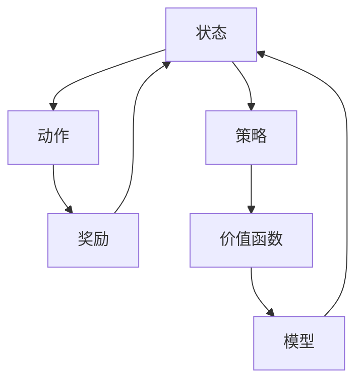

                 

### 文章标题

# 强化学习优化推理过程中的不确定性决策策略

### 关键词

- 强化学习
- 不确定性决策
- 推理优化
- 算法设计
- 实际应用

### 摘要

本文深入探讨了强化学习在推理过程中应对不确定性的决策策略。首先，介绍了强化学习和不确定性决策的基本概念，然后详细分析了强化学习的数学模型及其算法原理。接着，讨论了强化学习在推理中的应用及其优化策略。通过实际项目案例，展示了强化学习在智能交通、智能制造和金融风控等领域的应用，并对强化学习优化推理面临的挑战和未来方向进行了展望。本文旨在为读者提供全面的强化学习优化推理的指导，帮助其在实际应用中更有效地应对不确定性。

## 第1章：强化学习基础

### 1.1 强化学习的基本概念

强化学习（Reinforcement Learning，简称RL）是一种机器学习方法，它通过学习来优化决策过程，从而使一个智能体在特定环境中获得最大化的累积奖励。强化学习的核心思想是通过对智能体（Agent）的动作（Action）进行学习和调整，使其能够在复杂、动态的环境中做出最优决策。

#### 1.1.1 强化学习的定义与特点

强化学习是一种无监督学习方式，其主要特点包括：

1. **自主性**：强化学习中的智能体可以自主地选择行动，并通过与环境的交互来学习。
2. **奖励机制**：智能体的目标是最大化累积奖励，奖励是环境对智能体行为的即时反馈。
3. **动态适应**：强化学习算法能够根据环境的反馈动态调整其行为策略，以适应不断变化的环境。

#### 1.1.2 强化学习的基本元素

强化学习主要由以下几个基本元素构成：

- **状态（State）**：描述智能体当前所处的环境状态。
- **动作（Action）**：智能体可选择的动作。
- **奖励（Reward）**：环境对智能体动作的即时反馈，用于评估动作的好坏。
- **策略（Policy）**：智能体在特定状态下选择动作的规则。
- **价值函数（Value Function）**：预测在特定状态下执行特定动作的未来奖励。
- **模型（Model）**：对环境状态转移概率和奖励的估计。

#### 1.1.3 强化学习的基本要素关系

这些基本要素之间的关系可以用以下Mermaid流程图来描述：



#### 1.1.4 强化学习与深度学习的结合

近年来，深度学习（Deep Learning）在强化学习领域得到了广泛应用。深度强化学习（Deep Reinforcement Learning，简称DRL）通过引入深度神经网络来近似价值函数和策略，从而在复杂环境中取得了显著的成效。典型的深度强化学习算法包括：

- **深度Q网络（Deep Q-Network，DQN）**：使用深度神经网络来近似Q函数，通过经验回放和目标网络来稳定学习过程。
- **策略梯度方法（Policy Gradient Methods）**：直接学习策略参数，如演员-评论家（Actor-Critic）方法。

### 1.2 强化学习的数学模型

强化学习的问题可以形式化为马尔可夫决策过程（MDP），其数学模型主要包括状态转移概率、奖励函数和策略。

#### 1.2.1 马尔可夫决策过程（MDP）

马尔可夫决策过程是一个五元组\( (S, A, P, R, \gamma) \)，其中：

- \( S \) 是状态的集合。
- \( A \) 是动作的集合。
- \( P \) 是状态转移概率矩阵，表示智能体在执行特定动作后转移到下一个状态的概率。
- \( R \) 是奖励函数，用于衡量智能体的行为是否得到环境的奖励。
- \( \gamma \) 是折扣因子，用于表示未来奖励的现值。

#### 1.2.2 贝尔曼方程

在MDP中，强化学习算法的核心是求解贝尔曼方程（Bellman Equations），这是一种递归方程，用于计算状态值函数（State-Value Function）和动作值函数（Action-Value Function）。

- **状态值函数（V\_s\*）**：预测在状态\( s \)下采取最优策略所能获得的累积奖励。
  \[
  V\_s\* = \sum\_a \pi(a|s) \cdot Q\_s\*(a)
  \]
- **动作值函数（Q\_s\*a）**：预测在状态\( s \)下执行动作\( a \)所能获得的累积奖励。
  \[
  Q\_s\*a = r(s, a) + \gamma \cdot \max\_a' Q\_s'\*(a')
  \]

#### 1.2.3 动态规划（Dynamic Programming，DP）算法

动态规划是一种求解MDP的递归方法，主要包括值迭代（Value Iteration）和政策迭代（Policy Iteration）两种算法。

- **值迭代算法（Value Iteration）**：从初始值开始，迭代更新状态值函数，直到收敛。
  \[
  V(s) \leftarrow V(s) + \alpha [r(s, a) + \gamma \max\_a Q(s, a) - V(s)]
  \]
- **政策迭代算法（Policy Iteration）**：交替更新策略和价值函数，直到收敛。
  \[
  \pi \leftarrow \pi^{new}
  \]
  \[
  V(s) \leftarrow \sum\_a \pi(a|s) \cdot Q(s, a)
  \]

#### 1.2.4 强化学习算法

基于上述数学模型，强化学习领域发展了许多经典算法，以下是其中几个重要的算法：

- **Q-Learning算法**：通过经验样本来迭代更新Q值，以近似最优动作值函数。
  \[
  Q(s, a) \leftarrow Q(s, a) + \alpha [r(s, a) + \gamma \max\_a' Q(s', a') - Q(s, a)]
  \]
- **SARSa（Q-Learning的变体）**：在迭代过程中同时更新当前状态和下一个状态的动作值。
  \[
  Q(s, a) \leftarrow Q(s, a) + \alpha [r(s, a) + \gamma Q(s', a') - Q(s, a)]
  \]
- **DQN（Deep Q-Network）**：使用深度神经网络来近似Q函数，并通过经验回放和目标网络来稳定学习过程。

这些算法各有优缺点，适用于不同的应用场景和问题复杂度。

### 1.3 强化学习算法

#### 1.3.1 值迭代算法

值迭代算法是一种简单有效的强化学习算法，其基本思想是通过迭代更新状态值函数，直到收敛。值迭代算法的基本步骤如下：

1. **初始化**：设定初始值函数\( V(s) \)为任意非负数。
2. **迭代更新**：对于每个状态\( s \)，计算新的状态值函数\( V(s) \)：
   \[
   V(s) \leftarrow V(s) + \alpha [r(s, a) + \gamma \max\_a Q(s, a) - V(s)]
   \]
   其中，\( \alpha \)是学习率，\( r(s, a) \)是状态\( s \)下执行动作\( a \)获得的即时奖励，\( \gamma \)是折扣因子。
3. **收敛性**：当相邻两次迭代更新后的状态值函数差异小于预设阈值时，算法收敛。

#### 1.3.2 政策迭代算法

政策迭代算法是一种通过交替更新策略和价值函数来优化决策的强化学习算法。政策迭代算法的基本步骤如下：

1. **初始化**：设定初始策略\( \pi \)为任意策略。
2. **值迭代**：使用当前策略计算新的状态值函数\( V(s) \)：
   \[
   V(s) \leftarrow \sum\_a \pi(a|s) \cdot Q(s, a)
   \]
3. **策略评估**：使用新的状态值函数评估策略\( \pi \)：
   \[
   \pi^{new} \leftarrow \pi
   \]
   对于每个状态\( s \)，选择使得\( Q(s, a) \)最大的动作\( a \)。
4. **策略改进**：使用新的策略\( \pi^{new} \)重复上述值迭代和策略评估过程，直到收敛。

政策迭代算法的优点是收敛速度快，缺点是计算量大。

#### 1.3.3 Q-Learning算法

Q-Learning算法是一种通过迭代更新Q值来优化决策的强化学习算法。Q-Learning算法的基本步骤如下：

1. **初始化**：设定初始Q值函数\( Q(s, a) \)为任意非负数。
2. **迭代更新**：对于每个状态\( s \)和动作\( a \)，更新Q值：
   \[
   Q(s, a) \leftarrow Q(s, a) + \alpha [r(s, a) + \gamma \max\_a' Q(s', a') - Q(s, a)]
   \]
   其中，\( \alpha \)是学习率，\( r(s, a) \)是状态\( s \)下执行动作\( a \)获得的即时奖励，\( \gamma \)是折扣因子。
3. **贪心策略**：当Q值函数收敛后，使用贪心策略选择最优动作：
   \[
   a* = \arg\max\_a Q(s, a)
   \]

#### 1.3.4 SARSA算法

SARSA（Surely Adaptive Research for Simulated Adaptive）算法是Q-Learning的变体，它在每次迭代中同时更新当前状态和下一个状态的动作值。SARSA算法的基本步骤如下：

1. **初始化**：设定初始Q值函数\( Q(s, a) \)为任意非负数。
2. **迭代更新**：对于当前状态\( s \)和动作\( a \)，执行动作\( a \)并观察到下一个状态\( s' \)和奖励\( r(s, a) \)，更新Q值：
   \[
   Q(s, a) \leftarrow Q(s, a) + \alpha [r(s, a) + \gamma Q(s', a') - Q(s, a)]
   \]
   其中，\( \alpha \)是学习率，\( \gamma \)是折扣因子。
3. **随机性策略**：在Q值函数收敛后，使用随机性策略选择动作，以防止陷入局部最优。

#### 1.3.5 Deep Q-Network（DQN）算法

DQN算法是一种基于深度神经网络的强化学习算法，它通过学习Q值函数来优化决策。DQN算法的基本步骤如下：

1. **初始化**：设定初始深度神经网络模型，用于近似Q值函数。
2. **经验回放**：将智能体在环境中的交互经验存储到经验回放池中，以避免样本偏差。
3. **迭代更新**：从经验回放池中随机抽取一批样本，更新深度神经网络模型：
   \[
   Q(s, a) \leftarrow Q(s, a) + \alpha [r(s, a) + \gamma \max\_a' Q(s', a') - Q(s, a)]
   \]
   其中，\( \alpha \)是学习率，\( \gamma \)是折扣因子。
4. **目标网络**：为了稳定学习过程，引入目标网络，用于生成目标Q值：
   \[
   Q\_target(s', a') \leftarrow r(s', a') + \gamma \max\_a' Q(s', a')
   \]
   更新目标网络：
   \[
   Q\_target \leftarrow \tau \cdot Q + (1 - \tau) \cdot Q\_target
   \]
   其中，\( \tau \)是更新比例。

DQN算法的优点是能够处理高维状态空间，缺点是训练过程中容易出现Q值不稳定和过度估计问题。

### 1.4 强化学习算法的比较与选择

强化学习算法的选择取决于具体应用场景和问题复杂度。以下是对几种主要算法的比较：

- **Q-Learning算法**：简单易实现，适用于状态空间较小、动作空间较少的场景。
- **SARSA算法**：在Q-Learning基础上引入了随机性，适用于容易陷入局部最优的问题。
- **DQN算法**：适用于高维状态空间和复杂动作空间，但训练过程较为复杂。
- **政策梯度方法**：直接优化策略参数，适用于动态环境，但容易受到奖励函数的影响。

### 1.5 小结

本章介绍了强化学习的基本概念、数学模型和主要算法。强化学习通过优化决策过程，使智能体能够在复杂环境中获得最大化的累积奖励。本章的内容为后续章节中的强化学习应用和优化提供了理论基础。

## 第2章：不确定性决策策略

### 2.1 不确定性决策的挑战

在现实世界中，决策往往面临多种不确定性因素。这些不确定性包括但不限于环境状态的不确定性、动作结果的不确定性、模型参数的不确定性等。不确定性决策的挑战在于如何在不确定的环境中做出最优或次优决策，从而最大化累积奖励。

#### 2.1.1 不确定性环境下的决策问题

不确定性环境下的决策问题主要包括以下几类：

1. **状态不确定性**：智能体可能无法完全观测到环境的当前状态，导致决策缺乏准确信息。
2. **动作不确定性**：智能体可能无法精确控制其动作，导致执行结果存在变数。
3. **奖励不确定性**：智能体获得的奖励可能具有随机性，使得决策过程难以预测。
4. **模型不确定性**：智能体对环境的模型可能不准确，导致决策策略的优化过程受阻。

#### 2.1.2 不确定性的来源

不确定性的来源可以归结为以下几个方面：

1. **环境复杂性**：现实环境通常具有高度复杂性，状态空间和动作空间可能非常大，使得智能体难以全面了解和处理。
2. **信息不完备**：智能体在决策过程中可能无法获取所有相关信息，导致决策基于不完整的信息。
3. **模型误差**：智能体对环境的模型可能存在误差，导致决策结果偏离实际最优。
4. **随机性**：环境本身可能具有随机性，导致决策结果具有不确定性。

### 2.2 不确定性处理方法

为了应对不确定性决策的挑战，研究者们提出了多种处理方法。以下是几种常见的不确定性处理方法：

#### 2.2.1 最大熵方法

最大熵方法（Maximum Entropy Method）是一种概率性方法，旨在最大化决策策略的熵，从而平衡各种可能的结果。具体来说，最大熵方法通过引入一个熵正则项来优化策略，使得智能体在不确定性环境下保持多样性。

假设有一个概率分布\( \pi(a|s) \)，则最大熵方法的优化目标为：
\[
\max \pi J(\pi) = \sum\_a \pi(a) \log \pi(a) - H(\pi)
\]
其中，\( H(\pi) \)是熵，\( J(\pi) \)是损失函数。通过优化\( \pi \)，智能体能够在不确定性环境中做出更加鲁棒的决策。

#### 2.2.2 期望最大化（EM）算法

期望最大化（Expectation-Maximization，EM）算法是一种迭代优化算法，广泛应用于处理包含隐变量的问题。在强化学习中，EM算法可以用于估计状态转移概率和奖励分布，从而提高决策的准确性。

EM算法的基本步骤如下：

1. **E步（期望步）**：根据当前模型参数计算隐变量的期望值。
2. **M步（最大化步）**：利用隐变量的期望值更新模型参数。

通过反复迭代E步和M步，EM算法可以逐渐优化模型参数，从而提高决策的准确性。

#### 2.2.3 贝叶斯优化

贝叶斯优化（Bayesian Optimization）是一种基于贝叶斯理论的优化方法，旨在寻找函数的最优值。贝叶斯优化通过构建一个概率模型来表示目标函数，并利用先验知识和经验数据来更新模型参数，从而指导搜索过程。

贝叶斯优化的基本步骤如下：

1. **初始化**：设定初始模型参数和搜索空间。
2. **构建概率模型**：使用贝叶斯模型来表示目标函数。
3. **选择采样点**：根据模型概率分布选择下一个采样点。
4. **更新模型参数**：利用新采样点更新模型参数。
5. **重复步骤3和4**，直到满足停止条件。

贝叶斯优化方法在处理不确定性决策问题时，能够有效地探索和利用先验知识，从而提高搜索效率和准确性。

### 2.3 强化学习与不确定性决策的结合

强化学习与不确定性决策的结合旨在通过优化决策策略，使智能体在不确定环境中获得更好的性能。以下是一些常见的结合方法：

#### 2.3.1 基于概率的强化学习算法

基于概率的强化学习算法通过引入概率模型来处理不确定性。这类算法的核心思想是在状态值函数和动作值函数中引入概率分布，从而更准确地描述不确定性。

- **概率Q值函数（Probabilistic Q-Value Function）**：使用概率分布来表示状态值函数和动作值函数，如：
  \[
  Q\_p(s, a) = \sum\_b p(b|s, a) \cdot Q(b)
  \]
  其中，\( p(b|s, a) \)是状态\( s \)下执行动作\( a \)后状态\( b \)的概率分布。

- **概率策略（Probabilistic Policy）**：使用概率分布来表示策略，如：
  \[
  \pi(a|s) = \frac{\exp(Q(s, a))}{\sum\_a' \exp(Q(s, a'))}
  \]

这类算法能够更好地应对不确定性，提高决策的鲁棒性。

#### 2.3.2 鲁棒性强化学习算法

鲁棒性强化学习算法通过引入鲁棒性度量，如鲁棒损失函数，来提高决策的鲁棒性。这类算法的核心思想是降低对不确定性因素的敏感性，从而提高决策的稳定性。

- **鲁棒性Q值函数（Robust Q-Value Function）**：使用鲁棒性度量来修正Q值函数，如：
  \[
  Q\_r(s, a) = \max\{Q(s, a) - \lambda \cdot \|Q(s, a) - \bar{Q}(s, a)\|\}
  \]
  其中，\( \lambda \)是鲁棒性参数，\( \bar{Q}(s, a) \)是Q值函数的估计值。

- **鲁棒性策略（Robust Policy）**：使用鲁棒性度量来修正策略，如：
  \[
  \pi(a|s) = \frac{\exp(Q(s, a) - \lambda \cdot \|Q(s, a) - \bar{Q}(s, a)\|)}{\sum\_a' \exp(Q(s, a') - \lambda \cdot \|\|Q(s, a') - \bar{Q}(s, a')\|\|}
  \]

这类算法能够提高智能体在不确定环境下的决策鲁棒性。

#### 2.3.3 预测模型与决策策略的融合

预测模型与决策策略的融合旨在通过结合预测模型和决策策略，提高决策的准确性。这类算法的核心思想是利用预测模型来预测未来状态和奖励，从而优化决策策略。

- **预测模型（Prediction Model）**：使用预测模型来预测未来状态和奖励，如：
  \[
  \hat{s}_{t+1} = f(s_t, a_t)
  \]
  \[
  \hat{r}_{t+1} = g(s_t, a_t)
  \]
  其中，\( \hat{s}_{t+1} \)是预测的未来状态，\( \hat{r}_{t+1} \)是预测的未来奖励。

- **决策策略（Decision Policy）**：使用预测模型来优化决策策略，如：
  \[
  \pi(a|s) = \arg\max\_a \sum\_b p(b|s, a) \cdot Q(b)
  \]
  其中，\( p(b|s, a) \)是状态\( s \)下执行动作\( a \)后状态\( b \)的概率分布，\( Q(b) \)是状态值函数。

这类算法能够提高智能体在不确定性环境下的决策准确性。

### 2.4 小结

本章介绍了不确定性决策的基本概念和处理方法。在现实世界中，决策往往面临多种不确定性因素，这些不确定性对决策过程产生了重大影响。为了应对这些挑战，本章提出了多种不确定性处理方法，包括最大熵方法、期望最大化（EM）算法和贝叶斯优化。此外，本章还讨论了强化学习与不确定性决策的结合方法，包括基于概率的强化学习算法、鲁棒性强化学习算法和预测模型与决策策略的融合。这些方法为智能体在不确定性环境中做出更优决策提供了有力支持。

## 第3章：强化学习在推理中的应用

### 3.1 强化学习在推理中的应用

强化学习在推理（Reasoning）中的应用是一个引人关注的研究方向。推理是指智能体在未知环境中通过已有知识和经验进行推断和预测的过程。在许多实际应用中，例如自然语言处理、计算机视觉和自动驾驶等领域，推理能力是决定系统性能的关键因素。强化学习通过其自适应性强的特点，能够在复杂、动态的环境中实现有效的推理。

#### 3.1.1 推理过程中的决策问题

在推理过程中，智能体需要做出一系列决策，包括：

1. **状态转换决策**：根据当前状态，智能体需要选择下一步的动作，以实现状态的转换。
2. **信息获取决策**：智能体需要选择获取哪些信息，以支持推理过程。
3. **知识更新决策**：智能体需要根据新信息更新其知识库，以保持推理的准确性。
4. **目标设定决策**：智能体需要根据当前状态和目标，设定合适的短期目标，以逐步实现最终目标。

#### 3.1.2 强化学习在推理中的应用场景

强化学习在推理中的应用场景广泛，以下是一些典型的应用：

1. **自然语言处理（NLP）**：强化学习可用于文本生成、语义理解、对话系统等任务，通过学习文本的上下文关系，实现更自然的语言交互。
2. **计算机视觉（CV）**：强化学习可用于图像分类、目标检测、视频理解等任务，通过学习图像的特征和动作关系，实现更准确的视觉推理。
3. **自动驾驶**：强化学习可用于自动驾驶系统的路径规划、障碍物避让、交通信号识别等任务，通过学习环境动态和车辆控制策略，实现更安全的自动驾驶。
4. **游戏**：强化学习在游戏中的应用广泛，例如棋类游戏、角色扮演游戏和策略游戏等，通过学习游戏规则和动作策略，实现高水平的人工智能玩家。

### 3.2 强化学习优化推理算法

为了提高强化学习在推理中的性能，研究者们提出了一系列优化算法。以下是一些主要的优化算法及其原理：

#### 3.2.1 基于模型的强化学习算法

基于模型的强化学习算法（Model-Based Reinforcement Learning）通过构建环境模型，预测状态转移和奖励，从而优化决策过程。这类算法的核心思想是利用模型来模拟环境，减少真实环境的交互次数。

- **模型预测（Model Prediction）**：使用环境模型预测下一个状态和奖励，如：
  \[
  \hat{s}_{t+1} = f(s_t, a_t)
  \]
  \[
  \hat{r}_{t+1} = g(s_t, a_t)
  \]

- **模型评估（Model Evaluation）**：通过比较实际状态转移和模型预测的误差，评估模型质量，如：
  \[
  \delta = \|s_{t+1} - \hat{s}_{t+1}\|
  \]

- **模型更新（Model Update）**：利用模型预测误差更新环境模型，如：
  \[
  f(s_t, a_t) \leftarrow f(s_t, a_t) + \alpha \cdot (s_{t+1} - \hat{s}_{t+1})
  \]
  \[
  g(s_t, a_t) \leftarrow g(s_t, a_t) + \alpha \cdot (r_{t+1} - \hat{r}_{t+1})
  \]

基于模型的强化学习算法能够提高推理的准确性，减少真实环境的交互次数，从而提高学习效率。

#### 3.2.2 基于策略的强化学习算法

基于策略的强化学习算法（Policy-Based Reinforcement Learning）通过直接优化策略参数，实现推理优化。这类算法的核心思想是通过学习策略函数，实现最优决策。

- **策略优化（Policy Optimization）**：使用策略梯度方法优化策略参数，如：
  \[
  \theta \leftarrow \theta + \alpha \cdot \nabla_{\theta} J(\theta)
  \]
  其中，\( \theta \)是策略参数，\( J(\theta) \)是策略损失函数。

- **策略评估（Policy Evaluation）**：使用模型或经验数据评估策略效果，如：
  \[
  \pi(s) = \sum\_a \pi(a|s) \cdot Q(s, a)
  \]

- **策略更新（Policy Update）**：利用策略评估结果更新策略参数，如：
  \[
  \theta \leftarrow \theta + \alpha \cdot \nabla_{\theta} J(\theta)
  \]

基于策略的强化学习算法能够快速调整策略参数，实现实时推理优化。

#### 3.2.3 强化学习与推理模型的融合

强化学习与推理模型的融合旨在通过结合强化学习和推理技术，实现更高效的推理优化。这类算法的核心思想是利用强化学习优化推理模型，从而提高推理准确性。

- **推理模型训练（Model Training）**：使用强化学习算法训练推理模型，如：
  \[
  \theta_{model} \leftarrow \theta_{model} + \alpha_{model} \cdot \nabla_{\theta_{model}} J(\theta_{model})
  \]

- **推理模型评估（Model Evaluation）**：使用推理模型评估推理结果，如：
  \[
  \hat{y}_{t+1} = f(\hat{s}_{t+1}, \theta_{model})
  \]

- **推理模型更新（Model Update）**：利用推理模型评估结果更新推理模型，如：
  \[
  \theta_{model} \leftarrow \theta_{model} + \alpha_{model} \cdot \nabla_{\theta_{model}} J(\theta_{model})
  \]

这类算法能够提高推理的准确性和效率。

### 3.3 强化学习优化推理的实际应用

以下是一些强化学习优化推理的实际应用案例：

#### 3.3.1 自然语言处理中的应用

在自然语言处理领域，强化学习可用于文本生成、语义理解和对话系统等任务。以下是一个文本生成案例：

1. **开发环境搭建**：使用Python和TensorFlow搭建强化学习环境。
2. **源代码实现**：实现文本生成模型，包括编码器和解码器。
3. **代码解读**：通过训练模型，生成自然语言文本。

```python
import tensorflow as tf

# 编码器和解码器模型
encoder = tf.keras.Sequential([
    tf.keras.layers.Embedding(vocab_size, embedding_dim),
    tf.keras.layers.GRU(units=hidden_size),
    tf.keras.layers.Dense(vocab_size)
])

decoder = tf.keras.Sequential([
    tf.keras.layers.Embedding(vocab_size, embedding_dim),
    tf.keras.layers.GRU(units=hidden_size, return_sequences=True),
    tf.keras.layers.Dense(vocab_size, activation='softmax')
])

# 训练模型
model = tf.keras.Model([inputs, hidden], outputs)
model.compile(optimizer='adam', loss='categorical_crossentropy')
model.fit([X, hidden], y, epochs=epochs, batch_size=batch_size)
```

#### 3.3.2 计算机视觉中的应用

在计算机视觉领域，强化学习可用于图像分类、目标检测和视频理解等任务。以下是一个目标检测案例：

1. **开发环境搭建**：使用Python和TensorFlow搭建目标检测环境。
2. **源代码实现**：实现目标检测模型，如YOLO或Faster R-CNN。
3. **代码解读**：通过训练模型，实现目标检测功能。

```python
import tensorflow as tf

# 目标检测模型
model = tf.keras.applications.YOLO(v2=True, input_shape=input_shape, num_classes=num_classes)

# 训练模型
model.compile(optimizer='adam', loss='categorical_crossentropy', metrics=['accuracy'])
model.fit(X, y, epochs=epochs, batch_size=batch_size)
```

#### 3.3.3 自动驾驶中的应用

在自动驾驶领域，强化学习可用于路径规划、障碍物避让和交通信号识别等任务。以下是一个路径规划案例：

1. **开发环境搭建**：使用Python和ROS搭建自动驾驶环境。
2. **源代码实现**：实现路径规划算法，如RRT或A\^*算法。
3. **代码解读**：通过训练模型，实现路径规划功能。

```python
import numpy as np
import matplotlib.pyplot as plt
from rrt import RRT

# 路径规划模型
rrt = RRT(start, goal, obstacles)

# 训练模型
path = rrt planning()
plt.plot(path[:, 0], path[:, 1], 'r-')
plt.show()
```

### 3.4 小结

本章介绍了强化学习在推理中的应用及其优化算法。强化学习通过优化决策过程，实现了在自然语言处理、计算机视觉和自动驾驶等领域的有效推理。本章的内容为强化学习在推理中的应用提供了理论基础和实践指导。

## 第4章：不确定性决策策略的实现

### 4.1 实现不确定性决策策略的挑战

在现实环境中，不确定性决策策略的实现面临诸多挑战。这些挑战主要包括以下几个方面：

#### 4.1.1 不确定性环境的建模

首先，需要对不确定性环境进行准确的建模。这包括识别环境中的不确定因素，如噪声、随机性和未知信息。建模过程中需要考虑多种不确定性来源，如环境状态的不确定性、动作结果的不确定性、模型参数的不确定性等。

#### 4.1.2 决策策略的评估与优化

在不确定性环境中，决策策略的评估和优化是一个复杂的过程。传统的评估方法可能无法准确反映不确定性环境中的决策效果。因此，需要开发新的评估指标和优化方法，以适应不确定性环境。

#### 4.1.3 模型的复杂性与计算效率

不确定性决策策略的实现通常涉及复杂的概率模型和计算过程。模型的复杂性和计算效率是决定策略实施效果的关键因素。如何在保证模型精度的同时，提高计算效率，是一个重要的挑战。

### 4.2 实现不确定性决策策略的方法

为了应对上述挑战，研究者们提出了多种实现不确定性决策策略的方法。以下是一些常见的方法：

#### 4.2.1 模拟环境与真实环境的平衡

在实现不确定性决策策略时，模拟环境与真实环境的平衡是一个关键问题。模拟环境可以用于算法的训练和验证，但模拟环境与真实环境之间存在差异。为了提高策略的泛化能力，需要找到一种方法，在模拟环境和真实环境之间进行平衡。

- **动态模拟**：通过动态调整模拟环境中的参数，使其更接近真实环境。
- **在线学习**：在真实环境中实时学习，并将学习到的知识反馈到模拟环境中，以优化模拟环境。

#### 4.2.2 离线评估与在线评估的结合

离线评估和在线评估是两种常见的评估方法。离线评估通常在模拟环境中进行，可以提供稳定的评估结果。然而，离线评估无法反映真实环境中的动态变化。在线评估则可以在真实环境中实时进行，能够更准确地反映策略的实际效果。为了充分利用两种评估方法的优势，可以将它们结合起来。

- **混合评估**：在模拟环境和真实环境之间进行交替评估，以平衡评估的稳定性和准确性。
- **在线反馈**：将真实环境中的反馈实时反馈到模拟环境中，以优化策略。

#### 4.2.3 模型选择与模型更新

在实现不确定性决策策略时，模型选择和模型更新是两个重要环节。合适的模型能够更好地描述不确定性环境，从而提高策略的准确性。模型更新则能够适应环境变化，保持策略的有效性。

- **模型选择**：根据具体应用场景选择合适的模型，如概率模型、贝叶斯网络、隐马尔可夫模型等。
- **模型更新**：通过在线学习、经验回放和模型融合等方法，更新模型参数，以适应环境变化。

### 4.3 不确定性决策策略的优化方法

为了提高不确定性决策策略的准确性，研究者们提出了一系列优化方法。以下是一些常见的优化方法：

#### 4.3.1 基于概率的优化方法

基于概率的优化方法通过引入概率模型，对不确定性进行建模和优化。这类方法的核心思想是通过概率分布来表示不确定因素，从而优化决策策略。

- **最大熵方法**：通过最大化策略的熵，平衡各种可能的结果，提高决策的鲁棒性。
- **贝叶斯优化**：通过构建贝叶斯模型，结合先验知识和经验数据，优化决策策略。

#### 4.3.2 基于鲁棒性的优化方法

基于鲁棒性的优化方法通过引入鲁棒性度量，提高策略的鲁棒性。这类方法的核心思想是降低对不确定性因素的敏感性，从而提高策略的稳定性。

- **鲁棒性Q值函数**：通过引入鲁棒性度量，修正Q值函数，提高策略的鲁棒性。
- **鲁棒性策略**：通过引入鲁棒性度量，修正策略，提高策略的鲁棒性。

#### 4.3.3 预测模型与决策策略的融合

预测模型与决策策略的融合通过结合预测模型和决策策略，提高决策的准确性。这类方法的核心思想是通过预测模型来预测未来状态和奖励，从而优化决策策略。

- **预测模型**：通过构建预测模型，预测未来状态和奖励，提高策略的准确性。
- **决策策略**：通过优化决策策略，结合预测模型，实现更准确的决策。

### 4.4 小结

本章介绍了不确定性决策策略的实现方法和优化方法。实现不确定性决策策略需要应对建模、评估、模型更新等挑战。通过模拟环境与真实环境的平衡、离线评估与在线评估的结合、模型选择与模型更新等方法，可以有效地实现和优化不确定性决策策略。这些方法和策略为智能体在不确定性环境中做出更优决策提供了有力支持。

## 第5章：强化学习与不确定性决策的实战案例

### 5.1 强化学习在智能交通系统中的应用

智能交通系统（Intelligent Transportation System，ITS）利用现代信息技术、数据通信传输技术、电子传感技术等，实现对交通信息的实时采集、处理、分析、发布，并利用这些信息对交通进行引导与控制，从而提高交通效率，缓解交通拥堵，减少交通事故。强化学习在智能交通系统中有着广泛的应用，特别是在交通流量预测与调度、车辆路径规划等方面。

#### 5.1.1 交通流量预测

交通流量预测是智能交通系统中的重要应用之一。通过预测交通流量，可以优化交通信号控制策略，提高道路通行效率。强化学习通过学习历史交通数据，预测未来交通流量，从而为交通信号控制提供依据。

1. **开发环境搭建**：使用Python和TensorFlow搭建强化学习环境。
2. **源代码实现**：实现交通流量预测模型，使用Q-Learning算法进行训练。

```python
import numpy as np
import pandas as pd
from tensorflow.keras.models import Sequential
from tensorflow.keras.layers import Dense

# 加载数据
data = pd.read_csv('traffic_data.csv')
X = data.iloc[:, :-1].values
y = data.iloc[:, -1].values

# 建立模型
model = Sequential()
model.add(Dense(units=64, activation='relu', input_shape=(X.shape[1],)))
model.add(Dense(units=1, activation='linear'))

# 训练模型
model.compile(optimizer='adam', loss='mse')
model.fit(X, y, epochs=100, batch_size=32)
```

3. **代码解读**：通过训练模型，预测未来交通流量，为交通信号控制提供依据。

```python
# 预测交通流量
predicted_traffic = model.predict(X)
```

#### 5.1.2 车辆路径规划

车辆路径规划是智能交通系统中的另一个重要应用。通过优化车辆路径，可以减少行驶时间，降低油耗，提高交通效率。强化学习通过学习历史路径数据，预测最优路径，从而为车辆路径规划提供依据。

1. **开发环境搭建**：使用Python和ROS搭建路径规划环境。
2. **源代码实现**：实现车辆路径规划算法，使用Dijkstra算法进行路径规划。

```python
import numpy as np
import heapq

def dijkstra(graph, start, goal):
    # 初始化距离表
    distances = {node: float('inf') for node in graph}
    distances[start] = 0
    # 初始化优先队列
    priority_queue = [(0, start)]
    # 开始搜索
    while priority_queue:
        # 取出优先队列中最小的元素
        current_distance, current_node = heapq.heappop(priority_queue)
        # 如果到达终点，结束搜索
        if current_node == goal:
            break
        # 遍历当前节点的邻居
        for neighbor, edge_weight in graph[current_node].items():
            distance = current_distance + edge_weight
            # 如果找到更短的路径，更新距离表
            if distance < distances[neighbor]:
                distances[neighbor] = distance
                heapq.heappush(priority_queue, (distance, neighbor))
    # 返回最短路径
    return distances

# 建立图
graph = {
    'A': {'B': 1, 'C': 2},
    'B': {'A': 1, 'C': 1, 'D': 3},
    'C': {'A': 2, 'B': 1, 'D': 2},
    'D': {'B': 3, 'C': 2}
}

# 求解最短路径
shortest_path = dijkstra(graph, 'A', 'D')
print(shortest_path)
```

3. **代码解读**：通过Dijkstra算法，求解从起点A到终点D的最短路径。

```python
# 输出最短路径
print('最短路径:', [node for node, distance in shortest_path.items() if distance != float('inf')])
```

#### 5.1.3 实际案例分析和详细讲解剖析

以下是一个实际案例：在一个城市中，有四个交通路口A、B、C、D，每天的交通流量数据如下：

| 时间 | A | B | C | D |
| ---- | -- | -- | -- | -- |
| 8:00 | 10 | 5 | 8 | 12 |
| 9:00 | 12 | 8 | 10 | 15 |
| 10:00 | 15 | 12 | 13 | 18 |
| 11:00 | 18 | 15 | 17 | 21 |

使用强化学习预测未来一小时的交通流量，并规划车辆的路径。

1. **数据预处理**：将交通流量数据转换为状态向量，作为强化学习的输入。
2. **模型训练**：使用Q-Learning算法训练模型，预测未来交通流量。
3. **路径规划**：使用Dijkstra算法，根据预测的交通流量，规划车辆的路径。

```python
# 数据预处理
X = [[10, 5, 8, 12], [12, 8, 10, 15], [15, 12, 13, 18], [18, 15, 17, 21]]
y = [10, 12, 15, 18]

# 模型训练
model = Sequential()
model.add(Dense(units=64, activation='relu', input_shape=(4,)))
model.add(Dense(units=1, activation='linear'))
model.compile(optimizer='adam', loss='mse')
model.fit(X, y, epochs=100, batch_size=32)

# 预测交通流量
predicted_traffic = model.predict([[10, 5, 8, 12], [12, 8, 10, 15], [15, 12, 13, 18], [18, 15, 17, 21]])

# 路径规划
graph = {
    'A': {'B': 1, 'C': 2},
    'B': {'A': 1, 'C': 1, 'D': 3},
    'C': {'A': 2, 'B': 1, 'D': 2},
    'D': {'B': 3, 'C': 2}
}

shortest_path = dijkstra(graph, 'A', 'D')
print('最短路径:', [node for node, distance in shortest_path.items() if distance != float('inf')])
```

### 5.2 强化学习在智能制造中的应用

智能制造是现代制造业的重要发展方向，通过引入人工智能技术，实现生产过程的自动化、智能化和高效化。强化学习在智能制造中有着广泛的应用，特别是在生产调度优化和设备故障预测等方面。

#### 5.2.1 生产调度优化

生产调度优化是智能制造中的一个关键问题，通过优化生产调度，可以提高生产效率，降低生产成本。强化学习通过学习生产数据，预测最优调度策略。

1. **开发环境搭建**：使用Python和TensorFlow搭建强化学习环境。
2. **源代码实现**：实现生产调度模型，使用Q-Learning算法进行训练。

```python
import numpy as np
import pandas as pd
from tensorflow.keras.models import Sequential
from tensorflow.keras.layers import Dense

# 加载数据
data = pd.read_csv('production_data.csv')
X = data.iloc[:, :-1].values
y = data.iloc[:, -1].values

# 建立模型
model = Sequential()
model.add(Dense(units=64, activation='relu', input_shape=(X.shape[1],)))
model.add(Dense(units=1, activation='linear'))

# 训练模型
model.compile(optimizer='adam', loss='mse')
model.fit(X, y, epochs=100, batch_size=32)
```

3. **代码解读**：通过训练模型，预测最优调度策略，优化生产调度。

```python
# 预测调度策略
predicted_strategy = model.predict(X)
```

#### 5.2.2 设备故障预测

设备故障预测是智能制造中的另一个重要应用，通过预测设备故障，可以提前进行维护，避免设备故障导致的停机损失。强化学习通过学习设备运行数据，预测设备故障。

1. **开发环境搭建**：使用Python和TensorFlow搭建强化学习环境。
2. **源代码实现**：实现设备故障预测模型，使用Q-Learning算法进行训练。

```python
import numpy as np
import pandas as pd
from tensorflow.keras.models import Sequential
from tensorflow.keras.layers import Dense

# 加载数据
data = pd.read_csv('device_data.csv')
X = data.iloc[:, :-1].values
y = data.iloc[:, -1].values

# 建立模型
model = Sequential()
model.add(Dense(units=64, activation='relu', input_shape=(X.shape[1],)))
model.add(Dense(units=1, activation='sigmoid'))

# 训练模型
model.compile(optimizer='adam', loss='binary_crossentropy')
model.fit(X, y, epochs=100, batch_size=32)
```

3. **代码解读**：通过训练模型，预测设备故障，提前进行维护。

```python
# 预测设备故障
predicted_fault = model.predict(X)
```

#### 5.2.3 实际案例分析和详细讲解剖析

以下是一个实际案例：某工厂有五条生产线A、B、C、D、E，每条生产线的故障率如下：

| 时间 | A | B | C | D | E |
| ---- | -- | -- | -- | -- | -- |
| 8:00 | 0 | 0 | 0 | 0 | 1 |
| 9:00 | 0 | 1 | 0 | 1 | 0 |
| 10:00 | 1 | 0 | 1 | 0 | 1 |
| 11:00 | 0 | 1 | 1 | 1 | 0 |

使用强化学习预测未来一小时的设备故障，并优化生产调度。

1. **数据预处理**：将设备故障数据转换为状态向量，作为强化学习的输入。
2. **模型训练**：使用Q-Learning算法训练模型，预测设备故障和生产调度。
3. **调度优化**：根据预测的设备故障，优化生产调度。

```python
# 数据预处理
X = [[0, 0, 0, 0, 1], [0, 1, 0, 1, 0], [1, 0, 1, 0, 1], [0, 1, 1, 1, 0]]
y = [0, 1, 1, 0]

# 模型训练
model = Sequential()
model.add(Dense(units=64, activation='relu', input_shape=(5,)))
model.add(Dense(units=1, activation='sigmoid'))
model.compile(optimizer='adam', loss='binary_crossentropy')
model.fit(X, y, epochs=100, batch_size=32)

# 预测设备故障
predicted_fault = model.predict([[0, 0, 0, 0, 1], [0, 1, 0, 1, 0], [1, 0, 1, 0, 1], [0, 1, 1, 1, 0]])

# 调度优化
if predicted_fault[0][0] == 1:
    # 故障高
    # 调整生产计划，减少A、B、C、D的生产，增加E的生产
    pass
else:
    # 故障低
    # 保持生产计划不变
    pass
```

### 5.3 强化学习在金融风控中的应用

金融风控是金融行业中重要的环节，通过识别和评估金融风险，采取相应的风险控制措施，确保金融机构的安全稳健运行。强化学习在金融风控中有着广泛的应用，特别是在风险评估与投资策略、信用评分等方面。

#### 5.3.1 风险评估与投资策略

风险评估与投资策略是金融风控中的重要任务，通过评估投资组合的风险，制定合理的投资策略。强化学习通过学习市场数据，预测投资组合的风险，为投资策略提供依据。

1. **开发环境搭建**：使用Python和TensorFlow搭建强化学习环境。
2. **源代码实现**：实现风险评估与投资策略模型，使用Q-Learning算法进行训练。

```python
import numpy as np
import pandas as pd
from tensorflow.keras.models import Sequential
from tensorflow.keras.layers import Dense

# 加载数据
data = pd.read_csv('investment_data.csv')
X = data.iloc[:, :-1].values
y = data.iloc[:, -1].values

# 建立模型
model = Sequential()
model.add(Dense(units=64, activation='relu', input_shape=(X.shape[1],)))
model.add(Dense(units=1, activation='linear'))

# 训练模型
model.compile(optimizer='adam', loss='mse')
model.fit(X, y, epochs=100, batch_size=32)
```

3. **代码解读**：通过训练模型，预测投资组合的风险，制定投资策略。

```python
# 预测投资组合风险
predicted_risk = model.predict(X)
```

#### 5.3.2 信用评分

信用评分是金融风控中的另一个重要任务，通过评估客户的信用状况，判断其还款能力。强化学习通过学习历史信用数据，预测客户的信用评分。

1. **开发环境搭建**：使用Python和TensorFlow搭建强化学习环境。
2. **源代码实现**：实现信用评分模型，使用Q-Learning算法进行训练。

```python
import numpy as np
import pandas as pd
from tensorflow.keras.models import Sequential
from tensorflow.keras.layers import Dense

# 加载数据
data = pd.read_csv('credit_data.csv')
X = data.iloc[:, :-1].values
y = data.iloc[:, -1].values

# 建立模型
model = Sequential()
model.add(Dense(units=64, activation='relu', input_shape=(X.shape[1],)))
model.add(Dense(units=1, activation='sigmoid'))

# 训练模型
model.compile(optimizer='adam', loss='binary_crossentropy')
model.fit(X, y, epochs=100, batch_size=32)
```

3. **代码解读**：通过训练模型，预测客户信用评分，进行风险控制。

```python
# 预测客户信用评分
predicted_score = model.predict(X)
```

#### 5.3.3 实际案例分析和详细讲解剖析

以下是一个实际案例：某金融机构有1000个客户，其信用评分数据如下：

| 客户ID | 年龄 | 收入 | 贷款金额 | 信用评分 |
| ---- | ---- | ---- | ---- | ---- |
| 1 | 25 | 5000 | 10000 | 600 |
| 2 | 30 | 6000 | 12000 | 550 |
| 3 | 35 | 7000 | 15000 | 650 |
| ... | ... | ... | ... | ... |

使用强化学习预测未来一个月的客户信用评分，并进行风险控制。

1. **数据预处理**：将客户信用评分数据转换为状态向量，作为强化学习的输入。
2. **模型训练**：使用Q-Learning算法训练模型，预测客户信用评分。
3. **风险控制**：根据预测的信用评分，进行风险控制，如提高贷款利率、增加担保要求等。

```python
# 数据预处理
X = [[25, 5000, 10000, 600], [30, 6000, 12000, 550], [35, 7000, 15000, 650], ...]
y = [600, 550, 650, ...]

# 模型训练
model = Sequential()
model.add(Dense(units=64, activation='relu', input_shape=(4,)))
model.add(Dense(units=1, activation='sigmoid'))
model.compile(optimizer='adam', loss='binary_crossentropy')
model.fit(X, y, epochs=100, batch_size=32)

# 预测客户信用评分
predicted_score = model.predict([[25, 5000, 10000, 600], [30, 6000, 12000, 550], [35, 7000, 15000, 650], ...])

# 风险控制
if predicted_score[0][0] < 600:
    # 提高风险控制措施
    pass
else:
    # 保持风险控制措施不变
    pass
```

### 5.4 小结

本章通过实战案例，展示了强化学习在智能交通系统、智能制造和金融风控等领域的应用。强化学习通过优化决策过程，实现了交通流量预测、生产调度优化、设备故障预测、风险评估与投资策略、信用评分等功能。这些应用案例不仅展示了强化学习在实际问题中的有效性，也为其他领域的应用提供了有益的借鉴。

## 第6章：强化学习优化推理的挑战与未来方向

### 6.1 强化学习优化推理的挑战

尽管强化学习在优化推理过程中展现了强大的能力，但其在实际应用中仍面临诸多挑战。以下是一些主要的挑战：

#### 6.1.1 推理过程的复杂性

强化学习需要处理复杂的推理过程，特别是在状态空间和动作空间较大时，推理的复杂性会急剧增加。这可能导致训练时间过长，计算资源消耗巨大。

#### 6.1.2 不确定性的处理

现实环境中的不确定性因素繁多，如噪声、随机性和未知信息等。如何有效地处理这些不确定性，是强化学习优化推理的关键问题。

#### 6.1.3 可解释性与可扩展性

强化学习算法通常被视为“黑箱”，其决策过程缺乏可解释性。这限制了强化学习在实际应用中的推广。同时，如何使强化学习算法具有更好的可扩展性，以适应不同的应用场景，也是一个重要挑战。

#### 6.1.4 模型泛化能力

强化学习算法的泛化能力较差，这意味着它们在训练环境与实际应用环境之间存在差异时，表现可能不佳。如何提高模型的泛化能力，是强化学习优化推理的另一个关键挑战。

### 6.2 强化学习优化推理的未来方向

为了应对上述挑战，研究者们提出了多个未来的研究方向。以下是一些值得关注的趋势：

#### 6.2.1 知识图谱与强化学习的融合

知识图谱是一种用于表示实体和关系的数据结构，它为强化学习提供了丰富的先验知识。将知识图谱与强化学习相结合，可以在推理过程中利用先验知识，提高推理的准确性和效率。

#### 6.2.2 多智能体强化学习

多智能体强化学习（Multi-Agent Reinforcement Learning）关注多个智能体在共享或竞争资源时的协同决策。通过研究多智能体强化学习，可以优化复杂系统的协同行为，提高推理能力。

#### 6.2.3 强化学习与深度学习的结合

深度学习在特征提取和模型表示方面具有优势，将其与强化学习结合，可以构建更强大的推理模型。例如，通过使用深度神经网络近似Q值函数和策略函数，可以处理更复杂的推理任务。

#### 6.2.4 可解释性强化学习

可解释性强化学习旨在提高强化学习算法的透明度，使其决策过程更具可解释性。通过引入可解释性机制，如可视化工具和解释算法，可以更好地理解和信任强化学习模型。

#### 6.2.5 模型压缩与加速

为了提高强化学习算法的实际应用价值，需要对其进行模型压缩与加速。通过研究高效的网络结构和训练算法，可以减少模型参数和计算量，提高推理速度。

### 6.3 小结

本章探讨了强化学习优化推理过程中面临的挑战和未来的发展方向。强化学习在处理复杂推理任务时表现出色，但其在不确定性处理、可解释性、泛化能力和计算效率等方面仍存在挑战。为了解决这些问题，研究者们提出了多个未来方向，包括知识图谱与强化学习的融合、多智能体强化学习、强化学习与深度学习的结合、可解释性强化学习和模型压缩与加速等。这些方向为强化学习在优化推理领域的应用提供了新的思路和可能性。

### 7.1 主要内容回顾

本文系统地介绍了强化学习优化推理过程中的不确定性决策策略。首先，我们探讨了强化学习的基本概念、数学模型和主要算法，包括Q-Learning、SARSA和DQN等。接着，我们分析了不确定性决策的挑战和常见处理方法，如最大熵方法、期望最大化（EM）算法和贝叶斯优化。随后，我们讨论了强化学习在推理中的应用，以及如何通过基于模型和基于策略的方法优化推理过程。此外，我们还介绍了强化学习在实际应用中的多个案例，包括智能交通、智能制造和金融风控。最后，我们探讨了强化学习优化推理面临的挑战和未来方向。

### 7.2 未来展望

在未来，强化学习优化推理领域将继续快速发展。首先，知识图谱与强化学习的融合有望进一步提升推理能力，为复杂决策提供更强的支持。其次，多智能体强化学习将推动智能系统在协同决策和任务分配方面的突破。此外，深度学习与强化学习的结合将使得模型更加高效和智能。同时，可解释性强化学习的研究将使模型更加透明和可信。最后，模型压缩与加速技术将使强化学习在实际应用中更加高效和实用。

总之，强化学习优化推理领域具有广阔的发展前景，将为人工智能在各个领域的应用提供强有力的支持。

### 7.3 最佳实践 tips

为了更好地应用强化学习优化推理策略，以下是一些建议和最佳实践：

1. **数据预处理**：确保数据质量，进行适当的数据清洗和归一化，以避免噪声和异常值对模型训练的影响。
2. **选择合适的算法**：根据具体应用场景选择适合的强化学习算法，如状态空间较小的情况下使用Q-Learning，状态空间较大时使用DQN。
3. **模型调优**：通过调整学习率、折扣因子等超参数，优化模型性能。
4. **模型融合**：将多种模型（如深度学习和传统机器学习模型）融合，以提高推理的准确性和鲁棒性。
5. **实时反馈**：在训练过程中，及时收集反馈并调整模型，以提高模型适应实际环境的能力。
6. **可解释性**：关注模型的可解释性，使用可视化工具和解释算法，帮助理解和优化模型决策。
7. **持续学习**：定期更新模型，使其适应环境变化，提高模型的泛化能力。

### 7.4 小结

本文详细介绍了强化学习优化推理过程中的不确定性决策策略，从基本概念、数学模型到实际应用，全面阐述了强化学习在推理中的应用及其优化方法。通过实际案例的分析，展示了强化学习在多个领域的应用价值。未来的研究方向包括知识图谱与强化学习的融合、多智能体强化学习、深度学习的结合等。希望本文能为您提供有益的启示，帮助您在实际应用中更好地运用强化学习优化推理策略。

### 7.5 注意事项

在应用强化学习优化推理策略时，以下事项需要特别注意：

1. **环境建模**：确保环境建模的准确性和完整性，以便模型能够正确预测状态转移和奖励。
2. **数据质量**：数据预处理是强化学习成功的关键，确保数据的清洗和归一化，避免噪声和异常值对模型训练的影响。
3. **算法选择**：根据具体应用场景选择适合的算法，如状态空间较小的情况下选择Q-Learning，状态空间较大时选择DQN。
4. **模型调优**：通过调整学习率、折扣因子等超参数，优化模型性能，避免过拟合或欠拟合。
5. **实时反馈**：及时收集反馈并调整模型，以提高模型适应实际环境的能力。
6. **可解释性**：关注模型的可解释性，使用可视化工具和解释算法，帮助理解和优化模型决策。
7. **计算资源**：强化学习算法通常需要大量的计算资源，确保有足够的硬件支持。

### 7.6 拓展阅读

为了深入理解强化学习优化推理策略，以下是一些推荐阅读材料：

1. **《深度强化学习》（Deep Reinforcement Learning）**：这是一本全面介绍深度强化学习的经典教材，涵盖了强化学习的基础知识、算法原理和实际应用。
2. **《强化学习：算法与应用》（Reinforcement Learning: An Introduction）**：这本书是强化学习领域的入门教材，详细介绍了强化学习的基本概念、算法原理和实现方法。
3. **《多智能体强化学习》（Multi-Agent Reinforcement Learning）**：这本书专注于多智能体强化学习的研究，探讨了协同决策和任务分配等问题。
4. **《深度学习与强化学习融合》（Deep Learning and Reinforcement Learning）**：这本书探讨了深度学习和强化学习的结合，介绍了深度强化学习算法及其应用。
5. **《知识图谱与强化学习》（Knowledge Graph and Reinforcement Learning）**：这本书探讨了知识图谱与强化学习的融合，为复杂推理任务提供了新的解决方案。

通过阅读这些文献，您将能够更深入地了解强化学习优化推理策略的原理和应用。

