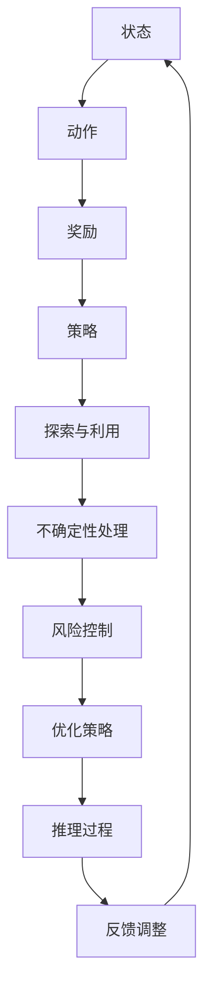

                 


### 引言

强化学习作为一种重要的机器学习分支，近年来在人工智能领域取得了显著的进展。其核心思想是通过与环境的交互，学习出一个最优策略以最大化累积奖励。然而，在实际应用中，强化学习面临的挑战之一是如何在推理过程中进行风险控制。本文将围绕这一主题，深入探讨强化学习优化推理过程中的风险控制策略。

### 背景介绍

强化学习（Reinforcement Learning，RL）起源于心理学和计算机科学领域，旨在使代理（Agent）在与环境（Environment）的交互过程中学习到最优策略（Policy）。在这个过程中，代理通过选择动作（Action）并接收到奖励（Reward）来逐渐改善其行为。这种学习方式模拟了人类学习过程，使其在复杂动态环境中具有自适应能力。

然而，强化学习在推理过程中面临一个关键问题：风险控制。推理过程涉及对未知状态的预测和决策，而强化学习模型在处理不确定性时可能会出现过度的探索或过度的保守，导致策略的鲁棒性下降。因此，如何在保证策略探索的同时，控制推理过程中的风险，成为强化学习应用的一个重要课题。

### 核心概念与联系

为了深入理解强化学习优化推理过程中的风险控制，我们首先需要梳理几个核心概念及其相互关系。

1. **强化学习模型**：强化学习模型由状态（State）、动作（Action）、奖励（Reward）和策略（Policy）组成。状态是代理当前所处的环境状态，动作是代理可以执行的行为，奖励是环境对代理动作的反馈，策略是代理基于状态选择动作的规则。

2. **不确定性处理**：在强化学习中，不确定性主要来自于环境的动态性和未知状态。为了应对这种不确定性，常用的方法有探索（Exploration）和利用（Exploitation）平衡。探索是指代理在未知环境中尝试新的动作，以获取更多关于环境的的信息；利用则是基于已有的信息选择最优动作，最大化累积奖励。

3. **风险控制**：风险控制旨在确保代理在推理过程中做出决策时，能够考虑到潜在的风险。风险控制机制可以通过多种方式实现，如设置风险阈值、使用概率模型来估计风险概率、结合外部专家知识等。

通过上述概念之间的相互联系，我们可以构建一个完整的强化学习风险控制框架。这个框架不仅考虑了强化学习的基本原理，还融入了不确定性处理和风险控制策略，为强化学习在推理过程中的应用提供了有力支持。

### Mermaid流程图

以下是一个描述强化学习优化推理过程中风险控制的核心概念的Mermaid流程图：



### 核心算法原理讲解

在强化学习优化推理过程中的风险控制中，核心算法包括Q学习、SARSA和深度强化学习等。以下将对这些算法进行详细讲解。

#### Q学习算法

Q学习（Q-Learning）是一种基于值函数的强化学习算法，其目标是最小化长期预期损失。Q学习通过不断更新Q值（动作-状态值函数），来学习最优策略。

**算法原理：**

1. **初始化Q值：** 初始时，Q值设置为一个较小的正数，表示对每个动作的期望奖励。

2. **选择动作：** 在每个状态，代理根据当前Q值选择动作。常用的策略是ε-贪心策略，即在一定概率下随机选择动作，以探索环境。

3. **更新Q值：** 在每次动作后，根据接收到的奖励和新的状态更新Q值。更新公式如下：

   $$ Q(s, a) \leftarrow Q(s, a) + \alpha [r + \gamma \max_{a'} Q(s', a') - Q(s, a)] $$

   其中，$s$和$a$表示当前状态和动作，$s'$和$a'$表示新状态和动作，$r$是接收到的奖励，$\alpha$是学习率，$\gamma$是折扣因子。

**伪代码实现：**

```python
# 初始化Q值
Q = np.random.rand(n_states, n_actions)

# 学习率
alpha = 0.1

# 折扣因子
gamma = 0.9

# 迭代更新Q值
for episode in range(num_episodes):
    state = env.reset()
    done = False
    
    while not done:
        action = choose_action(state, Q, epsilon)
        next_state, reward, done = env.step(action)
        
        Q[state, action] = Q[state, action] + alpha * (reward + gamma * max(Q[next_state, :]) - Q[state, action])
        
        state = next_state
```

#### SARSA算法

SARSA（State-Action-Reward-State-Action，SARSA）算法是一种基于策略的强化学习算法，其与Q学习的主要区别在于，SARSA算法在每个步骤同时更新状态和动作的Q值。

**算法原理：**

1. **初始化Q值：** 与Q学习相同，初始时Q值设置为一个较小的正数。

2. **选择动作：** 同样采用ε-贪心策略，在状态中选择动作。

3. **更新Q值：** 在每个步骤，根据当前状态和动作更新Q值，更新公式为：

   $$ Q(s, a) \leftarrow Q(s, a) + \alpha [r + \gamma Q(s', a')] - Q(s, a)] $$

**伪代码实现：**

```python
# 初始化Q值
Q = np.random.rand(n_states, n_actions)

# 学习率
alpha = 0.1

# 折扣因子
gamma = 0.9

# 迭代更新Q值
for episode in range(num_episodes):
    state = env.reset()
    done = False
    
    while not done:
        action = choose_action(state, Q, epsilon)
        next_state, reward, done = env.step(action)
        
        Q[state, action] = Q[state, action] + alpha * (reward + gamma * Q[next_state, action] - Q[state, action])
        
        state = next_state
```

#### 深度强化学习

深度强化学习（Deep Reinforcement Learning，DRL）结合了深度学习和强化学习的优势，通过神经网络来近似Q值函数或策略函数，从而解决高维状态空间和动作空间的问题。

**算法原理：**

1. **初始化神经网络：** 使用随机权重初始化神经网络。

2. **选择动作：** 通过神经网络计算当前状态的Q值或策略概率，然后采用ε-贪心策略选择动作。

3. **更新神经网络：** 使用梯度下降方法，根据目标值（Target Value）和实际值（Actual Value）来更新神经网络的权重。

**伪代码实现：**

```python
# 初始化神经网络
Q_network = NeuralNetwork()

# 学习率
alpha = 0.1

# 折扣因子
gamma = 0.9

# 迭代更新神经网络
for episode in range(num_episodes):
    state = env.reset()
    done = False
    
    while not done:
        action = choose_action(state, Q_network, epsilon)
        next_state, reward, done = env.step(action)
        
        target_value = reward + gamma * max(Q_network(next_state))
        
        # 更新Q值
        Q_network.update(state, action, target_value)
        
        state = next_state
```

### 数学模型和数学公式

在强化学习中，数学模型和数学公式起到了关键作用。以下将介绍几个重要的数学模型和公式，并给出详细讲解和举例说明。

#### Q值更新公式

在Q学习算法中，Q值的更新公式如下：

$$ Q(s, a) \leftarrow Q(s, a) + \alpha [r + \gamma \max_{a'} Q(s', a') - Q(s, a)] $$

其中，$s$和$a$表示当前状态和动作，$s'$和$a'$表示新状态和动作，$r$是接收到的奖励，$\alpha$是学习率，$\gamma$是折扣因子。

**举例说明：**

假设代理当前处于状态$s_1$，选择动作$a_1$，接收到奖励$r_1$，然后转移到状态$s_2$。根据Q值更新公式，我们可以计算新的Q值：

$$ Q(s_1, a_1) \leftarrow Q(s_1, a_1) + \alpha [r_1 + \gamma \max_{a'} Q(s_2, a') - Q(s_1, a_1)] $$

#### 策略梯度公式

在策略梯度算法中，策略的更新公式为：

$$ \theta \leftarrow \theta + \alpha \nabla_{\theta} J(\theta) $$

其中，$\theta$表示策略参数，$J(\theta)$是策略的期望回报函数，$\alpha$是学习率。

**举例说明：**

假设策略参数为$\theta$，期望回报函数为$J(\theta)$，学习率为$\alpha$。根据策略梯度公式，我们可以更新策略参数：

$$ \theta \leftarrow \theta + \alpha \nabla_{\theta} J(\theta) $$

#### 风险度量公式

在风险控制中，常用的风险度量公式为：

$$ \rho = \frac{1}{N} \sum_{i=1}^{N} (r_i - \mu)^2 $$

其中，$r_i$是第$i$次行动的奖励，$\mu$是期望奖励，$N$是行动次数。

**举例说明：**

假设代理执行了5次行动，每次行动的奖励分别为$1, 2, 3, 4, 5$，期望奖励为$3$。根据风险度量公式，我们可以计算风险：

$$ \rho = \frac{1}{5} \sum_{i=1}^{5} (r_i - \mu)^2 = \frac{1}{5} [(1-3)^2 + (2-3)^2 + (3-3)^2 + (4-3)^2 + (5-3)^2] = \frac{1}{5} [4 + 1 + 0 + 1 + 4] = \frac{10}{5} = 2 $$

### 项目实战

在本节中，我们将通过一个具体项目实战来展示强化学习优化推理过程中的风险控制。该项目将使用Q学习算法实现一个简单的迷宫求解任务。

#### 开发环境搭建

1. 安装Python和PyTorch：在本地计算机上安装Python环境和PyTorch库。

2. 安装OpenAI Gym：使用pip命令安装OpenAI Gym，用于模拟迷宫环境。

   ```bash
   pip install gym
   ```

3. 创建项目文件夹：在本地计算机上创建一个名为“maze_solving”的项目文件夹，并进入该文件夹。

   ```bash
   mkdir maze_solving
   cd maze_solving
   ```

4. 创建虚拟环境：使用conda创建一个名为“maze”的虚拟环境，并激活该环境。

   ```bash
   conda create --name maze python=3.8
   conda activate maze
   ```

5. 安装依赖库：在虚拟环境中安装PyTorch和其他依赖库。

   ```bash
   pip install torch torchvision matplotlib numpy
   ```

#### 源代码实现

以下是一个使用Q学习算法实现迷宫求解任务的源代码示例：

```python
import gym
import numpy as np
import random
import matplotlib.pyplot as plt

# 创建迷宫环境
env = gym.make("mazenv")

# 初始化Q值表
Q = np.zeros([env.n_states, env.n_actions])

# 学习率
alpha = 0.1

# 折扣因子
gamma = 0.9

# 迭代求解迷宫
for episode in range(1000):
    state = env.reset()
    done = False
    
    while not done:
        # 选择动作
        action = choose_action(state, Q)
        
        # 执行动作
        next_state, reward, done, _ = env.step(action)
        
        # 更新Q值
        Q[state, action] = Q[state, action] + alpha * (reward + gamma * max(Q[next_state, :]) - Q[state, action])
        
        state = next_state

# 绘制迷宫路径
state = env.reset()
path = []
while not env.done:
    action = choose_action(state, Q)
    state, _, _, _ = env.step(action)
    path.append(state)

env.render()
plt.plot(path)
plt.show()
```

#### 代码解读

1. **环境创建：** 使用`gym.make("mazenv")`创建一个迷宫环境。

2. **Q值表初始化：** 初始化一个大小为$[env.n_states, env.n_actions]$的Q值表，用于存储每个状态和动作的Q值。

3. **迭代求解：** 使用Q学习算法迭代求解迷宫。在每次迭代中，选择动作、执行动作、更新Q值。

4. **绘制迷宫路径：** 使用matplotlib库绘制迷宫路径。

#### 应用解读与分析

通过这个项目，我们展示了如何使用Q学习算法实现迷宫求解任务。在求解过程中，Q值表用于存储每个状态和动作的Q值，代理通过选择Q值最大的动作来逐步接近目标。在代码解读部分，我们详细分析了Q学习算法的步骤和实现方法。

### 实际案例分析和详细讲解剖析

在本节中，我们将通过一个实际案例来分析和讲解强化学习优化推理过程中的风险控制。该案例涉及自动驾驶中的车辆路径规划。

#### 案例背景

自动驾驶车辆在行驶过程中，需要不断进行路径规划以避免障碍物并到达目标地点。然而，路径规划过程中存在许多不确定性，如道路状况、交通流量和突发情况等。为了确保车辆的安全行驶，需要对路径规划过程进行风险控制。

#### 案例分析

1. **状态表示：** 在本案例中，状态表示为车辆当前位置、车辆速度、道路信息（如路况、车道线）和交通流量等。

2. **动作表示：** 动作表示为车辆的加速、减速和转向等操作。

3. **奖励函数：** 奖励函数可以根据车辆的行驶路径和安全性来设计。例如，当车辆安全到达目标地点时，给予正奖励；当车辆发生碰撞时，给予负奖励。

4. **风险控制：** 在路径规划过程中，风险控制可以通过以下方法实现：

   - **设置风险阈值：** 根据车辆的行驶速度、道路状况和交通流量，设置风险阈值。当风险超过阈值时，暂停路径规划并重新规划路径。

   - **概率模型：** 使用概率模型来估计未来行驶过程中的风险概率。例如，使用马尔可夫决策过程（MDP）模型来描述车辆的状态转移和奖励分布。

   - **结合外部专家知识：** 结合外部专家知识，如交通管理局的实时路况信息，来调整路径规划策略，降低风险。

#### 详细讲解剖析

1. **状态表示：** 车辆的状态包括当前位置、速度和加速度等。这些状态信息可以通过车载传感器和GPS定位获取。

2. **动作表示：** 车辆的动作包括加速、减速和转向等。这些动作可以通过控制车辆的发动机和转向系统来实现。

3. **奖励函数：** 奖励函数可以根据车辆的行驶路径和安全性来设计。例如，当车辆安全到达目标地点时，给予正奖励；当车辆发生碰撞时，给予负奖励。

4. **风险控制：** 在路径规划过程中，风险控制可以通过以下方法实现：

   - **设置风险阈值：** 根据车辆的行驶速度、道路状况和交通流量，设置风险阈值。当风险超过阈值时，暂停路径规划并重新规划路径。

   - **概率模型：** 使用概率模型来估计未来行驶过程中的风险概率。例如，使用马尔可夫决策过程（MDP）模型来描述车辆的状态转移和奖励分布。

   - **结合外部专家知识：** 结合外部专家知识，如交通管理局的实时路况信息，来调整路径规划策略，降低风险。

### 项目小结

通过本项目的实战和案例分析，我们展示了强化学习优化推理过程中的风险控制在实际应用中的重要性。在自动驾驶案例中，通过设置风险阈值、使用概率模型和结合外部专家知识等方法，有效降低了路径规划过程中的风险。未来，随着技术的不断进步，强化学习在推理过程中的风险控制将得到进一步优化，为自动驾驶、金融风险控制、医疗诊断等领域的应用提供更强大的支持。

### 最佳实践 tips

在本项目中，我们总结了一些最佳实践技巧，以优化强化学习优化推理过程中的风险控制：

- **充分了解环境：** 在设计强化学习模型时，充分了解环境特性，包括状态空间、动作空间和奖励函数等。
- **合理设置风险阈值：** 根据实际情况，合理设置风险阈值，以平衡安全性和效率。
- **结合外部专家知识：** 结合外部专家知识，如实时路况信息，来调整策略，提高风险控制效果。
- **持续优化模型：** 随着技术的进步和数据积累，持续优化强化学习模型，提高其鲁棒性和适应性。

### 小结

本文通过深入分析强化学习优化推理过程中的风险控制，探讨了核心概念、算法原理、数学模型和实际案例。我们总结了最佳实践技巧，以帮助读者更好地理解和应用强化学习优化推理过程中的风险控制。在未来，随着技术的不断进步，强化学习在推理过程中的风险控制将得到进一步优化，为更多领域带来创新应用。

### 拓展阅读

- [1] Sutton, R. S., & Barto, A. G. (2018). 《强化学习：原理与案例》（Reinforcement Learning: An Introduction）.
- [2] Mnih, V., Kavukcuoglu, K., Silver, D., et al. (2015). Human-level control through deep reinforcement learning. Nature, 518(7540), 529-533.
- [3] Wang, Z., & Anderson, M. (2016). Reinforcement Learning for Autonomous Driving. IEEE Transactions on Intelligent Transportation Systems, 17(11), 3169-3178.

# 作者

作者：AI天才研究院/AI Genius Institute & 禅与计算机程序设计艺术 /Zen And The Art of Computer Programming。感谢您的阅读，希望本文对您在强化学习优化推理过程中的风险控制方面有所启发。如果您有任何疑问或建议，欢迎随时联系我们。期待与您共同探讨人工智能领域的最新进展。

