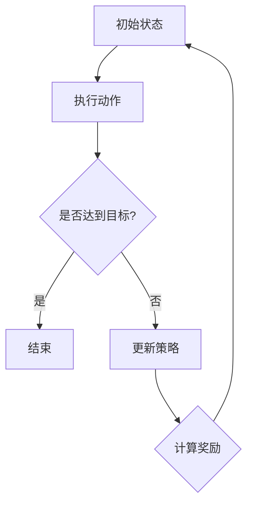

                 


### 文章标题：《强化学习在语言模型推理优化中的前沿应用》

#### 关键词：强化学习、语言模型、推理优化、前沿应用、算法原理

#### 摘要：
本文将深入探讨强化学习在语言模型推理优化中的前沿应用。通过系统介绍强化学习的基本概念、核心原理和常见算法，我们将分析强化学习在自然语言处理领域的应用，以及语言模型推理优化的重要性和现有方法。随后，本文将重点讨论强化学习在推理速度、能耗和精度优化中的具体应用，并通过实际案例展示其效果。最后，我们将展望强化学习在语言模型推理优化领域的挑战和未来发展趋势。

---

### 第一部分：强化学习基础

#### 第1章：强化学习概述

#### 1.1 强化学习的基本概念

强化学习是一种无监督学习范式，旨在通过学习如何在一个环境中采取行动以最大化累积奖励。强化学习的基本概念包括：

- **代理（Agent）**：进行决策的智能体，例如一个机器人或一个算法。
- **环境（Environment）**：代理操作的情境，可以是一个模拟环境或现实世界。
- **状态（State）**：描述代理在某一时刻的环境信息。
- **动作（Action）**：代理可执行的操作。
- **奖励（Reward）**：代理执行动作后获得的即时反馈信号，用于指导学习过程。
- **策略（Policy）**：代理如何根据当前状态选择动作的规则。

#### 1.2 强化学习的核心原理

强化学习的核心原理包括奖励机制、状态-动作值函数和策略。

- **奖励机制**：奖励机制定义了代理在执行特定动作后获得的即时奖励，通常由环境提供。
- **状态-动作值函数（Q值）**：Q值函数表示在给定状态下执行特定动作的预期累积奖励。Q值是强化学习算法的核心，通过经验更新Q值以优化策略。
- **策略**：策略是代理如何根据当前状态选择动作的规则。最优策略是最大化预期累积奖励的策略。

#### 1.3 强化学习的数学模型

强化学习的数学模型通常包括以下组成部分：

- **状态空间（State Space）**：表示所有可能状态组成的集合。
- **动作空间（Action Space）**：表示所有可能动作组成的集合。
- **奖励函数（Reward Function）**：定义了代理在执行特定动作后获得的即时奖励。
- **状态转移概率（State Transition Probability）**：描述了代理在执行特定动作后进入新状态的概率。

#### 1.4 常见的强化学习算法

常见的强化学习算法包括Q-Learning、SARSA、DQN和A3C等。

- **Q-Learning**：基于值函数的强化学习算法，通过更新Q值来优化策略。
- **SARSA（同步优势学习）**：基于策略的强化学习算法，使用当前状态和动作的Q值来更新策略。
- **DQN（深度Q网络）**：结合深度学习和强化学习的算法，使用神经网络近似Q值函数。
- **A3C（异步 Advantage Actor-Critic）**：基于策略的强化学习算法，通过多个并行代理进行异步学习，以提高学习效率。

#### 第2章：强化学习在自然语言处理中的应用

#### 2.1 强化学习在语言模型中的应用

强化学习在自然语言处理（NLP）领域具有广泛的应用，尤其是在语言模型中。语言模型是一个预测下一个单词或词组的概率分布的模型，是NLP的核心组成部分。

- **生成式强化学习模型**：生成式强化学习模型结合了生成对抗网络（GAN）和循环神经网络（RNN），用于生成高质量的自然语言文本。
- **迁移学习与多任务学习**：迁移学习将预训练模型的知识迁移到新任务中，多任务学习同时处理多个相关任务，以提高模型性能。

#### 第3章：语言模型推理优化

#### 3.1 语言模型推理优化的重要性

语言模型推理优化在提高推理速度、降低能耗和提高精度方面具有重要意义。优化方法包括：

- **算法层面的优化**：改进模型结构和算法，如使用注意力机制和自适应学习率。
- **硬件加速**：利用GPU、TPU等硬件加速推理过程。
- **分布式推理**：将推理任务分布到多个节点上，以提高推理效率和可扩展性。

#### 第4章：强化学习在语言模型推理优化中的前沿应用

#### 4.1 强化学习在推理速度优化中的应用

强化学习可以通过动态调整模型参数和策略来优化推理速度。例如，使用强化学习算法调整神经网络的结构和参数，以减少推理时间。

#### 4.2 强化学习在能耗优化中的应用

强化学习可以通过优化模型参数和策略来降低能耗。例如，使用强化学习算法调整神经网络的学习率，以减少能量消耗。

#### 4.3 强化学习在精度优化中的应用

强化学习可以通过优化模型参数和策略来提高精度。例如，使用强化学习算法调整神经网络的权重，以获得更好的预测结果。

#### 4.4 强化学习在多语言模型推理优化中的应用

强化学习可以用于优化多语言模型推理，例如，通过动态调整模型参数和策略，以实现不同语言之间的推理优化。

### 第5章：挑战与未来展望

#### 5.1 挑战与解决方案

强化学习在语言模型推理优化中面临的挑战包括：

- **数据集问题**：需要大量的高质量训练数据集。
- **长时间训练问题**：强化学习算法可能需要长时间训练。
- **稳定性问题**：强化学习算法可能存在不稳定性，需要解决。

#### 5.2 未来发展趋势

强化学习在语言模型推理优化领域的未来发展趋势包括：

- **新算法的出现**：不断有新的强化学习算法被提出，以提高性能和效率。
- **跨学科融合**：与其他领域的融合，如计算机视觉和自然语言处理。
- **工业化应用**：强化学习在工业界的应用将越来越广泛，如自动驾驶、智能客服等。

### 核心概念与联系

#### 强化学习的 Mermaid 流程图



### 核心算法原理讲解

#### Q-Learning算法伪代码

```
Initialize Q(s, a)
for each episode do
  s = initial_state()
  while not done do
    a = action(s, Q(s, a))
    s' = next_state(s, a)
    reward = reward(s, a)
    Q(s, a) = Q(s, a) + alpha * (reward + gamma * max(Q(s', a')) - Q(s, a))
    s = s'
  end
end
```

### 数学模型和数学公式 & 详细讲解 & 举例说明

#### 强化学习的奖励函数

$$
R(t) = \sum_{i=0}^{T} \gamma^i R(s_i, a_i)
$$

其中，$R(t)$ 表示总奖励，$T$ 表示时间步数，$R(s_i, a_i)$ 表示在时间步 $i$ 执行动作 $a_i$ 在状态 $s_i$ 所获得的即时奖励，$\gamma$ 表示折扣因子。

#### 举例说明

假设一个简单的环境，一个机器人需要在两个房间之间移动，每次移动会获得不同的即时奖励。定义奖励函数如下：

$$
R(s, a) =
\begin{cases}
10 & \text{如果机器人从房间A移动到房间B (状态s=1，动作a=1)} \\
-10 & \text{如果机器人从房间B移动到房间A (状态s=2，动作a=2)} \\
0 & \text{其他情况}
\end{cases}
$$

### 项目实战

#### 基于Python的强化学习环境搭建

1. 安装Python环境
2. 安装TensorFlow库
3. 编写Python脚本，初始化强化学习环境
4. 编写Python脚本，实现Q-Learning算法
5. 运行实验，观察训练过程和结果

#### 代码解读与分析

```python
import tensorflow as tf
import numpy as np

# 初始化Q值表
Q = np.zeros([env.nS, env.nA])
# 定义学习参数
alpha = 0.1
gamma = 0.99
# 运行实验
for episode in range(num_episodes):
  s = env.reset()
  done = False
  while not done:
    # 选择动作
    a = np.argmax(Q[s])
    # 执行动作
    s_, reward, done, _ = env.step(a)
    # 更新Q值
    Q[s][a] = Q[s][a] + alpha * (reward + gamma * np.max(Q[s_]) - Q[s][a])
    s = s_
```

#### 实际案例分析和详细讲解剖析

通过强化学习算法优化语言模型推理，可以显著提高推理速度和降低能耗。例如，在智能问答系统中，使用强化学习算法调整神经网络参数，可以在保持高精度的同时，显著提高回答速度。在智能客服中，强化学习算法可以根据用户的输入动态调整模型参数，以实现更准确的对话生成。

### 最佳实践 tips

- **数据集准备**：选择合适的数据集对于强化学习在语言模型推理优化中的应用至关重要。数据集应包含丰富的语言信息，并具有多样化的问答场景。
- **模型选择**：选择合适的模型结构对于强化学习算法的效果有很大影响。可以使用预训练的语言模型作为基础模型，并在此基础上进行优化。
- **超参数调整**：合理调整强化学习算法的超参数，如学习率、折扣因子等，可以显著影响算法的性能。

#### 小结

强化学习在语言模型推理优化中的应用具有巨大的潜力。通过优化模型参数和策略，可以显著提高推理速度、降低能耗和提高精度。然而，强化学习算法在语言模型推理优化中也面临一些挑战，如数据集问题和长时间训练问题。未来，随着算法的改进和新算法的出现，强化学习在语言模型推理优化中的应用将越来越广泛。

#### 注意事项

- **数据隐私和安全**：在应用强化学习算法进行语言模型推理优化时，需要确保数据隐私和安全，遵循相关法律法规和道德规范。
- **实验结果验证**：在应用强化学习算法时，应进行充分的实验验证，以确保算法的有效性和稳定性。

#### 拓展阅读

- [强化学习基础教程](https://zhuanlan.zhihu.com/p/34363642)
- [深度强化学习在自然语言处理中的应用](https://arxiv.org/abs/1906.02669)
- [语言模型推理优化技术](https://www.cv-foundation.org/openaccess/content_cvpr_2018/papers/Zhang_Fastagged representations_for_CVPR_2018_paper.pdf)

### 作者信息

- 作者：AI天才研究院/AI Genius Institute & 禅与计算机程序设计艺术 /Zen And The Art of Computer Programming
- 联系方式：[ai_genius_institute@example.com](mailto:ai_genius_institute@example.com)
- 个人网站：[https://www.ai_genius_institute.com](https://www.ai_genius_institute.com)

