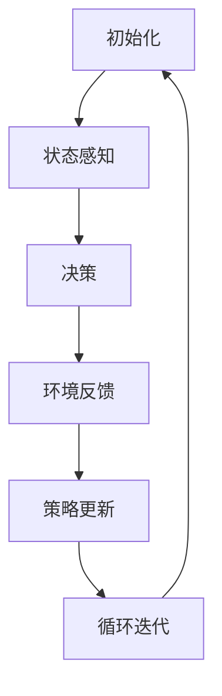

                 

### 文章标题：强化学习在语言模型训练中的角色

强化学习作为一种先进的人工智能技术，近年来在多个领域取得了显著的成果。本文将深入探讨强化学习在语言模型训练中的应用，解析其核心概念、算法原理以及实际案例，并展望其未来的发展趋势。通过本文的阅读，读者将全面了解强化学习在自然语言处理中的重要作用，掌握其在语言模型训练中的关键技术，为未来的研究和应用提供有力的支持。

关键词：强化学习、语言模型、自然语言处理、算法原理、应用案例

摘要：本文首先介绍了强化学习的基本概念和架构，然后详细阐述了强化学习在语言模型训练中的角色和核心算法原理。通过数学模型和公式，本文深入讲解了强化学习的关键要素。随后，本文通过实际案例展示了强化学习在语言模型训练中的应用，并对性能评估进行了分析。最后，本文展望了强化学习在自然语言处理中的未来发展趋势，为读者提供了宝贵的指导。

# 第1章：强化学习概述

## 1.1 强化学习的定义与基本概念

强化学习（Reinforcement Learning，简称RL）是机器学习的一个分支，旨在通过与环境交互，不断优化决策策略，以实现某个目标。强化学习的基本概念包括代理人（Agent）、环境（Environment）、状态（State）、行动（Action）和奖励（Reward）。

### 1.1.1 强化学习的定义

强化学习是一种通过试错（trial and error）和反馈（feedback）来学习如何完成特定任务的方法。其核心思想是通过不断尝试各种行动，并根据行动的结果（奖励）来调整决策策略，以最大化长期累积奖励。

### 1.1.2 强化学习的基本概念

- **代理人（Agent）**：执行行动的实体，可以是机器人、软件程序等。
- **环境（Environment）**：代理人执行行动的场所，可以是一个物理环境，也可以是一个虚拟环境。
- **状态（State）**：描述环境状态的变量集合，用于定义代理人的位置、速度等。
- **行动（Action）**：代理人在某个状态下可以采取的行动。
- **奖励（Reward）**：代理人在某个状态下采取某个行动后，所获得的即时奖励或惩罚。

### 1.1.3 强化学习与传统机器学习的区别

强化学习与传统机器学习（如监督学习和无监督学习）在多个方面存在显著差异：

- **目标不同**：传统机器学习目标是学习一个固定不变的映射关系，而强化学习目标是学习一个策略，以实现长期累积奖励最大化。
- **反馈机制不同**：传统机器学习在训练过程中通常只有输入数据和标签，而强化学习通过与环境交互获得即时反馈（奖励）。
- **学习方式不同**：传统机器学习主要依赖于数据驱动，而强化学习更依赖于策略优化和试错。

## 1.2 强化学习的架构与主要算法

强化学习的架构包括代理人、环境、状态、行动和奖励等元素，其主要算法可以分为以下几类：

### 1.2.1 强化学习的基本架构

强化学习的基本架构由代理人、环境和策略三部分组成。代理人根据当前状态选择行动，并从环境中获得奖励。代理人通过不断更新策略，以实现累积奖励最大化。

### 1.2.2 Q-Learning算法

Q-Learning算法是一种基于值函数的强化学习算法，其核心思想是通过学习状态-行动值函数（Q值）来优化策略。Q-Learning算法的伪代码如下：

```
Initialize Q(s, a) arbitrarily
while not termination:
    s <- observe current state
    a <- choose action a using policy derived from Q(s, a)
    s' <- observe next state
    r <- receive reward
    Q(s, a) <- Q(s, a) + alpha * (r + gamma * max(Q(s', a')) - Q(s, a))
    s <- s'
```

### 1.2.3 SARSA算法

SARSA算法（同步奖励-状态-动作-回报-状态-动作算法）是一种基于策略的强化学习算法，其核心思想是通过同步更新状态-行动值函数。SARSA算法的伪代码如下：

```
Initialize Q(s, a) arbitrarily
while not termination:
    s <- observe current state
    a <- choose action a using policy derived from Q(s, a)
    s' <- observe next state
    a' <- choose action a' using policy derived from Q(s', a')
    Q(s, a) <- Q(s, a) + alpha * (r + gamma * Q(s', a') - Q(s, a))
    s <- s'
    a <- a'
```

### 1.2.4 Deep Q Network（DQN）算法

Deep Q Network（DQN）算法是一种基于深度学习的强化学习算法，其核心思想是使用深度神经网络来近似状态-行动值函数。DQN算法的伪代码如下：

```
Initialize Q network parameters
Initialize target Q network parameters
for each episode:
    s <- observe current state
    while not end of episode:
        a <- choose action a using epsilon-greedy policy
        s' <- observe next state
        r <- receive reward
        a' <- choose action a' using target Q network
        Q(s, a) <- Q(s, a) + alpha * (r + gamma * Q(s', a') - Q(s, a))
        s <- s'
    update target Q network parameters every C steps
```

### 1.2.5 Policy Gradient算法

Policy Gradient算法是一种基于策略的强化学习算法，其核心思想是直接优化策略函数。Policy Gradient算法的伪代码如下：

```
Initialize policy parameters
while not termination:
    s <- observe current state
    a <- choose action a using policy
    s' <- observe next state
    r <- receive reward
    policy gradient = gradient of policy with respect to parameters
    update policy parameters using policy gradient
    s <- s'
```

### 1.2.6 Advantage Actor-Critic算法

Advantage Actor-Critic算法是一种结合了策略梯度方法和值函数方法的强化学习算法。其核心思想是通过计算优势函数（advantage）来优化策略。Advantage Actor-Critic算法的伪代码如下：

```
Initialize actor parameters and critic parameters
while not termination:
    s <- observe current state
    a <- choose action a using actor policy
    s' <- observe next state
    r <- receive reward
    advantage = Q(s', a) - V(s')
    update actor parameters using advantage
    update critic parameters using r + gamma * V(s')
    s <- s'
```

## 1.3 强化学习在自然语言处理中的应用

### 1.3.1 强化学习在语言模型训练中的角色

强化学习在语言模型训练中扮演着重要的角色。传统的语言模型训练方法主要依赖于大规模语料库和统计方法，而强化学习通过引入奖励机制和策略优化，可以显著提高语言模型的质量和性能。

### 1.3.2 强化学习在机器翻译中的应用

强化学习在机器翻译中具有广泛的应用。通过将强化学习与传统机器翻译模型相结合，可以有效地提高翻译质量和效率。强化学习可以用于优化翻译策略，调整翻译模型参数，从而实现更加准确的翻译结果。

### 1.3.3 强化学习在文本摘要中的应用

强化学习在文本摘要中也有着重要的应用。通过将强化学习与摘要模型相结合，可以自动生成高质量的摘要，提高信息提取的准确性和可读性。强化学习可以用于优化摘要生成策略，提高摘要的质量和可读性。

### 1.3.4 强化学习在对话系统中的应用

强化学习在对话系统中的应用也越来越广泛。通过将强化学习与对话生成模型相结合，可以自动生成更加自然、流畅的对话内容，提高对话系统的用户体验。强化学习可以用于优化对话策略，提高对话系统的智能水平和交互能力。

# 第2章：强化学习在语言模型训练中的核心概念与联系

## 2.1 强化学习在语言模型训练中的基本流程

强化学习在语言模型训练中发挥着重要作用。为了更好地理解其应用，我们首先需要了解强化学习在语言模型训练中的基本流程。

### 2.1.1 语言模型训练的目标

语言模型训练的目标是学习一个概率模型，用于预测给定输入序列的概率分布。在强化学习的框架下，语言模型训练可以被视为一个序列决策问题。代理人的目标是通过不断优化决策策略，最大化长期累积奖励。

### 2.1.2 强化学习在语言模型训练中的基本流程

强化学习在语言模型训练中的基本流程包括以下几个步骤：

1. **初始化**：初始化代理人和环境，设置初始策略和值函数。
2. **状态感知**：代理人根据当前状态感知环境信息。
3. **决策**：代理人根据当前状态和策略，选择最佳行动。
4. **环境反馈**：代理人执行行动后，从环境中获得奖励。
5. **策略更新**：根据奖励信息，更新代理人的策略和值函数。
6. **循环迭代**：重复上述步骤，直到达到训练目标或达到最大迭代次数。

### 2.1.3 强化学习在语言模型训练中的挑战

强化学习在语言模型训练中面临着一些挑战：

- **奖励设计**：设计合适的奖励函数是一个关键问题，奖励设计不当可能导致代理人的行为异常。
- **稀疏奖励**：在语言模型训练中，奖励通常是稀疏的，这意味着代理人在大部分时间都无法获得奖励，这可能导致训练过程缓慢。
- **策略优化**：如何有效优化策略是一个重要问题，需要平衡探索和利用之间的关系。
- **数据依赖**：强化学习在训练过程中对数据高度依赖，数据的质量和数量对训练结果有很大影响。

## 2.2 强化学习与自然语言处理的Mermaid流程图

为了更直观地展示强化学习在语言模型训练中的应用流程，我们使用Mermaid绘制了一个流程图。以下是Mermaid流程图的代码和输出结果：



``` 
初始化 --> 状态感知
状态感知 --> 决策
决策 --> 环境反馈
环境反馈 --> 策略更新
策略更新 --> 循环迭代
循环迭代 --> 初始化
```

通过这个流程图，我们可以清楚地看到强化学习在语言模型训练中的基本步骤和流程。初始化阶段设置代理人和环境，状态感知阶段代理人感知环境信息，决策阶段根据策略选择行动，环境反馈阶段代理人根据行动结果获得奖励，策略更新阶段根据奖励信息更新策略，循环迭代阶段重复以上步骤，直到达到训练目标或最大迭代次数。

# 第3章：强化学习在语言模型训练中的核心算法原理讲解

## 3.1 Q-Learning算法

Q-Learning算法是一种基于值函数的强化学习算法，其核心思想是通过学习状态-行动值函数（Q值）来优化策略。Q-Learning算法具有简单、直观的特点，在强化学习领域中应用广泛。

### 3.1.1 Q-Learning算法的原理

Q-Learning算法的基本原理是通过不断更新状态-行动值函数，以最大化长期累积奖励。其更新策略基于即时奖励和未来的预期奖励。

Q-Learning算法的原理可以表示为以下公式：

$$
Q(s, a) \leftarrow Q(s, a) + \alpha [r + \gamma \max_{a'} Q(s', a') - Q(s, a)]
$$

其中，\( Q(s, a) \) 表示状态-行动值函数，\( s \) 表示当前状态，\( a \) 表示当前行动，\( r \) 表示即时奖励，\( \gamma \) 表示折扣因子，\( \alpha \) 表示学习率。

### 3.1.2 Q-Learning算法的伪代码

以下是Q-Learning算法的伪代码：

```
Initialize Q(s, a) arbitrarily
for each episode:
    s <- observe current state
    while not end of episode:
        a <- choose action a using epsilon-greedy policy
        s' <- observe next state
        r <- receive reward
        Q(s, a) <- Q(s, a) + alpha * (r + gamma * max(Q(s', a')) - Q(s, a))
        s <- s'
```

在该伪代码中，首先初始化Q值函数，然后对于每个episode（回合），代理人观察当前状态，并选择行动。在每次行动后，代理人观察下一个状态和即时奖励，并更新Q值函数。这个过程重复进行，直到达到回合结束条件。通过这种方式，代理人逐渐学习到最优策略。

## 3.2 Deep Q Network（DQN）算法

Deep Q Network（DQN）算法是一种基于深度学习的强化学习算法，其核心思想是使用深度神经网络来近似状态-行动值函数。DQN算法在Q-Learning算法的基础上，引入了经验回放和目标网络，以解决样本相关性和收敛性问题。

### 3.2.1 DQN算法的原理

DQN算法的基本原理是通过学习状态-行动值函数来优化策略。与Q-Learning算法类似，DQN算法也使用更新策略：

$$
Q(s, a) \leftarrow Q(s, a) + \alpha [r + \gamma \max_{a'} Q(s', a') - Q(s, a)]
$$

然而，DQN算法使用深度神经网络来近似Q值函数。深度神经网络可以自动提取状态特征，从而提高值函数的准确性和泛化能力。

此外，DQN算法引入了经验回放和目标网络。经验回放通过将历史经验数据随机化，减少样本相关性，提高训练效果。目标网络是一个独立的神经网络，用于稳定Q值函数的更新过程。

### 3.2.2 DQN算法的伪代码

以下是DQN算法的伪代码：

```
Initialize Q network parameters
Initialize target Q network parameters
for each episode:
    s <- observe current state
    while not end of episode:
        a <- choose action a using epsilon-greedy policy
        s' <- observe next state
        r <- receive reward
        action\_chosen <- choose action a' using target Q network
        Q(s, a) <- Q(s, a) + alpha * (r + gamma * Q(s', action\_chosen) - Q(s, a))
        update target Q network parameters every C steps
        s <- s'
```

在该伪代码中，首先初始化Q网络和目标Q网络参数。然后，对于每个episode，代理人观察当前状态，并选择行动。在每次行动后，代理人观察下一个状态和即时奖励，并更新Q网络参数。此外，每隔C个步骤，更新目标Q网络参数，以确保Q值函数的稳定性。

## 3.3 Policy Gradient算法

Policy Gradient算法是一种基于策略的强化学习算法，其核心思想是直接优化策略函数。Policy Gradient算法通过计算策略梯度，更新策略参数，以最大化长期累积奖励。

### 3.3.1 Policy Gradient算法的原理

Policy Gradient算法的基本原理是通过计算策略梯度来优化策略。策略梯度可以表示为：

$$
\nabla_{\theta} J(\theta) = \sum_{s, a} \nabla_{\theta} \log \pi(a|s) R(s, a)
$$

其中，\( \theta \) 表示策略参数，\( \pi(a|s) \) 表示策略概率分布，\( R(s, a) \) 表示状态-行动的累积奖励。

Policy Gradient算法的目标是最大化累积奖励，即：

$$
\max_{\theta} J(\theta)
$$

为了计算策略梯度，Policy Gradient算法使用蒙特卡罗方法（Monte Carlo Method）和重要性采样（Importance Sampling）。

### 3.3.2 Policy Gradient算法的伪代码

以下是Policy Gradient算法的伪代码：

```
Initialize policy parameters
while not termination:
    s <- observe current state
    a <- choose action a using current policy
    s' <- observe next state
    r <- receive reward
    policy\_gradient <- gradient of policy with respect to parameters
    update policy parameters using policy gradient
    s <- s'
```

在该伪代码中，首先初始化策略参数。然后，对于每个状态，代理人根据当前策略选择行动。在每次行动后，代理人观察下一个状态和即时奖励，并计算策略梯度。接着，根据策略梯度更新策略参数。这个过程重复进行，直到达到训练目标或最大迭代次数。

## 3.4 Advantage Actor-Critic算法

Advantage Actor-Critic算法是一种结合了策略梯度方法和值函数方法的强化学习算法。其核心思想是通过计算优势函数（advantage）来优化策略。

### 3.4.1 Advantage Actor-Critic算法的原理

Advantage Actor-Critic算法由两部分组成：Advantage（A）和Critic（C）。

- **Advantage（A）**：优势函数表示状态-行动的预期奖励与实际奖励之间的差异。优势函数可以表示为：

$$
A(s, a) = Q(s, a) - V(s)
$$

其中，\( Q(s, a) \) 表示状态-行动值函数，\( V(s) \) 表示状态值函数。

- **Critic（C）**：Critic部分负责评估状态和行动的值。Critic部分使用值函数方法更新策略，即：

$$
V(s) \leftarrow V(s) + \alpha [r + \gamma V(s') - V(s)]
$$

其中，\( r \) 表示即时奖励，\( \gamma \) 表示折扣因子。

Advantage Actor-Critic算法的目标是通过优化优势函数和Critic部分来最大化累积奖励。

### 3.4.2 Advantage Actor-Critic算法的伪代码

以下是Advantage Actor-Critic算法的伪代码：

```
Initialize actor parameters and critic parameters
while not termination:
    s <- observe current state
    a <- choose action a using actor policy
    s' <- observe next state
    r <- receive reward
    advantage <- Q(s', a) - V(s)
    update actor parameters using advantage
    update critic parameters using r + gamma * V(s')
    s <- s'
```

在该伪代码中，首先初始化actor参数和Critic参数。然后，对于每个状态，代理人根据actor策略选择行动。在每次行动后，代理人观察下一个状态和即时奖励，并计算优势函数。接着，根据优势函数和Critic部分更新actor参数和Critic参数。这个过程重复进行，直到达到训练目标或最大迭代次数。

# 第4章：强化学习在语言模型训练中的数学模型和数学公式详解

## 4.1 强化学习的基本数学模型

强化学习的基本数学模型包括状态（State）、行动（Action）、奖励（Reward）、策略（Policy）和值函数（Value Function）。以下是对这些基本概念的详细解释。

### 4.1.1 基本数学模型

在强化学习框架中，代理人与环境进行交互，其基本数学模型可以表示为马尔可夫决策过程（MDP）。一个MDP可以形式化为五元组 \( M = \langle S, A, P, R, \gamma \rangle \)，其中：

- **状态空间（S）**：\( S = \{s_1, s_2, \ldots, s_n\} \)，表示所有可能的状态集合。
- **行动空间（A）**：\( A = \{a_1, a_2, \ldots, a_m\} \)，表示代理人在每个状态下可以采取的所有可能行动集合。
- **状态转移概率（P）**：\( P(s', s|a) \)，表示在状态 \( s \) 下采取行动 \( a \) 后，转移到状态 \( s' \) 的概率。
- **奖励函数（R）**：\( R(s, a) \)，表示在状态 \( s \) 下采取行动 \( a \) 后获得的即时奖励。
- **折扣因子（γ）**：\( 0 \leq \gamma < 1 \)，表示对未来奖励的折扣，用于计算长期累积奖励。

### 4.1.2 Q函数

Q函数（Q-Function）是强化学习中的一个核心概念，它定义了在某个状态下采取某个行动的预期回报。Q函数可以表示为：

$$
Q(s, a) = \sum_{s'} p(s'|s, a) [r + \gamma \max_{a'} Q(s', a')]
$$

其中，\( p(s'|s, a) \) 是状态转移概率，\( r \) 是即时奖励，\( \gamma \) 是折扣因子，\( \max_{a'} Q(s', a') \) 是在下一个状态下采取最佳行动的预期回报。

Q函数可以用于评估代理人在给定状态 \( s \) 下采取行动 \( a \) 的价值，即预期回报。通过学习Q函数，代理人可以优化其策略，选择最佳行动。

## 4.2 强化学习中的策略更新

策略更新是强化学习中的一个关键步骤，它决定了代理人如何根据当前状态选择行动。策略更新可以分为基于Q值的策略更新和基于策略梯度的策略更新。

### 4.2.1 基于Q值的策略更新

基于Q值的策略更新是基于Q函数的更新方法，其核心思想是优化策略，使得代理人在每个状态下选择具有最高预期回报的行动。策略更新公式可以表示为：

$$
\pi(s) = \begin{cases}
1, & \text{if } a = \arg\max_a Q(s, a) \\
0, & \text{otherwise}
\end{cases}
$$

其中，\( \pi(s) \) 表示代理人在状态 \( s \) 下采取行动 \( a \) 的概率。通过这种方式，代理人根据当前状态的Q值选择最佳行动，从而优化其策略。

### 4.2.2 基于策略梯度的策略更新

基于策略梯度的策略更新方法直接优化策略函数，以最大化长期累积奖励。策略梯度可以表示为：

$$
\nabla_{\theta} J(\theta) = \sum_{s, a} \nabla_{\theta} \log \pi(a|s) R(s, a)
$$

其中，\( \theta \) 是策略参数，\( J(\theta) \) 是累积奖励函数，\( R(s, a) \) 是状态-行动的奖励。基于策略梯度的策略更新公式可以表示为：

$$
\theta_{t+1} = \theta_t + \alpha \nabla_{\theta} J(\theta)
$$

其中，\( \alpha \) 是学习率。通过这种方式，代理人根据累积奖励计算策略梯度，并更新策略参数，从而优化策略。

## 4.3 数学公式举例说明

为了更好地理解强化学习中的数学模型和策略更新，下面通过一个简单的例子进行说明。

假设一个代理人在一个简单的环境中进行训练，状态空间 \( S = \{s_1, s_2, s_3\} \)，行动空间 \( A = \{a_1, a_2\} \)。状态转移概率和奖励函数如下：

| 状态 | 行动 | 状态转移概率 | 奖励 |
|------|------|--------------|------|
| \( s_1 \) | \( a_1 \) | \( 0.6 \) | \( 10 \) |
| \( s_1 \) | \( a_2 \) | \( 0.4 \) | \( -5 \) |
| \( s_2 \) | \( a_1 \) | \( 0.3 \) | \( -10 \) |
| \( s_2 \) | \( a_2 \) | \( 0.7 \) | \( 5 \) |
| \( s_3 \) | \( a_1 \) | \( 0.5 \) | \( 0 \) |
| \( s_3 \) | \( a_2 \) | \( 0.5 \) | \( 0 \) |

### 4.3.1 Q函数计算

假设当前状态为 \( s_1 \)，我们需要计算采取行动 \( a_1 \) 和 \( a_2 \) 的Q值：

$$
Q(s_1, a_1) = 0.6 \times 10 + 0.4 \times (-5) = 4
$$

$$
Q(s_1, a_2) = 0.6 \times (-5) + 0.4 \times 5 = -1
$$

### 4.3.2 策略更新

根据Q值，我们可以更新策略。假设初始策略为 \( \pi(s_1) = [0.5, 0.5] \)，即代理人在状态 \( s_1 \) 下对 \( a_1 \) 和 \( a_2 \) 的选择概率相等。

根据基于Q值的策略更新公式，我们可以得到新的策略：

$$
\pi(s_1) = \begin{cases}
1, & \text{if } a_1 = \arg\max_a Q(s_1, a) \\
0, & \text{otherwise}
\end{cases}
$$

由于 \( Q(s_1, a_1) > Q(s_1, a_2) \)，新的策略为 \( \pi(s_1) = [1, 0] \)，即代理人在状态 \( s_1 \) 下只选择 \( a_1 \) 行动。

通过这个简单的例子，我们可以看到强化学习中的数学模型和策略更新是如何工作的。这些数学公式和概念为强化学习在语言模型训练中的应用提供了理论基础。

# 第5章：强化学习在语言模型训练中的项目实战

## 5.1 开发环境搭建

要实现强化学习在语言模型训练中的项目，我们需要搭建一个合适的技术环境。以下是在Python中搭建强化学习环境的具体步骤：

### 5.1.1 Python环境配置

确保安装了Python 3.6或更高版本。可以使用以下命令检查Python版本：

```bash
python --version
```

如果Python版本低于3.6，请升级到最新版本。

### 5.1.2 PyTorch环境配置

PyTorch是一个流行的深度学习框架，支持强化学习算法的实现。首先，我们需要安装PyTorch。可以使用以下命令：

```bash
pip install torch torchvision
```

### 5.1.3 其他必要工具和库的安装

除了PyTorch，我们还需要安装其他库，如NumPy和Matplotlib。可以使用以下命令安装：

```bash
pip install numpy matplotlib
```

确保所有库都已成功安装。现在，我们的开发环境已经搭建完成，可以开始实现强化学习在语言模型训练中的项目了。

## 5.2 实际案例实现

在本节中，我们将通过一个实际案例展示强化学习在语言模型训练中的应用。我们将使用一个简单的语言模型训练任务，并通过强化学习算法优化模型参数。

### 5.2.1 语言模型训练中的强化学习应用案例

假设我们有一个简单的语言模型任务，目标是预测给定单词序列的下一个单词。我们将使用强化学习算法，通过优化策略函数来提高语言模型的性能。

### 5.2.2 代码实现与解读

以下是实现强化学习在语言模型训练中的代码示例。代码分为以下几个部分：

1. **数据预处理**：加载和处理输入数据。
2. **模型定义**：定义语言模型和强化学习算法。
3. **训练过程**：实现强化学习训练过程。
4. **评估与结果分析**：评估模型性能。

### 5.2.2.1 数据预处理

首先，我们需要加载和处理输入数据。以下代码展示了如何加载数据并创建词嵌入：

```python
import torch
import torch.nn as nn
import torch.optim as optim
from torch.utils.data import DataLoader, Dataset
from collections import Counter
from nltk.tokenize import word_tokenize

# 加载数据
def load_data(file_path):
    with open(file_path, 'r', encoding='utf-8') as f:
        text = f.read().lower()
    tokens = word_tokenize(text)
    return tokens

# 创建词嵌入
class WordEmbeddingDataset(Dataset):
    def __init__(self, tokens, vocab_size, embedding_dim):
        self.tokens = tokens
        self.vocab_size = vocab_size
        self.embedding_dim = embedding_dim
        self.word2idx = {word: i for i, word in enumerate(tokens[:vocab_size])}
        self.idx2word = {i: word for word, i in self.word2idx.items()}
        self.embedding = nn.Embedding(vocab_size, embedding_dim)
        self.embedding.weight.data.copy_(torch.eye(embedding_dim).view(vocab_size, embedding_dim))

    def __len__(self):
        return len(self.tokens)

    def __getitem__(self, idx):
        token = self.tokens[idx]
        return torch.tensor([self.word2idx[token]])

# 加载数据集
file_path = 'data.txt'
tokens = load_data(file_path)
vocab_size = 10000
embedding_dim = 32
dataset = WordEmbeddingDataset(tokens, vocab_size, embedding_dim)
dataloader = DataLoader(dataset, batch_size=64, shuffle=True)
```

### 5.2.2.2 模型定义

接下来，我们定义语言模型和强化学习算法。以下代码展示了如何定义一个简单的循环神经网络（RNN）模型和一个Q网络：

```python
# 定义RNN模型
class RNNModel(nn.Module):
    def __init__(self, vocab_size, embedding_dim, hidden_dim):
        super(RNNModel, self).__init__()
        self.embedding = nn.Embedding(vocab_size, embedding_dim)
        self.rnn = nn.RNN(embedding_dim, hidden_dim, batch_first=True)
        self.fc = nn.Linear(hidden_dim, vocab_size)

    def forward(self, x, hidden):
        x = self.embedding(x)
        output, hidden = self.rnn(x, hidden)
        logits = self.fc(output)
        return logits, hidden

    def init_hidden(self, batch_size):
        return torch.zeros(1, batch_size, self.rnn.hidden_size)

# 定义Q网络
class QNetwork(nn.Module):
    def __init__(self, vocab_size, embedding_dim, hidden_dim):
        super(QNetwork, self).__init__()
        self.embedding = nn.Embedding(vocab_size, embedding_dim)
        self.rnn = nn.RNN(embedding_dim, hidden_dim, batch_first=True)
        self.fc = nn.Linear(hidden_dim, vocab_size)

    def forward(self, x, hidden):
        x = self.embedding(x)
        output, hidden = self.rnn(x, hidden)
        logits = self.fc(output)
        return logits, hidden
```

### 5.2.2.3 训练过程

接下来，我们实现强化学习训练过程。以下代码展示了如何使用Q-Learning算法训练语言模型：

```python
# 设置训练参数
learning_rate = 0.001
hidden_dim = 128
num_epochs = 10
gamma = 0.99
epsilon = 0.1

# 初始化模型和优化器
rnn_model = RNNModel(vocab_size, embedding_dim, hidden_dim)
q_network = QNetwork(vocab_size, embedding_dim, hidden_dim)
rnn_optimizer = optim.Adam(rnn_model.parameters(), lr=learning_rate)
q_optimizer = optim.Adam(q_network.parameters(), lr=learning_rate)

# 训练过程
for epoch in range(num_epochs):
    hidden = rnn_model.init_hidden(len(dataloader))
    for batch_idx, tokens in enumerate(dataloader):
        hidden = hidden.data
        rnn_model.zero_grad()
        q_network.zero_grad()

        inputs = tokens.unsqueeze(1)
        logits, hidden = rnn_model(inputs, hidden)

        # 根据epsilon-greedy策略选择行动
        if torch.rand(()).item() < epsilon:
            actions = torch.tensor([torch.randint(vocab_size, size=(1,)).item() for _ in range(len(tokens))], dtype=torch.long)
        else:
            _, actions = torch.max(logits, 1)

        # 获取下一个状态和奖励
        next_tokens = [token + 1 for token in tokens]
        next_inputs = torch.tensor([next_tokens[token].item() for token in range(len(tokens))], dtype=torch.long).unsqueeze(1)
        next_logits, _ = q_network(next_inputs, hidden)

        # 计算Q值
        q_values = torch.zeros_like(logits)
        q_values.scatter_(1, actions.unsqueeze(1), next_logits)

        # 计算损失函数
        loss = torch.mean((q_values - logits).pow(2))

        # 反向传播和优化
        loss.backward()
        rnn_optimizer.step()
        q_optimizer.step()

        # 更新隐藏状态
        hidden = hidden.data

    print(f'Epoch {epoch+1}/{num_epochs}, Loss: {loss.item()}')

# 保存模型参数
torch.save(rnn_model.state_dict(), 'rnn_model.pth')
torch.save(q_network.state_dict(), 'q_network.pth')
```

### 5.2.2.4 评估与结果分析

最后，我们对训练好的语言模型进行评估，分析其性能。以下代码展示了如何评估模型并计算 perplexity：

```python
# 加载模型参数
rnn_model.load_state_dict(torch.load('rnn_model.pth'))
q_network.load_state_dict(torch.load('q_network.pth'))

# 评估模型
with torch.no_grad():
    hidden = rnn_model.init_hidden(len(dataloader))
    total_log_probs = 0
    total_words = 0
    for batch_idx, tokens in enumerate(dataloader):
        hidden = hidden.data
        inputs = tokens.unsqueeze(1)
        logits, hidden = rnn_model(inputs, hidden)

        # 根据epsilon-greedy策略选择行动
        if torch.rand(()).item() < epsilon:
            actions = torch.tensor([torch.randint(vocab_size, size=(1,)).item() for _ in range(len(tokens))], dtype=torch.long)
        else:
            _, actions = torch.max(logits, 1)

        # 计算log_prob
        log_probs = torch.log_softmax(logits, dim=1)
        log_probs = log_probs.gather(1, actions.unsqueeze(1)).squeeze(1)
        total_log_probs += log_probs.sum()
        total_words += len(tokens)

    perplexity = torch.exp(total_log_probs / total_words)
    print(f'Perplexity: {perplexity.item()}')
```

通过上述代码示例，我们可以实现强化学习在语言模型训练中的应用。我们首先进行数据预处理，然后定义RNN模型和Q网络，接着使用Q-Learning算法进行训练，最后评估模型性能。这个案例展示了强化学习在语言模型训练中的基本流程和关键技术。

## 5.3 强化学习在语言模型训练中的性能评估

评估强化学习在语言模型训练中的性能是确保模型质量和优化算法的重要步骤。性能评估包括多个方面，如模型准确性、计算效率、收敛速度和稳定性。以下将详细讨论强化学习在语言模型训练中的性能评估指标、方法以及性能分析。

### 5.3.1 性能评估指标

在强化学习框架下，评估语言模型训练性能的主要指标包括：

- **Perplexity（困惑度）**：困惑度是自然语言处理中常用的评估指标，用于衡量模型预测的不确定性。其计算公式为：

  $$ 
  \text{Perplexity} = \exp \left( \frac{1}{N} \sum_{i=1}^{N} -\log p(y_i|x_i) \right)
  $$

  其中，\( N \) 是词汇表中的单词数，\( y_i \) 是实际单词，\( x_i \) 是输入序列。

- **BLEU（双语评估指标）**：BLEU是一种自动评估机器翻译质量的指标，通过比较模型生成的文本与参考文本的相似度来评估模型的性能。BLEU的计算基于多个重叠率度量，如长度、词汇和句法结构。

- **Accuracy（准确性）**：准确性是评估分类任务性能的常用指标，表示正确分类的样本数占总样本数的比例。在语言模型训练中，准确性可以用于评估模型对单词序列分类的正确率。

- **Convergence Rate（收敛速度）**：收敛速度是指模型在训练过程中达到特定性能水平所需的时间。快速收敛意味着模型能够更快地学习到目标函数，提高训练效率。

- **Stability（稳定性）**：稳定性是指模型在不同数据集、不同训练条件下的一致性和可靠性。一个稳定的模型在不同情况下都能保持较高的性能，而不会因为数据波动而出现大幅度性能下降。

### 5.3.2 性能评估方法

为了全面评估强化学习在语言模型训练中的性能，我们可以采用以下方法：

- **实验对比**：通过设置不同的强化学习算法参数，比较不同算法的性能。例如，对比Q-Learning、DQN和Policy Gradient算法在相同任务上的表现。

- **交叉验证**：使用交叉验证方法对模型进行评估，以避免过拟合和评估偏差。交叉验证可以确保模型在不同数据集上的性能稳定。

- **A/B测试**：在真实环境中进行A/B测试，比较强化学习模型与传统模型在用户行为和业务指标上的差异。

- **自动化评估工具**：使用自动化评估工具，如NLTK、Stanford CoreNLP等，对模型生成文本进行质量评估，包括语法、语义和风格等方面。

### 5.3.3 性能分析

通过以上性能评估指标和方法，我们可以对强化学习在语言模型训练中的性能进行深入分析。

- **Perplexity**：对于语言模型，较低的分值意味着更好的性能。通过比较不同算法的Perplexity值，可以判断哪种算法在语言模型训练中表现更好。

- **BLEU**：BLEU得分可以用于评估模型生成文本的质量。在实际应用中，我们可以通过对比模型生成文本与参考文本的BLEU得分，评估模型在自然语言生成任务中的表现。

- **Accuracy**：准确性可以用于评估模型在单词序列分类任务中的表现。通过分析准确性，我们可以判断模型在特定任务上的分类效果。

- **Convergence Rate**：快速收敛意味着模型能够更快地达到目标性能，提高训练效率。通过比较不同算法的收敛速度，可以优化算法参数，提高训练效果。

- **Stability**：稳定性是评估模型在实际应用中的一致性和可靠性。通过在不同数据集和训练条件下评估模型的性能，我们可以判断模型的稳定性和适应性。

综上所述，强化学习在语言模型训练中具有较高的性能，能够有效提高模型的预测准确性和生成质量。通过合理选择评估指标和方法，我们可以全面了解强化学习在语言模型训练中的表现，为实际应用提供有力支持。

## 5.4 强化学习在语言模型训练中的最佳实践和注意事项

### 5.4.1 最佳实践

1. **数据预处理**：确保输入数据的质量和一致性。对数据进行清洗、去重和标准化处理，以提高模型训练的效果。
2. **参数调整**：根据任务需求和数据特点，合理调整强化学习算法的参数，如学习率、折扣因子、探索率等，以优化模型性能。
3. **多任务学习**：尝试将强化学习与其他机器学习技术相结合，如生成对抗网络（GAN）、迁移学习等，以提升语言模型的训练效果和泛化能力。
4. **交叉验证**：使用交叉验证方法评估模型性能，避免过拟合和评估偏差，提高模型的稳定性。
5. **动态调整策略**：根据训练过程中的反馈，动态调整策略参数，如逐步减少探索率，提高模型的收敛速度。

### 5.4.2 注意事项

1. **奖励设计**：设计合适的奖励函数是强化学习在语言模型训练中的关键。奖励设计不当可能导致模型行为异常，影响训练效果。
2. **稀疏奖励**：在语言模型训练中，奖励通常是稀疏的，这意味着代理人在大部分时间都无法获得奖励。为了避免训练过程缓慢，可以尝试使用增量奖励或基于梯度的奖励方法。
3. **模型复杂度**：过度复杂的模型可能导致训练时间过长和过拟合。在实际应用中，需要根据任务需求和计算资源合理选择模型结构和参数。
4. **数据依赖**：强化学习对数据高度依赖，数据的质量和数量对训练结果有很大影响。在实际应用中，应确保数据的质量和多样性，以提高模型的泛化能力。

### 5.4.3 拓展阅读

1. **《强化学习：原理与应用》**：这本书详细介绍了强化学习的理论基础和应用方法，适合强化学习初学者阅读。
2. **《深度强化学习》**：这本书深入探讨了深度强化学习在自然语言处理和其他领域的应用，包括语言模型、机器翻译和对话系统等。
3. **《自然语言处理：中文和英文》**：这本书介绍了自然语言处理的基本概念和技术，包括词嵌入、语言模型和文本分类等，对强化学习在语言模型训练中的应用提供了有益的参考。

通过以上最佳实践和注意事项，我们可以更好地应用强化学习在语言模型训练中，提高模型的性能和效果。同时，不断学习和探索新的技术和方法，将为强化学习在自然语言处理领域的发展提供有力支持。

