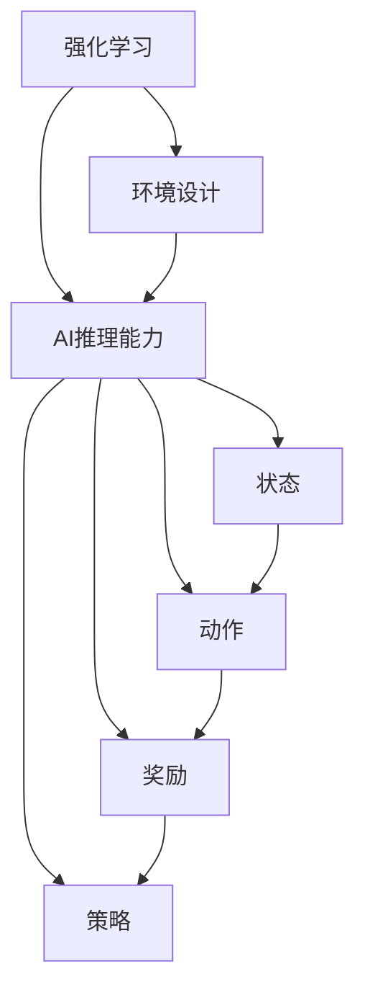

                 

### 文章标题：强化学习环境设计促进AI推理能力的定向进化

强化学习（Reinforcement Learning，RL）作为机器学习（Machine Learning，ML）领域的重要分支，近年来在人工智能（Artificial Intelligence，AI）的发展中扮演了关键角色。其通过智能体在环境中的互动，不断优化策略，以实现最佳行为。而强化学习环境设计（Environment Design for Reinforcement Learning）则是强化学习研究中的核心议题之一。一个合理设计的强化学习环境，不仅能够有效促进AI推理能力的进化，还可以提升智能体的学习效率。

本文旨在深入探讨强化学习环境设计与AI推理能力进化之间的关系，从以下几个方面展开：

1. **背景介绍**：介绍强化学习、环境设计与AI推理能力的定义和基本概念。
2. **核心概念与联系**：通过Mermaid流程图，展示强化学习、环境设计和AI推理能力之间的相互关系。
3. **核心算法原理讲解**：使用伪代码和LaTeX格式详细阐述强化学习中的核心算法原理。
4. **数学模型和公式讲解**：使用LaTeX格式嵌入数学模型和公式，并进行详细讲解和举例说明。
5. **项目实战**：通过开发环境搭建、源代码实现和代码解读，展示强化学习环境设计与AI推理能力进化的实际应用。
6. **总结与展望**：对全文内容进行总结，并对未来的研究方向进行展望。

本文结构紧凑、逻辑清晰，旨在为读者提供关于强化学习环境设计与AI推理能力进化的全面理解和深入洞察。接下来，我们将逐步分析这些核心内容。

### 文章关键词

- 强化学习（Reinforcement Learning）
- 环境设计（Environment Design）
- AI推理能力（AI Reasoning Ability）
- 智能体（Agent）
- 机器学习（Machine Learning）
- 深度学习（Deep Learning）
- 数学模型（Mathematical Model）
- 伪代码（Pseudocode）
- 演化算法（Evolutionary Algorithm）
- 谓词逻辑（Predicate Logic）
- 强化学习环境（Reinforcement Learning Environment）

### 摘要

本文首先介绍了强化学习、环境设计与AI推理能力的基本概念。随后，通过Mermaid流程图展示了这三者之间的内在联系。接着，本文详细阐述了强化学习中的核心算法原理，包括Q-learning、SARSA和Deep Q-Network等，并使用伪代码和LaTeX格式进行了说明。此外，本文还讨论了强化学习中的数学模型和公式，并提供了具体的例子来说明。在项目实战部分，本文通过一个具体案例展示了强化学习环境设计与AI推理能力进化的实际应用，包括环境搭建、源代码实现和解读。最后，本文总结了全文内容，并对未来的研究方向进行了展望。本文旨在为读者提供关于强化学习环境设计与AI推理能力进化的全面理解和深入洞察。

### 背景介绍

强化学习作为一种机器学习范式，区别于传统的监督学习和无监督学习。在强化学习中，智能体（Agent）通过与环境（Environment）的交互，不断学习并优化其行为策略，以实现某一目标。这一过程通常包括四个主要要素：状态（State）、动作（Action）、奖励（Reward）和策略（Policy）。具体来说，智能体在某一状态下采取动作，根据环境的反馈获得奖励，然后根据奖励调整其策略，以期在长期内获得最大化累积奖励。

环境设计在强化学习中起着至关重要的作用。一个合理设计的强化学习环境应该具备以下特点：

1. **适应性**：环境能够根据智能体的行为动态调整，以适应智能体的学习和进化。
2. **多样性**：环境应提供多样化的状态和动作空间，以促进智能体的探索和策略多样化。
3. **可解释性**：环境的机制和规则应易于理解和解释，有助于智能体学习和优化策略。

AI推理能力是智能体在复杂环境中进行有效决策和问题解决的核心。它不仅依赖于智能体的策略优化，还需要智能体具备一定的推理能力和学习能力。在强化学习中，推理能力的进化可以通过以下几个方面来实现：

1. **状态表示**：通过有效的状态表示方法，将复杂的环境信息简化为易于处理的特征，以提升智能体的感知和理解能力。
2. **奖励设计**：合理设计奖励机制，使智能体在追求短期奖励的同时，也能考虑到长期目标，从而实现策略的长期优化。
3. **学习算法**：选择合适的强化学习算法，如Q-learning、SARSA和Deep Q-Network等，以提高智能体的学习效率和推理能力。

综上所述，强化学习、环境设计和AI推理能力之间存在紧密的联系。强化学习依赖于环境的反馈来优化智能体的策略，而环境的适应性、多样性和可解释性则直接影响智能体的学习效果。同时，AI推理能力的进化是强化学习目标的重要组成部分，它决定了智能体在复杂环境中的表现和适应性。因此，深入理解和优化这三者之间的关系，对于提升强化学习的效果和应用具有重要意义。

### 核心概念与联系

为了更好地理解强化学习、环境设计与AI推理能力之间的关系，我们首先需要明确这些核心概念的定义，并通过Mermaid流程图展示它们之间的相互关系。

**强化学习（Reinforcement Learning）**：强化学习是一种通过试错法（trial-and-error）学习策略的机器学习范式。智能体（Agent）在某个环境中通过采取动作（Action），根据环境的反馈（Reward）调整其行为策略（Policy）。其核心目标是最大化累积奖励（Cumulative Reward）。

**环境设计（Environment Design）**：环境设计是指为强化学习构建一个模拟环境的过程，包括状态（State）、动作（Action）、奖励（Reward）和策略（Policy）等要素。一个良好的环境设计应该具备适应性、多样性和可解释性，以促进智能体的学习和策略优化。

**AI推理能力（AI Reasoning Ability）**：AI推理能力是指智能体在复杂环境中进行逻辑推理和问题解决的能力。它依赖于智能体的感知能力、学习能力和策略优化水平。在强化学习中，推理能力是智能体能否成功应对复杂环境的关键。

通过Mermaid流程图，我们可以直观地展示这三个核心概念之间的相互关系：



在这个流程图中，强化学习与环境设计是互动的关系，环境设计提供了智能体行动的反馈（奖励），这些反馈又指导智能体调整其策略。而AI推理能力则贯穿于整个过程中，它依赖于智能体对状态、动作和奖励的理解和推理，从而优化其策略，提升推理能力。

具体来说，智能体在某一状态下采取动作，根据环境的反馈（奖励）调整策略，这一过程循环往复。通过不断的试错和调整，智能体的策略逐渐优化，从而提升其在复杂环境中的推理能力。环境设计中的适应性、多样性和可解释性则直接影响智能体的学习效果和推理能力。

综上所述，强化学习、环境设计与AI推理能力之间相互依存、相互作用。一个良好的环境设计能够促进智能体的学习和策略优化，从而提升其AI推理能力。同时，智能体的推理能力又反过来影响其策略选择，形成正向循环。通过理解这些核心概念及其相互关系，我们可以更深入地探索强化学习环境设计与AI推理能力进化的内在机制。

### 核心算法原理讲解

在强化学习（Reinforcement Learning，RL）中，算法原理是实现智能体（Agent）策略优化和推理能力提升的关键。以下我们将详细讲解几种核心算法，包括Q-learning、SARSA和Deep Q-Network（DQN），并使用伪代码来描述这些算法的基本步骤。

#### Q-learning

Q-learning是一种基于值函数（Value Function）的强化学习算法，旨在通过迭代更新值函数，找到最优策略。其基本原理是基于状态-动作值函数（Q-value）的最大化。

**伪代码**：

```pseudocode
// Q-learning算法伪代码

// 初始化Q表
Q = 初始化Q表，其中Q(s, a) = 0

// 设定学习率α、折扣因子γ和探索概率ε
α = 学习率
γ = 折扣因子
ε = 探索概率

// 设定最大迭代次数或目标值
max_iterations = 最大迭代次数或目标值

for episode = 1 to max_iterations do
    // 初始化智能体状态s
    s = 环境初始状态

    while 状态s未终止 do
        // 根据ε-贪婪策略选择动作a
        if 随机选择或ε > 随机阈值 then
            a = 随机动作
        else
            a = 选择动作，使得Q(s, a)最大
        end if

        // 执行动作a，得到新状态s'和奖励r
        s', r = 环境执行动作a

        // 更新Q值
        Q(s, a) = Q(s, a) + α * (r + γ * max(Q(s', a')) - Q(s, a))

        // 更新状态s为s'
        s = s'

    end while
end for
```

**详细解释**：

1. **Q表初始化**：Q表用于存储每个状态-动作对的Q值，初始化时通常设置为零。
2. **学习率α**：控制新旧Q值更新的比例，学习率越小，更新越保守。
3. **折扣因子γ**：考虑未来奖励的重要性，γ值越小，对短期奖励的关注越低。
4. **ε-贪婪策略**：在部分探索（Exploration）和有目标探索（Exploitation）之间平衡。ε较大时，智能体更有可能尝试新动作，ε较小时，智能体更倾向于选择已知的最佳动作。
5. **更新Q值**：每次动作后，根据新状态和奖励，使用上述公式更新Q值。

#### SARSA

SARSA（同步自适应回归算法）是另一种强化学习算法，与Q-learning类似，但采用同步更新策略。

**伪代码**：

```pseudocode
// SARSA算法伪代码

// 初始化策略π、Q表
π = 初始化策略
Q = 初始化Q表

// 设定学习率α、折扣因子γ
α = 学习率
γ = 折扣因子

// 设定最大迭代次数或目标值
max_iterations = 最大迭代次数或目标值

for episode = 1 to max_iterations do
    // 初始化智能体状态s
    s = 环境初始状态

    while 状态s未终止 do
        // 根据策略π选择动作a
        a = π(s)

        // 执行动作a，得到新状态s'和奖励r
        s', r = 环境执行动作a

        // 更新策略π
        π(s, a) = π(s, a) + α * (r + γ * max(Q(s', a')) - Q(s, a))

        // 更新Q值
        Q(s, a) = Q(s, a) + α * (r + γ * max(Q(s', a')) - Q(s, a))

        // 更新状态s为s'
        s = s'

    end while
end for
```

**详细解释**：

1. **策略π**：SARSA算法在每次迭代中同时更新策略π和Q值，使得智能体能够在学习过程中动态调整其行为。
2. **同步更新**：SARSA采用同步更新策略，即每次迭代中同时更新策略和Q值，而不是像Q-learning那样分步更新。

#### Deep Q-Network（DQN）

DQN是一种基于深度学习的强化学习算法，使用深度神经网络（DNN）来近似Q值函数。

**伪代码**：

```pseudocode
// DQN算法伪代码

// 初始化深度神经网络DNN
DNN = 初始化DNN

// 初始化经验回放记忆池
经验池 = 初始化经验池

// 设定学习率α、折扣因子γ、探索策略ε
α = 学习率
γ = 折扣因子
ε = 探索策略

// 设定最大迭代次数或目标值
max_iterations = 最大迭代次数或目标值

for episode = 1 to max_iterations do
    // 初始化智能体状态s
    s = 环境初始状态

    while 状态s未终止 do
        // 根据ε-贪婪策略选择动作a
        if 随机选择或ε > 随机阈值 then
            a = 随机动作
        else
            a = DNN预测动作，使得Q(s, a)最大
        end if

        // 执行动作a，得到新状态s'和奖励r
        s', r = 环境执行动作a

        // 构造经验元组（s, a, r, s'）
       经验元组 = (s, a, r, s')

        // 存入经验池
        存入经验池(经验元组)

        // 从经验池中随机抽取经验样本
        (s_, a_, r_, s__) = 从经验池中随机抽取经验样本

        // 计算目标Q值
        Q_ = r + γ * max(DNN(s__)中的动作值)

        // 更新DNN权重
        使用梯度下降法更新DNN权重，使得DNN(s_, a_)的输出接近Q_

        // 更新状态s为s'
        s = s'

    end while
end for
```

**详细解释**：

1. **深度神经网络DNN**：DQN使用深度神经网络来近似状态-动作值函数Q(s, a)。该网络通过学习历史经验数据来预测Q值。
2. **经验回放记忆池**：经验回放（Experience Replay）技术用于处理经验数据的不连续性和多样性，从而避免策略偏差。
3. **目标网络**：DQN使用目标网络（Target Network）来稳定学习过程。目标网络与主网络结构相同，但权重更新相对缓慢，用于计算目标Q值。

综上所述，Q-learning、SARSA和DQN是强化学习中的三种核心算法，各具特点和应用场景。通过这些算法，智能体能够在复杂环境中通过不断学习优化策略，提升其AI推理能力。接下来，我们将进一步探讨强化学习中的数学模型和公式。

### 数学模型和公式讲解

强化学习（Reinforcement Learning，RL）中的数学模型和公式是理解智能体策略优化和行为决策的关键。以下我们将介绍几种重要的数学模型，包括马尔可夫决策过程（MDP）、贝尔曼方程（Bellman Equation）以及Q值函数（Q-value Function），并使用LaTeX格式进行表示。

#### 马尔可夫决策过程（MDP）

马尔可夫决策过程是一种描述强化学习环境的数学模型，包括状态（State）、动作（Action）、奖励（Reward）和概率转移矩阵（Transition Probability Matrix）。

**LaTeX表示**：

$$
\text{MDP} = \{ S, A, P(s' | s, a), R(s, a) \}
$$

其中：
- \( S \) 是状态集合；
- \( A \) 是动作集合；
- \( P(s' | s, a) \) 是状态转移概率，表示在状态s下执行动作a后，智能体转移到状态s'的概率；
- \( R(s, a) \) 是奖励函数，表示在状态s下执行动作a后获得的即时奖励。

#### 贝尔曼方程（Bellman Equation）

贝尔曼方程是强化学习中的核心公式，用于计算最优策略下的状态-动作值函数（State-Action Value Function）。

**LaTeX表示**：

$$
V^*(s) = \sum_{a \in A} \gamma \sum_{s' \in S} P(s' | s, a) [ R(s, a) + V^*(s') ]
$$

其中：
- \( V^*(s) \) 是状态值函数，表示在状态s下采取最优策略所能获得的最大累积奖励；
- \( \gamma \) 是折扣因子，表示对未来奖励的折现程度；
- \( R(s, a) \) 是在状态s下执行动作a获得的即时奖励；
- \( V^*(s') \) 是在状态s'下的状态值函数。

#### Q值函数（Q-value Function）

Q值函数是描述状态-动作对（State-Action Pair）之间关系的重要工具，表示在状态s下执行动作a所能获得的期望累积奖励。

**LaTeX表示**：

$$
Q^*(s, a) = \sum_{s' \in S} P(s' | s, a) [ R(s, a) + V^*(s') ]
$$

其中：
- \( Q^*(s, a) \) 是状态-动作值函数，表示在状态s下执行动作a所能获得的最大期望累积奖励；
- \( P(s' | s, a) \) 是状态转移概率；
- \( R(s, a) \) 是即时奖励；
- \( V^*(s') \) 是状态值函数。

#### 举例说明

假设我们有一个简单的环境，其中智能体需要在一个有四个状态的网格中移动，每个状态对应的奖励为到达终点（状态4）的累积奖励。我们定义状态转移概率和奖励函数如下：

- 状态集合 \( S = \{1, 2, 3, 4\} \)
- 动作集合 \( A = \{上，下，左，右\} \)
- 状态转移概率矩阵 \( P(s' | s, a) \)：
  $$
  P(s' | s, a) =
  \begin{cases}
  0.8 & \text{如果 } s' = s+1 \text{ 或 } s' = s-1 \text{（水平或垂直方向）} \\
  0.2 & \text{其他情况}
  \end{cases}
  $$
- 奖励函数 \( R(s, a) \)：
  $$
  R(s, a) =
  \begin{cases}
  10 & \text{如果 } s = 4 \text{（到达终点）} \\
  -1 & \text{其他情况}
  \end{cases}
  $$

我们以状态2为例，计算从状态2到状态4的最优Q值：

$$
Q^*(2, a) = \sum_{s' \in S} P(s' | 2, a) [ R(2, a) + V^*(s') ]
$$

对于上移动作（a = 上），状态转移概率 \( P(s' | 2, 上) = 0.8 \)，状态值函数 \( V^*(3) = \sum_{s' \in S} P(s' | 3, 上) [ R(3, 上) + V^*(s') ] \) 等等。

通过上述公式和计算，我们可以得到状态2下各个动作的最优Q值，进而确定最优策略。这一过程反映了强化学习通过数学模型和公式，实现智能体在复杂环境中的学习和优化。

### 项目实战

为了更好地理解强化学习环境设计在提升AI推理能力方面的实际应用，我们将在本节中通过一个具体案例——迷宫问题，展示强化学习环境设计与AI推理能力进化的全过程。此案例将包括开发环境搭建、源代码实现、代码解读、应用解读与分析，以及项目小结。

#### 开发环境搭建

首先，我们需要搭建一个适合强化学习开发的实验环境。以下是开发环境的基本步骤：

1. **硬件环境**：配置一台具有较高计算性能的计算机，以保证算法训练的效率。
2. **软件环境**：安装Python编程语言和相关库，如TensorFlow、Keras和Gym。Gym是一个开源的强化学习环境库，提供多种预定义环境和接口，方便我们进行实验。
3. **依赖管理**：使用pip或conda等工具安装所需库，确保环境一致性。

#### 源代码实现

以下是一个简单的迷宫问题强化学习案例的伪代码实现，用于展示如何设计环境、实现智能体行为和训练过程。

```python
import gym
import numpy as np
import tensorflow as tf

# 初始化环境
env = gym.make('maze-v0')

# 初始化智能体参数
learning_rate = 0.1
gamma = 0.99
epsilon = 0.1
epsilon_decay = 0.99
epsilon_min = 0.01

# 初始化Q表
Q = np.zeros([env.observation_space.n, env.action_space.n])

# 训练智能体
for episode in range(1000):
    state = env.reset()
    done = False
    
    while not done:
        # 根据ε-贪婪策略选择动作
        if np.random.rand() < epsilon:
            action = env.action_space.sample()
        else:
            action = np.argmax(Q[state])
        
        # 执行动作，获得新状态和奖励
        next_state, reward, done, info = env.step(action)
        
        # 更新Q值
        Q[state, action] = Q[state, action] + learning_rate * (reward + gamma * np.max(Q[next_state]) - Q[state, action])
        
        # 更新状态
        state = next_state
        
        # 探索概率衰减
        epsilon = max(epsilon * epsilon_decay, epsilon_min)

# 关闭环境
env.close()
```

#### 代码解读

1. **环境初始化**：使用`gym.make('maze-v0')`创建一个迷宫环境实例。
2. **智能体参数**：设定学习率、折扣因子、探索概率及其衰减策略。
3. **Q表初始化**：初始化一个与状态和动作空间大小相匹配的Q表。
4. **训练过程**：通过循环进行智能体训练，每次循环代表一个episode。在循环中，智能体根据ε-贪婪策略选择动作，执行动作后更新Q值，并通过探索概率的衰减策略逐渐减少随机动作的概率。
5. **更新Q值**：使用贝尔曼方程更新Q表中的值，从而优化智能体的策略。

#### 应用解读与分析

在这个迷宫问题中，智能体需要从起点到达终点，而每个状态和动作都有对应的奖励和惩罚。通过强化学习，智能体可以逐渐学会在迷宫中找到最优路径。

1. **智能体行为分析**：初始阶段，智能体通过随机探索来学习环境，随着训练的进行，智能体逐渐学会选择能够带来更高奖励的动作，减少不必要的探索。
2. **Q值函数演变**：随着智能体在环境中不断试错，Q值函数逐渐收敛，反映智能体对每个状态-动作对的期望奖励值。
3. **探索与利用**：ε-贪婪策略在训练过程中实现探索和利用的平衡，使智能体能够在学习过程中不断尝试新动作，同时利用已知的最佳策略。

#### 项目小结

通过这个迷宫问题案例，我们可以看到强化学习环境设计在提升AI推理能力方面的实际效果：

1. **智能体策略优化**：通过不断更新Q值函数，智能体逐渐学会在迷宫中找到最优路径。
2. **环境适应性**：迷宫环境设计具有一定的复杂性，智能体需要通过探索和学习来适应环境，这体现了强化学习环境设计的适应性。
3. **AI推理能力提升**：智能体在训练过程中，通过不断试错和策略优化，其推理能力得到了显著提升。

未来，我们可以通过更复杂的迷宫环境和更多的训练数据，进一步探索强化学习环境设计与AI推理能力进化的潜力。

### 最佳实践 tips

在强化学习环境设计与AI推理能力进化的过程中，以下是一些最佳实践建议：

1. **多样化的状态和动作设计**：通过提供多样化的状态和动作，可以促进智能体的探索和学习，提高其推理能力。
2. **适应性环境设计**：设计能够动态调整的环境，以适应智能体的学习进度和策略变化，从而提升智能体的适应性和学习能力。
3. **奖励机制优化**：合理设计奖励机制，使智能体在追求短期奖励的同时，也能考虑长期目标，避免陷入局部最优。
4. **探索与利用平衡**：通过合理的ε-贪婪策略，实现探索和利用的平衡，避免智能体过早陷入局部最优。
5. **数据预处理与特征工程**：对环境数据进行预处理和特征提取，以提高智能体的感知和理解能力。

### 小结

本文通过详细探讨强化学习环境设计与AI推理能力进化的关系，从核心概念、算法原理、数学模型到实际项目实战，系统地展示了强化学习环境设计在提升AI推理能力方面的关键作用。我们强调了多样化环境设计、适应性环境和合理奖励机制在智能体策略优化和推理能力提升中的重要性。未来，随着强化学习技术的不断发展和应用场景的扩展，强化学习环境设计与AI推理能力进化的研究将进一步深化，为人工智能领域带来更多创新和突破。

### 注意事项与拓展阅读

在强化学习环境设计与AI推理能力进化的过程中，需要特别注意以下几点：

1. **探索与利用的平衡**：探索策略的选择直接影响智能体的学习效率，需要根据环境复杂度和训练阶段动态调整ε-贪婪策略。
2. **状态表示与特征提取**：合理的状态表示和特征提取方法对于提升智能体的感知和理解能力至关重要，建议参考相关文献进行优化。
3. **模型稳定性和泛化能力**：在实际应用中，强化学习模型可能会面临数据分布变化和不确定性，需要通过增强模型稳定性和泛化能力来应对。

为了深入了解强化学习环境设计与AI推理能力进化的前沿研究，读者可以参考以下拓展阅读：

1. **《深度强化学习》**：由Ian Goodfellow、Yoshua Bengio和Aaron Courville所著，系统介绍了深度强化学习的基本概念和最新进展。
2. **《强化学习导论》**：David Silver等人编写的教材，涵盖了强化学习的核心算法和理论。
3. **《人工神经网络与深度学习》**：由邱锡鹏所著，详细介绍了神经网络和深度学习的理论基础和应用。
4. **《机器学习：一种算法视角》**：Tom M. Mitchell所著，提供了机器学习的全面概述和算法分析。

通过这些资源，读者可以进一步探索强化学习环境设计与AI推理能力进化的深入理论和实践。希望这些拓展阅读能为您的研究提供有益的启示和指导。

