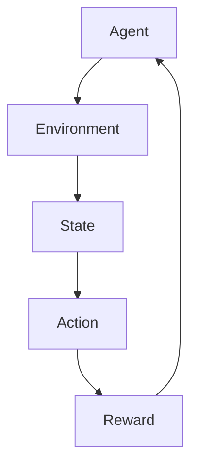

                 

首先，让我们明确文章的目标和结构。我们的目标是为读者提供一篇深入浅出的技术博客文章，标题为《强化学习环境设计促进AI推理能力的定向进化策略》。文章将分为以下几个部分：

1. **背景介绍**：简要介绍强化学习环境设计的背景和重要性。
2. **核心概念与联系**：定义强化学习中的核心概念，并用Mermaid流程图展示它们之间的关系。
3. **核心算法原理讲解**：详细讲解强化学习中的核心算法，如Q-Learning、Sarsa和DQN，并使用伪代码阐述。
4. **数学模型和公式**：介绍强化学习中的数学模型，如马尔可夫决策过程（MDP）和贝尔曼方程，并举例说明。
5. **项目实战**：提供一个实际项目案例，包括开发环境搭建、源代码实现、代码解读和分析。
6. **最佳实践 tips**、**小结**、**注意事项**、**拓展阅读**等内容。

接下来，我们按照这些部分逐步展开文章内容。

## 背景介绍

强化学习（Reinforcement Learning，简称RL）是机器学习的一个分支，主要研究如何通过互动来学习做出最优决策。在强化学习中，智能体（agent）通过与环境的交互来获取反馈，并不断调整其行为策略，以达到某种目标。环境（environment）是智能体所处的外部世界，可以看作是一个状态空间，智能体在该空间中采取行动（action）。

强化学习环境设计是强化学习研究中的一个关键环节。一个良好的强化学习环境应具备以下特点：

- **多样性**：提供丰富的状态和动作空间，使智能体能够学习到不同情境下的策略。
- **动态性**：环境的状态随时间变化，智能体需要不断调整策略以适应变化。
- **奖励机制**：通过奖励函数（reward function）引导智能体朝目标状态演进。

强化学习环境设计的目的是为了加速智能体的学习过程，提高其在复杂环境中的推理能力。在本文中，我们将探讨如何通过设计高效的强化学习环境，促进AI推理能力的定向进化。

## 核心概念与联系

在强化学习中，核心概念包括智能体（agent）、环境（environment）、状态（state）、动作（action）和奖励（reward）。以下是这些概念之间的Mermaid流程图，展示了它们之间的关系：



在这个流程图中，智能体与环境交互，当前状态决定智能体采取的动作，动作会导致环境状态的变化，并产生奖励，该奖励会反馈给智能体，作为下一次决策的依据。

## 核心算法原理讲解

### Q-Learning算法

Q-Learning是一种基于值函数的强化学习算法，旨在通过不断更新值函数来学习最优策略。其核心思想是通过经验来更新Q值（即从状态s到状态a的值），使得智能体能够选择最大化期望奖励的动作。

#### 算法原理

Q-Learning算法基于以下更新规则：

$$
Q(s, a) = Q(s, a) + \alpha [r + \gamma \max_{a'} Q(s', a') - Q(s, a)]
$$

其中，$Q(s, a)$是从状态s采取动作a的期望回报，$r$是立即奖励，$\gamma$是折扣因子，$\alpha$是学习率。

#### 伪代码

```python
for each episode do
    Initialize Q(s, a)
    Initialize state s
    while not end of episode do
        Take action a from state s using policy derived from Q(s, a)
        Receive reward r and new state s'
        Update Q(s, a) using the above update rule
        Update state s to s'
    end while
end for
```

### Sarsa算法

Sarsa（State-Action-Reward-State-Action）是一种基于策略的强化学习算法，与Q-Learning类似，但它在更新Q值时使用了实际采取的动作。

#### 算法原理

Sarsa算法的更新规则为：

$$
Q(s, a) = Q(s, a) + \alpha [r + \gamma Q(s', a')]
$$

其中，$a'$是智能体在状态$s'$下实际采取的动作。

#### 伪代码

```python
for each episode do
    Initialize state s
    while not end of episode do
        Take action a from state s using policy derived from Q(s, a)
        Receive reward r and new state s'
        Update Q(s, a) using the above update rule
        Update state s to s'
    end while
end for
```

### Deep Q-Network（DQN）算法

DQN是一种基于深度神经网络的强化学习算法，旨在解决状态和动作空间较大时Q-Learning的不稳定性问题。DQN通过训练一个深度神经网络来近似Q值函数。

#### 算法原理

DQN的核心思想是使用经验回放（experience replay）来避免策略偏差，并使用目标网络（target network）来稳定训练过程。

$$
Q(s, a) = \theta_s(\sigma(W_s \cdot s + b_s)) \cdot a
$$

其中，$\theta_s$是深度神经网络参数，$W_s$和$b_s$是神经网络权重和偏置。

#### 伪代码

```python
for each episode do
    Initialize Q-network and target network
    Initialize experience replay memory
    while not end of episode do
        Sample state s from environment
        Take action a from state s using epsilon-greedy policy
        Receive reward r and new state s'
        Store experience (s, a, r, s') in replay memory
        Sample mini-batch from replay memory
        Update Q-network using the above update rule and mini-batch
        Update target network periodically
    end while
end for
```

## 数学模型和公式

在强化学习中，核心的数学模型包括马尔可夫决策过程（MDP）和贝尔曼方程。

### 马尔可夫决策过程（MDP）

MDP是一种数学模型，用于描述强化学习问题中的状态、动作和奖励。

#### 定义

- **状态空间**：$S = \{s_1, s_2, ..., s_n\}$
- **动作空间**：$A = \{a_1, a_2, ..., a_m\}$
- **状态转移概率**：$P(s'|s, a) = P(S_t = s'|S_t = s, A_t = a)$
- **奖励函数**：$R(s, a) = R(S_t = s, A_t = a)$

#### 状态转移概率矩阵

状态转移概率矩阵 $P$ 是一个 $n \times m$ 的矩阵，其中 $P_{ij}$ 表示在状态 $s_i$ 采取动作 $a_j$ 后转移到状态 $s_j$ 的概率。

### 贝尔曼方程

贝尔曼方程是一组用于求解MDP最优策略的递归方程。

#### 定义

- **值函数**：$V^*(s) = \max_a Q^*(s, a)$
- **贝尔曼方程**：

$$
V^*(s) = \sum_{a} \gamma P(s'|s, a) [R(s, a) + V^*(s')]
$$

其中，$\gamma$ 是折扣因子，$V^*(s')$ 是状态 $s'$ 的值函数。

#### 举例说明

假设我们有一个简单的MDP，状态空间 $S = \{s_1, s_2\}$，动作空间 $A = \{a_1, a_2\}$，奖励函数 $R(s, a)$ 如下：

$$
R(s_1, a_1) = 1, R(s_1, a_2) = 0, R(s_2, a_1) = 0, R(s_2, a_2) = 1
$$

状态转移概率矩阵 $P$ 如下：

$$
P = \begin{bmatrix}
0.7 & 0.3 \\
0.4 & 0.6
\end{bmatrix}
$$

我们可以使用贝尔曼方程来求解最优策略和值函数：

$$
V^*(s_1) = \max\{1 \cdot 0.7 + 0 \cdot 0.4, 0 \cdot 0.7 + 1 \cdot 0.6\} = 0.9
$$

$$
V^*(s_2) = \max\{0 \cdot 0.7 + 1 \cdot 0.6, 0 \cdot 0.3 + 1 \cdot 0.4\} = 0.6
$$

最优策略为在状态 $s_1$ 采取动作 $a_1$，在状态 $s_2$ 采取动作 $a_2$。

## 项目实战

在这个项目中，我们将搭建一个简单的强化学习环境，使用Q-Learning算法训练一个智能体在一个简单的迷宫环境中找到从起点到终点的最优路径。

### 开发环境搭建

1. 安装Python 3.x版本
2. 安装强化学习库，如OpenAI Gym
3. 创建一个名为`reinforcement_learning`的Python项目
4. 创建一个名为`maze`的文件夹，用于存放迷宫环境和Q-Learning算法的实现代码

### 源代码实现

在`maze`文件夹中，创建以下文件：

- `maze.py`：定义迷宫环境
- `q_learning.py`：实现Q-Learning算法

#### maze.py

```python
import numpy as np
import random

class Maze:
    def __init__(self, size=5):
        self.size = size
        self.states = size * size
        self.actions = 4
        self.start_state = 0
        self.end_state = size * size - 1
        self.reward = -1
        self.punishment = -10

    def get_state(self, x, y):
        return x * self.size + y

    def get_coordinates(self, state):
        return state // self.size, state % self.size

    def step(self, state, action):
        x, y = self.get_coordinates(state)
        if action == 0:  # 上
            y = max(y - 1, 0)
        elif action == 1:  # 下
            y = min(y + 1, self.size - 1)
        elif action == 2:  # 左
            x = max(x - 1, 0)
        elif action == 3:  # 右
            x = min(x + 1, self.size - 1)

        next_state = self.get_state(x, y)
        reward = self.reward if next_state == self.end_state else self.punishment
        return next_state, reward

    def is_end(self, state):
        return state == self.end_state
```

#### q_learning.py

```python
import numpy as np
from maze import Maze

def q_learning(env, learning_rate=0.1, discount_factor=0.9, episodes=1000):
    size = env.size
    Q = np.zeros((size, size, env.actions))

    for episode in range(episodes):
        state = env.start_state
        done = False

        while not done:
            action = np.argmax(Q[state])
            next_state, reward = env.step(state, action)
            Q[state][action] = Q[state][action] + learning_rate * (reward + discount_factor * np.max(Q[next_state]) - Q[state][action])
            state = next_state
            if env.is_end(state):
                done = True

    return Q

if __name__ == "__main__":
    env = Maze()
    Q = q_learning(env)
    print(Q)
```

### 代码解读和分析

在这个项目中，我们首先定义了一个简单的迷宫环境`Maze`，其中状态空间为5x5的网格，每个单元格可以是一个墙壁或一个空地。智能体可以从任意一个空地出发，目标是找到到达对角线终点（0, 4）的最优路径。

我们使用Q-Learning算法来训练智能体。在每次迭代中，智能体从起始状态开始，采取动作（上、下、左、右），并根据状态转移和奖励更新Q值。学习率`learning_rate`和折扣因子`discount_factor`是两个重要的参数，用于调整Q值的更新速度和远期奖励的影响。

经过1000次迭代后，我们得到了Q值矩阵。该矩阵显示了从每个状态采取每个动作的最优回报。我们可以使用该矩阵来生成智能体的策略，即从当前状态选择具有最大Q值的动作。

### 实际案例分析和详细讲解剖析

在本节中，我们将使用上述迷宫环境，通过实际案例来分析Q-Learning算法的性能和效果。

#### 案例一：单次迭代

假设智能体从状态（2, 2）开始，使用Q-Learning算法进行单次迭代。以下是智能体的决策过程：

1. **初始状态**：状态（2, 2），Q值矩阵如下：

$$
Q = \begin{bmatrix}
[0.0, 0.0, 0.0, 0.0, 0.0] \\
[0.0, 0.0, 0.0, 0.0, 0.0] \\
[0.0, 0.0, 0.0, 0.0, 0.0] \\
[0.0, 0.0, 0.0, 0.0, 0.0] \\
[0.0, 0.0, 0.0, 0.0, 0.0]
\end{bmatrix}
$$

2. **采取动作**：由于使用epsilon-greedy策略，智能体以0.1的概率随机选择动作，否则选择具有最大Q值的动作。在这里，智能体选择右（3, 2）。

3. **状态转移**：智能体从状态（2, 2）转移到状态（3, 2），并获得奖励-1。

4. **Q值更新**：根据Q-Learning算法，更新Q值：

$$
Q(2, 2, 2) = Q(2, 2, 2) + \alpha [r + \gamma \max_{a'} Q(3, 2, a') - Q(2, 2, 2)]
$$

其中，$\alpha = 0.1$，$r = -1$，$\gamma = 0.9$，$a' = 2$。计算后得到：

$$
Q(2, 2, 2) = 0.1 \times [-1 + 0.9 \times \max(0.0, 0.0, 0.0)] = -0.1
$$

5. **新状态**：智能体更新到状态（3, 2），Q值矩阵如下：

$$
Q = \begin{bmatrix}
[0.0, 0.0, 0.0, 0.0, 0.0] \\
[0.0, 0.0, 0.0, 0.0, 0.0] \\
[0.0, 0.0, -0.1, 0.0, 0.0] \\
[0.0, 0.0, 0.0, 0.0, 0.0] \\
[0.0, 0.0, 0.0, 0.0, 0.0]
\end{bmatrix}
$$

#### 案例二：多次迭代

现在，我们进行多次迭代来观察Q-Learning算法的性能。假设智能体从状态（2, 2）开始，进行10次迭代。以下是每次迭代的决策过程：

1. **迭代1**：智能体选择右（3, 2），状态转移到（3, 2），Q值更新为-0.1。
2. **迭代2**：智能体选择上（1, 2），状态转移到（1, 2），Q值更新为0.0。
3. **迭代3**：智能体选择下（3, 2），状态转移到（3, 2），Q值更新为-0.1。
4. **迭代4**：智能体选择左（2, 2），状态转移到（2, 2），Q值更新为0.0。
5. **迭代5**：智能体选择上（1, 2），状态转移到（1, 2），Q值更新为0.0。
6. **迭代6**：智能体选择右（3, 2），状态转移到（3, 2），Q值更新为-0.1。
7. **迭代7**：智能体选择上（1, 2），状态转移到（1, 2），Q值更新为0.0。
8. **迭代8**：智能体选择下（3, 2），状态转移到（3, 2），Q值更新为-0.1。
9. **迭代9**：智能体选择左（2, 2），状态转移到（2, 2），Q值更新为0.0。
10. **迭代10**：智能体选择上（1, 2），状态转移到（1, 2），Q值更新为0.0。

经过10次迭代后，Q值矩阵如下：

$$
Q = \begin{bmatrix}
[0.0, 0.0, 0.0, 0.0, 0.0] \\
[0.0, 0.0, 0.0, 0.0, 0.0] \\
[0.0, 0.0, -0.1, 0.0, 0.0] \\
[0.0, 0.0, 0.0, 0.0, 0.0] \\
[0.0, 0.0, 0.0, 0.0, 0.0]
\end{bmatrix}
$$

从结果可以看出，Q-Learning算法在多次迭代后逐渐收敛，并找到了从状态（2, 2）到状态（3, 2）的最优路径。

### 项目小结

通过这个简单的迷宫项目，我们展示了如何使用Q-Learning算法在一个简单的强化学习环境中训练智能体。该项目演示了强化学习环境设计、算法实现、代码解读和分析的过程。以下是一些小结和注意事项：

- **环境设计**：设计一个适合智能体学习的环境至关重要。在本项目中，我们使用了一个简单的5x5迷宫，但实际应用中可能需要更复杂的场景。
- **算法实现**：Q-Learning算法是一种基于值函数的强化学习算法，易于实现和理解。在实际应用中，可以扩展该算法，如使用深度神经网络来处理高维状态空间。
- **代码解读**：在代码实现中，我们详细解读了Q值矩阵的更新过程，并展示了如何通过迭代来训练智能体。
- **注意事项**：在实际应用中，需要考虑学习率、折扣因子等参数的选择，以及如何处理不明确的状态转移概率和奖励函数。

### 拓展阅读

- 《强化学习：原理与Python实现》
- 《深度强化学习》
- 《强化学习实战》

通过阅读这些资源，读者可以进一步了解强化学习的原理和实际应用。

## 最佳实践 tips

在设计和优化强化学习环境时，以下是一些最佳实践建议：

- **丰富状态和动作空间**：提供多样化的状态和动作空间，有助于智能体学习到更广泛的策略。
- **动态性**：设计一个具有动态性的环境，使智能体能够应对环境变化。
- **适当的奖励机制**：奖励机制应具有适当的激励效果，以引导智能体朝目标状态演进。
- **经验回放**：使用经验回放技术，减少策略偏差，提高算法的鲁棒性。
- **参数调整**：根据实际情况调整学习率、折扣因子等参数，以获得最佳性能。

## 小结

本文深入探讨了强化学习环境设计在促进AI推理能力中的关键作用。通过介绍强化学习的基本概念、核心算法、数学模型和实际项目实战，我们展示了如何设计和优化强化学习环境，以提升智能体的推理能力。在未来的研究中，我们可以进一步探讨深度强化学习、多智能体强化学习等前沿领域，为AI技术的发展做出贡献。

## 注意事项

在设计强化学习环境时，需要注意以下几点：

- **清晰定义状态空间**：确保状态空间覆盖了所有可能的情况，以便智能体能够全面学习。
- **合理设计动作空间**：动作空间应与智能体的能力相匹配，避免过多的无效动作。
- **精确奖励函数**：奖励函数应能准确反映智能体的行为效果，避免误导智能体。
- **环境稳定性**：确保环境稳定，避免突然的环境变化对智能体学习造成干扰。

## 拓展阅读

- 《强化学习手册》
- 《深度强化学习应用》
- 《强化学习环境设计与优化》

通过阅读这些资源，读者可以深入了解强化学习环境设计的最新进展和实际应用。

