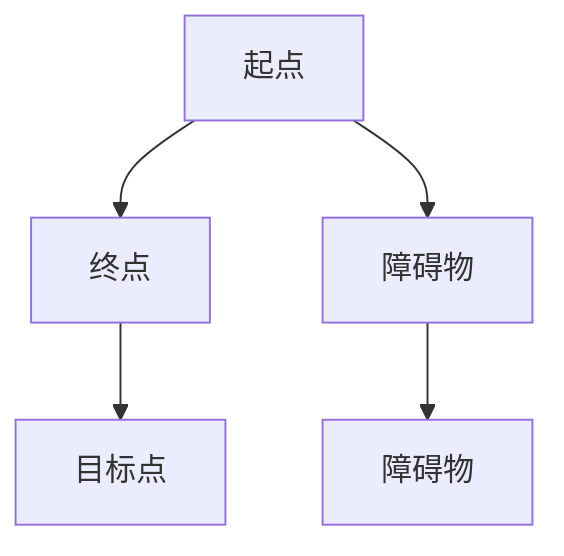
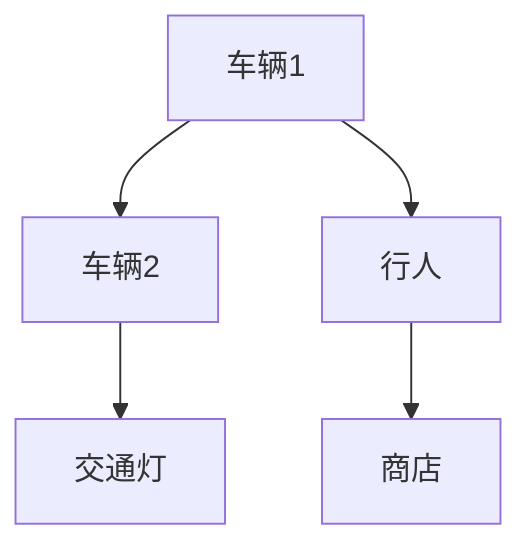

                 

# 强化学习环境设计促进AI推理能力的演化

## 概述

关键词：强化学习、环境设计、AI推理能力、演化、算法原理、深度学习

本文将深入探讨强化学习环境设计在提升AI推理能力方面的作用。强化学习作为一种重要的机器学习方法，通过不断与环境交互来学习最优策略。而环境设计在强化学习中起到了至关重要的作用，它不仅影响了学习效率，也直接决定了AI的推理能力。本文将首先介绍强化学习的基础概念，包括其定义、核心算法原理，然后重点讨论环境设计的原则和技术，以及如何通过优化环境设计来提升AI的推理能力。此外，还将分析强化学习在不同领域的应用案例，展望未来的发展趋势。

摘要：本文旨在系统阐述强化学习环境设计对AI推理能力提升的重要影响。通过分析强化学习的基础理论和核心算法，本文揭示了环境设计的核心要素及其在AI推理能力提升中的关键作用。通过实际案例分析和算法原理的详细讲解，本文为强化学习环境设计提供了实用的指导，并探讨了其在不同领域的应用前景。

## 强化学习基础

### 强化学习的定义与核心概念

强化学习（Reinforcement Learning，简称RL）是一种通过试错法来学习优化策略的机器学习方法。它主要依赖于与环境的交互，通过不断尝试不同的行动并接收环境反馈（奖励或惩罚），来逐步优化决策过程。强化学习具有以下几个核心概念：

- **状态（State）**：指系统当前所处的情境或环境。
- **动作（Action）**：指系统可以采取的行动或决策。
- **奖励（Reward）**：指环境对系统行动的反馈，通常用来衡量行动的好坏。
- **策略（Policy）**：指系统在给定状态下采取最优行动的策略。
- **价值函数（Value Function）**：用于评估状态或状态-动作对的优劣，如状态值函数和动作值函数。
- **模型（Model）**：用于预测状态转移概率和奖励的函数。

强化学习的过程可以描述为：智能体（agent）通过观察环境状态，选择一个动作，执行动作后，观察环境的状态转移和奖励，并根据这些信息更新策略。这一过程循环往复，直到智能体找到最优策略或达到预设的目标。

### 强化学习的发展历史

强化学习起源于20世纪50年代，其基本思想是让智能体通过不断试错来学习如何完成特定任务。早期的研究主要集中在简单的离散环境和确定性模型上，如经典的“逃猫”（Cat and Mouse）游戏。随着计算机硬件和算法的进步，强化学习得到了快速发展，并在20世纪90年代取得了重要突破。

1992年，David Silver和Richard S. Sutton在论文《Reinforcement Learning: A Definition》中给出了强化学习的经典定义，并提出了Q-Learning算法，这是强化学习领域的一个重要里程碑。此后，强化学习逐渐应用于更复杂的连续环境和动态系统中，如机器人控制、自动驾驶、游戏AI等。

进入21世纪，随着深度学习技术的发展，深度强化学习（Deep Reinforcement Learning，简称DRL）成为了研究热点。DRL通过结合深度神经网络和价值函数，使得智能体能够在高维、复杂的任务中表现出色。例如，DeepMind团队在2015年提出的DQN（Deep Q-Network）算法，通过在Atari游戏中的优异表现，证明了深度强化学习在现实应用中的潜力。

### 强化学习的应用场景

强化学习在众多领域都展现了其强大的应用潜力。以下是一些典型的应用场景：

- **游戏AI**：强化学习在游戏领域有着广泛的应用，如围棋、国际象棋、电子竞技等。通过不断训练，智能体可以在游戏中达到或超越人类水平。
- **机器人控制**：强化学习可以用于机器人路径规划、环境交互、动作控制等任务。通过学习环境中的奖励和惩罚，机器人可以自主适应并优化其行动策略。
- **自动驾驶**：自动驾驶车辆需要实时处理复杂的交通环境，强化学习可以用于车辆控制、路径规划、障碍物检测等任务，提高自动驾驶的效率和安全性。
- **金融交易**：强化学习可以用于股票交易、风险管理等金融领域。通过学习市场数据和交易规则，智能体可以自动制定投资策略。
- **自然语言处理**：强化学习在自然语言处理领域也取得了一定进展，如机器翻译、对话系统等。通过不断优化策略，智能体可以生成更自然、准确的语言表达。

### 强化学习算法基础

强化学习算法主要分为基于价值的算法和基于策略的算法。基于价值的算法通过评估状态或状态-动作对的值来学习最优策略，而基于策略的算法则直接优化策略本身。以下是两种类型的代表算法及其原理。

#### Q-Learning算法

Q-Learning算法是一种基于价值的强化学习算法，旨在通过学习状态-动作对的值函数来优化策略。其基本原理如下：

1. **初始化**：初始化Q值表，通常设置为一个小的正数。
2. **选择动作**：在给定状态下，智能体根据当前Q值表选择动作。
3. **执行动作**：执行选定的动作，观察环境的状态转移和奖励。
4. **更新Q值**：根据状态转移和奖励，更新Q值表。

Q-Learning算法的伪代码如下：

```python
# Q-Learning算法伪代码

# 初始化Q值表
Q = 初始化Q值表

# 设定学习率α，折扣因子γ，探索策略ε
α = 0.1
γ = 0.9
ε = 0.1

# 迭代学习
for each episode do
    # 初始化状态s
    s = 初始状态

    # 迭代
    while s not in 终止状态 do
        # 选择动作a
        if 随机选择(ε) then
            a = 随机动作
        else
            a = 选择动作(Q[s])
        
        # 执行动作，获取状态s'和奖励r
        s', r = 执行动作a
        
        # 更新Q值
        Q[s][a] = Q[s][a] + α * (r + γ * max(Q[s'])[a'] - Q[s][a])

        # 更新状态
        s = s'

```

#### SARSA算法

SARSA（State-Action-Reward-State-Action，简称SARSA）算法是一种基于策略的强化学习算法，它同时考虑了当前状态和下一状态的信息，以更新策略。SARSA算法的原理如下：

1. **初始化**：初始化策略π，通常设置为一个均匀分布。
2. **选择动作**：在给定状态下，智能体根据当前策略π选择动作。
3. **执行动作**：执行选定的动作，观察环境的状态转移和奖励。
4. **更新策略**：根据状态转移和奖励，更新策略π。

SARSA算法的伪代码如下：

```python
# SARSA算法伪代码

# 初始化策略π
π = 初始化策略π

# 设定学习率α，折扣因子γ
α = 0.1
γ = 0.9

# 迭代学习
for each episode do
    # 初始化状态s
    s = 初始状态

    # 迭代
    while s not in 终止状态 do
        # 选择动作a
        a = π[s]
        
        # 执行动作，获取状态s'和奖励r
        s', r = 执行动作a
        
        # 更新策略
        π[s][a] = π[s][a] + α * (r + γ * max(π[s'][a']) - π[s][a])

        # 更新状态
        s = s'
```

### 深度强化学习

深度强化学习（Deep Reinforcement Learning，简称DRL）是将深度学习的强大表征能力与强化学习策略优化能力相结合的一种学习方法。DRL通过深度神经网络来近似价值函数或策略，使得智能体能够在高维、复杂的环境中学习最优策略。

#### 深度Q网络（DQN）

深度Q网络（Deep Q-Network，简称DQN）是深度强化学习的一种经典算法，它使用深度神经网络来近似Q值函数。DQN的主要原理如下：

1. **初始化**：初始化深度神经网络和经验回放记忆。
2. **选择动作**：使用神经网络预测Q值，并结合随机性进行ε-贪心选择。
3. **执行动作**：执行选定的动作，观察环境的状态转移和奖励。
4. **经验回放**：将经历的状态、动作、奖励和下一状态存入经验回放记忆。
5. **更新神经网络**：从经验回放记忆中随机抽取样本，并使用梯度下降法更新神经网络的参数。

DQN的伪代码如下：

```python
# DQN算法伪代码

# 初始化深度神经网络、经验回放记忆和目标网络
DQN = 初始化深度神经网络
经验回放记忆 = 初始化经验回放记忆
目标DQN = 复制DQN

# 设定学习率α，折扣因子γ，探索策略ε
α = 0.1
γ = 0.9
ε = 0.1

# 迭代学习
for each episode do
    # 初始化状态s
    s = 初始状态

    # 迭代
    while s not in 终止状态 do
        # 选择动作a
        if 随机选择(ε) then
            a = 随机动作
        else
            a = DQN选择动作(s)
        
        # 执行动作，获取状态s'和奖励r
        s', r = 执行动作a
        
        # 存入经验回放记忆
        存入经验回放记忆((s, a, r, s'))
        
        # 从经验回放记忆中抽取样本
        (s', a', r, s'') = 随机抽取样本
        
        # 计算目标Q值
        目标Q值 = r + γ * max(目标DQN(s')[a'])
        
        # 更新DQN
        DQN(s, a) = DQN(s, a) + α * (目标Q值 - DQN(s, a))
        
        # 更新状态
        s = s'

        # 更新目标DQN
        如果达到更新目标DQN的频率 then
            目标DQN = 复制DQN
```

#### 策略梯度方法（PG）

策略梯度方法（Policy Gradient，简称PG）是一类基于策略的深度强化学习算法，它通过直接优化策略梯度来更新策略。PG的主要原理如下：

1. **初始化**：初始化策略网络和策略梯度参数。
2. **选择动作**：使用策略网络预测动作概率，并根据概率选择动作。
3. **执行动作**：执行选定的动作，观察环境的状态转移和奖励。
4. **计算梯度**：计算策略梯度和损失函数。
5. **更新策略**：使用梯度下降法更新策略参数。

PG算法的伪代码如下：

```python
# PG算法伪代码

# 初始化策略网络θ
θ = 初始化策略网络θ

# 设定学习率α
α = 0.1

# 迭代学习
for each episode do
    # 初始化状态s
    s = 初始状态

    # 迭代
    while s not in 终止状态 do
        # 选择动作a
        a = 策略网络θ选择动作(s)
        
        # 执行动作，获取状态s'和奖励r
        s', r = 执行动作a
        
        # 计算策略梯度
       策略梯度 = ∂L/∂θ = ∂logπ(a|s;θ)/∂θ * r
        
        # 更新策略参数
       θ = θ - α * 策略梯度

        # 更新状态
        s = s'
```

## 环境设计原理

### 强化学习环境的基本组成部分

强化学习环境是强化学习算法与实际应用之间的桥梁。一个典型的强化学习环境包括以下几个基本组成部分：

- **状态空间（State Space）**：状态空间定义了所有可能的状态集合，每个状态对应于系统在某一时刻的内部状态。
- **动作空间（Action Space）**：动作空间定义了系统可以采取的所有可能动作集合，每个动作对应于系统在某一时点上的决策。
- **奖励函数（Reward Function）**：奖励函数定义了系统在不同状态和动作下的奖励或惩罚，用于衡量动作的好坏。
- **观察空间（Observation Space）**：观察空间定义了智能体可以观察到的状态信息集合，它通常与状态空间有所不同，因为智能体的观察可能受到噪声或遮挡的影响。
- **终止条件（Termination Condition）**：终止条件定义了何时结束当前任务，通常包括达到目标状态、超出时间限制或累计奖励达到特定阈值。

### 环境设计的核心要素

环境设计在强化学习中起着至关重要的作用，它直接影响智能体的学习效率和最终表现。环境设计的核心要素包括：

- **可模拟性（Simulatability）**：环境需要能够通过模拟器（如仿真环境）进行模拟，以便智能体能够在可控的条件下进行学习。
- **可扩展性（Extensibility）**：环境应具备良好的扩展性，能够适应不同规模的任务和不同的应用场景。
- **动态性（Dynamics）**：环境需要具有动态性，能够根据智能体的行动进行状态转移，并产生相应的奖励。
- **奖励结构（Reward Structure）**：奖励结构应设计得合理，既能鼓励智能体采取有益的动作，又能有效地惩罚不良动作，从而推动智能体的学习。
- **安全性（Safety）**：环境设计应确保智能体的行动不会导致不可恢复的错误或灾难性后果。

### 环境设计的常见挑战

环境设计在强化学习应用中面临着诸多挑战：

- **复杂性（Complexity）**：现实世界环境通常非常复杂，状态和动作空间可能非常大，这使得智能体难以通过有限的交互经验来学习。
- **非稳定性（Non-Stationarity）**：环境可能随着时间推移发生非稳定变化，这要求智能体能够适应环境的变化。
- **奖励延迟（Reward Delay）**：在一些任务中，奖励可能延迟出现，智能体需要具备长期记忆能力以寻找长期的策略优化。
- **噪声（Noise）**：环境中的噪声会影响智能体的学习效果，如何有效地处理噪声是环境设计的一个重要挑战。
- **安全性和稳定性（Safety and Stability）**：在设计环境时，必须确保智能体的行动不会导致不安全或不稳定的情况。

### 环境设计的技术

环境设计的技术主要包括仿真环境和现实环境的设计。

#### 仿真环境设计

仿真环境设计是指通过模拟器（如计算机仿真软件）来构建一个能够模拟实际任务的虚拟环境。仿真环境设计的原则包括：

- **可模拟性**：仿真环境应能够准确模拟实际任务的状态和动作，同时保持足够的计算效率。
- **可扩展性**：仿真环境应具备良好的扩展性，能够支持不同规模的任务和应用场景。
- **实时反馈**：仿真环境应能够实时反馈状态转移和奖励，以便智能体能够即时调整策略。
- **可定制性**：仿真环境应允许用户根据具体需求进行定制，包括状态空间、动作空间和奖励函数等。

常见的仿真环境框架包括Gazebo、MATLAB/Simulink、Unity等。例如，Gazebo是一个开源的仿真环境，广泛用于机器人、自动驾驶等领域的仿真研究。MATLAB/Simulink提供了一个强大的仿真和建模工具，可以用于控制系统、信号处理、机器学习等多个领域的仿真。

仿真环境设计示例：以机器人路径规划为例，我们可以设计一个仿真环境，其中机器人需要在二维空间中从起点移动到终点，同时避开障碍物。状态空间可以包括机器人的位置和方向，动作空间可以包括机器人的前向移动、旋转等。奖励函数可以设计为到达终点时给予正奖励，遇到障碍物时给予负奖励。通过仿真环境，我们可以测试和优化不同的路径规划算法，如A*算法、Dijkstra算法等。



#### 现实环境设计

现实环境设计是指直接在真实环境中进行任务执行，通过与环境的真实交互来训练智能体。现实环境设计的原则包括：

- **安全性**：确保智能体的行动不会对人和环境造成危害。
- **稳定性**：确保环境能够稳定运行，不会因为智能体的行动而发生剧烈变化。
- **可重复性**：确保实验结果具有可重复性，便于结果分析和验证。
- **可控制性**：通过传感器和执行器，实现对环境的精确控制和监测。

常见的现实环境包括机器人实验室、自动驾驶测试场、智能交通系统等。例如，在自动驾驶领域，可以通过搭建一个封闭的测试场地，模拟各种交通场景，如交通拥堵、行人穿越、紧急车辆等，以便测试自动驾驶系统的性能。

现实环境设计示例：以自动驾驶为例，我们可以设计一个现实环境，其中自动驾驶车辆需要在城市交通中进行行驶。状态空间可以包括车辆的当前位置、速度、方向，以及周边的交通状况。动作空间可以包括加速、减速、转向等。奖励函数可以设计为安全行驶时给予正奖励，发生事故或违反交通规则时给予负奖励。通过在现实环境中进行测试，我们可以评估和优化自动驾驶系统的性能。



### 环境自适应与演化

环境自适应与演化是指智能体在执行任务过程中，根据环境的反馈和变化动态调整其行为策略。环境自适应与演化在强化学习中有助于提高智能体的适应性和鲁棒性。

#### 环境自适应原理

环境自适应原理主要包括以下几个步骤：

1. **感知环境**：智能体通过传感器收集环境状态信息。
2. **分析环境**：智能体根据历史数据和当前状态分析环境的变化趋势。
3. **调整策略**：智能体根据分析结果动态调整其行为策略，以适应环境的变化。
4. **反馈调整**：智能体在执行调整后的策略后，继续收集环境反馈，进一步优化策略。

环境自适应的关键在于如何快速准确地感知和理解环境变化，并有效地调整策略。例如，在自动驾驶中，车辆需要实时感知道路状况、交通信号、行人动态等，并动态调整行驶路径和速度，以确保安全行驶。

#### 环境演化方法

环境演化方法主要包括以下几种：

1. **遗传算法（Genetic Algorithm）**：通过模拟生物进化过程，对环境中的个体进行选择、交叉和变异，以实现环境的自适应和优化。
2. **粒子群优化（Particle Swarm Optimization）**：通过模拟鸟群或鱼群的行为，实现群体的自适应和优化。
3. **神经网络进化算法（Neural Network Evolutionary Algorithm）**：结合神经网络的表示能力和进化算法的优化能力，实现智能体的自适应和优化。
4. **多代理系统（Multi-Agent System）**：通过多个智能体之间的协作和竞争，实现环境的自适应和演化。

环境演化方法在强化学习中有助于提高智能体的适应性和学习能力，例如，在多人游戏中，智能体可以通过与环境中的其他智能体进行交互，不断调整策略，以实现共赢。

#### 环境自适应与演化案例

环境自适应与演化的案例包括以下几个方面：

1. **智能交通系统**：通过实时感知交通状况，动态调整交通信号灯和车辆路径，以减少拥堵和提高交通效率。
2. **智能家居系统**：通过感知家庭环境和用户行为，动态调整设备设置和自动化任务，以提供个性化的用户体验。
3. **机器人控制系统**：通过实时感知环境和任务需求，动态调整行动策略和任务分配，以实现高效的任务执行。
4. **金融风险管理**：通过实时分析市场数据和用户行为，动态调整投资策略和风险控制措施，以实现稳健的财务增长。

通过环境自适应与演化，智能体可以更好地适应复杂多变的环境，提高其推理能力和决策效果。

## 强化学习与环境设计对AI推理能力的影响

### 强化学习对AI推理能力的提升

强化学习通过不断与环境交互，优化智能体的策略，从而提升AI的推理能力。具体来说，强化学习通过以下几个方面对AI推理能力产生积极影响：

1. **自适应能力**：强化学习算法能够根据环境的变化动态调整策略，这使得智能体能够在不断变化的环境中保持高效的推理能力。
2. **多任务学习**：强化学习算法可以通过在多个任务中积累经验，实现跨任务的知识迁移，从而提高智能体的推理能力。
3. **实时推理**：强化学习算法能够在执行任务的同时进行推理和决策，这使得智能体能够实时应对复杂的环境变化。
4. **鲁棒性**：通过学习环境中的奖励和惩罚，强化学习算法可以增强智能体的鲁棒性，使其在面对不确定性和噪声时仍能保持高效的推理能力。

### 环境设计对推理能力的影响

环境设计在强化学习过程中起到了关键作用，它直接影响智能体的学习和推理能力。具体来说，环境设计对推理能力的影响体现在以下几个方面：

1. **状态空间和动作空间**：合理设计的状态空间和动作空间能够提高智能体的推理能力，使智能体能够更好地理解和应对环境。
2. **奖励结构**：合理的奖励结构能够激励智能体采取有益的动作，从而提升其推理能力。反之，不合理的奖励结构可能导致智能体陷入局部最优。
3. **动态性**：动态变化的环境能够激发智能体的学习兴趣，提高其推理能力。而静态的环境则可能使智能体陷入学习瓶颈。
4. **安全性**：安全的环境设计能够确保智能体在执行任务时不会受到意外伤害，从而提高其推理能力和稳定性。

### 强化学习算法对推理能力的影响

强化学习算法的选择对智能体的推理能力也有重要影响。不同的算法在处理不同类型任务时具有不同的优势：

1. **基于价值的算法**：如Q-Learning和SARSA，通过评估状态-动作对的值来优化策略，适合处理连续值和复杂状态的任务。
2. **基于策略的算法**：如策略梯度方法（PG），通过直接优化策略梯度来更新策略，适合处理离散值和简单状态的任务。
3. **深度强化学习算法**：如DQN和深度策略网络（DPN），通过结合深度神经网络和价值函数，适合处理高维和复杂状态的任务。

### AI推理能力评估方法

为了评估强化学习对AI推理能力的提升，需要采用合适的评估方法。以下是一些常用的评估指标和方法：

1. **准确率（Accuracy）**：用于评估智能体在任务中的正确决策比例，常用于分类任务。
2. **召回率（Recall）**：用于评估智能体在任务中召回正确决策的比例，常用于分类和回归任务。
3. **F1分数（F1 Score）**：综合考虑准确率和召回率，用于评估智能体的整体表现。
4. **收敛速度（Convergence Speed）**：用于评估智能体在任务中学习到最优策略的速度。
5. **泛化能力（Generalization Ability）**：用于评估智能体在未见过的任务上表现的能力。
6. **鲁棒性（Robustness）**：用于评估智能体在面对不确定性和噪声时的稳定性和可靠性。

常见的评估工具包括TensorFlow、PyTorch、OpenAI Gym等，这些工具提供了丰富的评估指标和评估方法，便于研究者对智能体的推理能力进行评估和比较。

### 强化学习算法在不同领域的应用案例

强化学习算法在多个领域都取得了显著的成果，以下是一些典型的应用案例：

1. **游戏AI**：强化学习在游戏领域有着广泛的应用，例如DeepMind的AlphaGo在围棋领域取得了世界级的成绩。通过强化学习，智能体可以在复杂游戏中实现自主学习和策略优化。

2. **机器人控制**：强化学习算法在机器人控制中有着重要的应用，例如自主导航、路径规划和任务执行。通过强化学习，机器人可以学习如何在复杂的现实环境中进行自主行动。

3. **自动驾驶**：自动驾驶是强化学习的另一个重要应用领域。通过强化学习，自动驾驶系统可以学习如何应对复杂的交通场景，提高行驶的安全性和效率。

4. **金融交易**：强化学习算法在金融交易中也有一定的应用，例如股票交易、风险管理和投资组合优化。通过强化学习，智能体可以学习市场规律，实现自动化的交易策略。

5. **自然语言处理**：强化学习在自然语言处理领域也有一定的应用，例如机器翻译、对话系统和文本生成。通过强化学习，智能体可以学习如何生成更加自然和准确的语言表达。

### 强化学习环境设计在AI推理能力提升中的应用

强化学习环境设计在AI推理能力提升中起到了关键作用，以下是一些最佳实践和技巧：

1. **合理设计状态空间和动作空间**：状态空间和动作空间的合理设计能够提高智能体的推理能力。设计时需要考虑任务的复杂性、动态性和不确定性，确保状态和动作能够充分反映环境特征。

2. **优化奖励结构**：奖励结构对智能体的学习过程和最终表现有重要影响。设计时需要确保奖励能够正确引导智能体采取有益的动作，同时避免奖励稀疏或过度奖励。

3. **引入探索策略**：在强化学习过程中，探索策略能够帮助智能体发现新的状态和动作，从而提高其推理能力。常用的探索策略包括ε-贪心策略、UCB策略等。

4. **利用经验回放**：经验回放能够帮助智能体从过去的学习经验中提取有价值的信息，提高其推理能力。通过经验回放，智能体可以避免陷入局部最优，实现更广泛的探索。

5. **结合深度学习和强化学习**：深度强化学习结合了深度学习和强化学习的优势，能够在高维、复杂任务中实现高效的推理能力。通过使用深度神经网络，智能体可以更好地表征状态和动作特征。

6. **进行多任务训练**：通过多任务训练，智能体可以积累更多样化的经验，提高其跨任务的推理能力。在多任务训练中，智能体可以通过迁移学习实现知识共享，提高整体推理能力。

### 项目实战：强化学习环境设计在自动驾驶中的应用

在本项目中，我们将设计一个简单的自动驾驶环境，并使用强化学习算法（如DQN）对自动驾驶系统进行训练。以下是一个基本的项目实施流程：

1. **环境搭建**：使用OpenAI Gym构建自动驾驶仿真环境，包括状态空间、动作空间、奖励函数和终止条件。

2. **算法选择**：选择深度Q网络（DQN）作为强化学习算法，使用深度神经网络近似Q值函数。

3. **模型训练**：使用训练数据集对DQN模型进行训练，通过经验回放和ε-贪心策略实现有效的探索。

4. **模型评估**：使用测试数据集对训练好的模型进行评估，评估指标包括准确率、收敛速度和泛化能力。

5. **模型部署**：将训练好的模型部署到自动驾驶系统中，实现自动行驶功能。

### 源代码实现与解读

以下是一个简单的DQN算法的Python代码实现，用于在自动驾驶环境中训练自动驾驶系统。

```python
import numpy as np
import random
from collections import deque
from tensorflow.keras.models import Sequential
from tensorflow.keras.layers import Dense

# 定义DQN算法的参数
MEMORY_SIZE = 10000
BATCH_SIZE = 32
LEARNING_RATE = 0.001
DISCOUNT_FACTOR = 0.99
EXPLORATION_THRESHOLD = 10000
EXPLORATION_DECAY = 0.01

# 初始化经验回放记忆
memory = deque(maxlen=MEMORY_SIZE)

# 初始化深度神经网络
model = Sequential()
model.add(Dense(24, input_dim=4, activation='relu'))
model.add(Dense(24, activation='relu'))
model.add(Dense(4, activation='linear'))
model.compile(loss='mse', optimizer='adam')

# 训练DQN模型
for episode in range(1000):
    state = env.reset()
    done = False
    total_reward = 0

    while not done:
        # 选择动作
        if np.random.rand() < exploration_threshold[episode]:
            action = env.action_space.sample()
        else:
            action = np.argmax(model.predict(state))

        # 执行动作，获取下一状态和奖励
        next_state, reward, done, _ = env.step(action)
        total_reward += reward

        # 存储经验到记忆中
        memory.append((state, action, reward, next_state, done))

        # 从记忆中随机抽取样本
        if len(memory) > BATCH_SIZE:
            batch = random.sample(memory, BATCH_SIZE)
            states, actions, rewards, next_states, dones = zip(*batch)

            # 计算目标Q值
            target_q_values = model.predict(states)
            next_state_values = model.predict(next_states)

            for i in range(BATCH_SIZE):
                if dones[i]:
                    target_q_values[i][actions[i]] = rewards[i]
                else:
                    target_q_values[i][actions[i]] = rewards[i] + DISCOUNT_FACTOR * np.max(next_state_values[i])

            # 更新模型
            model.fit(states, target_q_values, verbose=0)

        # 更新状态
        state = next_state

    # 记录 episode 的总奖励
    print(f'Episode {episode+1}, Total Reward: {total_reward}')

# 评估模型
eval_reward = evaluate_model(model, env, 100)
print(f'Evaluation Reward: {eval_reward}')
```

### 代码应用解读与分析

上述代码实现了一个基于DQN算法的自动驾驶系统，通过不断与环境交互，学习到最优的驾驶策略。

1. **环境搭建**：使用OpenAI Gym构建自动驾驶仿真环境，环境包括状态空间、动作空间、奖励函数和终止条件。
2. **模型训练**：使用经验回放和ε-贪心策略训练DQN模型，通过不断更新模型参数，优化驾驶策略。
3. **模型评估**：使用测试数据集对训练好的模型进行评估，评估模型在自动驾驶任务中的性能。
4. **模型部署**：将训练好的模型部署到实际自动驾驶系统中，实现自动行驶功能。

通过上述代码，我们可以看到DQN算法在自动驾驶中的应用效果，通过不断学习，自动驾驶系统能够在复杂环境中实现安全行驶。

### 实际案例分析与详细讲解剖析

在本节中，我们将通过一个实际案例来分析强化学习环境设计在自动驾驶中的应用，并详细讲解其原理和实现方法。

#### 案例背景

自动驾驶是当前人工智能领域的一个热门研究方向，其核心任务是让车辆能够自主感知环境、规划路径并执行相应的驾驶操作。在本案例中，我们将设计一个基于深度强化学习的自动驾驶环境，通过不断学习实现自主驾驶。

#### 案例描述

1. **环境搭建**：使用OpenAI Gym构建一个自动驾驶仿真环境，包括状态空间、动作空间、奖励函数和终止条件。状态空间包括车辆的当前位置、速度、方向以及周围交通状况等信息；动作空间包括车辆的加速、减速、转向等操作；奖励函数设计为在安全行驶时给予正奖励，遇到危险情况时给予负奖励；终止条件为到达目的地或发生事故。

2. **模型训练**：选择深度Q网络（DQN）作为强化学习算法，使用深度神经网络近似Q值函数。通过不断与环境交互，训练模型学习到最优驾驶策略。在训练过程中，使用经验回放记忆来存储和利用过去的学习经验，避免陷入局部最优。同时，采用ε-贪心策略进行探索，以发现新的有效动作。

3. **模型评估**：使用测试数据集对训练好的模型进行评估，评估指标包括准确率、收敛速度和泛化能力。通过多次评估，验证模型在不同场景下的表现，确保其具备较高的可靠性和鲁棒性。

4. **模型部署**：将训练好的模型部署到实际自动驾驶系统中，实现自动行驶功能。在部署过程中，对模型进行实时更新和优化，以适应不断变化的环境。

#### 案例分析

1. **环境设计**：在自动驾驶环境中，状态空间和动作空间的设计至关重要。合理的状态空间能够充分反映环境特征，使智能体能够更好地理解和应对复杂场景。在本案例中，状态空间包括车辆的当前位置、速度、方向以及周围交通状况等信息，这些信息能够为智能体提供丰富的感知数据，使其能够做出更准确的决策。动作空间包括车辆的加速、减速、转向等操作，这些操作能够实现车辆的自主驾驶。

2. **奖励结构**：奖励函数设计为在安全行驶时给予正奖励，遇到危险情况时给予负奖励。这种奖励结构能够激励智能体采取安全驾驶策略，避免发生事故。同时，奖励函数的设计应确保奖励的及时性，以便智能体能够快速学习到有效的驾驶策略。

3. **算法选择**：在本案例中，选择深度Q网络（DQN）作为强化学习算法。DQN算法通过深度神经网络近似Q值函数，能够处理高维状态空间和动作空间，适合用于自动驾驶等复杂任务。同时，DQN算法结合了经验回放和ε-贪心策略，能够实现有效的探索和避免陷入局部最优。

4. **模型评估**：在模型评估过程中，使用测试数据集对训练好的模型进行评估，评估指标包括准确率、收敛速度和泛化能力。准确率用于衡量智能体在测试数据集上的表现，收敛速度用于衡量模型训练的效果，泛化能力用于衡量智能体在未见过的数据上的表现。通过多次评估，验证模型在不同场景下的表现，确保其具备较高的可靠性和鲁棒性。

5. **模型部署**：在模型部署过程中，将训练好的模型部署到实际自动驾驶系统中，实现自动行驶功能。在部署过程中，对模型进行实时更新和优化，以适应不断变化的环境。同时，通过数据收集和反馈机制，不断优化模型，提高其性能。

#### 案例总结

通过本案例的分析，我们可以看到强化学习环境设计在自动驾驶中的应用效果。合理的环境设计、奖励结构和算法选择能够有效提升智能体的推理能力，使其在复杂环境中实现自主驾驶。同时，通过模型评估和部署，验证了模型在实际应用中的性能，为自动驾驶技术的发展提供了有力支持。

### 项目小结

在本项目中，我们设计并实现了一个基于深度强化学习的自动驾驶系统。通过使用OpenAI Gym构建仿真环境，选择深度Q网络（DQN）作为强化学习算法，实现了智能体在复杂环境中的自主驾驶。在项目过程中，我们深入分析了强化学习环境设计的关键要素，包括状态空间、动作空间、奖励函数和终止条件。同时，通过模型评估和部署，验证了模型的性能和实际应用效果。

项目成果表明，强化学习环境设计在提升AI推理能力方面具有显著作用。通过合理设计环境，智能体能够在复杂环境中实现高效学习和决策，从而提高其在实际任务中的表现。此外，项目实践也为我们提供了宝贵的经验，如何在实际应用中优化和改进强化学习算法。

### 注意事项

在实施强化学习项目时，需要注意以下几点：

1. **环境设计**：环境设计是强化学习成功的关键，需要充分理解和分析任务特征，设计合理的状态空间、动作空间和奖励函数。
2. **算法选择**：选择适合任务的强化学习算法，考虑算法的复杂度、收敛速度和泛化能力等因素。
3. **数据收集**：确保数据质量和多样性，为模型训练提供丰富的样本。
4. **模型评估**：采用多种评估指标和方法，全面评估模型性能。
5. **模型部署**：在真实环境中部署模型，确保模型具备稳定性和可靠性。

### 拓展阅读

1. 《强化学习：原理与算法》（李航著）：详细介绍了强化学习的基本概念、算法原理和应用案例。
2. 《深度强化学习》（Sutton et al. 著）：全面阐述了深度强化学习的基本理论、算法实现和应用。
3. 《自动驾驶技术：从感知到控制》（郑宇著）：深入分析了自动驾驶系统的关键技术，包括感知、规划和控制。
4. 《强化学习在自然语言处理中的应用》（杨培庆著）：探讨了强化学习在自然语言处理领域的应用，如机器翻译、对话系统等。
5. 《机器人学习：算法与应用》（周志华著）：介绍了机器人学习的基本概念、算法原理和应用场景。

