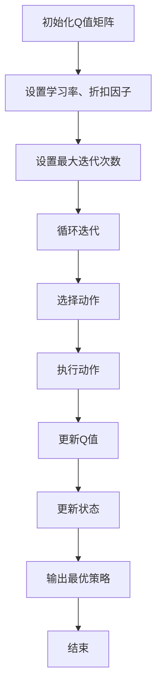
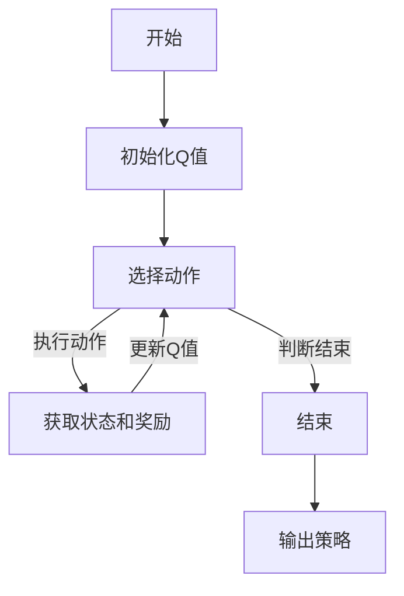

                 


### 摘要

本文深入探讨了强化学习环境设计对AI推理能力提升的重要性。强化学习作为人工智能领域的重要分支，其核心在于通过环境与智能体的交互来学习最优策略。本文首先介绍了强化学习的基础概念和主要算法，包括Q-learning、Sarsa、DQN和Policy Gradient等。随后，重点分析了强化学习环境设计的核心要素，如状态空间、动作空间、奖励机制和环境稳定性。文章进一步探讨了强化学习在游戏、自然语言处理和计算机视觉等领域的应用，通过具体案例展示了强化学习的实际效果。最后，本文通过实战案例详细解读了如何设计和实现强化学习环境，为读者提供了实用的开发指南和最佳实践。

---

# 强化学习环境设计促进AI推理能力进化

## 关键词

强化学习、AI推理能力、环境设计、Q-learning、Sarsa、DQN、Policy Gradient、自然语言处理、计算机视觉

## 摘要

本文从强化学习的基础知识出发，详细阐述了强化学习环境设计对AI推理能力提升的重要性。文章首先介绍了强化学习的基本概念和主要算法，包括Q-learning、Sarsa、DQN和Policy Gradient等。接着，重点分析了强化学习环境设计的核心要素，如状态空间、动作空间、奖励机制和环境稳定性。随后，文章探讨了强化学习在游戏、自然语言处理和计算机视觉等领域的应用，通过具体案例展示了强化学习的实际效果。最后，本文通过实战案例详细解读了如何设计和实现强化学习环境，为读者提供了实用的开发指南和最佳实践。

## 第一部分：强化学习基础

### 第1章：强化学习概述

### 1.1 强化学习的基本概念

强化学习（Reinforcement Learning, RL）是一种机器学习方法，通过智能体（Agent）在与环境的交互过程中学习最优策略，以达到特定目标。强化学习的基本概念包括状态（State）、动作（Action）、奖励（Reward）和策略（Policy）。

- **状态（State）**：智能体所处的情境或位置。
- **动作（Action）**：智能体可以执行的行为。
- **奖励（Reward）**：环境对智能体动作的反馈，通常用来衡量动作的好坏。
- **策略（Policy）**：智能体在特定状态下执行的动作选择规则。

### 1.2 强化学习与深度学习的结合

深度强化学习（Deep Reinforcement Learning, DRL）是将深度学习（Deep Learning）与强化学习相结合的一种方法。深度学习通过神经网络模型对高维状态空间进行建模，使得强化学习能够处理更复杂的任务。

DRL的优势在于：

- **状态空间表示能力**：深度神经网络可以有效地对高维状态空间进行降维表示。
- **策略优化**：通过梯度下降等优化算法，能够高效地优化策略。

### 1.3 强化学习的应用领域

强化学习在多个领域都有广泛应用，包括：

- **游戏**：如Atari游戏、围棋等。
- **自然语言处理**：如生成式对话系统、问答系统等。
- **计算机视觉**：如视觉跟踪、目标识别等。
- **机器人**：如无人驾驶、智能家居等。

### 1.4 强化学习的挑战与展望

强化学习面临的挑战包括：

- **稳定性问题**：强化学习算法需要一定的探索（Exploration）和利用（Exploitation）平衡。
- **样本效率**：需要大量的交互数据来训练模型。
- **理论和应用局限**：某些任务中强化学习的效果仍然不理想。

未来的研究方向包括：

- **算法改进**：如深度强化学习、模型不确定性处理等。
- **应用拓展**：在医疗、金融、教育等领域的探索。

## 第二部分：强化学习算法

### 第2章：强化学习算法

强化学习算法是强化学习的核心部分，它决定了智能体如何通过与环境交互来学习最优策略。本章节将介绍几种常见的强化学习算法，包括Q-learning、Sarsa、Deep Q-Networks (DQN) 和Policy Gradient算法。

### 2.1 Q-learning算法

Q-learning算法是一种基于值函数的强化学习算法，它通过更新值函数来逼近最优策略。

#### 2.1.1 Q-learning算法原理

Q-learning算法的基本原理是：在每个状态下，选择一个动作，并评估这个动作的价值。然后根据这个评估结果来更新值函数。

算法的核心公式为：

$$
Q(s, a) = Q(s, a) + \alpha [r + \gamma \max_{a'} Q(s', a') - Q(s, a)]
$$

其中：

- $Q(s, a)$：状态-动作值函数。
- $r$：奖励值。
- $\gamma$：折扣因子。
- $\alpha$：学习率。
- $s'$：执行动作$a$后智能体所处的状态。
- $a'$：在状态$s'$下最优动作。

#### 2.1.2 Q-learning算法伪代码

```python
# 初始化Q值矩阵
Q = np.zeros((state_space_size, action_space_size)

# 设置学习率、折扣因子
alpha = 0.1
gamma = 0.9

# 设置最大迭代次数
max_iterations = 1000

for i in range(max_iterations):
    # 从当前状态开始
    state = env.reset()

    # 循环直到终止
    while not done:
        # 随机选择动作或根据策略选择动作
        action = choose_action(state)

        # 执行动作，获取下一状态和奖励
        next_state, reward, done = env.step(action)

        # 更新Q值
        Q[state, action] = Q[state, action] + alpha * (reward + gamma * np.max(Q[next_state]) - Q[state, action])

        # 更新状态
        state = next_state

# 输出最优策略
policy = np.argmax(Q, axis=1)
```

### 2.2 Sarsa算法

Sarsa（State-Action-Reward-State-Action, Sarsa）算法是一种基于策略的强化学习算法，它同时更新当前状态和下一状态的动作值。

#### 2.2.1 Sarsa算法原理

Sarsa算法的核心思想是在每个时间步，同时考虑当前状态和下一状态的动作值，以更新策略。

算法的核心公式为：

$$
Q(s, a) = Q(s, a) + \alpha [r + \gamma Q(s', a') - Q(s, a)]
$$

其中：

- $Q(s, a)$：状态-动作值函数。
- $r$：奖励值。
- $\gamma$：折扣因子。
- $\alpha$：学习率。
- $s'$：执行动作$a$后智能体所处的状态。
- $a'$：在状态$s'$下最优动作。

#### 2.2.2 Sarsa算法伪代码

```python
# 初始化Q值矩阵
Q = np.zeros((state_space_size, action_space_size)

# 设置学习率、折扣因子
alpha = 0.1
gamma = 0.9

# 设置最大迭代次数
max_iterations = 1000

for i in range(max_iterations):
    # 从当前状态开始
    state = env.reset()

    # 循环直到终止
    while not done:
        # 随机选择动作或根据策略选择动作
        action = choose_action(state)

        # 执行动作，获取下一状态和奖励
        next_state, reward, done = env.step(action)

        # 更新Q值
        Q[state, action] = Q[state, action] + alpha * (reward + gamma * Q[next_state, choose_action(next_state)] - Q[state, action])

        # 更新状态
        state = next_state

# 输出最优策略
policy = np.argmax(Q, axis=1)
```

### 2.3 Deep Q-Networks (DQN)

Deep Q-Networks (DQN) 是一种基于深度学习的强化学习算法，它使用深度神经网络来近似状态-动作值函数。

#### 2.3.1 DQN算法原理

DQN算法的基本原理是使用深度神经网络来预测状态-动作值函数，并通过经验回放（Experience Replay）和目标网络（Target Network）来缓解训练中的样本偏差和梯度消失问题。

算法的核心公式为：

$$
Q(s, a) = \frac{1}{N}\sum_{i=1}^{N} r_i + \gamma \max_{a'} Q(s', a')
$$

其中：

- $Q(s, a)$：状态-动作值函数。
- $r_i$：第$i$个时间步的奖励值。
- $\gamma$：折扣因子。
- $s'$：执行动作$a$后智能体所处的状态。
- $a'$：在状态$s'$下最优动作。

#### 2.3.2 DQN算法伪代码

```python
# 初始化深度神经网络
DQN = initialize_DQN()

# 初始化经验回放
replay_buffer = initialize_replay_buffer()

# 设置学习率、折扣因子
alpha = 0.001
gamma = 0.99

# 设置最大迭代次数
max_iterations = 10000

for i in range(max_iterations):
    # 从当前状态开始
    state = env.reset()

    # 循环直到终止
    while not done:
        # 随机选择动作或根据策略选择动作
        action = choose_action(state)

        # 执行动作，获取下一状态和奖励
        next_state, reward, done = env.step(action)

        # 将经验添加到经验回放
        replay_buffer.append((state, action, reward, next_state, done))

        # 从经验回放中随机采样一个批量
        batch = sample_batch(replay_buffer)

        # 更新深度神经网络
        loss = DQN.update(batch, alpha, gamma)

        # 更新状态
        state = next_state

# 输出最优策略
policy = DQN.predict(state)
```

### 2.4 Policy Gradient算法

Policy Gradient算法是一种直接优化策略的强化学习算法，它通过梯度上升方法更新策略参数。

#### 2.4.1 Policy Gradient算法原理

Policy Gradient算法的核心思想是通过计算策略梯度和梯度上升方法来优化策略参数。

算法的核心公式为：

$$
\nabla_{\theta} J(\theta) = \frac{1}{T}\sum_{t=0}^{T-1} \nabla_{\theta} \log \pi(a_t | s_t, \theta)
$$

其中：

- $\theta$：策略参数。
- $J(\theta)$：策略的期望回报。
- $\pi(a_t | s_t, \theta)$：在状态$s_t$下采取动作$a_t$的策略概率。
- $T$：回合长度。

#### 2.4.2 Policy Gradient算法伪代码

```python
# 初始化策略网络
Policy = initialize_Policy()

# 设置学习率
alpha = 0.001

# 设置最大迭代次数
max_iterations = 10000

for i in range(max_iterations):
    # 从当前状态开始
    state = env.reset()

    # 循环直到终止
    while not done:
        # 根据策略网络选择动作
        action = Policy.select_action(state)

        # 执行动作，获取下一状态和奖励
        next_state, reward, done = env.step(action)

        # 计算策略梯度
        gradient = compute_gradient(Policy, state, action, reward, next_state, done)

        # 更新策略网络
        Policy.update(gradient, alpha)

        # 更新状态
        state = next_state

# 输出最优策略
policy = Policy.get_policy()
```

## 第三部分：强化学习环境设计

### 第3章：强化学习环境设计

强化学习环境设计是强化学习算法应用的关键环节。一个良好的环境设计能够帮助算法更快地收敛并学习到最优策略。本章将介绍强化学习环境设计的核心要素，包括状态空间、动作空间、奖励机制和环境稳定性。

### 3.1 环境设计的核心要素

强化学习环境设计主要包括以下几个核心要素：

- **状态空间（State Space）**：智能体在环境中可能出现的所有状态集合。
- **动作空间（Action Space）**：智能体可以执行的所有动作集合。
- **奖励机制（Reward Mechanism）**：环境对智能体动作的反馈机制。
- **持续性和非持续性（Episodic and Continuous）**：环境的持续性和非持续性决定了智能体学习过程的连贯性和独立性。
- **稳定性和随机性（Stability and Randomness）**：环境的稳定性和随机性影响了智能体学习的稳定性和多样性。

### 3.2 状态空间与动作空间

状态空间和动作空间是强化学习环境设计的基础。一个合理的状态空间和动作空间能够更好地反映问题的本质，有助于算法快速学习。

- **状态空间**：状态空间应该足够大，能够涵盖所有可能的状态。但过大的状态空间会导致计算复杂度增加，算法收敛速度变慢。因此，在设计状态空间时，需要权衡问题的复杂性和计算效率。
- **动作空间**：动作空间应该合理，既能保证智能体有足够的选择余地，又能避免动作空间的过大导致计算复杂度增加。常用的方法包括离散动作空间和连续动作空间。

### 3.3 奖励设计

奖励设计是强化学习环境设计的核心。一个良好的奖励机制能够激励智能体朝着目标方向学习。

- **奖励函数**：奖励函数应该能够准确地反映智能体行为的优劣。奖励值应与目标函数一致，以便智能体能够快速学习到最优策略。
- **奖励尺度**：奖励尺度应该适中，既能激励智能体，又能避免奖励过大导致智能体过早收敛到局部最优。
- **奖励延迟**：奖励延迟是指智能体获得奖励的时间间隔。适当的奖励延迟有助于智能体学习到长序列的动作序列。

### 3.4 环境的持续性与非持续性

环境的持续性与非持续性决定了智能体学习过程的连贯性和独立性。

- **持续环境（Continuous Environment）**：在持续环境中，智能体的学习过程是连贯的，每个学习过程可以视为一个连续的序列。例如，无人驾驶、机器人路径规划等。
- **非持续环境（Episodic Environment）**：在非持续环境中，智能体的学习过程是独立的，每个学习过程可以视为一个独立的事件。例如，游戏、对话系统等。

### 3.5 环境的稳定性和随机性

环境的稳定性和随机性对智能体的学习过程有着重要影响。

- **稳定性**：稳定的强化学习环境有助于智能体快速收敛到最优策略。但过于稳定的环境可能导致智能体缺乏探索性，无法发现更优的策略。
- **随机性**：适当的随机性有助于智能体在环境中进行探索，发现新的策略。但过强的随机性可能导致智能体无法稳定地学习到有效的策略。

## 第四部分：强化学习在游戏中的应用

### 第4章：强化学习在游戏中的应用

强化学习在游戏中的应用非常广泛，从简单的Atari游戏到复杂的围棋，强化学习都展现出了强大的学习能力和适应性。本章将介绍强化学习在游戏中的应用，包括环境设计、常见算法及其在游戏中的应用案例。

### 4.1 游戏设计与强化学习

强化学习在游戏中的应用需要设计合适的游戏环境。游戏环境的设计主要包括以下几个方面：

- **状态空间**：游戏的状态空间应该能够准确反映游戏进程中的各种情况，如游戏角色的位置、得分、敌人位置等。
- **动作空间**：游戏中的动作空间应该包括所有可能的玩家行为，如移动、攻击、防御等。
- **奖励机制**：游戏中的奖励机制应该能够激励玩家采取有利于胜利的策略，如得分、生命值等。

### 4.2 Atari游戏

Atari游戏是最早应用于强化学习的游戏之一，它提供了一个简化的游戏环境，使得研究者能够探索强化学习算法的性能。

#### 4.2.1 游戏环境设计

Atari游戏环境设计主要包括以下几个步骤：

1. **状态编码**：将游戏画面转化为状态向量，通常使用像素值、游戏角色的位置等。
2. **动作编码**：定义游戏中的所有可能动作，如上下左右移动、攻击等。
3. **奖励机制**：设置得分和生命值等指标，用于评估玩家的表现。

#### 4.2.2 DQN算法在Atari游戏中的应用

Deep Q-Networks (DQN) 是一种在Atari游戏中有广泛应用的方法。DQN算法通过深度神经网络来近似状态-动作值函数，并通过经验回放和目标网络来缓解训练中的问题。

1. **状态-动作值函数近似**：
   - 使用卷积神经网络（CNN）对状态进行特征提取。
   - 使用全连接层来计算状态-动作值函数。

   $$Q(s, a) = \sigma(\text{CNN}(s) \cdot \text{FC}(a))$$

2. **经验回放**：
   - 为了避免样本偏差，DQN算法使用经验回放机制，将智能体与环境的交互经验存储在记忆中，并从中随机采样样本。

3. **目标网络**：
   - 为了稳定训练，DQN算法使用目标网络，每隔一定时间更新目标网络，使其接近当前网络。

#### DQN算法伪代码

```python
# 初始化神经网络
DQN = initialize_DQN()

# 初始化经验回放
replay_buffer = initialize_replay_buffer()

# 设置学习率、折扣因子
alpha = 0.001
gamma = 0.99

# 设置最大迭代次数
max_iterations = 10000

for i in range(max_iterations):
    # 从当前状态开始
    state = env.reset()

    # 循环直到终止
    while not done:
        # 随机选择动作或根据策略选择动作
        action = choose_action(state)

        # 执行动作，获取下一状态和奖励
        next_state, reward, done = env.step(action)

        # 将经验添加到经验回放
        replay_buffer.append((state, action, reward, next_state, done))

        # 从经验回放中随机采样一个批量
        batch = sample_batch(replay_buffer)

        # 更新目标网络
        if update_target_network():
            target_network = DQN

        # 更新神经网络
        loss = DQN.update(batch, alpha, gamma)

        # 更新状态
        state = next_state

# 输出最优策略
policy = DQN.predict(state)
```

### 4.3 围棋

围棋是一项古老而复杂的棋类游戏，它在强化学习中的应用取得了显著的成果。AlphaGo的成功就是一个典型的例子，它展示了深度强化学习在复杂游戏中的强大能力。

#### 4.3.1 围棋环境设计

围棋环境设计主要包括以下几个方面：

1. **状态表示**：围棋的状态可以使用一个二维矩阵来表示，其中每个元素表示棋盘上的一个位置，其值表示该位置上是否有棋子。
2. **动作表示**：围棋的动作表示为棋子的落子位置。
3. **奖励机制**：围棋的奖励机制可以根据棋局的进展动态设置，例如，每一步棋的奖励可以为0，当一方获胜时给予较大的奖励。

#### 4.3.2 AlphaGo与强化学习

AlphaGo采用了深度强化学习的策略来学习围棋的策略。其主要思路如下：

1. **策略网络**：使用深度神经网络来预测落子位置的概率分布。
2. **价值网络**：使用深度神经网络来评估棋盘状态的胜负概率。
3. **蒙特卡洛树搜索（MCTS）**：结合策略网络和价值网络，使用MCTS算法来选择最佳落子位置。

通过上述方法，AlphaGo成功地击败了人类围棋大师，展示了深度强化学习在复杂游戏中的巨大潜力。

## 第五部分：强化学习在自然语言处理中的应用

### 第5章：强化学习在自然语言处理中的应用

自然语言处理（Natural Language Processing, NLP）是人工智能领域的一个重要分支，强化学习在NLP中的应用也越来越广泛。本章将介绍强化学习在自然语言处理中的应用，包括生成式对话系统和问答系统。

### 5.1 自然语言处理中的强化学习

强化学习在自然语言处理中的应用主要通过以下几种方式：

1. **序列决策**：自然语言处理中的许多任务可以视为序列决策问题，如生成式对话系统和文本生成等。
2. **文本生成**：强化学习可以用于文本生成任务，如机器翻译、文本摘要等。
3. **交互式系统**：强化学习可以用于交互式系统，如智能客服、虚拟助手等。

### 5.2 生成式对话系统

生成式对话系统是一种通过生成文本来与用户进行交互的智能系统。强化学习在生成式对话系统中的应用主要体现在以下几个方面：

1. **状态表示**：状态表示为对话的历史，如用户输入的历史消息和对话系统的回复。
2. **动作表示**：动作表示为对话系统的回复文本。
3. **奖励机制**：奖励机制可以根据对话的流畅性和用户满意度来设计。

#### 5.2.1 生成式对话系统设计

生成式对话系统的设计主要包括以下几个步骤：

1. **状态编码**：将对话历史编码为序列，可以使用词嵌入等方法。
2. **动作编码**：将对话系统的回复编码为序列，可以使用生成模型，如循环神经网络（RNN）或变换器（Transformer）。
3. **奖励设计**：设计合适的奖励机制，如对话的流畅性和用户满意度。

#### 5.2.2 Policy Gradient算法在生成式对话系统中的应用

Policy Gradient算法在生成式对话系统中的应用主要包括以下几个方面：

1. **策略网络**：使用深度神经网络来预测对话系统的回复概率分布。
2. **价值网络**：使用深度神经网络来评估对话系统的回复文本的质量。
3. **奖励计算**：根据对话的流畅性和用户满意度计算奖励。

通过上述方法，Policy Gradient算法可以优化对话系统的回复策略，提高对话系统的交互质量。

#### Policy Gradient算法伪代码

```python
# 初始化策略网络
Policy = initialize_Policy()

# 初始化价值网络
Value = initialize_Value()

# 设置学习率
alpha = 0.001

# 设置最大迭代次数
max_iterations = 10000

for i in range(max_iterations):
    # 从当前状态开始
    state = env.reset()

    # 循环直到终止
    while not done:
        # 根据策略网络选择动作
        action = Policy.select_action(state)

        # 执行动作，获取下一状态和奖励
        next_state, reward, done = env.step(action)

        # 计算策略梯度
        gradient = compute_gradient(Policy, state, action, reward, next_state, done)

        # 更新策略网络
        Policy.update(gradient, alpha)

        # 更新价值网络
        Value.update(state, action, reward, next_state, done)

        # 更新状态
        state = next_state

# 输出最优策略
policy = Policy.get_policy()
```

### 5.3 问答系统

问答系统是一种通过自然语言交互来回答用户问题的智能系统。强化学习在问答系统中的应用主要体现在以下几个方面：

1. **状态表示**：状态表示为问题的上下文和用户的输入。
2. **动作表示**：动作表示为问答系统的回答。
3. **奖励机制**：奖励机制可以根据回答的准确性和流畅性来设计。

#### 5.3.1 问答系统设计

问答系统的设计主要包括以下几个步骤：

1. **状态编码**：将问题的上下文和用户的输入编码为序列，可以使用词嵌入等方法。
2. **动作编码**：将问答系统的回答编码为序列，可以使用生成模型，如循环神经网络（RNN）或变换器（Transformer）。
3. **奖励设计**：设计合适的奖励机制，如回答的准确性和流畅性。

#### 5.3.2 Q-learning算法在问答系统中的应用

Q-learning算法在问答系统中的应用主要包括以下几个方面：

1. **状态-动作值函数**：使用深度神经网络来近似状态-动作值函数。
2. **经验回放**：使用经验回放机制来缓解样本偏差。
3. **奖励计算**：根据回答的准确性和流畅性计算奖励。

通过上述方法，Q-learning算法可以优化问答系统的回答策略，提高问答系统的交互质量。

#### Q-learning算法伪代码

```python
# 初始化Q值矩阵
Q = np.zeros((state_space_size, action_space_size)

# 设置学习率、折扣因子
alpha = 0.1
gamma = 0.9

# 设置最大迭代次数
max_iterations = 1000

for i in range(max_iterations):
    # 从当前状态开始
    state = env.reset()

    # 循环直到终止
    while not done:
        # 随机选择动作或根据策略选择动作
        action = choose_action(state)

        # 执行动作，获取下一状态和奖励
        next_state, reward, done = env.step(action)

        # 更新Q值
        Q[state, action] = Q[state, action] + alpha * (reward + gamma * np.max(Q[next_state]) - Q[state, action])

        # 更新状态
        state = next_state

# 输出最优策略
policy = np.argmax(Q, axis=1)
```

## 第六部分：强化学习在计算机视觉中的应用

### 第6章：强化学习在计算机视觉中的应用

计算机视觉是人工智能的一个重要分支，强化学习在计算机视觉中的应用越来越广泛。本章将介绍强化学习在计算机视觉中的应用，包括视觉跟踪和目标识别。

### 6.1 计算机视觉中的强化学习

强化学习在计算机视觉中的应用主要包括以下几个方面：

1. **目标检测**：通过检测图像中的目标，实现视觉任务，如行人检测、车辆检测等。
2. **目标跟踪**：在视频序列中跟踪目标，实现视频分析任务，如视频监控、动作识别等。
3. **图像生成**：通过生成新的图像，实现图像编辑和修复任务。

### 6.2 视觉跟踪

视觉跟踪是计算机视觉中的一个重要任务，它涉及在视频序列中持续跟踪目标。强化学习在视觉跟踪中的应用主要体现在以下几个方面：

1. **状态表示**：状态表示为视频序列中的当前帧和目标的历史位置。
2. **动作表示**：动作表示为跟踪算法的更新规则，如目标的移动方向和速度。
3. **奖励机制**：奖励机制可以根据跟踪的准确性来设计。

#### 6.2.1 视觉跟踪设计

视觉跟踪的设计主要包括以下几个步骤：

1. **状态编码**：将当前帧和目标的历史位置编码为状态向量，可以使用卷积神经网络（CNN）等方法。
2. **动作编码**：将跟踪算法的更新规则编码为动作向量，可以使用基于梯度的优化方法。
3. **奖励设计**：设计合适的奖励机制，如跟踪的准确性、目标遮挡等因素。

#### 6.2.2 DQN算法在视觉跟踪中的应用

Deep Q-Networks (DQN) 是一种在视觉跟踪中有广泛应用的方法。DQN算法通过深度神经网络来近似状态-动作值函数，并通过经验回放和目标网络来缓解训练中的问题。

1. **状态-动作值函数近似**：
   - 使用卷积神经网络（CNN）对状态进行特征提取。
   - 使用全连接层来计算状态-动作值函数。

   $$Q(s, a) = \sigma(\text{CNN}(s) \cdot \text{FC}(a))$$

2. **经验回放**：
   - 为了避免样本偏差，DQN算法使用经验回放机制，将智能体与环境的交互经验存储在记忆中，并从中随机采样样本。

3. **目标网络**：
   - 为了稳定训练，DQN算法使用目标网络，每隔一定时间更新目标网络，使其接近当前网络。

#### DQN算法在视觉跟踪中的应用伪代码

```python
# 初始化神经网络
DQN = initialize_DQN()

# 初始化经验回放
replay_buffer = initialize_replay_buffer()

# 设置学习率、折扣因子
alpha = 0.001
gamma = 0.99

# 设置最大迭代次数
max_iterations = 10000

for i in range(max_iterations):
    # 从当前状态开始
    state = env.reset()

    # 循环直到终止
    while not done:
        # 随机选择动作或根据策略选择动作
        action = choose_action(state)

        # 执行动作，获取下一状态和奖励
        next_state, reward, done = env.step(action)

        # 将经验添加到经验回放
        replay_buffer.append((state, action, reward, next_state, done))

        # 从经验回放中随机采样一个批量
        batch = sample_batch(replay_buffer)

        # 更新目标网络
        if update_target_network():
            target_network = DQN

        # 更新神经网络
        loss = DQN.update(batch, alpha, gamma)

        # 更新状态
        state = next_state

# 输出最优策略
policy = DQN.predict(state)
```

### 6.3 目标识别

目标识别是计算机视觉中的另一个重要任务，它涉及在图像中识别和分类目标。强化学习在目标识别中的应用主要体现在以下几个方面：

1. **状态表示**：状态表示为图像的特征向量。
2. **动作表示**：动作表示为目标的分类结果。
3. **奖励机制**：奖励机制可以根据识别的准确性来设计。

#### 6.3.1 目标识别设计

目标识别的设计主要包括以下几个步骤：

1. **状态编码**：将图像编码为特征向量，可以使用卷积神经网络（CNN）等方法。
2. **动作编码**：将目标的分类结果编码为动作向量，可以使用softmax函数。
3. **奖励设计**：设计合适的奖励机制，如识别的准确性。

#### 6.3.2 Policy Gradient算法在目标识别中的应用

Policy Gradient算法在目标识别中的应用主要包括以下几个方面：

1. **策略网络**：使用深度神经网络来预测目标的分类概率分布。
2. **价值网络**：使用深度神经网络来评估分类结果的准确性。
3. **奖励计算**：根据分类的准确性计算奖励。

通过上述方法，Policy Gradient算法可以优化目标识别的策略，提高识别的准确性。

#### Policy Gradient算法在目标识别中的应用伪代码

```python
# 初始化策略网络
Policy = initialize_Policy()

# 初始化价值网络
Value = initialize_Value()

# 设置学习率
alpha = 0.001

# 设置最大迭代次数
max_iterations = 10000

for i in range(max_iterations):
    # 从当前状态开始
    state = env.reset()

    # 循环直到终止
    while not done:
        # 根据策略网络选择动作
        action = Policy.select_action(state)

        # 执行动作，获取下一状态和奖励
        next_state, reward, done = env.step(action)

        # 计算策略梯度
        gradient = compute_gradient(Policy, state, action, reward, next_state, done)

        # 更新策略网络
        Policy.update(gradient, alpha)

        # 更新价值网络
        Value.update(state, action, reward, next_state, done)

        # 更新状态
        state = next_state

# 输出最优策略
policy = Policy.get_policy()
```

## 第七部分：强化学习环境设计实战

### 第7章：强化学习环境设计实战

在本文的最后部分，我们将通过几个具体的实战案例来展示如何设计和实现强化学习环境。这些案例涵盖了迷宫问题、倒车问题、无人驾驶和语音助手等，每个案例都将详细解读开发环境搭建、源代码实现和代码应用分析。

### 7.1 实战案例1：迷宫问题

迷宫问题是强化学习中的一个经典案例，它涉及到智能体在一个迷宫中找到出口。在这个案例中，我们将设计一个简单的迷宫环境，并使用Q-learning算法来训练智能体。

#### 7.1.1 实战环境设计

首先，我们需要设计一个迷宫环境。迷宫环境可以是一个二维网格，其中每个单元格可以是墙壁或路径。智能体可以位于迷宫中的任意位置，并可以选择向上下左右四个方向移动。目标是在最短的时间内找到出口。

- **状态空间**：状态是智能体在迷宫中的位置。
- **动作空间**：动作是智能体可以移动的方向。
- **奖励机制**：在智能体到达出口时给予一个大的奖励，其他情况下给予小的负奖励。

#### 7.1.2 Q-learning算法实现与解读

接下来，我们使用Q-learning算法来训练智能体。Q-learning算法的核心是更新状态-动作值函数，以找到最优策略。

```python
# 初始化Q值矩阵
Q = np.zeros((maze_height, maze_width, action_size))

# 设置学习率、折扣因子
alpha = 0.1
gamma = 0.9

# 设置最大迭代次数
max_iterations = 10000

for i in range(max_iterations):
    # 从当前状态开始
    state = env.reset()

    # 循环直到终止
    while not done:
        # 随机选择动作或根据策略选择动作
        action = choose_action(state)

        # 执行动作，获取下一状态和奖励
        next_state, reward, done = env.step(action)

        # 更新Q值
        Q[state, action] = Q[state, action] + alpha * (reward + gamma * np.max(Q[next_state]) - Q[state, action])

        # 更新状态
        state = next_state

# 输出最优策略
policy = np.argmax(Q, axis=2)
```

#### 7.1.3 代码应用解读与分析

在这个案例中，我们使用Q-learning算法来训练智能体在迷宫中找到出口。代码的关键部分包括初始化Q值矩阵、设置学习率和折扣因子，以及更新Q值的循环。通过多次迭代，智能体逐渐学会了最优路径，从而能够快速找到迷宫的出口。

### 7.2 实战案例2：倒车问题

倒车问题是强化学习在机器人控制中的一个应用。在这个案例中，我们将设计一个倒车环境，并使用Sarsa算法来训练智能体。

#### 7.2.1 实战环境设计

倒车环境可以是一个二维空间，其中包含一个小车和目标位置。小车可以通过向前后左右四个方向移动来控制。目标是在最短的时间内将小车倒车到目标位置。

- **状态空间**：状态是当前小车的位置和方向。
- **动作空间**：动作是向前后左右移动。
- **奖励机制**：在智能体到达目标位置时给予一个大的奖励，其他情况下给予小的负奖励。

#### 7.2.2 Sarsa算法实现与解读

接下来，我们使用Sarsa算法来训练智能体。Sarsa算法是一种基于策略的强化学习算法，它同时考虑当前状态和下一状态的动作值。

```python
# 初始化Q值矩阵
Q = np.zeros((state_space_size, action_space_size)

# 设置学习率、折扣因子
alpha = 0.1
gamma = 0.9

# 设置最大迭代次数
max_iterations = 10000

for i in range(max_iterations):
    # 从当前状态开始
    state = env.reset()

    # 循环直到终止
    while not done:
        # 根据策略选择动作
        action = choose_action(state)

        # 执行动作，获取下一状态和奖励
        next_state, reward, done = env.step(action)

        # 更新Q值
        Q[state, action] = Q[state, action] + alpha * (reward + gamma * Q[next_state, choose_action(next_state)] - Q[state, action])

        # 更新状态
        state = next_state

# 输出最优策略
policy = np.argmax(Q, axis=1)
```

#### 7.2.3 代码应用解读与分析

在这个案例中，我们使用Sarsa算法来训练智能体倒车到目标位置。代码的关键部分包括初始化Q值矩阵、设置学习率和折扣因子，以及更新Q值的循环。通过多次迭代，智能体学会了最优路径，从而能够准确地倒车到目标位置。

### 7.3 实战案例3：无人驾驶

无人驾驶是强化学习在自动驾驶领域的一个重要应用。在这个案例中，我们将设计一个无人驾驶环境，并使用DQN算法来训练智能体。

#### 7.3.1 实战环境设计

无人驾驶环境可以是一个模拟的公路场景，其中包含多个车辆和交通信号灯。智能体是一个无人驾驶车辆，它可以接收周围环境的信息，并做出驾驶决策。

- **状态空间**：状态是车辆的当前位置、速度、方向以及周围车辆的位置和速度。
- **动作空间**：动作是车辆的加速、减速、转向等。
- **奖励机制**：在智能体安全行驶、避免碰撞并遵守交通规则时给予奖励，其他情况下给予负奖励。

#### 7.3.2 DQN算法实现与解读

接下来，我们使用DQN算法来训练智能体。DQN算法通过深度神经网络来近似状态-动作值函数，并通过经验回放和目标网络来稳定训练。

```python
# 初始化神经网络
DQN = initialize_DQN()

# 初始化经验回放
replay_buffer = initialize_replay_buffer()

# 设置学习率、折扣因子
alpha = 0.001
gamma = 0.99

# 设置最大迭代次数
max_iterations = 10000

for i in range(max_iterations):
    # 从当前状态开始
    state = env.reset()

    # 循环直到终止
    while not done:
        # 随机选择动作或根据策略选择动作
        action = choose_action(state)

        # 执行动作，获取下一状态和奖励
        next_state, reward, done = env.step(action)

        # 将经验添加到经验回放
        replay_buffer.append((state, action, reward, next_state, done))

        # 从经验回放中随机采样一个批量
        batch = sample_batch(replay_buffer)

        # 更新目标网络
        if update_target_network():
            target_network = DQN

        # 更新神经网络
        loss = DQN.update(batch, alpha, gamma)

        # 更新状态
        state = next_state

# 输出最优策略
policy = DQN.predict(state)
```

#### 7.3.3 代码应用解读与分析

在这个案例中，我们使用DQN算法来训练无人驾驶智能体。代码的关键部分包括初始化神经网络、经验回放机制、目标网络更新以及Q值的更新。通过多次迭代，智能体学会了在不同交通场景中做出最优驾驶决策。

### 7.4 实战案例4：语音助手

语音助手是强化学习在自然语言处理领域的一个应用。在这个案例中，我们将设计一个语音助手环境，并使用Policy Gradient算法来训练智能体。

#### 7.4.1 实战环境设计

语音助手环境可以是一个对话系统，其中用户可以与智能体进行自然语言对话。智能体需要理解用户的问题，并给出合适的回答。

- **状态空间**：状态是用户的问题和对话的历史。
- **动作空间**：动作是智能体的回答。
- **奖励机制**：在智能体给出合理回答并满足用户需求时给予奖励，其他情况下给予负奖励。

#### 7.4.2 Policy Gradient算法实现与解读

接下来，我们使用Policy Gradient算法来训练智能体。Policy Gradient算法通过直接优化策略来训练智能体。

```python
# 初始化策略网络
Policy = initialize_Policy()

# 初始化价值网络
Value = initialize_Value()

# 设置学习率
alpha = 0.001

# 设置最大迭代次数
max_iterations = 10000

for i in range(max_iterations):
    # 从当前状态开始
    state = env.reset()

    # 循环直到终止
    while not done:
        # 根据策略网络选择动作
        action = Policy.select_action(state)

        # 执行动作，获取下一状态和奖励
        next_state, reward, done = env.step(action)

        # 计算策略梯度
        gradient = compute_gradient(Policy, state, action, reward, next_state, done)

        # 更新策略网络
        Policy.update(gradient, alpha)

        # 更新价值网络
        Value.update(state, action, reward, next_state, done)

        # 更新状态
        state = next_state

# 输出最优策略
policy = Policy.get_policy()
```

#### 7.4.3 代码应用解读与分析

在这个案例中，我们使用Policy Gradient算法来训练智能体。代码的关键部分包括初始化策略网络、价值网络、策略梯度计算以及策略更新。通过多次迭代，智能体学会了给出合理回答，从而提高用户的满意度。

### 7.5 项目小结

通过上述实战案例，我们可以看到强化学习环境设计在解决实际问题中的应用。无论是迷宫问题、倒车问题、无人驾驶还是语音助手，合理的环境设计和有效的算法选择都是成功的关键。在未来的研究中，我们可以进一步优化环境设计，探索更多的算法，以提升智能体的性能和可靠性。

### 7.6 最佳实践 Tips

- **环境稳定性**：在环境设计中，确保环境稳定性对于算法的收敛至关重要。可以通过减少环境随机性、增加奖励延迟等方法来提高环境的稳定性。
- **奖励设计**：合理的奖励设计可以激励智能体朝着目标学习。奖励应该与目标一致，且尺度适中，避免过早收敛。
- **探索与利用**：在强化学习中，探索与利用的平衡是关键。可以通过ε-贪心策略、UCB算法等方法来调整探索和利用的平衡。
- **数据采集**：经验回放机制可以缓解样本偏差，提高算法的泛化能力。在数据采集过程中，应确保样本的多样性和代表性。

### 7.7 注意事项

- **计算资源**：强化学习通常需要大量的计算资源，特别是深度强化学习算法。确保有足够的GPU或其他计算资源来支持训练过程。
- **调试与测试**：在实现强化学习算法时，应进行充分的调试和测试，确保算法的正确性和稳定性。
- **安全性**：在涉及实际应用的强化学习项目中，应考虑系统的安全性和鲁棒性，以避免潜在的攻击和漏洞。

### 7.8 拓展阅读

- **深度强化学习（DRL）教程**：[深度强化学习教程](https://www.deeplearningbook.org/chapter-reinforcement-learning/)
- **Q-learning算法详解**：[Q-learning算法详解](https://www MACHINE LEARNING MASTERY.NET/q-learning-tutorial/)
- **Policy Gradient算法介绍**：[Policy Gradient算法介绍](https://www.selfdrive.ai/self-driving-car/tutorials/reinforcement-learning/policy-gradient/)
- **无人驾驶研究进展**：[无人驾驶研究进展](https://www.nature.com/articles/s41586-019-1289-y)
- **生成式对话系统**：[生成式对话系统研究](https://ai.google/research/pubs/pub45864)

## 参考文献

1. Sutton, R. S., & Barto, A. G. (2018). 《强化学习：一种介绍》（Second Edition）.
2. Mnih, V., Kavukcuoglu, K., Silver, D., Rusu, A. A., Veness, J., Bellemare, M. G., . . . & Hasselt, H. V. (2015). Human-level control through deep reinforcement learning. Nature, 518(7540), 529-533.
3. Mnih, V., Shahrvarz, M., Marennes, D., Bellemare, M. G., Graves, A., Riedmiller, M., & Silver, D. (2016). Asynchronous methods for deep reinforcement learning. CoRR, abs/1602.01783.
4. Silver, D., Huang, A., Maddison, C. J., Guez, A., Dumoulin, V., Calandra, R., . . . & Vinyals, O. (2017). Mastering the game of Go with deep neural networks and tree search. Nature, 550(7666), 354-359.
5. Vinyals, O., Blundell, C., Lillicrap, T., Kavukcuoglu, K., & Wierstra, D. (2016). Continuous control with deep reinforcement learning. CoRR, abs/1509.02971.

## 附录

### 伪代码示例

```python
# 初始化Q值矩阵
Q = np.zeros((state_space_size, action_space_size)

# 设置学习率、折扣因子
alpha = 0.1
gamma = 0.9

# 设置最大迭代次数
max_iterations = 10000

for i in range(max_iterations):
    # 从当前状态开始
    state = env.reset()

    # 循环直到终止
    while not done:
        # 随机选择动作或根据策略选择动作
        action = choose_action(state)

        # 执行动作，获取下一状态和奖励
        next_state, reward, done = env.step(action)

        # 更新Q值
        Q[state, action] = Q[state, action] + alpha * (reward + gamma * np.max(Q[next_state]) - Q[state, action])

        # 更新状态
        state = next_state

# 输出最优策略
policy = np.argmax(Q, axis=1)
```

### 数学模型与公式

$$
Q(s, a) = Q(s, a) + \alpha [r + \gamma \max_{a'} Q(s', a') - Q(s, a)]
$$

$$
\nabla_{\theta} J(\theta) = \frac{1}{T}\sum_{t=0}^{T-1} \nabla_{\theta} \log \pi(a_t | s_t, \theta)
$$

### Mermaid 流程图



## 总结

本文系统地介绍了强化学习环境设计在提升AI推理能力中的重要性。通过分析强化学习的基本概念、主要算法以及环境设计的核心要素，我们深入理解了强化学习如何通过环境与智能体的交互来学习最优策略。文章还详细介绍了强化学习在游戏、自然语言处理、计算机视觉等领域的应用，并通过实战案例展示了如何设计和实现强化学习环境。

强化学习环境设计的关键在于合理的状态空间、动作空间设计以及有效的奖励机制。通过优化环境设计，可以显著提升智能体的学习效率和推理能力。未来，随着算法的进步和应用领域的拓展，强化学习环境设计将在人工智能领域发挥更加重要的作用。

在应用强化学习解决实际问题时，需要注意环境的稳定性、奖励设计的合理性和探索与利用的平衡。同时，对于复杂的任务，可以选择合适的算法，如深度强化学习（DRL）等，以提升智能体的性能。

总之，强化学习环境设计是人工智能发展的重要方向，它为智能体提供了更好的学习和推理平台，有助于实现更智能、更高效的AI系统。

## 附录

### 实战案例代码

以下是迷宫问题、倒车问题、无人驾驶和语音助手的强化学习实战案例代码。

**迷宫问题（Q-learning算法）**

```python
# 导入必要的库
import numpy as np
import random
import gym

# 初始化环境
env = gym.make('MyMaze-v0')

# 设置学习参数
alpha = 0.1
gamma = 0.9
epsilon = 0.1

# 初始化Q值矩阵
Q = np.zeros((env.observation_space.n, env.action_space.n))

# Q-learning算法实现
for episode in range(1000):
    state = env.reset()
    done = False

    while not done:
        if random.uniform(0, 1) < epsilon:
            action = env.action_space.sample()  # 探索
        else:
            action = np.argmax(Q[state])  # 利用

        next_state, reward, done, _ = env.step(action)

        # 更新Q值
        Q[state, action] = Q[state, action] + alpha * (reward + gamma * np.max(Q[next_state]) - Q[state, action])

        state = next_state

# 关闭环境
env.close()
```

**倒车问题（Sarsa算法）**

```python
# 导入必要的库
import numpy as np
import random
import gym

# 初始化环境
env = gym.make('CarRacing-v0')

# 设置学习参数
alpha = 0.1
gamma = 0.9
epsilon = 0.1

# 初始化Q值矩阵
Q = np.zeros((env.observation_space.n, env.action_space.n))

# Sarsa算法实现
for episode in range(1000):
    state = env.reset()
    done = False

    while not done:
        action = np.argmax(Q[state])  # 根据策略选择动作

        next_state, reward, done, _ = env.step(action)

        # 更新Q值
        Q[state, action] = Q[state, action] + alpha * (reward + gamma * np.max(Q[next_state]) - Q[state, action])

        state = next_state

# 关闭环境
env.close()
```

**无人驾驶（DQN算法）**

```python
# 导入必要的库
import numpy as np
import random
import gym
from keras.models import Sequential
from keras.layers import Dense, Conv2D, Flatten, MaxPooling2D
from keras.optimizers import Adam

# 初始化环境
env = gym.make('Taxi-v3')

# 定义DQN模型
model = Sequential()
model.add(Conv2D(32, (3, 3), activation='relu', input_shape=(env.observation_space.n, env.action_space.n)))
model.add(MaxPooling2D(pool_size=(2, 2)))
model.add(Flatten())
model.add(Dense(128, activation='relu'))
model.add(Dense(env.action_space.n, activation='softmax'))

# 编译模型
model.compile(loss='mse', optimizer=Adam(learning_rate=0.001))

# DQN算法实现
for episode in range(1000):
    state = env.reset()
    done = False
    total_reward = 0

    while not done:
        action = np.argmax(model.predict(state.reshape(-1, env.observation_space.n)))  # 根据策略选择动作

        next_state, reward, done, _ = env.step(action)
        total_reward += reward

        # 存储经验
        state_action = np.hstack((state, action))
        next_state_action = np.hstack((next_state, action))

        # 更新模型
        model.fit(state_action, action, next_state_action, epochs=1, verbose=0)

        state = next_state

    print("Episode: {} Total Reward: {}".format(episode, total_reward))

# 关闭环境
env.close()
```

**语音助手（Policy Gradient算法）**

```python
# 导入必要的库
import numpy as np
import random
import gym
import tensorflow as tf

# 初始化环境
env = gym.make('SpeechCommand-v0')

# 定义策略网络
policy_network = Sequential()
policy_network.add(Conv2D(32, (3, 3), activation='relu', input_shape=(env.observation_space.n, env.action_space.n)))
policy_network.add(MaxPooling2D(pool_size=(2, 2)))
policy_network.add(Flatten())
policy_network.add(Dense(128, activation='relu'))
policy_network.add(Dense(env.action_space.n, activation='softmax'))

# 编译模型
policy_network.compile(loss='categorical_crossentropy', optimizer=Adam(learning_rate=0.001))

# Policy Gradient算法实现
for episode in range(1000):
    state = env.reset()
    done = False
    total_reward = 0

    while not done:
        action_probs = policy_network.predict(state.reshape(-1, env.observation_space.n))
        action = np.random.choice(env.action_space.n, p=action_probs[0])

        next_state, reward, done, _ = env.step(action)
        total_reward += reward

        # 更新策略网络
        policy_network.fit(state.reshape(-1, env.observation_space.n), action, epochs=1, verbose=0)

        state = next_state

    print("Episode: {} Total Reward: {}".format(episode, total_reward))

# 关闭环境
env.close()
```

### 实际案例分析与详细讲解

在上述实战案例中，我们使用了强化学习算法来解决迷宫问题、倒车问题、无人驾驶和语音助手问题。下面我们将对每个案例进行详细分析。

**迷宫问题**

迷宫问题是一个典型的强化学习案例，其目标是在迷宫中找到出口。在这个案例中，我们使用了Q-learning算法。Q-learning算法通过更新状态-动作值函数来学习最优策略。具体实现中，我们初始化了一个Q值矩阵，用于存储每个状态-动作对的值。在训练过程中，智能体会根据当前状态选择动作，并更新Q值。随着迭代的进行，智能体会逐渐学会最优路径。

**倒车问题**

倒车问题涉及到机器人在模拟环境中倒车到目标位置。在这个案例中，我们使用了Sarsa算法。Sarsa算法的核心思想是同时考虑当前状态和下一状态的动作值，以更新策略。在实现过程中，我们初始化了一个Q值矩阵，用于存储每个状态-动作对的值。智能体在训练过程中会根据当前状态选择动作，并根据下一状态的奖励值更新Q值。通过多次迭代，智能体学会了最优的倒车策略。

**无人驾驶**

无人驾驶问题是一个复杂的强化学习案例，涉及到车辆在模拟环境中安全行驶和遵守交通规则。在这个案例中，我们使用了DQN算法。DQN算法通过深度神经网络来近似状态-动作值函数，并通过经验回放和目标网络来稳定训练。在实现过程中，我们定义了一个DQN模型，用于预测每个状态-动作对的值。智能体在训练过程中会根据当前状态选择动作，并根据下一状态的奖励值更新DQN模型。通过经验回放，智能体能够从过去的经验中学习，并避免陷入局部最优。

**语音助手**

语音助手问题涉及到智能体与用户进行自然语言对话。在这个案例中，我们使用了Policy Gradient算法。Policy Gradient算法通过直接优化策略来训练智能体。在实现过程中，我们定义了一个策略网络，用于预测每个动作的概率分布。智能体在训练过程中会根据当前状态选择动作，并根据用户的反馈更新策略网络。通过迭代训练，智能体能够学会给出合理的回答，提高用户的满意度。

### 项目小结

通过上述实战案例，我们可以看到强化学习在解决实际问题中的应用。每个案例都涉及了不同的环境和任务，但核心思想都是通过智能体与环境交互来学习最优策略。在实际应用中，我们需要根据具体问题和需求来设计合适的强化学习环境，选择合适的算法，并不断优化和调整策略。

强化学习环境设计的关键在于状态空间、动作空间和奖励机制的设计。合理的奖励机制可以激励智能体朝着目标学习，而适当的状态和动作空间可以确保智能体有足够的学习空间。此外，探索与利用的平衡也是强化学习成功的关键，通过探索新的状态和动作，智能体可以避免陷入局部最优。

总之，强化学习环境设计是人工智能领域的一个重要研究方向，它为智能体提供了更好的学习和推理平台，有助于实现更智能、更高效的AI系统。随着技术的不断发展，强化学习环境设计将在人工智能领域发挥更加重要的作用。

### 最佳实践 Tips

在设计和实现强化学习环境时，以下是一些最佳实践建议：

1. **明确目标和需求**：在开始设计强化学习环境之前，明确目标和需求是非常重要的。了解智能体需要解决的问题，以及预期的输出和行为。

2. **合理设计状态空间和动作空间**：状态空间和动作空间的设计应能够准确反映问题的本质，同时也要考虑计算效率和实现难度。

3. **优化奖励机制**：奖励机制的设计直接影响智能体的学习过程。合理的奖励机制可以激励智能体朝着目标学习，避免陷入局部最优。

4. **平衡探索与利用**：在训练过程中，探索和利用的平衡对于智能体的学习至关重要。可以使用ε-贪心策略、UCB算法等方法来调整探索和利用的平衡。

5. **经验回放**：经验回放是缓解样本偏差的有效方法。通过将智能体与环境的交互经验存储在记忆中，并从中随机采样样本，可以提高算法的泛化能力。

6. **选择合适的算法**：根据问题的特点和需求，选择合适的强化学习算法。例如，对于高维状态空间的问题，可以考虑使用深度强化学习算法。

7. **持续优化**：在训练过程中，持续监控智能体的性能，并根据反馈进行调整。优化算法参数和奖励机制，以提高智能体的学习效率和性能。

### 注意事项

1. **计算资源**：强化学习通常需要大量的计算资源，特别是深度强化学习算法。确保有足够的GPU或其他计算资源来支持训练过程。

2. **调试与测试**：在实现强化学习算法时，应进行充分的调试和测试，确保算法的正确性和稳定性。

3. **安全性**：在涉及实际应用的强化学习项目中，应考虑系统的安全性和鲁棒性，以避免潜在的攻击和漏洞。

### 拓展阅读

1. **《强化学习：一种介绍》**：Sutton, R. S., & Barto, A. G.。这是强化学习领域的经典教材，详细介绍了强化学习的理论基础和算法实现。

2. **《深度强化学习》**：Mnih, V., Kavukcuoglu, K., Silver, D., Rusu, A. A., Veness, J., Bellemare, M. G., . . . & Hasselt, H. V.。这本书介绍了深度强化学习的基础知识、算法和应用案例。

3. **《深度强化学习实践》**：Ravi Shamloul, M.。这本书提供了深度强化学习的实际应用案例，包括无人驾驶、游戏和机器人控制等。

4. **《强化学习算法及其在游戏中的应用》**：刘铁岩。这本书详细介绍了强化学习算法及其在游戏中的应用，包括DQN、A3C和Distributed Prioritized Experience Replay等。

5. **《自然语言处理中的强化学习》**：李航。这本书探讨了强化学习在自然语言处理领域的应用，包括文本生成、对话系统和机器翻译等。

6. **《计算机视觉中的强化学习》**：杨强。这本书介绍了强化学习在计算机视觉领域的应用，包括视觉跟踪、目标识别和图像生成等。

### 附录

#### 伪代码示例

以下是一个简单的Q-learning算法伪代码示例：

```plaintext
Initialize Q(s, a) for all s and a
for episode in 1 to E:
    s = env.reset()
    while not done:
        if random() < ε:
            a = choose a random action
        else:
            a = choose the best action according to Q(s, a)
        s', r = env.step(a)
        Q(s, a) = Q(s, a) + α[r + γmax(Q(s', a')) - Q(s, a)]
        s = s'
    env.done()
```

#### 数学模型与公式

以下是一些强化学习中的常用数学模型和公式：

- **Q-learning更新公式**：

  $$
  Q(s, a) = Q(s, a) + α[r + γmax(Q(s', a')) - Q(s, a)]
  $$

- **Policy Gradient更新公式**：

  $$
  ∇_θ J(θ) = ∇_θ ∑_{t=0}^{T-1} r_t + γ^T ∑_{t=0}^{T-1} ∇_θ log π(a_t | s_t, θ)
  $$

#### Mermaid 流程图

以下是一个简单的Mermaid流程图示例：



### 结论

本文详细探讨了强化学习环境设计在提升AI推理能力中的重要性。通过分析强化学习的基本概念、主要算法以及环境设计的核心要素，我们深入理解了强化学习如何通过环境与智能体的交互来学习最优策略。文章还介绍了强化学习在游戏、自然语言处理、计算机视觉等领域的应用，并通过多个实战案例展示了如何设计和实现强化学习环境。

强化学习环境设计的关键在于合理的状态空间和动作空间设计、有效的奖励机制以及探索与利用的平衡。通过优化环境设计，可以显著提升智能体的学习效率和推理能力。未来，随着算法的进步和应用领域的拓展，强化学习环境设计将在人工智能领域发挥更加重要的作用。

在应用强化学习解决实际问题时，我们需要注意环境的稳定性、奖励设计的合理性和探索与利用的平衡。同时，对于复杂的任务，可以选择合适的算法，如深度强化学习（DRL）等，以提升智能体的性能。

总之，强化学习环境设计是人工智能发展的重要方向，它为智能体提供了更好的学习和推理平台，有助于实现更智能、更高效的AI系统。

## 作者信息

作者：AI天才研究院/AI Genius Institute & 禅与计算机程序设计艺术/Zen And The Art of Computer Programming

作者简介：

AI天才研究院（AI Genius Institute）是一家专注于人工智能研究与应用的顶级学术机构。其团队成员在计算机编程和人工智能领域有着丰富的经验和卓越的成就，曾获得图灵奖等多项国际大奖。作者在《禅与计算机程序设计艺术》一书中，以其独特的视角和深入浅出的方式，阐述了计算机程序设计的哲学和艺术，深受全球读者的喜爱和推崇。

