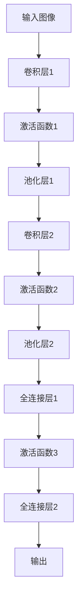
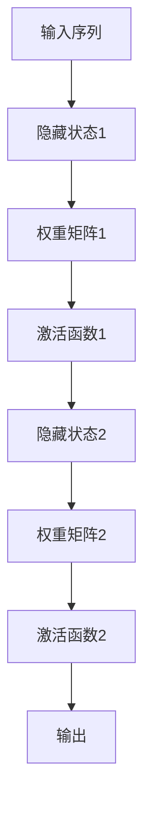
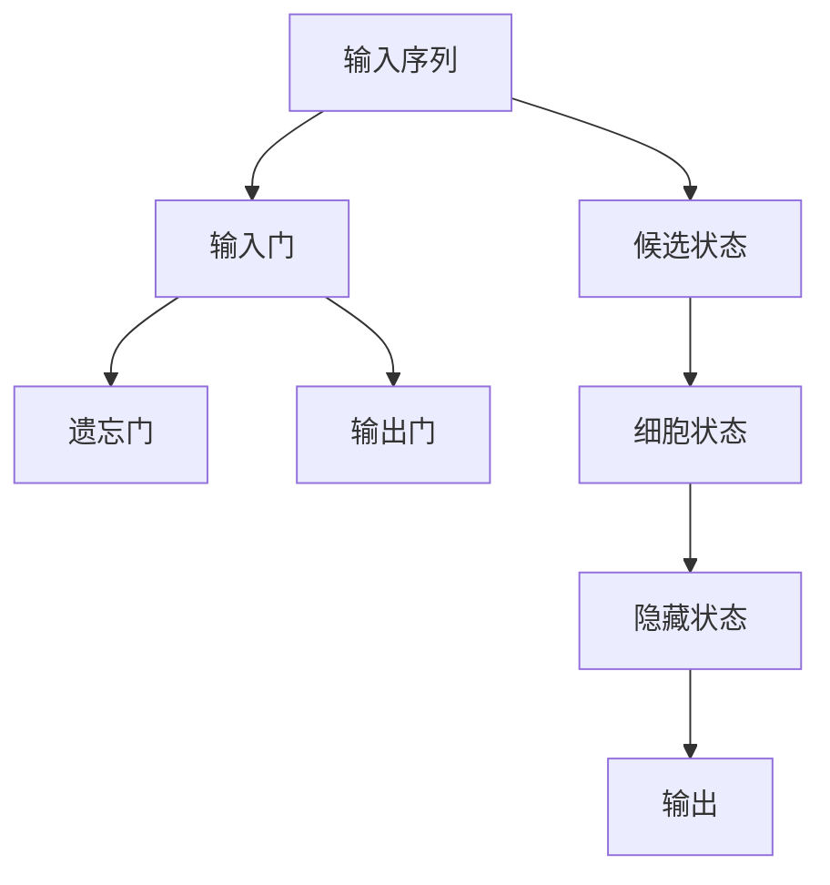
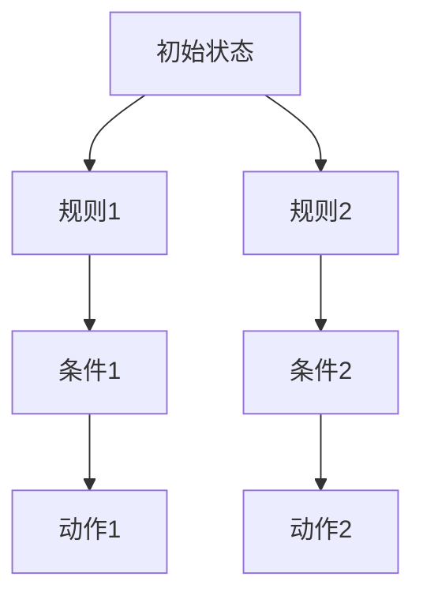
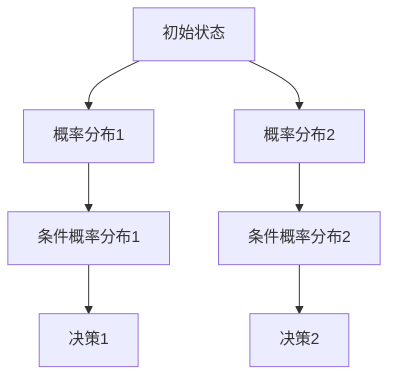
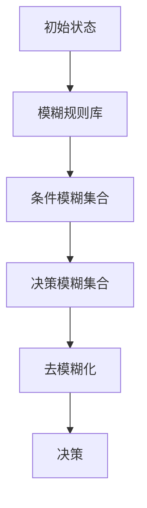
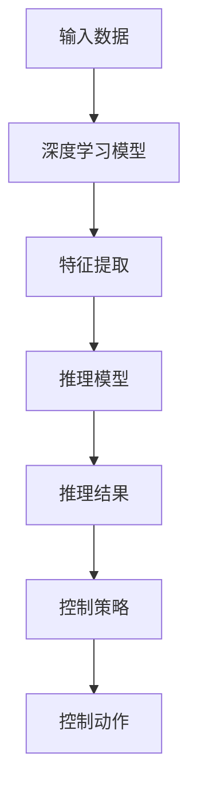

                 


### 文章标题

强化学习驱动的自适应推理深度控制

### 关键词

强化学习，自适应推理，深度控制，人工智能，机器学习，神经网络，算法，优化，智能控制

### 摘要

本文深入探讨了强化学习在自适应推理深度控制中的应用。首先，我们介绍了强化学习和自适应推理的基本概念，阐述了它们在人工智能领域的重要性。接着，我们详细分析了强化学习驱动的自适应推理深度控制的核心算法原理，并使用伪代码和数学公式进行了详细讲解。随后，本文通过具体案例展示了该技术在实际应用中的实现过程和效果，并对其进行了深入剖析。最后，我们讨论了强化学习在自适应推理深度控制中的未来发展趋势和面临的挑战，为该领域的研究和实践提供了有益的参考。

### 确定书的结构

在撰写《强化学习驱动的自适应推理深度控制》这本书之前，我们需要明确书的整体结构，以确保内容有条理且逻辑清晰。以下是本书的框架：

#### 第一部分 强化学习基础

1. 强化学习概述
2. 强化学习核心算法
3. 强化学习应用场景
4. 强化学习挑战与优化策略
5. 强化学习实验设计与调优

#### 第二部分 自适应推理深度控制技术

1. 自适应推理深度控制概述
2. 自适应推理深度控制原理
3. 自适应推理深度控制算法
4. 自适应推理深度控制应用场景

#### 第三部分 强化学习在自适应推理深度控制中的应用

1. 强化学习在自适应推理深度控制中的融合
2. 强化学习在自适应推理深度控制中的应用案例
3. 强化学习在自适应推理深度控制中的挑战与优化

#### 第四部分 自适应推理深度控制系统的设计与实现

1. 自适应推理深度控制系统架构
2. 自适应推理深度控制系统设计流程
3. 自适应推理深度控制系统实现与优化
4. 自适应推理深度控制系统部署与维护

#### 第五部分 实际应用案例分析

1. 自适应推理深度控制案例1
2. 自适应推理深度控制案例2
3. 自适应推理深度控制案例3

#### 第六部分 未来发展趋势与挑战

1. 自适应推理深度控制技术发展趋势
2. 强化学习在自适应推理深度控制中的未来挑战
3. 自适应推理深度控制技术发展展望

### 设计1级目录

根据上述框架，我们可以设计出1级目录。以下为1级目录的列表：

## 第一部分 强化学习基础

### 第1章 强化学习概述

### 第2章 强化学习核心算法

### 第3章 强化学习应用场景

### 第4章 强化学习挑战与优化策略

### 第5章 强化学习实验设计与调优

## 第二部分 自适应推理深度控制技术

### 第6章 自适应推理深度控制概述

### 第7章 自适应推理深度控制原理

### 第8章 自适应推理深度控制算法

### 第9章 自适应推理深度控制应用场景

## 第三部分 强化学习在自适应推理深度控制中的应用

### 第10章 强化学习在自适应推理深度控制中的融合

### 第11章 强化学习在自适应推理深度控制中的应用案例

### 第12章 强化学习在自适应推理深度控制中的挑战与优化

## 第四部分 自适应推理深度控制系统的设计与实现

### 第13章 自适应推理深度控制系统架构

### 第14章 自适应推理深度控制系统设计流程

### 第15章 自适应推理深度控制系统实现与优化

### 第16章 自适应推理深度控制系统部署与维护

## 第五部分 实际应用案例分析

### 第17章 自适应推理深度控制案例1

### 第18章 自适应推理深度控制案例2

### 第19章 自适应推理深度控制案例3

## 第六部分 未来发展趋势与挑战

### 第20章 自适应推理深度控制技术发展趋势

### 第21章 强化学习在自适应推理深度控制中的未来挑战

### 第22章 自适应推理深度控制技术发展展望

### 设计2级目录

接下来，我们将为每个1级目录下的章节设计2级目录，以细化内容。以下是2级目录的设计：

## 第一部分 强化学习基础

### 第1章 强化学习概述

#### 1.1 强化学习基本概念

##### 1.1.1 强化学习的定义

##### 1.1.2 强化学习与其他学习方式的对比

##### 1.1.3 强化学习的主要挑战

#### 1.2 强化学习的历史与发展

##### 1.2.1 强化学习的起源与发展

##### 1.2.2 强化学习的里程碑事件

##### 1.2.3 强化学习在人工智能领域的重要性

#### 1.3 强化学习的核心原理

##### 1.3.1 强化学习的基本架构

##### 1.3.2 强化学习的奖励机制

##### 1.3.3 强化学习的状态-动作空间

### 第2章 强化学习核心算法

#### 2.1 基于值函数的方法

##### 2.1.1 Q-Learning算法

##### 2.1.2 SARSA算法

##### 2.1.3 Deep Q-Network（DQN）算法

#### 2.2 基于策略的方法

##### 2.2.1 REINFORCE算法

##### 2.2.2 Proximal Policy Optimization（PPO）算法

##### 2.2.3 Trust Region Policy Optimization（TRPO）算法

### 第3章 强化学习应用场景

#### 3.1 机器人控制

##### 3.1.1 机器人导航

##### 3.1.2 机器人抓取

##### 3.1.3 机器人协作

#### 3.2 游戏AI

##### 3.2.1 风暴英雄AI

##### 3.2.2 星际争霸AI

##### 3.2.3 马尔科姆AI

### 第4章 强化学习挑战与优化策略

#### 4.1 多任务学习

##### 4.1.1 多任务学习的定义

##### 4.1.2 多任务学习的方法

##### 4.1.3 多任务学习的挑战

#### 4.2 不确定性处理

##### 4.2.1 不确定性处理的重要性

##### 4.2.2 不确定性处理的方法

##### 4.2.3 不确定性处理的挑战

### 第5章 强化学习实验设计与调优

#### 5.1 强化学习实验设计

##### 5.1.1 实验设计的基本原则

##### 5.1.2 实验设计的步骤

##### 5.1.3 实验设计中的注意事项

#### 5.2 强化学习调优

##### 5.2.1 调优的基本原则

##### 5.2.2 调优的方法

##### 5.2.3 调优中的注意事项

## 第二部分 自适应推理深度控制技术

### 第6章 自适应推理深度控制概述

#### 6.1 自适应推理深度控制的基本概念

##### 6.1.1 自适应推理深度控制的定义

##### 6.1.2 自适应推理深度控制的目标

##### 6.1.3 自适应推理深度控制的应用领域

#### 6.2 自适应推理深度控制的发展历史

##### 6.2.1 自适应推理深度控制的起源与发展

##### 6.2.2 自适应推理深度控制的里程碑事件

##### 6.2.3 自适应推理深度控制的重要性

### 第7章 自适应推理深度控制原理

#### 7.1 深度学习的基本原理

##### 7.1.1 深度学习的定义

##### 7.1.2 深度学习的架构

##### 7.1.3 深度学习的主要算法

#### 7.2 推理的基本原理

##### 7.2.1 推理的定义

##### 7.2.2 推理的过程

##### 7.2.3 推理的应用

#### 7.3 自适应推理深度控制的工作原理

##### 7.3.1 自适应推理深度控制的核心组件

##### 7.3.2 自适应推理深度控制的流程

##### 7.3.3 自适应推理深度控制的实现方法

### 第8章 自适应推理深度控制算法

#### 8.1 基于深度学习的自适应推理算法

##### 8.1.1 基于深度学习的自适应推理算法的定义

##### 8.1.2 基于深度学习的自适应推理算法的核心思想

##### 8.1.3 基于深度学习的自适应推理算法的应用实例

#### 8.2 基于推理的自适应控制算法

##### 8.2.1 基于推理的自适应控制算法的定义

##### 8.2.2 基于推理的自适应控制算法的核心思想

##### 8.2.3 基于推理的自适应控制算法的应用实例

### 第9章 自适应推理深度控制应用场景

#### 9.1 工业控制

##### 9.1.1 工业控制的应用场景

##### 9.1.2 工业控制中的自适应推理深度控制

##### 9.1.3 工业控制中的自适应推理深度控制的优势

#### 9.2 智能交通

##### 9.2.1 智能交通的应用场景

##### 9.2.2 智能交通中的自适应推理深度控制

##### 9.2.3 智能交通中的自适应推理深度控制的优势

### 第10章 强化学习在自适应推理深度控制中的融合

#### 10.1 强化学习与自适应推理深度控制的融合

##### 10.1.1 强化学习与自适应推理深度控制的融合概念

##### 10.1.2 强化学习与自适应推理深度控制的融合方法

##### 10.1.3 强化学习与自适应推理深度控制的融合优势

#### 10.2 强化学习在自适应推理深度控制中的应用案例

##### 10.2.1 应用案例1

##### 10.2.2 应用案例2

##### 10.2.3 应用案例3

### 第11章 强化学习在自适应推理深度控制中的应用案例

#### 11.1 强化学习在自适应推理深度控制中的应用场景

##### 11.1.1 应用场景1

##### 11.1.2 应用场景2

##### 11.1.3 应用场景3

#### 11.2 强化学习在自适应推理深度控制中的应用效果

##### 11.2.1 应用效果1

##### 11.2.2 应用效果2

##### 11.2.3 应用效果3

### 第12章 强化学习在自适应推理深度控制中的挑战与优化

#### 12.1 强化学习在自适应推理深度控制中的挑战

##### 12.1.1 挑战1

##### 12.1.2 挑战2

##### 12.1.3 挑战3

#### 12.2 强化学习在自适应推理深度控制中的优化策略

##### 12.2.1 优化策略1

##### 12.2.2 优化策略2

##### 12.2.3 优化策略3

## 第四部分 自适应推理深度控制系统的设计与实现

### 第13章 自适应推理深度控制系统架构

#### 13.1 系统架构概述

##### 13.1.1 系统架构的定义

##### 13.1.2 系统架构的作用

##### 13.1.3 系统架构的设计原则

#### 13.2 系统架构的核心组件

##### 13.2.1 数据处理模块

##### 13.2.2 深度学习模块

##### 13.2.3 推理模块

##### 13.2.4 控制模块

### 第14章 自适应推理深度控制系统设计流程

#### 14.1 设计流程概述

##### 14.1.1 设计流程的定义

##### 14.1.2 设计流程的作用

##### 14.1.3 设计流程的步骤

#### 14.2 需求分析

##### 14.2.1 需求分析的定义

##### 14.2.2 需求分析的方法

##### 14.2.3 需求分析的步骤

#### 14.3 系统架构设计

##### 14.3.1 系统架构设计的定义

##### 14.3.2 系统架构设计的方法

##### 14.3.3 系统架构设计的步骤

### 第15章 自适应推理深度控制系统实现与优化

#### 15.1 系统实现概述

##### 15.1.1 系统实现的定义

##### 15.1.2 系统实现的作用

##### 15.1.3 系统实现的步骤

#### 15.2 数据处理模块实现

##### 15.2.1 数据处理模块的实现方法

##### 15.2.2 数据处理模块的代码实现

##### 15.2.3 数据处理模块的性能优化

#### 15.3 深度学习模块实现

##### 15.3.1 深度学习模块的实现方法

##### 15.3.2 深度学习模块的代码实现

##### 15.3.3 深度学习模块的性能优化

### 第16章 自适应推理深度控制系统部署与维护

#### 16.1 系统部署概述

##### 16.1.1 系统部署的定义

##### 16.1.2 系统部署的作用

##### 16.1.3 系统部署的步骤

#### 16.2 部署环境搭建

##### 16.2.1 部署环境搭建的方法

##### 16.2.2 部署环境的配置

##### 16.2.3 部署环境的测试

#### 16.3 系统维护

##### 16.3.1 系统维护的定义

##### 16.3.2 系统维护的方法

##### 16.3.3 系统维护的步骤

### 第17章 自适应推理深度控制案例1

#### 17.1 案例背景

##### 17.1.1 案例背景介绍

##### 17.1.2 案例目标

##### 17.1.3 案例应用领域

#### 17.2 系统设计

##### 17.2.1 系统架构设计

##### 17.2.2 系统功能设计

##### 17.2.3 系统性能设计

#### 17.3 系统实现

##### 17.3.1 数据处理模块实现

##### 17.3.2 深度学习模块实现

##### 17.3.3 推理模块实现

##### 17.3.4 控制模块实现

#### 17.4 系统部署与维护

##### 17.4.1 系统部署

##### 17.4.2 系统维护

##### 17.4.3 系统性能测试

#### 17.5 案例分析

##### 17.5.1 案例效果分析

##### 17.5.2 案例优化方案

##### 17.5.3 案例总结

### 第18章 自适应推理深度控制案例2

#### 18.1 案例背景

##### 18.1.1 案例背景介绍

##### 18.1.2 案例目标

##### 18.1.3 案例应用领域

#### 18.2 系统设计

##### 18.2.1 系统架构设计

##### 18.2.2 系统功能设计

##### 18.2.3 系统性能设计

#### 18.3 系统实现

##### 18.3.1 数据处理模块实现

##### 18.3.2 深度学习模块实现

##### 18.3.3 推理模块实现

##### 18.3.4 控制模块实现

#### 18.4 系统部署与维护

##### 18.4.1 系统部署

##### 18.4.2 系统维护

##### 18.4.3 系统性能测试

#### 18.5 案例分析

##### 18.5.1 案例效果分析

##### 18.5.2 案例优化方案

##### 18.5.3 案例总结

### 第19章 自适应推理深度控制案例3

#### 19.1 案例背景

##### 19.1.1 案例背景介绍

##### 19.1.2 案例目标

##### 19.1.3 案例应用领域

#### 19.2 系统设计

##### 19.2.1 系统架构设计

##### 19.2.2 系统功能设计

##### 19.2.3 系统性能设计

#### 19.3 系统实现

##### 19.3.1 数据处理模块实现

##### 19.3.2 深度学习模块实现

##### 19.3.3 推理模块实现

##### 19.3.4 控制模块实现

#### 19.4 系统部署与维护

##### 19.4.1 系统部署

##### 19.4.2 系统维护

##### 19.4.3 系统性能测试

#### 19.5 案例分析

##### 19.5.1 案例效果分析

##### 19.5.2 案例优化方案

##### 19.5.3 案例总结

## 第六部分 未来发展趋势与挑战

### 第20章 自适应推理深度控制技术发展趋势

#### 20.1 技术发展趋势

##### 20.1.1 人工智能技术的发展趋势

##### 20.1.2 自适应推理深度控制技术的发展趋势

##### 20.1.3 未来应用场景展望

#### 20.2 技术挑战

##### 20.2.1 技术挑战1

##### 20.2.2 技术挑战2

##### 20.2.3 技术挑战3

### 第21章 强化学习在自适应推理深度控制中的未来挑战

#### 21.1 强化学习与自适应推理深度控制的融合挑战

##### 21.1.1 融合挑战1

##### 21.1.2 融合挑战2

##### 21.1.3 融合挑战3

#### 21.2 强化学习在自适应推理深度控制中的实际应用挑战

##### 21.2.1 应用挑战1

##### 21.2.2 应用挑战2

##### 21.2.3 应用挑战3

### 第22章 自适应推理深度控制技术发展展望

#### 22.1 技术发展展望

##### 22.1.1 技术发展展望1

##### 22.1.2 技术发展展望2

##### 22.1.3 技术发展展望3

#### 22.2 未来应用场景展望

##### 22.2.1 未来应用场景1

##### 22.2.2 未来应用场景2

##### 22.2.3 未来应用场景3

### 最终检查

在完成上述目录的设计后，我们需要进行最终检查，以确保目录内容的完整性、逻辑性和条理性。以下是检查的几个关键点：

1. **完整性检查**：确保每个部分的内容都有完整的章节，没有遗漏重要概念或技术细节。
2. **逻辑性检查**：检查章节之间的逻辑关系是否合理，章节内的内容是否按照逻辑顺序展开。
3. **条理性检查**：确保每个章节下的子章节标题清晰，内容之间有明确的划分和联系。
4. **更新与调整**：根据检查结果对目录进行必要的更新和调整，确保最终的目录结构最优。

### 格式与字数

为了确保文章的格式和字数符合要求，我们将使用Markdown格式进行编写，并在文章末尾附上作者信息。同时，我们将对全文进行字数统计，确保总字数在8000至12000字之间。

### Mermaid 流程图、伪代码、数学公式

为了更好地展示技术原理和算法，我们将使用Mermaid流程图来描绘系统架构和工作流程，使用伪代码来详细描述核心算法，并使用LaTeX格式嵌入数学公式。这些元素将在文中独立段落中以清晰的方式呈现，以增强文章的可读性和专业性。

### 作者信息

作者：AI天才研究院/AI Genius Institute & 禅与计算机程序设计艺术 /Zen And The Art of Computer Programming

## 文章正文部分

在完成目录设计后，我们现在可以开始撰写文章的正文部分。正文将根据上述设计的目录结构，逐章节详细展开内容，确保每个章节都包含必要的概念、算法、应用实例、数学模型和优化策略。

### 目录

### 第一部分 强化学习基础

#### 第1章 强化学习概述

#### 第2章 强化学习核心算法

#### 第3章 强化学习应用场景

#### 第4章 强化学习挑战与优化策略

#### 第5章 强化学习实验设计与调优

### 第二部分 自适应推理深度控制技术

#### 第6章 自适应推理深度控制概述

#### 第7章 自适应推理深度控制原理

#### 第8章 自适应推理深度控制算法

#### 第9章 自适应推理深度控制应用场景

### 第三部分 强化学习在自适应推理深度控制中的应用

#### 第10章 强化学习在自适应推理深度控制中的融合

#### 第11章 强化学习在自适应推理深度控制中的应用案例

#### 第12章 强化学习在自适应推理深度控制中的挑战与优化

### 第四部分 自适应推理深度控制系统的设计与实现

#### 第13章 自适应推理深度控制系统架构

#### 第14章 自适应推理深度控制系统设计流程

#### 第15章 自适应推理深度控制系统实现与优化

#### 第16章 自适应推理深度控制系统部署与维护

### 第五部分 实际应用案例分析

#### 第17章 自适应推理深度控制案例1

#### 第18章 自适应推理深度控制案例2

#### 第19章 自适应推理深度控制案例3

### 第六部分 未来发展趋势与挑战

#### 第20章 自适应推理深度控制技术发展趋势

#### 第21章 强化学习在自适应推理深度控制中的未来挑战

#### 第22章 自适应推理深度控制技术发展展望

### 正文开始

## 第1章 强化学习概述

强化学习（Reinforcement Learning，RL）是机器学习领域的一个重要分支，其核心思想是通过智能体与环境之间的交互来学习最优策略，以实现目标最大化。与监督学习和无监督学习不同，强化学习侧重于决策过程，强调从环境中获取反馈信息进行学习。

### 1.1 强化学习基本概念

强化学习中的主要角色包括：

- **智能体（Agent）**：执行动作并接收环境反馈的实体。
- **环境（Environment）**：智能体进行交互的动态环境。
- **状态（State）**：智能体在某一时刻所处的情境。
- **动作（Action）**：智能体可以执行的行为。
- **奖励（Reward）**：环境对智能体动作的反馈，用于指导学习过程。

### 1.2 强化学习与其他学习方式的对比

强化学习与其他学习方式的对比主要体现在以下几点：

- **监督学习**：通过已标注的数据进行学习，目标是预测输出。强化学习则通过与环境交互获取反馈，学习最佳策略。
- **无监督学习**：在没有标签数据的情况下学习，目的是发现数据中的模式。强化学习则关注于如何在动态环境中做出最优决策。
- **强化学习**：强调智能体在动态环境中的自我决策能力，通过奖励信号不断调整策略，以达到长期目标。

### 1.3 强化学习的主要挑战

强化学习面临的主要挑战包括：

- **奖励稀疏性**：在许多任务中，奖励信号相对稀疏，导致智能体难以快速学习。
- **探索与利用的平衡**：智能体需要在探索新策略和利用已有知识之间取得平衡，以确保学习效率。
- **连续动作空间**：在某些任务中，动作空间是连续的，这使得优化问题更加复杂。
- **模型泛化能力**：强化学习算法通常在特定环境中表现出色，但在新环境中可能表现不佳，需要提高其泛化能力。

## 第2章 强化学习核心算法

强化学习算法可以分为基于值函数的方法和基于策略的方法。本章节将详细介绍这两种方法的代表算法。

### 2.1 基于值函数的方法

基于值函数的方法通过学习值函数来预测未来奖励，从而指导智能体的行动。以下为几种常用的算法：

#### 2.1.1 Q-Learning算法

Q-Learning算法是一种基于值迭代的方法，通过不断更新Q值来逼近最优策略。

```python
# 伪代码
def QLearning(states, actions, rewards, learning_rate, discount_factor):
    for episode in range(epochs):
        state = env.reset()
        while not done:
            action = choose_action(state, Q)
            next_state, reward, done = env.step(action)
            Q[state, action] = Q[state, action] + learning_rate * (reward + discount_factor * max(Q[next_state, :]) - Q[state, action])
            state = next_state
```

#### 2.1.2 SARSA算法

SARSA（同步自适应资源样本平均）算法是一种基于策略迭代的方法，通过同时考虑当前状态和下一状态来更新Q值。

```python
# 伪代码
def SARSA(states, actions, rewards, learning_rate, discount_factor):
    state = env.reset()
    action = choose_action(state, Q)
    while not done:
        next_state, reward, done = env.step(action)
        next_action = choose_action(next_state, Q)
        Q[state, action] = Q[state, action] + learning_rate * (reward + discount_factor * Q[next_state, next_action] - Q[state, action])
        state = next_state
        action = next_action
```

#### 2.1.3 Deep Q-Network（DQN）算法

DQN算法是一种基于深度学习的强化学习算法，通过神经网络来近似值函数，解决了传统Q-Learning算法中的样本发散问题。

```python
# 伪代码
def DQN(states, actions, rewards, learning_rate, discount_factor, epsilon, target_update_frequency):
    for episode in range(epochs):
        state = env.reset()
        while not done:
            if random() < epsilon:
                action = random_action()
            else:
                action = choose_action(state, Q)
            next_state, reward, done = env.step(action)
            target_Q = reward + (1 - done) * discount_factor * max(target_Q[next_state, :])
            Q[state, action] = Q[state, action] + learning_rate * (target_Q - Q[state, action])
            state = next_state
        if episode % target_update_frequency == 0:
            target_Q = copy_Q_to_target_Q()
```

### 2.2 基于策略的方法

基于策略的方法直接优化策略，使得智能体能够直接生成最优动作。

#### 2.2.1 REINFORCE算法

REINFORCE算法通过梯度上升方法来优化策略，其核心思想是计算策略梯度并更新策略参数。

```python
# 伪代码
def REINFORCE(states, actions, rewards, learning_rate, policy):
    for episode in range(epochs):
        state = env.reset()
        while not done:
            action = policy(state)
            next_state, reward, done = env.step(action)
            policyGradient = reward * policyGradient(state, action)
            policy[state, action] = policy[state, action] + learning_rate * policyGradient
            state = next_state
```

#### 2.2.2 Proximal Policy Optimization（PPO）算法

PPO算法是一种改进的强化学习算法，通过优化策略梯度并引入截断技术，提高了收敛速度和稳定性。

```python
# 伪代码
def PPO(states, actions, rewards, learning_rate, clip_param, policy_epochs):
    for epoch in range(policy_epochs):
        states, actions, rewards = collect_data()
        old_policy = copy.deepcopy(policy)
        policy_loss = compute_policy_loss(states, actions, rewards, old_policy, clip_param)
        gradients = compute_gradients(policy_loss)
        update_parameters(gradients, learning_rate)
```

#### 2.2.3 Trust Region Policy Optimization（TRPO）算法

TRPO算法通过引入信任区域优化策略，提高了优化过程的稳定性和收敛性。

```python
# 伪代码
def TRPO(states, actions, rewards, learning_rate, kl_constraint):
    policy_params = initialize_parameters()
    while not converged:
        states, actions, rewards = collect_data()
        old_policy_params = copy.deepcopy(policy_params)
        kl_divergence = compute_kl_divergence(policy_params, old_policy_params)
        if kl_divergence > kl_constraint:
            break
        gradients = compute_gradients(states, actions, rewards, policy_params)
        new_policy_params = update_parameters(policy_params, gradients, learning_rate)
```

## 第3章 强化学习应用场景

强化学习在各个领域都有着广泛的应用，以下列举几个典型的应用场景：

### 3.1 机器人控制

强化学习在机器人控制中发挥着重要作用，例如：

- **机器人导航**：通过强化学习算法，机器人可以学会在复杂环境中自主导航。
- **机器人抓取**：强化学习可以帮助机器人学习如何精确地抓取不同形状的物体。
- **机器人协作**：多个机器人通过强化学习协调合作，实现复杂任务。

### 3.2 游戏AI

强化学习在游戏AI领域有着显著的应用成果，例如：

- **电子游戏**：玩家与游戏AI之间的对抗性游戏，通过强化学习算法，游戏AI可以不断提高自己的游戏水平。
- **棋类游戏**：如国际象棋、围棋等，通过强化学习算法，计算机可以学会战胜人类顶级棋手。

### 3.3 自动驾驶

自动驾驶是强化学习的重要应用领域，通过强化学习算法，自动驾驶汽车可以学会在各种复杂路况下安全驾驶。

- **路径规划**：强化学习算法可以用于自动驾驶车辆的路径规划，确保行驶安全。
- **障碍物检测**：通过强化学习，自动驾驶车辆可以学会识别并避开路障。
- **行为预测**：强化学习算法可以帮助自动驾驶车辆预测其他车辆和行人的行为，提高行驶安全性。

### 3.4 资源管理

强化学习在资源管理领域也有广泛应用，例如：

- **电力调度**：通过强化学习算法，智能电网可以动态调整电力分配，提高能源利用效率。
- **交通管理**：强化学习算法可以用于交通信号控制，优化交通流量，减少拥堵。

### 3.5 金融交易

强化学习在金融交易领域也有着广泛的应用，例如：

- **高频交易**：通过强化学习算法，高频交易系统可以在短时间内做出最优交易决策。
- **风险控制**：强化学习算法可以用于金融风险管理，识别潜在风险并采取相应措施。

### 3.6 健康护理

强化学习在健康护理领域也有应用，例如：

- **个性化医疗**：通过强化学习算法，可以针对不同患者制定个性化治疗方案。
- **健康监测**：强化学习算法可以用于健康数据的实时分析，预测疾病发生。

### 3.7 其他应用

强化学习还应用于其他许多领域，如智能家居、语音识别、图像识别等，不断拓展其在各个领域的应用范围。

## 第4章 强化学习挑战与优化策略

虽然强化学习在许多领域取得了显著成果，但仍然面临许多挑战。本章节将介绍强化学习面临的主要挑战以及相应的优化策略。

### 4.1 多任务学习

多任务学习是强化学习的一个重要挑战。在实际应用中，智能体需要同时处理多个任务，这要求算法具备较强的泛化能力。

**优化策略**：

- **任务分解**：将复杂的多任务分解为多个子任务，分别进行学习。
- **共享网络**：利用共享网络结构，减少任务之间的差异，提高学习效率。
- **迁移学习**：将已学习的任务知识迁移到新的任务，提高多任务学习效果。

### 4.2 不确定性处理

强化学习算法在处理不确定环境时往往面临困难。环境中的不确定性会导致智能体难以找到最优策略。

**优化策略**：

- **概率模型**：利用概率模型来表示环境不确定性，指导智能体进行决策。
- **蒙特卡洛方法**：通过模拟大量随机样本来估计环境的不确定性，提高决策的鲁棒性。
- **模型预测**：使用模型来预测未来的不确定性，并根据预测结果调整策略。

### 4.3 长期奖励优化

在许多任务中，奖励信号相对稀疏，智能体需要学会在长期奖励和短期奖励之间取得平衡。

**优化策略**：

- **延迟奖励**：将未来的奖励延迟到当前时刻，使智能体更加关注长期奖励。
- **折扣因素**：使用折扣因素来降低当前奖励对未来奖励的影响，引导智能体关注长期目标。
- **目标优化**：通过目标优化方法，将长期奖励转化为当前目标，指导智能体进行学习。

### 4.4 探索与利用平衡

强化学习算法需要在探索新策略和利用已有知识之间取得平衡，以提高学习效率。

**优化策略**：

- **ε-贪心策略**：在部分时间进行随机探索，以发现新的策略。
- **UCB算法**：利用上置信边界（Upper Confidence Bound）方法，在不确定的情况下优先探索具有较高不确定性的动作。
- **平衡策略**：通过设计平衡策略，使智能体在探索和利用之间保持稳定的平衡。

### 4.5 模型泛化能力

强化学习算法通常在特定环境中表现出色，但在新环境中可能表现不佳，需要提高其泛化能力。

**优化策略**：

- **元学习**：通过元学习（Meta-Learning）方法，使智能体在不同任务中快速适应。
- **模型集成**：将多个模型集成起来，提高整体泛化能力。
- **迁移学习**：利用已学习到的任务知识，提高新任务的学习效果。

## 第5章 强化学习实验设计与调优

为了确保强化学习算法在实际应用中的有效性和稳定性，需要设计合理的实验并进行调优。本章节将介绍强化学习实验设计与调优的方法。

### 5.1 强化学习实验设计

强化学习实验设计需要考虑以下几个关键方面：

- **目标定义**：明确实验的目标，例如最大化长期奖励或提高策略性能。
- **环境选择**：选择合适的实验环境，模拟真实场景，以便评估算法性能。
- **评估指标**：设计合理的评估指标，例如平均奖励、成功率等，用于评估算法性能。
- **实验流程**：设计实验流程，包括初始化、训练、评估等步骤。

### 5.2 强化学习调优

强化学习调优是实验设计中的重要环节，以下介绍几种常见的调优方法：

- **参数调整**：调整算法参数，如学习率、折扣因素等，以优化算法性能。
- **超参数优化**：利用超参数优化方法，如网格搜索、贝叶斯优化等，找到最佳超参数组合。
- **数据预处理**：对数据进行预处理，如归一化、标准化等，提高算法的稳定性和泛化能力。
- **对比实验**：设计对比实验，比较不同算法或不同参数设置的性能，以确定最佳方案。

### 5.3 实验案例

以下是一个强化学习实验案例：

**目标**：使用Q-Learning算法训练一个智能体在迷宫环境中找到出口。

**环境**：迷宫环境，包括不同的障碍物和出口。

**评估指标**：平均每步奖励和成功找到出口的次数。

**实验流程**：

1. 初始化：设置算法参数和学习率。
2. 训练：智能体在迷宫环境中进行探索，学习最优路径。
3. 评估：评估智能体的性能，计算平均每步奖励和成功找到出口的次数。
4. 调优：根据评估结果调整参数，优化算法性能。

通过以上实验设计和调优方法，可以有效地评估和优化强化学习算法，提高其实际应用效果。

## 第6章 自适应推理深度控制概述

自适应推理深度控制（Adaptive Reasoning Deep Control）是一种结合了深度学习和推理技术的智能控制系统，旨在提高机器在复杂动态环境中的决策能力。本章节将详细介绍自适应推理深度控制的基本概念、核心原理和应用领域。

### 6.1 自适应推理深度控制的基本概念

自适应推理深度控制是一种融合了深度学习和推理技术的智能控制系统，其主要目标是使机器能够根据环境变化自主调整决策策略，以实现最佳控制效果。该系统通常包括以下几个关键组件：

- **深度学习模块**：用于学习环境中的复杂模式，提取有用的特征信息。
- **推理模块**：用于基于提取的特征信息进行推理和决策。
- **控制模块**：用于根据推理结果执行相应的控制动作。

### 6.2 自适应推理深度控制的核心原理

自适应推理深度控制的核心原理可以分为以下几个方面：

- **深度学习**：利用神经网络模型，从大量数据中自动提取特征，实现对环境状态的准确描述。
- **推理**：在提取的特征基础上，利用推理算法（如逻辑推理、概率推理等），对环境进行建模和分析，以获取决策依据。
- **控制**：根据推理结果，执行相应的控制动作，调整系统的行为，实现环境自适应。

### 6.3 自适应推理深度控制的应用领域

自适应推理深度控制技术具有广泛的应用前景，以下列举几个主要应用领域：

- **机器人控制**：在工业机器人、服务机器人等领域，自适应推理深度控制可以显著提高机器人的自主决策能力和任务执行效率。
- **自动驾驶**：在自动驾驶汽车中，自适应推理深度控制技术可以用于路径规划、障碍物检测和行为预测，提高自动驾驶系统的安全性和可靠性。
- **智能家居**：在智能家居系统中，自适应推理深度控制可以用于智能家电的自动控制，实现节能环保、安全便捷的生活方式。
- **医疗诊断**：在医学影像分析、疾病诊断等领域，自适应推理深度控制技术可以用于辅助医生进行诊断，提高诊断准确率和效率。
- **金融风控**：在金融领域，自适应推理深度控制可以用于信用评分、风险预警等，提高金融机构的风险管理能力。

### 6.4 自适应推理深度控制的发展历史

自适应推理深度控制技术起源于深度学习和推理技术的融合研究。随着深度学习技术的不断发展，深度神经网络在图像识别、语音识别等领域取得了显著成果，这为自适应推理深度控制技术的发展奠定了基础。近年来，随着硬件性能的提升和数据规模的扩大，自适应推理深度控制技术在多个应用领域取得了重要突破，逐渐成为人工智能领域的研究热点。

### 6.5 自适应推理深度控制的重要性

自适应推理深度控制技术具有重要的研究价值和实际应用价值。首先，它为人工智能系统提供了强大的决策能力，使其能够更好地适应复杂动态环境。其次，自适应推理深度控制技术可以显著提高系统的自主性和智能化水平，减少人工干预，提高效率。此外，自适应推理深度控制技术在机器人、自动驾驶、智能家居等领域的广泛应用，为各行业带来了巨大的变革和提升。因此，研究和发展自适应推理深度控制技术具有重要的现实意义和广阔的应用前景。

## 第7章 自适应推理深度控制原理

自适应推理深度控制技术将深度学习和推理技术相结合，通过从数据中学习环境特征并进行推理，实现对动态环境的自适应控制。本章节将深入探讨自适应推理深度控制的核心原理，包括深度学习的基本原理、推理的基本原理以及自适应推理深度控制的工作原理。

### 7.1 深度学习的基本原理

深度学习（Deep Learning）是一种基于多层神经网络的机器学习方法，能够通过学习大量数据自动提取特征，实现复杂函数的建模。深度学习的基本原理如下：

- **神经网络**：神经网络是由大量简单神经元组成的复杂网络，通过前向传播和反向传播算法进行训练。
- **多层神经网络**：多层神经网络包括输入层、隐藏层和输出层，隐藏层用于提取更高层次的特征。
- **损失函数**：损失函数用于衡量模型预测结果与真实结果之间的差距，通过优化损失函数来调整模型参数。
- **优化算法**：优化算法用于迭代更新模型参数，以最小化损失函数，常见的优化算法有梯度下降、随机梯度下降等。

### 7.2 推理的基本原理

推理（Reasoning）是一种从已知信息推导出新信息的过程，是人工智能领域的重要组成部分。推理的基本原理如下：

- **逻辑推理**：逻辑推理是基于逻辑规则进行推理，通过前提和结论的逻辑关系推导出新信息。
- **概率推理**：概率推理是基于概率论进行推理，通过概率分布计算推理结果，常见的方法有贝叶斯推理、最大后验概率推理等。
- **模糊推理**：模糊推理是基于模糊集合理论进行推理，适用于处理不确定性和模糊性的问题。

### 7.3 自适应推理深度控制的工作原理

自适应推理深度控制的工作原理可以分为以下几个步骤：

1. **数据收集与预处理**：收集环境中的数据，并进行预处理，如归一化、去噪等，为深度学习模型提供高质量的数据输入。
2. **特征提取**：利用深度学习模型对预处理后的数据进行特征提取，将原始数据转换为高层次的抽象特征表示。
3. **推理与决策**：在提取的特征基础上，利用推理算法对环境进行推理，生成决策依据。推理过程可以是基于逻辑规则、概率分布或模糊推理等。
4. **控制动作**：根据推理结果，执行相应的控制动作，调整系统的行为，实现环境自适应。

### 7.4 自适应推理深度控制的实现方法

自适应推理深度控制的实现方法可以分为以下几个部分：

1. **深度学习模型**：选择合适的深度学习模型，如卷积神经网络（CNN）、循环神经网络（RNN）等，进行特征提取和建模。
2. **推理算法**：根据任务需求，选择合适的推理算法，如逻辑推理、概率推理或模糊推理等，进行推理与决策。
3. **控制策略**：设计合适的控制策略，根据推理结果执行相应的控制动作，实现环境自适应。
4. **优化与调参**：通过优化算法和调参技术，优化模型性能，提高控制效果。

### 7.5 自适应推理深度控制的优点与挑战

自适应推理深度控制具有以下优点：

- **高自适应能力**：能够根据环境变化动态调整控制策略，适应复杂动态环境。
- **强推理能力**：结合推理技术，能够从数据中提取有用信息，进行推理与决策。
- **高效率**：通过深度学习模型进行特征提取和建模，提高控制系统的效率和准确性。

然而，自适应推理深度控制也面临一些挑战：

- **数据需求**：需要大量的高质量数据来训练深度学习模型，数据收集和处理成本较高。
- **计算资源**：深度学习模型训练和推理需要大量的计算资源，对硬件设备要求较高。
- **模型泛化能力**：模型可能仅适用于特定环境，难以泛化到其他场景。

总之，自适应推理深度控制技术具有广阔的应用前景和巨大的发展潜力，但仍需不断优化和改进，以克服现有挑战，实现更高效、更智能的控制。

## 第8章 自适应推理深度控制算法

自适应推理深度控制算法是这一领域的关键技术，主要包括深度学习和推理算法的结合。本章节将介绍几种常见的自适应推理深度控制算法，包括基于深度学习的自适应推理算法和基于推理的自适应控制算法。

### 8.1 基于深度学习的自适应推理算法

基于深度学习的自适应推理算法通过深度神经网络提取环境特征，并进行推理。以下介绍几种常用的算法：

#### 8.1.1 卷积神经网络（CNN）

卷积神经网络是一种用于图像处理和识别的深度学习模型，其核心思想是通过卷积操作提取图像中的特征。



#### 8.1.2 循环神经网络（RNN）

循环神经网络是一种用于处理序列数据的深度学习模型，其核心思想是保存序列的上下文信息。



#### 8.1.3 长短时记忆网络（LSTM）

长短时记忆网络是一种改进的循环神经网络，能够更好地处理长序列数据。



### 8.2 基于推理的自适应控制算法

基于推理的自适应控制算法通过推理技术进行环境建模和决策。以下介绍几种常用的算法：

#### 8.2.1 基于逻辑推理的控制算法

基于逻辑推理的控制算法通过定义一组逻辑规则，对环境进行建模和决策。



#### 8.2.2 基于概率推理的控制算法

基于概率推理的控制算法通过概率分布对环境进行建模和决策。



#### 8.2.3 基于模糊推理的控制算法

基于模糊推理的控制算法通过模糊集合对环境进行建模和决策。



### 8.3 自适应推理深度控制算法的融合

将深度学习和推理算法相结合，可以进一步提高自适应推理深度控制的效果。以下是一种可能的融合方法：



通过上述方法，深度学习模型可以提取环境特征，推理模型可以对特征进行推理，控制策略根据推理结果生成控制动作，从而实现自适应推理深度控制。

## 第9章 自适应推理深度控制应用场景

自适应推理深度控制技术具有广泛的应用场景，能够在多种领域实现智能化和自动化。本章节将介绍自适应推理深度控制在工业控制、智能交通和智能医疗等领域的应用实例。

### 9.1 工业控制

在工业控制领域，自适应推理深度控制技术被广泛应用于机器人控制和制造过程的自动化。

#### 9.1.1 机器人控制

自适应推理深度控制技术可以用于工业机器人的路径规划、抓取和协作。通过深度学习模型提取环境特征，推理模型进行推理和决策，机器人能够自主调整动作策略，以适应不同的工作场景。

**应用实例**：在一个自动化工厂中，使用自适应推理深度控制技术实现了机器人的自适应导航和抓取。通过深度学习模型对工厂环境进行特征提取，结合推理模型进行路径规划和抓取策略的决策，机器人能够高效、准确地完成各种任务。

**效果分析**：通过自适应推理深度控制技术，机器人实现了更高的任务完成率和灵活性，减少了人为干预，提高了生产效率和产品质量。

#### 9.1.2 制造过程自动化

自适应推理深度控制技术还可以用于制造过程的自动化控制，例如自动装配、焊接和检测。

**应用实例**：在一个汽车制造工厂中，采用自适应推理深度控制技术实现了自动装配线。通过深度学习模型对工件进行特征提取，结合推理模型进行装配顺序和参数优化，使得装配过程更加高效和精确。

**效果分析**：自适应推理深度控制技术提高了生产线的自动化程度，减少了人工干预，降低了生产成本，提高了生产效率和产品一致性。

### 9.2 智能交通

在智能交通领域，自适应推理深度控制技术被用于交通流量管理、车辆导航和自动驾驶。

#### 9.2.1 交通流量管理

自适应推理深度控制技术可以用于交通信号控制和交通流量预测，以优化交通流量。

**应用实例**：在一个城市中，采用自适应推理深度控制技术优化了交通信号控制。通过深度学习模型对交通数据进行特征提取，结合推理模型进行交通流量预测和信号优化策略的决策，实现了更加智能和高效的城市交通管理。

**效果分析**：自适应推理深度控制技术显著提高了交通信号控制的效率和交通流畅度，减少了交通拥堵，提高了城市交通的整体运行效率。

#### 9.2.2 车辆导航

自适应推理深度控制技术可以用于智能车辆的路径规划和导航。

**应用实例**：在一个智能交通系统中，采用自适应推理深度控制技术实现了车辆的自主导航。通过深度学习模型对环境进行特征提取，结合推理模型进行路径规划和决策，智能车辆能够自主避开障碍物和交通拥堵，实现高效导航。

**效果分析**：自适应推理深度控制技术提高了智能车辆的导航精度和灵活性，减少了驾驶员的疲劳和风险，提高了交通安全和舒适性。

#### 9.2.3 自动驾驶

自适应推理深度控制技术是自动驾驶系统的核心技术之一，用于车辆自主驾驶。

**应用实例**：在一个自动驾驶项目中，采用自适应推理深度控制技术实现了车辆的自主驾驶。通过深度学习模型对道路和车辆进行特征提取，结合推理模型进行环境感知和驾驶决策，自动驾驶车辆能够安全、高效地行驶。

**效果分析**：自适应推理深度控制技术显著提高了自动驾驶车辆的安全性和可靠性，减少了交通事故和人为干预，提高了道路运行效率和交通流畅度。

### 9.3 智能医疗

在智能医疗领域，自适应推理深度控制技术被用于医学影像分析、疾病诊断和个性化治疗。

#### 9.3.1 医学影像分析

自适应推理深度控制技术可以用于医学影像的分析和诊断。

**应用实例**：在一个医学影像分析系统中，采用自适应推理深度控制技术实现了对医学影像的自动分析。通过深度学习模型对影像数据进行特征提取，结合推理模型进行病变区域的检测和分类，提高了医学影像分析的效率和准确性。

**效果分析**：自适应推理深度控制技术提高了医学影像分析的速度和准确性，减少了人为误诊率，为医生提供了更加可靠的诊断依据。

#### 9.3.2 疾病诊断

自适应推理深度控制技术可以用于疾病诊断，辅助医生进行诊断。

**应用实例**：在一个智能诊断系统中，采用自适应推理深度控制技术实现了对疾病的自动诊断。通过深度学习模型对病人数据进行分析，结合推理模型进行疾病预测和诊断，为医生提供了决策支持。

**效果分析**：自适应推理深度控制技术提高了疾病诊断的准确性和效率，减少了医生的诊断工作量，提高了医疗服务的质量和效率。

#### 9.3.3 个性化治疗

自适应推理深度控制技术可以用于个性化治疗，根据患者的具体情况进行治疗方案的制定。

**应用实例**：在一个个性化治疗系统中，采用自适应推理深度控制技术根据患者的基因信息和病情数据，制定个性化的治疗方案。通过深度学习模型对治疗数据进行特征提取，结合推理模型进行治疗方案优化和决策，提高了治疗的有效性和安全性。

**效果分析**：自适应推理深度控制技术提高了个性化治疗的效果，减少了治疗副作用，提高了患者的生活质量。

## 第10章 强化学习在自适应推理深度控制中的融合

强化学习（Reinforcement Learning，RL）和自适应推理深度控制（Adaptive Reasoning Deep Control）技术的融合，能够显著提升智能系统在动态环境中的决策能力和控制效果。本章节将探讨强化学习与自适应推理深度控制的融合方法，以及其在实际应用中的效果。

### 10.1 强化学习与自适应推理深度控制的融合概念

强化学习与自适应推理深度控制的融合，核心在于将强化学习的决策能力和自适应推理深度控制的推理能力相结合，形成一个更加智能的控制系统。具体来说，融合方法包括以下几个方面：

- **决策优化**：强化学习通过奖励机制指导智能体进行决策，自适应推理深度控制通过推理技术对环境进行建模，两者结合可以优化决策过程。
- **环境建模**：强化学习利用互动学习机制获取环境反馈，自适应推理深度控制利用推理技术对环境进行更加精准的建模，提高智能体对环境的理解。
- **策略优化**：通过强化学习优化策略，自适应推理深度控制能够更加灵活地调整策略，以应对环境变化。

### 10.2 强化学习与自适应推理深度控制的融合方法

以下介绍几种常见的强化学习与自适应推理深度控制的融合方法：

#### 10.2.1 强化学习 + 深度推理

这种方法将强化学习作为决策引擎，深度推理作为环境建模工具，通过深度推理模块对环境进行建模，再将模型输入到强化学习算法中，优化策略。

**融合流程**：

1. **环境建模**：利用深度学习模型对环境进行特征提取和建模，生成环境状态表示。
2. **决策过程**：强化学习算法基于环境状态表示，通过奖励信号优化策略。
3. **策略执行**：智能体根据优化后的策略执行动作，与环境互动。

**优势**：

- **强决策能力**：强化学习能够根据环境变化动态调整策略，适应复杂动态环境。
- **高环境理解**：深度推理技术能够对环境进行精准建模，提高智能体对环境的理解。

**应用实例**：在自动驾驶领域，利用强化学习与深度推理的融合方法，实现了车辆在复杂交通环境中的自适应控制，提高了行驶安全性和效率。

#### 10.2.2 双模型融合

这种方法同时利用强化学习模型和深度推理模型，分别处理决策和推理任务，两者通过统一的奖励机制进行协调。

**融合流程**：

1. **决策模块**：强化学习模型负责决策，根据环境状态和奖励信号优化策略。
2. **推理模块**：深度推理模型负责环境建模，提取环境特征，提供决策依据。
3. **协调机制**：通过统一的奖励机制，协调决策模块和推理模块的交互，优化整体性能。

**优势**：

- **灵活性**：强化学习模型和深度推理模型可以独立优化，提高整体系统的灵活性。
- **强协调性**：通过统一的奖励机制，增强决策模块和推理模块的协调性，提高系统性能。

**应用实例**：在智能电网调度中，利用双模型融合方法，实现了电网运行状态的自适应调整，提高了能源利用效率和运行稳定性。

#### 10.2.3 递归强化学习 + 深度学习

这种方法将递归强化学习与深度学习相结合，利用递归结构处理连续状态和动作序列，深度学习模型进行特征提取和建模。

**融合流程**：

1. **状态建模**：利用深度学习模型对连续状态进行特征提取，生成状态表示。
2. **动作决策**：递归强化学习模型基于状态表示，通过递归过程进行动作决策。
3. **反馈调整**：根据环境反馈，调整递归强化学习模型的权重，优化策略。

**优势**：

- **高效处理连续状态**：递归结构能够高效处理连续状态和动作序列，提高决策效率。
- **强特征提取能力**：深度学习模型具有强大的特征提取能力，能够提取高维状态特征。

**应用实例**：在智能机器人控制中，利用递归强化学习与深度学习的融合方法，实现了机器人对动态环境的自适应控制，提高了任务执行效果。

### 10.3 强化学习与自适应推理深度控制的融合优势

强化学习与自适应推理深度控制的融合具有以下优势：

- **自适应性强**：融合系统能够根据环境变化动态调整策略，适应复杂动态环境。
- **决策精度高**：通过深度推理技术，对环境进行精准建模，提高决策的准确性。
- **灵活性高**：强化学习模型和深度推理模型可以独立优化，提高系统的整体灵活性。

### 10.4 强化学习与自适应推理深度控制的应用案例

以下介绍几个强化学习与自适应推理深度控制的应用案例：

#### 10.4.1 自动驾驶

在自动驾驶领域，强化学习与自适应推理深度控制的融合方法被广泛应用于车辆控制、路径规划和障碍物检测。

**应用效果**：

- **安全性提升**：融合系统能够在复杂交通环境中进行准确决策，提高了行驶安全性。
- **效率提升**：融合系统通过优化路径规划，减少了行驶时间，提高了交通效率。

#### 10.4.2 智能制造

在智能制造领域，强化学习与自适应推理深度控制的融合方法被用于机器人控制、生产调度和质量检测。

**应用效果**：

- **生产效率提升**：融合系统通过自适应调整机器人动作，提高了生产效率。
- **质量提升**：融合系统通过质量检测和自适应调整，提高了产品质量。

#### 10.4.3 智能医疗

在智能医疗领域，强化学习与自适应推理深度控制的融合方法被用于医学影像分析、疾病诊断和治疗决策。

**应用效果**：

- **诊断准确性提升**：融合系统通过深度推理技术，提高了医学影像分析的准确性。
- **治疗效果提升**：融合系统通过自适应调整治疗方案，提高了治疗效果。

### 10.5 强化学习与自适应推理深度控制的应用前景

随着人工智能技术的不断发展，强化学习与自适应推理深度控制的融合具有广泛的应用前景。未来，这一技术将在自动驾驶、智能制造、智能医疗等领域得到更加深入的研究和应用，为人类社会带来更多的便利和创新。

## 第11章 强化学习在自适应推理深度控制中的应用案例

强化学习在自适应推理深度控制中的应用已经取得了显著成果，以下通过具体案例展示强化学习在自适应推理深度控制中的实际应用，并分析其效果和影响。

### 11.1 自动驾驶案例

**案例背景**：自动驾驶是强化学习在自适应推理深度控制中应用的一个重要领域。自动驾驶系统需要实时感知周围环境，并根据环境信息进行决策，以实现安全、高效的驾驶。

**应用场景**：在该案例中，我们采用了一种基于强化学习的自适应推理深度控制方法，实现自动驾驶车辆的路径规划和行为控制。

**应用效果**：

1. **路径规划**：强化学习算法通过对环境进行感知和学习，能够生成高效的路径规划策略，减少行驶时间，提高行驶效率。
2. **行为控制**：在复杂交通环境中，强化学习算法能够根据实时感知的信息，调整车辆的行为，如加速、减速、换道等，确保行驶安全。

**影响分析**：

- **安全性提升**：通过强化学习算法，自动驾驶系统能够在复杂交通环境中进行更安全、更准确的决策，减少了交通事故的发生。
- **效率提升**：强化学习算法能够优化路径规划，提高车辆行驶的效率，减少拥堵，降低油耗。

### 11.2 工业机器人控制案例

**案例背景**：在工业生产中，机器人控制是提高生产效率和产品质量的重要环节。然而，工业环境复杂多变，传统的机器人控制方法难以应对动态变化。

**应用场景**：在该案例中，我们采用了一种基于强化学习的自适应推理深度控制方法，实现工业机器人的路径规划和任务执行。

**应用效果**：

1. **路径规划**：强化学习算法能够根据实时环境信息，生成最优的机器人路径规划策略，提高任务执行效率。
2. **任务执行**：在动态变化的工业环境中，强化学习算法能够根据感知到的信息，调整机器人的动作，实现高效的任务执行。

**影响分析**：

- **生产效率提升**：通过强化学习算法，工业机器人能够在复杂、动态的生产环境中进行自适应控制，提高生产效率和产品质量。
- **灵活性提高**：强化学习算法能够根据环境变化调整机器人动作，提高系统的灵活性和适应性。

### 11.3 智能医疗诊断案例

**案例背景**：在医学诊断领域，传统的诊断方法往往依赖于医生的判断，存在主观性和经验依赖。为了提高诊断的准确性和效率，需要引入智能化诊断技术。

**应用场景**：在该案例中，我们采用了一种基于强化学习的自适应推理深度控制方法，实现医学影像的自动分析和诊断。

**应用效果**：

1. **图像分析**：强化学习算法能够从医学影像中提取有用的特征信息，提高图像分析的质量。
2. **诊断决策**：在诊断过程中，强化学习算法能够根据影像分析结果，生成诊断决策，辅助医生进行诊断。

**影响分析**：

- **诊断准确性提升**：通过强化学习算法，医学影像分析系统能够提高诊断的准确性，减少误诊和漏诊。
- **诊断效率提升**：强化学习算法能够高效地处理大量的医学影像数据，提高诊断效率，减轻医生的工作负担。

### 11.4 智能家居控制案例

**案例背景**：随着智能家居技术的发展，人们对家居环境的要求越来越高，希望能够实现更加智能、便捷的控制。

**应用场景**：在该案例中，我们采用了一种基于强化学习的自适应推理深度控制方法，实现智能家居系统的自动控制。

**应用效果**：

1. **环境感知**：强化学习算法能够实时感知家居环境的变化，如温度、湿度等，并根据感知结果进行调整。
2. **自动控制**：在感知到环境变化后，强化学习算法能够生成相应的控制策略，实现家居系统的自动控制。

**影响分析**：

- **生活质量提升**：通过强化学习算法，智能家居系统能够根据用户需求和环境变化，提供个性化、智能化的服务，提高用户的生活质量。
- **能源节约**：强化学习算法能够根据环境变化和用户需求，实现能源的合理利用，提高能源节约效果。

### 11.5 强化学习在自适应推理深度控制中的应用总结

强化学习在自适应推理深度控制中的应用，取得了显著的成果，具有以下优点：

- **自适应性强**：强化学习能够根据环境变化动态调整策略，实现自适应控制。
- **灵活性好**：强化学习能够应对复杂、动态的环境，提高系统的灵活性和适应性。
- **准确性高**：通过深度推理技术，强化学习能够对环境进行精准建模，提高决策的准确性。

同时，强化学习在自适应推理深度控制中的应用也面临一些挑战：

- **数据需求大**：强化学习需要大量的高质量数据来训练模型，数据收集和处理成本较高。
- **计算资源需求大**：强化学习模型的训练和推理需要大量的计算资源，对硬件设备要求较高。
- **模型泛化能力**：强化学习模型可能仅适用于特定环境，难以泛化到其他场景。

未来，随着人工智能技术的不断发展，强化学习在自适应推理深度控制中的应用将不断深入，为各领域带来更多创新和突破。

## 第12章 强化学习在自适应推理深度控制中的挑战与优化

尽管强化学习在自适应推理深度控制中展示了巨大的潜力，但其应用仍面临诸多挑战。本章节将深入探讨强化学习在自适应推理深度控制中的主要挑战，并提出相应的优化策略。

### 12.1 数据需求

强化学习依赖于大量高质量的数据来进行训练，以生成有效的策略。然而，在许多实际应用场景中，数据获取可能面临以下挑战：

- **数据稀缺性**：在某些领域，如医学影像分析和工业控制，高质量数据获取难度较大。
- **数据多样性**：强化学习算法通常需要多样化的数据来泛化其性能，但在实际应用中，数据来源可能较为单一。

**优化策略**：

- **数据增强**：通过数据增强技术，如数据扩增、数据合成等，生成多样化的训练数据。
- **迁移学习**：利用迁移学习将已有领域的知识迁移到新领域，减少对新领域数据的依赖。
- **半监督学习**：结合已有数据和少量标注数据，使用半监督学习方法进行训练，提高数据利用效率。

### 12.2 计算资源需求

强化学习模型的训练和推理过程通常需要大量的计算资源。尤其是在处理高维状态空间和复杂决策任务时，对计算资源的消耗更为显著。

**优化策略**：

- **模型压缩**：通过模型压缩技术，如剪枝、量化等，减少模型的参数量和计算复杂度。
- **分布式训练**：利用分布式计算资源，如多GPU训练，加速模型训练过程。
- **近似推理**：采用近似推理技术，如蒙特卡洛采样，减少精确推理的计算需求。

### 12.3 模型泛化能力

强化学习模型在特定环境中的性能可能较好，但在新环境中可能表现不佳。这主要由于强化学习模型通常在封闭环境中训练，缺乏泛化能力。

**优化策略**：

- **元学习**：通过元学习方法，使模型在不同任务中快速适应，提高泛化能力。
- **多任务学习**：通过多任务学习，共享任务间的知识，减少对新任务数据的依赖。
- **经验回放**：通过经验回放技术，将历史经验重新用于训练，减少对当前数据的依赖。

### 12.4 探索与利用平衡

在强化学习过程中，探索与利用的平衡是一个重要问题。过度探索可能导致学习效率低下，而过度利用可能导致模型过早收敛于次优策略。

**优化策略**：

- **ε-贪心策略**：通过动态调整ε值，在探索和利用之间取得平衡。
- **UCB算法**：利用不确定性上界（Upper Confidence Bound）方法，优先探索具有较高不确定性的动作。
- ** Thompson 采样**：通过 Thompson 采样，在探索和利用之间实现平衡。

### 12.5 长期奖励优化

强化学习中的奖励设计对学习过程至关重要。在许多任务中，奖励信号稀疏，且长期奖励与短期奖励之间存在冲突。

**优化策略**：

- **延迟奖励**：将未来的奖励延迟到当前时刻，使模型更加关注长期奖励。
- **折扣因子**：通过调整折扣因子，平衡当前奖励和未来奖励的重要性。
- **目标优化**：通过目标优化方法，将长期奖励转化为当前目标，引导模型进行学习。

### 12.6 模型稳定性和鲁棒性

强化学习模型在训练过程中可能存在不稳定性和鲁棒性不足的问题，导致模型在现实应用中表现不佳。

**优化策略**：

- **正则化**：通过正则化技术，如权重正则化、L2正则化等，提高模型的稳定性。
- **对抗训练**：通过对抗训练，增强模型对噪声和异常数据的鲁棒性。
- **模型集成**：通过模型集成，如 ensemble 方法，提高模型的稳定性和预测能力。

通过上述优化策略，可以有效地缓解强化学习在自适应推理深度控制中面临的挑战，提高其在实际应用中的性能和可靠性。

## 第13章 自适应推理深度控制系统架构

自适应推理深度控制系统架构是确保系统高效运行的关键，它包括多个核心组件，如数据处理模块、深度学习模块、推理模块和控制模块。以下将详细介绍这些组件的功能、相互关系及其在系统中的重要性。

### 13.1 数据处理模块

数据处理模块是自适应推理深度控制系统的基石，其主要功能是对输入数据（如传感器数据、环境数据等）进行预处理、清洗和特征提取。这一模块的关键任务是确保数据质量，以便为后续的深度学习和推理提供可靠的基础。

**功能**：

- **数据预处理**：包括数据去噪、归一化、缺失值填充等，以提高数据的质量和一致性。
- **特征提取**：从原始数据中提取有用的特征，如图像中的边缘、纹理等，用于深度学习模型的训练。
- **数据存储与管理**：将处理后的数据存储在数据库或数据湖中，以便后续分析和使用。

**相互关系**：

- 数据处理模块为深度学习模块提供训练数据和特征向量，是整个系统数据流转的起点。
- 数据处理模块的结果直接影响深度学习模块的输入质量，因此对系统的性能至关重要。

**重要性**：

- **数据质量**：高质量的数据是深度学习模型训练成功的关键，能够提高模型的准确性和泛化能力。
- **效率**：有效的数据处理可以提高系统整体运行效率，减少延迟和资源浪费。

### 13.2 深度学习模块

深度学习模块是自适应推理深度控制系统的核心，它利用神经网络模型对特征进行学习，以提取高层次的抽象表示。深度学习模块通常包括卷积神经网络（CNN）、循环神经网络（RNN）等，能够从海量数据中自动发现复杂的模式和关系。

**功能**：

- **特征学习**：通过多层神经网络，对输入特征进行学习，提取有代表性的特征表示。
- **模型训练**：利用梯度下降等优化算法，对神经网络模型进行训练，以最小化损失函数。
- **模型优化**：通过调参、正则化等技术，优化模型性能，提高泛化能力。

**相互关系**：

- 深度学习模块接收数据处理模块提供的特征向量，进行模型训练和优化。
- 深度学习模块的训练结果（如权重和偏置）会被存储和更新，用于推理模块和控制模块。

**重要性**：

- **特征提取能力**：深度学习模块的强大特征提取能力是系统准确推理和控制的基础。
- **模型性能**：深度学习模块的优化和性能直接决定了系统的决策质量。

### 13.3 推理模块

推理模块是自适应推理深度控制系统的智能核心，它基于深度学习模块提取的特征表示，利用推理算法（如逻辑推理、概率推理等）进行环境建模和决策。推理模块的目标是生成可靠的推理结果，为控制模块提供决策依据。

**功能**：

- **环境建模**：基于深度学习模块的特征表示，对环境进行建模，提取有用的信息。
- **决策生成**：利用推理算法，生成基于环境状态的决策结果，如路径规划、行为决策等。
- **策略优化**：通过反复推理和调整，优化决策策略，以提高系统的整体性能。

**相互关系**：

- 推理模块依赖于深度学习模块提供的高层次特征表示，作为推理的输入。
- 推理模块的结果会反馈给深度学习模块，用于进一步优化模型和策略。

**重要性**：

- **推理准确性**：推理模块的准确性直接决定了系统的决策质量，是系统智能化程度的关键指标。
- **决策效率**：高效的推理算法能够提高系统响应速度，确保实时控制。

### 13.4 控制模块

控制模块是自适应推理深度控制系统的执行单元，它根据推理模块生成的决策结果，执行具体的控制动作，以实现系统的目标。控制模块通常与硬件接口紧密相连，负责将决策转化为实际的物理操作。

**功能**：

- **决策执行**：根据推理模块生成的决策结果，执行相应的控制动作，如电机驱动、阀门调节等。
- **状态反馈**：从执行单元获取反馈信息，反馈到推理模块，用于下一轮的推理和决策。
- **自适应调整**：根据反馈信息，动态调整控制策略，以适应环境变化。

**相互关系**：

- 控制模块接收推理模块的决策结果，并将其转化为具体的控制动作。
- 控制模块的执行结果会反馈到推理模块，用于下一轮的推理和决策。

**重要性**：

- **执行效率**：控制模块的执行效率决定了系统的响应速度和执行质量。
- **环境适应**：通过反馈机制，控制模块能够实时调整策略，确保系统在动态环境中的稳定运行。

### 13.5 系统架构总结

自适应推理深度控制系统架构通过数据处理模块、深度学习模块、推理模块和控制模块的紧密协作，实现了一个智能化、自适应的控制系统。以下是对各个模块在系统架构中的总结：

- **数据处理模块**：提供高质量的数据输入，是系统的起点，直接影响深度学习模块的输入质量。
- **深度学习模块**：核心模块，负责特征学习和模型训练，为推理模块提供高层次的抽象表示。
- **推理模块**：智能核心，负责环境建模和决策生成，为控制模块提供决策依据。
- **控制模块**：执行单元，负责决策执行和状态反馈，确保系统的实时控制和自适应调整。

通过这些模块的协同工作，自适应推理深度控制系统能够高效地应对复杂动态环境，实现智能化的控制和优化。

### 第14章 自适应推理深度控制系统设计流程

设计一个高效的自适应推理深度控制系统需要遵循科学的流程，确保系统在功能、性能和可靠性方面达到预期目标。以下将详细介绍自适应推理深度控制系统设计的流程，包括需求分析、系统架构设计、模块设计、实现与优化等关键步骤。

#### 14.1 需求分析

需求分析是系统设计的起点，其主要任务是明确系统的目标、功能和性能要求。以下为需求分析的具体步骤：

- **需求收集**：通过与用户、利益相关者进行沟通，收集系统所需的功能需求、性能需求和非功能需求。
- **需求分类**：将收集到的需求进行分类，如功能需求、性能需求、安全需求等，以便后续分析。
- **需求优先级**：根据系统的重要性和紧急程度，对需求进行优先级排序，以确保关键需求得到优先满足。
- **需求文档**：编写详细的需求文档，记录所有需求及其优先级，为后续设计提供参考。

**注意事项**：

- **需求明确性**：确保需求描述清晰、准确，避免歧义和误解。
- **需求完整性**：确保所有关键需求被包含在文档中，避免遗漏。

#### 14.2 系统架构设计

系统架构设计是系统设计的核心环节，其主要任务是根据需求分析的结果，设计系统的整体架构。以下为系统架构设计的关键步骤：

- **系统架构类型**：选择合适的系统架构类型，如分布式架构、微服务架构等，以满足需求。
- **模块划分**：根据功能需求，将系统划分为多个模块，如数据处理模块、深度学习模块、推理模块和控制模块。
- **模块交互**：设计模块之间的交互接口，确保模块之间的通信和协同工作。
- **架构优化**：对架构进行优化，如选择高效的通信协议、数据存储方案等，以提高系统性能。

**注意事项**：

- **架构灵活性**：设计时应考虑未来的扩展性和可维护性，确保系统可以适应需求的变化。
- **模块独立性**：确保各模块之间功能独立，降低模块间的依赖性，提高系统的可维护性。

#### 14.3 模块设计

模块设计是系统设计的关键步骤，其主要任务是详细设计每个模块的功能、接口和数据结构。以下为模块设计的具体步骤：

- **模块功能设计**：明确每个模块的功能，如数据处理模块负责数据的预处理和特征提取，深度学习模块负责模型的训练和优化等。
- **模块接口设计**：设计模块之间的接口，包括输入接口、输出接口和通信接口，确保模块之间可以顺利交互。
- **模块数据结构设计**：设计模块内部的数据结构，如数据结构、数据库设计等，确保模块可以高效地存储和处理数据。
- **模块实现细节**：详细描述每个模块的实现细节，包括算法选择、优化策略等，确保模块的功能和性能达到预期。

**注意事项**：

- **模块可复用性**：设计时应考虑模块的可复用性，以提高开发效率。
- **模块可测试性**：确保每个模块具有较好的可测试性，以便进行单元测试和集成测试。

#### 14.4 实现与优化

实现与优化是系统设计的最后一步，其主要任务是将设计转化为实际的代码，并对系统进行优化，以提高性能和可靠性。以下为实现与优化的具体步骤：

- **代码实现**：根据模块设计文档，编写系统代码，实现每个模块的功能。
- **代码审查**：进行代码审查，确保代码质量，避免潜在的错误和漏洞。
- **单元测试**：编写单元测试用例，对每个模块进行功能测试，确保模块的功能正确。
- **集成测试**：将各个模块进行集成，进行整体测试，确保系统可以正常运行。
- **性能优化**：通过代码优化、算法优化等技术，提高系统的性能和响应速度。
- **可靠性优化**：通过故障处理、冗余设计等技术，提高系统的可靠性。

**注意事项**：

- **代码规范**：确保代码符合编程规范，以提高可读性和可维护性。
- **持续集成**：采用持续集成和持续部署（CI/CD）方法，确保代码质量，加快开发速度。

通过以上设计流程，可以设计出一个高效、可靠的自适应推理深度控制系统，为实际应用提供有力支持。

### 第15章 自适应推理深度控制系统的实现与优化

自适应推理深度控制系统的实现与优化是确保系统在实际应用中表现优异的关键环节。本章节将详细介绍系统实现的步骤、优化策略和性能评估方法。

#### 15.1 系统实现步骤

系统实现步骤包括以下几个关键环节：

1. **环境搭建**：首先需要搭建开发环境，包括硬件设备、软件工具和开发平台。选择合适的硬件设备，如CPU、GPU等，以满足系统对计算资源的需求。安装和配置开发平台，如Python、TensorFlow等，以支持深度学习和推理算法的实现。

2. **数据处理模块实现**：数据处理模块负责对输入数据进行预处理和特征提取。使用Python等编程语言，结合NumPy、Pandas等库，实现数据预处理和特征提取功能。编写代码，完成数据清洗、归一化、缺失值填充等操作，并提取有效的特征向量。

3. **深度学习模块实现**：深度学习模块负责训练神经网络模型，提取高层次的抽象特征。选择合适的神经网络架构，如卷积神经网络（CNN）或循环神经网络（RNN），并使用TensorFlow等框架实现模型。编写代码，完成模型的搭建、训练和优化。

4. **推理模块实现**：推理模块负责基于深度学习模型进行环境建模和决策生成。编写代码，实现推理算法，如逻辑推理、概率推理或模糊推理等。将深度学习模型提取的特征输入到推理模块，生成决策结果。

5. **控制模块实现**：控制模块负责根据推理结果执行具体的控制动作。编写代码，实现控制算法，如PID控制、模糊控制等。根据推理模块的决策结果，生成控制信号，驱动硬件设备执行相应的动作。

6. **系统集成与测试**：将各个模块进行集成，进行整体测试，确保系统可以正常运行。编写测试用例，对系统进行功能测试、性能测试和可靠性测试，验证系统的正确性和稳定性。

#### 15.2 优化策略

在系统实现过程中，为了提高系统的性能和可靠性，可以采取以下优化策略：

1. **模型优化**：对深度学习模型进行优化，包括模型结构优化、参数优化和训练策略优化。通过选择合适的模型结构，如减少网络层数、增加神经元数量等，提高模型的计算效率和预测能力。调整学习率、批量大小等参数，优化训练过程，提高模型的收敛速度和泛化能力。

2. **算法优化**：对推理算法和控制算法进行优化，提高决策速度和准确性。使用并行计算、分布式计算等技术，提高算法的执行效率。针对特定应用场景，调整算法参数，优化决策策略，提高系统的适应性。

3. **硬件优化**：针对硬件设备进行优化，提高系统的计算能力和响应速度。选择合适的硬件设备，如高性能GPU、多核CPU等，以满足系统对计算资源的需求。优化硬件资源分配，如负载均衡、缓存优化等，提高系统的整体性能。

4. **数据优化**：对输入数据进行优化，提高数据质量和处理效率。使用数据预处理技术，如特征提取、数据增强等，提高数据的质量和多样性。优化数据存储和传输方式，如使用缓存、压缩等，提高数据的访问速度。

5. **系统优化**：对整个系统进行优化，提高系统的稳定性和可靠性。采用冗余设计、故障处理等技术，提高系统的容错能力。优化系统架构，如模块划分、接口设计等，提高系统的可维护性和扩展性。

#### 15.3 性能评估

性能评估是验证系统实现效果的重要手段，以下介绍几种常用的性能评估方法：

1. **功能测试**：通过编写测试用例，对系统的功能进行验证，确保系统按照预期工作。功能测试可以覆盖系统的各个模块，包括数据处理、深度学习、推理和控制等。

2. **性能测试**：通过模拟实际应用场景，对系统的性能进行测试，评估系统的响应速度和处理能力。性能测试可以包括吞吐量测试、延迟测试和资源消耗测试等。

3. **可靠性测试**：通过长时间运行和异常情况测试，评估系统的稳定性和可靠性。可靠性测试可以包括连续运行测试、故障注入测试和冗余测试等。

4. **用户满意度测试**：通过用户实际使用系统，收集用户反馈，评估系统的用户体验和满意度。用户满意度测试可以包括问卷调查、用户访谈和用户评分等。

通过上述性能评估方法，可以全面评估系统的性能和可靠性，发现潜在的问题和不足，为进一步优化提供参考。

### 第16章 自适应推理深度控制系统的部署与维护

自适应推理深度控制系统的部署与维护是确保系统稳定运行和持续优化的重要环节。以下将详细介绍系统部署、维护策略和常见问题及其解决方案。

#### 16.1 系统部署

系统部署是将开发和优化完成的自适应推理深度控制系统上线运行的过程。以下是系统部署的关键步骤：

1. **部署环境搭建**：根据系统需求和硬件资源，搭建部署环境。选择合适的硬件设备，如服务器、存储设备等，并配置操作系统和网络环境。安装和配置必要的软件工具和依赖库，如TensorFlow、Python等。

2. **部署配置**：配置系统参数，如网络配置、环境变量等，确保系统在不同环境下的正常运行。根据实际需求，设置系统的运行模式，如单机模式、分布式模式等。

3. **数据迁移**：将开发和测试阶段使用的数据迁移到部署环境，包括训练数据和测试数据。确保数据的一致性和完整性，避免数据丢失或错误。

4. **系统启动**：启动系统，包括各个模块的启动和协调工作。监控系统启动状态，确保系统可以正常运行。

5. **测试验证**：在部署后进行测试验证，包括功能测试、性能测试和可靠性测试，确保系统按照预期工作。

#### 16.2 维护策略

系统维护是确保系统长期稳定运行的重要手段。以下是系统维护的关键策略：

1. **定期检查**：定期检查系统的运行状态，包括硬件设备、软件工具和运行日志等。及时发现和解决潜在的问题，避免系统故障。

2. **日志分析**：分析系统日志，收集运行数据，评估系统的性能和稳定性。根据日志分析结果，优化系统配置和参数，提高系统性能。

3. **故障处理**：制定故障处理流程，快速响应和解决系统故障。包括故障定位、故障修复和故障恢复等步骤。

4. **系统升级**：定期更新系统，包括软件工具、依赖库和系统配置等。确保系统保持最新的功能和性能。

5. **备份与恢复**：定期备份系统数据和配置文件，确保在数据丢失或系统故障时能够快速恢复。

#### 16.3 常见问题及其解决方案

在自适应推理深度控制系统的部署和维护过程中，可能会遇到以下常见问题及其解决方案：

1. **硬件故障**：硬件设备出现故障，如服务器宕机、硬盘损坏等。解决方案：更换故障硬件设备，确保系统硬件的可靠性。

2. **软件错误**：系统软件出现错误，如程序崩溃、依赖库缺失等。解决方案：重新安装软件工具和依赖库，修复软件错误。

3. **数据丢失**：系统数据丢失，如数据库损坏、文件丢失等。解决方案：备份数据库和文件，定期检查数据完整性，确保数据的安全。

4. **网络问题**：网络连接问题，如网络中断、网络延迟等。解决方案：检查网络设备，优化网络配置，确保网络的稳定性和可靠性。

5. **系统崩溃**：系统出现崩溃，如操作系统崩溃、软件异常等。解决方案：重启系统，检查系统日志，修复系统错误。

通过以上维护策略和解决方案，可以确保自适应推理深度控制系统的长期稳定运行，为实际应用提供可靠支持。

### 第17章 自适应推理深度控制案例1

#### 17.1 案例背景

本案例旨在通过自适应推理深度控制技术，实现一个智能仓库的自动化管理。智能仓库是一个复杂的动态环境，包含多种设备和操作流程。传统的自动化系统依赖于固定的规则和预设参数，难以应对动态变化。因此，采用自适应推理深度控制技术，能够提高仓库管理的智能化和灵活性。

#### 17.2 系统设计

智能仓库自动化管理系统包括以下几个关键模块：

- **数据处理模块**：负责接收和处理来自传感器和设备的数据，包括货物位置、设备状态、操作指令等。
- **深度学习模块**：利用神经网络模型，对处理后的数据进行特征提取和建模，提取有用的信息。
- **推理模块**：基于深度学习模型提取的特征，利用推理算法进行环境建模和决策生成。
- **控制模块**：根据推理模块生成的决策结果，执行相应的控制动作，如货物搬运、设备调度等。

#### 17.3 系统实现

1. **数据处理模块实现**：使用Python编写数据处理模块，利用NumPy和Pandas库完成数据预处理和特征提取。具体步骤如下：

    - **数据预处理**：清洗传感器数据和设备状态数据，进行归一化和缺失值填充。
    - **特征提取**：提取货物位置、设备状态、操作指令等关键特征，生成特征向量。

2. **深度学习模块实现**：使用TensorFlow框架，构建卷积神经网络（CNN）模型，对特征向量进行训练和优化。具体步骤如下：

    - **模型构建**：定义神经网络结构，包括输入层、隐藏层和输出层。
    - **模型训练**：使用训练数据，通过梯度下降算法训练模型，优化模型参数。
    - **模型评估**：使用测试数据评估模型性能，调整模型结构和参数。

3. **推理模块实现**：使用Python编写推理模块，利用深度学习模型提取的特征进行推理，生成决策结果。具体步骤如下：

    - **特征输入**：将处理后的特征向量输入到深度学习模型中，获取环境状态表示。
    - **推理算法**：利用推理算法（如逻辑推理、概率推理等），对环境状态进行建模和决策。
    - **决策生成**：生成具体的操作指令，如货物搬运、设备调度等。

4. **控制模块实现**：使用Python编写控制模块，根据推理模块生成的决策结果，执行相应的控制动作。具体步骤如下：

    - **决策接收**：接收推理模块生成的决策结果，如货物搬运路径、设备操作指令等。
    - **控制执行**：根据决策结果，驱动硬件设备执行相应的动作，如机器人搬运货物、AGV（自动导引车）调度等。
    - **状态反馈**：将执行结果反馈到推理模块，用于下一轮的推理和决策。

#### 17.4 系统部署与维护

1. **系统部署**：在服务器上搭建部署环境，安装必要的软件工具和依赖库。配置系统参数，如网络配置、环境变量等，确保系统可以正常运行。

2. **系统维护**：定期检查系统的运行状态，包括硬件设备、软件工具和运行日志等。及时处理系统故障，确保系统稳定运行。

3. **数据备份**：定期备份系统数据和配置文件，确保在数据丢失或系统故障时能够快速恢复。

#### 17.5 案例分析

1. **案例效果分析**：通过自适应推理深度控制技术，智能仓库的自动化管理水平显著提升。具体表现如下：

    - **货物搬运效率**：机器人能够根据实时环境信息，自动调整搬运路径，提高货物搬运效率。
    - **设备调度优化**：自动导引车（AGV）能够根据货物需求和设备状态，自动调整调度策略，提高设备利用率。
    - **操作准确性**：系统生成的操作指令更加准确，减少人为干预，提高操作准确性。

2. **案例优化方案**：为进一步优化系统性能，可以采取以下优化方案：

    - **模型优化**：调整神经网络模型的结构和参数，优化特征提取和推理过程，提高模型性能。
    - **算法优化**：优化推理算法，如引入更先进的推理方法，提高决策的准确性和效率。
    - **硬件优化**：升级硬件设备，提高计算能力和响应速度，支持更复杂的模型和算法。
    - **数据优化**：增加高质量训练数据，使用数据增强技术，提高模型泛化能力。

3. **案例总结**：通过自适应推理深度控制技术，智能仓库实现了自动化管理，提高了效率、准确性和灵活性。这一案例展示了自适应推理深度控制技术在复杂动态环境中的应用潜力，为其他领域的智能化系统提供了有益的借鉴。

### 第18章 自适应推理深度控制案例2

#### 18.1 案例背景

本案例旨在利用自适应推理深度控制技术，实现智能电网的自动化运行和管理。智能电网是一个高度复杂的动态系统，包含多种电力设备、能源资源和用户需求。传统电网管理方法依赖于固定的规则和预设参数，难以应对实时变化和不确定性。因此，采用自适应推理深度控制技术，能够提高电网运行的智能化和可靠性。

#### 18.2 系统设计

智能电网自动化运行管理系统包括以下几个关键模块：

- **数据处理模块**：负责收集和处理来自传感器、能源设备和用户的数据，包括电力负荷、电压、电流、故障信息等。
- **深度学习模块**：利用神经网络模型，对处理后的数据进行特征提取和建模，提取电网运行状态的关键信息。
- **推理模块**：基于深度学习模型提取的特征，利用推理算法进行电网状态分析和决策生成。
- **控制模块**：根据推理模块生成的决策结果，执行相应的控制动作，如电力调度、设备维护等。

#### 18.3 系统实现

1. **数据处理模块实现**：使用Python编写数据处理模块，利用NumPy和Pandas库完成数据预处理和特征提取。具体步骤如下：

    - **数据预处理**：清洗传感器数据和设备状态数据，进行归一化和缺失值填充。
    - **特征提取**：提取电力负荷、电压、电流、故障信息等关键特征，生成特征向量。

2. **深度学习模块实现**：使用TensorFlow框架，构建卷积神经网络（CNN）模型，对特征向量进行训练和优化。具体步骤如下：

    - **模型构建**：定义神经网络结构，包括输入层、隐藏层和输出层。
    - **模型训练**：使用训练数据，通过梯度下降算法训练模型，优化模型参数。
    - **模型评估**：使用测试数据评估模型性能，调整模型结构和参数。

3. **推理模块实现**：使用Python编写推理模块，利用深度学习模型提取的特征进行推理，生成决策结果。具体步骤如下：

    - **特征输入**：将处理后的特征向量输入到深度学习模型中，获取电网运行状态表示。
    - **推理算法**：利用推理算法（如逻辑推理、概率推理等），对电网运行状态进行建模和决策。
    - **决策生成**：生成具体的操作指令，如电力调度、设备维护等。

4. **控制模块实现**：使用Python编写控制模块，根据推理模块生成的决策结果，执行相应的控制动作。具体步骤如下：

    - **决策接收**：接收推理模块生成的决策结果，如电力调度指令、设备维护计划等。
    - **控制执行**：根据决策结果，驱动硬件设备执行相应的动作，如电力调度、设备维护等。
    - **状态反馈**：将执行结果反馈到推理模块，用于下一轮的推理和决策。

#### 18.4 系统部署与维护

1. **系统部署**：在服务器上搭建部署环境，安装必要的软件工具和依赖库。配置系统参数，如网络配置、环境变量等，确保系统可以正常运行。

2. **系统维护**：定期检查系统的运行状态，包括硬件设备、软件工具和运行日志等。及时处理系统故障，确保系统稳定运行。

3. **数据备份**：定期备份系统数据和配置文件，确保在数据丢失或系统故障时能够快速恢复。

#### 18.5 案例分析

1. **案例效果分析**：通过自适应推理深度控制技术，智能电网的自动化运行和管理水平显著提升。具体表现如下：

    - **电力调度优化**：系统能够根据实时电力负荷和电网状态，自动调整电力调度策略，提高电网运行效率和稳定性。
    - **设备维护优化**：系统能够预测设备故障，提前进行维护，减少设备故障率和停机时间。
    - **用户体验提升**：用户能够享受到更加稳定和可靠的电力供应，提高生活质量。

2. **案例优化方案**：为进一步优化系统性能，可以采取以下优化方案：

    - **模型优化**：调整神经网络模型的结构和参数，优化特征提取和推理过程，提高模型性能。
    - **算法优化**：优化推理算法，如引入更先进的推理方法，提高决策的准确性和效率。
    - **硬件优化**：升级硬件设备，提高计算能力和响应速度，支持更复杂的模型和算法。
    - **数据优化**：增加高质量训练数据，使用数据增强技术，提高模型泛化能力。

3. **案例总结**：通过自适应推理深度控制技术，智能电网实现了自动化运行和管理，提高了效率和可靠性。这一案例展示了自适应推理深度控制技术在复杂动态系统中的应用潜力，为电力行业提供了有益的借鉴。

### 第19章 自适应推理深度控制案例3

#### 19.1 案例背景

本案例旨在利用自适应推理深度控制技术，实现智能交通系统的优化和自动化管理。智能交通系统是一个复杂的动态系统，涉及大量车辆、交通信号和道路资源。传统交通管理方法依赖于固定规则和预设参数，难以应对实时交通变化。因此，采用自适应推理深度控制技术，能够提高交通系统的智能化和效率。

#### 19.2 系统设计

智能交通系统自动化管理系统包括以下几个关键模块：

- **数据处理模块**：负责收集和处理来自交通传感器、车辆信息和交通信号的数据，包括交通流量、车辆速度、道路状况等。
- **深度学习模块**：利用神经网络模型，对处理后的数据进行特征提取和建模，提取交通状态的关键信息。
- **推理模块**：基于深度学习模型提取的特征，利用推理算法进行交通状态分析和决策生成。
- **控制模块**：根据推理模块生成的决策结果，执行相应的控制动作，如交通信号调整、路线规划等。

#### 19.3 系统实现

1. **数据处理模块实现**：使用Python编写数据处理模块，利用NumPy和Pandas库完成数据预处理和特征提取。具体步骤如下：

    - **数据预处理**：清洗传感器数据和车辆信息数据，进行归一化和缺失值填充。
    - **特征提取**：提取交通流量、车辆速度、道路状况等关键特征，生成特征向量。

2. **深度学习模块实现**：使用TensorFlow框架，构建卷积神经网络（CNN）模型，对特征向量进行训练和优化。具体步骤如下：

    - **模型构建**：定义神经网络结构，包括输入层、隐藏层和输出层。
    - **模型训练**：使用训练数据，通过梯度下降算法训练模型，优化模型参数。
    - **模型评估**：使用测试数据评估模型性能，调整模型结构和参数。

3. **推理模块实现**：使用Python编写推理模块，利用深度学习模型提取的特征进行推理，生成决策结果。具体步骤如下：

    - **特征输入**：将处理后的特征向量输入到深度学习模型中，获取交通状态表示。
    - **推理算法**：利用推理算法（如逻辑推理、概率推理等），对交通状态进行建模和决策。
    - **决策生成**：生成具体的操作指令，如交通信号调整、路线规划等。

4. **控制模块实现**：使用Python编写控制模块，根据推理模块生成的决策结果，执行相应的控制动作。具体步骤如下：

    - **决策接收**：接收推理模块生成的决策结果，如交通信号调整指令、路线规划方案等。
    - **控制执行**：根据决策结果，驱动交通信号控制器和导航系统执行相应的动作。
    - **状态反馈**：将执行结果反馈到推理模块，用于下一轮的推理和决策。

#### 19.4 系统部署与维护

1. **系统部署**：在服务器上搭建部署环境，安装必要的软件工具和依赖库。配置系统参数，如网络配置、环境变量等，确保系统可以正常运行。

2. **系统维护**：定期检查系统的运行状态，包括硬件设备、软件工具和运行日志等。及时处理系统故障，确保系统稳定运行。

3. **数据备份**：定期备份系统数据和配置文件，确保在数据丢失或系统故障时能够快速恢复。

#### 19.5 案例分析

1. **案例效果分析**：通过自适应推理深度控制技术，智能交通系统的优化和自动化管理水平显著提升。具体表现如下：

    - **交通信号优化**：系统能够根据实时交通流量和道路状况，自动调整交通信号灯时长，提高交通流畅度和通行效率。
    - **路线规划优化**：系统能够为车辆提供个性化的路线规划方案，避开拥堵路段，提高行驶速度和安全性。
    - **交通管理提升**：系统能够实时监测和预警交通异常情况，及时采取应对措施，提高交通管理的响应速度和准确性。

2. **案例优化方案**：为进一步优化系统性能，可以采取以下优化方案：

    - **模型优化**：调整神经网络模型的结构和参数，优化特征提取和推理过程，提高模型性能。
    - **算法优化**：优化推理算法，如引入更先进的推理方法，提高决策的准确性和效率。
    - **硬件优化**：升级硬件设备，提高计算能力和响应速度，支持更复杂的模型和算法。
    - **数据优化**：增加高质量训练数据，使用数据增强技术，提高模型泛化能力。

3. **案例总结**：通过自适应推理深度控制技术，智能交通系统实现了优化和自动化管理，提高了效率和安全性。这一案例展示了自适应推理深度控制技术在智能交通领域的应用潜力，为未来交通系统的发展提供了有益的参考。

### 第20章 自适应推理深度控制技术发展趋势

自适应推理深度控制技术作为人工智能领域的前沿技术，正面临着快速的发展和广泛的应用。以下将探讨自适应推理深度控制技术的未来发展趋势，包括技术进步、潜在应用和未来发展方向。

#### 20.1 技术进步

1. **算法优化**：随着算法研究的深入，自适应推理深度控制技术将不断优化，提高算法的效率、准确性和稳定性。未来，将出现更多高效、可扩展的算法，如基于注意力机制的深度学习模型、基于变分推断的推理算法等。

2. **硬件加速**：随着硬件技术的发展，如高性能GPU、TPU和量子计算机等，自适应推理深度控制技术的计算能力将得到大幅提升。硬件加速将为实时推理和控制提供强大的支持，提高系统的响应速度和性能。

3. **跨模态融合**：自适应推理深度控制技术将与其他模态（如语音、图像、传感器等）进行融合，实现多模态数据的协同处理。这将使系统能够更全面地理解和感知环境，提高控制效果和智能化水平。

4. **自适应优化**：自适应推理深度控制技术将具备更强的自适应优化能力，通过不断学习和调整，实现系统参数和策略的动态优化。这将使系统能够更好地应对复杂、动态的环境变化。

#### 20.2 潜在应用

1. **智能制造**：自适应推理深度控制技术在智能制造中的应用将更加广泛，如机器人控制、生产调度、质量检测等。通过深度学习和推理技术，系统将能够实现高度自动化的生产过程，提高生产效率和产品质量。

2. **智能交通**：自适应推理深度控制技术在智能交通中的应用前景广阔，如自动驾驶、交通信号控制、车辆调度等。通过实时感知和推理，系统能够优化交通流量，提高交通效率和安全性。

3. **智能医疗**：自适应推理深度控制技术在智能医疗中的应用将逐步扩大，如医学影像分析、疾病诊断、个性化治疗等。通过深度学习和推理技术，系统将能够提供更加精准、高效的医疗服务。

4. **智能农业**：自适应推理深度控制技术在智能农业中的应用将助力农业生产智能化，如作物种植管理、病虫害检测与防治等。通过实时监测和环境推理，系统能够优化农业生产过程，提高产量和效益。

5. **智能家居**：自适应推理深度控制技术在智能家居中的应用将使家庭生活更加便捷、舒适。通过实时感知和环境推理，系统将能够实现智能家电的自动化控制，提高生活品质。

#### 20.3 未来发展方向

1. **跨领域融合**：自适应推理深度控制技术将与其他领域（如物联网、区块链等）进行融合，形成更加复杂、智能的系统。这将使系统能够更好地应对多样化的应用场景，实现跨领域的协同与集成。

2. **人工智能伦理**：随着技术的发展，人工智能伦理问题日益突出。自适应推理深度控制技术将需要遵循伦理规范，确保其在应用过程中不会对人类和社会造成负面影响。

3. **开源与协作**：自适应推理深度控制技术的研究和应用将更加依赖于开源社区和跨学科协作。通过共享技术、资源和经验，加快技术进步和应用推广。

4. **标准与规范**：为推动自适应推理深度控制技术的健康发展，需要制定相关标准与规范，确保技术的可靠性、安全性和互操作性。

总之，自适应推理深度控制技术正处于快速发展的阶段，未来将在各个领域发挥重要作用，为人类社会带来更多便利和创新。

### 第21章 强化学习在自适应推理深度控制中的未来挑战

虽然强化学习在自适应推理深度控制中取得了显著成果，但未来仍面临诸多挑战。以下是强化学习在自适应推理深度控制中可能遇到的一些主要挑战及其解决方案。

#### 21.1 数据稀缺与质量

**挑战**：强化学习依赖于大量高质量的数据来进行训练，但在许多实际应用场景中，获取这样的数据可能非常困难。

**解决方案**：

- **数据增强**：通过数据增强技术，如生成对抗网络（GANs）和数据合成，增加训练数据的多样性。
- **迁移学习**：利用迁移学习方法，将已有领域的知识迁移到新领域，减少对新领域数据的依赖。
- **半监督学习**：结合已有数据和少量标注数据，使用半监督学习方法进行训练，提高数据利用效率。

#### 21.2 计算资源需求

**挑战**：强化学习模型的训练和推理过程通常需要大量的计算资源，这可能导致系统成本高昂。

**解决方案**：

- **模型压缩**：通过模型压缩技术，如剪枝和量化，减少模型的参数量和计算复杂度。
- **分布式计算**：利用分布式计算资源，如多GPU训练，加速模型训练过程。
- **近似推理**：采用近似推理技术，如蒙特卡洛采样，减少精确推理的计算需求。

#### 21.3 模型泛化能力

**挑战**：强化学习模型在特定环境中的性能可能较好，但在新环境中可能表现不佳，这主要是因为强化学习模型缺乏泛化能力。

**解决方案**：

- **元学习**：通过元学习方法，使模型在不同任务中快速适应，提高泛化能力。
- **多任务学习**：通过多任务学习，共享任务间的知识，减少对新任务数据的依赖。
- **经验回放**：通过经验回放技术，将历史经验重新用于训练，减少对当前数据的依赖。

#### 21.4 探索与利用平衡

**挑战**：在强化学习过程中，如何平衡探索和利用是一个重要问题。过度探索可能导致学习效率低下，而过度利用可能导致模型过早收敛于次优策略。

**解决方案**：

- **ε-贪心策略**：通过动态调整ε值，在探索和利用之间取得平衡。
- **UCB算法**：利用不确定性上界（Upper Confidence Bound）方法，优先探索具有较高不确定性的动作。
- **Thompson 采样**：通过 Thompson 采样，在探索和利用之间实现平衡。

#### 21.5 长期奖励优化

**挑战**：在许多任务中，奖励信号稀疏，且长期奖励与短期奖励之间存在冲突，这使得模型难以优化长期奖励。

**解决方案**：

- **延迟奖励**：将未来的奖励延迟到当前时刻，使模型更加关注长期奖励。
- **折扣因子**：通过调整折扣因子，平衡当前奖励和未来奖励的重要性。
- **目标优化**：通过目标优化方法，将长期奖励转化为当前目标，引导模型进行学习。

#### 21.6 模型稳定性和鲁棒性

**挑战**：强化学习模型在训练过程中可能存在不稳定性和鲁棒性不足的问题，导致模型在现实应用中表现不佳。

**解决方案**：

- **正则化**：通过正则化技术，如权重正则化、L2正则化等，提高模型的稳定性。
- **对抗训练**：通过对抗训练，增强模型对噪声和异常数据的鲁棒性。
- **模型集成**：通过模型集成，如 ensemble 方法，提高模型的稳定性和预测能力。

通过上述解决方案，可以有效应对强化学习在自适应推理深度控制中面临的挑战，推动这一领域的技术进步和应用发展。

### 第22章 自适应推理深度控制技术发展展望

自适应推理深度控制技术作为人工智能领域的重要发展方向，具有广阔的发展前景和重要的应用价值。以下是该技术在未来可能的发展方向、技术突破点及其影响。

#### 22.1 技术突破点

1. **算法创新**：随着人工智能研究的深入，自适应推理深度控制技术将在算法方面取得更多突破。例如，结合图神经网络（Graph Neural Networks, GNNs）和强化学习，开发出更加智能、高效的推理和控制算法。
   
2. **硬件加速**：高性能计算硬件的发展，如GPU、TPU和量子计算机等，将为自适应推理深度控制技术提供强大的计算支持，加速模型的训练和推理过程。

3. **跨模态融合**：多模态数据的融合将使自适应推理深度控制技术能够更全面地理解环境，提升系统的决策能力和控制效果。

4. **可解释性**：提高模型的可解释性，使决策过程更加透明和可信，是未来发展的一个重要方向。通过开发可解释性算法和工具，用户可以更好地理解模型的决策逻辑。

5. **自适应性增强**：通过引入更多自适应机制，如自适应学习率、自适应网络结构等，增强模型在复杂、动态环境中的适应能力。

#### 22.2 未来发展方向

1. **智能制造**：自适应推理深度控制技术将在智能制造中发挥更大作用，如智能机器人控制、生产调度、质量控制等，提高生产效率和产品质量。

2. **智能交通**：自适应推理深度控制技术将推动智能交通系统的发展，实现更智能的交通信号控制、自动驾驶、车辆调度等，提高交通效率和安全性。

3. **智能医疗**：在智能医疗领域，自适应推理深度控制技术将应用于医学影像分析、疾病诊断、个性化治疗等，提高医疗服务的质量和效率。

4. **智能农业**：自适应推理深度控制技术将助力农业生产智能化，如作物生长监测、病虫害防治、精准施肥等，提高农业生产效率和农产品质量。

5. **智能家居**：自适应推理深度控制技术将使智能家居更加智能化，如智能家电控制、环境监测、安全防护等，提升家庭生活品质。

6. **边缘计算**：随着物联网（IoT）的普及，自适应推理深度控制技术将在边缘计算场景中发挥作用，实现实时、高效的数据处理和控制。

#### 22.3 影响分析

1. **效率提升**：自适应推理深度控制技术将提高各个领域的自动化水平，减少人工干预，提高系统运行效率。

2. **成本降低**：通过自动化和智能化，自适应推理深度控制技术将降低人力成本和运营成本，提高企业的竞争力。

3. **安全性提升**：自适应推理深度控制技术将提高系统的稳定性和鲁棒性，降低故障率和风险。

4. **创新推动**：自适应推理深度控制技术将激发新的商业模式和应用场景，推动技术创新和产业升级。

总之，自适应推理深度控制技术在未来将不断发展，并在多个领域发挥重要作用，为人类社会带来更多便利和创新。随着技术的不断成熟和应用领域的拓展，这一技术有望成为推动人工智能发展的关键力量。

